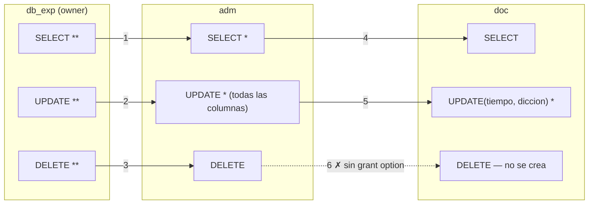

# Práctica del 08/09 — TP8 Seguridad

## Resumen general

El TP8 Seguridad (martes 08/09, presencial) trae tres ejercicios de `GRANT`, `REVOKE` y roles sobre
tres esquemas propios: el experimento lingüístico (`ALUMNO`/`PARRAFO`), la base de Voluntarios de la
Clase 05 y la tabla `USUARIO`. No hay dataset ni deck de práctica; la teórica que lo sustenta es la
[[Clase 11 - Seguridad-Transacciones]], solo sus slides 8 a 13. El motor es MySQL 9.7, y el propio
enunciado manda resolver en papel lo que MySQL no provee (1.b y 2).

Lo central es el grafo de permisos de GMUW cap. 10.1.5 y 10.1.6, que el deck no enseña: un nodo por
(usuario, privilegio), `**` para el owner, `*` para el grant option, y una regla: un privilegio
sobrevive a un `REVOKE … CASCADE` solo si conserva otro camino hasta el owner. De ahí las trampas
del TP: la sexta sentencia del ejercicio 1 falla en la teoría porque `adm` recibió `DELETE`
sin grant option (tener no es poder ceder); el `REVOKE UPDATE(tiempo)` a quien tiene `UPDATE` de
tabla se descompone por columnas y deja a `doc` solo con `UPDATE(diccion)`; el rol `ins_prov` de
2.h no existe (g creó `ins_vol`); y `DROP ROLE` revoca el rol de todas las cuentas sin borrar
usuarios.

MySQL responde distinto en cuatro puntos: no tiene owner, ni `PUBLIC`, ni `CASCADE`, y maneja el
`GRANT OPTION` como una marca por (cuenta, tabla) y no por privilegio, con lo que la sentencia 6 pasa
y las revocaciones nunca se propagan. Además, un rol otorgado no está activo sin `SET DEFAULT ROLE` o
`SET ROLE`, y desde 8.0 un `GRANT` a un usuario inexistente falla. Para el parcial: dibujar el grafo,
aplicar la regla del camino al owner, distinguir tener de poder ceder, y contestar siempre en dos
párrafos rotulados, uno con el estándar y otro con MySQL.

## Fuente y encuadre

> [!info] Fuente — práctica del martes 08/09, presencial. **Solo llegó el enunciado**
> `raw/Unidad-01/Practica/ITBA TP 8 Seguridad.pdf` · **3 páginas** · título literal *"TP N°8 -
> Seguridad"* · header `Base de Datos II - TP 8` · footer `ITBA - 2026`.
>
> **No hay deck de práctica** *(como todos los martes desde el 11/08)* **ni dataset** (ni `.sql`, ni
> CSV). Los ejercicios 1 y 2 traen su esquema **como imagen** *(344×144 px y 745×456 px)* y el 3 como
> una línea de texto → § *Los esquemas que hacen falta*. El ERD del ejercicio 2 es **el mismo del
> slide 5 de [[Clase 05 - Consultas de Datos–Parte 1]]** *(7 tablas, tipos Oracle)*. El texto extraído
> no trae ninguno de los dos esquemas: tipos y nulabilidades salen de los PNG renderizados a 250 dpi.
>
> **Teórica que lo sustenta:** [[Clase 11 - Seguridad-Transacciones]] *(lunes 07/09)*, y de sus 38
> slides **solo los slides 8 a 13** *(usuarios, `GRANT`, roles, `REVOKE`, ejemplos)*: el TP no toca
> transacciones, concurrencia, niveles de aislamiento ni índices.
>
> Calendario: [[_cronograma]] *(fila 08/09 — tema oficial: **"TP 8 - Seguridad"**)* ·
> Índice: [[_index-clases]] · TPs: `raw/tp/_index.md`

> [!important] (clave) El TP es de **grafos de permisos**, y el deck 11 **no tiene ninguno**
> El deck enseña la **sintaxis** de MySQL —`CREATE USER`, `GRANT … WITH GRANT OPTION`, `CREATE ROLE`,
> `REVOKE`, `FLUSH PRIVILEGES`— en seis slides. El TP pide **razonar la propagación** de privilegios
> —quién puede re-otorgar qué, qué se cae cuando el otorgante pierde el privilegio— y el ejercicio 1
> lo nombra: *"Realice el **grafo de permisos**"*. Ese formalismo está en la bibliografía
> obligatoria, **GMUW cap. 10.1.5 *Grant Diagrams* (impresa 431) y 10.1.6 *Revoking Privileges*
> (433)**. Hacen falta las dos cosas: la sintaxis del deck y el modelo del libro.

> [!warning] (crítico) El enunciado nombra a **MySQL** tres veces — dos de ellas **para decir que no alcanza**
> - Ej. 1.b: *"Resuelva el ejercicio desde la teoría, **ya que MySQL no provee la opción CASCADE**"*
> - Ej. 2: *"mediante las sentencias provistas por MySQL para el control de acceso"* y, dos líneas más
> abajo, *"**En el caso de que MySQL no provee la funcionalidad pedida, resuelvalo desde la
> teoría**"*
>
> Es el **tercer** TP consecutivo que separa el estándar de MySQL, y ya es el método de la cátedra:
> TP6 *(3.b/3.c: "en SQL estándar" vs. "las que puedan ser soportadas por MySQL")*, TP7 *(1.c: "aunque
> MySQL no soporta esta última opción, resuelvalo según la teoría"; 2.b: "aunque MySQL no lo soporta,
> responda según la teoría")* y ahora TP8 *(1.b y 2)*. La respuesta es siempre la misma: **dos
> párrafos rotulados**, uno con el estándar y otro con MySQL. Aquí, además, el enunciado **anticipa la
> brecha** antes de listar los ítems del ej. 2. Y el desfasaje es más profundo que una cláusula que
> falta: **el modelo de seguridad de MySQL no tiene *owner*, no tiene `PUBLIC`, no tiene `CASCADE` y
> maneja el `GRANT OPTION` como una marca por tabla, no por privilegio.** Las cuatro diferencias
> cambian la respuesta de algún ítem → § *Qué de este TP no se puede correr en MySQL*. Qué se rinde
> en el parcial sigue sin decirse → [[PostgreSQL]] § *Dudas abiertas*.

---

## Mapa rápido: qué pide cada ejercicio

| Ej. | Qué pide | Esquema | Usuarios | Qué se ejercita | ¿Corre en MySQL? |
| :---: | --- | --- | --- | --- | :---: |
| **1.a** | grafo de permisos de 6 `GRANT` en cadena, y detectar cuál falla | `ALUMNO`, `PARRAFO` *(owner `db_exp`)* | `db_exp` → `adm` → `doc` | `WITH GRANT OPTION`, privilegio **por columna** | (atención) corre, **pero con otro resultado** que la teoría |
| **1.b** | qué conserva `doc` tras dos `REVOKE … CASCADE` | ídem | ídem | **revocación en cascada**, revocación **parcial por columna** | ✗ *"desde la teoría"*, lo dice el enunciado |
| **2.a–f** | 6 sentencias de control de acceso sobre Voluntarios | **Voluntarios** *(el de la Clase 05)* | `U0` admin, `U1`, `U2`, `U3` | `ALL`, `GRANT OPTION`, **`PUBLIC`**, `REVOKE` | (atención) todo menos `PUBLIC` (d, f) |
| **2.g–j** | roles: crear, cargar, asignar, ampliar, eliminar | ídem | `U3`, `U4`, roles `ins_vol` / **`ins_prov`** | `CREATE ROLE`, `GRANT rol TO usuario`, `DROP ROLE` | ✓ **salvo el ítem h**, que como está escrito **no puede ejecutarse** |
| **3.a–c** | quién puede qué, y qué queda tras un `REVOKE … CASCADE` | `USUARIO(nro_u, nombre, tarea)` *(creada por `A`)* | `A` → `B`, `C`, `D` | grafo de nuevo, más pequeño; **notación `A.usuario`** | (atención) a y b.1 sí; **b.2 no** (`CASCADE`) |

De los **18 ítems** *(1.a, 1.b, 2.a–j, 3.a.1–3, 3.b.1–2, 3.c)*, **tres se resuelven solo en papel** por
decisión del enunciado *(1.b y los dos `PUBLIC` de 2.d/2.f)*, **uno no puede ejecutarse** porque nombra
un rol que no existe *(2.h)* y **uno usa `CASCADE`** *(3.b.2)*. El resto corre, con las salvedades del
§ *Qué de este TP no se puede correr en MySQL*. El TP **no reutiliza `esq_peliculas.sql`** *(el TP7 sí lo
había retomado en ej. 1 y 3)*: trae esquemas propios en los tres ejercicios.

---

## Lo que este TP aporta y la teórica no tenía

| | Qué agrega | Dónde |
| --- | --- | --- |
| **El grafo de permisos** | El deck 11 dice qué hace `WITH GRANT OPTION` en una línea *(slide 10: "permite que usuarioX maneje privilegios de otros usuarios")*. El TP obliga a **dibujar la cadena** y a seguirla cuando se corta | ej. 1.a, 3 |
| **Privilegios por columna** | `GRANT UPDATE(tiempo,diccion)` *(sentencia literal del ej. 1)* y el `UPDATE` sobre `horas_aportadas` / `nombre` que piden en prosa 2.g y 2.i. **El deck no lo menciona**: su lista de permisos del slide 10 es toda a nivel de tabla | ej. 1, 2.g, 2.i |
| **`REVOKE … CASCADE`** | **No está en el deck** *(el slide 12 da `REVOKE [permisos] ON … FROM …` a secas)*, y el enunciado avisa que MySQL no lo tiene | ej. 1.b, 3.b.2 |
| **Revocación parcial de un privilegio de tabla** | `REVOKE UPDATE(tiempo)` a quien tiene `UPDATE` sobre **toda** la tabla. El punto más fino del TP, y **no está ni en el deck ni explicado en el enunciado** | ej. 1.b |
| **`PUBLIC`** | *"todos los usuarios del sistema"*. Ni el deck ni MySQL lo tienen | ej. 2.d, 2.f |
| **El *owner*** | *"de la cual es owner el usuario db_exp"*, *"El usuario A ha creado la tabla"*. **MySQL no tiene dueños de objetos** | ej. 1, 3 |
| **Un `GRANT` que debe fallar** | *"si alguna de ellas arroja algún error"*: el TP espera que se detecte el `GRANT DELETE` de `adm`, que no tiene `GRANT OPTION` sobre `DELETE` | ej. 1.a |
| **Un rol que no existe** | `ins_prov` en h, i y j, cuando g creó `ins_vol`. *"explique en caso de que algún ítem no pueda ser ejecutado"* | ej. 2.h |
| **`DROP ROLE` con usuarios asignados** | *"¿qué sucede con los usuarios U3 y U4?"*. El slide 11 tiene `DROP ROLE` sin decir qué pasa con quienes lo tenían | ej. 2.j |

---

## Los esquemas que hacen falta, y de dónde salen

**El TP8 no trae `.sql`.** Los tres esquemas hay que crearlos a mano. Lo que sigue es **DDL propio, en
MySQL**, transcripto de las imágenes del PDF; los tipos Oracle del ERD de Voluntarios se traducen como
en los TPs anteriores. Para los `GRANT` **no hacen falta datos**: se ejecutan sobre tablas vacías y se
verifican con `SHOW GRANTS`.

### 1 · Esquema del experimento lingüístico — ejercicio 1

Imagen de la página 1 *(344×144 px)*, notación de Erwin/Power Designer *(compartimento superior = PK,
llave roja = FK)*: `ALUMNO(id_alumno PK, nombre_apellido, pais, fecha_nacimiento, sexo)` y
`PARRAFO(id_alumno PK + FK → ALUMNO, nro_parrafo PK, tiempo, diccion)`, donde `tiempo` es el tiempo de
lectura que mide el experimento. El diagrama **no trae tipos ni nulabilidades**: los del DDL son
elección propia, y **ninguna sentencia del ej. 1 depende de un tipo**. Solo importa que `tiempo` y
`diccion` sean columnas de `PARRAFO`, porque son las que recibe el `GRANT UPDATE(tiempo, diccion)`.

```sql
-- Propuesta propia, MySQL. Lo mínimo para que los GRANT del ejercicio 1 tengan sobre qué caer.
CREATE DATABASE IF NOT EXISTS experimento;
USE experimento;

CREATE TABLE alumno (
  id_alumno  INT  NOT NULL,
  nombre_apellido  VARCHAR(80)  NOT NULL,
  pais  VARCHAR(40),
  fecha_nacimiento  DATE,
  sexo  CHAR(1),
  PRIMARY KEY (id_alumno)
);

CREATE TABLE parrafo (
  id_alumno  INT  NOT NULL,
  nro_parrafo  INT  NOT NULL,
  tiempo  DECIMAL(8,2),  -- segundos de lectura, unidad propia
  diccion  VARCHAR(20),
  PRIMARY KEY (id_alumno, nro_parrafo),
  CONSTRAINT fk_parrafo_alumno FOREIGN KEY (id_alumno) REFERENCES alumno (id_alumno)
);
```

### 2 · Esquema de Voluntarios — ejercicio 2

Imagen de la página 2 *(745×456 px)*: **7 tablas**, tipos Oracle, FKs en rojo. Es el **mismo diagrama
del slide 5 de [[Clase 05 - Consultas de Datos–Parte 1]]** *(el esquema HR de Oracle renombrado)*.
Transcripción de lo que se lee a 250 dpi:

| Tabla | Columna | Tipo en el diagrama | Rol |
| --- | --- | --- | --- |
| **CONTINENTE** | `id_continente` | `NUMBER NOT NULL` | **PK** |
| | `nombre_continente` | `VARCHAR2(25) NULL` | |
| **PAIS** | `id_pais` | `CHAR(2) NOT NULL` | **PK** |
| | `nombre_pais` | `VARCHAR2(40) NULL` | |
| | `id_continente` | `NUMBER NOT NULL` | **FK** → `CONTINENTE` |
| **DIRECCION** | `id_direccion` | `NUMBER(4) NOT NULL` | **PK** |
| | `calle` | `VARCHAR2(40) NULL` | |
| | `codigo_postal` | `VARCHAR2(12) NULL` | |
| | `ciudad` | **`VARCHAR(30)`** `NOT NULL` | *sin el `2` — ver nota* |
| | `provincia` | **`VARCHAR(25)`** `NULL` | *ídem* |
| | `id_pais` | `CHAR(2) NOT NULL` | **FK** → `PAIS` |
| **INSTITUCION** | `id_institucion` | `NUMBER(4) NOT NULL` | **PK** |
| | `nombre_institucion` | `VARCHAR2(60) NOT NULL` | |
| | `id_director` | `NUMBER(6) NULL` | **FK** → `VOLUNTARIO` |
| | `id_direccion` | `NUMBER(4) NULL` | **FK** → `DIRECCION` |
| **VOLUNTARIO** | `nro_voluntario` | `NUMBER(6) NOT NULL` | **PK** |
| | `nombre` | `VARCHAR2(20) NULL` | ← **ej. 2.i** |
| | `apellido` | `VARCHAR2(25) NOT NULL` | |
| | `e_mail` | `VARCHAR2(25) NOT NULL` | |
| | `telefono` | `VARCHAR2(20) NULL` | |
| | `fecha_nacimiento` | `DATE NOT NULL` | |
| | `id_tarea` | `VARCHAR2(10) NOT NULL` | **FK** → `TAREA` |
| | `horas_aportadas` | `NUMBER(8,2) NULL` | ← **ej. 2.g** |
| | `porcentaje` | `NUMBER(2,2) NULL` | |
| | `id_institucion` | `NUMBER(4) NULL` | **FK** → `INSTITUCION` |
| | `id_coordinador` | `NUMBER(6) NULL` | **FK** → `VOLUNTARIO` *(recursiva)* |
| **TAREA** | `id_tarea` | `VARCHAR2(10) NOT NULL` | **PK** |
| | `nombre_tarea` | `VARCHAR2(35) NOT NULL` | |
| | `min_horas` | `NUMBER(6) NULL` | |
| | `max_horas` | `NUMBER(6) NULL` | |
| **HISTORICO** | `fecha_inicio` | `DATE NOT NULL` | **PK** (parte 1) |
| | `nro_voluntario` | `NUMBER(6) NOT NULL` | **PK** (parte 2) + **FK** → `VOLUNTARIO` |
| | `fecha_fin` | `DATE NOT NULL` | |
| | `id_tarea` | `VARCHAR2(10) NOT NULL` | **FK** → `TAREA` |
| | `id_institucion` | `NUMBER(4) NULL` | **FK** → `INSTITUCION` |

> [!note] `ciudad` y `provincia` dicen **`VARCHAR`**, no `VARCHAR2`
> A 250 dpi se lee sin ambigüedad: `ciudad: VARCHAR(30) NOT NULL` y `provincia: VARCHAR(25) NULL`. Es
> una inconsistencia **del diagrama original** *(mezcla `VARCHAR2` de Oracle con `VARCHAR` estándar)*,
> no del TP, y para el TP8 no cambia nada. La página de la Clase 05 § *Slide 5* las transcribió como
> `VARCHAR2` y habría que revisarla contra su propio PNG.

El TP solo toca **tres tablas**: `INSTITUCION` *(2.a, 2.e)*, `VOLUNTARIO` *(2.b, 2.c, 2.g, 2.i)* y
`TAREA` *(2.d, 2.f)*. Como `VOLUNTARIO` referencia a `INSTITUCION` y a `TAREA`, se crean en ese orden.
`institucion.id_director` → `voluntario` y `voluntario.id_institucion` → `institucion` forman un ciclo
*(el mismo que `esq_peliculas.sql` resuelve con un `DROP FOREIGN KEY`)*, por lo que la FK del director
se agrega **después** de crear las dos tablas.

```sql
-- Propuesta propia, MySQL. Traducción: NUMBER(n) → DECIMAL(n,0), NUMBER → INT, VARCHAR2 → VARCHAR.
CREATE DATABASE IF NOT EXISTS voluntarios;
USE voluntarios;

CREATE TABLE tarea (
  id_tarea  VARCHAR(10)  NOT NULL,
  nombre_tarea  VARCHAR(35)  NOT NULL,
  min_horas  DECIMAL(6,0),
  max_horas  DECIMAL(6,0),
  PRIMARY KEY (id_tarea)
);

CREATE TABLE institucion (
  id_institucion  DECIMAL(4,0)  NOT NULL,
  nombre_institucion  VARCHAR(60)  NOT NULL,
  id_director  DECIMAL(6,0),  -- FK a voluntario: se agrega al final (ciclo)
  id_direccion  DECIMAL(4,0),  -- FK a direccion: tabla no creada aquí
  PRIMARY KEY (id_institucion)
);

CREATE TABLE voluntario (
  nro_voluntario  DECIMAL(6,0)  NOT NULL,
  nombre  VARCHAR(20),
  apellido  VARCHAR(25)  NOT NULL,
  e_mail  VARCHAR(25)  NOT NULL,
  telefono  VARCHAR(20),
  fecha_nacimiento  DATE  NOT NULL,
  id_tarea  VARCHAR(10)  NOT NULL,
  horas_aportadas  DECIMAL(8,2),
  porcentaje  DECIMAL(2,2),
  id_institucion  DECIMAL(4,0),
  id_coordinador  DECIMAL(6,0),
  PRIMARY KEY (nro_voluntario),
  CONSTRAINT fk_vol_tarea  FOREIGN KEY (id_tarea)  REFERENCES tarea (id_tarea),
  CONSTRAINT fk_vol_institucion FOREIGN KEY (id_institucion) REFERENCES institucion (id_institucion),
  CONSTRAINT fk_vol_coordinador FOREIGN KEY (id_coordinador) REFERENCES voluntario (nro_voluntario)
);

ALTER TABLE institucion
  ADD CONSTRAINT fk_inst_director FOREIGN KEY (id_director) REFERENCES voluntario (nro_voluntario);
```

### 3 · `USUARIO` — ejercicio 3

Una sola línea de texto: *"El usuario A ha creado la tabla USUARIO(nro_u, nombre, tarea)"*, sin tipos.
El `INSERT` del punto a.2 pone `'C'` en `nro_u`, así que **`nro_u` es texto**, pese al prefijo `nro_`.

```sql
-- Propuesta propia. En MySQL "A.usuario" es la tabla usuario de la BASE DE DATOS A (ver § Qué no corre).
CREATE DATABASE IF NOT EXISTS A;
USE A;

CREATE TABLE usuario (
  nro_u  VARCHAR(10)  NOT NULL,
  nombre  VARCHAR(40),
  tarea  VARCHAR(40),
  PRIMARY KEY (nro_u)
);
```

---

## Setup del entorno

El motor es el contenedor de toda la cursada —`mysql:9.7.2`, usuario `root`/`root`— descrito en
[[MySQL]] § *Setup, tal como lo da la práctica*. Lo que cambia es que aquí hace falta **más de una
sesión**: para comprobar que `doc` no puede hacer algo hay que conectarse **como `doc`**. `SHOW GRANTS
FOR` desde root evita abrirlas, pero no muestra si un rol está activo.

```bash
# Sesión de administrador (el "U0" del ejercicio 2, el "db_exp" del 1, el "A" del 3, o root)
docker exec -it MyMySql mysql -u root -p

# Sesión de un usuario cualquiera, para probar qué puede y qué no
docker exec -it MyMySql mysql -u doc -p
docker exec -it MyMySql mysql -u U2 -p
```

**Todos los usuarios que nombra el TP hay que crearlos antes**: desde MySQL 8.0 un `GRANT` a un usuario
inexistente **no lo crea, falla** *(`ERROR 1410`; § *Qué no corre*, fila 1)*. Los tres ejercicios
nombran **once cuentas** *(más `U0`, que es `root`)*: diez las dan por existentes y la restante, `U4`,
la crea el propio ítem 2.h.

```sql
-- Ejercicio 1
CREATE USER 'db_exp'@'%' IDENTIFIED BY 'db_exp';
CREATE USER 'adm'@'%'  IDENTIFIED BY 'adm';
CREATE USER 'doc'@'%'  IDENTIFIED BY 'doc';

-- Ejercicio 2 (U0 es root, o un administrador creado con ALL ON *.* … WITH GRANT OPTION)
CREATE USER 'U1'@'%' IDENTIFIED BY 'u1';
CREATE USER 'U2'@'%' IDENTIFIED BY 'u2';
CREATE USER 'U3'@'%' IDENTIFIED BY 'u3';
-- U4 lo crea el propio ítem 2.h

-- Ejercicio 3
CREATE USER 'A'@'%' IDENTIFIED BY 'a';
CREATE USER 'B'@'%' IDENTIFIED BY 'b';
CREATE USER 'C'@'%' IDENTIFIED BY 'c';
CREATE USER 'D'@'%' IDENTIFIED BY 'd';
```

> [!warning] Tres detalles de MySQL que fallan **antes** del primer `GRANT`
> 1. **La cuenta es `'usuario'@'host'`**, no `usuario`. Si se omite el host, MySQL asume **`'%'`**
> *(slide 9 del deck: "`'%'` es un comodín que permite conexiones desde cualquier IP")*. Un
> `GRANT … TO 'doc'@'localhost'` y un `GRANT … TO 'doc'@'%'` son **dos cuentas distintas**.
> 2. **Los nombres de usuario distinguen mayúsculas**: `'U1'` y `'u1'` son cuentas diferentes. El TP
> escribe `U1`…`U4` y `A`…`D` en mayúscula; conviene respetarlo.
> 3. **Para simular al *owner* hay que dárselo a mano.** MySQL no tiene dueños de objeto: `db_exp` y
> `A` reciben sus privilegios **de root**, con `GRANT OPTION`, y recién entonces pueden re-otorgar.

```sql
-- Simulación del owner: root le da a db_exp y a A todo sobre su base, transferible
GRANT ALL PRIVILEGES ON experimento.* TO 'db_exp'@'%' WITH GRANT OPTION;
GRANT ALL PRIVILEGES ON A.* TO 'A'@'%'  WITH GRANT OPTION;
```

### Cómo ver el estado de los permisos

Las tablas `mysql.tables_priv` y `mysql.columns_priv` no aparecen en ningún deck y son lo único que
muestra la marca `Grant`: la forma más rápida de ver por qué la teoría y MySQL divergen en el ej. 1.

```sql
-- Lo que el deck enseña (slide 11): la vista "amigable"
SHOW GRANTS FOR 'doc'@'%';
SHOW GRANTS FOR 'U3'@'%' USING 'ins_vol';  -- qué tendría U3 con el rol activo

-- Lo que el deck NO enseña, y es lo que hace visible la diferencia con la teoría:
-- las tablas de privilegios, donde 'Grant' es UNA marca por (usuario, tabla)
SELECT User, Host, Db, Table_name, Table_priv, Column_priv FROM mysql.tables_priv;
SELECT User, Host, Db, Table_name, Column_name, Column_priv FROM mysql.columns_priv;

-- Desde la sesión del propio usuario
SELECT CURRENT_USER();  -- la cuenta con la que se autenticó ('doc'@'%')
SELECT CURRENT_ROLE();  -- los roles activos en esta sesión (NONE si no activó ninguno)
SHOW GRANTS;  -- lo mismo que SHOW GRANTS FOR CURRENT_USER()
```

---

## Cheatsheet — la teoría del TP contra el MySQL del deck

| Concepto *(como lo usa el TP)* | SQL estándar / GMUW 10.1 | MySQL 9.7 *(deck 11, slides 8–13, + manual)* |
| --- | --- | --- |
| **Owner** | Quien crea la tabla tiene **todos** los privilegios sobre ella, con grant option, y es la raíz del grafo (`**` en GMUW) | ✗ **No existe.** Crear una tabla no da ningún privilegio sobre ella; los privilegios vienen de `GRANT` a nivel global, de base o de tabla |
| **Otorgar** | `GRANT priv ON tabla TO usuario [WITH GRANT OPTION]` | Igual, con `'usuario'@'host'` y `base.tabla` *(slide 10)*. **El usuario debe existir** |
| **`WITH GRANT OPTION`** | Se adjunta **a cada privilegio**: se puede tener `SELECT*` y `DELETE` sin `*` sobre la misma tabla | (crítico) Es **un único privilegio `GRANT OPTION` por nivel** *(global, base, tabla)*: si se tiene sobre la tabla, sirve para re-otorgar **cualquier** privilegio que se tenga sobre ella |
| **Privilegio por columna** | `UPDATE(col1, col2)`, `SELECT(col)`, `INSERT(col)`, `REFERENCES(col)` | ✓ Los mismos cuatro. **El deck no lo menciona** |
| **Revocar** | `REVOKE priv ON tabla FROM usuario {CASCADE \| RESTRICT}` | `REVOKE priv ON base.tabla FROM 'usuario'@'host'` *(slide 12)*. **Sin `CASCADE` ni `RESTRICT`**: la revocación **nunca se propaga** |
| **`PUBLIC`** | Pseudo-usuario que representa a todos, presentes y futuros | ✗ **No existe.** Sustituto: un rol en la variable `mandatory_roles`, o `GRANT` a cada cuenta |
| **Roles** | SQL:1999: `CREATE ROLE`, `GRANT rol TO usuario`, `GRANT priv TO rol` | ✓ Desde 8.0 *(slide 11)*. (crítico) **Un rol otorgado no está activo hasta `SET DEFAULT ROLE` o `SET ROLE`** |
| **`DROP ROLE`** | Los grantees pierden lo que venía por el rol | Igual: se revoca de todas las cuentas que lo tenían *(manual, § DROP ROLE Statement — pendiente de verificar; el slide 11 solo trae la sentencia)* |
| **`FLUSH PRIVILEGES`** | — | El slide 12 dice que *"se deben refrescar"* tras cada `GRANT`/`REVOKE`. (nota) **Solo hace falta si se editaron las tablas `mysql.*` a mano**; `GRANT` y `REVOKE` recargan solos → § *Contradicciones* |
| **Verificar** | catálogo `INFORMATION_SCHEMA` (`TABLE_PRIVILEGES`, `COLUMN_PRIVILEGES`) | `SHOW GRANTS FOR …` *(slide 11)* · `mysql.tables_priv` · `mysql.columns_priv` · `INFORMATION_SCHEMA.TABLE_PRIVILEGES` |

Bibliografía verificada contra las fichas: **GMUW cap. 10.1** *Security and User Authorization in SQL*
(impresa 425–436), en particular **10.1.4** *Granting Privileges* (430), **10.1.5** *Grant Diagrams* (431)
y **10.1.6** *Revoking Privileges* (433), **la** fuente del ejercicio 1. **Date 8ª ed. cap. 17.2**
*Discretionary Access Control* (506) y **17.6** *SQL Facilities* (523) para `GRANT`/`REVOKE` en el
estándar. Ningún libro del vault cubre los roles ni `mandatory_roles` de MySQL: **`—`**, la fuente es el
manual 9.7 → [[MySQL]] § *Bibliografía de MySQL*.

---

## Ejercicio 1 — el grafo de permisos de `PARRAFO`

### Consigna *(transcripción literal del PDF)*

> **1.** Considere la siguiente fracción de un esquema de la cual es owner el usuario *db_exp*, que
> registra datos de experimentos lingüísticos con respecto al uso de párrafos. El experimento mide el
> tiempo de lectura de cada párrafo por parte de cada alumno (tabla PARRAFO).
>
> *[ERD: `ALUMNO(id_alumno, nombre_apellido, pais, fecha_nacimiento, sexo)` —
> `PARRAFO(id_alumno (FK), nro_parrafo, tiempo, diccion)`]*
>
> - Suponga que el usuario *db_exp* ejecuta las siguientes sentencias:
> `GRANT SELECT ON parrafo TO adm WITH GRANT OPTION;`
> `GRANT UPDATE ON parrafo TO adm WITH GRANT OPTION;`
> `GRANT DELETE ON parrafo TO adm;`
> - Luego el usuario *adm* ejecuta las siguientes sentencias:
> `GRANT SELECT ON parrafo TO doc;`
> `GRANT UPDATE(tiempo,diccion) ON parrafo TO doc WITH GRANT OPTION;`
> `GRANT DELETE ON parrafo TO doc;`
>
> **a.** Realice el grafo de permisos correspondiente a las sentencias indicadas anteriormente.
> Analice que sucede en cada caso y si alguna de ellas arroja algún error
>
> **b.** Enumere los permisos que conserva el usuario *doc* sobre la tabla PARRAFO, si el usuario
> *db_exp* ejecuta las siguientes sentencias. Resuelva el ejercicio desde la teoría, ya que MySQL no
> provee la opción CASCADE:
>
> `REVOKE SELECT ON parrafo FROM adm CASCADE;`
> `REVOKE UPDATE(tiempo) ON parrafo FROM adm CASCADE;`

### 1.a · Las seis sentencias, una por una — *según la teoría*

Notación de GMUW 10.1.5: un nodo por **(usuario, privilegio)**; `**` marca al *owner*, `*` marca
*con grant option*; una arista va del privilegio del otorgante al privilegio otorgado. Un nodo
**solo se crea si el otorgante tiene ese privilegio con `*` o `**`**.

| # | Quién | Sentencia | ¿Puede? | Por qué | Nodo que crea |
| :---: | --- | --- | :---: | --- | --- |
| 1 | `db_exp` | `GRANT SELECT ON parrafo TO adm WITH GRANT OPTION` | ✓ | Es el owner: tiene `SELECT**` | `adm · SELECT *` |
| 2 | `db_exp` | `GRANT UPDATE ON parrafo TO adm WITH GRANT OPTION` | ✓ | Ídem, `UPDATE**` sobre **todas** las columnas | `adm · UPDATE *` *(todas las columnas)* |
| 3 | `db_exp` | `GRANT DELETE ON parrafo TO adm` | ✓ | Ídem. **Sin grant option** | `adm · DELETE` *(sin `*`)* |
| 4 | `adm` | `GRANT SELECT ON parrafo TO doc` | ✓ | `adm` tiene `SELECT *` | `doc · SELECT` |
| 5 | `adm` | `GRANT UPDATE(tiempo,diccion) ON parrafo TO doc WITH GRANT OPTION` | ✓ | `adm` tiene `UPDATE *` sobre toda la tabla, que **implica** `UPDATE(tiempo)` y `UPDATE(diccion)` con `*`. Puede ceder un subconjunto de columnas, y puede cederlo con grant option | `doc · UPDATE(tiempo, diccion) *` |
| **6** | `adm` | `GRANT DELETE ON parrafo TO doc` | ✗ **ERROR** | `adm` tiene `DELETE` **sin grant option** *(sentencia 3)*. Tener un privilegio no habilita a cederlo | **ninguno** |

> [!important] (clave) La sentencia 6 es **la** respuesta del punto a: *"si alguna de ellas arroja algún error"*
> Las dos primeras concesiones a `adm` llevan `WITH GRANT OPTION` y la tercera **no**; cuando `adm`
> re-otorga las tres, **las dos primeras pasan y la tercera falla**. `adm` **sí puede borrar** de
> `PARRAFO`; lo que no puede es **autorizar a otro** a hacerlo. Es la distinción entre *tener* y
> *poder ceder* que el slide 10 comprime en una línea.

**El grafo, después de las seis sentencias** *(la arista punteada es el intento fallido)*:



En texto, para el que lo dibuje en papel:

```
db_exp·SELECT** ──(1)──►  adm·SELECT* ──(4)──►  doc·SELECT
db_exp·UPDATE** ──(2)──►  adm·UPDATE* ──(5)──►  doc·UPDATE(tiempo,diccion)*
db_exp·DELETE** ──(3)──►  adm·DELETE  ──(6)──✗  (doc·DELETE no existe)
```

> [!note] Dos convenciones que hay que declarar al dibujarlo
> - **Un nodo por privilegio, no por usuario.** GMUW dibuja `adm·SELECT*` y `adm·UPDATE*` como nodos
> separados, porque cada uno se revoca por separado. Un solo nodo "adm" con tres etiquetas oculta
> exactamente lo que el punto b pregunta.
> - **El privilegio de columna es un nodo propio**, hijo del privilegio de tabla que lo implica.
> `adm·UPDATE*` implica `adm·UPDATE(tiempo)*` y `adm·UPDATE(diccion)*`, dos nodos implícitos que
> conviene dibujar: son los que sostienen a `doc·UPDATE(tiempo,diccion)*` y los que corta el
> segundo `REVOKE` del punto b.

### 1.a · Y en MySQL, la sentencia 6 **no falla**

> [!bug] (crítico) En MySQL las seis sentencias pasan — y el grafo queda **distinto** del de la teoría
> En MySQL el `GRANT OPTION` **no se adjunta a un privilegio: es un privilegio más, por nivel**. En
> `mysql.tables_priv`, la columna `Table_priv` es un `SET('Select','Insert','Update','Delete',…,'Grant',…)`:
> `'Grant'` es **una marca por (cuenta, tabla)**, y la regla para otorgar es *tener `GRANT OPTION` en
> ese nivel* **y** *tener el privilegio que se otorga*. La sentencia 1 le da a `adm` la marca `Grant`
> sobre `parrafo`; la 3 le da `Delete`; al llegar a la 6, `adm` **tiene las dos cosas que MySQL pide**
> → `doc` recibe `DELETE`. **El `WITH GRANT OPTION` que faltaba en la sentencia 3 no restringe nada,
> porque la marca ya estaba.**
>
> El manual advierte que hay que tener cuidado a quién se le da `GRANT OPTION`, porque **dos usuarios
> con privilegios distintos pueden combinarlos**. *(Razonamiento propio sobre la estructura de
> `tables_priv`; el número de error y la frase exacta del manual 9.7 quedan **pendiente de
> verificar** → § Dudas abiertas.)*

Segunda consecuencia, menos visible: la sentencia 5 le pone a `doc` la marca `Grant` sobre `parrafo`,
y a partir de ahí `doc` puede re-otorgar **`SELECT`** —que recibió **sin** grant option en la
sentencia 4— porque MySQL no distingue con qué privilegio vino la marca. Con `mysql.tables_priv` se ve
directo:

```sql
SELECT User, Table_name, Table_priv, Column_priv FROM mysql.tables_priv WHERE Db = 'experimento';
-- User | Table_name | Table_priv  | Column_priv
-- adm  | parrafo  | Select,Update,Delete,Grant | 
-- doc  | parrafo  | Select,Delete,Grant  | Update  ← 'Grant' vino con el UPDATE(cols), pero cubre el SELECT
```

| | Teoría *(GMUW / estándar)* | MySQL 9.7 |
| --- | --- | --- |
| Sentencia 6 | ✗ error: `adm` no tiene `DELETE*` | ✓ pasa: `adm` tiene `Delete` + marca `Grant` |
| `doc` puede re-otorgar `SELECT` | ✗ no: lo recibió sin `*` | ✓ sí: tiene la marca `Grant` por la sentencia 5 |
| `doc` tiene `DELETE` | ✗ no | ✓ sí |

### 1.b · Qué conserva `doc` tras los dos `REVOKE … CASCADE` — *según la teoría*

Regla de GMUW 10.1.6: al revocar con `CASCADE` se borra el nodo revocado y, después, **todo nodo que
haya quedado sin un camino hasta un nodo `**`** *(del owner)*. Un privilegio sobrevive solo si tiene
**otra** fuente.

**`REVOKE SELECT ON parrafo FROM adm CASCADE;`**

1. Se borra `adm · SELECT *`.
2. `doc · SELECT` tenía una sola arista de entrada, desde ese nodo. **Queda sin camino al owner → se
  borra.** `doc` pierde `SELECT`.

**`REVOKE UPDATE(tiempo) ON parrafo FROM adm CASCADE;`** — el difícil

`adm` no tiene un privilegio *"UPDATE(tiempo)"*: tiene **`UPDATE` sobre toda la tabla**, que lo
implica. En el modelo del estándar, **el privilegio de tabla equivale al conjunto de privilegios de
columna**, y se retira uno del conjunto.

3. `adm · UPDATE *` se **descompone**: pierde `UPDATE(tiempo)` y conserva
  `UPDATE(id_alumno, nro_parrafo, diccion) *`.
4. En cascada, `doc · UPDATE(tiempo, diccion) *` pierde la parte que dependía del nodo borrado:
  **conserva `UPDATE(diccion) *`** y pierde `UPDATE(tiempo)`.

**Respuesta: `doc` conserva un solo privilegio sobre `PARRAFO` — `UPDATE(diccion)`, con grant
option.** `SELECT` y `UPDATE(tiempo)` cayeron en cascada, y `DELETE` nunca lo tuvo *(sentencia 6
fallida)*.

```
Antes  Después de los dos REVOKE … CASCADE
doc·SELECT  (borrado — cascada del 1er REVOKE)
doc·UPDATE(tiempo,diccion)* doc·UPDATE(diccion)* ← lo único que queda
(doc·DELETE nunca existió)  —
```

> [!warning] (atención) Hay una **segunda lectura** del segundo `REVOKE`, y conviene nombrarla al entregar
> Si se toma el privilegio de tabla como **atómico** —`adm` tiene *"UPDATE"*, no *"UPDATE sobre cada
> columna"*—, `REVOKE UPDATE(tiempo) FROM adm` **no encuentra qué revocar**: la sentencia es un error,
> nada cambia y `doc` conserva `UPDATE(tiempo, diccion) *`. **Esa es la lectura de MySQL** *(ver
> abajo)*; la del estándar es la de la descomposición. Como el enunciado dice *"desde la teoría"*, la
> respuesta principal es la descomposición, **pero cuál de las dos espera la cátedra es una pregunta
> para el docente**, y GMUW 10.1.6 es donde verificar cómo trata el libro la revocación parcial.

> [!tip] Cómo cerrar el punto b al entregar
> Enumerar **los tres estados de `doc`** en una tabla: *antes*, *tras el 1er REVOKE*, *tras el 2do*, y
> decir la regla: *"un privilegio sobrevive a un `CASCADE` solo si le queda otro camino hasta el
> owner"*. `doc` tenía **un solo camino para todo** —vía `adm`—, así que todo lo que `adm` pierde,
> `doc` lo pierde. Si `db_exp` le hubiera otorgado `SELECT` a `doc` **directamente**, ese `SELECT`
> habría sobrevivido: es el caso que el ejercicio 3 explora.

### 1.b · Y en MySQL

| Sentencia | En MySQL | Efecto sobre `doc` |
| --- | --- | --- |
| `REVOKE SELECT ON parrafo FROM adm CASCADE` | (crítico) **`CASCADE` es error de sintaxis** (`ERROR 1064`). Sin la palabra, `REVOKE SELECT ON experimento.parrafo FROM 'adm'@'%'` **sí corre** | **Ninguno.** `adm` pierde `SELECT`; **`doc` lo conserva**, porque MySQL no registra *quién* otorgó qué y no propaga nada |
| `REVOKE UPDATE(tiempo) ON parrafo FROM adm CASCADE` | (crítico) Ídem `CASCADE`. Y sin él, **también falla**: `adm` tiene `UPDATE` de **tabla**, no de columna; MySQL no descompone → `ERROR 1147 There is no such grant defined for user 'adm' on host '%' on table 'parrafo'` *(número **pendiente de verificar**)* | **Ninguno** |

**En MySQL, `doc` conserva todo lo que tenía: `SELECT`, `UPDATE(tiempo, diccion)`, `DELETE` y la
marca `Grant`.** Por eso el enunciado manda resolverlo *"desde la teoría"*: en el motor de la cursada
**el ejercicio no tiene contenido**. No es un detalle de sintaxis sino un **modelo de seguridad
distinto**: en el estándar el grafo tiene memoria *(cada privilegio sabe de dónde vino)*; en MySQL las
tablas `mysql.*` guardan **el estado final** y nada más. Para lograr en MySQL el efecto de un `CASCADE`
hay que revocar **a mano** a cada beneficiario, y para saber quiénes son hay que haberlo anotado fuera
del motor.

---

## Ejercicio 2 — Voluntarios: diez ítems de control de acceso

### Consigna *(transcripción literal del PDF)*

> **2.** Considere esta base de Voluntarios y suponga que las siguientes acciones son ejecutadas por
> un usuario U0 con privilegios de administrador:
>
> *[ERD de Voluntarios — 7 tablas, transcripto en § Los esquemas que hacen falta]*
>
> Resuelva los siguientes ítems mediante las sentencias provistas por MySQL para el control de
> acceso. Considerando que las operaciones se realizan en el orden indicado y son consecutivas,
> explique en caso de que algún ítem no pueda ser ejecutado.
> En el caso de que MySQL no provee la funcionalidad pedida, resuelvalo desde la teoría:
>
> **a.** Conceder al usuario U1 todos los privilegios sobre la tabla INSTITUCION, con posibilidad de
> concederlos a otros usuarios
> **b.** Permitir que el usuario U2 consulte datos de la tabla VOLUNTARIO
> **c.** Permitir que el usuario U2 autorice al usuario U3 para que pueda insertar en la tabla
> VOLUNTARIO
> **d.** Dar a todos los usuarios del sistema, privilegios de inserción y actualización sobre la
> tabla TAREA. ¿Cuál sería la diferencia si se incluye o no la cláusula WITH GRANT OPTION?
> **e.** Retirarle a U1 el privilegio de borrado sobre la tabla INSTITUCION
> **f.** Quitar el privilegio de inserción a todos los usuarios sobre la tabla TAREA. ¿Qué usuario
> podría entonces insertar datos en esa tabla?
> **g.** Crear un rol ins_vol con capacidad de actualizar datos en el campo *horas_aportadas* de la
> tabla VOLUNTARIO
> **h.** Crear el usuario U4 y asignarle el rol ins_prov. También asignárselo al usuario U3
> **i.** Permitir que los usuarios con el rol ins_prov puedan también actualizar el campo *nombre*
> de la tabla VOLUNTARIO
> **j.** Eliminar el rol ins_prov ¿qué sucede con los usuarios U3 y U4?

> [!note] Tres cosas que el enunciado fija y que condicionan las respuestas
> 1. **"en el orden indicado y son consecutivas"**: el estado de cada ítem depende de los anteriores.
> Por eso el **h** falla *(el rol de g se llama distinto)* y por eso el **f** tiene respuesta.
> 2. **"explique en caso de que algún ítem no pueda ser ejecutado"**: el enunciado **espera** que
> algún ítem no pueda. Hay uno claro *(h)* y dos por carencia del motor *(d, f)*.
> 3. **U0 "con privilegios de administrador"**: en MySQL es `root`, o una cuenta con
> `ALL PRIVILEGES ON *.* … WITH GRANT OPTION`. U1, U2 y U3 se asumen creados *(§ Setup)*; el único
> que el TP crea explícitamente es **U4**, en h.

Todo lo que sigue asume `USE voluntarios;` y que las cuentas son `'Un'@'%'`.

### 2.a · Todos los privilegios sobre `INSTITUCION` a U1, transferibles

```sql
GRANT ALL PRIVILEGES ON voluntarios.institucion TO 'U1'@'%' WITH GRANT OPTION;
```

✓ Corre. **`ALL` a nivel de tabla** se expande a los privilegios **de tabla** que existen en MySQL
*(`SELECT, INSERT, UPDATE, DELETE, CREATE, DROP, REFERENCES, INDEX, ALTER, CREATE VIEW, SHOW VIEW,
TRIGGER`)* y **no** incluye `GRANT OPTION`: por eso el *"con posibilidad de concederlos a otros"*
necesita la cláusula explícita. El slide 10 lo lista como *"ALL : esta opción otorga todos los
permisos"* *[sic, con el espacio]* y a `WITH GRANT OPTION` como una opción aparte. `SHOW GRANTS FOR
'U1'@'%'` lo muestra como `GRANT ALL PRIVILEGES ON voluntarios.institucion TO 'U1'@'%' WITH GRANT
OPTION` *(MySQL lo imprime con los identificadores entre acentos graves)*.

### 2.b · U2 consulta `VOLUNTARIO`

```sql
GRANT SELECT ON voluntarios.voluntario TO 'U2'@'%';
```

✓ Corre. Sin grant option: U2 puede leer, no puede ceder la lectura.

### 2.c · U2 debe poder autorizar a U3 a insertar en `VOLUNTARIO`

Para que U2 **autorice** un `INSERT`, U2 tiene que **tener** `INSERT` **y** poder cederlo, y solo tiene
`SELECT` *(b)*. Son **dos pasos, ejecutados por dos usuarios distintos**:

```sql
-- U0: le da a U2 el INSERT, transferible
GRANT INSERT ON voluntarios.voluntario TO 'U2'@'%' WITH GRANT OPTION;

-- U2 (en su propia sesión): autoriza a U3
GRANT INSERT ON voluntarios.voluntario TO 'U3'@'%';
```

✓ Corre. Y aquí aparece **por segunda vez** la diferencia del `GRANT OPTION` de MySQL:

> [!warning] Con esto, U2 también puede ceder el **`SELECT`** de b — en MySQL, no en la teoría
> El `WITH GRANT OPTION` del `INSERT` le pone a U2 la marca `Grant` sobre `voluntario`. Como U2 tiene
> `Select` *(b)* y ahora `Grant`, **puede ejecutar `GRANT SELECT ON voluntarios.voluntario TO 'U3'@'%'`**,
> aunque U0 nunca quiso eso. En la teoría, U2 tendría `INSERT*` y `SELECT` *(sin `*`)*, y el
> `GRANT SELECT` fallaría. **Lo que pide el ítem y nada más no se puede expresar en MySQL.**

### 2.d · Inserción y actualización sobre `TAREA` para **todos los usuarios** — y el `WITH GRANT OPTION`

**Según la teoría** *(SQL estándar, GMUW 10.1.4)*: existe el pseudo-usuario **`PUBLIC`**, que representa
a **todos los usuarios, incluidos los que se creen después**:

```sql
-- Estándar SQL — NO corre en MySQL
GRANT INSERT, UPDATE ON tarea TO PUBLIC;
GRANT INSERT, UPDATE ON tarea TO PUBLIC WITH GRANT OPTION;  -- la variante que pregunta el ítem
```

**En MySQL**: ✗ **`PUBLIC` no existe.** Hay dos sustitutos, y ninguno es equivalente:

```sql
-- Sustituto 1 — un rol obligatorio (mandatory role): lo tienen TODAS las cuentas, presentes y futuras
CREATE ROLE 'todos_tarea';
GRANT INSERT, UPDATE ON voluntarios.tarea TO 'todos_tarea';
SET PERSIST mandatory_roles = 'todos_tarea';
SET PERSIST activate_all_roles_on_login = ON;  -- si no, el rol está otorgado pero INACTIVO

-- Sustituto 2 — enumerar las cuentas que existen hoy (no cubre a las futuras)
GRANT INSERT, UPDATE ON voluntarios.tarea TO 'U1'@'%', 'U2'@'%', 'U3'@'%';
```

| | `PUBLIC` *(teoría)* | rol en `mandatory_roles` *(MySQL)* | `GRANT` a cada cuenta *(MySQL)* |
| --- | :---: | :---: | :---: |
| Cubre a usuarios **futuros** | ✓ | ✓ | ✗ |
| Se revoca en **una** sentencia *(ítem f)* | ✓ | ✓ *(al rol)* | ✗ una por cuenta |
| Necesita configuración global del servidor | ✗ | ✓ `SET PERSIST` | ✗ |
| Está en el deck | ✗ | ✗ | ✗ |

**¿Qué cambia con `WITH GRANT OPTION`?**

- **Sin** la cláusula: todos pueden insertar y actualizar en `TAREA`, y **solo U0** decide quién más.
  El privilegio tiene **una única fuente** en el grafo: el nodo `PUBLIC`.
- **Con** la cláusula: **cada usuario del sistema puede a su vez otorgar `INSERT`/`UPDATE` sobre
  `TAREA` a otros**. Para los usuarios de hoy no cambia nada; lo que cambia es **el grafo**: aparecen
  aristas usuario → usuario y, por lo tanto, **caminos alternativos** al de `PUBLIC`. Revocar de
  `PUBLIC` con `CASCADE` arrastra esas aristas *(todas descienden de la de `PUBLIC`)*, pero **un
  `REVOKE … RESTRICT` fallaría** por tener dependientes. Además, **cualquiera puede darle `INSERT` a
  un usuario que se cree mañana** aunque U0 haya cambiado de idea: se pierde el control centralizado.
- **En MySQL**, agregar `WITH GRANT OPTION` al `GRANT … TO 'todos_tarea'` le pone la marca `Grant` al
  rol, y **todo usuario con el rol activo la hereda**: todos pueden re-otorgar cualquier privilegio
  que tengan sobre `tarea`. Y como no hay cascada, **cada re-otorgamiento es permanente** hasta que
  alguien lo revoque a mano.

### 2.e · Quitarle a U1 el borrado sobre `INSTITUCION`

```sql
REVOKE DELETE ON voluntarios.institucion FROM 'U1'@'%';
```

✓ Corre. U1 conserva el resto de `ALL` **y la marca `Grant`**; `SHOW GRANTS` pasa de
`ALL PRIVILEGES` a la lista explícita sin `DELETE`. Si U1 ya había cedido `DELETE` a alguien *(a lo dio
con grant option)*, ese alguien **lo conserva** en MySQL; en la teoría, el `REVOKE` tendría que llevar
`CASCADE` *(y arrastrar a los beneficiarios)* o `RESTRICT` *(y fallar)*. Es el mismo punto del ej. 1.b,
ahora sin que el enunciado lo avise.

### 2.f · Quitar el `INSERT` sobre `TAREA` a todos — ¿quién puede insertar entonces?

```sql
-- Teoría
REVOKE INSERT ON tarea FROM PUBLIC CASCADE;

-- MySQL, con el sustituto 1 de d
REVOKE INSERT ON voluntarios.tarea FROM 'todos_tarea';
-- (con el sustituto 2: una sentencia por cuenta)
```

**¿Quién puede insertar después?**

1. **U0**, el administrador *(en la teoría, además, el owner de `TAREA`)*: sus privilegios no pasan
  por `PUBLIC`.
2. **Cualquiera que tenga `INSERT` sobre `TAREA` por un camino que no dependa de `PUBLIC`**, por
  ejemplo una cuenta a la que U0 se lo haya dado **directamente**. En el estado que construye el TP
  **no hay ninguna**: U1 tiene `ALL` sobre `INSTITUCION`, no sobre `TAREA`; U2 y U3 tienen cosas
  sobre `VOLUNTARIO`.
3. Si el d se hizo **con `GRANT OPTION`** y algún usuario re-otorgó `INSERT` a otro, en la teoría
  **el `CASCADE` arrastra también esas aristas** *(descienden de `PUBLIC`)* y la respuesta sigue
  siendo *"solo U0"*. **En MySQL, esas re-concesiones sobreviven**, y U0 no tiene cómo saber que
  existen salvo leyendo `mysql.tables_priv`.

**Respuesta corta: solo U0 (y, en MySQL, `root` o cualquier cuenta con `INSERT` global o de base de
datos — `GRANT INSERT ON voluntarios.* …` no pasa por la tabla y no se ve afectado).**

> [!tip] El ítem f es el que le da sentido a la pregunta de d
> *Sin* `GRANT OPTION`, revocar de `PUBLIC` deja la tabla como estaba antes de d. *Con* `GRANT OPTION`,
> revocar de `PUBLIC` **puede no alcanzar** *(si se usa `RESTRICT`, o si el motor no propaga)*. Es el
> argumento para **no** dar `GRANT OPTION` a `PUBLIC` nunca.

### 2.g · Rol `ins_vol` con `UPDATE` sobre `VOLUNTARIO.horas_aportadas`

```sql
CREATE ROLE 'ins_vol';
GRANT UPDATE (horas_aportadas) ON voluntarios.voluntario TO 'ins_vol';
```

✓ Corre. Privilegio **por columna** a un **rol**: MySQL admite las dos cosas. Verificable con
`SHOW GRANTS FOR 'ins_vol'` → `GRANT UPDATE (horas_aportadas) ON voluntarios.voluntario TO 'ins_vol'@'%'`.
El rol se llama `ins_vol` y **no inserta nada: actualiza**. El prefijo `ins_` despista, pero el nombre
es libre y **no restringe nada**: lo que puede hacer un rol es exactamente lo que se le otorgó.

### 2.h · Crear U4 y asignarle el rol `ins_prov`; también a U3 — **no puede ejecutarse como está**

```sql
CREATE USER 'U4'@'%' IDENTIFIED BY 'u4';  -- ✓ corre
GRANT 'ins_prov' TO 'U4'@'%', 'U3'@'%';  -- ✗ ERROR 3523: Unknown authorization ID 'ins_prov'@'%'
```

(crítico) **El rol `ins_prov` no existe.** El ítem g creó **`ins_vol`**; ningún ítem anterior creó `ins_prov`.
Como las operaciones son *"consecutivas y en el orden indicado"*, en el momento de h **no hay nada
que asignar**, y MySQL lo rechaza. **Es el ítem que el enunciado anticipa con *"explique en caso de
que algún ítem no pueda ser ejecutado"*.** Dos formas de seguir, y hay que **declarar cuál se toma**:

| Lectura | Qué se hace | Consecuencia para i y j |
| --- | --- | --- |
| **(A) Es una errata: `ins_prov` = `ins_vol`** | Se ejecuta `GRANT 'ins_vol' TO 'U4'@'%', 'U3'@'%'` | El rol ya tiene `UPDATE(horas_aportadas)`; i le suma `nombre`; j lo borra con las dos columnas |
| **(B) Es un rol distinto, que nadie creó** | Primero `CREATE ROLE 'ins_prov'` *(rol vacío)*, después el `GRANT` | El rol arranca sin privilegios; i le da `UPDATE(nombre)`; j borra un rol con una sola columna. **`ins_vol` queda creado y sin asignar a nadie** |

Con cualquiera de las dos, **falta un paso que el deck no menciona**: en MySQL un rol otorgado **no
está activo** hasta que se lo marca como default o se lo activa en la sesión.

```sql
-- Sin esto, U3 y U4 tienen el rol otorgado pero inactivo: SELECT CURRENT_ROLE() devuelve NONE
SET DEFAULT ROLE 'ins_prov' TO 'U4'@'%', 'U3'@'%';
-- o, en la sesión del usuario:  SET ROLE 'ins_prov';
-- o, global:  SET PERSIST activate_all_roles_on_login = ON;
```

> [!warning] (crítico) El slide 11 muestra `GRANT 'app_developer' TO 'dev1'@'localhost'` y **nada de activación**
> Quien copie el deck tal cual y pruebe como U4 va a encontrar que **no puede actualizar nada**, sin
> ningún error en el `GRANT`. Es el punto de MySQL más fácil de pasar por alto del TP → § *Contradicciones*.

### 2.i · Que el rol `ins_prov` también actualice `VOLUNTARIO.nombre`

```sql
GRANT UPDATE (nombre) ON voluntarios.voluntario TO 'ins_prov';
```

✓ Corre — **si `ins_prov` existe** *(tras haber resuelto h con la lectura A o la B)*. Los privilegios de
columna **se acumulan**: con la lectura A el rol queda con `UPDATE (horas_aportadas, nombre)`; con la B,
solo `UPDATE (nombre)`. U3 y U4 lo ven **sin ninguna sentencia adicional**: lo que se otorga al rol lo
tiene todo el que lo tiene activo.

### 2.j · Eliminar el rol `ins_prov` — ¿qué pasa con U3 y U4?

```sql
DROP ROLE 'ins_prov';
```

✓ Corre. **Los usuarios no se borran**: `DROP ROLE` elimina el rol y **lo revoca de todas las cuentas
que lo tenían**. Lo que pierden U3 y U4 es **exactamente lo que les llegaba por el rol**, y nada más:

| Usuario | Antes de j | Después de j |
| --- | --- | --- |
| **U3** | `INSERT ON voluntario` *(directo, por c)* + `UPDATE(nombre[, horas_aportadas])` *(por el rol)* | **`INSERT ON voluntario`** — el privilegio directo sobrevive |
| **U4** | `UPDATE(nombre[, horas_aportadas])` *(solo por el rol)* | **Nada.** `SHOW GRANTS` devuelve solo `GRANT USAGE ON *.* TO 'U4'@'%'`: puede conectarse y no puede hacer nada |

Es la lección de los roles: **el rol es una indirección**. Borrarlo es una sola sentencia y afecta a
todos sus miembros a la vez, lo que lo hace útil frente a repartir privilegios cuenta por cuenta, y
también peligroso. Si U4 tiene una sesión abierta con el rol activo en el momento del `DROP ROLE`,
¿pierde los privilegios en el acto o al reconectarse? **Pendiente de verificar** en el manual 9.7 →
§ *Dudas abiertas*.

---

## Ejercicio 3 — `USUARIO`: el grafo pequeño, con un `CASCADE` en el medio

### Consigna *(transcripción literal del PDF)*

> **3.** El usuario A ha creado la tabla USUARIO(nro_u, nombre, tarea), y luego ejecuta los
> siguientes comandos en forma consecutiva:
> `GRANT INSERT ON usuario TO B WITH GRANT OPTION;`
> `GRANT SELECT ON usuario TO B WITH GRANT OPTION;`
> `GRANT SELECT ON usuario TO C;`
>
> **a.** Indique quiénes pueden ejecutar exitosamente los siguientes comandos:
> 1. `SELECT * FROM A.usuario WHERE nro_u='C';`
> 2. `INSERT INTO A.usuario VALUES ('C','Gerente', ‘Control’);`
> 3. `GRANT SELECT ON A.usuario TO D;`
>
> **b.** Teniendo en cuenta el estado anterior con respecto a los permisos, establezca si se pueden
> (o no) realizar los siguientes comandos, justifique su respuesta en caso negativo:
> 1. Usuario B: `GRANT INSERT ON usuario TO D;`
> 2. Usuario A: `REVOKE INSERT ON usuario FROM B CASCADE;`
>
> **c.** ¿Cuáles permisos conservan los usuarios después de lo anterior?

> [!note] Dos rarezas tipográficas del enunciado, conservadas
> - En a.2, la tercera comilla es **tipográfica**: `‘Control’` *[sic]*. Copiada tal cual a un cliente
> SQL **no parsea**; hay que reemplazarla por `'Control'`.
> - `A.usuario` es la **notación de esquema-por-usuario** de Oracle y del estándar *(el esquema se
> llama como su dueño)*. **En MySQL no significa eso**: significa *"la tabla `usuario` de la base de
> datos `A`"* → § *Qué no corre*.

### El estado inicial

```
A·INSERT** ──►  B·INSERT*
A·SELECT** ──►  B·SELECT*
A·SELECT** ──►  C·SELECT
```

| Usuario | Privilegios sobre `USUARIO` |
| --- | --- |
| **A** | todos, como owner (`**`) |
| **B** | `INSERT *`, `SELECT *` |
| **C** | `SELECT` *(sin grant option)* |
| **D** | ninguno |

### 3.a · Quién puede ejecutar cada comando

| # | Comando | Quiénes | Por qué |
| :---: | --- | --- | --- |
| 1 | `SELECT * FROM A.usuario WHERE nro_u='C'` | **A, B, C** | A es owner; B y C tienen `SELECT`. Que sea con o sin grant option **no importa para leer** |
| 2 | `INSERT INTO A.usuario VALUES ('C','Gerente','Control')` | **A, B** | Solo ellos tienen `INSERT`. **C no**: tiene `SELECT` y nada más |
| 3 | `GRANT SELECT ON A.usuario TO D` | **A, B** | A es owner; B tiene `SELECT *`. **C no**: tiene `SELECT` **sin** grant option. *(D debe existir como usuario, si no la sentencia falla por otra razón)* |

> [!tip] El comando 3 es el mismo punto que el ej. 1 sentencia 6, dicho al revés
> Allá `adm` tenía `DELETE` sin `*` y no podía cederlo. Aquí `C` tiene `SELECT` sin `*` y no puede
> cederlo. **Tener ≠ poder ceder.** Es la única idea del TP que aparece en los tres ejercicios.

### 3.b · Dos comandos más, uno de cada usuario

**b.1 — Usuario B: `GRANT INSERT ON usuario TO D;`** → ✓ **Sí.** B tiene `INSERT *`. Se crea el nodo
`D·INSERT` con una arista desde `B·INSERT*`.

**b.2 — Usuario A: `REVOKE INSERT ON usuario FROM B CASCADE;`** → ✓ **Sí, según la teoría.** A es
quien otorgó el `INSERT` a B, así que puede revocarlo. Con `CASCADE`:

1. Se borra `B·INSERT*`.
2. `D·INSERT` dependía **solo** de ese nodo → **se borra en cascada**. D se queda sin nada.
3. `B·SELECT*` **no se toca**: es otro privilegio, con su propia arista desde A.

**En MySQL**: ✗ `CASCADE` no parsea. `REVOKE INSERT ON A.usuario FROM 'B'@'%'` sí corre, B pierde
`INSERT`, **y D lo conserva**. Además B **conserva la marca `Grant`** *(sigue teniendo `SELECT*`)*, que
en MySQL equivale a poder seguir re-otorgando cualquier cosa que tenga.

### 3.c · Qué conserva cada usuario

| Usuario | Según la teoría *(tras b.1 y b.2 con `CASCADE`)* | En MySQL *(tras b.1 y un `REVOKE` sin cascada)* |
| --- | --- | --- |
| **A** | todo, como owner | todo lo que root le dio sobre `A.*` |
| **B** | **`SELECT *`** | **`SELECT`** + marca `Grant` |
| **C** | **`SELECT`** | **`SELECT`** |
| **D** | **nada** — su `INSERT` cayó con el de B | **`INSERT`** — sobrevive porque nada lo propaga |

```
Grafo final (teoría)
A·INSERT** (B·INSERT* borrado)  (D·INSERT borrado en cascada)
A·SELECT** ──►  B·SELECT*
A·SELECT** ──►  C·SELECT
```

> [!warning] Supuesto que hay que declarar: **el `GRANT SELECT … TO D` del punto a.3 no se ejecutó**
> El punto a pregunta *quién podría* ejecutarlo, no dice que alguien lo haya hecho. Si se asume que
> A o B **sí** lo ejecutaron, D conserva además `SELECT`: si lo dio **A**, sobrevive a cualquier cosa
> que le pase a B; si lo dio **B**, también sobrevive a b.2 —que revoca `INSERT`, no `SELECT`—, pero
> caería si A revocara el `SELECT` de B con `CASCADE`. Es la ilustración exacta de *"un privilegio
> sobrevive si le queda otro camino al owner"*.

---

## Qué de este TP no se puede correr en MySQL

| # | Qué falta o qué es distinto en MySQL | Ej. | Detalle |
| :---: | --- | :---: | --- |
| **1** | **`GRANT` a un usuario que no existe** | todos | Desde 8.0 el `GRANT` **no crea la cuenta**: `ERROR 1410 You are not allowed to create a user with GRANT`. Hay que ejecutar `CREATE USER` antes *(§ Setup)*. El TP no crea a `db_exp`, `adm`, `doc`, `U1`–`U3`, `A`, `B`, `C` ni `D`; solo a `U4` *(2.h)* |
| **2** | **`REVOKE … CASCADE`** | 1.b · 3.b.2 | (crítico) Error de sintaxis. **El enunciado lo dice** en 1.b. Y sin cascada, **las revocaciones nunca se propagan**: quitarle algo al otorgante no le quita nada al beneficiario |
| **3** | **`GRANT OPTION` por privilegio** | 1.a · 2.c · 2.d · 3.b.2 | (crítico) En MySQL es **una marca por (cuenta, nivel)**. Consecuencias: la sentencia 6 del ej. 1 **pasa**; `doc` y U2 pueden re-otorgar privilegios que recibieron sin grant option; B conserva la marca tras perder `INSERT` |
| **4** | **Owner** | 1 · 3 | *"es owner el usuario db_exp"*, *"El usuario A ha creado la tabla"*: **no hay dueños de objeto**. Crear una tabla no da privilegios sobre ella. Para simular al owner, root le da `ALL … WITH GRANT OPTION` sobre la base *(§ Setup)* |
| **5** | **`PUBLIC`** | 2.d · 2.f | ✗ No existe. Sustituto: rol en **`mandatory_roles`** *(desde 8.0.2)*, que sí cubre cuentas futuras. Requiere `SET PERSIST` |
| **6** | **Revocar una columna a quien tiene la tabla entera** | 1.b | MySQL **no descompone** el privilegio de tabla: `REVOKE UPDATE(tiempo)` a quien tiene `UPDATE` de tabla falla *(`ERROR 1147`, número pendiente de verificar)* |
| **7** | **Roles inactivos por defecto** | 2.h–j | `GRANT rol TO usuario` **no activa el rol**. Hace falta `SET DEFAULT ROLE`, `SET ROLE` o `activate_all_roles_on_login=ON`. **El deck no lo dice** |
| **8** | **`A.usuario` como "tabla de A"** | 3 | En MySQL `A.usuario` es *base de datos `A`, tabla `usuario`*. Para que el ejercicio se parezca hay que crear una base **llamada `A`** y darle a `'A'@'%'` `ALL … ON A.*` |
| **9** | **`FLUSH PRIVILEGES`** | *(deck)* | No es carencia: es **sobrante**. Tras `GRANT`/`REVOKE`/`CREATE USER` la caché se recarga sola; el comando hace falta solo tras `INSERT`/`UPDATE` directos sobre `mysql.user` y compañía |
| **10** | **La comilla `‘Control’`** | 3.a.2 | Tipográfica *[sic]*; no parsea en ningún motor |

De los diez, **los ítems 3 y 4 son los que cambian respuestas**, no solo sintaxis. Sin `CASCADE` *(2)*
el ejercicio 1.b y el 3.b.2 se contestan en papel, y el enunciado lo asume. Pero el `GRANT OPTION` por
tabla *(3)* hace que **la sentencia 6 del ej. 1 pase en MySQL y falle en la teoría**: el punto a tiene
**dos respuestas correctas según el motor**. Y la ausencia de owner *(4)* hace que la raíz del grafo,
el nodo `**`, **no exista en el motor de la cursada**: todo privilegio viene de root o de alguien que lo
recibió de root. Conviene contestar el TP **en la teoría** y anotar, ítem por ítem, dónde MySQL diverge.

---

## Trampas del enunciado

- [ ] (crítico) **Ej. 1.a — la sentencia 6 falla en la teoría y pasa en MySQL.** Quien lo pruebe en el
  contenedor verá seis `Query OK`. **El enunciado espera el error**: `adm` recibió `DELETE` sin
  `WITH GRANT OPTION`.
- [ ] (crítico) **Ej. 1.b — `REVOKE UPDATE(tiempo)` a quien tiene `UPDATE` de tabla** admite dos lecturas
  *(descomposición vs. atómico)*. Elegir una y decirlo. Esta página responde con la descomposición del
  estándar: `doc` conserva **solo `UPDATE(diccion)` con grant option**.
- [ ] (atención) **Ej. 1.b — "los permisos que conserva doc"** presupone la respuesta de 1.a: si se aceptó
  que la sentencia 6 pasó *(lectura MySQL)*, `doc` conserva también `DELETE`. Las dos respuestas deben
  ser **consistentes entre sí**.
- [ ] (crítico) **Ej. 2.h — `ins_prov` ≠ `ins_vol`.** Es el ítem que *"no puede ser ejecutado"*; i y j
  **dependen de cómo se resuelva**.
- [ ] (crítico) **Ej. 2.d/2.f — `PUBLIC` no existe en MySQL** y el deck tampoco lo nombra: la respuesta
  sale de la teoría *(GMUW 10.1.4)* y el sustituto es `mandatory_roles`.
- [ ] (atención) **Ej. 2.c — "permitir que U2 autorice"** son **dos sentencias de dos usuarios**, no una:
  el `WITH GRANT OPTION` de U0 y el `GRANT` de U2 a U3. Escribir solo la segunda es no haber resuelto
  el ítem.
- [ ] (atención) **Ej. 2.g — `ins_vol` actualiza, no inserta.** El nombre despista; la consigna es clara.
- [ ] (atención) **Ej. 3 — `A.usuario`** es notación de esquema-dueño. En MySQL hay que crear una base `A`.
- [ ] (atención) **Ej. 3.c — ¿se ejecutó el `GRANT` de a.3?** El punto a es hipotético. Declarar el supuesto
  *(aquí: no se ejecutó)*.
- [ ] (atención) **Ej. 3.a.2 — `‘Control’`** con comilla tipográfica: no parsea.

---

## Contradicciones internas — entre el deck 11 y lo que el TP necesita

| # | El deck dice *(slide)* | El TP necesita / MySQL hace | Qué hacer |
| :---: | --- | --- | --- |
| **1** | Slide 12: *"Una vez que se haya finalizado con la configuración de privilegios (GRANT o REVOKE) se deben refrescar todos los con el comando: FLUSH PRIVILEGES"* *[sic: falta una palabra]* | `GRANT`/`REVOKE` recargan la caché de privilegios por sí solos; `FLUSH PRIVILEGES` es para cuando se editaron las tablas `mysql.*` directamente | Ejecutarlo **no hace daño**, pero no es *"se deben"*. Anotarlo como sobrante |
| **2** | Slide 11: `GRANT 'app_developer' TO 'dev1'@'localhost';` y nada más | El rol otorgado **no está activo** sin `SET DEFAULT ROLE` / `SET ROLE` / `activate_all_roles_on_login` | Agregar el paso de activación en 2.h. Sin él, U3 y U4 *"tienen"* el rol y no pueden actualizar nada |
| **3** | Slide 10: *"WITH GRANT OPTION: permite que usuarioX maneje privilegios de otros usuarios"* — como una opción del `GRANT` | En MySQL es un **privilegio propio, por nivel**; en la teoría del TP, una **marca por privilegio** | El TP se responde con la semántica de la teoría; el deck describe la de MySQL sin decir que difieren |
| **4** | Slide 10: la lista de permisos es toda **de tabla** *(ALL, CREATE, DROP, DELETE, INSERT, SELECT, UPDATE)* | El TP usa **privilegios de columna** en tres lugares *(1, 2.g, 2.i)* | La sintaxis `UPDATE (col)` hay que sacarla del manual, no del deck |
| **5** | Slide 12: `REVOKE [permisos] ON … FROM …` a secas | El TP usa `REVOKE … CASCADE` dos veces y avisa que MySQL no lo tiene | El deck y el motor coinciden; **la teoría del TP es la que va más allá** |

---

## Lo que este TP cierra del vault

- [[MySQL]] § *Qué TPs corren sobre MySQL* preveía *"TP8 — ✓ roles y permisos"*: **confirmado en el
  tema, matizado en el motor** *(el detalle, en § Mapa rápido)*. Y no reutiliza `esq_peliculas.sql`
  → `raw/tp/_index.md`.
- [[Práctica 2026-08-25]] — ¿la cátedra sabe que el material está escrito contra otro motor?: **tercera
  confirmación escrita**. [[PostgreSQL]] § *Dudas abiertas* — ¿el parcial se rinde sobre MySQL?:
  **sigue abierta**, y este TP la agrava: en seguridad, la teoría y MySQL responden distinto *(ej. 1.a)*.
- *"El deck 11 no dice qué pasa con los usuarios al hacer `DROP ROLE`"*: lo contesta el ítem 2.j.

---

## Dudas abiertas y preguntas para el docente

- [ ] (crítico) **Ej. 1.a**: ¿la respuesta esperada es la de la teoría *(la sentencia 6 falla)* aunque en
  MySQL no falle? ¿Hay que reportar las dos? El enunciado dice *"si alguna de ellas arroja algún error"*,
  pero el ítem no lleva la advertencia *"desde la teoría"* que sí lleva 1.b.
- [ ] (crítico) **Ej. 1.b**: ¿`REVOKE UPDATE(tiempo)` a quien tiene `UPDATE` de toda la tabla se descompone
  *(quedan las otras columnas)* o no hay nada que revocar? Verificar en GMUW 10.1.6 cómo lo trata el
  libro con su grafo *(¿tiene aristas de "privilegio general implica el específico"?)* antes de la
  defensa.
- [ ] (crítico) **Ej. 2.h**: ¿`ins_prov` es errata de `ins_vol` o un rol distinto a propósito? Cambia i y j.
- [ ] **Ej. 2.d**: para `PUBLIC`, ¿alcanza la respuesta del estándar o quieren ver el sustituto de MySQL
  *(`mandatory_roles`)*?
- [ ] **Ej. 3**: ¿`A.usuario` debe reproducirse en MySQL como base de datos `A`, o se contesta en papel?
- [ ] ¿El parcial evalúa seguridad con la semántica del estándar *(grafo, `CASCADE`, owner, `PUBLIC`)* o
  con la de MySQL? En este tema **no dan la misma respuesta**.
- [ ] **¿El `GRANT OPTION` por tabla de MySQL es tal cual se describe aquí?** Razonamiento sobre
  `mysql.tables_priv.Table_priv` *(SET con `'Grant'`)*; verificar contra el manual 9.7 § *Privileges
  Provided by MySQL* y § *GRANT Statement*, incluida la frase sobre *"combinar privilegios"*.
- [ ] **Números de error**: `1410` *(GRANT a usuario inexistente)*, `3523` *(rol desconocido)*, `1147`
  *(no such grant)*, `1064` *(`CASCADE`)*. Los tres primeros con confianza alta; verificar en el
  contenedor 9.7.2.
- [ ] **`DROP ROLE` con sesiones abiertas**: ¿los privilegios caen en el acto o al reconectar? Manual 9.7
  § *DROP ROLE Statement*.
- [ ] **¿`mandatory_roles` acepta `SET PERSIST` en 9.7.2 como en 8.0?** Y `REVOKE INSERT … FROM
  'todos_tarea'` *(2.f)* debería funcionar igual: se revoca el privilegio del rol, no el rol de las
  cuentas.
- [ ] **¿El TP8 se entrega?** 1.b, 2.d/2.f y 3.b.2 no producen SQL ejecutable; el resto sí. ¿Un `.sql` más
  un documento con los grafos?

---

## TPs trabajados

| TP | Estado | Notas |
| --- | --- | --- |
| **TP8** — Seguridad | **resuelto, sin correr** | (atención) **Ejecutable en su mayor parte**, con DDL y cuentas propias *(§ Setup)*. **Lápiz y papel por decisión del enunciado**: 1.b, 2.d y 2.f *(`CASCADE`, `PUBLIC`)*. **Inejecutable como está**: 2.h *(rol inexistente)*. **Con resultado distinto al de la teoría**: 1.a sentencia 6. El ej. 3.b.2 usa `CASCADE` sin advertencia |

## Enlaces

- **Teórica que la sustenta (lunes 07/09):** [[Clase 11 - Seguridad-Transacciones]] § *slides 8–13*
  *(administración de usuarios, `CREATE USER`, `GRANT` y tipos de permisos, roles, `REVOKE`,
  ejemplos)*. Los slides 14–38 *(transacciones, ACID, concurrencia, aislamiento, índices)* **no
  intervienen** en este TP.
- **El esquema del ejercicio 2 es el de la Clase 05:** [[Clase 05 - Consultas de Datos–Parte 1]]
  § *Slide 5 · Esquema de ejemplo — BD Voluntarios*
- Conceptos: [[1.11.01 - Seguridad en bases de datos|Seguridad en bases de datos]] ·
  [[1.11.02 - Usuarios, privilegios y roles|Control de acceso — usuarios, privilegios y roles]]
  *(el grafo de permisos, `GRANT`/`REVOKE`, `WITH GRANT OPTION`, `CASCADE`, `PUBLIC`, roles)*
- También aplica: [[1.06.01 - Vistas|Vistas]] *(el otro mecanismo clásico de control de acceso por
  filas y columnas, que este TP no usa)* ·
  [[1.03.02 - DDL — creación y alteración de tablas|DDL]] *(los `CREATE TABLE` propios)* ·
  [[1.01.01 - Sistema gestor de bases de datos|SGBD]] *(la seguridad como factor de decisión)*
- Motor: **[[MySQL]]** *(`GRANT OPTION` por nivel, sin `CASCADE`, sin `PUBLIC`, sin owner, roles
  inactivos por defecto)* · [[PostgreSQL]] *(sí tiene `REVOKE … CASCADE | RESTRICT`, owner y
  `PUBLIC`: el motor en que el enunciado correría tal cual)*
- Bibliografía: **GMUW cap. 10.1** *(10.1.4 Granting Privileges, 10.1.5 Grant Diagrams, 10.1.6
  Revoking Privileges — impresas 430–436)* · **Date 8ª ed. cap. 17.2 y 17.6** →
  [[_index-bibliografia]]
- Práctica anterior: **[[Práctica 2026-09-01]]** *(TP7)* · siguiente: **[[Práctica 2026-09-15]]**
  *(TP9 MongoDB Parte I — cambio de motor y de unidad)*
- Índice de clases: [[_index-clases]] · calendario: [[_cronograma]] · TPs: `raw/tp/_index.md`
