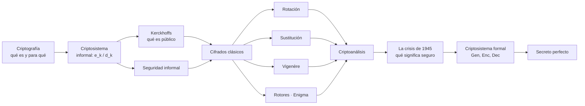

# Clase 01 — Introducción y criptografía clásica

> **06/08/2026** — jueves, **teoría** · docente **Pablo Abad** · [Filminas](../../raw/clases/Clase%2001%20-%20Criptografia%20-%20Introduccion.pdf) · [Transcripción](../../raw/clases/Clase%2001-Transcripcion.VTT) (722 cues, 1h25) · [Apuntes crudos](../../raw/clases/Clase%2001.md)
> Práctica del lunes 10/08: [[practica-01-esquemas-y-taxonomias|Práctica 01 — Esquemas y taxonomías]] · Guía: [[guia-01-criptografia-clasica|Guía 1 — Criptografía Clásica]]
> Tarea que deja la clase: repasar probabilidad y probabilidad condicional → [[probabilidad-y-criptografia|Probabilidad y criptografía]]
> Lectura recomendada al cerrar: **Katz & Lindell, cap. 1** (§1.3, *Historical Ciphers and Their Cryptanalysis*), con un objetivo declarado: más ejemplos de cifrados antiguos que los tres de la filmina
> Sigue en: [[clase-02-cifrado|Clase 02 — Cifrado simétrico]]

## Mapa de la clase

**El orden importa y es deliberado.** La clase da primero la intuición y los cifrados históricos, **los rompe a todos**, y recién entonces introduce la maquinaria formal $(\mathsf{Gen}, \mathsf{Enc}, \mathsf{Dec})$ y la definición rigurosa de seguridad: la formalización es la respuesta a los fracasos, no un preámbulo.

Ese orden es además el de **idealización decreciente** con el que está armada la materia entera: primero las funciones sobre supuestos perfectos, después la clave real, y en la segunda mitad el usuario humano que la elige y la escribe. El docente lo declara como método, no como accidente del programa.

> [!quote]- De la transcripción — la materia como una escalera de ideales que se van rompiendo (cues 220, 334-336, 388-391)
> Al abrir los ejemplos: *"vamos a empezar con ejemplos muy básicos para ir entendiendo algunos conceptos, y vamos a ir construyendo como una escalera"* (cue 220).
>
> Y al hablar de contraseñas: *"vamos a ver, en la segunda mitad de la materia, cuando empecemos a considerar también al usuario, al humano que usa el sistema (…). No es lo mismo un usuario que utilice una clave aleatoria o muy compleja que un usuario que ponga 'Juan' de clave. Por ahora vamos a empezar a construir asumiendo un montón de ideales que vamos a ir rompiendo después"* (cues 388-391).
>
> El anticipo de la clase siguiente (cues 334-336): *"la clase que viene vamos a dar un ejemplo que es muy seminal de esta definición: de tener algo que es súper seguro y de golpe se vuelve inseguro, terriblemente fácil de romper."* Es el [[one-time-pad|One Time Pad]] con la clave reutilizada, donde arranca la [[clase-02-cifrado|Clase 02]].

## El recorrido, tramo por tramo

| # | Tramo | Qué se dio | Dónde está desarrollado |
|---|---|---|---|
| 1 | **Criptografía** | Escritura secreta: funciones y técnicas desde donde construir seguridad. Los usos —comunicaciones, disco, cuentas, DRM, firma digital, voto, dinero electrónico— y el criterio que los resume: **si una aplicación restringe algo a alguien, tiene criptografía adentro** | [[criptosistema\|Criptosistema]] |
| 2 | **Criptosistema, vista informal** | $e_k(p) = c$ y $d_k(c) = p$ como funciones de **dos** parámetros, sus cuatro notaciones equivalentes, y para qué existe la clave: un solo algoritmo sirve a todos porque **el fardo de la seguridad va en un parámetro, no en el código** | [[criptosistema#Vista informal\|Criptosistema]] |
| 3 | **Kerckhoffs** | El corolario de esa decisión: lo único secreto es la clave. El atacante conoce todo el sistema salvo ella, y esa es la forma en que se estudia la seguridad — un juego entre quien diseña y quien ataca | [[principio-de-kerckhoffs\|Principio de Kerckhoffs]] |
| 4 | **Seguridad, informal** | «Seguro» no es un predicado absoluto: depende de contra quién y con qué recursos. Y el vocabulario: criptografía, criptoanálisis, criptología | [[criptosistema#Seguridad (informal)\|Criptosistema]] · [[modelos-de-ataque\|Modelos de ataque]] |
| 5 | **Historia** | Cuatro mil años de ciclo: cada esquema nuevo responde al criptoanálisis del anterior, hasta que 1949 corta el ciclo | [[historia-de-la-criptografia\|Historia de la criptografía]] |
| 6 | **Cifrados clásicos y su criptoanálisis** | Rotación, sustitución monoalfabética, Vigenère y las máquinas de rotores. **Los cuatro se rompen en clase**, y por motivos distintos | [[cifrado-por-rotacion\|Rotación]] · [[cifrado-de-sustitucion-monoalfabetica\|Sustitución]] · [[cifrado-de-vigenere\|Vigenère]] · [[maquinas-de-rotores-y-enigma\|Rotores y Enigma]] · [[ataque-de-fuerza-bruta\|Fuerza bruta]] · [[criptoanalisis-por-frecuencias\|Frecuencias]] · [[test-de-kasiski\|Kasiski]] |
| 7 | **¿Hay criptosistemas seguros?** | La Segunda Guerra como **crisis**: el criterio «seguro es lo que nadie rompió» no sobrevive. De ahí salen las tres exigencias de la criptografía moderna | [[historia-de-la-criptografia#La crisis de 1945\|La crisis de 1945]] |
| 8 | **Criptosistema formal y secreto perfecto** | La terna $(\mathsf{Gen}, \mathsf{Enc}, \mathsf{Dec})$ con sus tres espacios y la condición de corrección; y la primera definición rigurosa de seguridad, con su paradoja: el secreto perfecto exige $\lvert K\rvert \ge \lvert M\rvert$ | [[criptosistema#Definición formal\|Criptosistema]] · [[secreto-perfecto\|Secreto perfecto]] · [[modelo-probabilistico-de-un-criptosistema\|Modelo probabilístico]] |

## Las cinco ideas que hay que llevarse

1. **La seguridad vive en la clave, no en el algoritmo.** Es una decisión de diseño —un solo algoritmo para todos— y [[principio-de-kerckhoffs|Kerckhoffs]] es su corolario, no un principio aparte.
2. **Espacio de claves grande no es seguro.** La sustitución monoalfabética tiene $27!$ claves y cae con un análisis de frecuencias: el contraejemplo canónico.
3. **Cada cifrado clásico falla por un motivo distinto** —rotación por $\lvert K\rvert$ chico, sustitución por estadística preservada, Vigenère por descomponible— y esa variedad es la que obliga a definir «seguro» con precisión.
4. **La crisis de 1945 es el argumento del curso.** No se pasa a la criptografía moderna porque aparezcan las computadoras, sino porque el criterio viejo se probó insuficiente cuando se lo puso a prueba en serio.
5. **El secreto perfecto existe y es caro.** Se puede definir seguridad sin hipótesis de cómputo, pero el precio es una clave tan larga como el mensaje — que es exactamente el problema con el que abre la [[clase-02-cifrado|Clase 02]].

## Para el parcial

- Dar la **definición formal completa** de los tres cifrados clásicos: los tres conjuntos **y** los tres algoritmos, no sólo la fórmula (es el Ej. 1 de la [[guia-01-criptografia-clasica|Guía 1]]).
- Saber **por qué falla cada uno**, y que los motivos son distintos.
- Que **espacio de claves grande ≠ seguro**.
- Que el ataque a Vigenère tiene **dos partes con nombre propio**: [[test-de-kasiski|Kasiski]] para el período y el **método de coincidencia mutua** para alinear las columnas, que no ataca cada columna por separado sino que estima diferencias relativas de rotación y reduce el cifrado a **una sola** rotación.
- Enunciar el [[secreto-perfecto|secreto perfecto]] y aplicarlo al caso $\ell = 1$ de la rotación. La versión en castellano —del 90 % al 91 % ya lo rompe— es la que conviene tener a mano para justificar por qué la definición se escribe con probabilidades y no con «recuperar el mensaje».
- Tener presente la **hipótesis de discriminación** de la fuerza bruta y sus dos modos de falla, con la [[ataque-de-fuerza-bruta#Distancia de unicidad: cuándo la fuerza bruta no termina|distancia de unicidad]] como umbral.

Dos temas que **no** están en las filminas de esta clase y viven en su nota propia: el [[indice-de-coincidencia|índice de coincidencia]] —la teórica lo usa sin nombrarlo, como *«indicador del lenguaje»*— y la taxonomía [[modelos-de-ataque|pasivo/activo]], cuyo cuadro completo está en la [[practica-01-esquemas-y-taxonomias|Práctica 01]].

## Estado de las fuentes

**Las filminas de esta clase son láminas de título: la carga está en la voz.** Lo que no está en ningún PDF y sólo existe en el audio: [[maquinas-de-rotores-y-enigma|Enigma]] entero, la [[historia-de-la-criptografia#La crisis de 1945|crisis de 1945]], la [[ataque-de-fuerza-bruta#Distancia de unicidad: cuándo la fuerza bruta no termina|distancia de unicidad]] con su número para el castellano, el reparto Turing / Shannon / von Neumann y los usos de la criptografía que la filmina deja en blanco.

La clase es por videollamada y **hay respuestas que llegan por el chat**: no quedan en el audio y sólo se las reconoce porque el docente las repite en voz. Por eso algunas intervenciones se citan con nombre y otras como *«un alumno»*.

> [!discrepancia]- Nueve pasajes donde lo hablado se aparta de lo escrito, de la bibliografía o de la historia
> | Pasaje | Qué se dijo | Qué vale |
> |---|---|---|
> | El escenario que plantea un alumno | *"escenario de texto cifrado escogido"* | es **texto plano escogido** (`CPA`): el adversario elige el plano. Él mismo lo describe bien en la frase siguiente |
> | La tabla de frecuencias | *"la vocal que más aparece es la S"* (cue 521) | la `S` no es vocal: es la consonante más frecuente. La tabla de la filmina está bien |
> | El encuadre del ejercicio | *"vamos a oficiar de criptógrafos"* | el ejercicio es de **criptoanálisis**, distinción que él mismo define en el cue 165 |
> | La lámina de descifrado | $d(k,p)$ entre las notaciones equivalentes | va $d(k,c)$: la entrada es el cifrado y $p$ es la salida |
> | La lámina del secreto perfecto | *"las variables aleatorias discretas C y E son dependientes"* | son $C$ y $M$; `E` es la función de cifrado |
> | El rango de la clave de rotación | *"entre 1 y 26"*, glosado como *"cantidad de letras − 1"* | las dos glosas no coinciden; el rango exacto está en [[cifrado-por-rotacion\|Cifrado por rotación]] |
> | Turing, Shannon y von Neumann | los tres apellidos llegan destrozados por el ASR | la asignación de cada aporte es **reconstrucción nuestra** por el contenido |
> | La caída de Enigma | cayó por la captura de una máquina | fue una de varias vías: faltan el Biuro Szyfrów polaco y los *cribs* de Bletchley |
> | El tablero de conexiones | venía *"quemado"*, con máquinas gemelas | era **reconfigurable** con la clave del día; las máquinas eran intercambiables |

> [!nota]- Tres cabos sueltos
> - La **distancia de unicidad** se da con el número de la clase —5 letras para el castellano— pero sin la fórmula que lo produce. Queda pendiente contrastarlo con la definición de Shannon en [[teoria-de-la-informacion|Teoría de la información]].
> - El **índice de coincidencia** se usa sin nombrarlo (cue 602). El nombre propio y la fórmula entran recién por la [[practica-01-esquemas-y-taxonomias|Práctica 01]].
> - La **tarea que deja la clase** —repasar probabilidad y probabilidad condicional— no está escrita en ninguna filmina: sale sólo de la voz.
