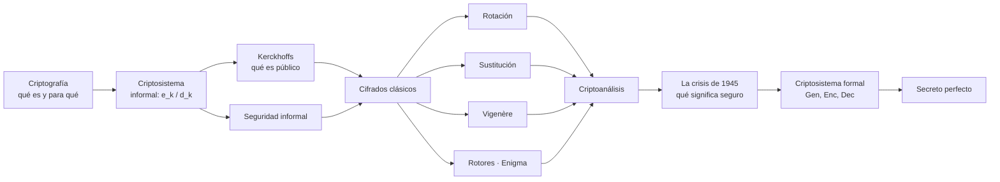

# Clase 01 — Introducción y criptografía clásica

> **06/08/2026** — jueves, **teoría** · docente **Pablo Abad** · [Filminas](../../raw/clases/Clase%2001%20-%20Criptografia%20-%20Introduccion.pdf) · [Transcripción](../../raw/clases/Clase%2001-Transcripcion.VTT) (722 cues, 1h25) · [Apuntes crudos](../../raw/clases/Clase%2001.md) · Katz & Lindell **cap. 1**, que es lo que dicen la última filmina y el docente al cerrar (cue 721); el cap. 2 —*Perfectly Secret Encryption*— es el respaldo del secreto perfecto según el mapeo de [[bibliografia|Bibliografía]], no una recomendación de esta clase
> Clase práctica del lunes 10/08: [[practica-01-esquemas-y-taxonomias|Práctica 01 — Esquemas y taxonomías]]
> Guía: [[guia-01-criptografia-clasica|Guía 1 — Criptografía Clásica]] · [[guia-01-resolucion|Resolución]]
> Tarea que deja la clase: repasar probabilidad y probabilidad condicional → [[probabilidad-y-criptografia|Probabilidad y criptografía]]
> Sigue en: [[clase-02-cifrado|Clase 02 — Cifrado simétrico]]

> **Cómo está partido el material.** `raw/clases` = **teoría de los jueves** (esta nota) · `raw/practicas` = **clases prácticas de los lunes** · `raw/guias` = **enunciados y resoluciones**.
> El PDF de la práctica del 10/08 se llama `Clase 1.pdf` a secas y **no es esta nota**: es [[practica-01-esquemas-y-taxonomias|Práctica 01]]. Esta clase es la del 06/08, con filminas `Clase 01 - Criptografia - Introduccion.pdf`. Nombres casi idénticos, clases distintas.

> **Cómo leer las citas.** Los bloques plegados **De la transcripción** traen lo que el docente dijo en voz y no está en ninguna filmina: ejemplos concretos, analogías, preguntas de alumnos y anticipos del resto del curso. Cada uno se despliega para ver la cita textual con su número de cue. Todo lo demás sale de las filminas.
> El `.VTT` es una **transcripción automática**: las repeticiones, los cortes de palabra y los errores de reconocimiento son del ASR. Las citas se normalizan —se sacan muletillas y tartamudeos, no se cambian palabras—; donde el original está degradado o donde la wiki completa una palabra, va marcado entre corchetes.
> La clase es por videollamada y **hay respuestas que llegan por el chat**, así que no todas quedan en el audio: se las reconoce sólo porque el docente las repite en voz. Cuando la transcripción identifica al alumno se lo cita por su nombre; cuando no, la cita dice *"un alumno"*.

## Mapa de la clase

La clase hace un recorrido deliberado: primero da la intuición y los cifrados históricos, **los rompe a todos**, y recién entonces introduce la maquinaria formal $(\mathsf{Gen}, \mathsf{Enc}, \mathsf{Dec})$ y la definición rigurosa de seguridad. El orden importa — la formalización es la respuesta a los fracasos, no un preámbulo.

Ese orden es además el orden de **idealización decreciente** con el que está armada la materia entera: primero las funciones sobre supuestos perfectos, después la clave real, y en la segunda mitad el usuario humano que la elige y la escribe. El docente lo dice dos veces y lo declara como método, no como accidente del programa.

> [!quote]- De la transcripción — cómo está construida la materia (cues 220, 334-336, 388-391)
> Al abrir los ejemplos: *"vamos a empezar con ejemplos muy básicos para ir entendiendo algunos conceptos, y vamos a ir construyendo como una escalera"* (cue 220).
>
> Y al hablar de contraseñas: *"vamos a ver, en la segunda mitad de la materia, cuando empecemos a considerar también al usuario, al humano que usa el sistema (…). No es lo mismo un usuario que utilice una clave aleatoria o muy compleja que un usuario que ponga 'Juan' de clave. Por ahora vamos a empezar a construir asumiendo un montón de ideales que vamos a ir rompiendo después"* (cues 388-391).
>
> El anticipo concreto de la clase siguiente (cues 334-336): *"la clase que viene vamos a dar un ejemplo que es muy seminal de esta definición: de tener algo que es súper seguro y de golpe se vuelve inseguro, terriblemente fácil de romper."*

Ese *"súper seguro que de golpe se vuelve trivial"* es el [[one-time-pad|One Time Pad]] con la clave reutilizada, que es donde arranca la [[clase-02-cifrado|Clase 02]].

---

## 1. Criptografía

**Del griego: escritura secreta.** Conjunto de funciones matemáticas y técnicas. Son las **herramientas básicas desde donde construir seguridad**.

> La criptografía, cuando funciona bien, es invisible.

### Usos

| Uso | Ejemplo |
|---|---|
| Comunicaciones seguras | Tráfico web, tráfico inalámbrico |
| Almacenamiento de datos | Protección de archivos en disco |
| Protección de cuentas | Autenticación de usuarios |
| Protección de contenido | DRM |
| Firmas digitales | |
| Voto electrónico | |
| Dinero electrónico | |

Las tres filas que la filmina deja en blanco son justamente las que el docente desarrolla en voz. La **firma digital** viene con un dato duro: en Argentina hay ley que la equipara a la firma de puño y letra, al punto de permitir comprar un inmueble sin firmar un solo papel. El **voto electrónico** aparece con sus dos requisitos en tensión —anonimato del voto y auditabilidad del recuento—, que es el problema que lo vuelve difícil. Y el **dinero electrónico** entra por la etimología: el *cripto* de criptomoneda es literalmente criptografía.

El criterio general con el que cierra la sección es más útil que la lista: **si una aplicación restringe algo a alguien, tiene criptografía adentro.**

> [!quote]- De la transcripción — el caso concreto de cada uso (cues 10-32)
> Comunicaciones: *"lo que permite que yo, desde mi casa, me conecte al servidor del banco donde está mi plata y ejecute transacciones"*. Contenido en tránsito: *"las transmisiones de contenido de cable pago, que tienen que estar de alguna manera protegidas para que el que no paga no las vea — en principio, si me paro del lado de la compañía"*. Disco: *"que el contenido en un disco rígido esté protegido, y si nos roban el celular o la computadora no se tenga acceso a ese contenido"*. Cuentas: *"cuando hay sistemas muy importantes y no alcanza un usuario y una contraseña, y necesitamos mecanismos adicionales para proteger la información"*. DRM: *"cuando uno, en un Kindle, compra la licencia para ver un libro, donde no está comprando el libro físicamente: compra el acceso a la información, pero no gana el derecho a transmitirla. O, por ejemplo, cuando uno compra un juego en una plataforma como Steam"*.
>
> Firma digital: *"Argentina es un país pionero en lo que se llama firma digital. Firma digital es un equivalente virtual a la firma de puño y letra, con capacidad para operar en contratos. Argentina es un país donde existen leyes que permiten que uno, por ejemplo, pueda comprar un departamento sin firmar ningún papel escrito, a través de documentos firmados con firmas digitales."* Voto electrónico: *"toda la protección que eso requiere para garantizar los votos anónimos, [y] la auditoría de que realmente lo que se votó es lo que se contabiliza"*. Dinero electrónico: *"todas las criptomonedas, como se les dice: el 'cripto' es de criptografía"*.
>
> Y el criterio general (cues 28-32): *"la criptografía es una base teórica que nos da un montón de herramientas a través de las cuales se construye, les diría, prácticamente todo lo importante que consumimos que tiene que ver con tecnología en general. Cualquier aplicación que haga algo útil y que haga algo que no sea completamente abierto para todos va a utilizar criptografía de una manera u otra."*

→ Concepto: **[[criptosistema|Criptosistema]]**

## 2. Criptosistema (vista informal)

**Función de cifrado** — es una función de **2 parámetros**:

$$\begin{aligned}
&\text{mensaje plano} \times \text{clave} \to \text{mensaje cifrado}\\
&e_k(p) = c \qquad [\,= \mathsf{enc}_k(p) = e(k,p) = \{p\}_k\,]
\end{aligned}$$

**Función de descifrado** — también de 2 parámetros:

$$\begin{aligned}
&\text{mensaje cifrado} \times \text{clave} \to \text{mensaje plano}\\
&d(c,k) = p \qquad [\,= d_k(c) = \mathsf{dec}_k(c) = \{c\}^{-1}_k\,]
\end{aligned}$$

> **Errata de la filmina.** La lámina de descifrado escribe la tercera notación equivalente como $d(k,p)$, copiando los argumentos de la de cifrado. Debería ser $d(k,c)$: la entrada del descifrado es el **cifrado**, y $p$ es la salida. Arriba va corregido. La misma lámina tiene bien la firma de la línea de encima —*mensaje cifrado × clave → mensaje plano*—, así que es un desliz de copiado y no un error de concepto.

Las cuatro escrituras son la misma cosa; la de llaves, $\{p\}_k$, es la que aparece **en los protocolos criptográficos**, donde hace falta anidar cifrados dentro de mensajes.

**Clave:** un bloque arbitrario de información. Al probar la seguridad de un sistema vamos a **presuponer que está protegida**.

Pero la clave no es un ingrediente más del cifrado: es lo que permite que **un solo algoritmo** sirva a todos los usuarios y a todos los sistemas. Toda la carga de seguridad se deposita en un **parámetro** y no en el código, y Kerckhoffs —que viene enseguida— es el corolario de esa decisión de diseño, no un principio independiente.

> [!quote]- De la transcripción — para qué existe la clave (cues 49-58)
> *"Estas 2 funciones, la de descifrado y la de cifrado, en realidad tienen un segundo parámetro. No es que toman un mensaje y lo convierten y listo: hay un segundo parámetro, que vamos a llamar clave por convención (…). La idea de la clave es que yo voy a poder utilizar el mismo algoritmo, la misma función, para transformar cosas diferentes para diferentes problemas: usuarios, sistemas — siempre la misma función. Porque vamos a echarle mucho del fardo del criterio de seguridad que le pidamos, a la clave, que va a ser un parámetro del sistema. No va a ser [el] algoritmo."*

El otro anuncio de método que hace la clase acá es **cómo se estudia** la seguridad: toda definición se va a escribir como un juego entre quien diseña y quien ataca, y el atacante arranca sabiendo todo salvo la clave. Es la forma en que el curso opera Kerckhoffs, y es la matriz de la que salen las pruebas `Eav`, `Mul` y `CPA` de la [[clase-02-cifrado|Clase 02]].

> [!quote]- De la transcripción — el atacante como método de trabajo (cues 74-79)
> *"La forma más interesante de estudiar seguridad, que vamos a ir repitiendo en muchos lados, es ir haciendo como un juego de roles donde nos vamos a parar desde el lado del que diseña seguridad y desde el lado del que la ataca (…). En general, la mejor forma de evaluar la seguridad de un sistema, más allá de los criterios de diseño, es tratar de atacarla."*
>
> Y el supuesto que no se negocia: *"cuando estemos en ese lado, en el lado del atacante, en cualquier criptosistema vamos a presuponer que el atacante es inteligente, tiene conocimientos técnicos y conoce todo el sistema que está atacando salvo la clave. **Esto lo voy a repetir muchas veces.**"*

### Principio de Kerckhoffs

> **Un criptosistema debe ser seguro incluso si todo sobre el sistema, excepto la clave, es de público conocimiento.**

No es una preferencia estética: es una consecuencia de **dónde corre el código**. Las funciones de cifrado son software, y el software se ejecuta en un servidor, en una app de teléfono o en una tarjeta embebida — tarde o temprano en un dispositivo que está en manos del adversario. Ocultar el algoritmo es apostar a que nadie desensamble ese binario, y esa apuesta se pierde por **ingeniería inversa**; en el extremo, se pierde por coerción sobre quien lo escribió.

De ahí sale además el recorte del curso: la primera mitad estudia las funciones, la segunda los programas, la infraestructura y las personas. Y la respuesta correcta a *"ocultemos el algoritmo"* no es ocultarlo mejor, sino **diseñar sistemas que no tengan ese eslabón**.

> [!quote]- De la transcripción — por qué el algoritmo siempre termina expuesto (cues 82-98)
> El caso histórico: *"hubo muchos casos donde la seguridad de un sistema radicaba en que nadie conociese las funciones de transformación (…). ¿Y qué pasó? Pasó que cuando alguien conocía la función de transformación, rompió la seguridad rapidísimo."*
>
> Y el argumento moderno: *"¿cuál es el problema, especialmente en el mundo moderno? Las funciones de cifrado son código, y el código se tiene que ejecutar en algún lado: tal vez en un servidor, pero tal vez en una aplicación, en un teléfono (…), tal vez en una tarjeta embebida. Y tarde o temprano, tarde o temprano, un atacante con mucha determinación va a tener acceso al código. Si está en un teléfono, uno puede desensamblar la aplicación y reconstruir el algoritmo. De hecho, eso tiene nombre: se llama **ingeniería inversa**, y hay gente que se dedica profesionalmente a hacer eso."*
>
> El corolario que excede a la criptografía: *"hay un riesgo muy grande, especialmente para los que se enfrascan en la parte nada más de criptografía, de quedarse en la parte teórica (…). La seguridad, cuando se la piensa desde un punto de vista sistémico, abarca mucho más que la teoría de las funciones: abarca los programas que se construyen, abarca la infraestructura donde corren esos programas y abarca la gente que los usa."* Y el extremo: *"alguien lo desarrolló; a ese alguien se lo puede secuestrar, se le puede obligar a contar o a divulgar el código. Entonces vamos a tratar de construir sistemas que no dependan, o que no tengan, esos eslabones más complicados."*

→ Concepto: **[[principio-de-kerckhoffs|Principio de Kerckhoffs]]**

### Uso básico

El texto cifrado no tiene información útil: puede ser almacenado o transferido. Sin la clave, es ruido; con la clave, es el mensaje. **Permite controlar quién puede recuperar un mensaje.**

Pero el valor del criptosistema no es esconder: es **amplificar**. Independizar el tamaño de la clave del tamaño del mensaje convierte un secreto de 20 caracteres en control de acceso sobre teras de datos — el contenido de una película entera queda regulado por algo que entra en un renglón. Dicho así queda claro por qué el [[one-time-pad|One Time Pad]] —clave tan larga como el mensaje— es la excepción cara y no el caso general: es el único esquema del curso que **renuncia a esta amplificación**.

> [!quote]- De la transcripción — el criptosistema como amplificador de un secreto chico (cues 117-129)
> *"¿Y esto qué nos permite? Nos permite simplificar el problema de cómo diseminar información. ¿Por qué? Porque acá estamos hablando de transformar mensajes arbitrarios, y arbitrarios es de cualquier tamaño. Si nosotros logramos independizar —y de hecho los algoritmos hacen eso— el tamaño del mensaje del tamaño de la clave (…), lo que estamos logrando es tener un mecanismo para, a partir de una cantidad chiquita, finita, de información, poder controlar el acceso a una cantidad mucho más grande de información. Entonces nosotros podríamos estar hablando acá de teras de información —no sé, el contenido de una filmación, una película— y acá podríamos estar hablando de una clave que se representa en 20 caracteres. (…) Esa es la idea por la cual nos interesan los criptosistemas."*

## 3. Seguridad (informal)

Significa:
- No se puede recuperar el mensaje
- No se puede recuperar **parte** del mensaje
- No se puede recuperar **sentido** del mensaje

Antes que los tres bullets, la clase deja sentado el aviso que recorre toda la materia: **"seguro" no es un predicado absoluto.** No hay una única definición de seguridad; depende del contexto, y esa ambigüedad es un problema práctico —dos personas discuten un sistema usando la misma palabra para cosas distintas—. La respuesta corta a *"¿es seguro?"* es *"¿contra qué prueba?"*, que es lo que después ordena [[estado-de-un-criptosistema|Estado de un criptosistema]].

> [!quote]- De la transcripción — "seguro" no es un predicado absoluto (cues 130-136)
> *"Una pregunta con la que vamos a recorrer toda la materia es tratar de entender y explicar qué estamos diciendo cuando decimos que algo es seguro. El spoiler que tengo para ustedes en esta primera clase introductoria es que **seguridad es un término ambiguo. No hay una única definición de seguridad: la seguridad depende del contexto.** (…) Y esto es un dolor de cabeza, especialmente en sistemas, porque a veces, cuando hablamos de seguridad con alguien que está comisionando un sistema o con alguien que lo está evaluando, estamos hablando de conceptos distintos a pesar de usar la misma palabra."*

Los tres bullets **no son tres grados de lo mismo**: son tres ataques distintos, y los dos últimos son los que obligan a escribir la definición en la forma rebuscada de la filmina —*"computar cualquier función del texto plano"*—. La clase los sostiene con dos ejemplos:

- **Parte del mensaje.** Una transferencia de bitcoins descripta en un mensaje de 20 000 bytes: alcanza con leer los campos de cuenta origen y destino para entender el flujo de la transacción. Dos campos de veinte mil bytes y el sistema ya falló.
- **Sentido del mensaje.** Dos empresas en la última fase de una adquisición; en algún momento circula el mensaje que la confirma o la rechaza. Quien cotiza esa acción **no necesita entender el contenido**: le alcanza con saber el signo. En el caso extremo, **un solo bit** —sí o no— es toda la filtración que hace falta para monetizarla, sin descifrar nada.

Ese mismo ejemplo de la operación que se confirma o se rechaza vuelve al final de la clase, ya con un número, para explicar el [[#8. Seguridad: secreto perfecto|secreto perfecto]].

> [!quote]- De la transcripción — los dos ejemplos que justifican los tres niveles (cues 140-159)
> Primero, por qué la definición de la filmina está escrita de forma tan rebuscada: *"es una forma un poco rimbombante de decir algo más fuerte que lo obvio. Lo obvio es pensar que un adversario que no tenga la clave no puede recuperar el mensaje (…), pero esta definición lo que busca es meter otros 2 escenarios."*
>
> **Parte del mensaje:** *"imagínense que intercepté una transferencia de bitcoins entre 2 cuentas, y resulta que hay un mensaje que explica la transacción para que lo procese el servidor (…), un mensaje largo que tiene 20 000 [bytes] de información adicional. Si yo puedo interceptar la parte donde está la cuenta origen y destino, nada más, yo ya puedo entender cómo está fluyendo esa transacción, y por ahí no necesito entender el resto."*
>
> **Sentido del mensaje:** *"imagínense que 2 empresas están en la última fase de una posible adquisición (…). En algún momento va a circular un mensaje donde la operación se realiza o la operación se rechaza, y para alguien que quiere obtener algún beneficio de eso —porque la empresa más grande cotiza en bolsa, y esto puede hacer subir o bajar el valor de la acción— **ni siquiera necesita entender el contenido del mensaje**: necesita saber si el sentido del mensaje va a ser a favor o en contra de la operación."*

Las técnicas para probar o romper la seguridad se denominan **criptoanálisis**. El vocabulario queda en **tres** niveles y no en dos: la **criptografía** construye, el **criptoanálisis** rompe, y el campo completo —los dos juntos— se llama **criptología**. Son complementarios: no se ataca en serio sin saber construir, ni se construye en serio sin saber atacar. Y le da nombre propio al adversario de la definición de seguridad: no es un intruso genérico, es un **criptoanalista**.

> [!quote]- De la transcripción — criptografía, criptoanálisis y criptología (cues 164-171)
> *"La criptografía, como campo de estudio, atañe a la creación de criptosistemas y otro tipo de funciones (…). En la literatura van a escuchar hablar también del complemento, que se llama criptoanálisis: el criptoanálisis es el conjunto de herramientas y técnicas pensadas para que un adversario pueda vulnerar, romper la seguridad de un criptosistema. Puestos a especializarnos, hay especialistas en criptografía, especialistas en criptoanálisis, hay gente que se especializa en las 2 cosas. **El campo completo se llama criptología.** Son campos complementarios; en general uno es fuerte en uno pero entiende del otro, porque se necesitan ambos para construir o para atacar en serio. Hoy vamos a jugar un poco ambos roles: el rol de un adversario en un criptosistema es un criptoanalista."*

---

## 4. Historia de la criptografía

| Fecha | Hito | Qué introduce |
|---|---|---|
| ~2500 AC | **Egipto** | Criptosistemas de sustitución: jeroglíficos no estándares |
| ~700-300 AC | **Escítala** | [[cifrado-por-transposicion\|Transposición]] usando báculos |
| 50 AC | **César** | [[cifrado-por-rotacion\|Rotación]] (subtipo de sustitución) |
| 800 DC | **Análisis de frecuencias** | Primeros documentos de [[criptoanalisis-por-frecuencias\|criptoanálisis]]. Comienzan a romperse los criptosistemas conocidos |
| 1500 | **Polialfabéticos** | Un símbolo cifrado representa distintos símbolos del original → [[cifrado-de-vigenere\|Vigenère]] |
| 1939 | **Bombe · Enigma** | Ataques de exploración sistemática por [[ataque-de-fuerza-bruta\|fuerza bruta]] → protocomputadoras |
| 1949 | **Shannon** — *Information Theory & Cryptography* | Publicaciones seminales que inician la **criptografía moderna** → [[secreto-perfecto\|secreto perfecto]] |

> La estructura de la tabla es un ciclo: cada esquema nuevo aparece como respuesta al criptoanálisis del anterior. El 1949 corta el ciclo al reemplazar "todavía nadie lo rompió" por **demostraciones**.

Dos precisiones que la voz agrega a la tabla. La primera: la fila del **800 DC** no marca sólo la aparición del análisis de frecuencias, marca el comienzo del **estudio sistemático** de los criptosistemas —construirlos, entenderlos y atacarlos—, que lleva más de mil años. La segunda: el corte clásico/moderno **no es una fecha sino un período**, fines de los 30 y principios de los 40; 1939 y 1949 son mojones de la tabla, no el instante del cambio. La analogía es del docente: pasa lo mismo que con la física clásica y la moderna.

> [!quote]- De la transcripción — qué pone el docente en cada fila de la tabla (cues 172-196)
> El origen: *"si pensamos en la criptografía como esta necesidad de esconder información y que sólo alguien calificado, aprobado, pueda acceder a ella: los secretos nacen desde que 2 personas se encontraron, o 3 personas se encontraron."*
>
> Egipto: *"criptosistemas que hoy llamaríamos de sustitución (…): básicamente eran escrituras hechas en jeroglíficos no estándares. Había una suerte de alfabeto. Imagínense alguien escribiendo textos, pero con otras letras que no eran las del alfabeto."* Grecia y Roma: *"ejemplos de criptosistemas utilizados para comunicar decisiones administrativas entre polis, entre ciudades; ejemplos de criptosistemas utilizados para coordinar ejércitos en campañas militares en la época de la expansión romana."* Edad Media: *"más o menos por el 800 después de Cristo empiezan a aparecer los primeros estudios de criptosistemas. O sea, no es algo nuevo que queramos estudiar los criptosistemas, entenderlos y atacarlos: es algo que empezó hace más de 1000 años."*
>
> Y el corte: *"hasta lo que fue prácticamente la Segunda Guerra Mundial, que marca un punto muy importante de quiebre (…): mucha capacidad científica se dedicó tanto a crear como a estudiar y tratar de romper criptosistemas en el escenario bélico de la Segunda Guerra, y el producto de eso fue como una refundación de la criptografía, que da origen a lo que hoy llamamos criptografía moderna (…). Entonces hay una criptografía clásica o antigua y una criptografía moderna, **muy parecida a como ocurre con la física**. El punto de quiebre fue fines de los 30, principios de los 40."*

A partir de una pregunta de un alumno —si todo esto arrancó con Turing— el docente **reparte las atribuciones** y completa la terna que la tabla no nombra: a **Turing**, el planteo teórico de la automatización que permitió construir las computadoras; a **Shannon**, el planteo teórico de cómo estudiar la información en sí misma; a **von Neumann**, el modelo de procesamiento con código y datos separados. Los tres son la punta visible de una generación entera, no sus únicos protagonistas. La atribución importa para leer bien la fila de 1949: lo que Shannon aporta **no es una máquina** sino el aparato para estudiar la información misma.

> [!quote]- De la transcripción — Turing, Shannon y von Neumann, a partir de una pregunta (cues 197-212)
> A Turing se le da *"el planteo teórico de la automatización que permitió construir las computadoras"*; a Shannon, *"el planteo teórico de cómo estudiar la información en sí misma y las transformaciones que ocurren"*; y suma a von Neumann por *"el modelo de procesamiento básico de la computadora, de tener separado código y datos"*, para *"formar la terna, digamos, de la santísima Trinidad de los que movieron estos campos"*.
>
> Y el marco: *"entre el 30 y el 40, como una generación dorada de científicos en estos campos de la computación y el estudio de la información (…). Son protagonistas; no son los únicos, hay mucha más gente, pero es como que ellos 3 [sobresalen] sobre un grupo que era excepcional: ellos eran excepcionales."*
>
> El ASR degrada los tres apellidos (*"Green"*, *"Ya Non"*, *"el bonu"*, *"Buenoiman"*). La asignación de cada frase a cada nombre es **reconstrucción nuestra** a partir del contenido —la automatización es de Turing, la teoría de la información de Shannon y la arquitectura código/datos de von Neumann—, no del audio.

---

## 5. Cifrados clásicos y su criptoanálisis

Los tres cifrados que siguen **no están por interés histórico**: son la escalera con la que se construyen los criterios de seguridad. Se empieza por criptosistemas de juguete porque diseñar uno de verdad es una tarea complejísima — la clase ya deja plantado el argumento que después desarrolla [[eleccion-de-primitivas|Elección de primitivas]] como *no inventes criptografía*: estandarizar una primitiva nueva lleva **casi décadas**.

> [!quote]- De la transcripción — por qué se empieza por criptosistemas de juguete (cues 219-225)
> *"Vamos a empezar con ejemplos muy básicos para ir entendiendo algunos conceptos, y vamos a ir construyendo como una escalera para ir entendiendo algunos criterios (…). Hoy ya está establecido que construir un criptosistema, diseñar un criptosistema, es una tarea complejísima. Ya me van a escuchar hablar, en 2 clases, de los años que lleva estandarizar ahora un criptosistema nuevo: **casi décadas**, por la complejidad de diseñar un sistema nuevo. Pero bueno, por algo hay que empezar, así que empecemos por criptosistemas simples."*

### Cifrado por rotación

Cada letra es un número (su posición en el alfabeto, empezando en 0). La clave $k$ es un número entre 1 y 26 —así lo escribe la filmina, que además se glosa a sí misma como *"cantidad de letras − 1"*, o sea 25; el rango exacto y el papel de la clave $0$ como identidad están tratados en [[cifrado-por-rotacion|Cifrado por rotación]]—. Cifrar = reemplazar cada letra por la que está $k$ posiciones después, volviendo a la $a$ luego de la $z$.

$$e(\texttt{prueba},\, 4) = \texttt{tvyife}$$

**El alfabeto es un detalle.** La rotación no está atada al alfabeto latino: sobre un alfabeto $\Sigma$ cualquiera hay $\lvert\Sigma\rvert$ claves, de las cuales una es la identidad. Con letras son 26 o 27 según se trabaje en inglés o en castellano; **sobre bytes son 256, o 255 útiles**, que es el caso que aparece cuando lo que se cifra son archivos arbitrarios y no texto.

**El escenario queda fijado en voz antes de atacar**, y es explícito, no implícito: el adversario ve **sólo el criptograma** y conoce el algoritmo. Es [[modelos-de-ataque|texto cifrado solo]], con Kerckhoffs ya asumido.

**¿Es seguro?** No: el ataque de prueba y error es fácil y rápido. **Debilidad: hay pocas claves.**

> El ataque de prueba y error **se puede hacer siempre** y se llama **fuerza bruta**.

El nombre es literal: el ataque no usa ninguna propiedad del cifrado, sólo **enumera**.

> [!quote]- De la transcripción — el alfabeto es un detalle, y las dos debilidades las dicen los alumnos (cues 228-280)
> Generalidad: *"acá es por ahí más fácil usar letras que bytes, pero esto aplica para cualquier alfabeto: podríamos estar haciéndolo con bytes en una computadora, con letras en un mensaje escrito."* El conteo de claves según el alfabeto: *"si estoy usando letras hay 26 [o] 27, según inglés [o] español; si estuviera usando bytes, porque estoy transformando archivos arbitrarios, hay 256 claves — o 255, si querés, porque el cero no se usa."*
>
> El escenario, fijado antes de preguntar: *"nosotros acá estamos viendo 'prueba', viendo el texto plano y viendo el texto cifrado (…). Desde el punto de vista de un atacante, lo único que vería sería el texto cifrado, en principio."*
>
> Las respuestas: Máximo Wehncke arranca por el supuesto —*"yo, como atacante, conozco el algoritmo"*—, y el docente confirma: *"vamos a ver que sí, es parte de la idea; lo único que desconocería sería la clave"*. Carlos Vallejo Tapia: *"son 26 números"*. Bautista Pessagno: *"una combinatoria [a la] que puede llegar probando (…) [por] fuerza bruta"*. Y el docente pone el nombre: *"este ataque de prueba y error, de tanteo, se puede hacer siempre y es tan básico que tiene un nombre: se conoce como **ataque por fuerza bruta** (…). Es sin pensar; por eso se le dice fuerza bruta: empezás a probar."*

**Cuántas claves son "pocas".** Un alumno objeta el criterio: con un alfabeto de un millón de símbolos ya no serían tan pocas. El docente concede la objeción y calibra en contra: **un millón sigue siendo poco**, porque "pocas" no se mide contra la intuición humana sino contra lo que una computadora puede enumerar, y un programa que prueba un millón de descifrados es trivial. La versión numérica de esta respuesta llega en [[eleccion-de-primitivas|Elección de primitivas]]: clave de más de 64 bits, con la escala física de $2^{88}$ átomos y $2^{58}$ segundos como referencia de qué significa "muchas".

> [!quote]- De la transcripción — cuántas claves son "pocas" (cues 289-293, 301-303)
> Juan Ignacio Causse objeta el criterio: *"está bien, de verdad, vos tenés pocas claves. Ahora, si asumimos que tenés un alfabeto de, por ejemplo, un millón de caracteres, que son un millón de símbolos diferentes, [ya] no son tan pocas claves."*
>
> El docente concede y calibra: *"concuerdo con lo que decís. Si tenés un alfabeto de un millón de claves, hacer un programa que itere y pruebe un millón de descifrados es **trivial**. Por ahí vamos a tener que calibrar qué es pocas y qué es muchas, y tal vez tengamos que pensar que 'muchas' es realmente muchas — lo vamos a ver más adelante. Pero es buena la apreciación: un millón de claves yo lo llevaría a pensar que sigue estando dentro de pocas claves."*

**El escenario `CPA` aparece acá, en la Clase 01**, planteado por un alumno y validado por el docente, aunque el desarrollo formal recién llegue en la Clase 02: si el sistema está online y se lo puede usar, se le pide que cifre una `A`, se mira que devuelve una `J` y la clave es 10 — sin probar nada. Lo que la cátedra fija en este intercambio es el principio: **la seguridad se predica de un par (función, escenario)**, y usar una función fuera del escenario donde vale es, por sí solo, un problema de seguridad.

> [!quote]- De la transcripción — la pregunta que adelanta los modelos de ataque (cues 294-300, 304-336)
> Juan Ignacio Causse describe, sin nombrarlo, un ataque de texto plano escogido: *"como que el algoritmo de por sí es malo, porque si yo sé que es de rotación, agarro, me creo yo un mensajito de prueba, lo mando a cifrar (…) y calculo el delta entre el mensajito de prueba que yo mandé y lo que me devolvió el criptosistema: ya tengo la clave. Si mando una A y el criptosistema me devuelve una J, ya sé que [la clave] es 10. Y ni siquiera tengo que probar todas."*
>
> El docente marca primero el catch: *"el problema es que para cifrar necesitás conocer la clave; si conocés la clave, ya podés descifrar (…). Como atacante podrías cifrar el texto que quieras con la clave que quieras, pero eso no tiene nada que ver con la clave que se usó para lo que querés descifrar."* El alumno precisa el escenario que tenía en la cabeza: *"ese sistema está online en algún lado (…), tenés la posibilidad de accederlo y utilizarlo (…); no como algo que tiene la clave oculta y vos no la sabés, [sino que] el sistema está disponible para que lo uses."*
>
> Y ahí el docente lo valida y lo nombra: *"cuando yo les digo que no hay una única definición de seguridad, es por esto: hay escenarios donde la misma función, en algunos escenarios, puede ser segura y en otros puede ser insegura. (…) Se conoce como escenario de texto cifrado escogido, o sea, donde el atacante puede escoger textos y cifrarlos. Y es súper correcto lo que dijiste: es un escenario que suele aparecer cuando usás criptografía como parte de algún protocolo de comunicaciones (…). Así que lo vamos a ver, y es súper importante — pero ponele que estamos todavía 5 escalones atrás."* Y el cierre: *"si vos tenés una función que en ese escenario no sirve, y la usás en ese escenario, tenés un problema de seguridad."*

> **Precisión nuestra.** Lo que describe el alumno —elegir *textos planos* y obtener sus cifrados de un oráculo que tiene la clave— es **texto plano escogido** (`CPA`), no texto cifrado escogido (`CCA`). El propio docente lo define bien en la frase siguiente (*"escoger textos y cifrarlos"*) y lo nombra mal. El cuadro de los cuatro modelos está en [[modelos-de-ataque|Modelos de ataque]].

**Límite de la fuerza bruta:** si busco $p$ tal que $e(\texttt{p}) = \texttt{a}$, ¿cómo sé que encontré el mensaje correcto? La hipótesis implícita es que *se puede discriminar un descifrado válido de uno inválido*.

Ese límite no es una observación de pasada: es un **ejercicio mental** que la clase plantea de frente, cuarenta minutos antes de definir el secreto perfecto. Con un mensaje de **una sola letra**, la fuerza bruta corre sin obstáculo —se prueban las 26 claves— y aun así no decide nada, porque las 26 respuestas son igual de plausibles. Es exactamente el caso $\ell = 1$ que [[secreto-perfecto|Secreto perfecto]] demuestra que **sí** alcanza el ideal de Shannon: la hipótesis de discriminación no es una limitación técnica del atacante, es el punto donde el cifrado de juguete toca el ideal. *(La conexión entre las dos apariciones es lectura nuestra: el docente no la explicita.)*

> [!quote]- De la transcripción — el ejercicio de la letra sola (cues 341-359)
> *"Vamos a hacer un ejercicio mental. (…) Si yo les digo que cifré un mensaje de una sola letra con este criptosistema de rotación —que acabamos de decir que es inseguro— y el resultado de haber cifrado esa letra es la letra `a`, ¿pueden decirme cuál era la letra del mensaje plano que yo cifré?"*
>
> Carlos Vallejo Tapia contesta que no, y da la razón exacta: *"¿y cómo te darías cuenta cuándo encontraste el mensaje correcto?"*
>
> El docente cierra: *"muy bien. Podemos hacer esta búsqueda de fuerza bruta e ir probando con todas las claves (…), con cada una de las 26 claves; nada lo impide. El punto es: si miramos acá, ¿cómo supe que la clave 4 era la correcta? ¿Qué venía evaluando en cada una de estas corridas? (…) Si la palabra tenía sentido. Ya tenía algo que se suele dar casi por implícito, pero que es requisito para un ataque por fuerza bruta: **la capacidad de discriminar un descifrado válido de uno inválido**. En la práctica, en cualquier protocolo de los que se usan en el día a día, eso ocurre — pero no tiene por qué."*

#### Cuándo la fuerza bruta no termina: la distancia de unicidad

La hipótesis de discriminación **se cae de dos maneras**, y las dos importan.

- **Por abajo**, cuando el texto plano no tiene redundancia. Si el mensaje es una secuencia aleatoria, el criptograma parece aleatorio y *todos* los descifrados parecen aleatorios: no hay con qué elegir. Es exactamente el motivo por el que el [[one-time-pad|One Time Pad]] es indistinguible de azar.
- **Por arriba**, cuando hay **varios** descifrados con sentido. Si la clave 4 da una palabra y la clave 6 da otra palabra, el ataque termina con dos candidatos y ninguno gana.

El umbral entre los dos regímenes tiene nombre y fórmula: la **distancia de unicidad** de Shannon, definida como el largo de mensaje a partir del cual es esperable que sobreviva **un único** descifrado con sentido, para una única clave. El docente da el número para el castellano: **5 letras**. Y observa que casi todo lo que se usa en la práctica está muy por encima de ese umbral, así que en el mundo real la hipótesis se cumple sola — y por eso se la olvida. Sólo en escenarios de laboratorio, o en los extremos, la fuerza bruta deja de decidir.

> [!quote]- De la transcripción — cuándo la fuerza bruta no termina, y la distancia de unicidad (cues 375-409)
> El intercambio arranca con un alumno que intuye que una contraseña aleatoria resiste mejor. El docente corrige la mecánica —*"vos, en realidad, no desencriptás la contraseña: vos probás todas las contraseñas posibles una tras de la otra"*— y después reencuadra la intuición, que era correcta: *"si reemplazo eso por cifrar el mensaje 'Juan' versus cifrar un mensaje aleatorio, gana mucho más fuerza lo que decís. Imagínense que, por alguna razón, ustedes tienen una secuencia aleatoria y necesitan protegerla, y la cifran: el mensaje cifrado parece una secuencia aleatoria también, y cualquier descifrado incorrecto va a [parecer] una secuencia aleatoria también. **En ese caso no tenemos forma de discriminar un descifrado correcto de uno incorrecto.** En cambio, si el mensaje era 'Juan', el texto cifrado va a parecer una secuencia aleatoria, pero cuando use la clave que usamos para cifrar voy a recuperar 'Juan', y ahí voy a decir: 'Juan tiene sentido'."*
>
> Y el segundo modo de falla (cue 394): *"lo otro que necesitamos es que no haya una cantidad absurda de textos que tengan sentido, porque lo otro que podría pasar (…) es que si sigo con 5, y con 6, me da una palabra también, de esas letras, que tiene sentido. ¿Y ahí qué hacemos: era 4 o eran 6?"*
>
> Ahí aparece el nombre y el número (cues 396-409): *"Shannon estudió mucho esto en el estudio de la información que llevan los mensajes (…). Él definió, para todo lenguaje, una fórmula para calcular un indicador que se llama **distancia de unicidad**, y esa es algo así como el tamaño del mensaje a partir del cual es esperable que haya un único descifrado que tenga sentido, para una única clave. Y cosas sorprendentes de eso: para un mensaje en lenguaje natural, como es el español, **la distancia de unicidad son 5 letras**. O sea, a partir de 5 letras hay una probabilidad altísima de que haya un único descifrado correcto (…). 5 letras o 5 bytes es un tamaño tan chico que cualquier cosa que usamos en la práctica es mucho más grande; entonces, en la práctica, es raro que estemos abajo de este umbral de unicidad, que podría complicar un ataque por fuerza bruta. Pero en los extremos, o en escenarios muy diseñados, casi de laboratorio, es posible que no se pueda hacer [un ataque de] fuerza bruta. (…) Es tan común que uno pueda discriminar, que uno muchas veces se olvida de esta hipótesis; pero vamos a ver, de hecho, algún diseño que se abusa de esta hipótesis para ganar algo de seguridad."*

> **Precisión nuestra.** La distancia de unicidad no depende sólo del lenguaje: en la formulación de Shannon es el cociente entre la entropía de la clave y la redundancia del lenguaje, así que **crece con el tamaño del espacio de claves** — un cifrado con más claves necesita más texto para quedar determinado. El número de 5 letras hay que leerlo como orden de magnitud para los cifrados clásicos de esta unidad, no como una constante del castellano. El apunte de [[teoria-de-la-informacion#9. Qué NO está en esta fuente|Teoría de la información]] registra que la distancia de unicidad **no** está en el paper de 1948 que resume: es del de 1949.

→ Conceptos: **[[cifrado-por-rotacion|Cifrado por rotación]]** · **[[ataque-de-fuerza-bruta|Ataque de fuerza bruta]]**

### Cifrado de sustitución

Reemplaza un símbolo por otro según una permutación fija.

$$\begin{array}{rl}
k = & \texttt{dublcmfthijnzpxqeaosvkrwgy}\\
    & \texttt{abcdefghijklmnopqrstuvwxyz}\\[6pt]
\text{mensaje} : & \texttt{esto\ es\ una\ prueba}\\
\text{cifrado} : & \texttt{cosx\ co\ vpd\ qavcud}
\end{array}$$

Se pueden generar **26! claves** — estamos en el orden de los **cuatrillones**, ya no es un número chico. Y aun así:

> **Debilidad: las propiedades estadísticas del lenguaje no se ven alteradas.**

La razón de que sean $26!$ y no otra cosa es que la clave **es** una permutación del alfabeto: las letras no se repiten, así que contar claves es contar permutaciones. El "cuatrillones" sale de un conteo de ceros hecho en voz. Y el criterio con el que el docente decide que el número es grande no es aritmético sino **operativo**: deja de resolverse en papel y pasa a necesitar una computadora con tiempo. Sobre bytes, la misma cuenta da $256!$.

> [!quote]- De la transcripción — de dónde sale el "cuatrillones" (cues 426-441)
> El docente pregunta cuántas claves hay, un alumno contesta *"26 factorial"*, y él cuenta los ceros en voz alta: *"muy bien, 26 factorial, porque si se fijan, como las letras no se van a repetir (…), es una permutación del orden de las letras en el alfabeto (…), y la cantidad de permutaciones (…) es factorial. 26 factorial: ya no me animaría a calificarlo de número chico. (…) Vamos a contar ceros: 6 ceros; 12 ceros, [un] billón de los españoles o trillón de los americanos; 18 ceros, trillones [de los nuestros], o sea quintillones de los americanos; 24 [ceros] sería cuatrillones de los nuestros. (…) Podemos entrar en que tal vez, si ponemos una computadora [con] tiempo suficiente [se puede], pero (…) no lo resolvería en papel como resolvía el otro. (…) Imagínense si la hacen en bytes: y es 256 factorial."*
>
> Dice también que $26!$ *"es un número de 26 dígitos"*: son **27**. $26! = 403\,291\,461\,126\,605\,635\,584\,000\,000 \approx 4{,}03\times 10^{26}$, o sea unos **403 cuatrillones**. La nota de [[cifrado-de-sustitucion-monoalfabetica|sustitución monoalfabética]] ya registra ese redondeo.

**El contraejemplo canónico se cierra sin ninguna cuenta.** No hace falta estimar el costo de enumerar $26!$ claves: alcanza con observar que este cifrado **es el pasatiempo de los diarios y las revistas de verano**, y que lo resuelve un chico de ocho años con paciencia. Si una persona sin formación técnica lo rompe para pasar el rato, seguro no es. De paso aparece, de boca de un alumno, la idea de **crib** —una frase que se sabe presente en el texto plano, como *"Heil Hitler"*—, que es la forma práctica del modelo de **texto plano conocido** y es exactamente la ayuda `LACABEZA` del ejercicio de esta misma clase. *(La identificación del crib con `KPA` es lectura nuestra.)*

> [!quote]- De la transcripción — el argumento del pasatiempo de diario (cues 442-465)
> El docente vuelve a preguntar si el esquema es seguro. Un alumno arriesga la debilidad correcta: *"calculo que se puede descifrar también porque las vocales se repiten mucho"*. Bautista Pessagno trae el caso histórico: *"me suena lo de la película, la del código [Enigma] (…): hacían tipo lo de siempre con 'Heil Hitler', entonces era buscar esa frase nada más."*
>
> El docente señala la evidencia en el propio ejemplo de la filmina: *"miren en este ejemplo superchiquito, o sea, 4 palabras (…): al repetirse la secuencia, se repite (…). Fíjense la E, que aparece varias veces: siempre que aparece es una C."*
>
> Y remata con el argumento que hace innecesaria toda cuenta: *"este criptosistema no tiene el problema de la cantidad de claves; de hecho, buscarlo probando todas las claves es generalmente un problema que no vale la pena ni siquiera encarar. Pero este tipo de problemas es el que suele aparecer en los diarios y en las revistas para jugar en la playa (…). Yo jugaba y resolvía ese tipo de cosas a los 8 años; aparecen [en] revistas para chicos. Así que, intuitivamente, si un chico de 8 años, o cualquier persona no técnica, en un diario para pasar el tiempo resuelve este tipo de cosas — **seguro no me parece**."*

**El criptoanálisis por frecuencias no es una tabla que se aplica de una vez: es una búsqueda con backtracking.** Se hipotetiza una correspondencia (*"esta letra tiene toda la pinta de ser una N"*), se **propaga** a todo el texto, y se **retrocede** cuando la propagación produce una combinación imposible en el idioma. El docente lo dice con esas palabras —*"una búsqueda en un árbol de decisiones"*— y saca la consecuencia práctica: por eso es **fácil de implementar**, que es lo que hacen los dos scripts de `raw/` documentados en la [[guia-01-resolucion|Resolución de la Guía 1]].

> [!quote]- De la transcripción — el criptoanálisis por frecuencias es una búsqueda con backtracking (cues 466-486)
> *"Lo que se dice formalmente es que este tipo de transformación de sustitución **preserva las características estadísticas del lenguaje original**. Y es esto de que, en un lenguaje natural como puede ser el español, las vocales aparecen muchas más veces que las consonantes: entonces, si yo cuento las letras, las que más aparecen [tienen] altísimas chances de ser una vocal. Es más, sabemos en el español que la A y la E aparecen mucho más que las otras vocales (…). Y eso lo sabemos hasta intuitivamente: no hay que hacer un curso de criptoanálisis para darse cuenta de eso."*
>
> El procedimiento: *"cuando tengo parte de lo que puede ser una palabra, puedo empezar a hipotetizar más fuerte: 'la letra que me falta tiene toda la pinta de ser una N'. Si esta es la N, la N se asocia a la letra que aparecía ahí, y puedo ir a todo el resto del texto y decir: '¿y qué pasaría si esta es una N?'. Ah, mirá: acá queda algo raro, porque me aparece la letra C —que estoy seguro—, la D —que estoy seguro— y una N en el medio, y 3 vocales; suena raro. Así que por ahí no es la N: volvamos. **Ese tipo de heurística es una búsqueda en un árbol de decisiones. Es fácil de implementar**, incluso."*

Los símbolos ni siquiera tienen que ser letras: el criptograma hallado en 1794 en el cementerio de Trinity (NY) se descifró en 1986 con una tabla de traducción símbolo→letra. Lo interesante es **por qué resistió unos 200 años**, y no es porque fuera fuerte: es una **variante** del cifrado masónico (*pigpen*) con la numeración de los tableros corrida en uno —el canónico empieza en 0 puntos, este empieza en 1—, así que todo el que lo intentaba aplicaba el esquema estándar y no cerraba. Es seguridad por una diferencia no documentada, exactamente lo que Kerckhoffs desaconseja: la variante **no agrega ni un bit de clave**, sólo demora al analista hasta que a alguien se le ocurre probarla. *(La lectura desde Kerckhoffs es nuestra.)* El punto técnico, en cambio, es que el alfabeto de símbolos no cambia nada: sigue siendo sustitución monoalfabética —el mismo símbolo siempre es la misma letra— y cae por lo mismo.

> [!quote]- De la transcripción — la lápida de Trinity y la escultura de la CIA (cues 488-508)
> *"Este es un criptosistema que apareció en una tumba en el cementerio de Trinity, en Nueva York. Es una tumba que data de fines de los 700 [1700] [y] tiene escrito en la lápida, en la parte de arriba, un mensaje cifrado. Cuando aparecen estas cosas hay como un montón de gente aficionada que se pasa horas, días, años jugando para ver si lo resuelven."*
>
> El segundo caso: *"hay otro caso muy conocido (…): en el edificio central de la CIA, en Langley, hay una pirámide que tiene 4 mensajes en sus 4 caras, que son 4 criptosistemas. Y de esos 4, 2 se pudieron resolver; hace poco resolvieron un tercero; hay 1 que todavía falta."*
>
> Por qué el de Trinity tardó *"como 200 años"*: *"lo logró descifrar porque alguien se dio cuenta de que tenía características muy parecidas a otro criptosistema (…) que estaba asociado a los masones. Tenía algunas variaciones (…): son tableros tipo ta-te-ti, están las letras ordenadas, y los tableros se diferencian por la cantidad de puntos: 1, 2 o 0. Si querés, el catch de este versus el canónico era que se empezaba con un punto: el sistema de cifrado masón, que se [conocía] en la antigüedad, [tenía] el primer tablero [con] 0, el segundo 1, el otro 2. Y por eso lo trataron de aplicar muchas veces y no daba, hasta que a alguien se le ocurrió esta variante."*
>
> Y la moraleja técnica: *"anécdota de la historia; lo importante es la cifra de sustitución. No importa si son símbolos distintos: esto es una traducción de símbolos a letras (…). Siguen siendo sustitución — o sea, donde aparece la misma letra, acá y acá, es la misma letra en el otro lenguaje."*
>
> La escultura de la CIA no se nombra en clase, y la clase no da fechas de las resoluciones ni del panel pendiente: la nota no agrega datos que la fuente no trae.

**El ataque estadístico no está atado al lenguaje natural.** Cualquier fuente con distribución conocida tiene su tabla de frecuencias, y eso incluye los **formatos de archivo** — que es lo que vuelve aplicable el criptoanálisis cuando el texto plano no es texto. Y si la tabla no existe, se calcula: se juntan muchas muestras y se cuenta. La tabla del castellano de la filmina no es un dato de autoridad, es un conteo que cualquiera puede rehacer, y lo que la vuelve útil es que permite pasar del tanteo intuitivo a **un programa que lo hace sistemáticamente**.

> [!quote]- De la transcripción — hay tablas de frecuencia también para formatos de archivo (cues 509-522)
> *"Podemos obtener la frecuencia estimada de cada símbolo en el lenguaje del mensaje y compararla con la del texto cifrado que tenemos; asumir que los símbolos de mayor probabilidad se corresponden y, si no, ir probando en ese orden; y después formar grupos de 2 o 3 letras comunes, o palabras, e ir creciendo a partir de ahí. Para cualquier lenguaje —ni siquiera lo tiene que calcular— para todo lenguaje conocido, **y para los formatos, incluso, de archivos**, hay tablas de este tipo. (…) Tampoco es muy difícil calcularlo: hay que conseguir muchas muestras y hacer el cálculo de contar y calcular las probabilidades [de] apariciones."*
>
> Sobre la tabla del castellano: *"no es sorpresa que la Ñ sea de las que menos aparece. Tampoco es sorpresa que en las primeras 5 posiciones haya 4 vocales; por ahí a alguien le sorprende que la U no tenga tanta frecuencia, pero es real. (…) Esto nos da una forma ordenada: uno lo hace intuitivamente, [pero] con estas tablas uno ya puede escribir un programa que lo haga sistemáticamente."*
>
> En el cue 521 dice *"la vocal que más aparece es la S"*: la `S` **no es vocal**. Es la consonante más frecuente del castellano (8,47 %) y la única no vocal entre las cinco primeras posiciones de la tabla. Lapsus de clase o del ASR; el sentido es inequívoco contra la tabla de la filmina.

→ Conceptos: **[[cifrado-de-sustitucion-monoalfabetica|Sustitución monoalfabética]]** · **[[criptoanalisis-por-frecuencias|Criptoanálisis por frecuencias]]**

#### Ejercicio de clase

**Ayudas:** el mensaje original está en castellano · la separación en grupos de 5 símbolos no es parte del problema (sólo ayuda a contar) · **gancho: `LACABEZA`** aparece en el mensaje plano.

El ejercicio **no está para practicar sustitución**: está para medir la distancia entre *"no es seguro"* y *"lo rompí"*. Declarar inseguro un criptosistema es barato; explotarlo cuesta trabajo incluso en el cifrado más fácil que conoce la humanidad, y esa brecha es la que después justifica que la criptografía moderna hable de **costo** y no de imposibilidad. La cátedra habilita explícitamente resolverlo con un modelo de lenguaje o a mano, sin preferencia entre las dos vías.

> [!quote]- De la transcripción — para qué está el ejercicio, y que se puede resolver con un modelo (cues 524-537)
> El encuadre: *"vamos a hacer una pausa acá (…); a la vuelta vamos a oficiar de criptógrafos. Lo que están viendo acá es (…) un texto cifrado, producto de un mensaje en castellano que ciframos, y les voy a pedir que traten de descifrarlo como puedan. (…) No vamos a usar herramientas formales."*
>
> Las herramientas permitidas: *"puede estar bueno: tírenselo a alguno de los modelos. El año pasado no [andaba]: si lo tirábamos a 3 o 4 modelos decían cualquier cosa, pero era impresionante ver cómo divagaban. [Este año] mejoraron y lo resuelven. Es un criptosistema súper fácil. O resuélvanlo a mano, no [hay] problema."*
>
> Y el propósito: *"lo que vamos a hacer con esto a la vuelta (…) es cuantificar un poco qué significa cuando decimos 'ah, esto no es seguro'. Porque es muy fácil decir que un criptosistema no es seguro; lo que no quiere decir es que sea trivial romperlo. Estamos con los criptosistemas más fáciles que conoce la humanidad: vamos a probar romper uno para entender un poco y empezar a tomar una idea de **la distancia que hay entre poder decir que algo no es seguro y explotarlo**, y realmente extraer información."*
>
> Dice *"oficiar de criptógrafos"* cuando el ejercicio es de **criptoanálisis** — él mismo define la diferencia en el cue 165. Lapsus, no error conceptual.

### Cifrado de Vigenère

Sustitución **polialfabética**: un mismo símbolo puede transformarse en símbolos diferentes. Clave compuesta por $n$ números; se aplica ROT-X según la clave, cíclicamente.

$$K = \texttt{ECFD} = 4253 \qquad \text{(largo 4)}$$

- Creado en **1553**; considerado seguro durante casi **300 años**.
- En **1863** Friedrich **Kasiski** publica un método para resolverlo.

**La propiedad polialfabética vale en las dos direcciones**, y conviene registrar las dos: una letra del plano va a parar a **varias** letras del cifrado (la `E` sale `F`, después `G`, después `H`), **y** una letra del cifrado puede venir de **letras distintas** del plano (dos `E` del criptograma, una viene de una `A` y la otra de una `B`). Es la primera vez en el curso que se rompe la correspondencia símbolo a símbolo.

Con eso, Vigenère arregla **las dos debilidades anteriores de un saque**. El espacio de claves con período $t$ pasa a ser $\lvert\Sigma\rvert^{t}$ —con una clave de sólo 10 caracteres, $26^{10}$ sobre letras y $256^{10}$ sobre bytes—, y el histograma del criptograma deja de reflejar el del idioma, así que el mapeo *"lo que más aparece es una vocal"* ya no se sostiene.

> [!quote]- De la transcripción — qué rompe Vigenère y cuánto gana (cues 539-563)
> Qué tienen en común los anteriores: *"todo lo que vimos antes, y otros criptosistemas anteriores a estos, tienen la característica de que —no importa la regla por la cual se arma la traducción— hacen que un símbolo siempre se traduzca al mismo: si aparece la letra [E] 10 veces, 10 veces se va a convertir [en] el mismo. **Vigenère es uno de los primeros criptosistemas que rompe esta idea**, y es uno de los más simples; la forma de funcionamiento es superbásica y está basado en el primer criptosistema que vimos, el de rotación."*
>
> El mecanismo: *"se divide el mensaje en una serie de bloques de tamaño fijo —supongamos tamaño 4—, y lo que vamos a hacer es, dentro de cada bloque, rotar la primera letra de cada bloque por una longitud fija, la segunda letra de cada bloque por otra longitud, la tercera lo mismo, la cuarta lo mismo (…). Una clave que representamos numéricamente como 4, 2, 5, 3 nos dice, por un lado, que los bloques son de 4 letras porque hay 4 rotaciones."*
>
> Lo que se ve en el ejemplo, **en las dos direcciones**: *"fíjense que la E aparece acá varias veces: la primera vez se convierte en una [F], la segunda en una G, la tercera en una H. Pasa algo parecido con la A (…). **Y pasa al revés también**: fíjense que hay 2 [letras iguales en el cifrado], una representa una A y otra representa una B."*
>
> El espacio de claves y la estadística: *"podemos decir que esta es una clave de juguete, pero si la clave fuese de 10 caracteres —o sea, 10 bloques de rotaciones— ya es un número grande, porque con letras sería 26 a la 10, y si fuese un byte sería 256 a la 10 (…). Y lo que hicimos de mapear la estadística —'lo que más aparece son vocales, entonces debe corresponder [a] una vocal'— acá no se mantiene."*

#### El ataque, en dos partes

**Ataque:** (1) determinar la longitud de bloque —**test de Kasiski**—, (2) alinear las columnas y reducir todo a una sola rotación —**método de coincidencia mutua**—.

Lo que hace de **1863** un hito no es que se resolviera un criptograma sino que se publicara un **método** que resuelve la familia entera: *"no una resolución de una instancia: un método para atacar esto"*. Es la misma distinción que la criptografía moderna convierte después en la exigencia de demostraciones.

**Paso (1) — Kasiski.** La hipótesis es que las secuencias de letras repetidas en el criptograma vienen de la misma secuencia del texto plano **cayendo en la misma posición del bloque**; que eso pase por casualidad con tres o más letras es muy poco probable. Entonces la distancia entre dos apariciones tiene que ser un **múltiplo entero** del período, y el mcd de todas las distancias es candidato a período. La filmina lo ejemplifica con $\operatorname{mcd}(32, 72, 104, 156, 256) = 4$.

Y **viene con criterio de fallo incluido**, que es lo que la filmina no dice: si el mcd da 1, hay repeticiones casuales metidas en el conjunto; se las va descartando y el período es el valor al que **salta** el mcd. El método es probabilístico pero converge, y mejora con el largo del criptograma — que es por qué el ejemplo de la filmina usa un texto de diez líneas.

> [!quote]- De la transcripción — Kasiski: un método, no una instancia (cues 564-589)
> Qué se publicó en 1863: *"el cifrado de Vigenère se creó en 1553; durante casi 300 años se lo consideró seguro, hasta que en 1863 se publicó un método para atacarlo. **No una resolución de una instancia: un método para atacar esto.**"* Y la estructura del ataque: *"el método tiene 2 partes. Una primera parte, que lo único que busca es entender, dado el texto cifrado, cuál es la longitud que tendría la clave que se usó para cifrarlo. El segundo se basa en conocer eso para descomponer en bloques el texto cifrado y atacar cada parte de los bloques por separado."*
>
> La hipótesis de Kasiski: *"[él] entendía que no podía asumir que si una letra aparecía 2 veces en el texto cifrado se iba a corresponder a la misma, pero empezó a ver que había secuencias de letras que aparecían varias veces. Entonces lo que plantea es: que se repitan secuencias de letras ya tiene que ser mucho menos probable (…). La hipótesis es que las secuencias de letras iguales se corresponden a la misma secuencia de letras en el texto plano, que tuvieran la casualidad de caer en el mismo lugar del bloque. (…) Si yo mido la distancia que hay entre esos lugares, esa distancia debería ser una cantidad entera de bloques; entonces puedo contarlas [y] buscar (…) el máximo común divisor, y eso tiene altas chances de ser el tamaño del bloque."*
>
> Y **qué hacer cuando falla**: *"si le pifiamos a algunas de estas hipótesis, ¿qué va a pasar? El máximo común divisor va a ser un número superchico, probablemente 1. Podemos empezar a sacar algunos de estos casos, y donde el máximo común divisor pasa de 1 a otro valor, es probable que tengamos [el período]. Entonces es probabilístico, sí, pero tiene un camino que llega. Y cuanto más largo el mensaje, más probabilidades de que esto llegue a buen término: en un mensaje de este tamaño que les estoy mostrando, es prácticamente seguro cuando se encuentra algo."*

**Paso (2) — método de coincidencia mutua.** Tiene una filmina propia, y describe algo bastante distinto de *"analizar la clave de cada bloque por separado"*: el método **no resuelve $t$ rotaciones independientes**, sino que **alinea** las $t$ columnas usando sólo las *diferencias relativas* de rotación entre ellas.

La idea: si se toman los primeros caracteres de cada bloque, todos vienen del mismo idioma con la misma rotación, así que **conservan la estadística del lenguaje**. Lo mismo vale para los segundos, los terceros, etc. Pero si se juntan la columna 1 y la columna 2, la estadística se rompe — salvo que antes se rote la segunda columna la cantidad justa. Probando rotaciones sobre la columna 2 hasta que la estadística conjunta **vuelve a parecerse a la del idioma**, se obtiene la diferencia entre la rotación 1 y la 2, sin conocer ninguna de las dos. Repitiendo entre la columna 1 y cada una de las demás se obtienen todas las diferencias relativas.

Desrotando cada columna por su diferencia, el criptograma entero queda **rotado por una única cantidad desconocida**: el Vigenère se convirtió en un cifrado por rotación, y ese ya se rompe probando las $\lvert\Sigma\rvert$ claves. El costo total del ataque baja de $\lvert\Sigma\rvert^{t}$ a algo del orden de $t\cdot\lvert\Sigma\rvert$.

Ese *"indicador estadístico del lenguaje"* que el docente nombra sin darle nombre propio es el **[[indice-de-coincidencia|índice de coincidencia]]**, $\sum p_i^2 \approx 0{,}0775$ para el castellano contra $1/n$ para texto aleatorio. *(La identificación es lectura nuestra: en esta clase el docente no lo llama así.)*

> [!quote]- De la transcripción — el método de coincidencia mutua, entero (cues 590-614)
> *"La segunda parte del ataque, que se conoce como **método de coincidencia mutua**, se basa en esa idea. Si yo ya tengo el mensaje así, yo sé que la característica del lenguaje, si miro sólo los primeros caracteres, se tendría que mantener, porque son todos provenientes del mismo idioma con la misma transformación —una rotación por un número que no sé, pero no importa—; si hago eso con el segundo también se tendría que mantener, y con el tercero, y con el cuarto."*
>
> El experimento: *"miremos por un segundo los primeros caracteres y los segundos caracteres de cada bloque: si yo junto todo eso, ahí se rompió todo, perdí esa congruencia estadística. Pero ¿qué pasa si yo logro encontrar la distancia relativa? Imagínense el segundo bloque: si lo giro 2 veces (…), vuelve a aparecer la característica estadística del lenguaje original."*
>
> La herramienta: *"hay indicadores estadísticos que nos permiten, dada una secuencia de símbolos, entender si son o no parte de un lenguaje. Hay una cosa que se llama **indicador del lenguaje**. Entonces, ¿qué dice el método de coincidencia mutua? Yo puedo calcular el indicador del lenguaje para los primeros caracteres de un bloque. Si meto en esa lista los segundos caracteres, se rompe. Pero ¿qué pasa si empiezo a meter los segundos caracteres rotados? Una vez, se sigue rompiendo; los segundos caracteres rotados 2 veces, no se rompió."*
>
> Qué se obtuvo con eso: *"si bien yo no conozco el 4 y el 2 —porque acá lo estamos usando, pero como atacante no conozco la clave—, lo que encontré es que el primer bloque está rotado X posiciones y el segundo está rotado X menos 2 posiciones. **Encontré la diferencia relativa** entre cada una. Yo puedo repetir eso entre el primero y el tercero, entre el primero y el cuarto."*
>
> Y el remate: *"agarro los segundos caracteres de todos los bloques y los [des]roto 2 posiciones; los del tercero (…) 3 menos una posición, y el otro (…) una posición. ¿Y qué pasa cuando hago eso? El texto que me quedó es un texto que está todo rotado por la misma cantidad: **convertí el criptosistema original en un criptosistema [de] rotación**. Y por rotación, ¿qué hacemos? Probamos todas las claves posibles."*

**Acá está el salto que ordena toda la sección.** La sustitución la rompe un pasatiempo de diario con intuición y paciencia; el Vigenère **no se rompe sin conocer el método**, aunque se sepa exactamente de qué cifrado se trata. Es el primer punto del curso en el que el criptoanálisis deja de ser olfato y pasa a ser **técnica publicada** — y es también el punto en el que el argumento *"nadie lo rompió todavía"* empieza a fallar, porque lo que faltaba no era esfuerzo sino una idea. Kasiski, según el docente, pasó años jugando con el cifrado antes de dar con ella.

> [!quote]- De la transcripción — dónde se va la intuición (cues 615-619)
> *"Lo estoy contando rápido en aras del tiempo; lo vamos a repasar y probar de vuelta en la práctica, para que lo vean. Ya es un método más elaborado."*
>
> Sobre Kasiski: *"cualquiera de ustedes podría estar preguntándose, y con justa razón, cómo se le ocurrió a este tipo hacer esto. Se sabe que estuvo varios años jugando con este criptosistema para llegar a esto. Pero bueno, en algún momento se le ocurrió: es como los galerazos de las demostraciones matemáticas — cuando uno lo ve y lo entiende, el método tiene todo el sentido del mundo. [Pero] a alguien se le tuvo que ocurrir."*
>
> Y el corte: *"ya nos estamos alejando de los métodos intuitivos: es muy difícil que alguien, sin conocerlo, resuelva una cifra de Vigenère, aun sabiendo que es un cifrado de este tipo."*

El docente avisa además que Kasiski y el método de coincidencia mutua **se retoman en la clase práctica**, que es donde efectivamente aparecen los dos bullets de la [[practica-01-esquemas-y-taxonomias|Práctica 01]]: $D \mid \text{período}$ (Kasiski) y el índice de coincidencia. Kasiski propone candidatos a período; el IC los confirma —y además es lo que separa de entrada un criptograma polialfabético de uno monoalfabético, sin descifrar nada.

→ Conceptos: **[[cifrado-de-vigenere|Cifrado de Vigenère]]** · **[[test-de-kasiski|Test de Kasiski]]** · **[[indice-de-coincidencia|Índice de coincidencia]]**

### Máquinas de rotores y Enigma

Dos filminas —*Sustitución polialfabética / Máquina enigma*— cierran el bloque clásico, y toda su carga está en la voz.

**Los criptosistemas de rotores son la cúspide de la criptografía clásica.** Los polialfabéticos dominan su última etapa y crecen en complejidad hasta llegar a las máquinas de rotores, que fueron la vedette de la Primera y la Segunda Guerra Mundial. Enigma es el ejemplar famoso, y lo es por una razón puntual: fue criptoanalizado **durante la guerra en la que se lo estaba usando**.

**Cómo funciona, según cómo lo cuenta la clase.** Es una máquina de escribir mecánica donde cada tecla es un pulsador que cierra un circuito. La clave son **dos configuraciones**:

1. Una **permutación inicial de las conexiones**, que venía "quemada" en la máquina. Permitía fabricar **máquinas gemelas** pensadas para operar sólo entre dos puntos, que ninguna otra podía descifrar.
2. La **posición inicial de los rotores**. Cada rotor es un disco con 26 posiciones y un cableado fijo, y el catch es que **giran con cada tecla**: el primero avanza a cada pulsación, y cuando completa la vuelta arrastra al segundo, que al completar la suya arrastra al tercero — como un cuentakilómetros. Con tres rotores son $26^{3}$ posiciones iniciales.

La señal atraviesa los tres rotores, **vuelve reflejada** y enciende una lámpara con la letra resultante. Esa ida y vuelta es lo que hace que **cifrar y descifrar sean la misma operación**: se ponen los rotores en la posición inicial y se tipea — entra el plano y sale el cifrado, o entra el cifrado y sale el plano.

> **Precisión nuestra sobre el punto 1.** El tablero de conexiones —el *Steckerbrett*— **no venía fijo de fábrica**: el operador lo recableaba según la clave del día, junto con la elección y el orden de los rotores, y las máquinas de servicio eran **intercambiables**, no apareadas de a dos. Lo que sí es cierto y es el punto que la clase quiere hacer es que **esa permutación forma parte de la clave**, no del algoritmo. La imagen de las *máquinas gemelas* es la del cue 634 y queda registrada como lo que dijo la cátedra.

En términos del curso, **Enigma es un polialfabético de período astronómico**: la sustitución cambia letra a letra y en la práctica no se repite, así que es un Vigenère con un período que ningún Kasiski alcanza. *(La lectura es nuestra; el docente describe el mecanismo pero no lo formula así.)*

> [!quote]- De la transcripción — cómo funciona Enigma, contado en clase (cues 620-648)
> El lugar en la línea histórica: *"los criptosistemas polialfabéticos básicamente dominan la última parte de la criptografía clásica; vienen creciendo en complejidad, hay muchos con distintos nombres. **La cúspide de esto, el estado del arte de este tipo de criptosistemas, son los que se llaman criptosistemas de rotores**, que fueron la vedette de la criptografía que se usó durante la Primera y la Segunda Guerra Mundial. (…) Enigma [es] una máquina que implementa el criptosistema. En esa época no había computadoras, así que era todo mecánico."* Y por qué es célebre: *"tuvo la suerte o desgracia de ser un criptosistema que fue criptoanalizado durante la guerra misma y fue usado durante la guerra."*
>
> El mecanismo: *"funcionaba como una máquina de escribir mecánica: imagínenselo como que cada tecla es un pulsador que conectaba un circuito. Había 2 configuraciones que determinaban la clave. Había como una transformación inicial (…) que venía medio como quemada en la máquina, pero permitía hacer máquinas pensadas para operar sólo entre 2 lugares, que no iban a poder descifrarse desde otros [lugares]; entonces se hacían **máquinas gemelas** con la misma configuración. Y esto es como una suerte de permutación de las conexiones."*
>
> Los rotores: *"cada rotor tenía una forma (…) [con] 26 lugares (…), una conexión fija. ¿Pero cuál es el catch? **Cada vez que uno toca una tecla, estos rotores giraban**: giraba el primer rotor una cantidad de posiciones, y cuando daba toda la vuelta giraba el segundo otra cantidad de posiciones; y cuando el segundo [daba] la vuelta, giraba el tercero."*
>
> El reflector y la simetría: *"la señal pasaba por el primer rotor, se movía; entraba [en] el segundo, se movía; pasaba a la tercera; y después volvía reflejada. Esto era más que nada un tema mecánico, porque era más fácil sacar la señal (…). Y eso [encendía] una luz: uno tocaba la F y se prendía la J (…). Esta ida y vuelta garantizaba que **cifrar y descifrar un mensaje básicamente era poner los rotores en la misma posición inicial y tipear**: o [entraba] el mensaje cifrado y salía el plano, o el plano y salía el cifrado, por esta simetría."*
>
> El espacio de claves: *"esta configuración (…) tiene 26 a las 3 posibilidades, si querés, pero es muy difícil porque no son posibilidades lineales de anticipar. Y piensen que esto fue en la era pre computadoras."*

**Acá está el porqué de la palabra "protocomputadoras" en la fila de 1939 de la tabla histórica.** El cómputo moderno aparece como la **industrialización de una mesa de analistas** enumerando claves a mano: automatizar sistemáticamente lo que antes hacían personas probando combinaciones una por una. La fuerza bruta no es un ataque de juguete — es el ataque que obligó a inventar la computadora, que es justamente lo que sostiene [[ataque-de-fuerza-bruta|Ataque de fuerza bruta]].

Y **Enigma no fue un caso aislado**: hay variantes de cuatro rotores, y todas las potencias tenían su propia máquina —alemanes, americanos, ingleses, japoneses—, todas con la misma idea de claves rotativas en un espacio tan grande que no se repite en la práctica. Todas fueron atacadas.

> [!quote]- De la transcripción — la computadora nace como máquina de fuerza bruta (cues 649-656)
> *"Una forma de ver la creación de las computadoras que hoy usamos —todo el desarrollo de von Neumann, Turing, Shannon— es básicamente [cómo] sistemáticamente resolver esto, que antes se resolvía poniendo mesas de analistas, cada uno probando a mano una de las posibles combinaciones."*
>
> Y que no era una máquina alemana: *"hay variantes de esto con 4 rotores; hay criptosistemas distintos, [pero] conceptualmente parecidos en esto de generar una suerte de claves rotativas en un espacio tan grande que no se repite en la práctica. Y estos fueron lo que se usaba y lo que usaban todos: lo usaron los alemanes, Enigma; los americanos tenían otro, los ingleses tenían otro, los japoneses. Cada parte involucrada importante tenía su criptosistema en este momento, y hubo avances para criptoanalizarse entre todos lados: **no es que sólo este cayó**."*

---

## 6. ¿Hay criptosistemas seguros?

La filmina lo resume en una línea —*"Por mucho tiempo algo era seguro si no lo lograban analizar"*— y saca tres consecuencias: **representaciones formales** de los criptosistemas, **definiciones del modelo de amenaza** y **pruebas formales de seguridad**, con el remate *"no hay una única definición de 'es seguro'"*.

**La Segunda Guerra no validó el criterio viejo: lo destruyó.** El escenario era el más extremo posible —de la confidencialidad de esas comunicaciones dependían vidas y el resultado de la guerra—, así que los dos bandos pusieron a sus mejores mentes tanto a construir como a romper. El resultado dejó un sabor amargo: con las herramientas desarrolladas durante la guerra **no habría quedado títere con cabeza**, porque no cayó sólo Enigma, cayeron todos los criptosistemas. La conclusión no fue *"hagamos cifrados mejores"* sino algo más incómodo: **el criterio con el que decíamos "seguro" no sirve**. Ese es el contenido real de la fila 1949 de la tabla histórica.

> [!quote]- De la transcripción — la guerra como crisis, no como triunfo (cues 657-666)
> *"Imagínate la situación: tenemos un montón de gente que está construyendo los criptosistemas que protegían las comunicaciones con las que se coordinaban las campañas bélicas. O sea, acá morían personas, y era la diferencia entre ganar y perder la guerra para cualquiera de los 2 lados si esta información se filtraba. Entonces (…) pusieron a sus mejores mentes a hacerlo y a romper[lo]."*
>
> El resultado: *"al final de la Segunda Guerra fue un sabor amargo: 'hicimos lo mejor que pudimos', y con las cosas que construimos en la guerra rompimos [Enigma] (…). **No hubiese quedado títere con cabeza** aplicando todo esto [al resto]: se rompieron todos los otros criptosistemas. Entonces, una crisis bastante importante, de plantearse [que] el concepto que nosotros usamos para decir que algo era seguro no sirve."*
>
> El diagnóstico: *"necesitamos alguna forma mucho más sistemática de resolver esto, porque **antes de la Segunda Guerra algo se consideraba seguro si le invertíamos mucho tiempo y no pudimos encontrarle fallas**, y dejaba de ser seguro cuando se rompía, básicamente. Y se encontraron con que, cuando hubo que dedicarle en serio esfuerzo, se rompió todo eso."*

**De esa crisis nacen varios campos a la vez**: teoría de la información, teoría de la complejidad y las computadoras con la arquitectura de von Neumann. Y nace la criptografía moderna, que **no se define por usar computadoras** sino por tres exigencias:

1. **Representación formal** del esquema — la terna de la [[#7. Criptosistema (definición formal)|§7]].
2. **Modelo de amenaza** explícito, que deja de tratar "seguro" como absoluto y abre muchas definiciones de seguridad, una por escenario.
3. **Demostración** — ya no alcanza con *"este es mi algoritmo y yo digo que es seguro"*.

**Enigma es el caso testigo de las tres a la vez.** Según el relato de la clase, aguantó la mitad de la guerra y cayó cuando los aliados capturaron una máquina en una incursión terrestre y pudieron entender el algoritmo: aguantó **mientras el algoritmo fue secreto**, que es exactamente lo que [[principio-de-kerckhoffs|Kerckhoffs]] prohíbe suponer. Y el docente enlaza explícitamente ese caso con la pregunta que un alumno había hecho al principio de la clase: si el adversario puede conocer el algoritmo, o pedir cifrados de mensajes elegidos, todo se rompe mucho más fácil.

El vocabulario también queda fijado acá: lo que la wiki llama [[modelos-de-ataque|modelos de ataque]], el docente lo llama **modelo de amenaza**, y aclara que antes se decía **escenario**. En esta materia los tres nombres se usan como equivalentes.

> [!quote]- De la transcripción — qué nace de la crisis, y por qué Enigma es el caso testigo (cues 668-681)
> *"De esa crisis surge toda una serie nueva de teorías. Ahí nace un campo completo que se conoce como teoría de la información; nace la teoría de la complejidad; nacen las computadoras — la arquitectura de von Neumann (…). Y sale lo que llamamos la era moderna de la criptografía, que, si querés, se diferencia radicalmente de la otra en el punto de pedir **representaciones formales** de los criptosistemas, definir de forma precisa lo que hoy se llama **modelos de amenaza** — antes se llamaba escenarios."*
>
> Y el cierre del arco: *"esto lo voy a juntar con esa pregunta que me hicieron al principio, [de] 'y qué pasa si el atacante puede hacer esto'. En la historia de Enigma, la mitad de la guerra no pudieron romper Enigma; se rompió cerca del final, pero se rompió porque en una incursión terrestre los aliados consiguieron una de estas máquinas físicas y pudieron desarmarla y entender cómo era el algoritmo — porque antes de eso no lo pudieron romper. Y lo que pasa con los métodos modernos es que, si yo tuviese la capacidad de conocer el algoritmo o (…) poder cifrar mensajes arbitrarios que yo quisiese, lo podría romper mucho más fácil."*
>
> El resultado: *"nace el concepto de escenarios o modelos de amenaza, donde ya se deja de hablar de 'seguro' como un[a] absoluta y empiezan a aparecer muchas definiciones de seguridad. Y aparecen las pruebas formales: ya no nos alcanza con decir 'este es el algoritmo de mi criptosistema, y yo digo que es seguro'. Empecemos a demostrar que puede ser seguro o no."*

> **El relato de la caída de Enigma es una simplificación** *(precisión nuestra).* La clase da como **único** factor la captura de una máquina en una incursión terrestre. La captura de material —máquinas, y sobre todo libros de claves— fue **una de varias vías**; las otras dos que la clase no menciona son el trabajo previo del **Biuro Szyfrów polaco** (Rejewski reconstruyó el cableado y construyó las primeras *bombas* antes de la guerra, y se lo entregó a franceses y británicos en 1939) y los ***cribs*** de Bletchley Park —fragmentos de plano conocido, la misma idea que un alumno trae en la [[#5. Cifrados clásicos y su criptoanálisis|§5]] con el *"Heil Hitler"*—. Queda registrado como lo que dijo la cátedra, no como historia establecida; el punto que la clase quiere hacer —que aguantó mientras el algoritmo fue secreto— se sostiene igual.

---

## 7. Criptosistema (definición formal)

Es una **terna de algoritmos**:

$$\begin{aligned}
\mathsf{Gen} &: ()\to K &&\quad \text{generador de clave}\\
\mathsf{Enc} &: K\times P \to C &&\quad \text{cifrado}\\
\mathsf{Dec} &: K\times C \to P &&\quad \text{descifrado}
\end{aligned}$$

**Propiedad básica (corrección):** para todo $m$ y $k$ válidos, $d_k(e_k(m)) = m$.

Y los **tres conjuntos**: $K$ el espacio de claves, $P$ el de mensajes planos y $C$ el de cifrados. **La filmina los enuncia con bloque propio y sin ambigüedad**, bajo el rótulo *Conjuntos involucrados*, definiendo cada uno en su renglón. Lo *"por ahí implícito"* es de la voz (cue 692) y apunta a otra cosa, más fina: los tres conjuntos **no forman parte de la terna de algoritmos** y sin embargo la definición no se sostiene sin ellos. La terna es lo que se ejecuta; los conjuntos son sobre qué se ejecuta, y entran por las firmas de $\mathsf{Enc}$ y $\mathsf{Dec}$.

Dos precisiones que la filmina no da y la voz sí:

- **`Gen` no es "un generador de números al azar"**: es el algoritmo que **especifica qué cuenta como clave válida**. Por eso es parte de la especificación del esquema y no un detalle de implementación — sin `Gen` no está dicho cuál es el espacio $K$.
- **La propiedad básica no es un tecnicismo**: es la condición de **sanidad** que junta a las tres funciones. Ciframos para poder recuperar el mensaje, así que no sirve una función que produzca algo con pinta de aleatorio pero de la que después no se pueda volver. Sin esa condición, "seguro" se satisface trivialmente con una función que destruya el mensaje.

Y una observación de método: **esta plantilla —conjuntos, algoritmos, propiedad básica— se reusa en todo el curso** para construcciones que no son criptosistemas, con el `Vrfy` de los MAC como el caso siguiente.

> [!quote]- De la transcripción — qué agrega la voz a la terna (cues 684-698)
> Sobre `Gen`: *"hoy se define un criptosistema como una terna de algoritmos. Tres algoritmos: un algoritmo de generación de clave, **que es el que especifica qué consideramos una clave válida**; un algoritmo [de] cifrado, que es una función que, dada una clave y un texto plano, [da] un texto cifrado; [y] un descifrado, que es la inversa, que cumple con una propiedad básica, que es: para todo par de mensaje plano y clave (…) son invertibles."* Y lo que queda implícito: *"en esta definición, por ahí implícito, aparece el concepto de que existe una definición formal de un espacio de posibles claves, [un] espacio de posibles mensajes planos y [de] cifrados."*
>
> El patrón: *"esta estructura de definir algoritmos, conjuntos y propiedad básica, van a ver que después la vamos a ir replicando en distintas cosas que no son criptosistema. La propiedad básica de todas las construcciones nos dice como el **concepto de sanidad** que junta estas funciones (…): nosotros ciframos para poder recuperar el mensaje original; no nos sirve una función que se ve como algo aleatorio pero que después no se puede recuperar el mensaje. Eso nos dice la propiedad básica."*
>
> Y el anticipo (cues 697-698): *"la seguridad de un criptosistema, esto lo vamos a dar la clase que viene, pero va a depender ya de los escenarios, y vamos a definir el concepto de **pruebas de seguridad** para definir los escenarios más formalmente."*

La [[practica-01-esquemas-y-taxonomias|Práctica 01]] escribe esta misma terna como $\pi(\mathsf{Gen}, \mathsf{Enc}, \mathsf{Dec})_{\text{priv}}$ —con **π minúscula**, tal cual la filmina; Katz & Lindell usa $\Pi$ mayúscula para lo mismo— y afina la notación: $k \leftarrow \mathsf{Gen}()$ y $c \leftarrow \mathsf{Enc}_k(m)$ con flecha (asignación probabilística) contra $m := \mathsf{Dec}_k(c)$ con $:=$ (determinística), y la igualdad de corrección rotulada **"Correcto"**.

→ Concepto: **[[criptosistema|Criptosistema]]**

## 8. Seguridad: secreto perfecto

Dado un criptosistema $(\mathsf{Gen}, e, d)$:

$$\Pr[M = m \mid C = c] = \Pr[M = m]$$

**La definición no dice "el adversario no recupera el mensaje": dice que la probabilidad a priori y la a posteriori son la misma.** El docente la traduce al castellano con un número, y es la mejor intuición de la clase: supongamos que ya se sabe, de antemano, que el mensaje es la confirmación de una operación y que hay un **90 %** de chances de que sea afirmativa. Hay secreto perfecto si, después de ver el criptograma, hay que seguir diciendo 90 %. Si mirándolo se puede decir *"no, es 80"* o *"es 91"*, **el secreto perfecto se perdió** — sin descifrar nada, sin recuperar un solo símbolo.

Es el mismo ejemplo de la [[#3. Seguridad (informal)|§3]], la operación que se confirma o se rechaza, ahora con número: el mismo bit de información, medido.

Y los **cuantificadores universales** —toda distribución sobre $M$, todo mensaje $m$, todo criptograma $c$ con $\Pr[C = c] > 0$— son parte de la definición y no una formalidad, como el propio docente subraya al cerrar: *"que no es menor"*.

> [!quote]- De la transcripción — el secreto perfecto dicho en castellano: el ejemplo del 90 % (cues 699-712)
> La atribución: *"en el desarrollo de la formalización de estos sistemas, esto se lo debemos a Shannon: Shannon desarrolla de forma teórica la aspiración al ideal de seguridad de un criptosistema (…), una característica, cuando estudia la información de los mensajes, que hoy se llama secreto perfecto."*
>
> La traducción: *"esto es algo así como —si lo tengo que decir en castellano— hay secreto perfecto si lo que sea que yo conozco de antemano del mensaje… Por ejemplo: yo sé que este mensaje es la confirmación de una operación [y] que hay 90 % de chances de que sea que está todo bien. Si yo, por el hecho de conocer el texto cifrado, no puedo cambiar esa probabilidad — o sea, conozco el texto cifrado y tengo que decir 'sé lo mismo que antes, que hay un 90 % de probabilidades de que sea afirmativa, que sea positiva'. **Si yo, mirando el texto cifrado, puedo decir 'no, hay un 80', o 'hay un 91 %': no hay secreto perfecto.**"*
>
> Y el alcance: *"y secreto perfecto aplica cuando eso se da para cualquier texto cifrado, cualquier mensaje. Que no es menor."*

La clase enuncia la definición pero no desarrolla el andamiaje que hace falta para escribirla: tratar $M$ y $K$ como variables aleatorias y $C$ como la derivada de ambas. Ese armado está en **[[modelo-probabilistico-de-un-criptosistema|Modelo probabilístico de un criptosistema]]**, y los **ejemplos numéricos hechos de punta a punta** —uno que cumple secreto perfecto y otro que no— en el apunte **[[probabilidad-y-criptografia|Probabilidad y criptografía]]**.

### La paradoja del secreto perfecto

La última filmina de contenido de la clase plantea una tensión aparente:

> Notar que $c = e_k(m)$, así que las variables aleatorias discretas $C$ y $M$ son **dependientes**. Sin embargo, la propiedad de secreto perfecto interpretada probabilísticamente dice que son **independientes**.

$C$ se calcula a partir de $M$, así que las dos variables son **funcionalmente** dependientes; el secreto perfecto pide, sin embargo, que sean **estadísticamente** independientes. La salida —que $C$ es función determinística del **par** $(M, K)$, y que la clave uniforme y desconocida es la que corta la dependencia— la da la [[clase-02-cifrado#La paradoja del secreto perfecto|Clase 02]], que retoma esta misma filmina.

> [!quote]- De la transcripción — la paradoja, y la tarea de repasar probabilidad (cues 713-720)
> *"Les voy a dejar con un tema para ir refrescando, porque ahora nos metemos en probabilidades, probabilidades condicionales. Vamos a repasar después un cachito (…), pero para los que van haciendo memoria: hay una paradoja que se llama **paradoja del secreto perfecto**. Si yo miro esto, es un punto probabilístico: esta relación existe entre variables aleatorias discretas y nos dice que **la variable $M$ y la variable $C$ son estadísticamente independientes** — esta es la definición de independencia estadística. Nosotros sabemos que hay una función que relaciona $M$ y [$C$], la función de cifrado, así que sabemos que no pueden ser independientes. Sin embargo, deberíamos tener alguna función —asumiendo que exista, porque este es un desarrollo teórico— que, a pesar de que están relacionadas esas variables, nos dé estadísticamente esta noción de independencia. Ya lo vamos a ver un poco más adelante."*

> **Errata de la filmina.** Escribe *"las variables aleatorias discretas C y E son dependientes"*: son $C$ y $M$. `E` es la función de cifrado, no una variable aleatoria. En voz el docente lo dice bien: *"la variable $M$ y la variable $C$"*. La misma errata está marcada en la [[clase-02-cifrado|Clase 02]].

Y con esto cierra la clase, dejando la **tarea explícita** de repasar probabilidad y probabilidad condicional antes de la siguiente — de ahí sale el apunte [[probabilidad-y-criptografia|Probabilidad y criptografía]].

→ Concepto: **[[secreto-perfecto|Secreto perfecto]]**

---

## Para el parcial

- Saber dar la **definición formal completa** de los tres cifrados clásicos: los tres conjuntos **y** los tres algoritmos, no sólo la fórmula. (Es el Ej. 1 de la [[guia-01-criptografia-clasica|Guía 1]].)
- Saber **por qué falla cada uno**, y que los motivos son **distintos**: rotación por $\lvert K\rvert$ chico, sustitución por estadística preservada, Vigenère por descomponibilidad.
- Entender que **espacio de claves grande ≠ seguro** — la sustitución monoalfabética es el contraejemplo canónico.
- Saber que el ataque a Vigenère tiene **dos partes con nombre propio**: Kasiski para el período y **método de coincidencia mutua** para alinear las columnas. Y saber qué hace realmente el segundo: no ataca cada columna por separado, estima **diferencias relativas** de rotación y reduce el cifrado a **una sola** rotación.
- Poder enunciar el **secreto perfecto** y aplicarlo al caso $\ell = 1$ de la rotación. La versión en castellano —del 90 % al 91 % ya lo rompe— es la que conviene tener a mano para justificar por qué la definición se escribe con probabilidades y no con "recuperar el mensaje".
- Tener presente la **hipótesis de discriminación** de la fuerza bruta y sus dos modos de falla, con la **distancia de unicidad** como umbral (5 letras para el castellano, según la clase).

Dos temas que **no** están en las filminas de esta clase y viven en su nota propia:

- El **[[indice-de-coincidencia|índice de coincidencia]]** ($\sum p_i^2 \approx 0{,}0775$ en castellano): sirve para decidir si un criptograma es monoalfabético o polialfabético y para confirmar el período que sugiere Kasiski. El nombre y la fórmula salen de la [[practica-01-esquemas-y-taxonomias|Práctica 01]]; **la teórica sí lo usa**, sin nombre propio — es el *"indicador del lenguaje"* con el que el docente hace andar el método de coincidencia mutua (cue 602).
- La **taxonomía de ataques pasivo/activo** — texto cifrado solo · texto plano conocido · texto plano elegido · texto cifrado elegido, con qué dato tiene el atacante en cada uno y quién elige qué. El cuadro completo está en la [[practica-01-esquemas-y-taxonomias|Práctica 01]] y en [[modelos-de-ataque|Modelos de ataque]].
  Ojo con cómo se lee esto: esta clase **rompe** los tres cifrados en *texto cifrado solo*, y lo declara de forma explícita (cue 244), pero **no se queda ahí** — discute en detalle el escenario en que el adversario puede pedir cifrados de textos elegidos (cues 304-336), usa Enigma como el caso donde el adversario obtiene el algoritmo, y nombra los **modelos de amenaza** (cues 671-681).

La lectura que la cátedra recomienda al cerrar es **Katz & Lindell, capítulo 1**, y con un objetivo declarado: más ejemplos de cifrados antiguos que los tres de la filmina. Es §1.3, *Historical Ciphers and Their Cryptanalysis*, según el mapeo de [[bibliografia|Bibliografía]].

> [!quote]- De la transcripción — qué recomienda leer y con qué objetivo (cue 721)
> *"Con esto terminamos la clase de hoy, que era como un pantallazo introductorio. Si les interesa profundizar un poco más, conocer algunos criptosistemas más de estos antiguos —que hay un montón de ejemplos—, el primer capítulo del libro de Lindell: ahí hay un poco más expandido el tema."*

---

## Estado de las fuentes

**Las filminas de esta clase son láminas de título: la carga está en la voz.** Con la transcripción del 06/08 ingerida ([`Clase 01`](../../raw/clases/Clase%2001-Transcripcion.VTT), 722 cues, 1h25) la nota casi duplicó su contenido. Lo que **no está en ningún PDF** y sólo existe en el audio: la sección [[#Máquinas de rotores y Enigma|Enigma]] entera, la [[#6. ¿Hay criptosistemas seguros?|§6]] que reencuadra la Segunda Guerra como crisis y no como triunfo, la [[#Cuándo la fuerza bruta no termina: la distancia de unicidad|distancia de unicidad]] con su número para el castellano, el reparto Turing / Shannon / von Neumann y los usos de la criptografía que la filmina deja en blanco.

**Una advertencia de método sobre las citas.** La clase es por videollamada y **hay respuestas que llegan por el chat**: no quedan en el audio y sólo se las reconoce porque el docente las repite en voz. Por eso algunas intervenciones se citan con nombre y otras como *"un alumno"* — no es descuido, es lo que la fuente permite afirmar.

**Los pasajes donde lo hablado se aparta de lo escrito, de la bibliografía o de la historia**, marcados cada uno en su lugar:

| Pasaje | Qué se dijo | Qué vale |
|---|---|---|
| Cómo se nombra el escenario que plantea un alumno ([[#5. Cifrados clásicos y su criptoanálisis\|§5]]) | el docente lo llama *"escenario de texto cifrado escogido"* | es **texto plano escogido** (`CPA`): el adversario elige el plano. Él mismo lo describe bien en la frase siguiente, *"escoger textos y cifrarlos"* |
| La tabla de frecuencias ([[#5. Cifrados clásicos y su criptoanálisis\|§5]]) | *"la vocal que más aparece es la S"* (cue 521) | la `S` no es vocal: es la consonante más frecuente. Lapsus; la tabla de la filmina está bien |
| El encuadre del ejercicio ([[#5. Cifrados clásicos y su criptoanálisis\|§5]]) | *"vamos a oficiar de criptógrafos"* | el ejercicio es de **criptoanálisis**, distinción que él mismo define en el cue 165 |
| La lámina de descifrado ([[#2. Criptosistema (vista informal)\|§2]]) | $d(k,p)$ entre las notaciones equivalentes | va $d(k,c)$: la entrada es el cifrado y $p$ es la salida |
| La lámina del secreto perfecto ([[#8. Seguridad: secreto perfecto\|§8]]) | *"las variables aleatorias discretas C y E son dependientes"* | son $C$ y $M$; `E` es la función de cifrado |
| El rango de la clave de rotación ([[#5. Cifrados clásicos y su criptoanálisis\|§5]]) | *"entre 1 y 26"*, glosado como *"cantidad de letras − 1"* | las dos glosas no coinciden; el rango exacto está en [[cifrado-por-rotacion\|Cifrado por rotación]] |
| Turing, Shannon y von Neumann ([[#4. Historia de la criptografía\|§4]]) | los tres apellidos llegan destrozados por el ASR | la asignación de cada aporte a cada nombre es **reconstrucción nuestra** por el contenido, no del audio |
| La caída de Enigma ([[#6. ¿Hay criptosistemas seguros?\|§6]]) | cayó por la captura de una máquina | fue una de varias vías: faltan el Biuro Szyfrów polaco y los *cribs* de Bletchley |
| El tablero de conexiones ([[#5. Cifrados clásicos y su criptoanálisis\|§5]]) | venía *"quemado"* en la máquina, que se fabricaba de a pares gemelos | era **reconfigurable** por el operador con la clave del día; las máquinas eran intercambiables |

**Cabos sueltos.**

- La **distancia de unicidad** se da con el número de la clase —**5 letras para el castellano**— pero sin la fórmula que lo produce. Queda pendiente contrastarlo con la definición de Shannon en [[teoria-de-la-informacion|Teoría de la información]].
- El **índice de coincidencia** se usa sin nombrarlo: el docente lo llama *"indicador del lenguaje"* (cue 602). El nombre propio y la fórmula entran recién por la [[practica-01-esquemas-y-taxonomias|Práctica 01]].
- La **tarea que deja la clase** —repasar probabilidad y probabilidad condicional— no está escrita en ninguna filmina; sale sólo de la voz.

## Ver también

- [[clase-02-cifrado|Clase 02 — Cifrado simétrico]] — la clase que sigue: del secreto perfecto a la criptografía que se usa
- [[practica-01-esquemas-y-taxonomias|Práctica 01 — Esquemas y taxonomías]] — el árbol de cifrados y el de ataques, y la notación $\pi(\mathsf{Gen}, \mathsf{Enc}, \mathsf{Dec})_{\text{priv}}$
- [[guia-01-criptografia-clasica|Guía 1 — Criptografía Clásica]] · [[guia-01-resolucion|Resolución]] — los 8 ejercicios que ejercitan esta clase
- [[probabilidad-y-criptografia|Probabilidad y criptografía]] — la tarea que deja la clase, con los dos ejemplos numéricos completos
- [[teoria-de-la-informacion|Teoría de la información]] — Shannon en detalle: entropía, información mutua y el secreto perfecto como $I(M;C) = 0$
- Los trece conceptos de esta clase: [[criptosistema|Criptosistema]] · [[principio-de-kerckhoffs|Principio de Kerckhoffs]] · [[cifrado-por-rotacion|Cifrado por rotación]] · [[ataque-de-fuerza-bruta|Ataque de fuerza bruta]] · [[cifrado-de-sustitucion-monoalfabetica|Sustitución monoalfabética]] · [[criptoanalisis-por-frecuencias|Criptoanálisis por frecuencias]] · [[cifrado-de-vigenere|Cifrado de Vigenère]] · [[test-de-kasiski|Test de Kasiski]] · [[cifrado-por-transposicion|Cifrado por transposición]] · [[modelo-probabilistico-de-un-criptosistema|Modelo probabilístico de un criptosistema]] · [[secreto-perfecto|Secreto perfecto]] · [[indice-de-coincidencia|Índice de coincidencia]] · [[modelos-de-ataque|Modelos de ataque]]
- [[bibliografia|Bibliografía]] · [[cronograma|Cronograma]] · [[programa-y-objetivos|Programa y objetivos]]
