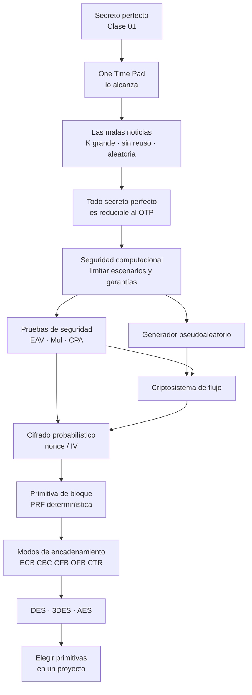

# Clase 02 — Cifrado simétrico

> **13/08 y 20/08 de 2026** — jueves, **teoría** · docente **Rodrigo Ramele** · [Filminas](../../raw/clases/Clase%2002%20-%20Criptografia%20-%20Cifrado.pdf) (64 slides) · Transcripciones: [13/08](../../raw/clases/Clase%2002pt1-Transcripcion.VTT) (865 cues, 2h08) y [20/08](../../raw/clases/Clase%2002pt2-Transcripcion.VTT) (541 cues, 1h25) — **3h33 en total** · Katz & Lindell **caps. 2 y 3** según la última filmina y según el docente el 20/08 (cue pt2 517), **1, 2 y 3** según el docente al cerrar el 13/08 (cues pt1 848-857); cap. 6 para DES y AES. Para DES y AES en detalle manda además a **Menezes**, *"el Libro Verde"*, que está en la biblioteca (cue pt2 517) — ver [[bibliografia|bibliografía]]
> Guía asociada: [[guia-02-criptografia-simetrica|Guía 2 — Criptografía Simétrica]] · [[guia-02-resolucion|Resolución]]
> Tarea que deja la clase: [[teoria-de-numeros|Teoría de números]]
> Viene de: [[clase-01-introduccion-y-criptografia-clasica|Clase 01 — Introducción y criptografía clásica]]

> **Una clase, dos jueves.** El [[cronograma]] parte esta clase en **Cifrado (1)** el 13/08 y **Cifrado (2)** el 20/08. Las filminas son un único PDF y la wiki las trata como una sola clase —convención del vault: *la clase es la semana temática completa*—, por eso todos los conceptos llevan prefijo `02.*`.
> **El corte no está marcado en el PDF, pero el borde está medido.** El 13/08 son 2h08 y llegan hasta la filmina **44**, la de seguridad de los modos: la última frase de la jornada —*"no está demostrado que existan las funciones pseudoaleatorias"* (cue pt1 836)— es literalmente el pie de esa lámina, y el docente cierra con *"vamos a tener otra clase"* (cue pt1 838) y la tarea de teoría de números. El 20/08 son 1h25 y la primera filmina que aparece es la **45**, la de DES (cue pt2 34); la jornada termina en la 64, la de la bibliografía (cue pt2 517).
> O sea, **13/08 = filminas 1-44 · 20/08 = filminas 45-64**, que esta nota desarrolla de la [[#1. Repaso: criptosistema y secreto perfecto|§1]] a la [[#10. Modos de encadenamiento|§10]] y de la [[#11. DES y 3-DES|§11]] a la [[#13. Criptosistemas en proyectos|§13]] más el cierre. *(La correspondencia filminas → secciones es del armado de la nota, no de la cátedra. Y no es una partición limpia del contenido hablado: la [[#1. Repaso: criptosistema y secreto perfecto|§1]], la [[#6. Generadores pseudoaleatorios|§6]] y la [[#9. Primitivas de cifrado en bloque|§9]] recogen además material dictado el 20/08 **fuera de filmina** — el repaso de apertura y las digresiones.)*
> *(Lectura nuestra, no declarada por la cátedra:* que los primeros cinco minutos del 20/08 sean un repaso hablado **sin proyectar** (cues pt2 2-23), y que **no haya ninguna filmina compartida** entre las dos fechas. Ninguna de las dos transcripciones menciona números de filmina, y hay dos pasajes del 20/08 compatibles con volver a mostrar una lámina del tramo anterior: *"lo que vamos a ver ahora de los algoritmos criptográficos (…) se ubican acá adentro de este bloque"* (cue pt2 44) y *"teníamos el block cipher encryption (…) entonces volvemos a ver eso (…) estamos acá"* (cues pt2 109-110). Lo firmemente medido es el **borde**, no la ausencia de solapamiento.*)*
> Entre medio no hubo práctica: el docente lo dice al abrir el 20/08 —*"como tampoco vieron el lunes"* (cue pt2 24)—, que es el **feriado del 17/08** y el hueco que llenan los videos de la [[practica-02-videos|Práctica 02]].

> **Cómo leer las citas.** Los bloques plegados **De la transcripción** traen lo que el docente dijo en voz y no está en ninguna filmina: analogías, reformulaciones, preguntas de alumnos y avisos sobre el parcial. Cada uno se despliega para ver la cita textual con su número de cue. Todo lo demás sale de las filminas.
> **Hay dos grabaciones y cada una numera sus cues desde 1**, así que las citas llevan la parte adentro del paréntesis: `pt1` es el 13/08 y `pt2` es el 20/08. Un `(cue pt2 143)` y un `(cue pt1 143)` no tienen nada que ver entre sí.
> Los dos `.VTT` son **transcripciones automáticas**: las repeticiones, los cortes de palabra y los errores de reconocimiento son del ASR. Las citas se normalizan —se sacan muletillas y tartamudeos, no se cambian palabras—; donde el original está degradado o donde la wiki completa una palabra, va marcado entre corchetes.

## Mapa de la clase

**El hilo de la clase en una frase**: el secreto perfecto se consigue —el OTP lo alcanza— pero no se puede pagar, así que se lo cambia por algo más barato, la seguridad computacional, y todo lo que sigue son construcciones que hay que **demostrar seguras contra una prueba concreta**.

Ese hilo no es una lectura de la wiki: **es el resumen con el que el propio docente abre la segunda fecha**, y el que confirma de frente la lectura de la [[#5. Criptosistemas de flujo|§5]] —*toda la clase es una sucesión de imitaciones cada vez más baratas del OTP*—, que hasta ahora se apoyaba en una sola frase suelta. De paso aparece el vocabulario **Alice, Bob y Mallory**, que ninguna filmina usa.

> [!quote]- De la transcripción — el hilo de la clase, dicho por el docente al abrir el 20/08 (cues pt2 2-23)
> *"Secreto perfecto es inviolable. La razón por la que es inviolable, cuando se cumplen las condiciones, es porque **el texto cifrado es indistinguible de random**: no hay nada, no hay cero información. Entonces dijimos: pará, la clave tiene que ser tan larga como el mensaje, no se puede costear; hay que ponerle un tema pragmático, y ahí arranca todo lo que tiene que ver con la **seguridad computacional**, que está basado en un nivel de seguridad que es una longitud, que es un $n$, y eso tiene que ver con el poder computacional. Y a partir de ahí (…) se le van dando más y más herramientas al atacante, y con eso se establece **un experimento formal** (…) que plantea cuánto un criptosistema se defiende o no versus ese atacante con ese nivel de poder. Ése es el esquema de toda la parte de criptografía."*
>
> *"Arrancamos con los cifradores de flujo, cuya idea es **imitar al One Time Pad** (…) y después los criptosistemas en bloque, que tienen una función de permutación (…) y modos de encadenamiento que **intentan hacer lo mismo que hace el One Time Pad pero a nivel de bloque en vez de a nivel de bit**. A medida que esos modos van siendo más seguros, más se parecen al One Time Pad."*

> [!quote]- De la transcripción — bibliografía, apertura y cierre del 13/08 (cues pt1 3-10, 37-38, 848-861)
> Antes de la primera filmina el docente dedica un minuto a **Katz & Lindell**: *"Este libro es un libro buenísimo (…) toda la primera parte gira alrededor de lo que está acá, todas estas primeras clases"*. Insiste en leerlo **en papel**: *"ya está recontra probado que cuando leen de copias físicas mejora la retención (…) por órdenes de magnitud"*. Al cerrar precisa el recorte: **capítulos 1, 2 y 3**, *"más o menos 40 o 50 páginas"*, para leer *"en el bondi o en el subte"*. Menciona ejemplares en la biblioteca de la universidad y que, si no aparecen, se pidió comprarlos por ser bibliografía obligatoria.
>
> En el cue pt1 859 dice *"esta es la segunda edición del libro"*, pero el PDF del vault es la **3ª edición (2020)**. *(Precisión nuestra.)*
>
> En los cues pt1 37-38, a los seis minutos, anuncia el resto del material de apoyo: *"todo lo que es teoría de números, todo lo que vieron en matemática discreta (…) temas de probabilidad, todo eso lo vamos a usar una y otra vez. Vamos a darles después un apunte, un poquito de teoría de la información, que se usa también en inteligencia artificial"*. De ahí salen [[teoria-de-numeros|Teoría de números]] y [[teoria-de-la-informacion|Teoría de la información]].

**La última filmina dice sólo "Capítulos 2 y 3"**; el capítulo 1 lo agrega el docente en voz, y es donde Katz & Lindell pone Kerckhoffs y los cifrados históricos de la [[clase-01-introduccion-y-criptografia-clasica|Clase 01]]. En la [[bibliografia|bibliografía]]: el cap. 2 es *Perfectly Secret Encryption* y el cap. 3 *Private-Key Encryption*, con los mismos juegos que define esta clase.

---

## Notación y terminología

Las filminas y Katz & Lindell **no escriben igual**, y la materia usa las dos formas: las filminas escriben $e_k$, $d_k$, $P$, $K$, $C$ y $\mathsf{Eav}_{A,\Pi}$; el libro —y el enunciado de la [[guia-02-criptografia-simetrica|Guía 2]]— escribe $\mathsf{Enc}_k$, $\mathsf{Dec}_k$, $\mathcal{M}$, $\mathcal{K}$, $\mathcal{C}$ y $\mathsf{PrivK}^{\mathsf{eav}}_{\mathcal{A},\Pi}$. **Son la misma cosa.** Donde difieren, la tabla lo dice. Lo que no conviene es mezclarlas dentro de un mismo ejercicio. La versión larga, con las variantes de la bibliografía, está en [[notacion-y-terminologia|Notación y terminología]].

El propio PDF deriva sin avisar: escribe $e_k$ en las filminas 17 y 21, $\mathsf{enc}_k$ en la 26 y la 34, $\mathsf{Enc}_k$ en la 28 y la 43; y el keystream pasa de $G(k)$ (filminas 17, 21, 26) a $G(s)$ (filmina 29) y a $G(S)$, $G(S')$ (filmina 32). Los tres símbolos designan cosas distintas —clave, semilla, semilla compuesta por clave e IV— y **la filmina nunca declara la transición**. *(Precisión nuestra.)*

### Espacios y sus elementos

| Símbolo | Qué significa | Dónde aparece |
|---|---|---|
| $\mathcal{M}$ | espacio de **mensajes** posibles. Las filminas lo escriben $P$ (de *plaintext*) en la terna y $M$ en las cotas | [[#1. Repaso: criptosistema y secreto perfecto\|§1]], [[#9. Primitivas de cifrado en bloque\|§9]] |
| $\mathcal{K}$ | espacio de **claves** posibles: todo lo que `Gen` puede llegar a sortear. En las filminas, $K$ | [[#1. Repaso: criptosistema y secreto perfecto\|§1]], [[#5. Criptosistemas de flujo\|§5]] |
| $\mathcal{C}$ | espacio de **criptogramas** posibles. En las filminas, $C$ | [[#1. Repaso: criptosistema y secreto perfecto\|§1]] |
| $\Sigma$ | el **alfabeto**; $\Sigma^{t}$ son las cadenas de largo $t$ sobre él | [[guia-02-resolucion#Ejercicio 4\|Ej. 4 de la Guía 2]] |
| $m$, $k$, $c$ | **un** mensaje, **una** clave, **un** criptograma concretos: elementos, no espacios | en todas las fórmulas |
| $\lvert \mathcal{K}\rvert$ | **cardinal**: cuántos elementos tiene el espacio. No es valor absoluto | las malas noticias de la [[#2. One Time Pad\|§2]] |
| $\{0,1\}^{n}$ | las cadenas de $n$ bits — el espacio típico cuando todo es binario | [[#2. One Time Pad\|§2]], [[#9. Primitivas de cifrado en bloque\|§9]] |
| $b$ | el **tamaño de bloque** de una primitiva, **independiente** del largo de clave $n$: en AES-256, $n = 256$ y $b = 128$ | [[#9. Primitivas de cifrado en bloque\|§9]], [[#13. Criptosistemas en proyectos\|§13]] |

### Los tres algoritmos

| Símbolo | Qué significa | Dónde aparece |
|---|---|---|
| `Gen` | **generador de clave**: sortea $k$. Probabilístico por definición — si no, no hay nada secreto | [[#1. Repaso: criptosistema y secreto perfecto\|§1]] |
| `Enc` | **cifrado**. Desde la [[#8. Cifrado probabilístico: nonce e IV\|§8]] deja de ser una función y pasa a ser un algoritmo **probabilístico**: además de $(k, m)$ toma un IV o nonce | toda la clase |
| `Dec` | **descifrado**. **Siempre determinístico**: el resultado tiene que ser único, si no el receptor no puede leer | [[#1. Repaso: criptosistema y secreto perfecto\|§1]], [[#8. Cifrado probabilístico: nonce e IV\|§8]] |
| $e_k(m)$ · $d_k(c)$ | la forma de las filminas para $\mathsf{Enc}_k(m)$ y $\mathsf{Dec}_k(c)$ — ver [[criptosistema#Notaciones equivalentes\|Criptosistema § Notaciones equivalentes]] | [[#1. Repaso: criptosistema y secreto perfecto\|§1]], [[#2. One Time Pad\|§2]], [[#5. Criptosistemas de flujo\|§5]] |
| $\Pi = (\mathsf{Gen}, \mathsf{Enc}, \mathsf{Dec})$ | el criptosistema **entero**, como un solo objeto. Es lo que va de subíndice en las pruebas | [[#7. Pruebas de seguridad e indistinguibilidad\|§7]] |
| $d_k(e_k(m)) = m$ | la **corrección**. No es seguridad: es la condición para que el sistema sirva — *"si no, no es un criptosistema"* (cue pt1 631) | [[#1. Repaso: criptosistema y secreto perfecto\|§1]], [[#8. Cifrado probabilístico: nonce e IV\|§8]] |

### Las dos flechas: dónde hay azar y dónde no

Es lo que más se confunde de toda la notación, y la [[practica-01-esquemas-y-taxonomias|Práctica 01]] lo marca explícitamente.

| Símbolo | Qué significa | Dónde aparece |
|---|---|---|
| $k \leftarrow \mathcal{K}$ | **sorteo**: $k$ se toma al azar de una distribución sobre $\mathcal{K}$ —uniforme salvo aclaración—. **Hay azar**: dos corridas pueden dar distinto | paso 2 de las tres pruebas, [[#7. Pruebas de seguridad e indistinguibilidad\|§7]] |
| $b \leftarrow \{0,1\}$ | el mismo sorteo sobre un bit: el experimentador tira una moneda y **la esconde** | paso 3 de las tres pruebas, [[#7. Pruebas de seguridad e indistinguibilidad\|§7]] |
| $m := \mathsf{Dec}_k(c)$ | **asignación determinística**: fijado el lado derecho, el izquierdo queda fijado. **No hay azar** | [[practica-01-esquemas-y-taxonomias\|Práctica 01]] |
| $1^{n}$ | el **parámetro de seguridad escrito en unario**, pasado como argumento: $\mathcal{A}(1^{n})$, $\mathsf{Gen}(1^{n})$. Se escribe así para que *"polinomial en el largo de la entrada"* signifique *"polinomial en $n$"*. Es notación de **Katz & Lindell**: las filminas de teoría escriben $A(n)$ y $\Pi(n)$; la de la **Práctica 3** sí la usa, y la escribe tal cual en $\mathsf{Gen}(1^{n})$ y en *"el adversario $A$ recibe $1^{n}$"* del experimento `CPA` | [[#4. Seguridad computacional\|§4]], [[practica-03-seudoaleatoriedad-y-modos\|Práctica 3]] |

**La regla corta:** flecha si el paso **puede salir distinto** dos veces; $:=$ si no. Por eso `Gen` va siempre con flecha, `Dec` va siempre con $:=$, y `Enc` **cambia de bando** en la [[#8. Cifrado probabilístico: nonce e IV|§8]] — que es lo que significa *cifrado probabilístico*.

### Probabilidad: mayúscula es la variable, minúscula es el valor

| Símbolo | Qué significa | Dónde aparece |
|---|---|---|
| $\Pr[\,\cdot\,]$ | probabilidad de un **evento**. La clase escribe indistintamente $\Pr[\,\cdot\,]$, $P[\,\cdot\,]$ y $P(\cdot)$ | [[#1. Repaso: criptosistema y secreto perfecto\|§1]], [[#2. One Time Pad\|§2]] |
| $M$, $K$, $C$ | las **variables aleatorias** mensaje, clave y criptograma. $C$ no se elige: queda **derivada**, $C = \mathsf{Enc}_K(M)$ | [[#1. Repaso: criptosistema y secreto perfecto\|§1]] |
| $m$, $k$, $c$ | los **valores concretos** que esas variables pueden tomar | idem |
| $\Pr[M = m]$ | la creencia **a priori**: lo que el adversario le asigna al mensaje **antes** de ver nada. La fija el idioma y el contexto, no el diseñador | [[#1. Repaso: criptosistema y secreto perfecto\|§1]] |
| $\Pr[M = m \mid C = c]$ | la creencia **a posteriori**: lo mismo **después** de ver el criptograma. La barra $\mid$ se lee *"dado que"* | [[secreto-perfecto\|secreto perfecto]] |
| $\Pr[C = c \mid M = m]$ | la que se usa **para verificar** secreto perfecto en la práctica, porque no depende de la distribución de los mensajes | [[modelo-probabilistico-de-un-criptosistema\|Modelo probabilístico]] |
| $\Pr[C = c] > 0$ | la **condición de soporte** que la filmina escribe dentro de la definición: sólo se exige la igualdad para criptogramas que efectivamente pueden aparecer, que es lo que hace que la condicional esté bien definida | [[#1. Repaso: criptosistema y secreto perfecto\|§1]] |

$M$ es *el mensaje como incógnita*, con toda su distribución encima; $m$ es *un* mensaje. Escribir $\Pr[m]$ no significa nada: la probabilidad se le toma a un **evento** —$M = m$—, no a un elemento del espacio. La definición de secreto perfecto vive entera en ese contraste: dice que la **variable** $M$ no cambia de distribución cuando se fija un **valor** $c$ de la variable $C$. La [[#La paradoja del secreto perfecto|paradoja de la §1]] es una confusión de esos dos niveles.

### El adversario y sus recursos

| Símbolo | Qué significa | Dónde aparece |
|---|---|---|
| $\mathcal{A}$ | el **adversario**: un algoritmo, no una persona. Las filminas y el resto de esta nota lo escriben $A$ | [[#7. Pruebas de seguridad e indistinguibilidad\|§7]] |
| $n$ | el **parámetro (o nivel) de seguridad**; en la práctica, el largo de la clave. Todo se afirma para la **familia** $\Pi(n)$, nunca para un sistema fijo. La filmina lo define por su función: *"relaciona la cota en el poder de un adversario y la probabilidad de éxito que tendrá"* | [[#4. Seguridad computacional\|§4]] |
| $\mathrm{PPT}$ | *Probabilistic Polynomial Time*: el adversario puede tirar monedas y corre en tiempo polinomial en $n$. Es la formalización de *"adversario limitado"* | [[#4. Seguridad computacional\|§4]] |
| $\varepsilon$, $\varepsilon(n)$ | la **ventaja** del adversario por encima de $0{,}5$. Sin el $(n)$ no se puede decir si es despreciable | [[#7. Pruebas de seguridad e indistinguibilidad\|§7]] |
| $\mathsf{negl}(n)$ | *"una función despreciable en $n$"*: decae más rápido que $1/p(n)$ para **todo** polinomio $p$. Escritura de Katz & Lindell; las filminas escriben $\varepsilon$ y dicen *despreciable* o *negligible* | [[seguridad-computacional\|Seguridad computacional]] |
| **oráculo** | caja negra que el adversario consulta sin ver adentro: le pasa $x$ y recibe $f(x) = e_k(x)$, **con la clave verdadera**, sin conocerla | [[#7. Pruebas de seguridad e indistinguibilidad\|§7]] |
| $b$, $b'$ | el **bit oculto** que sortea el experimentador y el bit que **emite** el adversario. Gana si $b = b'$ | [[#7. Pruebas de seguridad e indistinguibilidad\|§7]] |

### Las tres pruebas

| Símbolo | Qué significa |
|---|---|
| $\mathsf{Eav}_{A,\Pi}$ | **indistinguibilidad ante observador**. *Eav* es *eavesdropping*, espiar: el adversario sólo escucha. El experimento **vale $1$ si $A$ gana** |
| $\mathsf{Mul}_{A,\Pi}$ | igual, pero con **vectores** de mensajes cifrados con la misma clave |
| $\mathsf{CPA}_{A,\Pi}$ | igual que `Eav`, más el **oráculo** de cifrado. *Chosen plaintext attack*, texto plano escogido |
| $\mathsf{PrivK}^{\mathsf{eav}}_{\mathcal{A},\Pi}$ | **la misma prueba `Eav`** en la escritura de Katz & Lindell y del enunciado de la [[guia-02-criptografia-simetrica\|Guía 2]]. El superíndice nombra la prueba (`eav`, `cpa`), los subíndices el adversario y el criptosistema |
| $\Pr[\text{prueba} = 1] = 0{,}5 + \varepsilon$ | la condición de indistinguibilidad tal cual la escribe la filmina. Leída bien: $\le 1/2 + \varepsilon(n)$ **para todo** $A$ $\mathrm{PPT}$, con $\varepsilon$ despreciable |

Las definiciones operativas de los tres juegos están en la [[#7. Pruebas de seguridad e indistinguibilidad|§7]].

### Operadores

| Símbolo | Qué significa | Dónde aparece |
|---|---|---|
| $\oplus$ | **xor** bit a bit. La propiedad que hace andar media clase: de $c = m \oplus k$ salen $m = c \oplus k$ **y** $k = m \oplus c$ | [[#2. One Time Pad\|§2]], [[#5. Criptosistemas de flujo\|§5]], [[#10. Modos de encadenamiento\|§10]] |
| $\Vert$ | **concatenación** de cadenas: $\text{nonce} \Vert i$ es el nonce seguido del contador | [[#9. Primitivas de cifrado en bloque\|§9]], [[des-descripcion-del-algoritmo\|Descripción del algoritmo DES]] |
| $\circ$ | **composición**: $(\pi_2 \circ \pi_1)(m) = \pi_2(\pi_1(m))$ — primero actúa la de la derecha | [[guia-01-resolucion\|Ej. 2 de la Guía 1]] |
| $\bmod$ | el **resto** de la división: $a \bmod n$ está entre $0$ y $n-1$. Es una **operación** | [[#6. Generadores pseudoaleatorios\|§6]], [[guia-02-resolucion#Ejercicio 7\|Ej. 7 de la Guía 2]] |
| $\equiv \pmod{n}$ | **congruencia**: $a \equiv b \pmod{n}$ quiere decir que $n$ divide a $a - b$. Es una **relación**, no una operación | [[aritmetica-modular-y-divisibilidad\|Aritmética modular y divisibilidad]] |
| $\lll$ | *"muchísimo menor que"*, sin definición formal: la filmina lo usa para $\lvert \mathcal{K}\rvert$ contra $\lvert \mathcal{M}\rvert$ en el cifrado de flujo | [[#5. Criptosistemas de flujo\|§5]] |

### Símbolos de demostración

| Símbolo | Qué significa | Cómo se usa acá |
|---|---|---|
| $\forall$ | *"para todo"* | *"para todo $m$ y todo $c$"* — el cuantificador que hace fuerte a la definición de secreto perfecto |
| $\exists$ | *"existe"* | *"existe un adversario que gana"* — para tumbar un esquema alcanza con exhibir **uno** |
| $\Rightarrow$ | *"implica"*: si vale lo de la izquierda, vale lo de la derecha | *"determinístico $\Rightarrow$ no pasa `Mul`"* |
| $\iff$ | *"si y sólo si"*: las dos implicaciones a la vez. Es una **equivalencia**, y demostrarla cuesta el doble | *"secreto perfecto $\iff$ reducible al OTP"*, [[#3. Más allá del OTP\|§3]] |
| $(\Rightarrow)$ · $(\Leftarrow)$ | los rótulos con los que se **parte en dos** la demostración de un $\iff$ | convención de la wiki en toda demostración de equivalencia |
| ∎ | fin de la demostración | [[cifrado-por-rotacion\|Cifrado por rotación]] |

Cuando el enunciado es una equivalencia, la respuesta completa tiene **dos mitades** y conviene rotularlas: $(\Rightarrow)$ *"si tiene secreto perfecto, entonces es reducible al OTP"* y $(\Leftarrow)$ la vuelta. Escribir una sola mitad es media respuesta.

### Cómo se demuestra que algo NO es seguro

La clase demuestra que algo **sí** es seguro de una sola manera: por reducción, y siempre condicionalmente —*si* la primitiva es pseudoaleatoria, *entonces* la construcción pasa la prueba—. Para demostrar que algo **no** es seguro usa tres formas distintas:

1. **Contraejemplo.** La definición dice *"para todo"*; negarla es exhibir **uno**. Es como cae el [[#El ejercicio de la clave sesgada|ejercicio de la clave sesgada]]: con esa distribución resulta $\Pr[M{=}00 \mid C{=}01] = 0{,}32 \ne 0{,}60 = \Pr[M{=}00]$, y con ese único par el secreto perfecto está roto. No hace falta decir *cuánta* información se filtra: alcanza con que la igualdad falle una vez.
2. **Exhibir un adversario concreto.** Describir un $A$ —qué mensajes elige y por qué, qué recibe, con qué regla emite $b'$— y **calcular** $\Pr[\text{prueba} = 1]$. Si da $1$, o si se aparta de $0{,}5$ en algo no despreciable, el esquema no pasa. Es la forma del ataque a `CPA` sobre un cifrado determinístico y la del [[guia-02-resolucion#Ejercicio 4|Ej. 4 de la Guía 2]]. Lo que se corrige acá es **el procedimiento**: ver [[#El aviso más explícito de la clase sobre el parcial|el aviso sobre el parcial]].
3. **Reducción.** *"Si esto se rompe, entonces aquello también"*. La clase la usa en las dos direcciones: hacia arriba para demostrar seguridad —[[#10. Modos de encadenamiento|§10]]: *CBC es tan seguro como pseudoaleatoria sea la primitiva*— y hacia abajo para demostrar que no la hay, que es el segundo resultado de la [[#3. Más allá del OTP|§3]]. Es la única de las tres que no necesita mirar el esquema por dentro.

---

## 1. Repaso: criptosistema y secreto perfecto

La clase abre repitiendo la terna de la [[clase-01-introduccion-y-criptografia-clasica|Clase 01]]:

$$\begin{aligned}
\mathsf{Gen} &: ()\to K &&\quad \text{generador de clave}\\
\mathsf{Enc} &: K\times P \to C &&\quad \text{cifrado}\\
\mathsf{Dec} &: K\times C \to P &&\quad \text{descifrado}
\end{aligned}$$

con la propiedad básica $d_k(e_k(m)) = m$ para todo $m$ y $k$ válidos, y la definición de [[secreto-perfecto|secreto perfecto]]: para **toda** distribución de probabilidades en $M$, cada mensaje $m$ y cada criptograma $c$ **tal que $\Pr[C = c] > 0$**,

$$\Pr[M = m \mid C = c] = \Pr[M = m]$$

> [!quote]- De la transcripción — qué cubre la criptografía y qué se está mirando en esta clase (cues pt1 15, 34-36, 228)
> Antes de la terna, el docente encuadra el objetivo, cosa que la filmina no hace: *"criptografía trata de cubrir 3 objetivos: [el] objetivo de disponibilidad de información, después objetivos de privacidad, confidencialidad e integridad de la información. Eso es lo que cubre criptografía, que es una parte de todo lo que es seguridad informática."* *(Privacidad y confidencialidad se usan como sinónimos en la clase.)*
>
> Y aclara el recorte de esta clase (cue pt1 228): estamos **sólo en confidencialidad** — la integridad es la [[cronograma|Clase 3]].
>
> Al leer la definición de secreto perfecto enuncia en voz la condición de soporte: cada criptograma $c$ *"tal que la probabilidad de ese $c$ es positiva, es decir, que es un cifrado que puede aparecer"* (cues pt1 34-36).

> [!quote]- De la transcripción — Kerckhoffs, dicho con más énfasis (cues pt1 23-29)
> *"Este es un principio súper básico que tienen que tener y lo tienen que saber, **tienen que grabárselo a fuego**. Lo único que es secreto es la clave. Entonces nunca tienen que asumir que hay otra cosa más que es secreta, como el algoritmo."*
>
> Y el ejemplo histórico que la filmina no da: *"durante muchos años Microsoft hacía seguridad informática por ofuscación o por ocultamiento (…) mucha gente creía que eso le daba seguridad"*, y de ahí buena parte de su historial de agujeros. Es el contraejemplo del [[principio-de-kerckhoffs|principio de Kerckhoffs]].

### La paradoja del secreto perfecto

Va en un recuadro de la filmina, y es lo único nuevo del repaso:

> Notar que $c = e_k(m)$, así que las variables aleatorias discretas $C$ y $M$ son **dependientes**. Sin embargo, la propiedad de secreto perfecto interpretada probabilísticamente dice que son **independientes**.

No hay contradicción: $C$ es una función determinística **del par $(M, K)$**, no de $M$ solo. La aleatoriedad de $K$ es lo que rompe la dependencia entre $M$ y $C$. Con $K$ fija, $M$ y $C$ serían dependientes y el criptograma revelaría todo; con $K$ uniforme e independiente de $M$, la dependencia se disuelve. **El secreto perfecto es la afirmación de que la clave aporta tanta incertidumbre como la que el mensaje podría filtrar** — de ahí que cueste $\lvert K\rvert \ge \lvert M\rvert$.

> [!quote]- De la transcripción — la clave es la que ata la dependencia (cues pt1 63-66, 163-166)
> *"La clave está justamente en que, probabilísticamente, esa dependencia se logra a partir del conocimiento del $K$. Y si $K$ no se conoce, no existe."*
>
> Al explicar por qué la clave debe ser uniforme lo reformula: ***"la clave es la que ata la dependencia"***, y si no es uniforme *"no sirve para romper esa dependencia natural que hay entre…"* [el criptograma y el mensaje]. *(El cierre de la última frase está degradado en el ASR y es reconstrucción nuestra; el sentido es inequívoco por el contexto.)*

> [!quote]- De la transcripción — la definición traducida por un alumno (cues pt1 46-62)
> Juan Ignacio Causse la traduce y el docente la valida: *"$M$ y $C$ son variables aleatorias independientes (…) la probabilidad de obtener el mensaje no cambia si vos tenés la posibilidad de ver o no ver el mensaje cifrado"*.
>
> El docente le pone la imagen operativa: *"el hecho de conocer $C$ no aporta nada de información, es cero. **Es lo mismo saberlo que no saberlo**"* — da igual que el criptograma viaje por la red y alguien lo levante con Wireshark.
>
> De ahí el salto a teoría de la información (cue pt1 57), que la wiki desarrolla en [[teoria-de-la-informacion#8. El puente con criptografía|Teoría de la información § El puente con criptografía]] —entropía, información mutua y esta misma frase escrita $I(M;C) = 0$— y, con las cuentas de Bayes, en [[probabilidad-y-criptografia|Probabilidad y criptografía]].

> **Errata de la filmina:** escribe *"las variables aleatorias discretas **C** y **E** son dependientes"*. Por el contexto, **$E$ es un error de tipeo por $M$**: la paradoja es entre mensaje y criptograma. En la transcripción el docente lee la filmina diciendo *"el valor de $C$ surge de aplicar un método de encriptación al mensaje $M$"* (cue pt1 64).

### Codificar, ofuscar y cifrar no son lo mismo

No está en ninguna filmina: es un paréntesis que el docente abre el 20/08, en medio de DES, y que marca explícitamente como **pregunta de examen**. Es la definición de [[criptosistema]] leída al revés — lo único que separa las tres cosas es **si hay una clave**:

| | Usa clave | Qué le pasa en `Eav` | Ejemplo |
|---|---|---|---|
| **Codificación** | No | $\Pr[\mathsf{Eav} = 1] = 1$: el adversario descodifica y listo | Base64 |
| **Ofuscación** | No | idem: el programa corre igual, o sea que la información está toda ahí | renombrar variables, romper el formato |
| **Cifrado** | **Sí** | es la única de las tres que puede pasar la prueba | DES, AES |

Es el mismo argumento que el [[principio-de-kerckhoffs|principio de Kerckhoffs]] —seguridad por oscuridad— aplicado un nivel más abajo: allá el secreto era el algoritmo, acá directamente **no hay secreto ninguno**. Lo que agrega el 20/08 es el argumento formal: sin clave, el observador del juego `Eav` gana con probabilidad $1$, así que la pregunta *"¿cuánta seguridad da?"* ya está contestada antes de mirar el algoritmo. Ofuscar puede seguir sirviendo para encarecerle el trabajo a alguien; lo que no puede es sustituir a un criptosistema.

> [!quote]- De la transcripción — Base64 no cifra, y la pregunta cae en el examen (cues pt2 135-162)
> *"¿Ustedes creen que [Base64] es un protocolo, es un algoritmo de un criptosistema, o no? — **No cifra.** ¿Por qué no cifra? Vos ponés un texto, sale el texto en base 64 (…) **no hace uso de la clave**. Entonces, si no es un algoritmo de cifrado y no es un criptosistema, ¿qué es Base64? ¿Qué tipo de algoritmo es? — **Codificación**. Perfecto. Eso es. **Aparece siempre en examen, porque es una pregunta [caza-bobos]** (…) van a ver cómo se dan cuenta si alguien estudió o no criptografía si cae en este error."*
>
> El error en la vida real: *"es fácil caer en ese error, porque el lenguaje es confuso. Esto se implementó en bancos, que decían: «quedate tranquilo que mi sistema está todo **cifrado en base 64**»."*
>
> Y la segunda mitad, ofuscación (cues pt2 150-162): *"¿Qué significa ofuscar el código? — Que sea difícil de leer. / Se busca que sea difícil hacer ingeniería inversa. — Es que vos encontrás una manera en que el código puede correr igual, pero es más complejo de leer, y tenés rotos los nombres y las variables (…) **Ahí no hay ningún cifrado. No hay clave, nada.** (…) No son mecanismos de seguridad basados en una clave; por lo tanto, **es un error confiar en esos mecanismos solos** (…) piénsenlo desde la perspectiva del experimento de eavesdropping: **pasa directo, entonces no tiene ningún sentido. La probabilidad es 1 para el atacante**, porque simplemente es descodificarlo. Pero sí es cierto que a veces ayudan a complicar las cosas."*

## 2. One Time Pad

El OTP es el testigo de que el secreto perfecto **existe**: no es una definición vacía. La filmina lo atribuye a **Vernam (1917)**.

$$\begin{aligned}
\mathsf{Gen} &: k \leftarrow \{0,1\}^n,\quad n = \lvert m\rvert\\
\mathsf{Enc} &: e_k(m) = m \oplus k\\
\mathsf{Dec} &: d_k(c) = c \oplus k
\end{aligned}$$

El único cálculo de OTP que la clase hace a mano, sobre 17 bits:

$$\begin{array}{l|ccccccccccccccccc}
m & 0&0&1&0&1&1&0&1&0&0&0&1&0&1&1&1&0\\
k & 0&1&1&0&0&1&1&1&0&1&0&0&1&1&0&1&0\\
\hline
c & 0&1&0&0&1&0&1&0&0&1&0&1&1&0&1&0&0
\end{array}$$

> **Errata de la filmina:** escribe *"Atribuido a **Verman** (1917)"*. El apellido es **Vernam** — Gilbert Vernam, ingeniero de AT&T. *(Precisión nuestra; la errata está en la fuente.)*

**La demostración va en dos filminas.** El **Lema 1** establece que $\Pr[C = c] = 1/N$ con $N = 2^{n} = \lvert K\rvert$, para todo $c$:

$$\begin{aligned}
\Pr[C = c] &= \textstyle\sum_{k}\Pr[C = c \cap K = k]\\
\Pr[C = c \cap K = k] &= \Pr[M = c \oplus k \cap K = k]\\
&= \Pr[M = c \oplus k]\cdot \Pr[K = k]\\
&= \Pr[M = c \oplus k]\cdot \tfrac{1}{N}\\
\Pr[C = c] &= \tfrac{1}{N}\textstyle\sum_{k}\Pr[M = c \oplus k] \;=\; \tfrac{1}{N}
\end{aligned}$$

Los dos globos de la filmina marcan las **dos hipótesis** que hacen andar la cuenta, y son lo que hay que nombrar al escribirla: **$k$ y $m$ se eligen independientemente** —lo que permite factorizar la intersección— y, al recorrer todos los $k$, **$c \oplus k$ recorre todos los mensajes, así que la suma de probabilidades da $1$**. La segunda filmina cierra por Bayes:

$$\begin{aligned}
\Pr[M{=}m \mid C{=}c]\cdot \Pr[C{=}c] &= \Pr[C{=}c \cap M{=}m]\\
&= \Pr[K = c \oplus m \cap M{=}m]\\
&= \Pr[K = c \oplus m]\cdot \Pr[M{=}m]\\
\Pr[M{=}m \mid C{=}c]\cdot \tfrac{1}{N} &= \tfrac{1}{N}\cdot \Pr[M{=}m]\\
\Pr[M{=}m \mid C{=}c] &= \Pr[M{=}m]
\end{aligned}$$

> [!quote]- De la transcripción — dónde está el truco de la demostración (cues pt1 131-141)
> Las dos filminas son cadenas de igualdades sin comentario. El docente señala qué es lo único que las hace andar: **la simetría del xor**. *"El proceso común siempre es: agarran el mensaje, lo xorean con la clave y les da el criptograma; agarran el criptograma, lo xorean con la clave y les da el mensaje. Ahora, **si xorean el criptograma y el mensaje, les da la clave**."*
>
> Esa tercera identidad —$k = m \oplus c$— es la que permite reescribir el evento $\{C = c\}$ como un evento sobre $K$, que es el paso no obvio de la segunda filmina. Y el corolario intuitivo (cues pt1 138-139): *"cualquier criptograma puede venir de cualquier mensaje, dada una clave $k$ específica; entonces es lo mismo que ver random totalmente"*.

> [!quote]- De la transcripción — de dónde sale el $1/N$ (cues pt1 120-128)
> Una alumna, María Agustina, pregunta por el otro paso oscuro del Lema 1. *"Este $1$ sobre $N$ viene porque es la elección de la clave. Cuando vos tenés una clave, ¿cuál es la distribución de cómo vas a elegir las claves? Y eso es uniforme, porque vos querés que la clave sea aleatoria, que todos los valores posibles de claves que vos podés tener tengan la misma probabilidad, que no haya ninguna clave particular que sea más importante que las otras, que aparezca más seguido; vos querés que todas sean iguales."*
>
> Y por qué la sumatoria colapsa a $1$ (cue pt1 128): *"la probabilidad de todos los mensajes posibles para todas las claves posibles es 1 porque estás recorriendo todos los valores, porque es una sumatoria"*.

**Las malas noticias** son tres:

1. Secreto perfecto $\Rightarrow \lvert K\rvert \ge \lvert C\rvert$ — la clave es tan larga como el mensaje. *(La filmina escribe $\lvert C\rvert$; la cota de Shannon se enuncia habitualmente con $\lvert M\rvert$. Con $\lvert C\rvert$ también vale, porque $\lvert C\rvert \ge \lvert M\rvert$, pero es la forma no canónica y la clase no lo aclara.)*
2. **Reutilizar la clave la mata**: de $c_{1} = m_{1}\oplus k$ y $c_{2} = m_{2}\oplus k$ sale $c_{1} \oplus c_{2} = m_{1} \oplus m_{2}$, y se pierde el secreto perfecto.
3. La clave **debe ser aleatoria**, y la filmina pregunta cómo garantizarlo.

> [!quote]- De la transcripción — el OTP en la vida real (cues pt1 67-87)
> El caso que la filmina no menciona: el canal directo entre el presidente de Estados Unidos y el líder soviético durante la Guerra Fría estaba cifrado con OTP, y la logística era literalmente *"un libro de claves"* compartido de antemano, *"tenían que ir usando una cara y después la otra"*. Es la ilustración de por qué la primera mala noticia es de **logística**, no de matemática.
>
> De paso recomienda **Cryptonomicon**, de Neal Stephenson: *"Es un libro espectacular. Se lo superrecomiendo (…) es un libro que tiene 20 años, probablemente, y mucho de lo que vivimos actualmente está en ese libro como una gran predicción."*

> [!quote]- De la transcripción — cómo nombra el docente cada mala noticia (cues pt1 143-170)
> La (1): *"la logística de eso es muy mala, porque significa que hay que dar algo previo que es tan largo como el mismo mensaje que uno quiere mandar"* (cue pt1 143); antes ya lo había llamado *"un problema de logística"* (cue pt1 86).
>
> La (2): al reusar la clave *"se empieza a chorrear [leakear] bits de información detrás de todo esto. Y entonces se pierde el secreto perfecto"* (cues pt1 150-151). *(El ASR degrada el pasaje; "chorrear/leakear" es la lectura del vault sobre lo que se escucha.)*
>
> La (3) queda como tarea explícita —*"ustedes después hagan esta cuenta y van a ver que empieza a aparecer información"* (cues pt1 167-168)— y avisa dónde se cobra: *"en la práctica van a hacer un montón de estos; creo que hay 2 o 3 ejercicios"*. Son los **Ej. 1 a 4 de la [[guia-02-criptografia-simetrica|Guía 2]]**, resueltos en la [[guia-02-resolucion|resolución]].

> [!quote]- De la transcripción — el OTP como receta doméstica (cues pt1 219-224)
> *"Si tenés un mensaje que querés que nadie pueda leer, lo xoreás, lo dejás escrito en un lugar y te guardás la clave —de la misma longitud, elegida de forma aleatoria con distribución uniforme— y **eso no te lo puede romper nadie. No hay chance.**"* El porqué: *"el criptograma que generaste puede ser cualquier cosa, depende simplemente de la clave; **es indistinguible de azar puro**"*.

### El ejercicio de la clave sesgada

Es la demostración de que basta un sesgo en `Gen` para romper el secreto perfecto. La filmina da las **dos distribuciones completas**:

| $k$ | $\Pr[K = k]$ | | $m$ | $\Pr[M = m]$ |
|---|---|---|---|---|
| $00$ | $0{,}3$ | | $00$ | $0{,}60$ |
| $01$ | $0{,}1$ | | $01$ | $0{,}15$ |
| $10$ | $0{,}4$ | | $10$ | $0{,}10$ |
| $11$ | $0{,}2$ | | $11$ | $0{,}15$ |

Observado $c = 01$, se pide $\Pr[M{=}00 \mid C{=}01]$. El paso no obvio es que **la probabilidad total se suma sobre las cuatro claves, no sobre los mensajes**:

$$\begin{aligned}
\Pr[C{=}01] &= \textstyle\sum_{k}\Pr[M = 01\oplus k]\cdot\Pr[K = k]\\
&= 0{,}15\cdot 0{,}3 + 0{,}6\cdot 0{,}1 + 0{,}15\cdot 0{,}4 + 0{,}1\cdot 0{,}2 = 0{,}185
\end{aligned}$$

El otro paso es traducir un evento sobre $C$ en un evento sobre $K$: $\Pr[C{=}01 \mid M{=}00] = \Pr[K = 01\oplus 00] = \Pr[K{=}01] = 0{,}1$. Con Bayes,

$$\Pr[M{=}00 \mid C{=}01] = \frac{0{,}1\cdot 0{,}6}{0{,}185} = 0{,}32 \;\ne\; 0{,}60 = \Pr[M{=}00]$$

> **Erratas de la filmina del ejercicio.** El enunciado escribe *"se obtiene un mensaje C=01"* —$C{=}01$ es un criptograma— y cierra la pregunta con *"¿Que probabilidades hay que M=00)"*, sin tilde, sin el *de* y con el paréntesis desbalanceado. En el desarrollo escribe $\Pr(K = 01 * M \mid M = 00)$ con un asterisco donde va el xor: es $\Pr(K = 01 \oplus M \mid M{=}00)$. *(Precisiones nuestras.)*

→ Concepto: **[[one-time-pad|One Time Pad]]** — la demostración completa, la tabla de posteriores del ejercicio y las erratas de las filminas.

## 3. Más allá del OTP

Dos resultados teóricos cierran el tema:

- Cualquier criptosistema con **secreto perfecto es reducible al OTP**.
- Cualquier sistema que **no** sea reducible al OTP **no** tiene secreto perfecto.

Juntos son una condición necesaria y suficiente, y la consecuencia es que **el secreto perfecto es demasiado impráctico**. No es que falten construcciones: **no hay ninguna otra**. Hace falta cambiar la definición de seguridad, no buscar mejores esquemas.

> [!quote]- De la transcripción — cómo lee el docente los dos resultados (cues pt1 177-186)
> Los junta en una frase: *"es una condición necesaria y suficiente"*, y agrega la imagen algebraica: *"cualquier cosa que tenga secreto perfecto va a poder establecer un enlace, un homomorfismo, con el One Time Pad"* (cues pt1 180-181). *(La palabra "homomorfismo" es del docente en voz; no aparece en las filminas y la clase no define de qué estructura se trata. Tomala como intuición, no como enunciado.)*
>
> Y cuantifica lo impráctico: *"hay que transmitir tantas claves como mensajes"*, con el uso realista acotado a *"una comunicación específica entre 2 jefes de Estado en un contexto de guerra fría, con probabilidades no nulas de aniquilación mutua"*.

### La pregunta que abre el resto de la materia

Ninguna filmina la registra. Un alumno pregunta si los algoritmos actuales tienen secreto perfecto; la respuesta es que **ninguno lo tiene**. La repregunta —*no tenerlo, ¿implica ser inseguro?*— es la que contesta el resto de la clase y el resto del curso: hay que reemplazar una propiedad absoluta por una **medida relativa a un adversario y a una prueba**. La [[#4. Seguridad computacional|§4]] es la relajación, la [[#7. Pruebas de seguridad e indistinguibilidad|§7]] son las pruebas, y la [[#13. Criptosistemas en proyectos|§13]] es el vocabulario final —*seguro / debilitado / quebrado*— que sale de haber disgregado la palabra.

> [!quote]- De la transcripción — el intercambio completo (cues pt1 192-217, 245-250)
> Pregunta: *"¿Y los algoritmos actuales tampoco tienen secreto perfecto? Si no tenés una clave del mismo tamaño que el mensaje, entonces no podés tener secreto perfecto de ninguna forma."*
>
> Respuesta, sin matices: ***"Ningún algoritmo actual, por más sofisticado que sea, superpower del ejército o lo que quieras, tiene el secreto perfecto"*** (cues pt1 209-211). *"Esa igualdad no se cumple, es decir, **el criptograma revela información**. Revela información en todos, por un tema pragmático."*
>
> El alumno repregunta: *"el hecho de que no tenga secreto perfecto, ¿no implica entonces que sea inseguro? Puede ser seguro igual."* Y ahí el docente enuncia el programa de la materia (cues pt1 216-217): ***"Vamos a empezar a jugar con qué (…) significa seguro y vamos a disgregar esa palabra. Seguro, en esta materia — la única materia donde 'seguro' (…) no se usa así de forma laxa—, sino que vamos a ir definiendo a dónde vamos."***
>
> Poco después lo aterriza contra un sistema real (cues pt1 245-250): *"ustedes podrían, con el acceso que se hace a un home banking, por ejemplo, que está encriptado (…) si ustedes ven sólo el ciphertext, determinar el texto plano original: sí es posible. Eventualmente es posible. No es que si tuviese secreto perfecto, sabemos que no es posible, no hay forma, no hay forma absoluta. Es lo mismo que vean random puro."*

> [!quote]- De la transcripción — un cabo suelto sobre algoritmos públicos, marcado y no desarrollado (cues pt1 205-206)
> Ante la pregunta de si ser públicos no vuelve vulnerables a los algoritmos, contesta que no y agrega: *"después hay una vuelta de rosca, eso más adelante"*. **No la desarrolla en esta clase** y la transcripción no permite saber a qué apuntaba.

## 4. Seguridad computacional

> **Secreto perfecto = seguridad incondicional.**

La filmina dibuja la relajación como una caída, por dos vías:

| Se relaja | Qué significa |
|---|---|
| **Limitar escenarios** | Garantizar seguridad sólo contra adversarios *"limitados"*: se asume una cota en sus recursos, **especialmente tiempo** |
| **Limitar garantías** | Aceptar una **pequeña probabilidad de éxito** del atacante. *"Se deja de lado la infalibilidad"* |

Eso se formaliza con el **nivel de seguridad $n$**, que la filmina define por lo que hace: *"relaciona la cota en el poder de un adversario y la probabilidad de éxito que tendrá"*. El adversario corre algoritmos $\mathrm{PPT}(n)$ —*Probabilistic Polynomial Time*— y su probabilidad de éxito debe ser **despreciable** en $n$.

> **Errata de la filmina:** escribe *"Probabilistic **Polinomial** Time"* (es *Polynomial*) y define lo despreciable como $\varepsilon(n)$ es despreciable $\iff \lim \varepsilon(n) < 1/n^{k}$. Tal como está no dice a qué tiende el límite ni cuantifica el $k$, y queda trivial: el límite de una función despreciable es $0$. La definición correcta es que $\varepsilon(n) < 1/n^{k}$ **para todo** $k$ a partir de cierto $n$ — ver [[seguridad-computacional|Seguridad computacional § Función despreciable]]. *(Precisión nuestra.)*

> [!quote]- De la transcripción — la metáfora que ordena el resto de la clase (cues pt1 233-238)
> *"Vamos a empezar a definir el concepto de un adversario y al adversario le vamos a dar límites (…) **es como que le vamos a ir soltando la soga al adversario**. Primero lo vamos a recontra-limitar y le vamos a ir diciendo: bueno, además de hacer esto, puede hacer esto, y esto. Arrancamos con un adversario que es lo menos poderoso posible y lo vamos a ir haciendo cada vez más poderoso."*
>
> Es la secuencia `Eav` → `Mul` → `CPA` de la [[#7. Pruebas de seguridad e indistinguibilidad|§7]]: no son tres pruebas sueltas, es un adversario al que se le va soltando la soga.

**El nivel de seguridad tiene fecha de vencimiento.** $n$ es típicamente la longitud de la clave, y su función es que recorrer el espacio por fuerza bruta cueste milenios; pero el valor concreto que hace falta cambia con el hardware disponible. Los algoritmos se reemplazan por dos motivos distintos: porque **sube el $n$ necesario**, o porque el algoritmo **no admite un $n$ más grande** y hay que cambiarlo entero. Es la explicación de por qué DES no se rompió de golpe — ver la [[#11. DES y 3-DES|tabla de erosión de la §11]].

> [!quote]- De la transcripción — qué significa el $n$, en concreto (cues pt1 414-432, 437-438)
> La filmina define el nivel de seguridad y no lo aterriza. El docente: $n$ es *"típicamente la longitud de la clave"*, y su función es que *"el tiempo de procesamiento que uno puede hacer probando todas las condiciones posibles, haciendo fuerza bruta, **sea de milenios**"*.
>
> Y el envejecimiento (cues pt1 437-438): *"Ese $N$ viene de un contexto, de un momento dado particular. En el 2026 ese $N$ tiene, para algún algoritmo particular, un número concreto, y en el 2040 va a tener otro número, y hace 10 años atrás tenía otro número, y así."*

→ Concepto: **[[seguridad-computacional|Seguridad computacional]]** — PPT, función despreciable, y por qué el $\varepsilon$ de las filminas tiene que depender de $n$.

## 5. Criptosistemas de flujo

$$\begin{aligned}
\mathsf{Gen} &: k \leftarrow K\\
\mathsf{Enc} &: e_k(m) = G(k) \oplus m\\
\mathsf{Dec} &: d_k(c) = G(k) \oplus c
\end{aligned}$$

Es el OTP con la clave reemplazada por la salida de un **generador pseudoaleatorio**, y la diferencia es de tamaño: $\lvert K\rvert \lll \lvert M\rvert$. La filmina ejemplifica con $\lvert K\rvert = 2^{128}$ y $\lvert M\rvert = \lvert K\rvert^{128}$. *(Ese exponente da $2^{16384}$, un número sin interpretación natural para un espacio de mensajes; lo que la filmina quiere decir es que los mensajes son muchísimo más largos que la clave, pero el $128$ es arbitrario y no lo justifica.)*

Ese $\lll$ es exactamente lo que el [[secreto-perfecto#Teorema de Shannon (cota de claves)|teorema de Shannon]] prohíbe para secreto perfecto. La construcción **no puede** ser perfectamente secreta, y apunta a la definición nueva:

> **Teorema:** si $G(\cdot)$ es un generador pseudoaleatorio, entonces el criptosistema es **indistinguible ante observadores** — pasa `Eav`.

> [!quote]- De la transcripción — el secreto perfecto que se parte (cue pt1 255)
> *"Tomen todo esto como que **se parte el secreto perfecto**, y vamos a ir rompiendo cositas del secreto perfecto, pero tratando de que lo que vamos a ir construyendo sea **como una especie de secreto perfecto**."*
>
> El flujo cambia $k$ por $G(k)$; el nonce recupera *"claves distintas"*; y de los modos de bloque dice, al llegar a `CFB` (cue pt1 787), que *"se está pareciendo cada vez más a lo que es el mismo OTP"*. **Toda la clase es una sucesión de imitaciones cada vez más baratas del One Time Pad.**

> [!quote]- De la transcripción — de dónde sale la clave, ahora (cues pt1 285-291)
> *"Es muy impráctico tener que usar claves nuevas todo el tiempo, entonces puedo tener un generador pseudoaleatorio que me genere las claves (…) con eso voy a tener una especie de clave nueva todo el tiempo."*
>
> Y el punto de vocabulario: ***"el seed se empieza a transformar en una especie de clave"***. La semilla del generador **es** la clave del criptosistema — por eso $\lvert K\rvert$ pasa a ser el tamaño de la semilla y no el del mensaje.

→ Concepto: **[[criptosistema-de-flujo|Criptosistema de flujo]]**

## 6. Generadores pseudoaleatorios

Son **algoritmos determinísticos** que expanden una **semilla** (*seed*) y cuya salida *parece* aleatoria. Con $D = \{\, f: \{0,1\}^{n} \to \{0,1\} \,\}$ una familia de funciones:

$$G: \{0,1\}^s \to \{0,1\}^n,\ s < n \quad\text{es PRG respecto de } D \iff \forall f \in D:\ P\big(f(G(r^s)) \neq f(r^n)\big) = \varepsilon$$

Las tres anotaciones con flecha de la filmina traducen cada símbolo: el $P$ es una **probabilidad generalizada**, $r^{n}$ es una **secuencia realmente aleatoria** y $\varepsilon$ es un **valor despreciable**. Leído entero: **ninguna prueba estadística $f$ distingue la salida del generador de una secuencia aleatoria.**

El diagrama de la filmina es un **registro de desplazamiento**: ocho bits con un valor concreto cargado ($0\,0\,0\,0\,1\,1\,1\,0$), tres posiciones resaltadas cuyas salidas se xorean en dos compuertas encadenadas, y el resultado se realimenta a la entrada del registro.

> [!quote]- De la transcripción — el diálogo que instala el problema (cues pt1 260-272)
> El docente no arranca por la definición sino por una pregunta a la clase: *"¿las computadoras son deterministas o son estocásticas?"* Respuesta del curso: deterministas. *"¿Y cómo hacen las computadoras para tener algo de estocasticidad?"* — usan semillas. Y un alumno cierra el círculo: *"si se sabe el proceso con el que se genera ese número y se tiene la semilla, también se puede determinar el número final"*.
>
> Ésa **es** la definición de pseudoaleatorio: no hay azar, hay una función determinística cuya salida no se puede predecir barato. La entropía real de la máquina queda para más adelante (cues pt1 272-273), y ese "más adelante" es [[numeros-aleatorios-y-randomness|Sobre números aleatorios y randomness]].

**Ese pendiente lo contesta la segunda fecha**, en una digresión larga que no está en ninguna filmina, y la respuesta tiene dos mitades. La **fuente** del azar de verdad es física —un decaimiento radiactivo leído por un contador Geiger, la pared de lámparas de lava de Cloudflare—; y el **criterio** no es *cuanto más azar mejor*, sino que la distribución sea **uniforme**, que es lo mismo que maximizar la entropía. Un generador incontrolable no sirve para criptografía, aunque sea impredecible. Es la tercera mala noticia del [[one-time-pad|OTP]] —*la clave debe ser aleatoria, ¿cómo se garantiza?*— contestada, y es el mismo $H$ que formaliza [[teoria-de-la-informacion|Teoría de la información]].

> [!quote]- De la transcripción — de dónde sale el azar de verdad, y por qué demasiado azar tampoco sirve (cues pt2 70-72, 80-93)
> *"Una manera de generar números aleatorios puros es con algún mecanismo físico (…) el disparo de un rayo, de un neutrón o de un protón que se rompe en algo radiactivo."* Y el caso concreto: Random.org tenía *"un generador físico de eventos aleatorios asociados a un tema radiactivo (…) un contador Geiger que lo detectaba, y con eso generaba un bit"*, servido por una API primitiva de la época. Un alumno aporta el otro caso célebre: la pared de lámparas de lava de Cloudflare.
>
> El límite: *"ése es el problema de los generadores aleatorios de verdad en criptografía: necesitás algo que **no sea tan random**, porque si es demasiado random es incontrolable; no tenés ningún mecanismo para decir cómo va a ser esta distribución. Lo que uno quiere idealmente en cualquier función criptográfica es **maximizar la entropía**, y para que la entropía sea lo más alta posible **la función de probabilidad tiene que ser uniforme**."*

> [!quote]- De la transcripción — la analogía del anillo (cues pt1 275-283, 297-309)
> No está en ninguna filmina: *"imagínense un algoritmo que distribuye todos los números enteros posibles —los que entran en una representación de 24 bits— **en un anillo**. Lo que ustedes determinan con la semilla es **dónde arrancan de ese anillo** para recorrer todos los números posibles."*
>
> De ahí salen tres cosas: **por qué la semilla es lo único secreto** (es la posición de arranque), **por qué el generador tiene período** (el anillo se cierra) y **por qué un período corto lo arruina** (se recorre poco antes de repetir).
>
> La misma imagen le sirve para leer el registro de desplazamiento de la filmina: 8 bits, se xorean dos posiciones, el resultado se realimenta, *"con la esperanza de que esto me recorra todos los valores posibles de 8 bits sin repetirlos, haciendo un anillo completo"*.

**El ejercicio que la clase deja sin resolver.** Con la semilla en $s \in \{1,\dots,10\}$ y $G_0 = s$:

$$G_i = G_{i-1}\cdot 3 + 1 \bmod 11,\qquad \text{salida} = G_i \bmod 2$$

Se piden 5 bits con $s = 2$ y con $s = 6$. El dominio acotado y el módulo $11$ son la razón de que el período sea corto y de que esto **no** sea un PRG. La resolución —$s{=}2 \to 01010$, $s{=}6 \to 00101$, período $5$, punto fijo en $s{=}5$ y sólo $6$ salidas posibles de $32$— está en la nota del concepto.

> **Ojo con lo que se escucha en el audio (cues pt1 324-325).** Al leer el ejercicio el docente dice *"lo voy a dividir por 2"*, pero la filmina escribe $G_i \% 2$ y lo que se toma es **el resto**, no el cociente: es el bit de paridad. La cuenta correcta es la de la filmina — ver [[generador-pseudoaleatorio#Ejercicio de la clase, resuelto|Generador pseudoaleatorio § Ejercicio de la clase, resuelto]].

> **Errata de la filmina:** escribe *"Sea $s = \{1, \dots, 10\}$"*, confundiendo el elemento con el conjunto. Es $s \in \{1,\dots,10\}$: tal como está, $G$ recibiría un conjunto. *(Precisión nuestra.)*

→ Concepto: **[[generador-pseudoaleatorio|Generador pseudoaleatorio]]**

## 7. Pruebas de seguridad e indistinguibilidad

La pregunta que dispara todo, tal cual la escribe la filmina: *¿cómo medimos la seguridad del criptosistema?*

> Una **prueba de seguridad** es una serie de pasos que ejecutan un algoritmo (el ataque). El atacante **gana o pierde**. Se puede repetir muchas veces: interesa la **probabilidad de éxito**.

Las tres pruebas tienen la misma forma —adversario $A$, criptosistema $\Pi$, bit oculto $b$, el adversario emite $b'$ y gana si $b = b'$— y se diferencian en cuánto poder se le da:

| Prueba | Qué puede hacer $A$ | Contra qué protege |
|---|---|---|
| **$\mathsf{Eav}_{A,\Pi}$** | Elige $m_{0}, m_{1}$, ve **un** criptograma | Observador pasivo, **un solo mensaje** |
| **$\mathsf{Mul}_{A,\Pi}$** | Elige dos **vectores** de mensajes, ve todos los criptogramas | Observador pasivo, **múltiples mensajes** |
| **$\mathsf{CPA}_{A,\Pi}$** | Además tiene el **oráculo** $f(x) = e_k(x)$ | Adversario **activo** que elige textos planos |

En los tres, $\Pi$ es *indistinguible* si $\Pr[\text{prueba} = 1] = 0{,}5 + \varepsilon$ con $\varepsilon$ despreciable.

**Qué le agrega cada paso al adversario:**

| Paso | Qué le agrega | Qué rompe |
|---|---|---|
| `Eav` → `Mul` | ver **varios** criptogramas cifrados con la **misma clave** | toda `Enc` determinística, y el flujo que repite keystream |
| `Mul` → `CPA` | el **oráculo**: puede pedir el cifrado de lo que se le ocurra | también lo determinístico, pero **por otro camino** — no por reuso de clave sino por acceso al cifrado |

Esto es la **versión formal** de la taxonomía COA/KPA/CPA/CCA de la [[practica-01-esquemas-y-taxonomias|Práctica 01]]: lo que allá era *"qué información tiene el atacante"*, acá es *un juego con una probabilidad de ganar*. Ver [[modelos-de-ataque|Modelos de ataque]].

> [!quote]- De la transcripción — vocabulario y para qué sirven las pruebas (cues pt1 342, 356, 389, 565-566)
> *"Se hace con pruebas de seguridad, con los **experimentos** — también se llaman experimentos"*: las dos palabras son la misma cosa, y en Katz & Lindell se lee *experiment*.
>
> La etimología que desambigua la sigla: ***"`Eav` viene de eavesdropping, que significa espiar"*** — no es un acrónimo, es una palabra recortada. Para `CPA` da el nombre en castellano: *"ataque de texto plano escogido, chosen plaintext"*, y anuncia el salto: *"ahora vamos a darle más esteroides al atacante. Vamos a darle más power. Hasta ahora lo único que hacía era pispear, miraba, era un eavesdropping."*
>
> Y para qué sirve el conjunto (cue pt1 389): *"así se van dando niveles de seguridad a los diferentes algoritmos. Es una manera de poder ponerle un número, ponerle una **métrica categórica** a los diferentes algoritmos en base a cuánto se le permite al atacante acceder a la información."* Es el enganche directo con el vocabulario de la [[#13. Criptosistemas en proyectos|§13]].

> [!quote]- De la transcripción — por qué el juego parece demasiado fácil para el atacante (cues pt1 376-377)
> *"Ni siquiera tiene que saber el valor exacto (…) **el adversario la tiene un poco más fácil en ese sentido, porque no es que tiene que desencriptarlo a ciegas**, sino que hay 2 mensajes y de ese $C$ que recibe tiene que identificar de cuál de los 2 vino."*

Y ése es el punto de la definición: la prueba le regala al atacante todo lo que se pueda —él elige los mensajes, sólo tiene que distinguir entre dos, y le alcanza con acertar un poco más que tirando una moneda—. Si **ni siquiera así** gana, el criptosistema es sólido. **Una definición de seguridad se hace fuerte debilitando lo que se le exige al atacante**, no exigiéndole más. *(Lectura nuestra sobre lo que dice el docente.)*

**La prueba `Mul`, escrita.** $A$ genera dos **vectores** de mensajes, $(m_{0,0}, m_{0,1}, \dots, m_{0,i})$ y $(m_{1,0}, m_{1,1}, \dots, m_{1,i})$; el experimentador sortea **un solo** bit $b$, que elige el vector **entero**, y **una sola** clave $k$ para los $i+1$ cifrados; $A$ recibe $(c_0,\dots,c_i)$ con $c_j = \mathsf{Enc}_k(m_{b,j})$ y tiene que decir cuál de los dos vectores es. Los dos subíndices son distintos: el primero dice **de qué vector** es el mensaje, el segundo **cuál de los mensajes del vector**.

**La solución que la filmina da** —no la deja de ejercicio—:

$$\begin{aligned}
A \to&\ (m_{0,0} = 0\cdots 0,\ m_{0,1} = 0\cdots 0),\quad (m_{1,0} = 0\cdots 0,\ m_{1,1} = 1\cdots 1)\\
A \text{ recibe}&\ c_0, c_1;\quad x := c_0 \oplus c_1\\
A \text{ emite}&\ b' = 0 \text{ si } x = 0\cdots 0,\quad b' = 1 \text{ si no}
\end{aligned}$$

Con `Enc` determinística y clave reusada, $c_0 \oplus c_1 = m_{b,0} \oplus m_{b,1}$, que da todo ceros exactamente cuando $b = 0$. Acierta con probabilidad $1$.

> **Errata de la filmina:** en la solución escribe la regla de decisión como *"$\to b = 0$"* y *"$\to b = 1$"*, cuando el adversario emite $b'$ ($b$ es el bit oculto del experimentador); y mezcla los índices, planteando el ataque con $(m_{00}, m_{01})$ y $(m_{10}, m_{11})$ pero haciendo la cuenta con $c_1 \oplus c_2 = m_1 \oplus m_2$, subíndices de un solo nivel que no corresponden a ninguno de los dos vectores. En las filminas 23, 25, 28 y 33 escribe además *"$A$ emite $b' = \{0,1\}$"*, donde corresponde $b' \in \{0,1\}$. *(Precisiones nuestras.)*

**El otro ejercicio que la clase deja abierto** (cues pt1 449-452): demostrar que **si es posible distinguir $G$ de una secuencia aleatoria, entonces un criptosistema de flujo basado en $G$ no pasa `Eav`**. La pista del docente es cómo se arma la reducción: distinguir $G$ implica que existe un algoritmo que $A$ puede implementar, y con él la probabilidad de que $b' = b$ se aparta de $0{,}5$ en algo no despreciable. Resuelto en [[pruebas-de-indistinguibilidad#Los dos ejercicios de la clase|Pruebas de indistinguibilidad § Los dos ejercicios de la clase]].

→ Concepto: **[[pruebas-de-indistinguibilidad|Pruebas de indistinguibilidad]]** — los tres juegos paso a paso, la relación entre ellos y los dos ejercicios resueltos.

### El puente que la filmina no dibuja: el secreto perfecto como caso límite

**El secreto perfecto es el juego `Eav` con $\varepsilon = 0$**, no otra cosa. Todo lo que vino después de la [[#3. Más allá del OTP|§3]] es un solo cambio: mover el $\varepsilon$ de *cero* a *despreciable*. Es el enunciado con el que se responde *"¿qué relación hay entre secreto perfecto e indistinguibilidad?"*, y es también la herramienta del [[guia-02-resolucion#Ejercicio 4|Ej. 4 de la Guía 2]], que contesta una pregunta de secreto perfecto usando `Eav`.

> [!quote]- De la transcripción — de dónde sale esa igualdad (cues pt1 393-405)
> Un alumno pregunta: *"¿qué tan chico tiene que ser el épsilon para que se pueda decir que es indistinguible?"* La respuesta: *"la palabrita que se usa es **negligible** (…) es un valor que, si querés, en el límite va a 0 (…) no, no hay un valor fijo, depende un montón; depende del algoritmo, del problema en sí"*. Y el motivo por el que no puede ser $0$: *"vos sabés que hay información, porque en definitiva **no es independiente**"*.
>
> Entonces otro alumno cierra el razonamiento: *"si tuvieras un épsilon exactamente 0, tendrías secreto perfecto"*. El docente confirma y lo sube a definición (cue pt1 403): ***"otra de las definiciones de secreto perfecto es cuando esto da 0,5 exacto"***.

> [!quote]- De la transcripción — el asterisco al secreto perfecto: vale sólo del lado de la confidencialidad (cues pt1 406-411)
> *"Van a ver que hay una trampita (…) el secreto perfecto es secreto perfecto **desde el punto de vista de la confidencialidad**, pero las condiciones que le vamos a ir dando al atacante hacen que después no tenga sentido, porque al final te puede hacer cosas que rompen el secreto perfecto."*

**La equivalencia entre $\varepsilon = 0$ y secreto perfecto vale para `Eav`, no para `Mul` ni para `CPA`.** El OTP trae condiciones extra —clave de un solo uso, del largo del mensaje— que un adversario con oráculo o con múltiples cifrados viola de entrada, así que **el OTP no pasa `CPA`**: dada la clave es determinístico, y esa clave no se puede reusar. El criptosistema más fuerte del curso falla la prueba más exigente, y eso no es una contradicción sino dos preguntas distintas — es lo que la [[#13. Criptosistemas en proyectos|§13]] va a nombrar como *seguro y quebrado al mismo tiempo*. *(Lectura nuestra, pero se sigue de lo citado.)*

### El aviso más explícito de la clase sobre el parcial

> [!quote]- De la transcripción — qué se evalúa en el parcial y el recuperatorio: el procedimiento formal, paso por paso (cues pt1 483-487)
> Lo dice al dejar el ejercicio de atacar `Mul`, y no está en ninguna filmina: *"Una cosa súper importante de esto, tanto para el parcial —en el final aparece menos, pero **sobre todo para el parcial y el recuperatorio**— (…) Este es un procedimiento que apunta a **dar formalismo a algo que normalmente no lo tiene**, y lo poderoso de esto es el formalismo. Por lo tanto, cuando lo tengan que hacer, es importante que **hagan los pasos, que establezcan bien los pasos, qué es cada componente**, y busquen hacer la demostración lo más formal posible. (…) **Más que el conocimiento en sí, acá la fortaleza está en establecer un procedimiento formal.**"*

En un ejercicio de estos, escribir *"el atacante xorea los dos criptogramas y ya sabe"* vale poco aunque la idea esté bien. Lo que se pide es la **estructura completa del experimento**: quién es $A$, quién es $\Pi$, qué mensajes elige $A$ y por qué, qué recibe, cuál es la regla de decisión con la que emite $b'$, y **la cuenta de $\Pr[\text{experimento} = 1]$** que muestra que se aparta de $0{,}5$ en algo no despreciable. *(Lectura nuestra, pero se sigue directo de lo citado.)*

### El oráculo de CPA

Con el oráculo, la demostración de que **determinístico $\Rightarrow$ no es CPA-Secure** es inmediata: $A$ le pasa $m_0$ y $m_1$ al oráculo, se guarda el criptograma de cada uno, y compara contra el que le manda el experimentador. **Acierta con probabilidad $1$.**

`Mul` y `CPA` rompen lo determinístico **por caminos distintos**: `Mul` por reuso de clave, `CPA` por acceso al cifrado.

> [!quote]- De la transcripción — la maquinola, y la observación que ordena las tres pruebas (cues pt1 572-615, 664-667)
> La filmina escribe $f(x) = e_k(x)$ y nada más. El docente lo llama, sin ironía, ***"una maquinola"***: *"una cajita cerrada donde alguien mete un mensaje, pum, y sale el criptograma **con la clave verdadera**"*. Aclara de dónde sale el nombre: *"esto viene de toda la teoría de ciencias de la computación que estudia computabilidad"*. Su comentario sobre el resultado (cue pt1 609): *"esto es muy loco, porque parece medio ridículo — pero justamente es para dar la idea de que $A$ puede tener acceso a una maquinola"*.
>
> Un alumno pregunta si en `CPA` la clave se reusa. Respuesta (cues pt1 664-667): *"en `CPA` la condición **no pasa por la reutilización de la clave**, sino porque el atacante tiene un poder más, que es el oráculo. Pero en el caso múltiple sí, la clave es reutilizable, porque $m_{0,0}$ y $m_{0,1}$ los encriptás con la misma clave."*

> **Divergencia con la bibliografía.** La filmina da el oráculo **sólo en el paso 2, antes del desafío**, y no lo vuelve a otorgar después de que $A$ recibe $c$. La definición estándar de Katz & Lindell —y la que usa la [[practica-03-seudoaleatoriedad-y-modos|Práctica 3]]— da acceso al oráculo **antes y después**. La filmina no señala la diferencia. *(Precisión nuestra.)*

### La extensión a mensajes largos

La filmina enuncia una tercera propiedad de `CPA` que es el **puente lógico hacia los modos de encadenamiento**:

> Un criptosistema que es CPA-Secure pero de **tamaño limitado** —cifra mensajes de hasta $n$ bits— **puede ser extendido arbitrariamente**: con $m = m_0 \Vert m_1 \Vert \cdots \Vert m_i$ y $\lvert m_j\rvert = n$, alcanza con $\mathsf{enc}_k(m) = \mathsf{enc}_k(m_0) \Vert \mathsf{enc}_k(m_1) \Vert \cdots \Vert \mathsf{enc}_k(m_i)$.

Es la razón teórica por la que tiene sentido buscar modos que extiendan una primitiva de bloque, y **ECB no es un contraejemplo**: lo que ECB concatena es una **primitiva determinística**, no un criptosistema CPA-Secure. La hipótesis del teorema es justamente la que ECB no cumple.

> [!quote]- De la transcripción — la justificación en voz (cues pt1 677-681)
> *"Se puede dividir como si fuesen mensajes adicionales y hacer encriptaciones múltiples de cada uno de los mensajes, con la seguridad dada por `CPA-Secure` de que no se va a poder extraer información del mensaje original mediante el xoreo de los ciphertexts en sí mismos."*

## 8. Cifrado probabilístico: nonce e IV

Los criptosistemas de flujo **no pasan `Mul`**, por la misma razón que mata al OTP con clave reusada:

$$\begin{aligned}
c_1 &= m_1 \oplus G(s)\\
c_2 &= m_2 \oplus G(s)\\
\Longrightarrow\quad c_1 \oplus c_2 &= m_1 \oplus m_2
\end{aligned}$$

La filmina lo marca ella misma: *¿Similar al problema del One Time Pad con reuso de claves? **¡No es casualidad!*** De ahí sale el resultado central de esta parte:

> **Si una función de cifrado es determinística, NO es segura bajo múltiples cifrados.** El ataque aplica a *cualquier* criptosistema donde $e_k(x)$ es constante.

La solución es agregarle a la función generadora un valor que **no se repita para una misma clave**: un **nonce** o **IV**. Dos formas, que la filmina dibuja:

- **Modo sincronizado**: un único IV para toda la sesión, que se concatena a la clave una vez y produce un solo keystream.
- **Modo no sincronizado**: un IV por mensaje, y cada mensaje arranca el generador en otro punto del anillo.

En los **dos** modos la clave $k$ es la misma; lo único que cambia es cuántos IV hay. Y el generador pasa a rotularse $G(S)$ y $G(S')$ —con $S$, no con $k$— porque la semilla ya no es la clave sino la **combinación de clave e IV**.

**Determinístico**, dicho con precisión, es que la función de cifrado *"no depende de ningún otro valor de semilla extra más que la clave"* (cue pt1 494). **Probabilístico** no quiere decir que el algoritmo tire monedas por dentro —todo sigue siendo determinístico, son computadoras digitales— sino que **la salida deja de estar determinada por $(k, m)$ solos**. Desde el lado del adversario: lo que se busca es que el proceso de cifrado **no sea predecible** a partir de la entrada.

> [!quote]- De la transcripción — la semilla partida en dos (cues pt1 505-508, 640-648, 660-661)
> La formulación corta: ***"como que la semilla la partís en dos: una permanece secreta —la clave— y la otra es pública —el IV—"***. **La clave es lo que hace secreto al criptograma; el IV es lo que lo hace distinto cada vez.**
>
> La versión larga (cues pt1 505-508): *"termina siendo todo determinista, porque estamos hablando de computadoras digitales, pero tiene alguna semilla más allá de la del propio generador (…) esa semilla compartida mete aleatoriedad al proceso de cifrado y hace que, dado el mismo $X$ que entra, puedan salir cifrados distintos. **Eso significa que sea probabilístico.**"*
>
> Y por el lado del adversario (cues pt1 660-661), corrigiendo a un alumno que había dicho *ofuscar*: *"vos estás permitiendo que el proceso de encriptación no sea predecible, cuál es el output en base al input que vos le das (…) porque en definitiva vos lo que buscás es que haya una aleatoriedad que sea compleja de determinar"*.

> [!quote]- De la transcripción — cómo hace el receptor para descifrar (cues pt1 621-653)
> Un alumno pregunta: si el mismo mensaje con la misma clave da criptogramas distintos, *"¿cómo hacés para del otro lado replicar eso que es no determinístico para poder desencriptarlo teniendo sólo la clave? Porque ahora, además de la clave, también importa el número aleatorio que generaste"* (cue pt1 628).
>
> La respuesta desarma el nudo: la corrección $d_k(e_k(m)) = m$ **sigue siendo obligatoria** —*"esto tiene que cumplirse siempre; si no, no es un criptosistema, porque es la primitiva base"* (cue pt1 631)— y se cumple porque **el IV viaja con el mensaje, en claro**: *"El IV es público"* (cue pt1 642), *"viene en el [mensaje]"* (cue pt1 644). El receptor toma el IV que llegó, lo concatena a su mitad secreta, regenera el mismo keystream y xorea.
>
> El alumno remata con el resumen que el docente confirma: ***"el problema no es que la clave no cambie. El problema es usar siempre el mismo IV."*** Y el dato de escala: *"cada vez que te conectás a un lugar te generan un millón de IVs"* (cue pt1 650) — es lo que hace TLS en cada sesión.
>
> El cierre engancha con la entropía (cues pt1 668-675): un alumno dice *"ahí es donde entra el pseudoaleatorio (…) y cuanto mayor sea la entropía de eso, mejor"*, y el docente generaliza: *"por eso es tan importante eso, porque todo el tiempo estás generando números aleatorios por detrás, tanto para la generación de la clave como para la ejecución propia de los algoritmos"*.

> [!quote]- De la transcripción — la receta concreta y los tres nombres de la semilla pública (cues pt1 515-517, 537-539)
> *"Imaginate que tenés un número al azar que va al principio del mensaje y lo mandás en plano. Ese número **concatena** a la parte secreta de la semilla (…) y eso hace que esta secuencia sea diferente de esta otra."*
>
> Y el vocabulario, dicho todo junto (cues pt1 515-517): *"esa semilla más (…) se llama distinto. Se llama, por ejemplo, **vector de inicialización**, o se llama **nonce**. Se llama **SALT**, etcétera. Vas a tener como una especie de otra semilla que esa sí es compartida (…) es pública. Normalmente es parte también de lo que se envía."* **Salt** no aparece en ninguna filmina y es el nombre con el que aparece en la mayoría de las implementaciones.

> **Sobre la etimología de *nonce* (cue pt1 547).** El docente lo deriva de *"number one"*. La forma habitual en la literatura es **"number used once"** — número usado una sola vez, que es exactamente lo que describe a continuación. *(Precisión nuestra; el sentido que le da la clase es el correcto.)*

→ Concepto: **[[cifrado-probabilistico-nonce-e-iv|Cifrado probabilístico, nonce e IV]]**

## 9. Primitivas de cifrado en bloque

$$\begin{aligned}
& K = \{0,1\}^n,\quad C = P = \{0,1\}^b\\
& \mathsf{Gen}: k \leftarrow K \qquad \mathsf{Enc}: e_k(m) = c \qquad \mathsf{Dec}: d_k(c) = m
\end{aligned}$$

Están definidas para mensajes de **tamaño FIJO**, y los dos parámetros son **independientes**: $n$ es el largo de la clave, $b$ el tamaño de bloque. En AES-256, $n = 256$ pero $b = 128$. Los tres valores del curso: **DES $b = 64$, IDEA $b = 64$, AES $b = 128$** — la fila de $b$ es la que reaparece en la [[#13. Criptosistemas en proyectos|§13]].

**Por qué una primitiva no es un criptosistema:**

| La primitiva | Un criptosistema debe | Quién salva la distancia |
|---|---|---|
| es **determinística** | ser **probabilística** | el IV o nonce de la [[#8. Cifrado probabilístico: nonce e IV\|§8]] |
| cifra **exactamente $b$ bits** | cifrar mensajes de cualquier largo | el **padding** y los **modos** de la [[#10. Modos de encadenamiento\|§10]] |
| **falla `Mul` y `CPA`** | ser **CPA-Secure** | los modos, por reducción a la primitiva |

Por eso la filmina dice que podrían *"usarse"* como criptosistemas —entre comillas— y aclara que se combinan con mecanismos de **encadenamiento** para formar criptosistemas seguros.

**La primitiva tiene que ser invertible**, y el docente lo construye por contraste: en ECB y CBC *"lo pasan por la función de encriptación, que tiene que ser invertible, o sea, tiene que poder operar para el otro lado"* (cues pt1 722-723, 747), mientras que CFB *"utiliza una función de encriptación solamente (…) no necesita que la función de encriptación tenga una inversa"* (cues pt1 761-762). Ése es el motivo por el que CFB, OFB y CTR sirven en embebidos: se implementa **la mitad** de la primitiva.

**PRF o PRP.** La clase dice *función pseudoaleatoria*, y la filmina de seguridad de los modos la define exactamente así: **no es posible distinguir $f(x) = \mathsf{Enc}_k(x)$ de una función tomada al azar del conjunto de funciones del mismo dominio**; **para cada posible $k$, $\mathsf{Enc}_k$ es un generador pseudoaleatorio**. El matiz: como existe `Dec`, $\mathsf{Enc}_k$ no es una función cualquiera sino una **permutación** de $\{0,1\}^b$ —en la literatura, una **PRP**—. La diferencia sólo la ve un adversario que haga $\approx 2^{b/2}$ consultas (una función aleatoria tiene colisiones, una permutación no), así que para $b = 128$ es irrelevante y la clase puede tratarlas como lo mismo. *(La distinción PRP/PRF es precisión nuestra; la clase no la nombra.)*

**La clave no transforma: elige.** La imagen que vuelve intuitiva esa permutación aparece recién el 20/08, al entrar a DES: entre **todas** las permutaciones posibles de $\{0,1\}^{b}$, lo que hace la clave es **seleccionar una**. Cifrar es aplicar la permutación elegida; cambiar de clave es cambiar de permutación, no retocar la que había.

Y ahí quedan **nombrados** los dos objetivos que la [[#11. DES y 3-DES|§11]] y la [[#12. AES|§12]] van a usar sin que ninguna filmina los presente: **difusión** —alterar un bit de la entrada tiene que alterar muchos de la salida, y de forma impredecible— y **confusión** —no se puede anticipar *cómo* la alteración de un bit modifica los demás—. Es el mismo **efecto avalancha** de más arriba, dicho como par de criterios de diseño en vez de como propiedad observable.
*Precisión nuestra:* el reparto que hace el docente no es exactamente el de Shannon, donde *confusión* es la relación clave-criptograma y *difusión* la dispersión de la estadística del texto plano; las dos definiciones que da apuntan a la avalancha. Lo que importa para la materia es el par, no el reparto.

> [!quote]- De la transcripción — la clave elige la permutación, y los dos objetivos: difusión y confusión (cues pt2 44-56, 111)
> *"La manera de conceptualizarlos, más teórica, es **como funciones aleatorias**. Es como una especie de permutación donde uno tiene una entrada y la va a permutar y alterar todos los bits para dar una salida, que va a estar **dentro del mismo conjunto de valores posibles** que puede estar en la entrada. Entonces es como una especie de selección de una de todas las permutaciones posibles: **lo que hace la clave es permitir seleccionar una de todas las permutaciones posibles que hay de una longitud fija**."*
>
> *"Los algoritmos buscan en general dos cosas con los bits. Una es lo que se llama **difusión**: si yo altero algún bit, que se alteren [muchos], o que no pueda predecir cuáles son los bits que se alteran (…) que afecte a la mayor cantidad posible. Y también **confusión**, que es que yo no pueda predecir cómo la alteración de un bit va a modificar los otros bits que están en la salida."*

> [!quote]- De la transcripción — qué es una función pseudoaleatoria, en tres pasadas (cues pt1 690-697, 813-817, 826-828)
> La versión combinatoria: *"dado el bloque fijo de tamaño $b$, del mensaje original pueden ir a **cualquiera** de las permutaciones posibles de esos bits. Que sea pseudoaleatoria es que **ustedes no pueden predecir a cuál va a ir a parar**, y que puede ir a cualquiera."*
>
> La versión operativa, que es la que sirve para juzgar una primitiva concreta: ***"basta con que haya un solo cambio en un bit para que haya una dispersión de cambios que no sea predecible"***, con el criterio negativo explícito: *"si yo cambio sólo un bit acá y me cambia un bit, es obvio que no es una función pseudoaleatoria"*. Es el **efecto avalancha**, que la clase describe entero sin nombrarlo.
>
> Y una tercera, con el rol de la clave (cues pt1 826-828): *"si ustedes alteran un solo bit, el output que le genera es lo mismo que si ese output hubiese sido un valor al azar de la longitud $b$"*; *"para cada uno de los $k$ (…) lo que determina la clave es **cómo se hace ese mapeo**, y si ustedes los recorren todos, da una vuelta completa a todos los valores posibles que pueden entrar en $b$"*.
>
> **El detalle que sólo aparece en la transcripción** (cues pt1 815-817): el docente introduce la avalancha **justo al explicar `CTR`**, y dice por qué la necesita ahí — *"lo único que cambia entre este y este es sólo un bit"*.

En `CTR` las entradas consecutivas a la primitiva son $\text{nonce}\Vert i$ y $\text{nonce}\Vert i{+}1$: difieren en un puñado de bits. **Sin avalancha, los bloques de keystream de `CTR` serían casi iguales entre sí y el modo se caería solo.** `CTR` es el modo que más exige de la primitiva.

**Padding** — cuando el mensaje no llena el bloque:

| Método | Cómo | Costo |
|---|---|---|
| **Simple Pad** | Completar con ceros | Es **ambiguo**: si el mensaje terminaba en ceros no se sabe cuáles son relleno, así que hay que **conocer el tamaño real por otra vía** |
| **Des Pad** | Un bit $1$ y después ceros | Es **autodelimitante** —el receptor busca el último $1$— y por eso puede costar **un bloque entero**: si el mensaje ya es múltiplo exacto de $b$, igual hay que agregar el $1$, porque si no el receptor tomaría como relleno los ceros finales del mensaje real |

> [!quote]- De la transcripción — por qué hay más de un padding (cues pt1 711-712)
> La filmina lista dos métodos y no dice por qué existen dos. El docente sí: *"lo que se trata de evitar todo el tiempo es que haya un filtrado de información del mensaje original en el criptograma. Por eso existen diferentes tipos de padding, **para evitar tipos de ataque que explotan que quizás algo de información se puede sacar de cómo se está padeando**."*
>
> *(La clase no nombra el ataque concreto; el `padding oracle` no aparece en esta transcripción.)*

> **Errata de la filmina:** *"¿Que ocurre el mensaje a cifrar es más chico que el tamaño de bloque?"* — falta el *si* y falta la tilde de *Qué*. Las dos mismas fallas se repiten en la filmina siguiente, que cambia únicamente *más chico* por *más grande*. *(Precisión nuestra.)*

→ Concepto: **[[primitiva-de-cifrado-en-bloque|Primitiva de cifrado en bloque]]**

## 10. Modos de encadenamiento

Cuando el mensaje es **más grande** que el bloque: se divide, se extiende el último y se transforma cada bloque según un **modo**. *Objetivo: extender una primitiva de cifrado a bloques mayores a su tamaño.* No todos son aplicables a cada problema.

| Modo | Mecánica | Lo que dice la filmina |
|---|---|---|
| **ECB** | $c_i = \mathsf{Enc}_k(p_i)$, bloques independientes → **bloques iguales dan criptogramas iguales** | **NO es CPA-Secure — NO UTILIZAR** |
| **CBC** | cada bloque se xorea con el **criptograma anterior** (el primero, con el IV) antes de entrar a la primitiva | Disminuye el traspaso de información · **IV ALEATORIO** |
| **CFB** | se realimenta **la salida del xor**, o sea el criptograma (*cipher feedback*) | Menor complejidad en embebidos · **sólo usa `Enc`** |
| **OFB** | se realimenta **la entrada del xor**, o sea la salida de la primitiva (*output feedback*) | Los bits se pueden **calcular por adelantado** |
| **CTR** | la entrada de la primitiva es $\text{nonce}\Vert\text{contador}$, **sin realimentación de ningún tipo** | **Acceso aleatorio** · ideal para paralelismo |

El defecto de **ECB** es el de la [[cifrado-de-sustitucion-monoalfabetica|sustitución monoalfabética de la Clase 01]] con bloques de 128 bits en lugar de letras: **el patrón de repeticiones del texto plano sobrevive intacto** en el criptograma.

**Lo que decide en la práctica**, que la filmina no tabula:

| Modo | Usa sólo `Enc` | Cifrado paralelo | Descifrado paralelo | Acceso aleatorio |
|---|---|---|---|---|
| **ECB** | No | Sí | Sí | Sí |
| **CBC** | No | No | Sí | Sólo al descifrar |
| **CFB** | Sí | No | Sí | Sólo al descifrar |
| **OFB** | Sí | No | No | No |
| **CTR** | Sí | Sí | Sí | Sí |

**IV aleatorio o nonce, que no es lo mismo.** La filmina escribe *ALEATORIO* en mayúsculas sólo en CBC, y tiene motivo: **CBC exige un IV impredecible** —un IV que el adversario pueda **predecir** rompe CBC aunque nunca se repita—, mientras que **CTR exige sólo que no se repita el par $(k, \text{nonce})$**, y con eso alcanza que sea un contador.

**La anatomía de la entrada de CTR** es lo que explica el acceso aleatorio: el IV está dividido en dos partes, un **nonce** que se usa una sola vez por mensaje —y por eso es el mismo en todos los bloques de ese mensaje— y un **contador** que va $0, 1, 2, 3,\dots$. El bloque $i$-ésimo del keystream sale de $\mathsf{Enc}_k(\text{nonce}\Vert i)$ **sin necesitar ninguno de los anteriores**, y el diagrama de la filmina lo dibuja con valores concretos (`c59bcf35…` repetido, contador `00000000`, `00000001`, `00000002`).

> [!quote]- De la transcripción — CFB contra OFB, en una línea (cues pt1 788-794)
> Los dos diagramas de la filmina son casi idénticos. El docente lo resuelve así: ***"la diferencia entre `CFB` y `OFB` es qué es lo que se propaga: si antes o después de hacer el xor."***
>
> Consecuencia inmediata: como en `OFB` el keystream no toca el criptograma, *"permite hacer eventualmente el cálculo por adelantado"* y un error *"se propaga sólo un bit"*.

> [!quote]- De la transcripción — qué son los cinco modos, todos juntos (cues pt1 733, 795, 808)
> *"Todos estos, en definitiva, lo que están tratando de hacer es armar como una secuencia, **un generador pseudoaleatorio de bloques** que se usan para xorear con cada uno de los bloques"* (cue pt1 795). Sumado a lo que ya dijo en `CFB` —*"se está pareciendo cada vez más a lo que es el mismo OTP"* (cue pt1 787)—: **`CFB`, `OFB` y `CTR` no son modos de bloque, son maneras de fabricar un cifrado de flujo a partir de una primitiva de bloque**, y por eso reaparecen las reglas de la [[#8. Cifrado probabilístico: nonce e IV|§8]]: IV que no se repite, nunca el mismo keystream dos veces.
>
> Y los dos juicios comparativos que la tabla no registra: sobre ECB, *"éste es el más básico de todos los encadenamientos, y es el menos seguro, el que menos garantías de seguridad ofrece"* (cue pt1 733); sobre CTR, *"es **mejor que los otros modos**, porque justamente permite que si hay un error en uno, el error se limita solamente a eso y no a todos los otros mensajes. No hay encadenamiento"* (cue pt1 808).

### Propagación de errores

Las filminas **no** tocan qué pasa si un bit llega mal, y el [[guia-02-resolucion#Ejercicio 6|Ej. 6 de la Guía 2]] lo pregunta en las **dos** direcciones, que son cuentas distintas: un error en el **texto plano antes de cifrar** y un error en el **canal**, sobre el criptograma.

| Modo | Error de 1 bit en $P_i$ | Error de 1 bit en $C_i$ |
|---|---|---|
| **ECB** | 1 bloque de cifrado | 1 bloque descifrado |
| **CBC** | $C_i$ y **todos** los bloques de cifrado siguientes | **exactamente 2**: $P_i$ destruido y $P_{i+1}$ con **1 bit** dado vuelta |
| **CFB** | 1 bit + todos los segmentos siguientes | $1 + n/s$ segmentos — **9 caracteres con DES** ($n = 64$, $s = 8$) |
| **OFB** | 1 bit | 1 bit |
| **CTR** | 1 bit | 1 bit |

La columna del canal es lo que comenta la clase, y su fila de **CBC** es la respuesta al [[guia-02-resolucion#Ejercicio 6|Ej. 6b]]. La columna de $P_i$ —[[guia-02-resolucion#Ejercicio 6|Ej. 6a]]— **no la da la clase**: sale de la guía.

**La regla:** si el bloque corrupto **entra por la primitiva**, hay avalancha y sale el bloque entero mal —$\approx$ la mitad de los bits—; si **entra por un xor directo**, se da vuelta exactamente ese bit y nada más.

> [!quote]- De la transcripción — el docente lo comenta modo por modo mientras dibuja (cues pt1 753-808)
> Todo lo que dice acá es sobre un **error en el canal**, no sobre un error en el texto claro antes de cifrar.
>
> - **ECB** (cue pt1 753): *"cada error afecta solamente a cada uno de los bloques"* — queda contenido.
> - **CBC** (cues pt1 754-758): *"reciben mal éste y además van a recibir mal el que sigue; después para el tercero ya no"* — el bloque y el siguiente, y ahí se corta.
> - **CFB** (cues pt1 784-785): *"un error en un bloque genera un error en todos los demás (…) hay que transmitir todo de vuelta"*.
> - **OFB** (cue pt1 791): *"permite que se propague sólo un bit si hay un error"*.
> - **CTR** (cues pt1 804-808): *"acá no hay encadenamiento (…) cualquier error que ocurre en alguno de los bits sólo altera ese"*.

**La fila de `CFB` dicha en clase no coincide con la cuenta hecha.** *"Un error en un bloque genera un error en todos los demás"* (cue pt1 784) no se sostiene al desarrollarlo: el criptograma se realimenta a un registro que **se limpia** después de un bloque, así que el daño está acotado y **`CFB` es autosincronizante**. El [[guia-02-resolucion#Ejercicio 6|Ej. 6c]] da el número exacto, $1 + n/s$ segmentos. Las otras cuatro filas sí coinciden. *(Lectura nuestra, contra la resolución de la guía.)*

**La contracara de no propagar es la maleabilidad.** En OFB y CTR, dar vuelta un bit del criptograma da vuelta **exactamente** el bit correspondiente del texto plano, sin dañar nada alrededor: eso es una edición quirúrgica al alcance de cualquiera que intercepte el canal. **Ninguno de los cinco modos da integridad** — el cifrado autenticado es la [[cronograma|Clase 3]]. Y hay un modo de falla distinto del error de bit, que aparece en la [[practica-03-seudoaleatoriedad-y-modos|Práctica 3]]: **bloques que llegan fuera de orden**, donde no hay error que propagar sino posiciones que se rompen.

**Seguridad** — por *reducción* a la primitiva: si $\mathsf{Enc}_k$ se comporta como función pseudoaleatoria, entonces **CBC, OFB y CFB son CPA-Secure con IVs aleatorios**, y **Counter es CPA-Secure si no se repite el par $(k, \text{nonce})$**. **ECB no figura en esa enumeración**: además de tener su propio cartel de prohibido, **no entra en el teorema**.

**El teorema de los modos no dice "CBC es seguro": dice "CBC es tan seguro como pseudoaleatoria sea la primitiva".** Y la filmina cierra con el disclaimer que vale para toda la criptografía moderna:

> **No está demostrado que existan las funciones pseudoaleatorias.**

> [!quote]- De la transcripción — cómo se convive con eso (cue pt1 837)
> El docente relativiza el disclaimer sin borrarlo: *"no está demostrado que existan, pero, a efectos prácticos, **las que se utilizan se comportan bastante bien como si fuesen funciones pseudoaleatorias**"*.

> [!quote]- De la transcripción — el objetivo (cues pt1 726-727)
> Lo dice presentando `ECB`: *"el objetivo de todo esto es **entender los riesgos**, no aplicar todo, porque aplicar todo es carísimo. Entender por dónde uno se está moviendo y qué es lo que gana y qué es lo que pierde en cada caso."*

→ Concepto: **[[modos-de-encadenamiento|Modos de encadenamiento]]** — los cinco diagramas, la tabla comparativa completa y la [[modos-de-encadenamiento#Propagación de errores|propagación de errores desarrollada]].

---

> **Acá se corta la grabación del 13/08.** Después de la filmina de seguridad de los modos el docente pregunta si quedó algo colgado y cierra: *"igual no se preocupen, porque **vamos a tener otra clase**; así que cualquier cosa que no quede clara la vamos a poder revisar la clase que sigue"* (cue pt1 838). La tarea que dejó para el intervalo está en [[#Cierre de la clase: la tarea que quedó para el intervalo|Cierre de la clase]].
> **Y acá arranca la grabación del 20/08**, con un repaso hablado de todo lo anterior (cues pt2 2-23) y **sin volver a proyectar ninguna filmina**: la primera de la jornada es la 45, la de DES. De acá al final de la nota, todo lo que se cita es de la segunda fecha.

## 11. DES y 3-DES

Desarrollado por IBM y adoptado por el gobierno de EE.UU. para usos no militares: **la primera función de cifrado pública apoyada por un gobierno**, y de uso comercial masivo. **Trabaja con textos planos binarios** —el corte con los cifrados clásicos de la [[clase-01-introduccion-y-criptografia-clasica|Clase 01]], que operan sobre alfabetos—. Entrada 64 bits, clave 64 bits (**56 efectivos**), salida 64 bits, **16 rondas** de estructura Feistel.

**Es la sección más larga de la clase, y no por casualidad: casi dos tercios de la grabación del 20/08 son DES** (cues pt2 34-389, unos 54 de los 85 minutos). Buena parte de eso ocurre **fuera de las filminas**: entre los cues pt2 167 y 317 el docente comparte **su propia implementación en Java** y explica el algoritmo sobre esa ficha. De ahí salen tres cosas que ningún PDF de la cátedra dice —cómo se lee una matriz de permutación, cómo una permutación expande de 32 a 48 bits, y la aritmética de fila y columna de las cajas $S$— y por eso los bloques plegados de esta sección son los más densos de la nota.

> [!quote]- De la transcripción — de dónde salió DES y dónde sigue vivo (cues pt2 36-43)
> *"Es **el primer algoritmo de cifrado en bloque masivo** que se hizo. Se hicieron antes algunos intentos, pero (…) primero tenía como un objetivo militar; el gobierno, después, probablemente haya tomado algunas cosas del algoritmo, y después lo abrió para uso comercial. Y como justo arrancó en la época en que las computadoras empezaban a usarse para uso comercial, entre los 60 y los 70, se tomó **casi como estándar para todo uso no militar. Sobre todo los bancos**."*
>
> Y el despliegue que sobrevive: *"muchas cosas todavía de los bancos están implementadas en DES. Por ejemplo, durante muchos años **el código de seguridad era el output de un algoritmo de DES** que como input tomaba el número de tarjeta y la fecha de expiración (…) y los 3 dígitos eran el código de verificación que está atrás de la tarjeta."*

Ese arraigo bancario es lo que explica por qué la filmina de recomendados sigue listando 3DES pese a todo: **la base instalada**. El CVV es el ejemplo concreto de una primitiva quebrada que sigue corriendo porque cambiarla cuesta más que el riesgo. *(No verificamos el esquema del CVV contra su estándar; lo que se afirma es lo que dijo el docente.)*

**La red de Feistel, en los cuatro pasos que escribe la filmina:** se parte el bloque en dos mitades de 32 bits; se transforma una mitad con parte de la clave; se **intercambian** las dos mitades; se repite 16 veces. En ecuaciones,

$$L_i = R_{i-1},\qquad R_i = L_{i-1}\oplus F(R_{i-1}, K_i),\qquad F(R,K) = P\big(S(E(R)\oplus K)\big)$$

La mitad derecha del diagrama muestra el punto conceptual: **cifrar y descifrar son el mismo circuito**, y lo único que cambia es el orden de las subclaves ($K_1\dots K_{16}$ para cifrar, $K_{16}\dots K_1$ para descifrar). De ahí que **$F$ no necesite ser invertible** —puede expandir de 32 a 48 bits y destruir información— y que una sola implementación sirva para las dos direcciones, que en los 70 era la mitad del costo en hardware.

La nota lo deducía del diagrama; el 20/08 está dicho, y con dos precisiones que el dibujo no da: que $\mathrm{IP}$ y $\mathrm{IP}^{-1}$ **son inversas la una de la otra por diseño**, y que la consecuencia es visible en el `decrypt` de la [[implementaciones-de-referencia|implementación de referencia]]. Es la Pieza 1 del [[guia-02-resolucion#Ejercicio 8|Ej. 8 de la Guía 2]].

> [!quote]- De la transcripción — cifrar y descifrar con el mismo circuito, y cómo se ve en el código (cues pt2 368-373)
> *"Una cosa importante que no les dije, una ventaja piolísima: **el cifrado y el descifrado se hacen con el mismo algoritmo**. Y lo único que cambia es que **se invierte la función de permutación** que se aplica de forma inicial y final —por cómo están diseñadas, se invierten entre ellas— **y se invierte el orden de las claves**. Por eso es lo que vieron en el `decrypt` que estaba en el código (…) No se necesita otro algoritmo: simplemente se cambia el orden de algunas cosas y nada más."*

**DES entero, en una línea:** difundir y confundir aplicando rondas repetidas de operaciones simples. El inventario de esas operaciones es **cerrado** —xor, sustitución, permutación y desplazamiento, nada más—, y el nombre de la familia que arman es **red de sustitución-permutación**, que la nota venía usando implícitamente sin escribirlo. Ese inventario es lo que hace verosímil la afirmación de que la única no linealidad son las cajas $S$: todo lo demás es lineal sobre $\mathrm{GF}(2)$.

> [!quote]- De la transcripción — DES en una frase, leída de la implementación (cues pt2 172-173)
> *"Busca **difundir y confundir** todo lo posible partiendo del plaintext, y aplicando rounds repetitivos sobre el mismo para enroscar. Y aplica operaciones simples como **xor, sustituciones, permutaciones y shifts**; con esto se arman **redes de sustitución y permutación** que van combinando y amasando todos los bits."*

**La función $F$**, con sus tamaños exactos:

| Etapa | Qué hace | Tamaños |
|---|---|---|
| **E** | expansión de la media palabra | $32 \to 48$ bits |
| **$S_1 \dots S_8$** | ocho cajas de sustitución, el **único paso no lineal** *(la no linealidad es explícita en clase, cues pt2 303-306; el "único" es reconstrucción sobre el cue 305 degradado)* | $6 \to 4$ bits cada una |
| **P** | permutación | $32 \to 32$ bits |

La mitad expandida se xorea con la **subclave de 48 bits** antes de entrar a las cajas $S$. **Esas ocho cajas son las "sustituciones de diseño confidencial"** que generaron desconfianza durante años, y son exactamente lo que ataca el criptoanálisis diferencial.

**Qué es, mecánicamente, una matriz de permutación** — el punto que las tablas de [[des-descripcion-del-algoritmo|Descripción del algoritmo DES]] presuponen y nunca enuncian: la matriz guarda **índices**, y en la posición $j$ de la salida va el bit que estaba en la posición que la matriz lista en $j$. Y de ahí sale la propiedad estructural más importante de $F$: para expandir de 32 a 48 bits, $E$ simplemente **repite índices**. No es una biyección, es una selección con repetición — por eso $F$ **no es invertible**, que es exactamente lo que la red de Feistel permite y lo que hace que cifrar y descifrar sean el mismo circuito.

> [!quote]- De la transcripción — qué es una matriz de permutación, y cómo una permutación agranda de 32 a 48 (cues pt2 182-188, 260-271)
> *"La matriz me dice **los índices**: en cada posición tiene el índice que va en esa posición. Por ejemplo, en el 0 tiene 4 y en el 1 tiene 3; entonces, cuando aplico esa matriz de permutación, en la posición 0 pongo el 4 y en la 1 pongo el 3, de los originales que yo tenía. Con eso tengo un output que es permutar todos los valores (…) va a quedar lo mismo que tenía, pero ordenado de otra manera."*
>
> Y la pregunta que abre la función $E$: *"¿Se imaginan cómo puedo hacer un vector de permutación a nivel bits para que tenga de entrada 32 y de salida 48? (…) Es mucho más simple: **lo único que hacen es repetir índices**. Entonces van a tener de entrada un valor y de salida un valor más grande, porque se están repitiendo índices."*

**Cómo se lee una caja $S$**, dicho sobre la implementación y no sobre ninguna filmina: los seis bits de entrada se parten en **fila** y **columna**. La fila es $r = 2b_1 + b_6$ —los dos bits de los extremos— y la columna son los **cuatro bits del medio**, $b_2b_3b_4b_5$. La salida es el valor de esa celda, siempre de 4 bits. Coincide exactamente con la regla del apunte, y es el único punto de toda la clase donde la aritmética de las cajas $S$ se explica en voz.

> **Precisión nuestra:** el docente dice *"son 8 matrices de 8 por 8"* (cue pt2 307). Las cajas son **ocho**, sí, pero cada una es $4\times 16$: 4 filas (los 2 bits de los extremos) por 16 columnas (los 4 del medio). El total es $8\cdot 4\cdot 16 = 512$ valores de 4 bits, o sea 256 bytes — ver [[des-descripcion-del-algoritmo|Descripción del algoritmo DES]].

> [!quote]- De la transcripción — cómo se lee una caja S (cues pt2 292-302)
> *"Cada uno de esos $S_i$ (…) actúan como la entrada de **una fila y una columna a una matriz**. La fila se calcula como $2b_1 + b_6$, o sea el valor del bit que está en $b_6$ más el valor de $b_1$ por 2; **y la columna se calcula con los bits [del medio]** armados de esta manera. Con esto tienen la fila y la columna para las cajas $S$ (…) y ahí obtienen un valor de salida que tiene **4 bits fijo**."*

**Las cajas $S$ son a la vez la única no linealidad y el blanco de todos los ataques**, y el docente llega a esa conclusión por el mismo camino que la nota: todo lo demás son permutaciones y xores. Son también *magic numbers* —parámetros fijos que nadie justifica, sólo se prueban—, que es exactamente el motivo de la desconfianza de quince años que la [[#12. AES|§12]] contrapone con el concurso abierto de AES.

> [!quote]- De la transcripción — las cajas S como la única no linealidad y como el blanco de todos los ataques (cues pt2 271-273, 303-306)
> *"Estas matrices son todos **parámetros fijos** de DES. Es como cosa mágica, **magic numbers** tirados por ahí, que nadie sabe bien por qué los pusieron. Pero sirven, dan buenos resultados, se probaron alternativas, y en general son los que mejor funcionan."*
>
> *"Esto es (…) arbitrario, una cosa media mágica, un numerito de una tablita. Pero es muy importante, porque **agrega una cuestión de no linealidad** media extraña al algoritmo. Se ha estudiado al infinito (…) y **es lo que más se lo ha atacado**, porque es el punto central del proceso de cifrado: si se fijan, todos los otros son permutaciones (…) está el xor con la clave, eso es cierto, pero **éste es el punto central**."*
>
> *(El pasaje está degradado en el ASR; la frase sobre los otros pasos se reconstruye por el contexto, que el propio docente completa al excluir el xor a renglón seguido.)*

**El key schedule**, que es de donde salen los 56 bits efectivos:

| Etapa | Qué hace | Tamaños |
|---|---|---|
| **PC-1** | selecciona bits de la clave y la parte en dos mitades $C_0$, $D_0$ | $64 \to 56$ (28 + 28) |
| **rotación** | cada mitad rota circularmente a izquierda, una o dos posiciones según la ronda | 28 → 28 |
| **PC-2** | permutación de compresión: toma 24 bits de cada mitad | $56 \to 48$ |

Los 8 bits que PC-1 descarta son los **de paridad** y nunca entran al schedule: de ahí $2^{56}$ y no $2^{64}$. El calendario de rotaciones es $1,1,2,2,2,2,2,2,1,2,2,2,2,2,2,1$ y suma $4\cdot 1 + 12\cdot 2 = 28$, o sea que $C_{16} = C_0$ y $D_{16} = D_0$: **el schedule vuelve al punto de partida**, y por eso se puede correr hacia atrás sin guardar las 16 subclaves.

**Por qué existen esos bits de paridad**, que es lo que faltaba: no son una decisión criptográfica sino **compatibilidad con codificaciones de caracteres de 7 bits**. El octavo bit de cada uno de los ocho bytes queda fijado por la paridad del byte al que está pegado, así que no se puede elegir. El corolario sí es criptográfico: **las claves de DES no son 64 bits libres**, y por eso el espacio es $2^{56}$ y no $2^{64}$.

> **Precisión nuestra:** el código de 7 bits es **ASCII**; BCDIC es de 6 bits y su extensión EBCDIC de 8. El nombre parece un lapsus del docente; el mecanismo que describe —un bit de paridad por byte— es el correcto y es el de FIPS 46.

> [!quote]- De la transcripción — por qué la clave tiene 64 bits pero sólo 56 sirven (cues pt2 116-121)
> *"La clave tiene 56 bits que son efectivos (…) la razón es que IBM trabajaba con un código que era el de BCDIC, que era de 7 bits. Entonces, cuando empiezan a usar ASCII, por temas de compatibilidad interna de IBM, para poder utilizar los dos sistemas, se crea de 7 bits **y con un bit de paridad**. Ésa es la diferencia de los 56 bits efectivos: **el octavo bit de cada uno de los 8 bytes que forman los 64 es el de paridad** (…) es un bit que uno no puede elegir libremente, es fijo, dada la paridad del byte al que está pegado. Por eso son 56 bits efectivos: hay un montón de claves que no pueden usarse."*

**Y por qué se llama *expansión* de clave**, que un alumno objeta con razón: ningún paso individual agranda nada —PC-1 y PC-2 recortan—. El nombre describe el **resultado global**: de una sola clave salen **16 subclaves de 48 bits**. Ni de 56 ni de 64: PC-2 comprime $56 \to 48$ y los bits que no elige **mueren ahí**.

> [!quote]- De la transcripción — por qué se llama expansión de clave, discutido con un alumno (cues pt2 195-212, 218-222)
> Objeción del alumno: *"¿Por qué se dice expansión de la clave? Cambio el orden de los números, me quedaría el vector o matriz **del mismo tamaño**."*
>
> Respuesta: *"Todo este algoritmo completo va a ser la expansión de la clave (…) **vas a generar 16 claves. Por eso se llama expansión**: porque agarrás el material de la clave original y lo usás para generar 16 claves internas."*
>
> Y el detalle estructural: *"la clave $K$, los 56 efectivos, se pasa primero por la permutación **PC-1, que está compuesta de dos permutaciones, que son PC-A y PC-B**, y la salida de este bloque se pasa por una segunda permutación **PC-2** para generar la clave (…) Esta PC-2 tiene una entrada que es 56 y la salida de 48 es más chiquita: **hay valores que no quedan elegidos por la permutación y que mueren ahí en la PC-2**. Entonces cada una de las 16 claves es de 48; no es ni de 56 ni de 64."*

> **Errata de la filmina:** rotula *"PC2 → separación en dos mitades"*. La separación del registro en $C$ y $D$ la produce **PC-1**, no PC-2; PC-2 es la permutación de compresión que arma la subclave. El propio diagrama lo muestra: PC-1 emite dos ramas y PC-2 recibe las dos. Y el docente lo describe así al explicarlo sobre la implementación: **PC-1 *"está compuesta de dos permutaciones, que son PC-A y PC-B"***, mientras que PC-2 es la que comprime, *"hay valores que no quedan elegidos por la permutación y que mueren ahí"* (cues pt2 218-221). O sea que **la errata está en el rótulo de la filmina, no en el algoritmo ni en cómo se enseña**.

**Las claves débiles**, que son consecuencia directa del schedule y no de las cajas $S$. Una clave $K$ es débil si $\mathsf{Enc}_K(\mathsf{Enc}_K(x)) = x$ para todo $x$, es decir $\mathsf{Enc}_K = \mathsf{Dec}_K$; ocurre cuando el schedule **genera 16 subclaves idénticas en lugar de 16 distintas**, lo que pasa exactamente cuando $C_0$ y $D_0$ son constantes —todo ceros o todo unos—, porque la ronda 1 rota un solo bit. Son **4 claves**: `0101010101010101`, `FEFEFEFEFEFEFEFE`, `1F1F1F1F0E0E0E0E`, `E0E0E0E0F1F1F1F1`. Las **semi-débiles** vienen de a pares y salen de las mitades alternadas: 12 claves en 6 pares. La probabilidad de toparse con una es $4/2^{56} = 2^{-54}$, despreciable — **pero se chequean igual, porque el riesgo real es de ingeniería: un buffer sin inicializar da todo ceros, y todo ceros es clave débil.** Es el [[guia-02-resolucion#Ejercicio 8|Ej. 8 de la Guía 2]].

**Cómo se erosionó**, que es el caso de estudio de la clase:

| Año | Qué pasó | Costo del ataque |
|---|---|---|
| — | Nivel teórico de seguridad | $2^{56}$ (fuerza bruta) |
| — | Desconfianza por el **diseño confidencial de las sustituciones** | — |
| 1990 | Criptoanálisis **diferencial** | $2^{47}$ textos planos **elegidos** |
| 1992 | Criptoanálisis **lineal** | $2^{43}$ textos planos **conocidos** |
| 1998 | **Deep Crack** (EFF): fuerza bruta con hardware dedicado *(no está en la filmina — agregado nuestro)* | clave hallada en **56 horas** |
| 2026 | **Fuerza bruta en la nube**, del paper del propio docente con un alumno *(no está en la filmina — de la transcripción, cues pt2 348-362)* | **un día** por USD $\approx 1{,}2$ M, o **21 años** con 37 *workers* |

**La fila de 2026 es la más informativa de todas**, porque contesta la pregunta con la unidad correcta: *"¿cuán roto está DES?"* se responde **en plata**, no en años ni en modelos de GPU. Y los dos modos con los que el ataque reconoce el acierto —caja blanca contra *"¿la salida es una palabra en español?"*— son exactamente la hipótesis oculta que marca [[ataque-de-fuerza-bruta|Ataque de fuerza bruta]]: poder distinguir un descifrado válido de uno inválido.

> [!quote]- De la transcripción — cuánto sale hoy romper DES en la nube, según el paper del docente (cues pt2 348-362, 400-403)
> *"Estuvimos trabajando con un alumno (…) Gonzalo (…) el paper está disponible, está en **arXiv** (…) y aborda esta pregunta: ¿cuán roto está DES? Básicamente, si usás cloud, **¿en cuánto lo rompés, o por cuánta plata lo rompés?**"*
>
> Los números: *"si tienen un palo y medio, 1,2 millones, pueden reclutar un montón de workers en forma elástica usando instancias (…) **lo rompen en un día**, es decir, en un día recorren **todo el espacio completo de claves** hoy por hoy. Con menos guita, con guita que uno puede tener, **se tarda veintiún años con 37 workers**, que es lo que se puede pagar con una tarjeta de crédito."*
>
> El método: *"agarra un mensaje con una clave y lo cifra de dos maneras: una de **caja blanca**, pudiendo comparar cuál es el output, y la otra simplemente con outputs, **chequeando que parte de la salida sea una palabra en español**."*
>
> Y el contraste con hardware dedicado (cue pt2 402): *"están las cuestiones específicas hechas con **FPGA y con GPU**, que lo rompen quizás en menos tiempo, pero con costos quizás más grandes."*

**Los tres exponentes no cuentan lo mismo.** El $2^{56}$ es una **cantidad de claves** —el espacio entero, lo que hay que recorrer por [[ataque-de-fuerza-bruta|fuerza bruta]]—; el $2^{47}$ y el $2^{43}$ son **cantidades de textos planos**. **El espacio de clave sigue siendo $2^{56}$ en las tres filas**, y leer la tabla como *"la seguridad se erosionó de 56 a 47 y después a 43 bits"* es un error. Los dos criptoanálisis son más baratos *en cómputo* pero piden un volumen de material que nunca se juntó bajo una misma clave —$2^{47}$ bloques de 8 bytes es del orden del petabyte—, así que **DES no cayó por ahí: cayó por fuerza bruta**. Desarrollado en [[des-y-3des#Evolución: cómo se erosionó|DES y 3-DES § Evolución]]. *(Precisión nuestra. La filmina los enumera como viñetas sueltas y llama "intentos" a $2^{47}$ y $2^{43}$, aunque a $2^{56}$ sí lo escribe bien: "probar $2^{56}$ claves". **Y la confusión no queda sólo en el papel: el 20/08 el docente lee el $2^{47}$ como una reducción del espacio de búsqueda** —"se redujo un montonazo, del 56 al $2^{47}$", cues pt2 343-344—, justo después de haber hecho con la clase la cuenta de que cada bit menos es la mitad de las claves.)*

Esa cuenta merece quedar aparte, porque es la aritmética que hay que tener a mano: **cada bit que se le saca al espacio de clave lo parte por dos**. Y sirve para leer una noticia de criptoanálisis sin exagerarla — lo que un ataque publica es cuántos bits te ahorra, no que el algoritmo dejó de servir.

> [!quote]- De la transcripción — qué es criptoanálisis, y qué compra cada bit (cues pt2 330-341)
> *"El criptoanálisis es analizar, sobre todo, **el output** de lo que generan los algoritmos (…) **es lo que hace el atacante sobre el ciphertext**. Y la parte diferencial es viendo **cómo vos cambiás cosas y qué resultado produce**."*
>
> Y la aritmética, sacada de la clase a fuerza de preguntas: *"Si yo tengo que probar $2^{56}$ claves y reduzco a $2^{55}$, ¿cuántas menos tengo que probar? — **La mitad**. (…) Fíjense: con un bit ya tenés que probar la mitad, y así sucesivamente."*
>
> Al pasar, la actualización que ninguna filmina tiene (cue pt2 333): los algoritmos de aprendizaje automático se usan hoy para criptoanálisis, y lo que hacen es *"reducir la cantidad de bits que vos tenés que probar en fuerza bruta"*.

El dato que la filmina remata entre paréntesis: **gran parte del diseño de DES disminuye el impacto del criptoanálisis diferencial**, y *otros sistemas fueron inmediatamente quebrados* con esa misma técnica. Es la evidencia de que IBM y la NSA ya la conocían en los 70, quince años antes de que se publicara.

**3-DES:**

$$c = \mathsf{Enc}_{k_1}\big(\mathsf{Dec}_{k_2}(\mathsf{Enc}_{k_3}(p))\big)$$

con tres claves independientes. El orden importa: **la primera operación aplicada al texto plano es $\mathsf{Enc}$ con $k_3$**. Y el `Dec` del medio no es criptográfico sino de **compatibilidad hacia atrás**: con $k_1 = k_2 = k_3 = k$ queda $\mathsf{Enc}_k(\mathsf{Dec}_k(\mathsf{Enc}_k(p))) = \mathsf{Enc}_k(p)$ y **3-DES degenera exactamente en DES**. Da **$\approx 112$ bits** de seguridad, no 168, por *meet-in-the-middle* —el mismo ataque que deja a 2-DES en $\approx 2^{57}$ y hace que no se use—, es inmune al criptoanálisis diferencial y lineal, y es **3 veces más lento**. La lección: **más bits de clave no se traducen uno a uno en más seguridad.**

**Por qué los bancos se quedaron en 3-DES** es la otra mitad de la historia: ya tenían DES armado, y triplicarlo salía mucho más barato que migrar. Y el 20/08 el docente va **un paso más allá de la filmina**: *"ahora se considera que está roto y no se usa más"* (cue pt2 382), y al repasar la lista de recomendados aclara *"yo no usaría [3DES] para un proyecto nuevo"* (cue pt2 504) — aunque la [[#Primitivas recomendadas|filmina 62]] lo siga listando con sus dos modos. Además manda *meet-in-the-middle* al mismo cajón que las **Rainbow Tables y la paradoja del cumpleaños**, que son material de la [[cronograma|Clase 3]]: el enlace hacia adelante que esta sección no tenía.

> [!quote]- De la transcripción — 3-DES: por qué los bancos se quedaron, y por qué da 112 (cues pt2 364-382)
> *"Ésa es la situación en la que estuvo DES: **no se usa más**, no se recomienda más. Durante mucho tiempo, para los bancos resultó muy cómodo, como ya tenían armado DES, utilizar triple DES (…) este esquema donde uno **cifra, descifra, cifra**, brinda una seguridad del orden de **112 bits**."*
>
> *"No es 168, no es 56 por 3 sin contar los bits de paridad, sino que es de 112, **debido a un ataque conocido que se llama meet in the middle**, que seguro lo van a ver más adelante cuando vean las **Rainbow Tables y la paradoja del cumpleaños**."*
>
> *"Triple DES es inmune a criptoanálisis diferencial y lineal (…) pero, por supuesto, **es mucho más lento que DES: es 3 veces más lento**, porque hay que hacer 3 veces más cosas. Durante muchos años se usó triple DES; **ahora se considera que está roto y no se usa más**."*
>
> *(Ojo con el orden: acá dice bien "cifra, descifra, cifra", pero unos cues después lo re-enuncia como tres cifrados seguidos —"se cifra con una, con la segunda y luego con la tercera", cue pt2 374—. Vale la fórmula de la filmina.)*

→ Concepto: **[[des-y-3des|DES y 3-DES]]** · Bit a bit, con las tablas IP, PC-1, PC-2 y las ocho cajas $S$: **[[des-descripcion-del-algoritmo|Descripción del algoritmo DES]]**

## 12. AES

Reemplazo de DES, elegido por **concurso internacional abierto de 5 años**. Bloques de 128 bits, clave de 128, 192 o 256. **Es la primitiva de cifrado recomendada en la actualidad.**

**Los tres tamaños de clave no son una comodidad: son una defensa contra el paso del tiempo.** Es la [[#4. Seguridad computacional|§4]] cobrada en una decisión de diseño — la nota dice que un algoritmo se reemplaza *porque sube el $n$ necesario* o *porque no admite un $n$ más grande*; **DES es el segundo caso y AES está construido para no serlo nunca**. Y la recomendación operativa del docente es más fina que la de la filmina, que lista 128, 192 y 256 sin jerarquía: **AES de entre 192 y 256 bits, probablemente 256** (cue pt2 406).

> [!quote]- De la transcripción — los tres tamaños de clave son una defensa contra el paso del tiempo (cues pt2 397-399, 405-406)
> *"Está orientado a bloques de 128 —o sea, ya de por sí el tamaño es más grande— y además **permite 3 tipos de clave. Eso está bueno porque le pusieron flexibilidad al algoritmo para que soporte el paso del tiempo, porque inexorablemente todos esos algoritmos tienen un $n$**."*
>
> Y la recomendación operativa: *"Hoy, la primitiva de cifrado recomendada, si ustedes están en un laburo y tienen que usar algo: **AES de entre 192 y 256 bits, probablemente 256**."*

**El concurso, con su mecánica completa**, es lo que le da carne al contraste institucional que la nota cierra más abajo: convocatoria mundial del NIST, candidatos con nombre propio y el ganador **rebautizado** al adoptarse. AES no es el nombre del algoritmo sino el del estándar; el algoritmo se llamaba **Rijndael**.

> **Precisión nuestra:** el docente le adjudica primero ese nombre a **IDEA** y se corrige unos minutos después. **Rijndael es AES**, de Joan Daemen y Vincent Rijmen. **IDEA** es otra cosa —Lai y Massey, ETH Zürich— y no salió de ningún concurso del NIST.

> [!quote]- De la transcripción — el concurso del NIST, con la confusión que el docente se corrige solo (cues pt2 390-396, 403-404, 412)
> *"Fueron algoritmos que se hicieron mediante un **challenge**. El NIST, que es el Instituto de Estándares de Estados Unidos, que recomienda cuáles son los métodos criptográficos que tiene que usar la administración pública americana, hizo un challenge **invitando a gente de todo el mundo a que mande su algoritmo** (…) los originales tienen otro nombre, y entonces después le pusieron: bueno, listo, éste lo tomamos, y ahora le llamamos Advanced Encryption Standard."*
>
> Primero le adjudica el nombre **Rijndael** a IDEA, y unos minutos después se corrige: *"**Rijndael era el de AES**."* Sobre IDEA (cue pt2 412): *"es otro algoritmo que no se ve porque no es estándar, pero es muy bueno también, y creo que **no está roto** todavía; pero habría que chequear. El estándar es AES."*

AES opera sobre un **estado de 16 bytes** —no sobre dos mitades como DES—, y cada ronda tiene cuatro etapas:

| Etapa | Qué hace |
|---|---|
| **Byte Sub** | sustitución byte a byte por una tabla derivada de **invertir cada byte en $\mathrm{GF}(2^{8})$**. Es la **única parte no lineal** |
| **Shift Row** | permutación: la fila $i$ del estado rota $i$ posiciones |
| **Mix Column** | transformación **lineal invertible** de cada byte en función de los 4 que forman su grupo |
| **Add Round Key** | **xor** con la parte de la clave derivada para esa ronda |

Es el mismo reparto confusión/difusión que las cajas $S$ y la permutación $P$ de DES.

**Lo que hay que saber de AES es la lógica, no las tablas** — y esto no es una elección de la wiki, es el recorte que el docente fija textualmente: AES **está resolviendo un sistema de ecuaciones matriciales en un cuerpo finito**, $\mathrm{GF}(2^{8})$. Ésa es la diferencia de fondo con DES, que sólo mezcla bits. Explica además por qué esta sección es corta comparada con la [[#11. DES y 3-DES|§11]]: no es un desbalance de la nota, es el de la clase —*"AES se merece como 5 clases solamente para entender todo el algoritmo"*—. Y engancha directo con [[cuerpos-finitos-y-campos-de-galois|Cuerpos finitos y campos de Galois]], que hasta ahora sólo tenía como anclaje el `Byte Sub` de la filmina.

> [!quote]- De la transcripción — lo mínimo que hay que saber de AES, según el docente (cues pt2 407-419)
> *"AES tiene una lógica diferente. ¿Cuál es la lógica diferente? Lo que se está haciendo es **resolver un sistema de ecuaciones** que en realidad no son booleanas, sino que es **un campo de Galois de $2^{8}$, un campo finito**."*
>
> Qué es un cuerpo finito, dicho para la clase (cues pt2 409-411): *"es como una extensión de lo que pasa en los números enteros (…) la división entera [parte el conjunto] en clases de equivalencia, y quedan como un conjunto discreto de elementos posibles **que es finito**, en vez de ser infinitos valores. Eso es lo que se llama $\mathbb{Z}$ algo. Esto lo vieron en discreta."*
>
> Y el recorte, textual (cues pt2 417-419): *"Este no lo vamos a ver en detalle, porque la verdad es bastante pesado (…) DES es más comprensible, pero **AES se merece como 5 clases solamente para entender todo el algoritmo**, porque hace de todo. Pero la idea, la lógica, **lo principal, lo que se tienen que saber de AES, es esto: que está basado en la resolución de un sistema [matricial] en un campo de Galois finito, en un campo discreto**."*
>
> De paso, la digresión sobre Galois (cue pt2 413): murió a los 20 en un duelo, *"un tipo genial que había hecho todo antes de los 20 años"*.

**Las dos asimetrías deliberadas** —la 1ra ronda tiene **sólo Add Round Key** y la última **no tiene Mix Column**— no son detalles de implementación. Sin ellas todas las rondas serían idénticas, y esa regularidad es explotable. Además: la última ronda sin `Mix Column` hace que **el descifrado tenga la misma forma** que el cifrado —la simetría que Feistel le regalaba gratis a DES—, y el `Add Round Key` inicial es lo que impide que un adversario calcule las tres primeras etapas **sin conocer la clave**; sin él, la primera ronda sería pública y se regalaría entera. *(La filmina enuncia las dos asimetrías sin justificarlas; el porqué es lectura nuestra.)*

La transcripción respalda esa lectura a medias y conviene decirlo: el docente da **dos motivos pegados y no los separa** —*"para que no sea tan predecible"*, que es seguridad, y *"para mejorar la performance"*, que es otra cosa—. La justificación de seguridad se sostiene; lo que no se puede afirmar es que en clase se haya dado sola.

> [!quote]- De la transcripción — las dos asimetrías, con dos motivos distintos en la misma frase (cue pt2 422)
> *"Hay algunas variantes para generar asimetrías. Por ejemplo, **en la primera ronda sólo tiene un paso de Add Round Key, y en la última ronda no tiene paso de Mix Column**. Eso tiene que ver **para generar alguna cuestión de asimetría, para que no sea tan predecible**. Algunas cosas de los algoritmos son pequeños tweaks que le hicieron para **mejorar la performance** del algoritmo."*

**Round keys.** Los primeros 16 bytes son la clave original. Para cada 16 bytes siguientes se genera una **máscara**: tomar los últimos 4 bytes, **rotarlos una posición de byte**, aplicarles `Byte Sub`, y xorearle al byte menos significativo la constante $2^{i}$ con $i$ el número de grupo. Después, los primeros 4 bytes del grupo son la máscara $\oplus$ los bytes generados 16 posiciones antes, y los siguientes son el xor entre los 4 bytes recién generados y los de 16 posiciones antes. Rotar, pasar por la caja $S$ y sumar una constante que cambia por ronda están las tres para **romper cualquier simetría entre subclaves**: si todas las rondas usaran la misma clave, atacar 10 rondas costaría casi lo mismo que atacar una.

> **Esta filmina no se toma.** El docente la recorre sin detenerse y la cierra con ***"esto ya no lo tomamos"*** (cue pt2 423). Queda registrado también en [[#Para el parcial|Para el parcial]]: de AES se pide la estructura algebraica y las cuatro etapas por ronda, no la expansión de clave.

> [!quote]- De la transcripción — la expansión de clave de AES no se toma (cue pt2 423)
> Recorre la filmina sin detenerse —*"los primeros 16 bytes corresponden al original; después, 16 bytes más: genera una máscara, toma los últimos 4 bytes y los rota, le aplica `Byte Sub` a cada uno, después al byte menos significativo un xor con [$2^{i}$] y listo"*— y cierra con: ***"esto ya no lo tomamos"***.

> **Erratas de la filmina.** (a) Escribe *"Shift Row: permutación de **bits**"*; el desplazamiento es **de bytes**, por filas del estado. (b) Escribe que la tabla de `Byte Sub` se deriva de *"invertir una **matriz** en campo $\mathrm{GF}(2^{8})$"*; lo que se invierte es **cada byte como elemento del cuerpo** —inverso multiplicativo— seguido de una transformación afín, y la palabra *matriz* confunde con el estado $4\times 4$ o con la de `Mix Column`. (c) En la expansión de clave dice *"rotarlos 8 bits a la derecha"*: `RotWord` se define $[a_0,a_1,a_2,a_3] \to [a_1,a_2,a_3,a_0]$ y se describe habitualmente como rotación **a la izquierda**, pero la dirección depende de la convención de orden de bytes y las dos escrituras son la misma operación — lo que hay que retener es que rota **una posición de byte**. Da además la constante como $2^{i}$ empezando en $i = 1$ cuando el primer *round constant* es `0x01`; y no menciona que a partir de $i = 8$ el valor debe reducirse en $\mathrm{GF}(2^{8})$, porque si no desborda el byte. *(Precisiones nuestras.)*
>
> **Ninguna de las tres se corrige en clase.** El 20/08 el docente **lee la filmina tal cual**, errata incluida —*"Shift Row, que es una permutación de bits"* y *"una tabla derivada de invertir una matriz en campo finito"* (cue pt2 416)—. Las de (c) quedan además **fuera de lo evaluado**, por el *"esto ya no lo tomamos"* de arriba: no las corrige porque no las va a tomar.

$$\mathrm{AES}: \{0,1\}^{128,\,192\ \text{o}\ 256} \times \{0,1\}^{128} \to \{0,1\}^{128}$$

**AES a secas no es un criptosistema**: es determinístico y cifra 128 bits, así que lo que se usa siempre es el par primitiva + modo — `AES-CBC` o `AES-CTR`.

El contraste institucional con la [[#11. DES y 3-DES|§11]]: el diseño secreto de las cajas $S$ de DES costó **quince años de desconfianza**; AES se eligió con **convocatoria pública, candidatos publicados y criptoanálisis abierto durante cinco años**. Es [[principio-de-kerckhoffs|Kerckhoffs]] aplicado al **proceso**, no sólo al algoritmo.

→ Concepto: **[[aes|AES]]** · El cuerpo donde `Byte Sub` invierte: **[[cuerpos-finitos-y-campos-de-galois|Cuerpos finitos y campos de Galois]]**

## 13. Criptosistemas en proyectos

> Se considera **mala práctica** desarrollar un criptosistema nuevo para un proyecto.

Existen funciones estudiadas por años hasta llegar a un nivel de confianza adecuado, y **continuamente se publican avances que afectan la seguridad de las funciones existentes**. La elección no es de una vez para siempre: la lista de recomendados tiene fecha de vencimiento, igual que el $n$ de la [[#4. Seguridad computacional|§4]].

**La regla tiene una excepción, y no es la que uno esperaría.** No es *"salvo que sepamos lo que hacemos"*: es un proyecto tan grande que valga la pena **no depender de nadie**, en un contexto donde *"el hardware viene con trampa"* —chips y controladores que hacen cosas a favor del fabricante—, y aun así **con un equipo de gente que sepa criptografía**. Fuera de eso, la regla es lisa: lo que la sostiene no es la dificultad matemática sino que **es facilísimo dejar una puerta abierta implementando mal algo que está bien**.

> [!quote]- De la transcripción — la única excepción al mantra: cuando el hardware viene con trampa (cues pt2 432-449)
> Primero, la regla y su porqué: *"Es una mala idea porque **es muy jodido implementar las cosas bien**, y es muy fácil que por una implementación incorrecta de algo que está bien ustedes dejen **una puerta abierta sin querer** (…) es un tema demasiado crítico, donde toda la seguridad de un montón de cosas está montada sobre asumir que ese algoritmo funciona bien."*
>
> Y la excepción: *"En un proyecto muy grande, que involucra muchas cosas y que puede llegar a asumir cierto costo, está bueno **no depender de nadie** y que ustedes tengan el control total del esquema. Y esto se vuelve muy importante sobre todo en esta última época, **a dónde el hardware viene con trampa**: viene con algo interno que no actúa por ustedes, sino que está actuando **a favor del fabricante** (…) hay muchos chips, microcontroladores, circuitos integrados completos que internamente hacen algunas cosas."*
>
> Con el freno puesto: *"**Tómenlo con pinzas.** Es el mantra más fuerte, pero, como todo mantra, puede tener una excepción. Un proyecto muy grande, bueno, quizás no es tan mala idea, si puede haber un equipo dedicado — **lo que sí, seguro tiene que ser un equipo de gente que conozca de criptografía**."*

**Y el 20/08 el docente reescribió la filmina en voz alta.** La regla deja de ser sólo *no inventes criptografía* y pasa a incluir *no despaches la que te generó un modelo de lenguaje*. El motivo es idéntico al original —lo que protege es el **escrutinio acumulado**, no que el código parezca correcto— y el diagnóstico es de época: escribir DES a mano llevaba *"una o dos semanas"* y esa fricción era, de hecho, parte de la barrera. Es la línea de toda la clase más directamente aplicable al [[tp-implementacion|TP]].

> [!quote]- De la transcripción — la actualización de 2026: tampoco el criptosistema que te da un modelo (cues pt2 469-473)
> *"Había una época en que hacer esto era más jodido. Fíjense que yo les expliqué DES en detalle: **hay que sentarse y demora mucho tiempo hacerlo**. A mí me llevó, hace 20 años, **una o dos semanas** hacer esa implementación (…) Era más difícil hacerlo. Ahora se puede, porque ahora ustedes le pueden decir [a un modelo] que se lo haga. **Eso es hiper riesgoso.**"*
>
> Y la reescritura de la filmina, textual: *"O sea, **esto debería cambiarse a: se considera mala práctica desarrollar un criptosistema nuevo para un proyecto, o usar uno que te dé un [modelo de lenguaje]** (…) Es preferible ir por **la librería que está escrutiñada**, que está más probada, que la ven otros también."*
>
> *(El ASR destroza la palabra que nombra la herramienta en los cues pt2 472-473; queda entre corchetes. En el cue pt2 262 el docente sí nombra asistentes de código por su nombre, al hablar de implementar la función $E$.)*

**El caso que muestra la regla rota en vivo es WEP.** Lo diseñó gente de comunicaciones que sabía de radiofrecuencia y decidió armarse su propia seguridad; el resultado fue *"suicida"*. Y el detalle que importa para el resto de la clase: **la falla no fue la primitiva sino el uso** — un IV que se repetía siempre, que es exactamente el modo de falla de la [[#8. Cifrado probabilístico: nonce e IV|§8]] y lo que esta sección llama *primitivas sanas usadas fuera de su modelo*.

> **Precisión nuestra:** RC4 lo diseñó **Ron Rivest** en RSA Security, en 1987, años antes de WEP; lo que hizo el grupo de WiFi fue **usarlo mal**, con un IV de 24 bits concatenado a la clave. El docente le atribuye el diseño dos veces (cues pt2 453 y 493).

> [!quote]- De la transcripción — el caso WEP, que es la regla rota en vivo (cues pt2 450-455)
> *"Cuando sale WiFi, la primera vez, WiFi fue diseñado por gente que era **de comunicaciones**, que conocía radiofrecuencia. Lo que hicieron fue exportar la misma idea que existía en Ethernet a un espacio de radiofrecuencias (…) y dijeron: bueno, che, tenemos que ponerle algo de seguridad. **Armemos un algoritmo. Armemos uno nosotros.**"*
>
> *"[Terminó usándose] **RC4**, que es un algoritmo de cifrado en flujo, y que tenía problemas de seguridad tremendos. **Por eso WiFi era suicida al principio** (…) una de las cosas que hacía era **inicializar siempre con la misma clave**, una pavada: todos los vectores de inicialización eran con la misma clave (…) entonces era muy sencillo de atacar, **casi trivial**. Y justamente porque se olvidaron de esa regla de no implementar eso sin usar algo diseñado por gente específica de criptografía."*

**La contracara —usar lo público y escrutado— es una buena decisión de ingeniería, pero no es una garantía.** El ejemplo que da el docente es el más incómodo posible: un cambio en OpenSSL que *parecía* una corrección de higiene —inicializar en cero una memoria que quedaba con basura— y que en realidad **bajó la entropía de la que se derivaba la clave**, reduciendo drásticamente las claves posibles. El mecanismo de la falla es el mismo de la [[#6. Generadores pseudoaleatorios|§6]]: menos entropía en la semilla, menos claves alcanzables.

> **Precisión nuestra:** es el bug de **OpenSSL en Debian, 2008** — dieciocho años, no diez. Lo que se quitó fue la línea que sembraba el pool con memoria sin inicializar, para acallar un aviso de Valgrind, y el efecto fue dejar el PID como única entropía. La versión del docente —*"metió ceros"*— es una aproximación; la causa y la consecuencia que describe son las correctas.

> [!quote]- De la transcripción — nobody gets fired for hiring IBM, y por qué eso tampoco alcanza (cues pt2 456-467)
> *"La utilización de algoritmos e implementaciones **que son públicas y que tienen mucho escrutinio** es una buena idea (…) nobody gets fired for hiring IBM (…) Si tienen que hacer algo de cifrado y usan **OpenSSL**, que es la librería open source más utilizada en casi todo, bueno, es una **excelente decisión de ingeniería**."*
>
> Y el límite: *"Ahora, eso no nos salva de todo. De hecho pasó: **habían metido un commit en OpenSSL que cambiaba la manera en que se inicializaba una clave**. Cuando uno inicializaba la memoria para poner la clave, quedaba lo que la memoria tenía. **Eso generaba más entropía**, y hacía que la clave que después se derivaba fuese mejor. Alguien dijo: uy, acá se olvidaron de poner ceros, y metió una línea (…) **[esa inicialización] redujo un montón las claves posibles. Era mejor que estuviese basura, porque generaba más entropía.**"*

### Primitivas recomendadas

Las dos filminas de recomendados listan también lo que **no** hay que usar, tachado. Es la lista de sistemas que estuvieron desplegados masivamente y hoy están quemados.

**De flujo:**

| Sistema | Dónde se usó · Firma | Estado |
|---|---|---|
| **RC4** | https, WEP | quebrado |
| **CSS** | DVDs | quebrado |
| **A5/1**, **A5/2** | GSM | quebrados |
| **E0** | Bluetooth | quebrado |
| **Salsa20** | $\{0,1\}^{128\ \text{o}\ 256} \times \{0,1\}^{64} \to \{0,1\}^{n}$, con $n = 2^{64}\cdot 2^{9}$ | vigente |
| **Rabbit** | $\{0,1\}^{128} \times \{0,1\}^{64} \to \{0,1\}^{n}$, con $n = 2^{128}$ | vigente |

**De bloque:**

| Sistema | Firma | Modos que lista la filmina |
|---|---|---|
| **DES** | $\{0,1\}^{56}\times\{0,1\}^{64}\to\{0,1\}^{64}$ | tachado |
| **IDEA** | $\{0,1\}^{128}\times\{0,1\}^{64}\to\{0,1\}^{64}$ | `IDEA-CBC`, `IDEA-CTR` |
| **3DES** | $\{0,1\}^{112\ \text{o}\ 168}\times\{0,1\}^{64}\to\{0,1\}^{64}$ | `3DES-CBC`, `3DES-CTR` |
| **AES** | $\{0,1\}^{128,\,192\ \text{o}\ 256}\times\{0,1\}^{128}\to\{0,1\}^{128}$ | `AES-CBC`, `AES-CTR` — **recomendado para proyectos nuevos** |

Dos lecturas de las tablas. **Primera:** el $\{0,1\}^{64}$ de Salsa20 y de Rabbit **es el IV**, y la filmina lo rotula con una flecha que dice *IV*; a los cuatro tachados no les escribe firma alguna, sólo el nombre y dónde se usaron. Es la [[#8. Cifrado probabilístico: nonce e IV|§8]] confirmada **dos veces**: por la flecha de la filmina y por el docente, que llama a ese campo **vector de inicialización** al leer Salsa20 y Rabbit (cue pt2 498). Un cifrado de flujo moderno se declara como *clave × IV → keystream*, no como *clave → keystream*. **Segunda:** la filmina **nunca escribe "usar AES"**; escribe `AES-CBC` y `AES-CTR`. Cada entrada es **primitiva más modo**, y los únicos dos modos de la lista son **CBC y CTR** —ni CFB ni OFB, aunque la filmina de seguridad los declare CPA-Secure—. También esto queda dicho en voz: el docente le pregunta a la clase qué significan las siglas y responde *"es el modo de encadenamiento (…) éstos son los modos que vimos la clase pasada"* (cues pt2 500-502).

IDEA y 3DES arrastran un bloque de **64 bits** contra los **128** de AES, y con 64 aparecen colisiones tras $\approx 2^{32}$ bloques bajo la misma clave: volumen de tráfico perfectamente alcanzable hoy. *(La filmina de tamaños exige bloques $\ge 128$ bits, lo que deja a IDEA y 3DES enfrentados con la filmina anterior; ninguna de las dos se refiere a la otra.)* **La tensión la resuelve el docente, no la filmina:** al recorrer la lista dice que 3DES *"eventualmente se puede utilizar, más o menos"* y remata ***"yo no usaría para un proyecto nuevo"*** (cue pt2 504).

> [!quote]- De la transcripción — el 64 es el IV, qué significan CBC y CTR, y 3DES fuera de los proyectos nuevos (cues pt2 493-507)
> Flujo (cues pt2 493-498): *"Salsa20 puede trabajar con 128, 256, y con claves de 64, que son como el **vector de inicialización** que se usa; y Rabbit, de 128, con vector de inicialización de 64."* Con la historia de los tachados: RC4 en WiFi, CSS *"usado en los DVDs (…) para evitar que se usaran en diferentes zonas, y con eso después se chipeaba justamente para no tener que pasar por ese algoritmo"*, A5/1 y A5/2 en GSM, E0 en Bluetooth.
>
> Bloque (cues pt2 499-507): *"¿Qué creen que significa CTR, CBC? — **Es el modo de encadenamiento.** CBC es Cipher Block Chaining, y CTR es Counter, el que usa el counter con el nonce. **Éstos son los modos que vimos la clase pasada.**"* Sobre 3DES: *"Eventualmente se puede utilizar (…) más o menos. **No, yo no usaría para un proyecto nuevo.**"* Y el remate: *"éste es el recomendado para nuevos proyectos, que es **AES, que es el oficial del NIST, en modo CBC y en modo CTR**."*
>
> El cierre (cue pt2 507): *"esta comunicación que estamos teniendo ahora está siendo cifrada con alguna versión de AES."*

### Tamaños

La filmina da el criterio de dimensionamiento con el que se elige una primitiva: **espacios de clave mayores a 64 bits** —AES tiene 128, 192 o 256— y **espacio de mensajes de al menos 128 bits**, o sea bloque de 128.

La escala con la que lo justifica: $\approx 2^{88}$ átomos en el universo y $\approx 2^{58}$ segundos de edad del universo. Una máquina que probara **una clave por segundo desde el Big Bang** llevaría $2^{58}$ intentos; $2^{56}$ se paga —lo pagó DES en 1998, con hardware dedicado— y $2^{128}$ es $2^{72}$ **veces** eso. Un margen de 128 bits no es *muy difícil*: es de otro orden.

> **Errata de la filmina:** el $2^{88}$ sale tal cual de la fuente —*"Partículas en el universo: ~ $2^{88}$ átomos"*—, así que la errata no la introduce el vault. El universo **observable** tiene $\approx 10^{80}$ átomos, o sea $\approx 2^{266}$; $2^{88} \approx 3\cdot 10^{26}$ es más bien la cantidad de átomos de unos kilos de agua. El segundo número está bien: $\approx 4{,}35\cdot 10^{17}$ segundos es $\approx 2^{58{,}6}$. Con el número corregido el argumento **se apoya con más margen todavía**, porque el motivo verdadero no es cuántos átomos hay sino que **cada intento cuesta materia, energía y tiempo**. *(Precisión nuestra; la filmina tira los dos números y no los discute, y el 20/08 el docente los **repite en voz sin cuestionarlos** —cue pt2 509—, así que el número errado es el que va a estar en la cabeza de todo el mundo.)*

**Al argumento de escala le falta una pieza, y la clase la da: por qué el hardware no lo mueve.** Cifrar un bloque es intrínsecamente **serial**, así que estos algoritmos no se paralelizan por dentro y una GPU no compra casi nada. Lo que sí escala es **repartir el espacio de clave entre máquinas**, que es una aceleración lineal y que se paga en dólares. Por eso la respuesta a *"¿cuán roto está DES?"* es una cifra de dinero y no un modelo de placa — y por eso el margen de 128 bits sigue siendo de otro orden: no hay generación de hardware que lo recorte, sólo presupuesto.

> [!quote]- De la transcripción — por qué las GPU no mueven la aguja acá (cues pt2 511-514)
> *"Fíjense que las GPU tienen impacto, **pero no tanto en esto**. ¿Por qué? Porque **estos algoritmos no son muy paralelizables**. Es difícil explotar la cuestión: la GPU funciona bien cuando algo se puede paralelizar; si no hay una cuestión de paralelización, no son tan útiles para probar estas cosas. Entonces ahí empieza el hecho de hacer multiprogramación, o sea **paralelizar a nivel de cómputo, que es lo que hace el paper que presentamos: arranca un montón de workers y divide el espacio de clave entre todos los workers**."*

### Los tres estados

| Estado | Definición | Ejemplos del curso |
|---|---|---|
| **Seguro** | Cumple con las expectativas de **su modelo de seguridad**. Dicho de forma verificable: **lo mejor que se puede hacer contra él es probar todas las claves** (cues pt2 477-480) | AES |
| **Debilitado** | Hay adversarios con probabilidad no despreciable de éxito, **pero** el esfuerzo es altísimo (décadas) o las condiciones muy difíciles (por ejemplo, disponer de $2^{80}$ mensajes) | 3-DES: $\approx 2^{112}$ por meet-in-the-middle, más el bloque de 64 |
| **Quebrado** | Hay adversarios con probabilidad no despreciable de éxito **en tiempos practicables** | DES; RC4, CSS, A5/1, A5/2, E0; **ECB como modo**, aunque la primitiva de abajo esté intacta |

**La definición de *seguro* que sirve para responder en un parcial no es la de la filmina.** La filmina dice *"cumple con las expectativas de su modelo de seguridad"*, que es circular; el docente la traduce a un criterio que se puede verificar: **no existe nada mejor que la fuerza bruta**. Todo ataque publicado se mide contra eso, en bits de clave que ahorra.

Y la regla operativa que la filmina no da: **ni debilitado ni quebrado van a un proyecto nuevo, nunca** (cue pt2 487). La distinción entre los dos no sirve para decidir si usarlo —la respuesta es *no* en los dos casos— sino para **dimensionar el riesgo de lo que ya está corriendo**.

> [!quote]- De la transcripción — qué significa seguro, en términos operativos (cues pt2 476-480, 487-491)
> *"El criptosistema se considera **seguro** [cuando] cumple con las expectativas de su modelo de seguridad. ¿Qué significa esto? Que **lo que un atacante necesita para romper el sistema es usar fuerza bruta y probar todas las claves**. Ésa es la situación de un criptosistema que está seguro (…) Lo podés mirar en relación a **cuántos bits de la longitud de la clave se reducen**, en cuántas claves hay que probar. Entonces se considera seguro cuando **lo mejor que se puede hacer es probar todas las claves posibles**."*
>
> Y la regla práctica, más dura que la filmina: *"Tanto si está **debilitado** como **quebrado**, **no se tienen que usar para proyectos nuevos nunca**. Si está debilitado, lo importante es saber con qué condiciones y cuál es el riesgo."*
>
> El objetivo del curso, otra vez: *"Mucho de lo que vamos a hacer en esta materia es **que ustedes sean conscientes de los riesgos**, del impacto, y después decidan en base a eso. **No se puede hacer que todo sea súper seguro todo el tiempo: es costo infinito.**"*

La frontera entre debilitado y quebrado **es de ingeniería, no de matemática**: en los dos casos hay un ataque mejor que la fuerza bruta, y lo que cambia es si alguien puede **pagarlo**. DES es el caso trabajado, y explica la decisión menos obvia de la tabla —por qué aparece en *quebrado* y no en *debilitado*—: en una computadora personal nadie lo rompe, así que parece debilitado; pero **existe un precio que lo rompe en un día**, y con eso alcanza.

> [!quote]- De la transcripción — DES en la frontera, y por qué la frontera es de plata (cues pt2 482-486)
> *"Ustedes me pueden decir también que DES (…) son casi más de 50 años; para poder romperlo en un día hace falta 1,2 millones. ¿Qué significa? Si ustedes lo hacen en su compu, **no van a poder romperlo**. Es justo esa situación de un algoritmo que está debilitado (…) **está como entre el medio de los dos. Pero como es la cuestión pragmática, entonces en realidad está quebrado** (…) ¿Por qué está quebrado? Porque es posible hacerlo. **Es un tema de guita.**"*

> **Un criptosistema puede ser seguro y estar quebrado al mismo tiempo.** Hay múltiples pruebas de seguridad y cada una prueba un escenario diferente.

La consecuencia práctica es que ***"¿es seguro?" es una pregunta mal formada***. La forma correcta es *"¿seguro contra qué prueba, con qué nivel $n$, bajo qué condiciones de uso?"* — porque casi todos los desastres reales no son primitivas rotas sino **primitivas sanas usadas fuera de su modelo**: un IV repetido, un nonce reutilizado, un modo mal elegido.

→ Conceptos: **[[estado-de-un-criptosistema|Estado de un criptosistema]]** · **[[eleccion-de-primitivas|Elección de primitivas en un proyecto]]**

---

## Cierre de la clase: la tarea que quedó para el intervalo

No está en ninguna filmina. Son los últimos cuatro minutos de la grabación del 13/08 y, junto con el [[#El aviso más explícito de la clase sobre el parcial|aviso sobre el formalismo]], **es lo único de esa fecha que el docente nombró explícitamente como material de parcial** — y el único de los dos que apunta a un tema que las filminas no dan. **El 20/08 aparecen tres avisos más**: que la diferencia entre codificar y cifrar *"aparece siempre en examen"* (cue pt2 143), que de AES *"lo que se tienen que saber"* es la estructura algebraica (cue pt2 418), y que la expansión de clave de AES *"ya no la tomamos"* (cue pt2 423).

> [!quote]- De la transcripción — la tarea, dejada el 13/08 (cues pt1 840-846, `02:04:40`-`02:05:01`)
> *"Yo les voy a estar subiendo **2 vídeos que son de teoría de números**, de algunas cosas del repaso de teoría de números. Es importante que le den una vuelta de rosca, por ejemplo, **cómo resolver la ecuación diofántica** o **cómo resolver lo que es el algoritmo de Euclides extendido**. **Eso le va a servir para el parcial.**"*
>
> El motivo (cues pt1 842-843): *"porque con eso lo que se pueden armar son (…) criptosistemas simples numéricos que operan sobre $\mathbb{Z}$, sobre congruencia modular; entonces van a tener que **desempolvar lo que se acuerden de matemática discreta**"*. Con el alcance acotado (cue pt1 844): *"no es que nosotros nos concentremos en eso, porque ésta es una materia de seguridad desde la perspectiva de criptografía general y no de cómo se implementan los esquemas criptográficos"*.
>
> El temario que enumera (cues pt1 845-846): **números primos**, **divisibilidad**, **ecuación diofántica**, **congruencia modular** e **inverso multiplicativo modular**.
>
> Y el pase a la práctica (cues pt1 848-857): *"ahora lo van a ver con Ana. Ana les va a hacer un súper repaso y ya empezar a ir con las prácticas, a ver esto en concreto"*. La transcripción no dice qué fecha ni qué contenido tiene esa práctica.

El 20/08 lo repite —*"igual van a tener la práctica con Ana; aprovechen ahí, les va a explicar todo"* (cue pt2 532)— y sigue sin decir fecha ni contenido. Lo que sí queda dicho, y es dato y no inferencia, es que **entre las dos fechas no hubo práctica**: *"como tampoco vieron el lunes"* (cue pt2 24), que es el feriado del 17/08 — ver [[practica-02-videos|Práctica 02]].

Los dos videos aparecieron después en `raw/apuntes/`, junto con un apunte manuscrito, y de ahí salieron cuatro notas:

| Lo que pidió el docente | Dónde está |
|---|---|
| Los dos videos y el manuscrito, identificados y contrastados | [[teoria-de-numeros\|Teoría de números]] |
| Divisibilidad, primos, congruencia modular | [[aritmetica-modular-y-divisibilidad\|02.13 Aritmética modular y divisibilidad]] |
| Ecuación diofántica · algoritmo de Euclides extendido | [[algoritmo-de-euclides-extendido\|02.14 Algoritmo de Euclides extendido]] |
| Inverso multiplicativo modular | [[inverso-modular\|02.15 Inverso modular]] |

El material de esta misma unidad ya lo usa: el [[guia-02-resolucion#Ejercicio 7|Ej. 7 de la Guía 2]] necesita un inverso modular calculado con Euclides extendido para poder descifrar, y es un ejercicio de criptografía **simétrica**, no de la asimétrica que viene después.

### El cierre del 20/08: el campus, los ejemplos de parcial y el libro de aritmética

La segunda fecha cierra distinto: en vez de dejar tarea, el docente **comparte pantalla y recorre el campus carpeta por carpeta** (cues pt2 517-528). El inventario mapea casi uno a uno contra `raw/apuntes/`, y trae **dos datos que el vault no tenía**.

**Primero: hay ejemplos de parcial publicados en el campus**, bajo la carpeta de prácticas (cue pt2 521). Es el único material de evaluación mencionado en todo lo ingerido hasta hoy, es lo más accionable de la clase de cara al parcial del 24/09, y **no está en `raw/`** — queda como pendiente prioritario.

**Segundo: Menezes es la referencia designada para DES y AES.** El *"Libro Verde"* está en la biblioteca y, según el docente, *"ahí tienen DES descripto, y si es una buena edición tiene AES también"*. Eso le da a la [[bibliografia|bibliografía]] una función concreta —adónde ir por el detalle que las filminas no dan— y no sólo enciclopédica.

Y un tercero, más fino: el motivo que da para el inverso modular es **RSA**, o sea la Clase 4. Eso refuerza la decisión de la wiki de numerar `02.13` a `02.15` como conceptos de la Clase 2 —material encargado acá— en vez de adelantarlos a la clase donde se usan.

> [!quote]- De la transcripción — el inventario del campus, recorrido en pantalla el 20/08 (cues pt2 517-528)
> *"Éste es el capítulo 2 y el 3 del libro de Katz (…) **el libro de Menezes, que es el Libro Verde**, está también en la biblioteca. Es un libro más bien de consulta: **ahí tienen DES descripto, y si es una buena edición tiene AES también**."*
>
> Y el recorrido, carpeta por carpeta: en **Prácticas**, *"ahí tienen **los ejemplos de parcial**"*. En **Apuntes**, *"ejemplos de probabilidad, temas de probabilidad y estadística que los van a necesitar para todo lo que tiene que ver con las pruebas de secreto perfecto, **para los experimentos**"*; el apunte de **cuerpo finito**; *"el algoritmo de Euclides extendido y **las inversas modulares**, que sirven para entender un algoritmo que van a ver más adelante que se llama **RSA**, que es un algoritmo asimétrico"*; un *"cheat sheet de algunas de estas reglas de números"*; el apunte *"sobre números aleatorios y randomness"*; una *"nota sobre diseño seguro de aplicaciones actuales"*; la **implementación de DES en Java** y la **de AES en Java**; y *"ah, hay un apunte de **teoría de la información** también"*.
>
> *(El pasaje está muy degradado en el ASR: lo que se afirma acá es lo legible.)*

**Las dos implementaciones en Java son del propio docente**, y eso la nota de [[implementaciones-de-referencia|Implementaciones de referencia]] no lo podía afirmar: *"ahora les voy a mostrar en detalle **con una implementación mía** de hace muchos años en Java (…) es hiper mal performante, pero **hace lo que hace el algoritmo**"* (cue pt2 124), *"AES tiene una implementación en Java que yo les estoy subiendo"* (cue pt2 425). La de DES no fue sólo un link: **fue la ficha sobre la que se dictó media clase** —*"esto es como si fuese la ficha de lo que está haciendo DES"* (cue pt2 170)—. Y refuerza el argumento central de esa nota —*leer una implementación no contradice "no inventes criptografía"*— porque **quien la escribió es quien dicta la regla**.

**El último minuto es una recomendación opcional**, y conviene marcar la diferencia con la tarea del 13/08: los dos videos vienen atados al parcial, **este libro no**. Es un libro de **aritmética** de **María Lina Becquer y Carlos Sánchez**, de los que se usan para las **olimpíadas de matemática**, con ejercicios de teoría de números de los que la materia usa. La transcripción **no dice el título**, sólo los autores. De paso queda el único dato del curso sobre la formación común de los tres docentes: Becquer y Sánchez fueron profesores de Rodrigo, Pablo y Ana en la **Escuela Superior Técnica del Ejército**.

> [!quote]- De la transcripción — el libro de aritmética con el que cierra el 20/08 (cues pt2 536-540)
> *"Sí, una cosa más. Para los que sean **más nerds** de ustedes, si les copa el tema de teoría de números, les recomiendo este libro. Es un libro buenísimo **de aritmética**; es un libro que se usa para **las olimpíadas de matemática**, o se usaba, por lo menos. Es de **María Lina Becquer y Carlos Sánchez**, que fueron profesores de Pablo, de Ana y míos, en la **Escuela Superior Técnica del Ejército** (…) Tiene un montón de ejercicios súper interesantes de teoría de números, **divertidos** (…) para entender la mecánica de los números naturales y cómo opera, y están basados en todo lo que tiene que ver con teoría de números **que se usa en criptografía**. Aquellos a los que les interese, le pueden dar una mirada y hacer alguno de los ejercicios."*
>
> *(El docente nombra la institución con sus dos mitades: "la escuela superior técnica (…) de la Escuela [Savio] del Ejército" (cue pt2 538). Es la **Escuela Superior Técnica "Grl. Div. Manuel N. Savio"** del Ejército Argentino, así que las dos partes son correctas; lo único que degrada el ASR es el apellido, que escribe "sabio".)*

---

## Para el parcial

- **Demostrar que el OTP tiene secreto perfecto**, en las dos partes: el Lema 1 ($\Pr[C{=}c] = 1/N$), nombrando las dos hipótesis —independencia de $k$ y $m$, y que al recorrer todos los $k$ la suma da 1—, y el paso por Bayes. Ver la [[#2. One Time Pad|§2]].
- Enunciar los **dos resultados de reducibilidad** al OTP y saber la consecuencia: no hay otro esquema perfectamente secreto, así que hay que cambiar la definición. Ver la [[#3. Más allá del OTP|§3]].
- **$\varepsilon = 0$ en `Eav` es exactamente secreto perfecto**, dado por el docente como definición alternativa. Es la respuesta a *"¿qué relación hay entre secreto perfecto e indistinguibilidad?"*. Ver [[#El puente que la filmina no dibuja: el secreto perfecto como caso límite|el puente de la §7]].
- **Cómo se escribe la respuesta, no sólo cuál es**: establecer los pasos, nombrar cada componente y hacer la demostración lo más formal posible. Ver [[#El aviso más explícito de la clase sobre el parcial|el aviso de la §7]] y, como plantilla, la solución de `Mul` que la filmina desarrolla.
- **Escribir los tres juegos de memoria** y saber cuál rompe qué: determinístico no pasa `Mul` ni `CPA`; flujo sin IV pasa `Eav` pero no `Mul`; ECB no es CPA-Secure. Y que **`CPA`-Secure para un mensaje implica `CPA`-Secure para múltiples**, mientras que con `Eav` eso no vale — la asimetría que motiva `Mul`.
- Los **modos**: cuál necesita IV **aleatorio** (CBC) y cuál sólo un nonce **único** (CTR); cuál permite acceso aleatorio; cuáles usan sólo `Enc`; cuál está prohibido (**ECB**). Para no mezclar `CFB` con `OFB`: **qué se realimenta, la salida del xor (CFB, el criptograma) o su entrada (OFB, el keystream)**.
- La **propagación de errores** de los cinco modos, en las dos direcciones — tabla en la [[#Propagación de errores|§10]], con el caso de `CFB` aclarado ahí mismo.
- **Teoría de números**: ecuación diofántica e inverso modular por Euclides extendido. El docente lo pidió con esas palabras. Ver [[teoria-de-numeros|Teoría de números]].
- **Codificar no es cifrar.** Base64 **no** es un criptosistema: no usa clave, así que es una **codificación**; ofuscar código tampoco cifra. Sin clave, el observador del juego `Eav` gana con probabilidad $1$. El docente lo marcó como pregunta que *"aparece siempre en examen"* (cue pt2 143). Ver [[#Codificar, ofuscar y cifrar no son lo mismo|Codificar, ofuscar y cifrar no son lo mismo]].
- **De AES, la estructura, no las tablas.** Lo que el docente pidió textualmente: que AES *"está basado en la resolución de un sistema [matricial] en un campo de Galois finito"*, más las cuatro etapas por ronda. **La expansión de clave no se toma** (cue pt2 423).
- **Qué significa "seguro", en una línea:** que **no exista nada mejor que probar todas las claves** (cues pt2 477-480). Y la regla operativa que va pegada: ni debilitado ni quebrado van a un proyecto nuevo.
- Los números **con la unidad puesta**: **DES**, $56$ bits de clave, bloque $64$; **3DES**, $\approx 112$ bits (no $168$, por *meet-in-the-middle*); **AES**, clave de $128/192/256$ y bloque de $128$. Aparte, sin mezclarlos: los ataques analíticos a DES cuestan $2^{47}$ **textos planos elegidos** y $2^{43}$ **textos planos conocidos** — son volúmenes de material, **no** niveles de seguridad. Si preguntan cuántos bits de seguridad tiene DES, la respuesta es $56$. La escala de la filmina ($2^{88}$ átomos) es errata **que el docente repite en voz sin cuestionarla** (cue pt2 509), así que es el número que va a estar en la cabeza de todo el mundo: si te piden el dato, dá el valor real, $\approx 2^{266}$.
- La distinción **seguro / debilitado / quebrado**, y que **no son excluyentes** porque dependen de la prueba.

---

## Estado de las fuentes

**Las dos fechas están grabadas y las 64 filminas están cubiertas.** El 13/08 ([`Clase 02pt1`](../../raw/clases/Clase%2002pt1-Transcripcion.VTT), 865 cues, 2h08) recorre las filminas 1 a 44, o sea de la [[#1. Repaso: criptosistema y secreto perfecto|§1]] a la [[#10. Modos de encadenamiento|§10]]. El 20/08 ([`Clase 02pt2`](../../raw/clases/Clase%2002pt2-Transcripcion.VTT), 541 cues, 1h25) recorre las 45 a 64, o sea la [[#11. DES y 3-DES|§11]], la [[#12. AES|§12]] y la [[#13. Criptosistemas en proyectos|§13]] más el cierre. Lo medido son los **bordes** —cue pt1 836 en la filmina 44, cue pt2 34 en la 45—; que **no haya ninguna filmina compartida** entre las dos fechas es *(lectura nuestra)*, porque las transcripciones no numeran láminas. Ver el encabezado de la nota.

**Lo que sólo existe en la transcripción y no en las filminas** — casi media hora del 20/08: el docente explica DES sobre **su propia implementación en Java**, no sobre el PDF (cues pt2 167-317). De ahí salen la lectura de una matriz de permutación, la expansión de 32 a 48 por repetición de índices y la regla de fila y columna de las cajas $S$. También son sólo de la transcripción el paréntesis sobre Base64, el caso WEP, el de OpenSSL y el paper del propio docente sobre romper DES en la nube.

**Los pasajes donde lo hablado se aparta de lo escrito o de la bibliografía**, marcados cada uno en su lugar:

| Pasaje | Qué se dijo | Qué vale |
|---|---|---|
| Propagación de errores en `CFB` ([[#Propagación de errores\|§10]]) | *"un error en un bloque genera un error en todos los demás"* | la cuenta de la guía: $1 + n/s$ segmentos |
| El ejercicio del generador ([[#6. Generadores pseudoaleatorios\|§6]]) | *"lo voy a dividir por 2"* | la filmina: $G_i \bmod 2$, el resto |
| La etimología de *nonce* ([[#8. Cifrado probabilístico: nonce e IV\|§8]]) | *"number one"* | *number used once* |
| El código de 7 bits de IBM ([[#11. DES y 3-DES\|§11]]) | *"BCDIC, que era de 7 bits"* | BCDIC es de 6; el de 7 es **ASCII**. El mecanismo —un bit de paridad por byte— es el correcto |
| El tamaño de las cajas $S$ ([[#11. DES y 3-DES\|§11]]) | *"8 matrices de 8 por 8"* | ocho cajas, cada una de $4\times 16$ |
| El $2^{47}$ en la erosión de DES ([[#11. DES y 3-DES\|§11]]) | *"se redujo del 56 al $2^{47}$"* | es **material**, no espacio de clave; el espacio sigue en $2^{56}$ |
| El orden de 3-DES ([[#11. DES y 3-DES\|§11]]) | primero *"cifra, descifra, cifra"*, y poco después *"se cifra con una, con la segunda y luego con la tercera"* | la filmina y el estándar: $\mathsf{Enc}_{k_1}(\mathsf{Dec}_{k_2}(\mathsf{Enc}_{k_3}(p)))$ |
| El nombre de Rijndael ([[#12. AES\|§12]]) | se lo adjudica primero a IDEA | **Rijndael es AES** — el propio docente se corrige unos cues después |
| El origen de RC4 ([[#13. Criptosistemas en proyectos\|§13]]) | *"lo armaron los de telecomunicaciones que crearon WiFi"* | RC4 es de Ron Rivest (1987); WEP lo **usó mal** |
| El bug de OpenSSL ([[#13. Criptosistemas en proyectos\|§13]]) | *"metió una línea para poner ceros"*, *"hace unos 10 años"* | Debian, **2008**: se quitó la siembra con memoria sin inicializar. La causa y el efecto que describe son los correctos |

**Cabos sueltos.**

- La *"vuelta de rosca"* sobre lo que se mantiene secreto además de la clave — ver la [[#3. Más allá del OTP|§3]].
- Un **dibujo hecho a mano** que anunció que iba a subir (cues pt1 500-504), sobre por qué el cifrado de flujo con la misma semilla equivale al OTP con clave reusada. No está en `raw/`.
- El **paper propio sobre fuerza bruta contra DES en la nube** (cues pt2 348-362): está en arXiv, es con un alumno llamado Gonzalo, y la transcripción **no dice ni el título ni el año**.
- El **libro de aritmética de Becquer y Sánchez** (cues pt2 536-540): sólo se nombran los autores, no el título.
- Los **ejemplos de parcial** que el docente dice que están en el campus, bajo prácticas (cue pt2 521). **No están en `raw/`**, y son lo más accionable de cara al parcial del 24/09.
- La **nota sobre diseño seguro de aplicaciones actuales** que menciona al recorrer el campus (cue pt2 526): el ASR no permite identificar la publicación.
- La **lectura de Katz & Lindell** —caps. 2 y 3 según la última filmina y según el docente el 20/08, 1, 2 y 3 según el docente al cerrar el 13/08— y **Menezes** como referencia designada de DES y AES → [[bibliografia|bibliografía]].
- Los **dos videos de teoría de números** ya están mirados y volcados: [[video-02-guia-rapida-a-teoria-de-numeros|video-02]] y [[video-03-algoritmo-de-euclides-extendido|video-03]]. Ver también [[teoria-de-numeros|Teoría de números]].
- **Esta clase existe grabada**, y es literalmente esta sesión: el video [[video-01-criptografia-simetrica|video-01]] es la grabación del **13/08**, cortada 4 min 35 s antes del final. No agrega nada hablado que la [transcripción](../../raw/clases/Clase%2002pt1-Transcripcion.VTT) no tenga —de hecho llega menos lejos—, pero sí dice **qué filmina está proyectada en cada minuto**, que es lo único que ni el PDF ni el `.VTT` traen.

## Ver también

- [[clase-01-introduccion-y-criptografia-clasica|Clase 01 — Introducción y criptografía clásica]] — de dónde viene el secreto perfecto
- [[guia-02-criptografia-simetrica|Guía 2 — Criptografía Simétrica]] · [[guia-02-resolucion|Resolución]] — los 8 ejercicios que ejercitan esta clase
- [[teoria-de-numeros|Teoría de números]] — la tarea que deja la clase, con sus tres conceptos
- [[probabilidad-y-criptografia|Probabilidad y criptografía]] — el andamiaje probabilístico de la demostración del OTP
- [[teoria-de-la-informacion|Teoría de la información]] — entropía, información mutua y el secreto perfecto escrito como $I(M;C) = 0$
- [[des-descripcion-del-algoritmo|Descripción del algoritmo DES]] — $\mathrm{IP}$, PC-1/PC-2, las cajas $S$ y el calendario de claves, bit a bit
- [[cuerpos-finitos|Cuerpos finitos]] · [[cuerpos-finitos-y-campos-de-galois|Cuerpos finitos y campos de Galois]] — el $\mathrm{GF}(2^{8})$ donde `Byte Sub` invierte
- [[numeros-aleatorios-y-randomness|Sobre números aleatorios y randomness]] — de dónde sale la entropía real de la máquina
- [[implementaciones-de-referencia|Implementaciones de referencia en Java (DES y AES)]] — las dos primitivas como código que compila
- [[notacion-y-terminologia|Notación y terminología]] — el inventario completo de símbolos del vault
- [[bibliografia|Bibliografía]] · [[cronograma|Cronograma]] · [[programa-y-objetivos|Programa y objetivos]]
