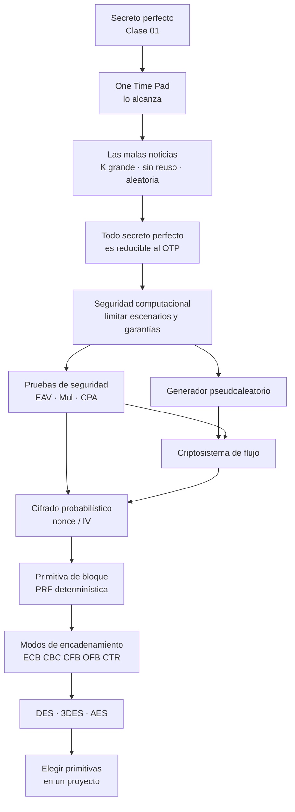

# Clase 02 — Cifrado simétrico

> **13/08 y 20/08 de 2026** — jueves, **teoría** · docente **Rodrigo Ramele** · [Filminas](../../raw/clases/Clase%2002%20-%20Criptografia%20-%20Cifrado.pdf) (64 slides) · Transcripciones [13/08](../../raw/clases/Clase%2002pt1-Transcripcion.VTT) (865 cues, 2h08) y [20/08](../../raw/clases/Clase%2002pt2-Transcripcion.VTT) (541 cues, 1h25) — **3h33**
> Guía: [[guia-02-criptografia-simetrica|Guía 2 — Criptografía Simétrica]], con la resolución de cada ejercicio debajo de su enunciado. **Entre las dos fechas no hubo práctica**: el 17/08 fue feriado, y el hueco lo llenan los videos de la [[practica-02-videos|Práctica 02]]
> Tarea que deja: repasar teoría de números —**ecuación diofántica** e **inverso modular por Euclides extendido**— con dos videos que sube al campus → [[teoria-de-numeros|Teoría de números]]
> Lectura recomendada: **Katz & Lindell caps. 2 y 3** según la última filmina, **1, 2 y 3** según el docente el 13/08; cap. 6 para DES y AES, y para su detalle, **Menezes** → [[bibliografia|bibliografía]]
> Viene de: [[clase-01-introduccion-y-criptografia-clasica|Clase 01 — Introducción y criptografía clásica]] · Sigue en: [[clase-03-macs-y-cifrado-autenticado|Clase 03 — MACs y cifrado autenticado]]

> **Una clase, dos jueves.** El [[cronograma]] la parte en **Cifrado (1)** y **Cifrado (2)**, pero las filminas son un único PDF y la wiki la trata como una sola clase —*la clase es la semana temática completa*—, por eso todos los conceptos llevan `clase: 2`. El corte no está en el PDF, pero el borde está medido: **13/08 = filminas 1-44** y **20/08 = filminas 45-64**, o sea los tramos 1 y 3 a 11 en la primera fecha y los tramos 12 a 14 en la segunda. El **tramo 2** es la excepción: se dictó el 20/08 y no está en ninguna filmina.

## Mapa de la clase

**El orden es un descenso, y es deliberado.** La clase arranca en el punto más alto —el secreto perfecto de la [[clase-01-introduccion-y-criptografia-clasica|Clase 01]], que el [[one-time-pad|OTP]] alcanza de verdad— y demuestra enseguida que **no hay nada más ahí arriba**: todo esquema perfectamente secreto es un OTP disfrazado. Recién con esa puerta cerrada baja a la [[seguridad-computacional|seguridad computacional]], que así no aparece como comodidad sino como **la única salida**.

De ahí en adelante todo lo que se construye es **una imitación cada vez más barata del OTP**, y cada construcción tiene que demostrarse segura **contra una prueba concreta**: el flujo cambia la clave por $G(k)$, el nonce recupera *"claves distintas"*, y los modos llevan la misma idea del bit al bloque. Eso no es lectura de la wiki: es el resumen con el que el propio docente abre la segunda fecha.

Esa segunda fecha baja a la ingeniería: [[des-y-3des|DES]] y [[aes|AES]] no se dan como algoritmos a memorizar sino como **dos casos institucionales** —diseño secreto contra concurso abierto—, y el cierre convierte la teoría en criterios de decisión.

> [!quote]- De la transcripción — el hilo de la clase, dicho por el docente al abrir el 20/08 (cues pt2 2-23)
> *"Secreto perfecto es inviolable (…) porque **el texto cifrado es indistinguible de random** (…) Entonces dijimos: pará, la clave tiene que ser tan larga como el mensaje, no se puede costear (…) y ahí arranca todo lo que tiene que ver con la **seguridad computacional** (…) se le van dando más y más herramientas al atacante, y con eso se establece **un experimento formal**. Ése es el esquema de toda la parte de criptografía."*
>
> *"Arrancamos con los cifradores de flujo, cuya idea es **imitar al One Time Pad** (…) y modos de encadenamiento que **intentan hacer lo mismo (…) pero a nivel de bloque en vez de a nivel de bit**. A medida que esos modos van siendo más seguros, más se parecen al One Time Pad."*

## El recorrido, tramo por tramo

| # | Tramo | Qué se dio | Dónde está desarrollado |
|---|---|---|---|
| 1 | **Repaso: criptosistema y secreto perfecto** | La terna $(\mathsf{Gen}, \mathsf{Enc}, \mathsf{Dec})$ y la definición de secreto perfecto. Lo único nuevo es la **paradoja**: $C$ y $M$ son dependientes y la definición las pide independientes | [[criptosistema\|Criptosistema]] · [[secreto-perfecto#La paradoja del secreto perfecto\|Secreto perfecto § La paradoja]] |
| 2 | **Codificar, ofuscar y cifrar** | Paréntesis del 20/08, fuera de filmina y marcado como **pregunta de examen**: lo único que las separa es si hay clave | [[codificar-ofuscar-y-cifrar\|Codificar, ofuscar y cifrar]] |
| 3 | **One Time Pad** | Vernam (1917), la **demostración completa** en dos filminas y las **tres malas noticias**: clave tan larga como el mensaje, sin reuso y aleatoria. Y la clave sesgada | [[one-time-pad\|One Time Pad]] |
| 4 | **Más allá del OTP** | Los dos resultados de reducibilidad —necesaria y suficiente—: **no hay otro esquema perfectamente secreto**. Y la pregunta de un alumno que abre el resto de la materia | [[one-time-pad#Más allá del OTP\|OTP § Más allá]] · [[seguridad-computacional#La pregunta que abre el resto de la materia\|Seguridad computacional]] |
| 5 | **Seguridad computacional** | La relajación por dos vías —limitar escenarios y limitar garantías—, el **nivel de seguridad $n$**, `PPT` y la función despreciable. Ese $n$ **tiene fecha de vencimiento** | [[seguridad-computacional\|Seguridad computacional]] |
| 6 | **Criptosistemas de flujo** | El OTP con la clave reemplazada por $G(k)$: $\lvert K\rvert \lll \lvert M\rvert$, así que **no puede** tener secreto perfecto. Si $G$ es pseudoaleatorio, pasa `Eav` | [[criptosistema-de-flujo\|Criptosistema de flujo]] |
| 7 | **Generadores pseudoaleatorios** | Definición formal contra una familia de pruebas $D$, el registro de desplazamiento, el anillo y el ejercicio $G_i = 3G_{i-1}+1 \bmod 11$. El 20/08 agrega el azar **físico** | [[generador-pseudoaleatorio\|Generador pseudoaleatorio]] · [[numeros-aleatorios-y-randomness\|Números aleatorios y randomness]] |
| 8 | **Pruebas de indistinguibilidad** | `Eav`, `Mul` y `CPA` como un solo adversario al que se le va soltando la soga, más el oráculo. Fuera de filmina: **$\varepsilon = 0$ en `Eav` es secreto perfecto**, y cómo **se escribe** una respuesta | [[pruebas-de-indistinguibilidad\|Pruebas de indistinguibilidad]] |
| 9 | **Cifrado probabilístico: nonce e IV** | **Determinístico $\Rightarrow$ no es seguro bajo múltiples cifrados**. La reparación: partir la semilla en mitad secreta y mitad pública, que viaja en claro | [[cifrado-probabilistico-nonce-e-iv\|Cifrado probabilístico, nonce e IV]] |
| 10 | **Primitivas de cifrado en bloque** | Tamaño fijo $b$, independiente del largo de clave. Por qué una primitiva **no es** un criptosistema, la clave como selectora de una permutación, el **efecto avalancha**, difusión y confusión, padding | [[primitiva-de-cifrado-en-bloque\|Primitiva de cifrado en bloque]] |
| 11 | **Modos de encadenamiento** | `ECB` (prohibido), `CBC`, `CFB`, `OFB` y `CTR`: mecánica, paralelismo, IV aleatorio contra nonce único, seguridad por reducción, y la **propagación de errores** | [[modos-de-encadenamiento\|Modos de encadenamiento]] |
| 12 | **DES y 3-DES** | Casi dos tercios del 20/08, y buena parte **sobre la implementación en Java del docente**: Feistel, la función $F$, las cajas $S$, el key schedule, las claves débiles, la erosión medida en dólares | [[des-y-3des\|DES y 3-DES]] · [[des-descripcion-del-algoritmo\|Descripción del algoritmo DES]] · [[implementaciones-de-referencia\|Implementaciones de referencia]] |
| 13 | **AES** | Concurso abierto del NIST, bloques de 128, claves de 128/192/256 y las cuatro etapas por ronda. El recorte examinable: **la estructura algebraica sobre $\mathrm{GF}(2^{8})$**, no las tablas | [[aes\|AES]] · [[cuerpos-finitos-y-campos-de-galois\|Cuerpos finitos y campos de Galois]] |
| 14 | **Criptosistemas en proyectos** | El mantra —*no desarrolles criptografía propia*—, su enmienda de 2026 (*ni la que te da un modelo*), su excepción, WEP y OpenSSL, y el vocabulario **seguro / debilitado / quebrado** | [[eleccion-de-primitivas\|Elección de primitivas]] · [[estado-de-un-criptosistema\|Estado de un criptosistema]] |

**La notación va aparte.** Las filminas y Katz & Lindell no escriben igual —$e_k$ contra $\mathsf{Enc}_k$, $P/K/C$ contra $\mathcal{M}/\mathcal{K}/\mathcal{C}$— y la materia usa las dos: el inventario está en [[notacion-y-terminologia|Notación y terminología]].

## Las seis ideas que hay que llevarse

1. **El secreto perfecto no se abandona por falso sino por caro, y no hay repuesto.** Los dos resultados de reducibilidad al [[one-time-pad|OTP]] cierran la puerta: no hay ninguna otra construcción.
2. **Toda la clase es una sucesión de imitaciones cada vez más baratas del OTP.** Flujo, nonce, modos: cada paso rompe una condición del original y conserva el resto.
3. **Determinístico $\Rightarrow$ no pasa `Mul` ni `CPA`.** Obliga al [[cifrado-probabilistico-nonce-e-iv|IV o nonce]], y separa una [[primitiva-de-cifrado-en-bloque|primitiva]] de un criptosistema.
4. **Codificar no es cifrar.** Sin clave, el observador de `Eav` gana con probabilidad $1$. El docente lo marcó como pregunta que *"aparece siempre en examen"*.
5. **«¿Es seguro?» es una pregunta mal formada.** La forma correcta nombra la prueba, el nivel $n$ y las condiciones de uso — y por eso un sistema puede ser [[estado-de-un-criptosistema#Un criptosistema puede ser seguro y estar quebrado al mismo tiempo|seguro y estar quebrado a la vez]]. Casi todo desastre real es una primitiva sana usada fuera de su modelo.
6. **Los exponentes tienen unidad.** El $2^{56}$ de [[des-y-3des|DES]] cuenta **claves**; el $2^{47}$ y el $2^{43}$ de los criptoanálisis, **textos planos**. DES cayó por fuerza bruta, y hoy *"¿cuán roto está?"* se responde con una cifra en dólares.

## Para el parcial

- **Demostrar que el OTP tiene secreto perfecto**, nombrando las dos hipótesis del Lema 1 y cerrando por Bayes → [[one-time-pad#El OTP tiene secreto perfecto|OTP]]. Y los **dos resultados de reducibilidad**.
- **$\varepsilon = 0$ en `Eav` es secreto perfecto**, dado como definición alternativa → [[pruebas-de-indistinguibilidad#El puente que la filmina no dibuja: el secreto perfecto como caso límite|el puente]].
- **Cómo se escribe la respuesta, no sólo cuál es**: los pasos, cada componente nombrado, y la cuenta de $\Pr[\text{experimento}=1]$ → [[pruebas-de-indistinguibilidad#Cómo se escribe la respuesta: el aviso de la clase sobre el parcial|el procedimiento formal]].
- **Los tres juegos de memoria**, y cuál rompe qué: determinístico no pasa `Mul` ni `CPA`; flujo sin IV pasa `Eav` pero no `Mul`; `ECB` no es CPA-Secure. Y que **`CPA` para uno implica `CPA` para múltiples**, mientras `Eav` no.
- Los **modos**: cuál necesita IV **aleatorio** (`CBC`) y cuál sólo un nonce **único** (`CTR`); cuáles usan sólo `Enc`; qué se realimenta en `CFB` y en `OFB`; y la [[modos-de-encadenamiento#Propagación de errores|propagación de errores]].
- **Codificar no es cifrar** → [[codificar-ofuscar-y-cifrar|Codificar, ofuscar y cifrar]]. **De AES, la estructura, no las tablas**: el sistema matricial en $\mathrm{GF}(2^{8})$ más las cuatro etapas por ronda; **la expansión de clave no se toma** (cue pt2 423).
- **Qué significa «seguro»**: que **no exista nada mejor que probar todas las claves**; ni debilitado ni quebrado van a un proyecto nuevo. Y los números con su unidad: DES, $56$ bits de clave y bloque $64$; 3DES, $\approx 112$ (no $168$); AES, $128/192/256$ y bloque $128$.
- **Teoría de números**: diofántica e inverso modular por Euclides extendido → [[teoria-de-numeros|Teoría de números]].

## Estado de las fuentes

**Las dos fechas están grabadas y las 64 filminas están cubiertas.** Lo medido son los **bordes** —el cue pt1 836 es el pie de la filmina 44, el cue pt2 34 la primera aparición de la 45—; que **no haya ninguna filmina compartida** entre las dos fechas es *(lectura nuestra)*, porque las transcripciones no numeran láminas. El [[video-01-criptografia-simetrica|video-01]] es la jornada del 13/08 y lo confirma por imagen, aunque corta **4 min 35 s antes del final**, justo sobre la tarea de teoría de números; la segunda fecha no está en video. **Cada grabación numera sus cues desde 1**, así que toda cita lleva `pt1` o `pt2` adentro del paréntesis.

**Casi media hora del 20/08 no está en ninguna filmina.** El docente deja el PDF y explica DES sobre **su propia implementación en Java** (cues pt2 167-317): de ahí salen la matriz de permutación, la expansión por repetición de índices y la aritmética de las cajas $S$. Sólo de la transcripción son también Base64, el azar físico, WEP, el bug de OpenSSL y el paper propio sobre DES en la nube. Los dos `.VTT` son **automáticos**: los errores de reconocimiento son del ASR.

> [!discrepancia]- Diez pasajes donde lo hablado se aparta de lo escrito o de la historia
> | Qué se dijo | Qué vale | Dónde |
> |---|---|---|
> | *"un error en `CFB` genera un error en todos los demás"* | $1 + n/s$ segmentos | [[modos-de-encadenamiento#Propagación de errores\|Modos]] |
> | *"lo voy a dividir por 2"* | la filmina: $G_i \bmod 2$, el **resto** | [[generador-pseudoaleatorio\|02.04]] |
> | *nonce* viene de *"number one"* | *number used once* | [[cifrado-probabilistico-nonce-e-iv\|02.06]] |
> | *"BCDIC, que era de 7 bits"* | BCDIC es de 6; el de 7 es **ASCII** | [[des-y-3des\|02.09]] |
> | *"8 matrices de 8 por 8"* | ocho cajas de $4\times 16$ | [[des-y-3des\|02.09]] |
> | *"se redujo del 56 al $2^{47}$"* | es **material**, no espacio de clave | [[des-y-3des#Evolución: cómo se erosionó\|02.09]] |
> | 3-DES como tres cifrados seguidos | $\mathsf{Enc}_{k_1}(\mathsf{Dec}_{k_2}(\mathsf{Enc}_{k_3}(p)))$ | [[des-y-3des#3-DES\|02.09]] |
> | Rijndael adjudicado a IDEA | **Rijndael es AES**; se corrige después | [[aes\|02.10]] |
> | RC4 *"lo armaron los que crearon WiFi"* | es de Ron Rivest (1987); WEP lo **usó mal** | [[eleccion-de-primitivas\|02.12]] |
> | El bug de OpenSSL, *"hace unos 10 años"* | Debian, **2008**, y se **quitó** una siembra | [[eleccion-de-primitivas\|02.12]] |
>
> Las erratas de las propias filminas —*Verman* por Vernam, *Polinomial* por *Polynomial*, el $2^{88}$ de los átomos, *Shift Row: permutación de bits*, el rótulo de PC-2— están marcadas cada una en la nota del concepto que le toca.

> [!nota]- Seis cabos sueltos
> - La *"vuelta de rosca"* sobre lo que se mantiene secreto además de la clave (cues pt1 205-206): la anuncia y no la desarrolla.
> - Un **dibujo a mano** que dijo que iba a subir (cues pt1 500-504), sobre el flujo con semilla repetida. **No está en `raw/`**.
> - El **paper propio sobre DES en la nube** (cues pt2 348-362): está en arXiv, sin título ni año.
> - El **libro de aritmética de Becquer y Sánchez** (cues pt2 536-540): sólo los autores → [[bibliografia#Recomendado en clase, fuera del programa|bibliografía]].
> - Los **ejemplos de parcial** del campus (cue pt2 521): **no están en `raw/`** y son lo más accionable → [[bibliografia#El material del campus, recorrido en pantalla el 20/08|el inventario del campus]].
> - La **nota sobre diseño seguro de aplicaciones** (cue pt2 526): el ASR no permite identificarla.
