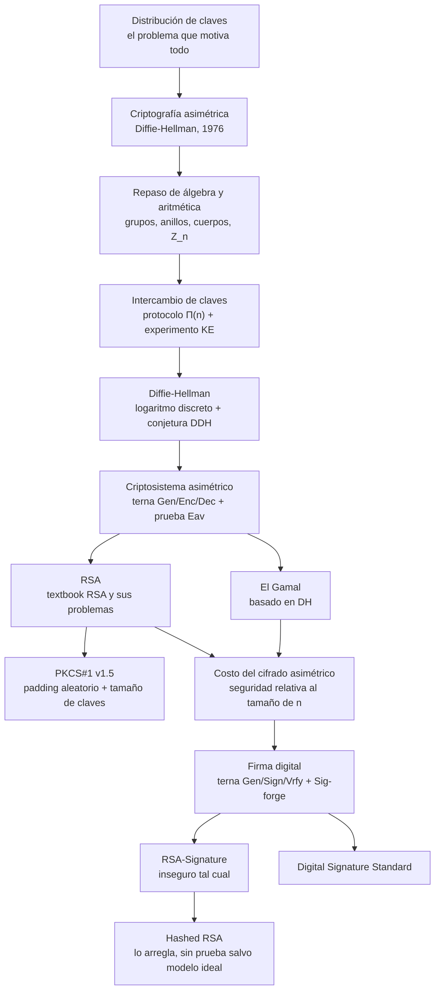

# Clase 04 — Criptografía asimétrica y firma digital

> **10/09/2026** — jueves, **teoría** · [Filminas](../../raw/clases/Clase%2004%20-%20Criptografia%20-%20Cifrado%20asimetrico%20y%20firma%20digital.pdf) (41 filminas)
> Guía asociada, sin nota propia todavía: **Guía 4 — Manejo de claves · Protocolos · Firma digital**, lunes 14/09 (mismo día: consultas del 1er parcial)
> Viene de: [[clase-03-macs-y-cifrado-autenticado|Clase 03 — MACs y cifrado autenticado]]
> Sigue en: [[clase-05-protocolos-criptograficos|Clase 05 — Protocolos criptográficos]]

> **Esta clase todavía no se dictó.** Hoy es 04/09/2026; la fecha de arriba es la del [[cronograma]]. La nota está escrita **solo contra el PDF de filminas**, más Katz & Lindell y lecturas propias rotuladas — no hay transcripción y por lo tanto no hay ningún callout *De la transcripción*. Hará falta volver sobre ella después del 10/09 para completarla con lo que se diga en voz.

> **Por qué es la clase más urgente del vault.** Entra en el **primer parcial del 24/09** junto con las Clases 1 a 5 y las Guías 1 a 4. Y según los [[parciales-viejos|cuatro parciales viejos]] que el vault tiene resueltos, el bloque de asimétrica no es cosmético: aparece Diffie-Hellman como ejercicio completo (1C-2025, Ej. 1) y, en los cuatro exámenes, certificados y PKI en el Verdadero/Falso — aunque los certificados y el PKI en sí son, formalmente, contenido de la [[clase-05-protocolos-criptograficos|Clase 05]], esta clase es la base algebraica y algorítmica sin la cual esos ejercicios no se entienden. Ver [[#15. Para el parcial|§15]].

> **Ojo con las filminas 9 a 15.** Son un repaso deliberadamente rápido de álgebra y teoría de números que el vault ya tiene desarrollado con demostraciones, ejemplos y tablas en [[aritmetica-modular-y-divisibilidad|02.13]] a [[cuerpos-finitos-y-campos-de-galois|02.16]] y en los apuntes [[teoria-de-numeros|Teoría de números]] y [[cuerpos-finitos|Cuerpos finitos]]. El [[#3. Grupos, anillos y cuerpos: lo que la filmina agrega|§3]] de esta nota **no repite** ese desarrollo: dice qué trae la filmina que esas notas no tenían (básicamente, nomenclatura) y linkea el resto.

## Mapa de la clase

La clase tiene una estructura de dos mitades bien marcadas. La primera (filminas 2-23) arma la maquinaria: por qué hace falta algo distinto a una clave compartida, el álgebra mínima para poder escribirlo con rigor, y las dos pruebas de seguridad —`KE` para intercambio de claves, `Eav` para cifrado— que van a decidir qué esquema sirve. La segunda (filminas 24-41) aplica esa maquinaria a los tres objetos concretos que trae el parcial: `RSA`, `El Gamal` y la firma digital, cerrando con el estándar que el NIST fija para esta última, `DSS`.

---

## 1. Distribución de claves

*Filminas 2-5.*

Un criptosistema `CCA-Secure` (la [[clase-03-macs-y-cifrado-autenticado|Clase 03]]) permite enviar información entre $A$ y $B$ manteniendo confidencialidad e integridad — pero **exige que ambas partes ya conozcan una misma clave** antes de cifrar el primer $\mathsf{Enc}_k(M)$. La filmina 3 formula la pregunta que motiva la clase entera: las claves no se pueden transmitir por un canal inseguro, así que ¿cómo se comparten?

Dos escenarios, con costos muy distintos:

- **Dos puntos.** Alcanza con un canal seguro puntual (una reunión física, un correo cifrado con otra clave, etc.).
- **Múltiples puntos ($n$).** Dos estrategias:
  - **Una clave por combinación.** Cada parte administra $n-1$ claves, una por cada posible interlocutor. El total de claves en el sistema es $\binom{n}{2} = \dfrac{n(n-1)}{2}$ — cuadrático en $n$, y por eso no escala.
  - **Un punto único de confianza** — *Trusted Third Party* —, que reduce el problema a $n$ claves en total, una por entidad.

La segunda estrategia es el **KDC** (*Key Distribution Center*, filminas 4-5): una entidad que comparte una clave fija con cada participante ($k_a, k_b, k_c,\ldots$). Cuando $A$ quiere hablar con $C$, envía el pedido al KDC, que genera una **clave de sesión** $k_s$ nueva y se la manda a las dos partes cifrada con la clave de cada una:

$$\text{KDC} \to A:\ \mathsf{Enc}_{k_a}(k_s) \qquad \text{KDC} \to C:\ \mathsf{Enc}_{k_c}(k_s)$$

Esto baja el problema de cuadrático a lineal — $n$ claves para $n$ entidades — pero introduce lo que todo esquema centralizado introduce: **un único punto de falla**. Las imágenes de la filmina 5 (un sello con la cabeza de Cerbero y el logo de Microsoft Active Directory) son los dos ejemplos que la cátedra deja sin desarrollar en la lámina: Kerberos y Active Directory son, respectivamente, el protocolo académico y la implementación comercial más difundida de esta idea.

→ Concepto: **[[distribucion-de-claves-y-kdc|Distribución de claves y KDC]]**

## 2. La revolución asimétrica

*Filminas 6-8.*

La cita con la que abre el bloque es literal: *"We stand today on the brink of a revolution in cryptography"*, de Diffie y Hellman (1976) — la filmina 6 pone las dos caras junto a la frase. La idea que sigue es la del candado: **es fácil cerrarlo, pero hace falta una llave distinta para abrirlo**. Trasladado a criptografía: ¿se puede construir un criptosistema con **dos contraseñas**, una para cifrar y otra para descifrar, de manera que conocer la de cifrar no alcance para recuperar el mensaje? Si eso existe, la clave de cifrado se puede **publicar a propósito** — de ahí el otro nombre del campo, **criptografía de clave pública**.

La filmina 8 adelanta la agenda de la clase en tres bloques, y esta nota respeta el mismo orden:

1. **Intercambio de claves** (nuevo respecto de la Clase 3): dos partes generan una clave compartida *en línea*, sin canal seguro previo.
2. **Cifrado asimétrico**: mismo rol que el cifrado simétrico, pero con dos claves.
3. **Firma digital**: mismo rol que un MAC, pero verificable con una clave pública.

## 3. Grupos, anillos y cuerpos: lo que la filmina agrega

*Filminas 9-15.*

Este bloque es un repaso comprimido de estructuras algebraicas y aritmética modular. El desarrollo completo —demostraciones, tablas, tanto $\mathbb{Z}_7$ como $\mathrm{GF}(2^2)$, la función $\varphi$ de Euler con ejemplos— ya está en [[aritmetica-modular-y-divisibilidad|Aritmética modular y divisibilidad]], [[algoritmo-de-euclides-extendido|Euclides extendido]], [[inverso-modular|Inverso modular]] y, sobre todo, [[cuerpos-finitos-y-campos-de-galois|Cuerpos finitos y campos de Galois]] — más el apunte hermano [[cuerpos-finitos|Cuerpos finitos]]. Acá va solo lo que la filmina agrega por encima de esas notas.

**Subgrupo (filmina 10), que las notas de la Clase 2 no nombran explícitamente.** $(G', +)$ es subgrupo de $(G,+)$ si ambos son grupos, $G' \subseteq G$ y $G' \neq \varnothing$.

**Grupo finito cíclico, con la notación exacta que usa esta clase (filmina 11):**

$$G = \bigl(\{\, g^{n} \mid n \in \mathbb{Z}\,\},\ +\bigr), \qquad g^{n} = \underbrace{g + g + \cdots + g}_{n\text{ veces}}$$

Todos los grupos de tamaño $n$ son isomorfos entre sí, y el **grupo canónico** es $\mathbb{Z}_n = (\{0,1,\ldots,n-1\}, +)$. Un elemento $g$ es **generador** si $\gcd(g,n) = 1$ — hay exactamente $\varphi(n)$ generadores — y $\operatorname{ord}(g)$ es el tamaño del subgrupo cíclico que genera; $g$ es **primitivo** si $\operatorname{ord}(g) = n$. Esta terna de definiciones —generador, orden, primitivo— es la que reaparece sin aviso en [[diffie-hellman|Diffie-Hellman]] y en [[digital-signature-standard|DSS]].

**Anillo y cuerpo (filmina 12), en la forma condensada que usa esta clase**, equivalente a la de [[cuerpos-finitos-y-campos-de-galois|02.16]] pero con otro orden de presentación: anillo es $(G,+,*)$ con $(G,+)$ grupo abeliano y $*$ clausurada, asociativa y distributiva sobre $+$; cuerpo agrega a $*$ conmutatividad, neutro, e inverso multiplicativo para todo elemento salvo el neutro de $+$.

**El campo canónico, con una notación de tamaño que conviene tener clara (filmina 13):** para $p$ primo,

$$\mathbb{Z}_p^{*} = \bigl(\{\, k \mid k \in \{\mathbb{Z}_p - 0\} \wedge \gcd(k,p)=1 \,\},\ +,\ *\bigr), \qquad \lvert \mathbb{Z}_p^{*}\rvert = p - 1$$

El tamaño es $p-1$, **no** $p$ — coherente con que $0$ nunca tiene inverso multiplicativo. Es exactamente el mismo objeto que [[cuerpos-finitos-y-campos-de-galois#El detalle que decide todo: el 0 queda afuera del segundo grupo|02.16]] desarrolla como *"el $0$ queda afuera del segundo grupo"*; esta filmina lo escribe con la notación $\mathbb{Z}_p^{*}$ que **es** la que el resto de la clase usa para el grupo multiplicativo de Diffie-Hellman y El Gamal.

**Aritmética modular, tres identidades que se citan sin demostrar (filminas 14-15):**

$$a \equiv b \pmod n \iff a - b = k\cdot n \quad\text{para algún } k \in \mathbb{Z}$$

$$\gcd(k,n) = 1 \;\Longrightarrow\; \exists\, k^{-1} \mid k\cdot k^{-1} \equiv 1 \pmod n$$

$$a^{\varphi(n)} \equiv 1 \pmod n \qquad \text{(y si $p$ es primo: } a^{p-1} \equiv 1 \pmod p\text{)}$$

$$\varphi(n\cdot m) = \varphi(n)\cdot\varphi(m) \text{ si } \gcd(n,m)=1, \qquad \varphi(p^{a}) = p^{a} - p^{a-1} = p^{a-1}(p-1) \text{ si $p$ es primo}$$

> **Errata de la filmina (15).** La fórmula de $\varphi(p^{a})$ mezcla dos variables para el mismo exponente: la filmina escribe $\Phi(p^{a}) = p^{k} - p^{k-1} = p^{k-1}(p-1)$ — $a$ del lado izquierdo, $k$ del lado derecho. Verificado sobre la página renderizada: no es un aplanado de `pdftotext` (los superíndices están bien compuestos), es la propia lámina mezclando el nombre del exponente. Arriba va escrito con un único nombre, $a$, que es como lo demuestra [[cuerpos-finitos-y-campos-de-galois#Función phi de Euler|Cuerpos finitos y campos de Galois § Función phi de Euler]].

Estas tres identidades son, respectivamente, el pequeño teorema de Fermat generalizado (Euler) y la multiplicatividad de $\varphi$ — ambas con demostración completa en [[cuerpos-finitos-y-campos-de-galois#Función phi de Euler|02.16]]. Son las que hacen funcionar tanto `RSA` (donde $\varphi(n) = (p-1)(q-1)$ decide qué exponentes son válidos) como Diffie-Hellman (donde el orden del grupo decide el tamaño del espacio de exponentes).

→ Concepto: **[[grupos-anillos-y-cuerpos|Grupos, anillos y cuerpos]]**

## 4. Intercambio de claves y el experimento KE

*Filminas 16-17.*

Un **protocolo de intercambio de claves** es una función $\Pi(n)$ ejecutada por dos partes, sin entrada más allá del parámetro de seguridad, cuya salida es una transcripción de los mensajes intercambiados más una clave $k_a$ conocida solo por una parte y $k_b$ conocida solo por la otra:

$$\Pi:\ (n) \;\to\; (\mathrm{Trans},\ k_a,\ k_b)$$

$$\textbf{Condición fundamental:}\qquad k_a = k_b$$

La seguridad frente a un **adversario pasivo** (que solo escucha, no modifica mensajes) se formaliza con el experimento `KE`:

$$\begin{aligned}
\textbf{Experimento } \mathsf{KE}_{A,\Pi}:\\
&\text{1. Se ejecuta } \Pi,\ \text{sea } k = k_a = k_b\\
&\text{2. Se genera } b \leftarrow \{0,1\}\\
&\text{3. Si } b=0:\ k' \leftarrow \{0,1\}^{n} \qquad \text{Si } b=1:\ k' = k\\
&\text{4. } A \text{ obtiene } (\mathrm{Trans}, k') \text{ y emite } b' \in \{0,1\}\\
&\mathsf{KE}_{A,\Pi} = 1 \iff b = b'
\end{aligned}$$

$$\Pr[\mathsf{KE}_{A,\Pi}=1] < 0{,}5 + \varepsilon(n) \;\Longrightarrow\; \Pi \text{ es seguro}$$

La estructura es la misma familia que `Eav` y `CPA` de la [[clase-02-cifrado#7. Pruebas de seguridad e indistinguibilidad|Clase 02]]: un bit oculto que el adversario tiene que adivinar viendo, en este caso, **o la clave real o una aleatoria del mismo tamaño** junto con todo lo que se transmitió en claro. Que el adversario no pueda distinguir la clave real de ruido es exactamente lo que hace falta para poder *usar* $k$ después como clave de un cifrado simétrico.

→ Concepto: **[[intercambio-de-claves|Intercambio de claves]]**

## 5. Diffie-Hellman

*Filminas 18-20.*

El protocolo, en siete pasos:

$$\begin{aligned}
&\text{1. } A \text{ define } (G, q, g),\ G \text{ grupo}, q \text{ su tamaño}, g \text{ un generador}\\
&\text{2. } A \text{ elige } x \leftarrow \mathbb{Z}_q,\ \text{calcula } h_1 = g^{x}\\
&\text{3. } A \to B:\ (G, q, g, h_1)\\
&\text{4. } B \text{ elige } y \leftarrow \mathbb{Z}_q,\ \text{calcula } h_2 = g^{y}\\
&\text{5. } B \to A:\ (h_2)\\
&\text{6. } A \text{ calcula } k_a = h_2^{\,x} = (g^{y})^{x} = g^{xy}\\
&\text{7. } B \text{ calcula } k_b = h_1^{\,y} = (g^{x})^{y} = g^{xy}
\end{aligned}$$

Si $A$ y $B$ ya se conocen de antemano, $(G,q,g)$ pueden estar predefinidos y el protocolo se reduce a los pasos 2-7.

**Seguridad, en dos capas (filmina 19).** La primera condición, *necesaria pero no suficiente*, es que dados $g^{x}$ y $g^{y}$ no se pueda obtener $x$ ni $y$ — el **problema del logaritmo discreto**, sin solución eficiente conocida. Pero eso no alcanza: hace falta la **conjetura de decisión Diffie-Hellman** (`DDH`), estrictamente más fuerte — dados $g$, $g^{x}$ y $g^{y}$, un adversario no puede distinguir $g^{xy}$ de un valor aleatorio del mismo grupo. La filmina marca, como dato curioso, que **la formulación de `DDH` es posterior en varios años a la publicación del algoritmo** (1976): Diffie y Hellman publicaron el protocolo antes de que existiera el lenguaje formal para probar exactamente qué hacía falta asumir para que fuera seguro.

> **Precisión nuestra sobre "NP-Hard".** La filmina cierra diciendo *"hoy se sabe que es un problema NP-Hard"*. Eso es impreciso en el sentido técnico de la teoría de la complejidad: ni el logaritmo discreto ni `DDH` están probados `NP`-difíciles — de hecho, el logaritmo discreto está en $\mathrm{NP}\cap\mathrm{coNP}$ (siempre se puede *verificar* una respuesta en tiempo polinomial, en ambos sentidos), y si además fuera `NP`-difícil implicaría $\mathrm{NP}=\mathrm{coNP}$, un colapso que se considera tan improbable como $\mathrm{P}=\mathrm{NP}$. Lo correcto es decir que **no se conoce un algoritmo eficiente (polinomial) para resolverlo** — es una **suposición de dureza computacional**, no un resultado de completitud `NP`. Es la misma distinción que separa "no se sabe romper" de "se demostró irrompible" que recorre toda la materia desde la [[clase-01-introduccion-y-criptografia-clasica|Clase 1]].

**En la práctica (filmina 20).** La versión original de Diffie-Hellman exige un **canal autenticado**: un atacante activo que pueda modificar los mensajes 3 y 5 del protocolo rompe la seguridad — es el ataque *man-in-the-middle* clásico, donde el atacante negocia una clave separada con cada parte y queda en el medio de toda la comunicación. Por eso `DH` se complementa con **firmas digitales** ([[#11. Firma digital: la terna y Sig-forge|§11]]-[[#13. Digital Signature Standard|§13]]), que autentican a quién pertenece cada $h_1$ y $h_2$.

→ Concepto: **[[diffie-hellman|Diffie-Hellman]]**

## 6. Criptosistema asimétrico y la prueba de indistinguibilidad

*Filminas 21-23.*

Igual que el cifrado simétrico, un criptosistema asimétrico es una **terna de algoritmos**:

$$\begin{aligned}
\mathsf{Gen}&:\ () \to (pk, sk) &&\text{(public key, secret key)}\\
\mathsf{Enc}&:\ \mathsf{Enc}_{pk}(m)\\
\mathsf{Dec}&:\ \mathsf{Dec}_{sk}(c)\\[4pt]
&\text{Propiedad: para todo } m,\ \mathsf{Dec}_{sk}(\mathsf{Enc}_{pk}(m)) = m
\end{aligned}$$

La seguridad frente a un adversario pasivo se prueba con el experimento de **indistinguibilidad ante escucha** (`Eav`), calcado del `Eav` simétrico de la [[clase-02-cifrado#7. Pruebas de seguridad e indistinguibilidad|Clase 02]] salvo por un detalle que decide todo: acá el adversario **recibe la clave pública**.

$$\begin{aligned}
\textbf{Experimento } \mathsf{Eav}_{A,\Pi}:\\
&\text{Se genera } (pk, sk) \leftarrow \mathcal{K}\\
&\text{1. } A \text{ recibe } pk \text{ y emite } m_0, m_1\\
&\text{2. Se genera } b \leftarrow \{0,1\}\\
&\text{3. Se calcula } c \leftarrow \mathsf{Enc}_{pk}(m_b) \text{ y se le envía a } A\\
&\text{4. } A \text{ emite } b' \in \{0,1\}\\
&\mathsf{Eav}_{A,\Pi} = 1 \iff b = b'
\end{aligned}$$

$$\Pr[\mathsf{Eav}_{A,\Pi}=1] < 0{,}5 + \varepsilon(n) \;\Longrightarrow\; \Pi \text{ es indistinguible}$$

> **Errata de la filmina (22).** El paso 3 de la lámina dice *"Se calcula $c \leftarrow \mathsf{Enc}_{sk}(m_b)$"* — con la clave **privada**. Es incoherente con la propia terna definida un slide antes (filmina 21: *"Enc (cifrado): $\mathsf{Enc}_{pk}(m)$"*): la función de cifrado de un criptosistema asimétrico toma **siempre** la clave pública, nunca la privada, y el adversario de este experimento solo tiene acceso a $pk$. Verificado sobre la página renderizada: el subíndice "sk" está compuesto igual que el resto del texto, así que no es un aplanado de `pdftotext` sino un desliz de copiado (probablemente del `Eav` simétrico, donde sí se cifra con la única clave $k$). Arriba va corregido a $\mathsf{Enc}_{pk}(m_b)$.

**Consecuencias (filmina 23), y por qué importan más acá que en simétrica.** Cualquier atacante que conoce $pk$ **puede cifrar lo que quiera** — tiene acceso de fábrica a la función de cifrado, cosa que en simétrica había que ganar con un oráculo (`CPA`). Por eso, para un criptosistema asimétrico, **ser indistinguible ante un adversario pasivo ya implica ser `CPA-Secure`**: la distinción entre "pasivo" y "con oráculo de cifrado" se borra, porque el oráculo está siempre disponible con solo conocer $pk$. Y como corolario directo: **`CPA-Secure` exige cifrado no determinístico** — *(justificación nuestra)* si $\mathsf{Enc}_{pk}$ fuera determinística, el propio atacante podría cifrar $m_0$ y $m_1$ con la $pk$ pública y comparar el resultado contra $c$ sin necesitar ningún oráculo.

→ Concepto: **[[criptosistema-asimetrico|Criptosistema asimétrico]]**

## 7. RSA: textbook RSA y sus problemas

*Filminas 24-26.*

$$\begin{aligned}
\mathsf{Gen}&:\ \text{elegir } p,q \text{ primos},\ n = p\cdot q\\
&\quad e \leftarrow (0,\varphi(n)) \mid \gcd(e,\varphi(n))=1\\
&\quad \text{calcular } d \mid e\cdot d \equiv 1 \pmod{\varphi(n)}\\
&\quad pk = (n,e),\ sk = (n,d)\\[4pt]
\mathsf{Enc}_{pk}(m) &\equiv m^{e} \pmod n\\
\mathsf{Dec}_{sk}(c) &\equiv c^{d} \pmod n
\end{aligned}$$

$d$ se calcula con [[algoritmo-de-euclides-extendido|Euclides extendido]], exactamente como el [[inverso-modular|inverso modular]] de $e$ módulo $\varphi(n)$.

**Problemas del esquema tal cual está formulado (filmina 25):**

- **Es determinístico.** Cifrar dos veces el mismo mensaje con la misma clave da siempre el mismo criptograma — viola directamente la condición de no determinismo del [[#6. Criptosistema asimétrico y la prueba de indistinguibilidad|§6]], así que **textbook RSA no puede ser `CPA-Secure`**.
- **Mensajes pequeños.** Si $m^{e} < n$, la exponenciación **no da vuelta** módulo $n$: $c = m^{e} \bmod n = m^{e}$ tal cual, sin reducción. Recuperar $m$ de ahí es calcular una **raíz $e$-ésima entera ordinaria** — no hace falta invertir nada módulo $n$. Durante mucho tiempo se usó $e=3$ para ahorrar tiempo de cifrado, lo que agravaba exactamente este problema con mensajes cortos.

  > **Errata de la filmina (25).** El texto dice *"me < n"*, sin exponente: verificado sobre la página renderizada a 150 dpi, la línea de base de la "e" es la misma que la de la "m" — no hay superíndice, y no es un aplanado de `pdftotext` (que sí *comería* un superíndice real, pero acá nunca lo hubo). La condición correcta es $m^{e} < n$, no $m\cdot e < n$. Y la propia lámina dice después *"se puede calcular el logaritmo"*: técnicamente **no es un logaritmo sino una raíz $e$-ésima** la que recupera $m$ — el logaritmo discreto es el problema de Diffie-Hellman del [[#5. Diffie-Hellman|§5]], no éste *(precisión nuestra)*.

- **Módulos repetidos.** Si dos pares de claves distintos comparten el mismo $n$, es posible recuperar $n$ —y a partir de ahí, factorizarlo y reconstruir la clave privada de cualquiera de los dos pares—.

**Ejemplo numérico (filmina 26), verificado y correcto.** Con $p=2357$, $q=2551$: $n = p\cdot q = 6\,012\,707$, $\varphi(n) = (p-1)(q-1) = 6\,007\,800$. Con $e = 3\,674\,911$ (elegido al azar) y $d = 422\,191$ (por Euclides extendido):

$$e\cdot d \bmod \varphi(n) = 1 \quad\checkmark$$

$$\mathsf{Enc}(5\,234\,673) = 5\,234\,673^{\,3\,674\,911} \bmod 6\,012\,707 = 3\,650\,502$$

$$\mathsf{Dec}(3\,650\,502) = 3\,650\,502^{\,422\,191} \bmod 6\,012\,707 = 5\,234\,673 \quad\checkmark$$

Las tres cuentas cierran exactamente como las escribe la filmina — verificado con aritmética modular en Python, no solo confiando en el PDF.

→ Concepto: **[[rsa|RSA]]**

## 8. PKCS#1 y tamaño de claves

*Filminas 27-28.*

`PKCS#1 v1.5` (RSA Labs *Public Key Cryptography Standard*) define un padding aleatorio que resuelve el determinismo de textbook RSA. Con $k$ la longitud de $n$ en bytes y $D$ la longitud de $m$ en bytes (solo se permiten mensajes de hasta $k-11$ bytes):

> **Errata de la filmina (27).** El límite de tamaño del mensaje está escrito en la lámina como *"Solo se permiten cifrar mensajes de hasta n-11 bytes"* — con $n$, no con $k$. El bullet inmediatamente anterior define $k$ como *"la longitud de n en bytes"*, y $n$ es el módulo de `RSA`: un entero de cientos de dígitos, no una cantidad de bytes a la que tenga sentido restarle 11. La variable correcta es $k$, y así lo usa la propia lámina dos bullets después, en $r = k - D - 3$. Verificado con un recorte a 400 dpi de la página renderizada: el glifo es una "n" minúscula compuesta igual que el resto de la línea, no un aplanado de `pdftotext`. Arriba va escrito ya corregido; el desarrollo está en [[pkcs1-y-tamano-de-claves#Errata de la filmina: n en vez de k|PKCS#1 y tamaño de claves § Errata de la filmina: n en vez de k]].

$$m' = \texttt{00000000} \;\Vert\; \texttt{00000010} \;\Vert\; r \;\Vert\; \texttt{00000000} \;\Vert\; m$$

donde $r$ son $k - D - 3$ bytes **aleatorios y distintos de cero** — la condición sobre $r$ existe para evitar ambigüedades al despaddear (si $r$ pudiera contener un byte $\texttt{00}$, el primer $\texttt{00000000}$ después de $r$ dejaría de ser único y no se sabría dónde termina el relleno y empieza $m$).

**El veredicto de la propia filmina, que revierte —no solo cierra— una conclusión tentativa que traía el vault.** *"Se cree que es `CPA-Secure`. Pero se encontraron ataques que muestran que no es `CCA-Secure`."* [[parciales-viejos#Discrepancias con el apunte|Parciales viejos § Discrepancias con el apunte]] no dejaba esto neutralmente abierto: ya traía una conclusión tentativa específica, rotulada *"precisión nuestra"* y marcada a propósito para contrastar cuando esta clase existiera, y esa conclusión iba en sentido **contrario** al de esta filmina — sostenía que el padding de RSA "sí apunta a `CCA`" y que la sentencia del examen 2C-2025 ("el padding aleatorio en RSA es para que sea seguro ante texto cifrado elegido") era "defendible como verdadera". Esta filmina dice lo opuesto: confirma que la corrección del apunte del estudiante —*"es para que sea `CPA-Secure`"*— es la que coincide con la cátedra, y que la sentencia de examen es **falsa**. El ataque de Bleichenbacher contra `PKCS#1 v1.5` (no desarrollado en esta clase) es, precisamente, un ataque de texto cifrado elegido que explota que el esquema **no** es `CCA-Secure` — el argumento de [[parciales-viejos#Discrepancias con el apunte|Parciales viejos]] sobre `RSA-OAEP` (diseñado para `IND-CCA2`) sigue siendo cierto en general, pero no es el esquema que describe esta filmina, que es `PKCS#1 v1.5` puro. *(`wiki/catedra/` está fuera del alcance de esta nota, así que la contradicción entre las dos queda señalada acá y no se corrige del lado de Parciales viejos.)*

**Tamaño de claves (filmina 28).** La filmina exhibe un módulo `RSA-2048` completo como ilustración de escala — un número de más de 600 dígitos decimales para una clave que hoy se considera el mínimo razonable.

→ Concepto: **[[pkcs1-y-tamano-de-claves|PKCS#1 y tamaño de claves]]**

## 9. El Gamal

*Filminas 29-31.*

Basado directamente en Diffie-Hellman:

$$\begin{aligned}
\mathsf{Gen}&:\ \text{seleccionar } (G,q,g),\ G \text{ campo de tamaño } q\\
&\quad x \leftarrow \mathbb{Z}_q,\ h = g^{x}\\
&\quad pk = (G,q,g,h),\ sk = (G,q,g,x)\\[4pt]
\mathsf{Enc}_{pk}(m)&:\ y \leftarrow \mathbb{Z}_q,\ \text{salida } c = (c_1,c_2) = (g^{y},\ h^{y}\cdot m)\\
\mathsf{Dec}_{sk}(c) &= c_2 \,/\, c_1^{\,x}
\end{aligned}$$

> **Errata de la filmina (29).** La lámina escribe $pk = (G,q,p,h)$ y $sk = (G,q,p,x)$ — con **$p$** en la tercera posición. Debería ser $g$, el generador que la propia lámina define dos líneas antes (*"Seleccionar $G,q,g$"*): $p$ no se define en ningún lugar de este slide. Es la misma terna de parámetros que Diffie-Hellman ([[#5. Diffie-Hellman|§5]]), $(G,q,g)$, y la clave pública/privada de El Gamal necesita llevarlos completos para que $\mathsf{Dec}$ pueda recomputar todo.

**Por qué funciona.** $\mathsf{Dec}(c) = c_2/c_1^{x} = \dfrac{h^{y}\cdot m}{(g^{y})^{x}} = \dfrac{(g^{x})^{y}\cdot m}{g^{xy}} = m$, porque $h^y = (g^x)^y = g^{xy} = (g^y)^x = c_1^x$: es exactamente el secreto compartido de Diffie-Hellman, usado como máscara multiplicativa sobre $m$.

**Resultado de seguridad:** si la conjetura de decisión `DH` (`DDH`) es difícil en $G$, El Gamal es `CPA-Secure`.

**Diferencias con RSA (filmina 30):** El Gamal es **probabilístico** (el $y$ aleatorio en cada cifrado hace que el mismo $m$ dé criptogramas distintos cada vez, a diferencia de textbook RSA); permite **reutilizar** los parámetros $(G,q,g)$ entre distintos usuarios (en RSA cada par de claves trae su propio $n$); y no está limitado a campos numéricos — admite **anillos de polinomios** (con $2^{n}$ elementos, fáciles de mapear a mensajes de $n$ bits) y **curvas elípticas**, donde además el problema de decisión `DH` es más difícil de atacar.

**Ejemplo numérico (filmina 31), verificado y correcto.** Con $G = \mathbb{Z}_q^{*}$, $q = 2357$ (primo), $g=2$, $x = 1751$: $h = g^{x} \bmod q = 2^{1751}\bmod 2357 = 1185$. Cifrado de $m = 2035$ con $y=1520$:

$$c = \bigl(2^{1520}\bmod 2357,\ \ 2035\cdot 1185^{1520}\bmod 2357\bigr) = (1430,\ 697)$$

Descifrado: $1430^{-1751}\cdot 697 \bmod 2357 = 2035$ $\checkmark$. Igual que el ejemplo de RSA, las tres cuentas cierran exactamente — verificadas con aritmética modular, no solo leídas del PDF.

→ Concepto: **[[el-gamal|El Gamal]]**

## 10. Costo del cifrado asimétrico

*Filmina 32.*

El nivel de seguridad de un esquema asimétrico es **relativo al tamaño de los conjuntos involucrados**, no un número absoluto de bits de la clave: en RSA ese tamaño es $n = p\cdot q$; en El Gamal, $n = q$. Cuando se usan campos numéricos se recomienda $n \geq 1024$ bits como piso histórico, con **1536 o 2048 bits** como recomendación actual. Para campos de otro tipo el número cambia radicalmente: sobre curvas elípticas alcanza con $n \geq 320$ bits para un nivel de seguridad comparable — la brecha entre 2048 y 320 bits es, en esencia, la razón de ser de la criptografía de curva elíptica.

→ Concepto: **[[costo-del-cifrado-asimetrico|Costo del cifrado asimétrico]]**

## 11. Firma digital: la terna y Sig-forge

*Filminas 33-35.*

Una firma digital persigue el mismo objetivo que un MAC —integridad— pero con tres ventajas que un MAC simétrico no puede dar, todas consecuencia directa de que verificar usa una clave **pública** y firmar una clave **privada**:

- **Verificación pública.** Cualquiera con $pk$ puede verificar, sin compartir ningún secreto con quien firmó.
- **Transferible.** La misma firma se puede reenviar o mandar a varios destinatarios a la vez y sigue siendo verificable — un MAC atado a una clave compartida entre dos partes no tiene ese sentido para un tercero.
- **No repudio.** Quien firmó no puede negar haberlo hecho, porque solo esa persona tiene $sk$ — propiedad decisiva cuando está reglamentada jurídicamente (la [[clase-01-introduccion-y-criptografia-clasica#1. Criptografía|Clase 01]] ya mencionaba la ley argentina de firma digital). *(observación nuestra)* Un MAC no puede dar esto: **ambas** partes conocen la clave, así que cualquiera de las dos pudo haber generado la etiqueta.

La terna de algoritmos:

$$\begin{aligned}
\mathsf{Gen}&:\ (n) \to k = (sk, pk)\\
\mathsf{Sign}&:\ s \leftarrow \mathsf{Sign}_{sk}(m)\\
\mathsf{Vrfy}&:\ b = \mathsf{Vrfy}_{pk}(m,s)\\[4pt]
&\text{Propiedad: para todo } m,\ \mathsf{Vrfy}_{pk}(m,\mathsf{Sign}_{sk}(m)) = 1
\end{aligned}$$

La seguridad se prueba con `Sig-forge`, la misma estructura que `Mac-Forge` de la [[clase-03-macs-y-cifrado-autenticado#7. Message Authentication Code|Clase 03]] pero con el adversario recibiendo la clave **pública** en lugar de un oráculo compartido:

$$\begin{aligned}
\textbf{Experimento } \mathsf{Sig\text{-}forge}_{A,\Pi}:\\
&\text{1. Se genera } k=(sk,pk) \leftarrow \mathcal{K}\\
&\text{2. } A \text{ obtiene } f(x) = \mathsf{Sign}_{sk}(x) \text{ y } pk\\
&\text{3. } A \text{ hace las evaluaciones que quiera de } f(x)\ \ (Q := \text{conjunto de evaluaciones})\\
&\text{4. } A \text{ emite } (m,s)\\
&\mathsf{Sig\text{-}forge}_{A,\Pi} = 1 \iff \mathsf{Vrfy}_{pk}(m,s)=1 \text{ y } m \notin Q
\end{aligned}$$

→ Concepto: **[[firma-digital|Firma digital]]**

## 12. RSA-Signature y Hashed RSA

*Filminas 36-38.*

`RSA-Signature` es, literalmente, invertir los papeles de las claves de `RSA-Encryption`:

$$\begin{aligned}
\mathsf{Gen}&:\ \text{elegir } p,q \text{ primos},\ n=p\cdot q\\
&\quad e \leftarrow (0,\varphi(n)) \mid \gcd(e,\varphi(n))=1\\
&\quad \text{calcular } d \mid e\cdot d \equiv 1 \pmod{\varphi(n)}\\
&\quad pk=(n,e),\ sk=(n,d)\\[4pt]
\mathsf{Sign}_{sk}(m) &\equiv m^{d} \pmod n\\
\mathsf{Vrfy}_{pk}(m,s) &= \bigl(\,m \overset{?}{=} s^{e} \bmod n\,\bigr)
\end{aligned}$$

> **Errata de la filmina (36).** El primer paso de `Gen` dice *"$d \leftarrow (0,\varphi(n)) \mid \gcd(\mathbf{e},\varphi(n))=1$"* — sortea $d$, pero la condición de coprimalidad está escrita sobre $e$ (en negrita en la lámina, igual que en la filmina 24). Y el paso siguiente vuelve a decir *"calcular $d$"* como si fuera la primera vez. Comparado con la filmina 24 (`Textbook RSA`, de la que este bloque es copia): ahí dice correctamente *"$e \leftarrow (0,\varphi(n)) \mid \gcd(e,\varphi(n))=1$"*. La variable que hay que sortear al azar es $e$; $d$ se obtiene después, como su inverso módulo $\varphi(n)$. Arriba va corregido.

**Este esquema, aunque común en la literatura, es inseguro** — la propia filmina lo marca con un recuadro (filmina 36). Dos ataques (filmina 37):

- **Firma al azar.** El adversario sortea $s \leftarrow S$ al azar, calcula $m = s^{e}\bmod n$ y emite $(m,s)$. Por construcción $s^{e} \bmod n = m$, así que $\mathsf{Vrfy}_{pk}(m,s)=1$ — y $m$ nunca fue consultado, porque el adversario **nunca llamó a $\mathsf{Sign}$**: fabricó una firma válida para un mensaje sin haberlo pedido nunca. $\Pr[\mathsf{Sig\text{-}forge}=1]=1$, sin conocer $sk$.
- **Ataque multiplicativo.** Con $s_1 = f(m_1)$ y $s_2 = f(m_2)$ ya consultados, emitir $(m_1\cdot m_2,\ s_1\cdot s_2)$ pasa la verificación: $(s_1 s_2)^{e} = s_1^{e}s_2^{e} \equiv m_1 m_2 \pmod n$, porque $\mathsf{Sign}$ es una potenciación módulo $n$ y **conserva el producto** *(lectura nuestra)* — exactamente la misma propiedad homomórfica que en `RSA-Encryption` habilita ataques de maleabilidad.

**Hashed RSA (filmina 38)** introduce una función de hash **libre de colisiones** $H$ para romper esa estructura multiplicativa:

$$\mathsf{Sign}_{sk}(m) \equiv H(m)^{d} \pmod n, \qquad \mathsf{Vrfy}_{pk}(m,s) = \bigl(H(m) \overset{?}{=} s^{e}\bmod n\bigr)$$

Con $H$ de por medio, el atacante ya no puede combinar $s_1\cdot s_2$ para forjar la firma de $m_1\cdot m_2$: necesitaría que $H(m_1\cdot m_2) = H(m_1)\cdot H(m_2)$, y $H$ libre de colisiones no tiene por qué respetar ninguna estructura algebraica de $m$. Pero la filmina es honesta sobre el límite: **no hay prueba de seguridad** para este esquema a menos que se asuma un **modelo ideal** de $H$ — el modelo de oráculo aleatorio, no desarrollado en esta clase.

→ Concepto: **[[rsa-signature-y-hashed-rsa|RSA-Signature y Hashed RSA]]**

## 13. Digital Signature Standard

*Filminas 39-40.*

**Generación de claves.** Se elige una función de hash ($\mathrm{SHA1}$ o $\mathrm{SHA2}$) y un tamaño de claves $(L,N)$ entre cuatro combinaciones estandarizadas: $(1024,160)$, $(2048,224)$, $(2048,256)$ o $(3072,256)$. Luego:

$$\begin{aligned}
&q \leftarrow \text{primo de tamaño } N \text{ bits}\\
&p \leftarrow \text{primo de tamaño } L \text{ bits} \mid (p-1) \equiv 0 \pmod q\\
&g \leftarrow \text{generador de orden } q \text{ módulo } p \quad \bigl(g^{(p-1)/q} \neq 1\bigr)\\
&x \leftarrow \mathbb{Z}_q,\ y = g^{x}\bmod p\\
&pk = (p,q,g,y),\ sk = (p,q,g,x)
\end{aligned}$$

> **Errata de la filmina (39).** El segundo paso dice *"p ← primo de tamaño P / (p – 1) = 0 mod q"* — con **$P$** mayúscula, una variable que la lámina no define en ningún lugar: dos líneas antes fija el único par de tamaños del esquema como $(L,N)$, y $q$ ya se llevó la $N$. Verificado con un recorte a 300 dpi de la página renderizada: el glifo es una $P$ mayúscula, no una $L$ ni un aplanado de `pdftotext`. Corresponde $L$, la variable reservada para el tamaño del módulo — arriba va escrito ya así.

$G = \mathbb{Z}_p^{*}$ y $g$ genera el **subgrupo de orden $q$** dentro de $\mathbb{Z}_p^{*}$ — no todo $\mathbb{Z}_p^{*}$, que tiene orden $p-1$. Es la razón por la que $q$ tiene que dividir a $p-1$ *(inferencia nuestra)*.

**Firma y verificación:**

$$\begin{aligned}
\mathsf{Sign}_{sk}(m):\quad &k \leftarrow \mathbb{Z}_q,\quad r = (g^{k}\bmod p)\bmod q\\
&s = \bigl[H(m) + x\cdot r\bigr]\cdot k^{-1} \bmod q\\
&\mathsf{Sign}_{sk}(m) = (r,s)\\[6pt]
\mathsf{Vrfy}_{pk}(m,(r,s)):\quad &v_1 = \bigl[H(m)\cdot s^{-1}\bigr]\bmod q,\qquad v_2 = r\cdot s^{-1}\bmod q\\
&\text{aceptar} \iff r \overset{?}{=} \bigl(g^{v_1}\cdot y^{v_2}\bmod p\bigr)\bmod q
\end{aligned}$$

Esta es la variante `DSA` (*Digital Signature Algorithm*) del estándar `DSS`, la única que la filmina desarrolla en detalle; el estándar del NIST admite también variantes sobre `RSA` y sobre curvas elípticas (`ECDSA`), no cubiertas acá *(precisión nuestra, externa al deck)*.

→ Concepto: **[[digital-signature-standard|Digital Signature Standard]]**

## 14. Cierre y bibliografía

*Filmina 41.*

La lectura recomendada que cierra el deck es *Introduction to Modern Cryptography* (Katz & Lindell), **capítulos 9 a 12**.

> **Precisión nuestra sobre el rango de capítulos.** La [[bibliografia|bibliografía de la cátedra]] ya tenía, antes de esta ingesta, un mapeo capítulo↔clase construido a partir de otras filminas: el cap. 9 (*Algorithms for Factoring and Computing Discrete Logarithms*) está marcado como **opcional** de esta clase, el cap. 10 (*Key Management and the Public-Key Revolution*) como lectura de la **[[clase-05-protocolos-criptograficos|Clase 05]]**, el cap. 11 (*Public-Key Encryption* — exactamente `RSA` y `El Gamal`, el corazón de esta nota) como lectura de esta clase, y el cap. 12 (*Digital Signature Schemes*) como lectura de **Clases 4-5**. El rango "9-12" de esta última filmina es consistente con esa tabla en sus extremos, pero incluye el capítulo 10 (gestión de claves y protocolos), que la bibliografía ya venía asignando a la Clase 05 y no a ésta. No es una contradicción — ambas clases comparten el bloque de gestión de claves— pero conviene saber que la lectura de "los capítulos 9 a 12 completos" desborda el contenido de esta única clase.

---

## 15. Para el parcial

Evidencia concreta de qué se toma, sacada de los [[parciales-viejos|cuatro parciales viejos]] que el vault tiene resueltos y verificados:

- **Diffie-Hellman es examen completo, no solo Verdadero/Falso.** El Ejercicio 1 del parcial 1C-2025 da el protocolo en ocho pasos y pide: identificarlo, justificar por qué $q$ tiene que ser primo, explicar dónde reside la seguridad computacional (que $x$ e $y$ nunca se transmiten y el logaritmo discreto no tiene solución eficiente — [[#5. Diffie-Hellman|§5]]) y nombrar los dos problemas prácticos (no resiste atacantes activos; la exponenciación modular es cara). El apunte de ese parcial trae además un ejemplo numérico **degenerado** (da $k=1$) que conviene no memorizar como modelo.
- **El padding de RSA: CPA sí, CCA no — y revierte, no solo cierra, la conclusión tentativa opuesta que traía el vault.** El [[#8-pkcs1-y-tamaño-de-claves|§8]] de esta nota cita textual la propia filmina 27: el padding aleatorio de `PKCS#1 v1.5` se cree que alcanza `CPA-Secure`, y **hay ataques que muestran que no llega a `CCA-Secure`**. La sentencia de examen *"el padding es para que sea CCA-Secure"* es **falsa** — al contrario de lo que [[parciales-viejos#Discrepancias con el apunte|Parciales viejos]] había conjeturado tentativamente antes de que existiera esta clase.
- **Certificados y PKI aparecen en el Verdadero/Falso de los cuatro parciales**, pero son contenido formal de la [[clase-05-protocolos-criptograficos|Clase 05]], no de ésta. Lo que esta clase aporta es la base sin la cual esas preguntas no tienen sentido: qué es una clave pública, por qué "cifrado con clave pública" y "firma con clave privada" son operaciones espejadas, y qué garantiza —y qué no garantiza por sí sola— una firma digital (no repudio, sí; pero nada dice **quién** es el dueño legítimo de esa clave pública, que es exactamente el problema que resuelve un certificado).
- **Las ternas de algoritmos y los experimentos de seguridad son candidatos directos a "¿es válido este esquema?".** El patrón de examen de la [[clase-02-cifrado|Clase 02]] y la [[clase-03-macs-y-cifrado-autenticado|Clase 03]] —dar un esquema modificado y preguntar si sigue siendo seguro— se traslada naturalmente acá: `RSA-Signature` sin hash ([[#12. RSA-Signature y Hashed RSA|§12]]) es exactamente ese ejercicio ya resuelto por la cátedra, con dos ataques explícitos y con probabilidad de éxito 1.
- **Los dos ejemplos numéricos (RSA y El Gamal) cierran exactamente**, verificados en esta nota con aritmética modular real, no solo leídos del PDF — son el molde más directo para un ejercicio de "calculá el cifrado/descifrado con estos parámetros".

## Estado de las fuentes

**Cubre.** Las 41 filminas del PDF `Clase 04 - Criptografia - Cifrado asimetrico y firma digital.pdf`, completas: distribución de claves y KDC, la motivación de la criptografía asimétrica, el repaso de álgebra y aritmética, intercambio de claves y el experimento `KE`, Diffie-Hellman, el criptosistema asimétrico y la prueba `Eav`, `RSA` (textbook y sus problemas), `PKCS#1 v1.5` y tamaño de claves, `El Gamal`, el costo relativo del cifrado asimétrico, la firma digital y `Sig-forge`, `RSA-Signature`, `Hashed RSA` y `DSS`.

**No cubre.** Esta clase **todavía no se dictó** (hoy, 04/09/2026): no hay transcripción, no hay video de la cátedra para esta clase específica —el [[cronograma]] marca explícitamente sin video a las Clases 1, 4 y 5—, y por lo tanto no hay ningún ejemplo, analogía o precisión dicha en voz por el docente. El PDF de filminas es la única fuente hasta que se dicte la clase el 10/09.

**Erratas encontradas y verificadas contra la página renderizada.** Siete: la clave usada para cifrar en el experimento `Eav` (filmina 22, $\mathsf{Enc}_{sk}$ en vez de $\mathsf{Enc}_{pk}$); el exponente faltante en la condición de mensaje pequeño de `RSA` (filmina 25, "$me<n$" en vez de $m^{e}<n$, más la imprecisión de llamar "logaritmo" a lo que es una raíz $e$-ésima); la letra $p$ en lugar de $g$ en las claves de El Gamal (filmina 29); la variable $d$ en lugar de $e$ en la generación de claves de `RSA-Signature` (filmina 36); la mezcla de exponentes $a$/$k$ en la fórmula de $\varphi(p^{a})$ del repaso de aritmética (filmina 15); la letra $P$ en lugar de $L$ en el tamaño del módulo de `DSS` (filmina 39); y la letra $n$ en lugar de $k$ en el límite de tamaño del mensaje de `PKCS#1` (filmina 27). Además, dos erratas de tipeo menores, sin efecto de contenido: "Artitmetica" por "Aritmética" (primer viñeta de la filmina 14 — el título de esa lámina, "Repaso de aritmética", está bien escrito) y "prática" por "práctica" (título de la filmina 20).

**Cosas que parecen erratas y no lo son.** Varios subíndices y superíndices —$h_1$, $h_2$, $k_a$, $k_b$, $\mathsf{Enc}_{pk}$, $g^{(p-1)/q}$, los exponentes de los ejemplos numéricos de `RSA` y `El Gamal`— salen aplanados en el texto extraído con `pdftotext` (por ejemplo, "e(m)= 5.234.6733.674.911 mod 6.012.707"), pero están correctamente compuestos en la página renderizada; ninguno de esos casos es una errata real. Tampoco lo son los recuadros grises de las filminas 17, 22 y 35 (experimentos `KE`, `Eav` y `Sig-forge`): son simplemente el resaltado visual que la cátedra usa para marcar el cuerpo del experimento, sin ningún contenido que `pdftotext` pierda.

**Inferencias propias, rotuladas en el cuerpo.** La imprecisión sobre "`DDH` es `NP-Hard`" ([[#5. Diffie-Hellman|§5]]); la lectura de por qué `Hashed RSA` frena el ataque multiplicativo de `RSA-Signature` ([[#12. RSA-Signature y Hashed RSA|§12]]); la constatación de que esta filmina **revierte** —no solo cierra— la conclusión tentativa y opuesta que traía [[parciales-viejos#Discrepancias con el apunte|Parciales viejos]] sobre `PKCS#1` ([[#8-pkcs1-y-tamaño-de-claves|§8]] y [[#15. Para el parcial|§15]]) — señalada acá porque `wiki/catedra/` queda fuera del alcance de esta nota; y la precisión sobre qué capítulos de Katz & Lindell corresponden a esta clase frente a la [[clase-05-protocolos-criptograficos|Clase 05]] ([[#14. Cierre y bibliografía|§14]]).

## Ver también

- [[clase-03-macs-y-cifrado-autenticado|Clase 03 — MACs y cifrado autenticado]] — de dónde sale el criptosistema `CCA-Secure` que motiva la distribución de claves, y el `Mac-Forge` del que `Sig-forge` es la versión de clave pública
- [[clase-05-protocolos-criptograficos|Clase 05 — Protocolos criptográficos]] — certificados, PKI y los protocolos que usan esta clase como base
- [[distribucion-de-claves-y-kdc|Distribución de claves y KDC]] · [[grupos-anillos-y-cuerpos|Grupos, anillos y cuerpos]] · [[intercambio-de-claves|Intercambio de claves]] · [[diffie-hellman|Diffie-Hellman]] · [[criptosistema-asimetrico|Criptosistema asimétrico]] · [[rsa|RSA]] · [[pkcs1-y-tamano-de-claves|PKCS#1 y tamaño de claves]] · [[el-gamal|El Gamal]] · [[costo-del-cifrado-asimetrico|Costo del cifrado asimétrico]] · [[firma-digital|Firma digital]] · [[rsa-signature-y-hashed-rsa|RSA-Signature y Hashed RSA]] · [[digital-signature-standard|Digital Signature Standard]]
- [[aritmetica-modular-y-divisibilidad|Aritmética modular y divisibilidad]] · [[algoritmo-de-euclides-extendido|Algoritmo de Euclides extendido]] · [[inverso-modular|Inverso modular]] · [[cuerpos-finitos-y-campos-de-galois|Cuerpos finitos y campos de Galois]] — el álgebra que el [[#3. Grupos, anillos y cuerpos: lo que la filmina agrega|§3]] resume y no repite
- [[cuerpos-finitos|Apunte: Cuerpos finitos]] · [[teoria-de-numeros|Apunte: Teoría de números]] — el desarrollo completo con tablas y ejemplos
- [[pruebas-de-indistinguibilidad|Pruebas de indistinguibilidad]] — la familia `Eav`/`CPA`/`CCA` de la que `KE` y el `Eav` asimétrico son variantes
- [[modelos-de-ataque|Modelos de ataque]] — el vocabulario de adversario pasivo/activo que separa `KE` de un protocolo autenticado
- [[message-authentication-code|Message Authentication Code]] · [[seguridad-de-un-mac|Seguridad de un MAC]] — el par (terna, experimento) del que la firma digital es la versión de clave pública
- [[cifrado-autenticado|Cifrado autenticado]] — el otro lugar del curso donde "¿es CPA-Secure?" y "¿es CCA-Secure?" deciden si un esquema sirve
- [[notacion-y-terminologia|Notación y terminología]] — el inventario de símbolos del vault
- [[parciales-viejos|Parciales viejos]] — los cuatro exámenes resueltos, con Diffie-Hellman y la discrepancia de `PKCS#1` que esta clase resuelve
- [[cronograma|Cronograma]] · [[bibliografia|Bibliografía]] · [[programa-y-objetivos|Programa y objetivos]] · [[indice|Índice]]
