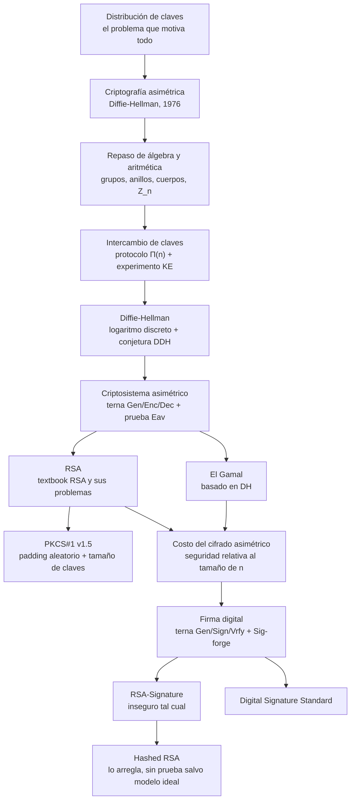

# Clase 04 — Criptografía asimétrica y firma digital

> **10/09/2026** — jueves, **teoría** · docente **Pablo Abad** · [Filminas](../../raw/clases/Clase%2004%20-%20Criptografia%20-%20Cifrado%20asimetrico%20y%20firma%20digital.pdf) (41 filminas) · [Transcripción](../../raw/clases/Clase%2004%20-%20Transcripcion.VTT) (1169 cues, 2h17, con dos pausas recortadas) · sin video
> Guía del tramo: [[guia-04-manejo-de-claves-cifrado-asimetrico-y-firma-digital|Guía 4 — Manejo de claves · Cifrado asimétrico · Firma digital]], lunes 14/09 (mismo día: consultas del 1er parcial), con los **18 ejercicios resueltos**
> Lectura recomendada al cerrar, dicha en voz y escrita en la filmina 41: **Katz & Lindell, capítulos 9 a 12** — con una salvedad sobre el cap. 10 en [[#Estado de las fuentes|Estado de las fuentes]]. Para el álgebra, el docente remite a los primeros capítulos de **Menezes** (cues 296-298)
> Viene de: [[clase-03-macs-y-cifrado-autenticado|Clase 03 — MACs y cifrado autenticado]] · Sigue en: [[clase-05-protocolos-criptograficos|Clase 05 — Protocolos criptográficos]]

**La clase se dictó entera en una sola sesión, y las 41 filminas se proyectaron.** La nota se escribió el 04/09 sólo contra el PDF y se revisó el 14/09 contra la transcripción: lo que cambió es que ahora cada tramo tiene su voz, y que aparecieron cosas que ninguna lámina trae — la **base mínima de confianza**, el problema **SAT** como ejemplo de asimetría, la **demostración en vivo** de que `RSA` descifra lo que cifra, la digresión de veinte minutos sobre **P y NP**, la explicación de por qué a un MAC asimétrico se lo llama **firma**, y el marco **legal** argentino de la firma digital. Dos tramos se pasaron a propósito por arriba: el ejemplo numérico de `RSA` (*"voy a pasarlo rápido"*, cue 899) y `DSS` entero (*"se los dejo ahí para que lo vean y después lo lean"*, cue 1161).

## Mapa de la clase

**La clase tiene dos mitades y la bisagra está en la filmina 23.** La primera (2-23) arma maquinaria y no entrega un solo esquema utilizable: el problema que motiva todo —cómo llegan dos partes a compartir una clave si el canal es inseguro—, el álgebra mínima para escribir con rigor lo que sigue, y las dos definiciones contra las que se juzgará todo lo demás, `KE` para intercambio de claves y `Eav` para cifrado. La segunda (24-41) recién ahí instancia: `RSA`, `El Gamal`, la firma digital y `DSS`. **Ningún esquema concreto aparece antes que el experimento que decide si sirve.**

Es el método que la [[clase-02-cifrado|Clase 02]] fijó con `Eav` y que la [[clase-03-macs-y-cifrado-autenticado|Clase 03]] repitió con `Mac-Forge` —cada construcción se juzga contra una prueba formal—, aplicado por tercera vez: lo que cambia es el objeto, no la forma de justificarlo. Por eso el repaso de álgebra ocupa el medio del deck (9-15) y no el principio: no es un preámbulo de cortesía sino la herramienta que hace falta **justo antes** de Diffie-Hellman. **En el aula el orden fue exactamente ése**, y el repaso se hizo porque los alumnos lo pidieron: a la pregunta *"¿alguien sabe de qué estoy hablando?"* (cue 289) la respuesta fue *"bastante poco"*, y el docente dedicó veintiséis minutos (cues 290-517) a reconstruir grupo, anillo, cuerpo, campo de Galois, aritmética modular y Euler con los alumnos aportando las definiciones — antes de la primera pausa.

Dentro de la segunda mitad hay además un patrón de ruptura deliberado: los dos esquemas centrales se presentan en su versión de libro de texto y se rompen en la filmina siguiente. `Textbook RSA` es determinístico y por lo tanto no puede ser `CPA-Secure`; `RSA-Signature` cae con probabilidad $1$ ante dos ataques distintos. Es el movimiento de la [[clase-01-introduccion-y-criptografia-clasica|Clase 01]] con los cifrados clásicos: dar el esquema, romperlo, y solo entonces mostrar el parche —`PKCS#1` y `Hashed RSA`. La voz lo dice con todas las letras: *"el sufijo de textbook RSA (…) en los libros más modernos se hace mucho hincapié en que implementar esto está mal"* (cues 865-866).

## El recorrido, tramo por tramo

| # | Tramo | Qué se dio | Dónde está desarrollado |
|---|---|---|---|
| 1 | **Distribución de claves** *(2-5; cues 1-114)* | El problema arranca de Kerckhoffs: lo único que puede sostener una prueba de seguridad es que el atacante no tiene la clave, y entonces la clave no puede viajar por el canal que se quiere proteger. La cuenta $n(n-1)/2$ la aportó un alumno; la alternativa es el **KDC**, *"como la central telefónica"*, que baja el costo a $n$ claves repartiendo claves de sesión. Fuera de filmina: la **base mínima de confianza**, que *"no resolvimos, achicamos"* el problema, y que el KDC es *"el blanco más jugoso"*. Active Directory y Kerberos, confirmados en voz | [[distribucion-de-claves-y-kdc\|KDC]] |
| 2 | **La revolución asimétrica** *(6-8; cues 115-187)* | 1976, *"hace 50 años"*: la idea nace de la asimetría entre **resolver y verificar**, con el candado y el problema **SAT** como ejemplos; de ahí dos claves, una de las cuales *"no tendría problema en compartírsela, incluso a un atacante"*, y la agenda en tres bloques | [[criptosistema-asimetrico#La idea: dos claves, y una se publica a propósito\|La idea del candado]] · [[diffie-hellman#La cita que abre el bloque\|La cita de 1976]] |
| 3 | **Intercambio de claves y el experimento KE** *(16-17; cues 188-272)* | El protocolo como algoritmo que emite un transcript y dos claves, con la condición fundamental $k_a = k_b$, y la prueba `KE` explicada dos veces por una pregunta de alumno: la mitad de las veces la clave que recibe el adversario es *"totalmente al azar"*, y lo que se le pide es *"mucho más fácil que recuperar la clave"* | [[intercambio-de-claves\|Intercambio de claves]] |
| 4 | **Grupos, anillos y cuerpos** *(9-15; cues 290-517)* | El repaso pedido por los alumnos: las cuatro propiedades del grupo, por qué $(\mathbb{Z},\cdot)$ no lo es, grupos cíclicos con el ejemplo módulo 7, **generadores** y por qué encontrarlos es *"una de las asimetrías que se usan"*, campos de Galois como máscaras de bits, $\mathbb{Z}_n$ con $n$ primo o no, Euler y Fermat, y la fórmula de $\varphi$ **corregida en vivo** sobre la errata de la filmina 15 | [[grupos-anillos-y-cuerpos\|Grupos, anillos y cuerpos]] · [[cuerpos-finitos-y-campos-de-galois\|Cuerpos finitos]] · [[inverso-modular\|Inverso modular]] |
| 5 | **Diffie-Hellman** *(18-20; cues 273-289 y 518-701)* | *"Tiene 40 y pico de años y sigue siendo el más utilizado"*. El protocolo paso a paso, la seguridad en dos capas —el logaritmo discreto es *"necesaria pero no suficiente"*, hace falta `DDH`, con el ejemplo de los **64 bits recuperados**—, y la digresión sobre **P, NP y NP-hard** disparada por la filmina 19, con la pregunta de un alumno sobre **computación cuántica**. El límite: exige canal autenticado, o cae con *man-in-the-middle*; se complementa *"con MACs o, en un ratito, con firmas"*. Y por qué gana en la práctica: es **el más simple** | [[diffie-hellman\|Diffie-Hellman]] · [[ataques-activos-y-man-in-the-middle\|Man-in-the-middle]] |
| 6 | **Criptosistema asimétrico y la prueba Eav** *(21-23; cues 702-745)* | La terna con `Gen` que emite dos claves; **se cifra con la pública y se descifra con la secreta**, y el aviso del docente: *"error conceptual que pasa más de lo que me gustaría: las dos claves no son intercambiables"*. El `Eav` en el que el adversario recibe $pk$, y las dos consecuencias: dar $pk$ es dar la función de cifrado, así que la prueba básica *"ya tiene el mismo nivel que `CPA`"*, y el cifrado tiene que ser no determinístico *"desde el vamos"* | [[criptosistema-asimetrico\|Criptosistema asimétrico]] |
| 7 | **RSA: textbook y sus problemas** *(24-26; cues 746-899)* | *"Uno de los más famosos, ya no el más usado"*. La complejidad se traslada a la generación de claves; la construcción; y la **demostración en vivo**, escrita en pantalla, de que $\mathsf{Dec}(\mathsf{Enc}(p)) = p$ por el teorema de Euler. Después los problemas: determinístico, la anécdota de las **900 hojas de ataques algebraicos** y las *"como 40 condiciones"* de los primos, el mensaje $1$ que cifra a $1$, y los mensajes chicos con $m^{e} < n$. El ejemplo numérico se pasó rápido | [[rsa\|RSA]] · [[algoritmo-de-euclides-extendido\|Euclides extendido]] |
| 8 | **PKCS#1 y tamaño de claves** *(27-28; cues 900-969)* | Los *"primos duros"* de la voz —que son los **primos seguros**—, el padding leído campo por campo con la analogía del **IV**, y el veredicto: se **conjetura** `CPA-Secure` con pruebas parciales, y **no** es `CCA-Secure`. La clave de 2048 bits como preludio del cambio de escala; ataques **subexponenciales** contra la factorización, los récords de 512 y *"700 y pico"* bits, la espada de Damocles de que factorizar no sea la única forma de romper `RSA`, **Shor** y lo poscuántico | [[pkcs1-y-tamano-de-claves\|PKCS#1]] |
| 9 | **El Gamal** *(29-31; cues 970-1048)* | *"Hoy día el criptosistema asimétrico más usado"*, según el docente: Diffie-Hellman con un paso más, leído en paralelo con el intercambio —$h^{y}\cdot m$ es *"parecido a un one-time pad, o más bien a un cifrado de flujo"*—. Probabilístico de fábrica, `CPA-Secure` bajo `DDH` *"y no hay otro ataque plausible que quede afuera"*, parámetros reutilizables en tablas, y abierto a polinomios y **curvas elípticas**, donde las claves bajan a 256 o 320 bits | [[el-gamal\|El Gamal]] |
| 10 | **Costo del cifrado asimétrico** *(32; cues 1049-1055)* | El nivel de seguridad se mide sobre el tamaño de $n$ o de $q$, y es **relativo al conjunto**: más de 1024 bits sobre campos numéricos, recomendación de 1536 o 2048, y 320 sobre curvas elípticas, *"caso por caso"* en otros grupos | [[costo-del-cifrado-asimetrico\|Costo del cifrado]] |
| 11 | **Firma digital y Sig-forge** *(33-35; cues 1058-1132)* | El MAC trasladado al mundo asimétrico, con las claves en el **rol opuesto** al del criptosistema: se firma con la secreta y se verifica con la pública. Por qué no se llama *MAC asimétrico*: es *"el análogo digital a la firma de puño y letra"*, universalmente verificable. `Sig-forge`, y las tres propiedades —verificación pública, transferibilidad, **no repudio**— más el marco **legal**: la ley argentina y la diferencia entre firma digital y firma electrónica | [[firma-digital\|Firma digital]] · [[message-authentication-code\|MAC]] |
| 12 | **RSA-Signature y Hashed RSA** *(36-38; cues 1133-1156)* | `RSA` *"pensado al revés"*: *"muy común en la literatura, pero es inseguro"*. La voz da el ataque multiplicativo —*"uno de muchos"*— y agrega una razón que la filmina no trae: sin hash, **la firma mide lo mismo que el mensaje**. El hash previo resuelve las dos cosas, y es infalsificable *"si la función de hash es ideal"* | [[rsa-signature-y-hashed-rsa\|RSA-Signature]] · [[maleabilidad\|Maleabilidad]] |
| 13 | **Digital Signature Standard** *(39-40; cues 1157-1167)* | *"El estándar actual"*, definido sobre grupos algebraicos y por eso portable a **curvas elípticas**, con firmas más compactas. Las fórmulas quedaron **de lectura**: *"si expanden esta verificación van a ver que llegan al resultado"*. Para proyectos nuevos se lo favorece por estar *"más homologado"* | [[digital-signature-standard\|DSS]] |

## Las seis ideas que hay que llevarse

1. **El criterio de seguridad no cambia al pasar a clave pública; cambia el objeto.** `Eav` sigue siendo `Eav` y `Sig-forge` es `Mac-Forge` con una clave movida de lugar: la clase se lee como las Clases 02 y 03 reescritas con dos claves en vez de una. El docente lo dice de las dos pruebas: *"es la misma prueba de indistinguibilidad"* (cue 727) y *"muy parecida conceptualmente"* (cue 1088).
2. **Publicar $pk$ regala el oráculo de cifrado.** Por eso ser indistinguible ante un adversario pasivo **ya implica** `CPA-Secure`, y por eso el cifrado asimétrico está **obligado** a ser probabilístico: no es una preferencia de diseño, es lo que separa a `El Gamal` de `textbook RSA`.
3. **Diffie-Hellman no autentica a nadie.** Es seguro contra un adversario pasivo y contra ninguno más: uno activo lo rompe con *man-in-the-middle* sin tocar el logaritmo discreto — *"no por romper el algoritmo, sino por explotar un escenario donde el algoritmo no funciona"* (cues 686-687). Ese hueco obliga a la firma digital en esta clase y a los certificados en la [[clase-05-protocolos-criptograficos|Clase 05]].
4. **Cada esquema de libro viene roto y con su parche al lado, y ningún parche es gratis.** `Textbook RSA` → `PKCS#1 v1.5`, que llega a `CPA` **por conjetura** y **no** a `CCA`; `RSA-Signature` → `Hashed RSA`, sin prueba salvo asumiendo un modelo ideal de $H$.
5. **Las tres ventajas de una firma sobre un MAC salen de un solo hecho: verificar usa una clave distinta de la de firmar.** De ahí la verificación pública, la transferibilidad y el no repudio — y este último es el que ningún MAC puede imitar, porque con una clave compartida cualquiera de las dos partes pudo haber generado la etiqueta. Es lo que le vale a la construcción el nombre propio de **firma**.
6. **Los bits no se comparan entre mundos ni entre estructuras.** 2048 bits de `RSA` no son 2048 bits de clave simétrica, y sobre curvas elípticas alcanzan 320 para un nivel comparable: la seguridad es relativa al conjunto donde vive el problema difícil.

## Para el parcial

Entra en el **primer parcial del 24/09**, con las Clases 1 a 5 y las Guías 1 a 4. **En los 1169 cues no hay una sola mención del parcial**, igual que en la Clase 03: lo que se sabe de qué se toma sigue saliendo de los [[parciales-viejos|cuatro parciales viejos]] resueltos:

- **[[diffie-hellman|Diffie-Hellman]] es ejercicio completo, no solo Verdadero/Falso.** El Ej. 1 del 1C-2025 pide identificarlo, justificar por qué $q$ tiene que ser primo, decir dónde reside la seguridad computacional —$x$ e $y$ nunca se transmiten, el logaritmo discreto no tiene solución eficiente— y nombrar los dos problemas prácticos: no resiste atacantes activos y la exponenciación modular es cara. El ejemplo numérico de ese apunte es **degenerado** ($k=1$). La clase dio los dos argumentos con las palabras exactas del examen: *"lo que se transmite (…) es $h_1$ y $h_2$"* y *"el problema del logaritmo discreto no tiene solución eficiente"* (cues 535-537 y 572).
- **El padding de RSA: `CPA` sí, `CCA` no.** La sentencia de examen *"el padding aleatorio en RSA es para que sea seguro ante texto cifrado elegido"* es **falsa**; la filmina 27 lo dice y la voz lo repite: *"se encontraron ataques que demuestran que (…) no es `CCA`-seguro"* (cue 931). Desarrollado en [[pkcs1-y-tamano-de-claves#CPA sí, CCA no|PKCS#1 y tamaño de claves]].
- **Las ternas y los experimentos son candidatos directos a «¿este esquema sigue siendo seguro?»** — el patrón de examen de las Clases 02 y 03. [[rsa-signature-y-hashed-rsa|RSA-Signature]] es ese ejercicio ya resuelto por la cátedra: dos ataques explícitos, ambos con probabilidad $1$, y la [[guia-04-manejo-de-claves-cifrado-asimetrico-y-firma-digital#Ejercicio 16|Guía 4]] lo vuelve a pedir en sus Ej. 16 y 17.
- **Las claves no son intercambiables.** Es el único error que el docente señaló como frecuente *"no sólo en la materia, sino en general"* (cues 719-724): un esquema que cifre con la privada no da confidencialidad, y una firma que se genere con la pública no da no repudio. Es candidato natural a Verdadero/Falso.
- **Los dos ejemplos numéricos —[[rsa|RSA]] y [[el-gamal|El Gamal]]— cierran exactamente**, reverificados con aritmética modular: son el molde más directo para un "calcular cifrado y descifrado con estos parámetros". En clase se pasaron por arriba, pero la **demostración de que `RSA` descifra** se hizo entera en pantalla (cues 788-854), y es el otro molde.
- **Certificados y PKI aparecen en el Verdadero/Falso de los cuatro parciales**, pero son contenido formal de la [[clase-05-protocolos-criptograficos|Clase 05]]. Esta clase aporta la base sin la cual esas preguntas no se entienden: qué es una clave pública, por qué cifrar y firmar son operaciones espejadas, y qué **no** garantiza una firma por sí sola — nada dice quién es el dueño de esa clave, que es justo el problema del certificado. El docente lo deja anunciado dos veces: *"la clase que viene, en protocolos criptográficos, vamos a ver una implementación de Diffie-Hellman con todo"* (cue 691).

## Estado de las fuentes

**Las 41 filminas están cubiertas y ahora tienen voz.** La transcripción se ingirió el 14/09: 1169 cues, 2h17 de habla, con las dos pausas recortadas de la grabación (cues 517 y 1056). Los dos ejemplos numéricos se reverificaron con aritmética modular y cierran exactamente.

**El deck es denso y la voz lo sigue de cerca, con cuatro desvíos que valen la nota.** El repaso de álgebra (cues 290-517) fue una reconstrucción con los alumnos y no una lectura de filminas; la filmina 19 disparó una digresión sobre teoría de la complejidad (cues 588-675) que no está en ninguna lámina; la demostración de `RSA` (cues 788-854) se escribió en pantalla, fuera del PDF; y el bloque de firma digital agregó el marco legal argentino (cues 1113-1132). Lo que la voz pasó por arriba: el ejemplo numérico de `RSA` (cue 899), el de `El Gamal` (no se menciona) y las fórmulas de `DSS` (cue 1161).

**Cinco alumnos participan por voz** —47 cues sobre 1169— y de ellos salen la cuenta $n(n-1)/2$, la definición de SAT, las cuatro propiedades del grupo, la descripción de P y NP y la pregunta sobre computación cuántica: van atribuidos por nombre en cada concepto. El ASR es automático y tiene grafías propias que las citas normalizan entre corchetes: *"Difi Hellman"*, *"Iffijelmann"*, *"Wifi Gelman"* y *"Difigelman"* por Diffie-Hellman, *"RCA"* y *"RSA"* alternados, *"fidene"* por $\varphi(n)$, *"euiler"* por Euler, *"Cats"* por Katz, *"carberos"* por Kerberos, *"pelo en polinomic"* por *non-polynomial*.

> [!discrepancia]- Siete erratas de variable en las filminas, todas verificadas contra la página renderizada — y qué hizo la voz con cada una
> Cada una va corregida y argumentada en el concepto del tramo correspondiente.
>
> | Filmina | Qué dice la lámina | Qué corresponde | En el aula |
> |---|---|---|---|
> | 15 | $\Phi(p^{a}) = p^{k} - p^{k-1}$ — dos nombres para el mismo exponente | un solo nombre, $a$ | **la corrige el docente en vivo**: *"acá lo voy a corregir de paso, así cuando se los comparto…"* (cues 503-505) |
> | 22 | $c \leftarrow \mathsf{Enc}_{sk}(m_b)$ en el experimento `Eav` | $\mathsf{Enc}_{pk}(m_b)$: en asimétrica se cifra **siempre** con la pública | no se lee la línea; la voz dice lo correcto, *"se cifra con la clave pública"* (cue 717) |
> | 25 | *"me < n"*, sin exponente; *"se puede calcular el logaritmo"* | $m^{e} < n$; lo que recupera $m$ es una **raíz $e$-ésima** | la voz **repite** la palabra logaritmo (cues 889-891); la conclusión igual es correcta |
> | 27 | *"mensajes de hasta n-11 bytes"* | $k-11$: $k$ es la longitud de $n$ **en bytes** | la voz **lee la lámina tal cual**: *"restringir eso a n − 11 bytes, o sea sacar 88 bits"* (cue 914) |
> | 29 | $pk = (G,q,p,h)$ y $sk = (G,q,p,x)$ | $g$, el generador; $p$ no se define en ese slide | no se lee; la voz nombra *"los tres parámetros y $h$"* (cue 986) |
> | 36 | $d \leftarrow (0,\varphi(n)) \mid \gcd(e,\varphi(n))=1$ — sortea $d$, pide coprimalidad de $e$ | se sortea $e$; $d$ es su inverso | no se lee: *"sería la misma generación de claves de RSA"* (cue 1135) |
> | 39 | *"primo de tamaño $P$"*, variable nunca definida | $L$, el tamaño del módulo del par $(L,N)$ | no se lee: `DSS` quedó de lectura |
>
> Y dos erratas de tipeo sin efecto de contenido: *"Artitmetica"* (viñeta de la filmina 14) y *"prática"* (título de la 20).

> [!discrepancia]- Once afirmaciones de la voz que no cierran, o que hay que leer con cuidado
> Ninguna afecta el argumento central del docente; todas están desarrolladas en el concepto donde viven.
>
> | Cues | Lo que se dijo | Qué vale | Dónde |
> |---|---|---|---|
> | 589, 642, 649 | el logaritmo discreto y la conjetura `DDH` *"pertenecen a la categoría NP-hard"* | **no se sabe que lo sean**, y hay razones para creer que no: el logaritmo discreto está en $\mathrm{NP}\cap\mathrm{coNP}$. Es la misma imprecisión de la filmina 19, ahora argumentada en voz | [[diffie-hellman#Capa 1 — el problema del logaritmo discreto (necesaria, no suficiente)\|Diffie-Hellman]] |
> | 662-674 | con computadoras cuánticas *"se rompe la factorización, pero el logaritmo discreto no"* | el algoritmo de **Shor** resuelve **los dos** en tiempo polinomial cuántico, incluido el logaritmo sobre curvas elípticas: Diffie-Hellman, El Gamal y `DSS` caen junto con `RSA` | [[diffie-hellman#La pregunta sobre computación cuántica\|Diffie-Hellman]] |
> | 605, 641 | NP es *"non-polynomic"*; *"todos los problemas NP-hard son equivalentes"* | NP es *nondeterministic polynomial*; los equivalentes entre sí son los **NP-completos** | [[diffie-hellman#La digresión sobre P y NP\|Diffie-Hellman]] |
> | 484-485 | módulo 6, sacando los no coprimos *"me quedo con el conjunto de 1, 4, 5 (…) una estructura de campo finito"* | $\mathbb{Z}_6^{*} = \{1, 5\}$, porque $4$ comparte el factor $2$; y lo que queda es un **grupo multiplicativo**, no un campo | [[grupos-anillos-y-cuerpos#Aritmética modular, con n primo y con n compuesto\|Grupos, anillos y cuerpos]] |
> | 901-906 | los *"primos duros"* —$p$ tal que $(p-1)/2$ es primo— hacen que la construcción *"ya sea no determinística"* | ésos son los **primos seguros** (*safe primes*); el no determinismo lo aporta el relleno aleatorio $r$ de `PKCS#1`, no la elección de los primos | [[pkcs1-y-tamano-de-claves#Lo que la voz agregó: primos seguros, y una confusión\|PKCS#1]] |
> | 908 | *"PKCS es Private y Public Key Cryptography Standard"* | ***Public-Key Cryptography Standards***, de RSA Laboratories | [[pkcs1-y-tamano-de-claves\|PKCS#1]] |
> | 936 | una clave de 2048 bits *"son números de 150 a 300 dígitos"* | 2048 bits son **617** dígitos decimales; 150 a 300 dígitos es el rango de 512 a 1024 bits | [[pkcs1-y-tamano-de-claves#Tamaño de claves\|PKCS#1]] |
> | 946 | se factorizaron números de *"700 y pico de bits"* | el récord es **829 bits** (RSA-250, 2020); 768 bits fue el de 2009 | [[pkcs1-y-tamano-de-claves#Tamaño de claves\|PKCS#1]] |
> | 1033-1035 | sobre curvas elípticas *"está demostrado que el problema (…) es exponencial"* | no está demostrado: lo que pasa es que **no se conoce** ningún ataque subexponencial, a diferencia de los campos numéricos | [[costo-del-cifrado-asimetrico\|Costo del cifrado]] |
> | 977 | `El Gamal` es *"el criptosistema asimétrico más usado"* | discutible como afirmación literal: lo dominante es el **intercambio** Diffie-Hellman sobre curvas más cifrado simétrico; `El Gamal` como tal vive en OpenPGP y en su variante de curvas | [[el-gamal\|El Gamal]] |
> | 693 | *"otros algoritmos de intercambio de claves (…) el de Pohlig-Hellman"* | lo que el ASR escribe *"polick Hellman"* es, si es Pohlig-Hellman, un **algoritmo para calcular logaritmos discretos** en grupos de orden liso, no un protocolo de intercambio de claves; sin confirmar | [[diffie-hellman\|Diffie-Hellman]] |

> [!nota]- Cabos sueltos, y lo que cerró la transcripción
> - **La lectura recomendada desborda la clase.** La filmina 41 pide Katz & Lindell **9-12**, y la voz lo confirma, *"aproximadamente"* (cue 1168); pero la [[bibliografia|bibliografía de la cátedra]] ya asignaba el cap. 9 como **opcional** de esta clase, el cap. 10 (*Key Management*) a la [[clase-05-protocolos-criptograficos|Clase 05]], el cap. 11 (*Public-Key Encryption*) a ésta y el cap. 12 (*Digital Signature Schemes*) a las dos. No es contradicción —ambas comparten el bloque de gestión de claves— pero leer los cuatro completos excede esta clase. Se suma **Menezes** para el álgebra (cues 296-298), la segunda vez que la cátedra lo nombra en voz.
> - **La práctica prometida no es la que llegó.** El docente anticipa que *"en la práctica probablemente repasemos con algunos ejercicios básicos, especialmente de aritmética"* (cue 298). La [[guia-04-manejo-de-claves-cifrado-asimetrico-y-firma-digital|Guía 4]] no trae **ningún** ejercicio de aritmética: sus 18 ejercicios son de protocolos, firmas, certificados y `TLS`. Si esos ejercicios existen, no están en `raw/`.
> - **Dos anuncios para la Clase 05.** *"La clase que viene vamos a ver algunos protocolos"* de KDC (cue 71) y *"una implementación de Diffie-Hellman con todo"* (cue 691): son [[needham-schroeder|Needham-Schroeder]] y el bloque de [[ataques-activos-y-man-in-the-middle|man in the middle]] y certificados.
> - **La contradicción con `wiki/catedra/` ya quedó saldada de los dos lados.** La filmina 27 revierte una conclusión tentativa que traía [[parciales-viejos#Discrepancias con el apunte|Parciales viejos]], y esa nota lo registra en su propio texto —*"esa conjetura era incorrecta"*—; el desarrollo vive en [[pkcs1-y-tamano-de-claves#CPA sí, CCA no|PKCS#1 y tamaño de claves]]. La voz cierra el punto (cue 931).
> - **Varias cosas parecen erratas y no lo son.** Subíndices y superíndices —$h_1$, $k_a$, $\mathsf{Enc}_{pk}$, $g^{(p-1)/q}$, los exponentes de los ejemplos— salen aplanados por `pdftotext` (*"e(m)= 5.234.6733.674.911 mod 6.012.707"*) pero están bien compuestos en la página renderizada. Tampoco lo son los recuadros grises de las filminas 17, 22 y 35: son el resaltado con que la cátedra marca un experimento.
>
> **Lo que cerró la ingesta del 14/09**: la clase sin transcripción; la conjetura de que el deck se dictaría en más de una sesión (fue **una**); y la duda sobre el docente, que es **Pablo Abad**, el mismo de las Clases 01 y 03. Nota de archivo: el archivo se llama `Clase 04 - Transcripcion.VTT`, igual que se llamó hasta el 04/09 la segunda sesión de la Clase 3 — esta vez el nombre **sí** coincide con el tema, y se verificó leyendo las primeras frases (*"hoy vamos a ver un tipo de función nueva"*, cue 6) antes de darlo por tal.
