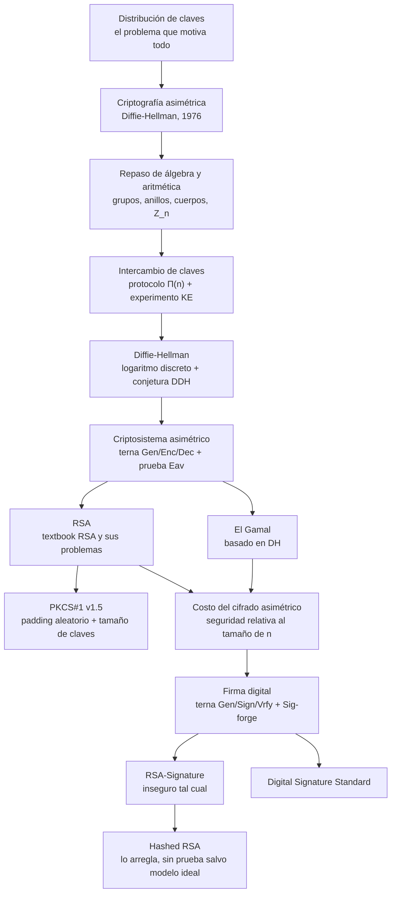

# Clase 04 — Criptografía asimétrica y firma digital

> **10/09/2026** — jueves, **teoría** · [Filminas](../../raw/clases/Clase%2004%20-%20Criptografia%20-%20Cifrado%20asimetrico%20y%20firma%20digital.pdf) (41 filminas) · sin transcripción y sin video
> Guía del tramo, sin nota propia todavía: **Guía 4 — Manejo de claves · Protocolos · Firma digital**, lunes 14/09 (mismo día: consultas del 1er parcial)
> Lectura recomendada al cerrar: **Katz & Lindell, capítulos 9 a 12** — con una salvedad sobre el cap. 10 en [[#Estado de las fuentes|Estado de las fuentes]]
> Viene de: [[clase-03-macs-y-cifrado-autenticado|Clase 03 — MACs y cifrado autenticado]] · Sigue en: [[clase-05-protocolos-criptograficos|Clase 05 — Protocolos criptográficos]]

> [!warn] Esta clase todavía no se dictó
> Al 06/09/2026 la fecha de arriba es la del [[cronograma]]. Esta nota y los doce conceptos que enlaza están escritos **solo contra el PDF de filminas**, más Katz & Lindell y lecturas propias rotuladas: sin transcripción, y por lo tanto sin ningún callout *De la transcripción*. Habrá que volver sobre las trece páginas después del 10/09.

## Mapa de la clase

**La clase tiene dos mitades y la bisagra está en la filmina 23.** La primera (2-23) arma maquinaria y no entrega un solo esquema utilizable: el problema que motiva todo —cómo llegan dos partes a compartir una clave si el canal es inseguro—, el álgebra mínima para escribir con rigor lo que sigue, y las dos definiciones contra las que se juzgará todo lo demás, `KE` para intercambio de claves y `Eav` para cifrado. La segunda (24-41) recién ahí instancia: `RSA`, `El Gamal`, la firma digital y `DSS`. **Ningún esquema concreto aparece antes que el experimento que decide si sirve.**

Es el método que la [[clase-02-cifrado|Clase 02]] fijó con `Eav` y que la [[clase-03-macs-y-cifrado-autenticado|Clase 03]] repitió con `Mac-Forge` —cada construcción se juzga contra una prueba formal—, aplicado por tercera vez: lo que cambia es el objeto, no la forma de justificarlo. Por eso el repaso de álgebra ocupa el medio del deck (9-15) y no el principio: no es un preámbulo de cortesía sino la herramienta que hace falta **justo antes** de Diffie-Hellman.

Dentro de esa segunda mitad hay además un patrón de ruptura deliberado: los dos esquemas centrales se presentan en su versión de libro de texto y se rompen en la filmina siguiente. `Textbook RSA` es determinístico y por lo tanto no puede ser `CPA-Secure`; `RSA-Signature` cae con probabilidad $1$ ante dos ataques distintos. Es el movimiento de la [[clase-01-introduccion-y-criptografia-clasica|Clase 01]] con los cifrados clásicos: dar el esquema, romperlo, y solo entonces mostrar el parche —`PKCS#1` y `Hashed RSA`.

## El recorrido, tramo por tramo

| # | Tramo | Qué se dio | Dónde está desarrollado |
|---|---|---|---|
| 1 | **Distribución de claves** *(2-5)* | Una clave por par cuesta $\binom{n}{2}$ y no escala. La alternativa es un tercero de confianza —el **KDC**— que baja el costo a $n$ claves repartiendo claves de sesión, al precio de un único punto de falla. Kerberos y Active Directory, en imágenes | [[distribucion-de-claves-y-kdc\|KDC]] |
| 2 | **La revolución asimétrica** *(6-8)* | La cita de Diffie y Hellman (1976) y la idea del candado: dos claves, y la de cifrar se **publica a propósito**. De ahí el nombre del campo y la agenda en tres bloques | [[criptosistema-asimetrico#La idea: dos claves, y una se publica a propósito\|La idea del candado]] · [[diffie-hellman\|La cita de 1976]] |
| 3 | **Grupos, anillos y cuerpos** *(9-15)* | Repaso comprimido. Lo que **agrega** sobre la Clase 02 es nomenclatura —subgrupo, generador, orden, primitivo—, la notación $\mathbb{Z}_p^{*}$ con $\lvert\mathbb{Z}_p^{*}\rvert = p-1$ y tres identidades modulares sin demostrar | [[grupos-anillos-y-cuerpos\|Grupos, anillos y cuerpos]] · [[cuerpos-finitos-y-campos-de-galois\|Cuerpos finitos]] · [[inverso-modular\|Inverso modular]] |
| 4 | **Intercambio de claves y el experimento KE** *(16-17)* | El protocolo como $\Pi(n) \to (\mathrm{Trans}, k_a, k_b)$ con la condición fundamental $k_a = k_b$, y la prueba `KE`: un pasivo no distingue la clave real de una aleatoria | [[intercambio-de-claves\|Intercambio de claves]] |
| 5 | **Diffie-Hellman** *(18-20)* | El protocolo en siete pasos y su seguridad en dos capas: el logaritmo discreto es necesario pero no suficiente, hace falta **`DDH`** —formulada años después del algoritmo—. El límite: exige canal autenticado, o cae con *man-in-the-middle* | [[diffie-hellman\|Diffie-Hellman]] · [[ataques-activos-y-man-in-the-middle\|Man-in-the-middle]] |
| 6 | **Criptosistema asimétrico y la prueba Eav** *(21-23)* | La terna $(\mathsf{Gen},\mathsf{Enc},\mathsf{Dec})$ y el `Eav` en el que el adversario **recibe $pk$**. De ahí las dos consecuencias que gobiernan el resto: indistinguible ante pasivo ya implica `CPA-Secure`, y el cifrado debe ser probabilístico | [[criptosistema-asimetrico\|Criptosistema asimétrico]] |
| 7 | **RSA: textbook y sus problemas** *(24-26)* | La construcción sobre $\varphi(n)=(p-1)(q-1)$ y los tres problemas de usarla tal cual: determinismo, mensajes chicos con $m^{e}<n$ —agravado por $e=3$— y módulos repetidos. Con ejemplo numérico | [[rsa\|RSA]] · [[algoritmo-de-euclides-extendido\|Euclides extendido]] |
| 8 | **PKCS#1 y tamaño de claves** *(27-28)* | El padding aleatorio que vuelve probabilístico a `RSA`, y por qué $r$ no puede tener bytes en cero. El veredicto de la cátedra: se cree `CPA-Secure`, **no** es `CCA-Secure`. Un módulo `RSA-2048` como ilustración de escala | [[pkcs1-y-tamano-de-claves\|PKCS#1]] |
| 9 | **El Gamal** *(29-31)* | Diffie-Hellman con un paso más: el secreto $g^{xy}$ como máscara multiplicativa. Probabilístico de fábrica, `CPA-Secure` bajo `DDH`, con parámetros reutilizables y abierto a curvas elípticas. Con ejemplo numérico | [[el-gamal\|El Gamal]] |
| 10 | **Costo del cifrado asimétrico** *(32)* | El nivel de seguridad es **relativo al tamaño del conjunto**, no un número absoluto de bits: 1536-2048 bits sobre campos numéricos frente a 320 sobre curvas elípticas | [[costo-del-cifrado-asimetrico\|Costo del cifrado]] |
| 11 | **Firma digital y Sig-forge** *(33-35)* | El objetivo de un MAC más tres propiedades que un MAC no puede dar —verificación pública, transferibilidad, no repudio—, la terna $(\mathsf{Gen},\mathsf{Sign},\mathsf{Vrfy})$ y `Sig-forge`, calcado de `Mac-Forge` | [[firma-digital\|Firma digital]] · [[message-authentication-code\|MAC]] |
| 12 | **RSA-Signature y Hashed RSA** *(36-38)* | Invertir los papeles de las claves de `RSA` da un esquema **inseguro**: dos falsificaciones de probabilidad $1$, firmar al azar y multiplicar dos firmas. El hash previo rompe esa estructura multiplicativa, pero sin prueba fuera de un modelo ideal de $H$ | [[rsa-signature-y-hashed-rsa\|RSA-Signature]] · [[maleabilidad\|Maleabilidad]] |
| 13 | **Digital Signature Standard** *(39-40)* | La variante `DSA` completa: los cuatro pares $(L,N)$, el generador de orden $q$ dentro de $\mathbb{Z}_p^{*}$ y las fórmulas de $\mathsf{Sign}$ y $\mathsf{Vrfy}$ | [[digital-signature-standard\|DSS]] |

## Las seis ideas que hay que llevarse

1. **El criterio de seguridad no cambia al pasar a clave pública; cambia el objeto.** `Eav` sigue siendo `Eav` y `Sig-forge` es `Mac-Forge` con una clave movida de lugar: la clase se lee como las Clases 02 y 03 reescritas con dos claves en vez de una.
2. **Publicar $pk$ regala el oráculo de cifrado.** Por eso ser indistinguible ante un adversario pasivo **ya implica** `CPA-Secure`, y por eso el cifrado asimétrico está **obligado** a ser probabilístico: no es una preferencia de diseño, es lo que separa a `El Gamal` de `textbook RSA`.
3. **Diffie-Hellman no autentica a nadie.** Es seguro contra un adversario pasivo y contra ninguno más: uno activo lo rompe con *man-in-the-middle* sin tocar el logaritmo discreto. Ese hueco obliga a la firma digital en esta clase y a los certificados en la [[clase-05-protocolos-criptograficos|Clase 05]].
4. **Cada esquema de libro viene roto y con su parche al lado, y ningún parche es gratis.** `Textbook RSA` → `PKCS#1 v1.5`, que llega a `CPA` pero **no** a `CCA`; `RSA-Signature` → `Hashed RSA`, sin prueba salvo asumiendo un modelo ideal de $H$.
5. **Las tres ventajas de una firma sobre un MAC salen de un solo hecho: verificar usa una clave distinta de la de firmar.** De ahí la verificación pública, la transferibilidad y el no repudio — y este último es el que ningún MAC puede imitar, porque con una clave compartida cualquiera de las dos partes pudo haber generado la etiqueta.
6. **Los bits no se comparan entre mundos ni entre estructuras.** 2048 bits de `RSA` no son 2048 bits de clave simétrica, y sobre curvas elípticas alcanzan 320 para un nivel comparable: la seguridad es relativa al conjunto donde vive el problema difícil.

## Para el parcial

Entra en el **primer parcial del 24/09**, con las Clases 1 a 5 y las Guías 1 a 4. Los [[parciales-viejos|cuatro parciales viejos]] resueltos dicen qué se toma de ella:

- **[[diffie-hellman|Diffie-Hellman]] es ejercicio completo, no solo Verdadero/Falso.** El Ej. 1 del 1C-2025 pide identificarlo, justificar por qué $q$ tiene que ser primo, decir dónde reside la seguridad computacional —$x$ e $y$ nunca se transmiten, el logaritmo discreto no tiene solución eficiente— y nombrar los dos problemas prácticos: no resiste atacantes activos y la exponenciación modular es cara. El ejemplo numérico de ese apunte es **degenerado** ($k=1$).
- **El padding de RSA: `CPA` sí, `CCA` no.** La sentencia de examen *"el padding aleatorio en RSA es para que sea seguro ante texto cifrado elegido"* es **falsa**, y la filmina 27 lo dice explícitamente, revirtiendo una conclusión tentativa opuesta que el vault traía. Desarrollado en [[pkcs1-y-tamano-de-claves#CPA sí, CCA no|PKCS#1 y tamaño de claves]].
- **Las ternas y los experimentos son candidatos directos a «¿este esquema sigue siendo seguro?»** — el patrón de examen de las Clases 02 y 03. [[rsa-signature-y-hashed-rsa|RSA-Signature]] es ese ejercicio ya resuelto por la cátedra: dos ataques explícitos, ambos con probabilidad $1$.
- **Los dos ejemplos numéricos —[[rsa|RSA]] y [[el-gamal|El Gamal]]— cierran exactamente**, reverificados con aritmética modular: son el molde más directo para un "calcular cifrado y descifrado con estos parámetros".
- **Certificados y PKI aparecen en el Verdadero/Falso de los cuatro parciales**, pero son contenido formal de la [[clase-05-protocolos-criptograficos|Clase 05]]. Esta clase aporta la base sin la cual esas preguntas no se entienden: qué es una clave pública, por qué cifrar y firmar son operaciones espejadas, y qué **no** garantiza una firma por sí sola — nada dice quién es el dueño de esa clave, que es justo el problema del certificado.

## Estado de las fuentes

**Las 41 filminas están cubiertas, y el deck es denso: al revés de la [[clase-01-introduccion-y-criptografia-clasica|Clase 01]], aquí la carga está en lo escrito.** Los dos ejemplos numéricos se reverificaron con aritmética modular y cierran exactamente.

**Lo que falta es la voz.** Al 06/09/2026 la clase no se dictó, y el [[cronograma]] marca **sin video** a las Clases 1, 4 y 5: sin transcripción ni grabación no hay ningún ejemplo ni precisión dicha por el docente. El PDF es la única fuente hasta el 10/09.

> [!discrepancia]- Siete erratas de variable en las filminas, todas verificadas contra la página renderizada
> Cada una va corregida y argumentada en el concepto del tramo correspondiente.
>
> | Filmina | Qué dice la lámina | Qué corresponde |
> |---|---|---|
> | 15 | $\Phi(p^{a}) = p^{k} - p^{k-1}$ — dos nombres para el mismo exponente | un solo nombre, $a$ |
> | 22 | $c \leftarrow \mathsf{Enc}_{sk}(m_b)$ en el experimento `Eav` | $\mathsf{Enc}_{pk}(m_b)$: en asimétrica se cifra **siempre** con la pública |
> | 25 | *"me < n"*, sin exponente; *"se puede calcular el logaritmo"* | $m^{e} < n$; lo que recupera $m$ es una **raíz $e$-ésima** |
> | 27 | *"mensajes de hasta n-11 bytes"* | $k-11$: $k$ es la longitud de $n$ **en bytes** |
> | 29 | $pk = (G,q,p,h)$ y $sk = (G,q,p,x)$ | $g$, el generador; $p$ no se define en ese slide |
> | 36 | $d \leftarrow (0,\varphi(n)) \mid \gcd(e,\varphi(n))=1$ — sortea $d$, pide coprimalidad de $e$ | se sortea $e$; $d$ es su inverso |
> | 39 | *"primo de tamaño $P$"*, variable nunca definida | $L$, el tamaño del módulo del par $(L,N)$ |
>
> Y dos erratas de tipeo sin efecto de contenido: *"Artitmetica"* (viñeta de la filmina 14) y *"prática"* (título de la 20).

> [!nota]- Tres cabos sueltos
> - **La lectura recomendada desborda la clase.** La filmina 41 pide Katz & Lindell **9-12**, pero la [[bibliografia|bibliografía de la cátedra]] ya asignaba el cap. 9 como **opcional** de esta clase, el cap. 10 (*Key Management*) a la [[clase-05-protocolos-criptograficos|Clase 05]], el cap. 11 (*Public-Key Encryption*) a ésta y el cap. 12 (*Digital Signature Schemes*) a las dos. No es contradicción —ambas comparten el bloque de gestión de claves— pero leer los cuatro completos excede esta clase.
> - **La contradicción con `wiki/catedra/` ya quedó saldada de los dos lados.** La filmina 27 revierte una conclusión tentativa que traía [[parciales-viejos#Discrepancias con el apunte|Parciales viejos]], y esa nota lo registra en su propio texto —*"esa conjetura era incorrecta"*—; el desarrollo vive en [[pkcs1-y-tamano-de-claves#CPA sí, CCA no|PKCS#1 y tamaño de claves]].
> - **Varias cosas parecen erratas y no lo son.** Subíndices y superíndices —$h_1$, $k_a$, $\mathsf{Enc}_{pk}$, $g^{(p-1)/q}$, los exponentes de los ejemplos— salen aplanados por `pdftotext` (*"e(m)= 5.234.6733.674.911 mod 6.012.707"*) pero están bien compuestos en la página renderizada. Tampoco lo son los recuadros grises de las filminas 17, 22 y 35: son el resaltado con que la cátedra marca un experimento.
