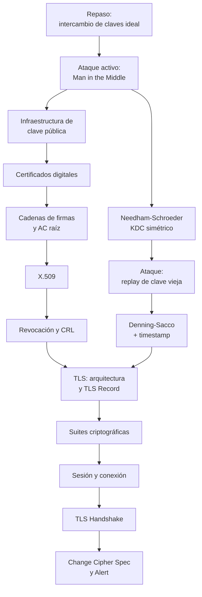

# Clase 05 — Protocolos criptográficos

> **17/09/2026** — jueves, **teoría** · [Filminas](../../raw/clases/Clase%2005%20-%20Protocolos.pdf) (48 filminas) · docente sin confirmar en la fuente
> Práctica asociada, sin nota propia todavía: **Guía 4 — Manejo de claves · Protocolos · Firma digital**, lunes 14/09
> Viene de: [[clase-04-criptografia-asimetrica-y-firma-digital|Clase 04 — Criptografía asimétrica y firma digital]]

> **Esta clase todavía no se dictó.** Hoy es 04/09/2026 y la fecha de arriba es la del [[cronograma]]. La nota está escrita **solo contra el PDF de filminas**, apoyada en las 49 notas de concepto que el vault ya tiene de las Clases 1 a 3 y en lecturas propias rotuladas — no hay transcripción, y por lo tanto no hay ningún callout *De la transcripción*. Habrá que volver sobre esta nota después del 17/09 para completarla y corregirla contra lo que se diga en voz.

> **Por qué esta clase es la más rentable del temario para el primer parcial.** La nota [[parciales-viejos|Parciales viejos]] audita cuatro primeros parciales reales (2018 a 2025) y encuentra que **el Ejercicio 1 es un protocolo en los cuatro, sin excepción**, con la misma estructura de consigna: *"¿qué tipo de protocolo sería, qué intenta construir?"* seguido de *"¿qué problema tiene?"* o *"¿es susceptible a tal ataque?"*. Uno de esos cuatro ejercicios (1C-2018) es literalmente el [[#8. Needham-Schroeder|protocolo Needham-Schroeder]] que se desarrolla más abajo, con las mismas tres preguntas que se contestan acá. El detalle completo, con la evidencia de los cuatro exámenes, está en [[#Para el parcial|Para el parcial]].

## Mapa de la clase

El deck tiene una estructura de **dos ramas que convergen**. La primera mitad (filminas 4-21) resuelve el problema de *a quién le pertenece una clave pública* — Man in the Middle, PKI, certificados, cadenas de confianza, X.509, revocación —, resolviendo confidencialidad e identidad con criptografía **asimétrica**. La segunda mitad de los protocolos (filminas 22-28) ataca el mismo problema de identidad pero del lado **simétrico**, con un KDC — Needham-Schroeder y su arreglo, Denning-Sacco. TLS (filminas 29-47) es donde las dos ramas se juntan: usa certificados X.509 para autenticar al servidor (a veces también al cliente) y termina generando una clave de sesión simétrica, con la misma preocupación por la frescura que ya apareció en Needham-Schroeder.

---

## 1. Repaso: intercambio de claves y su límite

*Filminas 2-3.*

Un criptosistema `CCA`-Secure permite enviar información entre $A$ y $B$ manteniendo confidencialidad e integridad —$\mathrm{Enc}_k(M)$, con la maquinaria de [[cifrado-autenticado|cifrado autenticado]]—, pero **exige que las dos partes ya conozcan una misma clave**. Un protocolo de intercambio de claves es lo que resuelve ese "ya conozcan": formalmente, es un protocolo $\Pi(n)$ ejecutado por dos partes, sin entrada propia salvo el parámetro de seguridad $n$, cuya salida es un conjunto de mensajes intercambiados (la *transcripción*, $\mathrm{Tran}$) más dos claves — una, $k_a$, conocida solo por una parte, y otra, $k_b$, conocida solo por la otra:

$$\Pi(n) \;\longrightarrow\; (\mathrm{Tran},\, k_a,\, k_b)$$

y la **condición fundamental** que el protocolo tiene que garantizar es que las dos claves coincidan:

$$k_a = k_b$$

Este es exactamente el molde que instancia Diffie-Hellman, visto en la [[clase-04-criptografia-asimetrica-y-firma-digital|Clase 04]]. Todo lo que sigue en esta clase asume que ese problema —lograr $k_a = k_b$ contra un espía puramente pasivo— ya está resuelto, y pregunta qué pasa cuando el adversario deja de ser pasivo.

## 2. Ataques activos y man in the middle

*Filminas 4-6.*

Un atacante activo puede hacer cuatro cosas con los mensajes de un protocolo que un espía pasivo no puede: **omitirlos**, **reescribir su contenido**, **reordenarlos** y **repetirlos**. La filmina 4 es tajante: **ninguno de los esquemas de intercambio vistos hasta acá sobrevive a un atacante activo** — la familia de ataques que lo explota se llama **Man in the Middle** (`MITM`).

**El problema de origen (filmina 5): ¿de dónde salen las claves públicas?** Todo esquema asimétrico visto hasta la Clase 04 confía **implícitamente** en que una clave pública está asociada a la identidad correcta. Si esa asociación se puede violar, el ataque es directo. $A$ le pregunta a un repositorio (`REP`) *"¿clave de $B$?"* y espera $pk_b$ de vuelta:

$$A \xrightarrow{\;\text{¿clave de } B\text{?}\;} \mathrm{REP} \xrightarrow{\;pk_b\;} A \qquad \text{(lo esperado)}$$

Lo que pasa en realidad, con un atacante $E$ interpuesto:

$$A \xrightarrow{\;\text{¿clave de } B\text{?}\;} E \xrightarrow{\;\text{¿clave de } B\text{?}\;} \mathrm{REP}, \qquad \mathrm{REP} \xrightarrow{\;pk_b\;} E \xrightarrow{\;pk_e\;} A$$

$E$ reenvía la consulta legítima a `REP` y sí obtiene $pk_b$ — pero le contesta a $A$ con su **propia** clave $pk_e$, marcada en rojo en la filmina para remarcar que es la sustitución.

**La consecuencia (filmina 6).** Una vez que $A$ tiene la clave equivocada, intenta comunicarse con $B$. Lo que $A$ imagina que hace:

$$A \xrightarrow{\;\mathrm{Enc}_{pk_b}(M)\;} B$$

Lo que pasa en realidad:

$$A \xrightarrow{\;\mathrm{Enc}_{pk_e}(M)\;} E \xrightarrow{\;\mathrm{Enc}_{pk_b}(M)\;} B$$

$E$ descifra $M$ con su propia clave privada (la que corresponde a $pk_e$), lo lee o lo modifica a gusto, y **reenvía un cifrado nuevo bajo la clave real de $B$** para que ni $A$ ni $B$ noten nada. El cierre de la filmina es la idea que ordena todo el resto de la clase: **el problema no es de la función de cifrado — entra en la esfera de administración de claves.**

Link → **[[ataques-activos-y-man-in-the-middle|Ataques activos y man in the middle]]**.

## 3. Infraestructura de clave pública

*Filmina 7.*

La PKI (*Public Key Infrastructure*) es la respuesta de administración de claves al problema de la sección anterior. **Objetivo:** asociar una identidad a una clave, para evitar la suplantación (Man in the Middle o *spoofing*). La filmina es explícita en una precisión que conviene no pasar por alto: **la PKI no es aplicable a los criptosistemas simétricos** — no hay una clave *pública* que necesite quedar atada a una identidad, porque la clave ya es un secreto compartido entre dos partes que se conocieron de antemano. El **motivo** por el que el problema importa: la selección de la clave depende de con quién se está hablando, y usar la clave equivocada significa que confidencialidad e integridad dejan de estar garantizadas — exactamente lo que la filmina 6 acaba de mostrar.

Link → **[[infraestructura-de-clave-publica|Infraestructura de clave pública]]**.

## 4. Certificados digitales

*Filminas 8-10.*

**Definición (filmina 8).** Un certificado es un mensaje que contiene, como mínimo: información de identidad (por ejemplo, un nombre), la clave pública asociada, la fecha de emisión, el intervalo de validez y el **tipo de uso** autorizado para esa clave — la filmina lista cuatro usos posibles: firma de mensajes, cifrado de emails, firma de certificados, cifrado de sitios web (la filmina los presenta como viñetas, sin indicar si son excluyentes entre sí). Los certificados están, a su vez, **firmados digitalmente por una autoridad competente**.

**Uso de un certificado (filminas 9-10).** $A$ solicita el certificado de $B$ —puede dárselo el propio $B$ o cualquier otra entidad que lo tenga— y con él puede:

- **Verificar la identidad.** Comparando el campo `CN` (*Common Name*), cuyo contenido esperado depende del tipo de entidad: para un email, `CN=<dirección de email>`; para un servidor, `CN=<IP>` o `<hostname>`; para una empresa, `CN=Razón social`.
- **Obtener la clave pública de $B$.** Es parte del certificado mismo, junto con el tipo de clave (ej. `RSA-2048`, `DSA-EC 320`).
- **Verificar la validez.** Comprobando que el tipo de uso permitido coincide con lo que se necesita, y que la fecha de vigencia no expiró.
- **Verificar la integridad.** Validando la firma digital de la autoridad que lo certifica.

Ese último punto es el que reabre el problema una capa más arriba, y es exactamente donde cierra la filmina 10: **validar una firma digital requiere una clave pública — ¿cómo se obtiene esa?**

Link → **[[certificados-digitales|Certificados digitales]]**.

## 5. Cadenas de firmas y autoridades raíz

*Filminas 11-13.*

**La respuesta a la pregunta de cierre de la sección anterior: las autoridades certificantes tienen a su vez un certificado**, y se acostumbra incluirlo junto con cada certificado que emiten. ¿Y quién valida el certificado de la AC? Otra AC. La recursión tiene que cortar en algún punto: las **AC raíces** son las que firman su propio certificado, y son **el punto de confianza del sistema**.

El concepto de AC raíz, en una frase: **confiar en una única autoridad**, que **delega en otras** la capacidad de firmar certificados. Notación de la filmina 12, para un certificado de $A$ firmado por $CA_3$ —que a su vez forma parte de una cadena hasta la raíz $CA_1$— y uno de $B$ firmado directamente por la raíz $CA_1$:

$$C_a = C'_a \,\Vert\, C_{CA_3} \,\Vert\, C_{CA_2} \,\Vert\, C_{CA_1}, \qquad\qquad C_b = C'_b \,\Vert\, C_{CA_1}$$

donde $C'_x$ es el propio certificado firmado de $x$ y el resto de la cadena se adjunta para que quien lo reciba pueda subir eslabón por eslabón hasta una raíz en la que ya confía.

**Pero no existe una única AC raíz universal (filmina 13).** Si $A$ y $B$ dependen de dos AC distintas, ¿cómo valida $A$ el certificado de $B$? Dos opciones: (1) $A$ confía directamente en la AC de $B$, o (2) las AC se certifican entre sí —cada una emite un certificado de la identidad de la otra—. En la práctica, ninguna de las dos se negocia por conexión: existe una **lista de AC reconocidas**, preinstalada en el sistema operativo, en los navegadores y en runtimes como la JVM.

Link → **[[cadenas-de-firmas-y-autoridades-raiz|Cadenas de firmas y autoridades raíz]]**.

## 6. Certificados X.509

*Filminas 14-19.*

**El estándar (filmina 14).** X.509 fija los campos de un certificado: versión, número de serie, identificador del algoritmo de firma, nombre del emisor (la AC), intervalo de validez, nombre del sujeto (`CN`), la clave pública del sujeto y una **firma** — que firma el *hash* de todo lo anterior. Certificados construidos así forman las cadenas de la sección 5.

**El certificado real que trae la filmina (filminas 15-17).** El deck vuelca la salida de un certificado X.509 real, campo por campo, y es la única instancia concreta de todo este bloque de PKI:

| Campo | Valor |
|---|---|
| Versión | 3 (0x2) |
| Número de serie | 1 (0x1) |
| Algoritmo de firma | `md5WithRSAEncryption` |
| Emisor (`Issuer`) | `C=ZA, ST=Western Cape, L=Cape Town, O=Thawte Consulting cc, OU=Certification Services Division, CN=Thawte Server CA/Email=server-certs@thawte.com` |
| Validez — no antes de | 1 ago 1996, 00:00:00 GMT |
| Validez — no después de | 31 dic 2020, 23:59:59 GMT |
| Sujeto (`Subject`) | **idéntico al emisor**, campo por campo |
| Algoritmo de clave pública | `rsaEncryption` |
| Clave pública RSA | 1024 bits · exponente 65537 (0x10001) · módulo en hexadecimal, de 128 bytes ($1024/8$, cómputo nuestro; se omite acá por espacio, está completo en la filmina) |
| Extensiones X.509v3 | `Basic Constraints: critical` → `CA:TRUE` |
| Firma final | en hexadecimal, con el mismo algoritmo `md5WithRSAEncryption` que el encabezado; 128 bytes (conteo nuestro sobre las líneas del volcado, la filmina no lo indica) |

**Dos lecturas que la filmina no dice en voz alta, pero que están en los datos** *(lectura nuestra)*: primero, `Issuer` y `Subject` son el **mismo** nombre — este certificado está **autofirmado**, así que es exactamente un certificado de AC raíz en el sentido de la sección 5, y `CA:TRUE` en las extensiones lo confirma: está autorizado a firmar otros certificados, no solo a identificar un sitio. Segundo, el algoritmo de firma es `md5WithRSAEncryption`: usa `MD5`, que la [[clase-03-macs-y-cifrado-autenticado|Clase 03]] ya trató como [[primitivas-de-hash-estandar|quebrado]] por colisiones — este certificado en particular es de 1996 y hoy sería inaceptable para un uso real, aunque en la filmina aparece solo como ejemplo de formato.

> **Cosas que parecen erratas y no lo son.** Las filminas 16 y 17 repiten el **mismo** certificado de la 15, pero con una animación de PowerPoint que va superponiendo cajas de resaltado (`Issuer`, `Subject`, `Validity`, `X509v3 extensions`, `Subject Public Key Info`...) sobre distintas partes del volcado, una por clic. `pdftotext` no entiende esa superposición y **intercala el texto de cada caja de resaltado en medio del volcado completo**, produciendo una lectura salteada y duplicada que, a primera vista, parece un certificado distinto o corrompido. Verificado renderizando las páginas 16 y 17 a 150 dpi: el contenido es idéntico al de la página 15: no hay ninguna errata de contenido, es el artefacto de extracción de cajas superpuestas que advierten las convenciones del vault.

**Verificación de un certificado X.509 (filminas 18-19), en cinco pasos:**

1. **Obtener la clave pública del emisor** — de la cadena de certificados, o del sistema operativo si el certificado es raíz. Si hace falta, verificar recursivamente el certificado del emisor.
2. **Verificar la integridad**, con el algoritmo especificado y la clave pública del emisor.
3. **Verificar el intervalo de validez**: el certificado debe estar vigente **hoy**, y además la autoridad certificante tiene que haber estado vigente **al comienzo** del período de vigencia del certificado que emitió — no alcanza con que la AC sea válida ahora.
4. **Verificar la identidad**, comparando el `CN` con el que espera la aplicación — la comparación exacta depende del uso, como ya se vio en la sección 4.
5. **Verificar el uso**, validando que el certificado esté autorizado para el propósito que se le quiere dar.

Link → **[[x509|X.509]]**.

## 7. Revocación y listas CRL

*Filminas 20-21.*

**Por qué hace falta revocar (filmina 20).** A veces hay que invalidar una clave **antes** de su expiración natural: porque un atacante la averiguó, o por un cambio anticipado (cambio del dueño de la clave). El diseño tiene que resolver dos problemas en tensión: **no revocar** claves que no deben ser revocadas —evitar que alguien revoque sin autorización— y, al mismo tiempo, **propagar** la revocación lo bastante rápido como para evitar comunicaciones futuras con esa clave comprometida.

**Listas de revocación (filmina 21).** Una CRL (*Certificate Revocation List*) es una lista de certificados revocados, análoga a una lista de números de tarjeta de crédito robadas. Hay dos tipos de listado: el **actual** (certificados vigentes y revocados) y el **histórico** (certificados ya expirados y revocados). Bajo X.509, **solo el emisor de un certificado puede revocarlo**, y la revocación se agrega a la CRL global de esa AC — la lista se puede descargar de antemano para validar offline, o el estado del certificado se puede consultar online por conexión.

Link → **[[revocacion-y-listas-crl|Revocación y listas CRL]]**.

## 8. Needham-Schroeder

*Filminas 22-27.*

Con la rama de clave pública cerrada, la clase encara el mismo problema —autenticar a un par e intercambiar una clave de sesión— con criptografía **simétrica** y un tercero de confianza.

**Definición (filmina 22).** Needham-Schroeder es un protocolo de intercambio de claves **simétrico**: es el protocolo en el que se basan Kerberos y Active Directory, requiere un servicio centralizado (`KDC` — *Key Distribution Center*) y genera claves de sesión entre pares, partiendo de la hipótesis de que **cada entidad ya comparte una clave con el KDC**.

### Primera aproximación (filmina 23), y por qué no alcanza

Con la nomenclatura que fija la propia filmina, $\mathrm{Enc}_k(M) = \{M\}_k$:

$$1)\ A \to \mathrm{KDC}:\ \{\text{Sesión } A \to B\}_{k_a}$$
$$2)\ A \leftarrow \mathrm{KDC}:\ \{k_s\}_{k_a} \,\Vert\, \{k_s\}_{k_b}$$
$$3)\ A \to B:\ \{k_s\}_{k_b}$$

$A$ le pide al KDC una clave de sesión para hablar con $B$; el KDC genera $k_s$ y se la manda a $A$ envuelta en dos partes — una que $A$ puede abrir con la clave que comparte con el KDC, y otra que $A$ **no puede** abrir (está cifrada con $k_b$) y que simplemente reenvía a $B$ como "ticket".

**Los dos problemas (filmina 24).** Ninguno de los tres mensajes lleva ningún elemento de frescura (nonce o timestamp):

- **Repetición (*replay*).** Un atacante que grabó una ejecución anterior puede reenviar directamente $\{k_s\}_{k_b}$ y los mensajes siguientes. $B$ no tiene ninguna forma de distinguir esto de una sesión nueva y legítima con $A$.
- **Reuso de clave (*key reuse*).** Un atacante graba el mensaje 2 que el KDC le manda a $A$ y, cuando $A$ más tarde quiere iniciar **otra** conversación, se lo reinyecta en lugar de la respuesta fresca del KDC. $A$ (y por lo tanto $B$) terminan reutilizando la misma clave de sesión vieja sin darse cuenta.

### Segunda aproximación (filmina 25): agregar un nonce

$$1)\ A \to \mathrm{KDC}:\ A \,\Vert\, B \,\Vert\, r_1$$
$$2)\ A \leftarrow \mathrm{KDC}:\ \{A \,\Vert\, B \,\Vert\, r_1 \,\Vert\, k_s \,\Vert\, \{A \,\Vert\, k_s\}_{k_b}\}_{k_a}$$
$$3)\ A \to B:\ \{A \,\Vert\, k_s\}_{k_b}$$
$$4)\ A \leftarrow B:\ \{r_2\}_{k_s}$$
$$5)\ A \to B:\ \{r_2 - 1\}_{k_s}$$

**Por qué cada mensaje hace lo que hace (filmina 26):**

- **Mensaje 2.** Va cifrado con la clave compartida $A$–KDC, así que $A$ sabe que **viene del KDC**. Y **no es una repetición**, porque el $r_1$ que vuelve adentro coincide con el que $A$ acababa de elegir y enviar en el mensaje 1 — el nonce ata la respuesta a esta ejecución concreta.
- **Mensaje 4.** Solo $B$ puede generarlo, porque requiere conocer $k_s$ (que $B$ acaba de obtener descifrando el mensaje 3 con $k_b$). Es el desafío con el que $B$ avisa a $A$ de un intento de comunicación y le pide una prueba de que también tiene $k_s$.
- **Mensaje 5.** $A$ confirma la comunicación devolviendo $r_2 - 1$ cifrado con $k_s$ — demuestra que pudo descifrar el mensaje 4 y operar sobre $r_2$. $B$ sabe que **esto tampoco es una repetición** porque $r_2$ es un nonce que **el propio $B$** acaba de elegir para esta ejecución.

### El ataque (filmina 27): una clave de sesión vieja alcanza

**Escenario:** el atacante $E$ ya obtuvo, por el medio que sea, una clave de sesión **antigua** $k_s$ (por ejemplo, una que se filtró después de que la sesión terminara). El ataque arranca directamente desde el **tercer paso**, sin tocar al KDC:

$$E \to B:\ \{A \,\Vert\, k_s\}_{k_b}$$
$$E \leftarrow B:\ \{r_2\}_{k_s}$$
$$E \to B:\ \{r_2 - 1\}_{k_s}$$

$E$ simplemente **reenvía el mensaje 3 original**, que sigue siendo un ciphertext perfectamente válido bajo $k_b$ (nadie dijo que $\{A\Vert k_s\}_{k_b}$ caduque). $B$ lo descifra, obtiene $A$ y $k_s$, y no tiene ningún dato con el que decidir si $k_s$ es la clave que acaba de generar el KDC o una de hace un mes. Le manda su desafío $\{r_2\}_{k_s}$ a quien cree que es $A$; como $E$ **sí conoce** $k_s$ (es justamente la clave comprometida), puede descifrarlo, calcular $r_2 - 1$ y responder correctamente. **$E$ logra impersonar a $A$.**

**El defecto de fondo, en una frase** *(lectura nuestra, siguiendo el razonamiento de la propia secuencia de filminas)*: el mensaje 3, $\{A\Vert k_s\}_{k_b}$, no lleva **ningún** elemento que le permita a $B$ distinguir una clave de sesión recién horneada de una vieja. El nonce $r_1$ de la segunda aproximación protege a **$A$** contra la repetición del mensaje 2, pero no le da a **$B$** ninguna herramienta equivalente para el mensaje 3 — y por eso, una vez que **cualquier** clave de sesión pasada se compromete, el protocolo entero queda roto para siempre, no solo para esa sesión.

> **Aclaración de notación.** El deck alterna dos rótulos para el mismo tercero de confianza. Lo llama `KDC` en la filmina introductoria (22, *"Requiere un servicio centralizado (KDC)"*) y en los **diagramas** de las dos aproximaciones (23 y 25); lo llama `C` en las filminas de **prosa** (24, *"Un atacante graba el mensaje de C a A"*; 26, *"Encriptado con clave compartida A-C"*) y en el diagrama de la filmina 28. La filmina 27 no lo nombra de ninguna forma: en su diagrama solo aparecen $E$ y $B$. Es la **misma entidad** en todos los casos — la alternancia de rótulo es una inconsistencia de las láminas, no dos protocolos distintos.

Link → **[[needham-schroeder|Needham-Schroeder]]**.

## 9. La modificación Denning-Sacco

*Filmina 28.*

**El arreglo propuesto: usar timestamps.** La modificación agrega un timestamp $T$ adentro del ticket que $B$ recibe, para que $B$ pueda verificar la frescura de la clave de sesión en lugar de aceptar cualquier $k_s$ que llegue envuelta correctamente:

$$1)\ A \to C:\ A \,\Vert\, B \,\Vert\, r_1$$
$$2)\ A \leftarrow C:\ \{A \,\Vert\, B \,\Vert\, r_1 \,\Vert\, k_s \,\Vert\, \{A \,\Vert\, T \,\Vert\, k_s\}_{k_b}\}_{k_a}$$
$$3)\ A \to B:\ \{A \,\Vert\, T \,\Vert\, k_s\}_{k_b}$$
$$4)\ A \leftarrow B:\ \{r_2\}_{k_s}$$
$$5)\ A \to B:\ \{r_2 - 1\}_{k_s}$$

La única diferencia con la segunda aproximación es el $T$ que ahora viaja adentro del mensaje 3, junto a $k_s$. Con eso, el ataque de la sección anterior deja de funcionar: cuando $E$ reenvía un mensaje 3 grabado de una sesión vieja, $B$ lo descifra y encuentra un $T$ que **ya no es reciente** — puede rechazarlo directamente, sin necesitar ningún intercambio adicional con $A$ ni con el KDC. Es la misma idea de **frescura** que ya apareció como concepto general en la Clase 03: ver [[ataques-de-repeticion-y-frescura|Ataques de repetición y frescura]].

> **Errata de la filmina:** el título de la filmina 28 dice **"Modificación Demming-Sacco"**. El apellido correcto es **Denning** (por Dorothy Denning), no "Demming"; el segundo apellido, **Sacco** (Giovanni Sacco), está bien escrito. Confirmado contra la página renderizada a 150 dpi — no es un artefacto de `pdftotext`, el texto "Demming" está impreso tal cual en el título de la lámina.

Link → **[[denning-sacco-y-frescura|Denning-Sacco y frescura]]**.

## 10. TLS: arquitectura y el TLS Record

*Filminas 29-31.*

**Qué es SSL/TLS (filmina 29).** Ofrece seguridad a **nivel transporte**, sobre un canal de transporte confiable (típicamente TCP), y provee **confidencialidad, integridad y autenticación** de los participantes — tanto origen como destino. `SSL` (*Secure Socket Layer*) fue la versión inicial, creada por Netscape; `TLS` (*Transport Layer Security*) es su evolución y mejora deficiencias encontradas — la filmina anota la equivalencia informal **TLS 1.2 = SSL 3.3**, y es el estándar actual.

**El concepto en una imagen (filmina 30).** Una conexión normal e insegura pasa el mensaje $m$ en claro entre las capas de Transporte; una conexión con SSL intercala una capa `SSL` entre Aplicación y Transporte, que convierte ese mismo mensaje en bytes sin estructura reconocible antes de que salgan a la red — la cadena `($!)$J"=?*` que dibuja la filmina en el lugar del mensaje no es ningún error de extracción: es, literalmente, cómo se dibuja "esto es ruido cifrado" en la lámina.

**El TLS Record (filmina 31).** Es la unidad de trabajo de la capa TLS, y el proceso tiene cuatro pasos:

1. TLS recibe un mensaje a enviar.
2. Lo divide en bloques de no más de $2^{16}$ bytes.
3. Comprime cada bloque, y calcula su hash.
4. Encripta cada bloque junto con su hash, y lo envía al servicio inferior (por ejemplo, TCP).

Cada franja de la fila inferior es un bloque ya comprimido con su hash pegado, cifrado como una unidad; el diagrama rotula la primera franja como `header`, sin desarrollar su contenido. *(Lectura nuestra, no está en la filmina)*: ese header es el que identifica el tipo de contenido del récord (handshake, datos de aplicación, alerta o change cipher spec — la sección 11 los detalla) y la versión del protocolo negociada.

Link → **[[tls-arquitectura-y-record|TLS: arquitectura y record]]**.

## 11. Suites criptográficas de TLS

*Filminas 32-35.*

**Los cuatro tipos de mensaje TLS (filmina 32):**

- **TLS handshake** — configuración inicial, autenticación, negociación del material criptográfico (desarrollado en la sección 13).
- **TLS application data** — el contenido del protocolo que TLS encapsula (HTTP, por ejemplo).
- **TLS alert** — informa eventos y problemas (sección 14).
- **TLS Change Cipher Spec** — concluye una renegociación de claves (secciones 13 y 14).

**El menú criptográfico que TLS negocia (filminas 33-35):**

| Categoría | Opciones que lista la filmina |
|---|---|
| Intercambio de clave | **`RSA`** · **Diffie-Hellman con certificado `RSA` o `DSS`** · Diffie-Hellman anónimo · `ECDH` (Diffie-Hellman sobre curvas elípticas) · Kerberos |
| Cifrado simétrico | ~~`RC4`~~ · `ChaCha20` · ~~`DES-CBC`~~ · Triple DES (`3DES-EDE-CBC`) · **`AES`** (**`AES-CBC`**, **`AES-CCM`**, **`AES-GCM`**) · `IDEA CBC` · `ARIA` (`ARIA-CBC`, `ARIA-CCM`, `ARIA-GCM`) |
| Hash / integridad | `HMAC-MD5` · `HMAC-SHA1` · `HMAC-SHA2` (256/384) · `AEAD` (*Authenticated Encryption with Associated Data*) |
| Autenticación | Firmas `RSA` · Firmas `DSS` |

El tachado y la negrita reproducen el formato de las filminas, no una lectura propia: la 33 resalta `RSA` y "Diffie-Hellman con certificado RSA o DSS" en azul, y la 34 tacha `RC4` y `DES-CBC` como retirados (`RC4` terminó prohibido en TLS por la RFC 7465) mientras resalta `AES`/`AES-CBC`/`AES-CCM` en azul y `AES-GCM` además en negrita, como opción destacada. Detalle completo en la nota de concepto enlazada abajo.

La filmina 33 marca que existen **variantes obsoletas con claves de 512 bits** para el intercambio y da el motivo explícito: "definidas por problemas de exportación de material criptográfico en los EE.UU."; la filmina 34 anota lo mismo para claves **simétricas de 40 bits**, sin repetir el motivo. *(Lectura nuestra)*: es razonable asumir la misma causa para las dos, ya que están bajo el mismo título "TLS - Criptografía" y la 33 ya la explicita; ese es, además, el mismo contexto histórico de las restricciones de exportación de EE.UU. durante los años 90 —no desarrollado en esta clase— que también limitó la fuerza de `DES` y de `RC4` en software exportado.

Link → **[[suites-criptograficas-de-tls|Suites criptográficas de TLS]]**.

## 12. Sesión y conexión TLS

*Filminas 36-37.*

TLS distingue dos nociones que conviene no confundir:

**Sesión (filmina 36).** Es una asociación entre dos pares, y **puede soportar múltiples conexiones**. Guarda: un identificador único de sesión, el certificado X.509v3 del otro extremo (opcional), el método de compresión acordado, el método de encriptación y `MAC` acordado, y el **"Master Secret"** — la clave de sesión compartida, de 48 bytes. La filmina cierra con una advertencia en mayúsculas que vale la pena citar tal cual: *"Sesiones en SSL: Uso transparente por eficiencia. **NO es un protocolo de sesión!!!**"* — es decir, reusar una sesión es una optimización de rendimiento (evita rehacer el handshake completo), no un mecanismo de sesión de aplicación.

**Conexión (filmina 37).** Describe **cómo** intercambiar los datos dentro de una sesión. Contiene: una secuencia de bits aleatoria de calidad criptográfica, claves de escritura para ambos lados (**distintas** para cada dirección), claves para `MAC` (hashes con clave) también para ambos lados, IVs si hacen falta, y un número de secuencia independiente para cliente y para servidor.

Link → **[[sesion-y-conexion-tls|Sesión y conexión TLS]]**.

## 13. TLS Handshake

*Filminas 38-43.*

El handshake negocia los parámetros de la sesión, autentica a las partes (al menos al servidor) y deriva la clave de sesión. Se arma en cuatro partes.

### Parte 1 (filmina 38): hola y parámetros

$$\mathrm{ClientHello}: \quad C \to S:\ \{V_c \,\Vert\, r_1 \,\Vert\, S_{id} \,\Vert\, \mathrm{Ciphers} \,\Vert\, \mathrm{Comps}\}$$
$$\mathrm{ServerHello}: \quad C \leftarrow S:\ \{V \,\Vert\, r_2 \,\Vert\, S_{id} \,\Vert\, \mathrm{Cipher} \,\Vert\, \mathrm{Comp}\}$$

con $V_c$ = versión del cliente, $V = \min(\text{versión cliente}, \text{versión servidor})$, $r_1, r_2$ nonces (un timestamp más 28 bytes aleatorios), $S_{id}$ el identificador de sesión (0 para iniciar una nueva), `Ciphers`/`Comps` las listas de opciones que el cliente ofrece y `Cipher`/`Comp` las que el servidor elige de esa lista.

### Parte 2 (filminas 39-40): certificado y parámetros del servidor

$$\mathrm{Certificate}\ (\text{si el servidor es autenticado}): \quad C \leftarrow S:\ \{\text{Certificado}\}$$
$$\mathrm{ServerKeyExchange}: \quad C \leftarrow S:\ \{\,p \,\Vert\, \{\mathrm{hash}(r_1\,\Vert\,r_2\,\Vert\,p)\}_{K_s}\,\}$$
$$\mathrm{CertificateRequest}\ (\text{si el cliente es autenticado}): \quad C \leftarrow S:\ \{\mathrm{ctype} \,\Vert\, \mathrm{CAs}\}$$
$$\mathrm{ServerHelloDone}: \quad C \leftarrow S:\ \{\,\}$$

con $p$ los parámetros criptográficos del intercambio de clave elegido ($e, n$ para `RSA`; $p, g, g^a$ para Diffie-Hellman; $r$ para *fortezza*), $K_s$ la clave **privada** del servidor —la que corresponde a la pública del certificado, así que $\{\cdot\}_{K_s}$ es una **firma**, no un cifrado de confidencialidad—, `ctype` el tipo de certificados de cliente que el servidor acepta algorítmicamente y `CAs` la lista de autoridades certificantes válidas para ese certificado de cliente.

### Parte 3 (filmina 41): respuesta del cliente

$$\mathrm{ClientCertificate}\ (\text{solo si fue solicitado}): \quad C \to S:\ \{\text{Certificado}\}$$
$$\mathrm{ClientKeyExchange}\ (\text{versión } \texttt{RSA}): \quad C \to S:\ \{V \,\Vert\, \mathrm{PRE}_{\mathrm{rand}}\}_{K_s}$$
$$\mathrm{ClientKeyExchange}\ (\text{versión } \texttt{DH}): \quad C \to S:\ \{g^{b} \bmod p\}_{K_s}, \qquad \mathrm{PRE} = g^{ab} \bmod p$$

con $V$ la versión que el cliente informó originalmente en el `ClientHello` —repetirla acá previene ataques de *downgrade*, comparándola contra la que el servidor negoció— y $g, p$ los parámetros de Diffie-Hellman que informó el servidor.

> **Precisión necesaria, no escrita en la filmina** *(nuestra)*: acá $K_s$ vuelve a aparecer, pero ya **no puede** ser la clave privada del servidor de la Parte 2 — tiene que ser la clave **pública** del servidor, la que el cliente ya tiene del certificado, porque de otro modo el servidor no podría descifrar lo que el cliente le manda. Es el mismo símbolo reusado para las dos mitades de un mismo par de claves: hay que leer cada aparición de $K_s$ según qué operación hace falta — firmar hacia el cliente usa la privada, cifrar hacia el servidor usa la pública.

### Parte 4 (filminas 42-43): Change Cipher Spec y Finish, en las dos direcciones

$$\mathrm{ChangeCipherSpec}: \quad C \to S:\ \{\,\} \qquad \text{(a partir de aquí el cliente usa los parámetros negociados)}$$
$$\mathrm{Finish}: \quad C \to S:\ \{\,h(\mathrm{master}\,\Vert\,\mathrm{opad}\,\Vert\,h(\mathrm{msgs}\,\Vert\,\mathrm{master}\,\Vert\,\mathrm{ipad}))\,\}$$

y de manera simétrica, con el servidor como emisor:

$$\mathrm{ChangeCipherSpec}: \quad C \leftarrow S:\ \{\,\} \qquad \text{(a partir de aquí el servidor usa los parámetros negociados)}$$
$$\mathrm{Finish}: \quad C \leftarrow S:\ \{\,h(\mathrm{master}\,\Vert\,\mathrm{opad}\,\Vert\,h(\mathrm{msgs}\,\Vert\,\mathrm{master}\,\Vert\,\mathrm{ipad}))\,\}$$

donde `msgs` es la concatenación de **todos** los mensajes del handshake intercambiados hasta ese punto —lo que ata el `Finish` a esta ejecución exacta y detecta cualquier manipulación previa—, `opad` e `ipad` son los mismos rellenos binarios de 20 bytes que aparecen en la construcción de un `MAC` anidado, y `master` es el *Master Secret* de la sesión, derivado del *pre-master secret* (`pre`, el valor `PRE` que las dos partes acaban de acordar en la Parte 3):

$$\mathrm{master} = \mathrm{MD5}\bigl(\mathrm{pre}\,\Vert\,\mathrm{SHA}(\texttt{'A'}\,\Vert\,\mathrm{pre}\,\Vert\,r_1\,\Vert\,r_2)\bigr) \,\Vert\, \mathrm{MD5}\bigl(\mathrm{pre}\,\Vert\,\mathrm{SHA}(\texttt{'BB'}\,\Vert\,\mathrm{pre}\,\Vert\,r_1\,\Vert\,r_2)\bigr) \,\Vert\, \mathrm{MD5}\bigl(\mathrm{pre}\,\Vert\,\mathrm{SHA}(\texttt{'CCC'}\,\Vert\,\mathrm{pre}\,\Vert\,r_1\,\Vert\,r_2)\bigr)$$

> **Esta fórmula del *Master Secret* es la de `SSL 3.0`, no la de `TLS 1.0` en adelante** *(precisión nuestra, no está en la filmina)*: la combinación de tres bloques `MD5(pre || SHA(...))` encadenados con las etiquetas `'A'`, `'BB'`, `'CCC'` es el algoritmo específico de `SSL 3.0`. Desde `TLS 1.0`, la RFC reemplaza este esquema ad-hoc por una función `PRF` basada en `HMAC`, justamente para no depender de `MD5`. La filmina no distingue las dos versiones; conviene tenerlo presente si el parcial pregunta puntualmente por `TLS 1.2`.

> **Errata de la filmina:** en las filminas 42 y 43, la fórmula del mensaje `Finish` termina con **dos** llaves de cierre seguidas — `...h(msgs || master | ipad)) } }` — cuando el anidado de paréntesis solo pide una. Verificado contra la página renderizada a 300 dpi en las dos filminas: no es un artefacto de `pdftotext`, la llave duplicada está impresa tal cual. De paso, la barra entre `master` e `ipad` está escrita simple (`master | ipad`) mientras el resto de la fórmula usa `||` para concatenar — arriba se transcribe unificado con `\Vert` en los dos casos, como el resto de la notación de la clase.

Link → **[[tls-handshake|TLS handshake]]**.

## 14. Change Cipher Spec, Alert y panorama final

*Filminas 44-48.*

**Change Cipher Spec, como mensaje general (filmina 44).** Se usa durante el handshake, pero puede aparecer en cualquier momento — no está atado a la primera negociación. Implica una **renegociación** (cambio) de las claves de sesión en uso, y lo puede pedir tanto el cliente como el servidor. No tiene contenido propio: es un tipo de mensaje del protocolo cuya sola llegada dispara el cambio.

**TLS Alert (filminas 45-46).** Envía eventos **fuera de banda**, que pueden ser de advertencia o fatales — un evento fatal invalida la conexión. `CloseNotify` indica el fin de una sesión: no se enviarán mensajes nuevos, y si llega uno se ignora. Los **errores fatales** enumerados: mensaje no esperado, `MAC` incorrecto, error al descomprimir, error en el handshake, parámetro ilegal. Las **advertencias o errores** —a elección de quien las recibe, según el contexto—: no hay certificado, certificado no válido, certificado no soportado, expirado o revocado.

**Panorama (filmina 47).** TLS es el estándar de comunicación segura en servicios web (`https`) y control remoto (`ssh`); depende por completo de la infraestructura de PKI descripta en las secciones 3 a 7; **no se usa frecuentemente para validar clientes** (la autenticación de cliente de la Parte 3 del handshake existe, pero rara vez se pide en la práctica); está soportado por todos los navegadores, aunque cada uno responde distinto frente a las alertas; y aunque **problemas de diseño del lado de los clientes** le hicieron perder parte de su utilidad, **sigue siendo la alternativa mayormente adoptada**.

**Lectura recomendada (filmina 48):** el capítulo 11 de *Computer Security: Art and Science* (Matt Bishop); la RFC 5246 (`TLS` v1.2); y una descripción de una vulnerabilidad encontrada en la renegociación de claves (`g-sec.lu/practicaltls.pdf`) — que corresponde a la vulnerabilidad de renegociación de TLS divulgada en 2009 *(identificación nuestra: la filmina no la nombra por su identificador; no se profundiza acá por no ser parte de las láminas)*.

Link → **[[change-cipher-spec-y-alert|Change Cipher Spec y Alert]]**.

---

## Para el parcial

**Esta es la clase de la que sale, con evidencia dura, el Ejercicio 1 del primer parcial.** La nota [[parciales-viejos|Parciales viejos]] —cuatro exámenes reales, 2018 a 2025— documenta que el patrón se repite **sin excepción**:

| Parcial | Protocolo del Ej. 1 | Qué se pregunta |
|---|---|---|
| 2C-2025 | Intercambio de claves con `MAC` mutuo, dos claves simétricas $K, K'$ | Qué tipo de protocolo es, qué permiten los mensajes intermedios, si es susceptible a `MITM` |
| 1C-2025 | Diffie-Hellman de ocho pasos | Qué es, por qué el módulo tiene que ser primo, dónde está la seguridad computacional, sus dos problemas (sin autenticar → `MITM`; exponenciación cara) |
| 1C-2023 | Protocolo tipo TLS: certificado, firma, `ServerKeyExchange`-like, `Finish` con `MAC` sobre timestamp | Qué construye, para qué sirven los mensajes de confirmación mutua, por qué se deriva una clave nueva en vez de reusar la del certificado |
| 1C-2018 | **Needham-Schroeder, literal** (con `T` como nombre del KDC; **sin** timestamp — el protocolo tal como está transcripto en el examen no lleva ninguno) | Por qué el nombre del destinatario viaja adentro del cifrado; cuál es el problema del paso 1.3 (sin nonce ni timestamp: replay); qué arregla Denning-Sacco |

El de **1C-2018 es exactamente el protocolo de la sección 8 de esta nota**, con la corrección de Denning-Sacco de la sección 9 ya incorporada como pregunta (c). Poder reproducir los cinco mensajes de memoria, explicar por qué cada uno existe (sección 8, "por qué cada mensaje hace lo que hace") y ejecutar el ataque de la filmina 27 turno por turno es, con esta muestra, el ejercicio de mayor probabilidad de aparecer tal cual en el parcial real.

**El segundo tema más recurrente de los cuatro exámenes es PKI y certificados** (aparece en el Ej. 5d, el Ej. 3 o los Ej. 2.1/2.3 de los cuatro parciales según la tabla de [[parciales-viejos#Lo que se toma de verdad|Parciales viejos]]): la pregunta típica es "verdadero o falso, con corrección" sobre qué contiene un certificado (la clave pública del **titular**, no de la CA) o cómo se valida uno (verificando la firma de la CA con **su** clave pública). Y el múltiple choice sobre `SSL`/`TLS`/`PKI` aparece **idéntico** en el 1C-2023 y el 1C-2018: la opción correcta atribuye a TLS confidencialidad, integridad y autenticación bajo un esquema **PKI** de distribución de certificados; las trampas le atribuyen a `SSL` un `KDC` centralizado (eso es Kerberos/Needham-Schroeder, no TLS) o **no repudio** (falso, porque una vez establecida la clave de sesión el esquema vuelve a ser simétrico).

En resumen, tres cosas para tener firmes antes del 24/09:

- Los cinco mensajes de **Needham-Schroeder** (sección 8) y los cinco de su corrección **Denning-Sacco** (sección 9), de memoria y con el porqué de cada uno.
- La secuencia de **verificación de un certificado X.509** (sección 6, los cinco pasos) y qué contiene exactamente un certificado — sobre todo la trampa de "clave pública de la CA" contra "clave pública del titular".
- Reconocer un protocolo *tipo TLS* aunque venga disfrazado con otra notación (como en 1C-2023): certificado + firma + confirmación mutua con `MAC` sobre algo fresco es la forma general que la sección 13 desarrolla en detalle.

## Estado de las fuentes

**Cobertura:** las 48 filminas del deck, íntegras. Se citan y verifican contra la página renderizada las filminas 4, 5, 6, 12, 13, 15, 16, 17, 22 a 28, 30, 31, 38, 39, 40, 41, 42 y 43; el resto se transcribió del texto extraído (`pdftotext -layout`) por ser bloques de viñetas simples, sin fórmulas ni diagramas que pudieran perder información en la extracción.

**Lo que falta.** No hay transcripción de esta clase, porque **todavía no se dictó** — hoy es 04/09/2026 y la clase es el 17/09. No hay, por lo tanto, ningún ejemplo hablado, ninguna pregunta de alumno ni ningún matiz de voz sobre estas filminas. Habrá que revisar esta nota entera después de esa fecha.

**Lo que es inferencia o precisión nuestra, marcado en su lugar:**

- La aclaración de que `PKI` no aplica a criptosistemas simétricos se cita literal de la filmina 7, pero el porqué ("no hay clave pública que atar a una identidad") es lectura nuestra.
- La lectura de las dos "lecturas que la filmina no dice" sobre el certificado real (autofirmado, `MD5` quebrado) — sección 6.
- Que "C" y "`KDC`" en las filminas 25-28 son la misma entidad — sección 8.
- El porqué exacto de por qué el ataque de la filmina 27 rompe el protocolo entero y no solo una sesión — sección 8.
- Que la fórmula del *Master Secret* de la filmina 42 es la de `SSL 3.0` y no la `PRF` de `TLS 1.0+` — sección 13.
- La identificación de la lectura recomendada de la filmina 48 con la vulnerabilidad de renegociación de TLS de 2009 — sección 14.
- Toda la sección [[#Para el parcial|Para el parcial]], que cruza esta clase con la nota [[parciales-viejos|Parciales viejos]].
- Los 128 bytes del módulo y de la firma final del certificado real ($1024/8$ y conteo de líneas del volcado, respectivamente) — sección 6.
- Qué identifica el `header` del TLS Record (tipo de contenido y versión del protocolo): la filmina 31 sólo rotula la caja, no describe su contenido — sección 10.
- Que la causa de las claves simétricas obsoletas de 40 bits (filmina 34) es la misma restricción de exportación que la filmina 33 explicita para las de 512 bits, y que ese es el mismo contexto histórico que limitó a `DES` y `RC4` en software exportado — sección 11.

**Erratas verificadas contra la página renderizada:**

- Filmina 28: "Modificación Demming-Sacco" → correcto es **Denning-Sacco**.
- Filminas 42 y 43: la fórmula del mensaje `Finish` cierra con una llave de más.

**Artefacto de extracción que no es errata:** filminas 16 y 17, donde `pdftotext` mezcla el certificado completo de la filmina 15 con el texto de cajas de resaltado animadas, produciendo una lectura salteada — ver el bloque en la sección 6.

## Ver también

- [[clase-04-criptografia-asimetrica-y-firma-digital|Clase 04 — Criptografía asimétrica y firma digital]] — de donde viene el intercambio de claves que esta clase ataca con adversarios activos
- [[ataques-de-repeticion-y-frescura|Ataques de repetición y frescura]] — el concepto general detrás de la corrección de Denning-Sacco
- [[cifrado-autenticado|Cifrado autenticado]] — la garantía que un criptosistema `CCA`-Secure ya da entre dos partes que comparten clave
- [[primitivas-de-hash-estandar|Primitivas de hash estándar]] — por qué `MD5`, usado en el certificado de la sección 6 y en la fórmula del *Master Secret*, está quebrado
- [[message-authentication-code|Message Authentication Code]] · [[seguridad-de-un-mac|Seguridad de un MAC]] — la base de los `MAC` que TLS negocia en la sección 11 y usa en el `Finish` de la sección 13
- [[parciales-viejos|Parciales viejos]] — la evidencia de que el Ejercicio 1 de cada parcial es un protocolo, con los cuatro casos reales
- [[cronograma|Cronograma]] — esta clase es el 17/09; el Parcial 1, el 24/09
- Los trece conceptos de esta clase: [[ataques-activos-y-man-in-the-middle|Ataques activos y man in the middle]] · [[infraestructura-de-clave-publica|Infraestructura de clave pública]] · [[certificados-digitales|Certificados digitales]] · [[cadenas-de-firmas-y-autoridades-raiz|Cadenas de firmas y autoridades raíz]] · [[x509|X.509]] · [[revocacion-y-listas-crl|Revocación y listas CRL]] · [[needham-schroeder|Needham-Schroeder]] · [[denning-sacco-y-frescura|Denning-Sacco y frescura]] · [[tls-arquitectura-y-record|TLS: arquitectura y record]] · [[suites-criptograficas-de-tls|Suites criptográficas de TLS]] · [[sesion-y-conexion-tls|Sesión y conexión TLS]] · [[tls-handshake|TLS handshake]] · [[change-cipher-spec-y-alert|Change Cipher Spec y Alert]]
