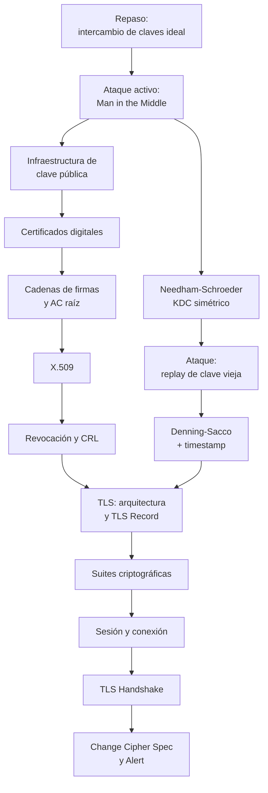

# Clase 05 — Protocolos criptográficos

> **17/09/2026** — jueves, **teoría** · [Filminas](../../raw/clases/Clase%2005%20-%20Protocolos.pdf) (48 filminas) · docente sin confirmar en la fuente
> Práctica asociada, sin nota propia todavía: **Guía 4 — Manejo de claves · Protocolos · Firma digital**, lunes 14/09
> Lectura recomendada al cerrar (filmina 48): **Bishop, cap. 11** (*Key Management*) · **RFC 5246** (`TLS` 1.2) · una descripción de la vulnerabilidad de renegociación de `TLS` (`g-sec.lu/practicaltls.pdf`)
> **Todavía no se dictó**: al 06/09/2026 la nota está escrita solo contra el PDF de filminas — ver [[#Estado de las fuentes|Estado de las fuentes]]
> Viene de: [[clase-04-criptografia-asimetrica-y-firma-digital|Clase 04 — Criptografía asimétrica y firma digital]]
> Sigue en: [[clase-06-politicas-de-seguridad-y-control-de-acceso|Clase 06 — Políticas de seguridad y control de acceso]]

## Mapa de la clase

**Las primeras filminas no enseñan nada nuevo: repasan el intercambio de claves de la Clase 04 y después lo rompen.** El adversario deja de ser un espía y pasa a poder escribir en el canal, y con eso ningún esquema visto hasta acá sobrevive. La moraleja de ese tramo —*el problema no es de la función de cifrado, entra en la esfera de administración de claves*— ordena todo lo que sigue: la clase no presenta la PKI como un tema del programa, la presenta como la respuesta a un fracaso. Es el mismo movimiento con el que la [[clase-01-introduccion-y-criptografia-clasica|Clase 01]] rompía los cifrados clásicos antes de formalizar qué significa «seguro».

De ahí salen **dos ramas que atacan el mismo problema —quién es el que está del otro lado— con las dos criptografías.** La asimétrica (filminas 7-21) ata identidades a claves públicas con firmas: certificados, cadenas, X.509, revocación. La simétrica (22-28) recurre a un tercero que comparte una clave con cada parte, y se da con el mismo método que el tramo anterior: se muestra un protocolo, se lo rompe, se lo arregla y el arreglo se vuelve a mirar de cerca — dos aproximaciones fallidas de Needham-Schroeder antes de la corrección con nombre propio.

**TLS (29-47) es donde las dos ramas se juntan, y donde el orden deja de ser argumentativo para volverse descriptivo:** dónde vive TLS en la pila y cuál es su unidad de datos, qué se negocia, el vocabulario —sesión contra conexión— y recién entonces el handshake, que usa todo lo anterior. Es el único bloque de la clase que no está organizado alrededor de un ataque.

## El recorrido, tramo por tramo

| # | Tramo | Qué se dio | Dónde está desarrollado |
|---|---|---|---|
| 1 | **Repaso: intercambio de claves** *(2-3)* | Un criptosistema `CCA`-Secure da confidencialidad e integridad, pero **exige que las dos partes ya compartan una clave**. El protocolo $\Pi(n) \to (\mathrm{Tran}, k_a, k_b)$, con la condición $k_a = k_b$, resuelve ese «ya»: el molde que instancia Diffie-Hellman | [[intercambio-de-claves\|Intercambio de claves]] · [[ataques-activos-y-man-in-the-middle#El punto de partida: un canal seguro exige una clave ya compartida\|El punto de partida]] |
| 2 | **Ataques activos y man in the middle** *(4-6)* | Los cuatro poderes del atacante activo —omitir, reescribir, reordenar, repetir— y la sustitución de la clave pública en el repositorio. **Ningún esquema visto hasta la Clase 04 sobrevive**, y el problema no es del cifrado sino de la administración de claves | [[ataques-activos-y-man-in-the-middle\|Ataques activos y man in the middle]] |
| 3 | **Infraestructura de clave pública** *(7)* | El objetivo: asociar una identidad a una clave para evitar la suplantación. Con una precisión que la filmina marca explícitamente: **la PKI no aplica a criptosistemas simétricos** | [[infraestructura-de-clave-publica\|Infraestructura de clave pública]] |
| 4 | **Certificados digitales** *(8-10)* | Qué contiene y quién lo firma, y las cuatro verificaciones que habilita: identidad (`CN`), clave pública, validez y uso, integridad. Cierra reabriendo el problema una capa más arriba: validar una firma también necesita una clave pública | [[certificados-digitales\|Certificados digitales]] |
| 5 | **Cadenas de firmas y autoridades raíz** *(11-13)* | La recursión de quién firma al que firma y dónde corta: las AC raíces se firman a sí mismas. La cadena $C_a = C'_a \Vert C_{CA_3} \Vert C_{CA_2} \Vert C_{CA_1}$, y la lista de raíces preinstalada que reemplaza a negociar la confianza por conexión | [[cadenas-de-firmas-y-autoridades-raiz\|Cadenas de firmas y autoridades raíz]] |
| 6 | **Certificados X.509** *(14-19)* | Los campos que fija el estándar, un certificado real volcado campo por campo —autofirmado, `CA:TRUE`, firmado con `md5WithRSAEncryption`— y los **cinco pasos** de verificación | [[x509\|X.509]] |
| 7 | **Revocación y listas CRL** *(20-21)* | Por qué invalidar una clave antes de su expiración, la tensión entre no revocar de más y propagar rápido, y la CRL: solo el emisor revoca, y se consulta offline u online | [[revocacion-y-listas-crl\|Revocación y listas CRL]] |
| 8 | **Needham-Schroeder** *(22-27)* | El `KDC` simétrico, base de Kerberos. Una primera aproximación sin frescura —replay y reuso de clave—, una segunda con nonces, y el ataque que la rompe: **una clave de sesión vieja alcanza para impersonar a $A$** | [[needham-schroeder\|Needham-Schroeder]] |
| 9 | **La modificación Denning-Sacco** *(28)* | El timestamp $T$ adentro del ticket que recibe $B$: una sola celda de diferencia con la aproximación anterior, y su precio en relojes sincronizados y una ventana $\Delta t$ | [[denning-sacco-y-frescura\|Denning-Sacco y frescura]] · [[ataques-de-repeticion-y-frescura\|Ataques de repetición y frescura]] |
| 10 | **TLS: arquitectura y el TLS Record** *(29-31)* | Seguridad a nivel transporte sobre TCP, la equivalencia informal `TLS 1.2` = `SSL 3.3`, y el récord en cuatro pasos: partir en bloques de $2^{16}$ bytes, comprimir, hashear y cifrar | [[tls-arquitectura-y-record\|TLS: arquitectura y record]] |
| 11 | **Suites criptográficas de TLS** *(32-35)* | Los cuatro tipos de mensaje TLS y el menú que se negocia: intercambio de clave, cifrado simétrico, hash o `AEAD`, y firma — con `RC4` y `DES-CBC` tachados y `AES-GCM` destacado | [[suites-criptograficas-de-tls\|Suites criptográficas de TLS]] |
| 12 | **Sesión y conexión TLS** *(36-37)* | La sesión guarda lo negociado una vez —incluido el *Master Secret* de 48 bytes— y soporta varias conexiones; la conexión guarda el material de uso, con claves **distintas por dirección** | [[sesion-y-conexion-tls\|Sesión y conexión TLS]] |
| 13 | **TLS Handshake** *(38-43)* | Los mensajes en cuatro partes: hola y parámetros, certificado y `ServerKeyExchange`, respuesta del cliente con la defensa contra *downgrade*, y `ChangeCipherSpec` más `Finish` en ambas direcciones | [[tls-handshake\|TLS handshake]] |
| 14 | **Change Cipher Spec, Alert y panorama** *(44-48)* | La renegociación de claves en cualquier momento, las alertas fatales y de advertencia con `CloseNotify`, y el cierre: TLS depende por completo de la PKI y sigue siendo la alternativa más adoptada | [[change-cipher-spec-y-alert\|Change Cipher Spec y Alert]] |

## Las cinco ideas que hay que llevarse

1. **El ataque activo no rompe una primitiva: rompe una premisa.** $\mathrm{Enc}$ puede ser perfectamente `CCA`-Secure y ser igual de inútil si la clave pública con la que se cifró nunca fue la de $B$. Por eso la respuesta de la clase no es un cifrado mejor, sino una infraestructura de administración de claves.
2. **Toda la PKI es una recursión con un corte arbitrario.** Cada certificado se valida con el certificado de quien lo firmó, hasta llegar a una raíz autofirmada en la que se confía porque venía preinstalada en el sistema, el navegador o el runtime — no porque alguien la haya verificado.
3. **La frescura es una propiedad aparte, y hay que pedirla explícitamente.** Needham-Schroeder es correcto en todo lo que se propone y aun así cae con una clave de sesión vieja: ninguna definición de seguridad del curso hasta acá cubre «este mensaje es de hoy».
4. **El nonce protege a quien lo eligió.** El defecto de Needham-Schroeder es exactamente esa asimetría: $r_1$ le da frescura a $A$, y nadie se la da a $B$ para el mensaje 3. Denning-Sacco no elimina el problema — lo acota a una ventana $\Delta t$, a cambio de exigir relojes sincronizados.
5. **TLS no inventa nada: ensambla.** Certificados X.509 para autenticar, un intercambio de clave para acordar el *pre-master secret*, nonces para la frescura y un `MAC` sobre todo el handshake que lo ata a esta ejecución. Reconocer esa forma general vale más que memorizar la lista de mensajes.

## Para el parcial

**Esta es la clase de la que sale, con evidencia dura, el Ejercicio 1 del primer parcial.** La nota [[parciales-viejos|Parciales viejos]] audita cuatro exámenes reales y encuentra el mismo patrón **sin excepción**: un protocolo, y la consigna *«¿qué intenta construir?»* seguida de *«¿qué problema tiene?»*.

| Parcial | Protocolo del Ej. 1 | Qué se pregunta |
|---|---|---|
| 2C-2025 | Intercambio de claves con `MAC` mutuo, dos claves simétricas $K, K'$ | Qué tipo de protocolo es, qué permiten los mensajes intermedios, si es susceptible a `MITM` |
| 1C-2025 | Diffie-Hellman de ocho pasos | Qué es, por qué el módulo tiene que ser primo, dónde está la seguridad computacional, sus dos problemas |
| 1C-2023 | Protocolo tipo TLS: certificado, firma, `ServerKeyExchange`-like, `Finish` con `MAC` sobre timestamp | Qué construye, para qué sirven los mensajes de confirmación mutua, por qué se deriva una clave nueva |
| 1C-2018 | **[[needham-schroeder\|Needham-Schroeder]], literal** (con `T` como nombre del KDC, y **sin** timestamp) | Por qué el nombre del destinatario viaja adentro del cifrado; el problema del paso 1.3; qué arregla Denning-Sacco |

Tres cosas para tener firmes antes del 24/09:

- Los cinco mensajes de [[needham-schroeder|Needham-Schroeder]] y los cinco de [[denning-sacco-y-frescura|Denning-Sacco]], de memoria y con el porqué de cada uno, más el ataque de la filmina 27 corrido turno por turno. Es el ejercicio con más probabilidad de aparecer tal cual.
- La secuencia de [[x509#Verificación de un certificado X.509, en cinco pasos|verificación de un certificado X.509]] y qué contiene un [[certificados-digitales|certificado]]. La trampa que más se repite en el verdadero/falso es «la clave pública de la CA» por «la clave pública del titular», y saltearse la vigencia de la AC **al momento de emisión**.
- Reconocer un protocolo *tipo TLS* aunque venga disfrazado con otra notación, como en el 1C-2023: certificado, firma y confirmación mutua con un `MAC` sobre algo fresco es la forma general que desarrolla [[tls-handshake|TLS handshake]].

El múltiple choice sobre `SSL`/`TLS`/`PKI` aparece **idéntico** en el 1C-2023 y el 1C-2018: la correcta le atribuye a TLS confidencialidad, integridad y autenticación bajo un esquema **PKI**; las trampas le atribuyen un `KDC` centralizado —eso es Needham-Schroeder, no TLS— o **no repudio**, que no da porque, establecida la clave de sesión, el esquema vuelve a ser simétrico.

## Estado de las fuentes

**El deck de 48 filminas está cubierto entero, y es la única fuente.** Se verificaron contra la página renderizada las filminas 4 a 6, 12, 13, 15 a 17, 22 a 28, 30, 31 y 38 a 43 — las que traen fórmulas, diagramas o volcados donde la extracción de texto podía perder información; el resto son viñetas simples, transcriptas con `pdftotext -layout`.

**Lo que falta es la voz.** Al 06/09/2026 la clase todavía no se dictó: no hay transcripción, ni ejemplos hablados, ni preguntas de alumnos — y por eso ninguna nota de esta clase tiene callouts *De la transcripción*. Habrá que volver sobre ella y sobre sus trece conceptos después del 17/09.

> [!discrepancia]- Dos erratas de las filminas y una inconsistencia de notación, verificadas contra la página renderizada
> | Filmina | Qué dice | Qué vale |
> |---|---|---|
> | 28 | *«Modificación Demming-Sacco»* en el título | es **Denning**, por Dorothy Denning; el segundo apellido, **Sacco** (Giovanni Sacco), sí está bien escrito. «Demming» está impreso tal cual, no es un artefacto de extracción — ver [[denning-sacco-y-frescura\|Denning-Sacco y frescura]] |
> | 42 y 43 | la fórmula del `Finish` cierra con **dos** llaves seguidas, y escribe `master \| ipad` con barra simple donde el resto usa `\|\|` | el anidado solo pide una llave; la barra es concatenación. Detalle en [[tls-handshake\|TLS handshake]] |
> | 22 a 28 | el tercero de confianza se llama `KDC` en los diagramas y `C` en la prosa | es la **misma entidad**; el reparto exacto de rótulo por filmina está en [[needham-schroeder\|Needham-Schroeder]] |
>
> **Y un artefacto que parece errata y no lo es:** en las filminas 16 y 17, `pdftotext` intercala el texto de las cajas de resaltado animadas en medio del volcado del certificado de la 15, y produce una lectura salteada que aparenta un certificado distinto. Las tres páginas renderizadas son idénticas — ver [[x509\|X.509]].

> [!nota]- Tres cabos sueltos
> - **El docente no está confirmado** en ninguna fuente: el [[cronograma|cronograma]] fija la fecha, no quién dicta.
> - **La Guía 4** —*Manejo de claves · Protocolos · Firma digital*, del lunes 14/09— no tiene nota propia todavía, y es la práctica que acompaña a esta clase y a la [[clase-04-criptografia-asimetrica-y-firma-digital|Clase 04]].
> - **Toda lectura o inferencia propia queda rotulada en el concepto donde vive**, no acá: el *Master Secret* como fórmula de `SSL 3.0` y no la `PRF` de `TLS 1.0+`, el doble sentido de $K_s$, el contenido del `header` del récord, el certificado autofirmado de la filmina 15, la causa de las claves de 40 y 512 bits, y la lectura de la filmina 48 como la vulnerabilidad de renegociación de 2009.
