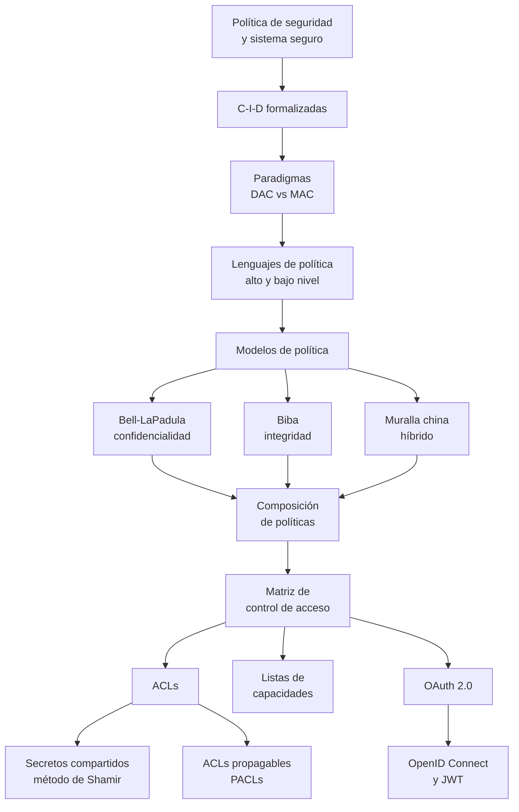

# Clase 06 — Políticas de seguridad y control de acceso

> **Esta clase todavía no se dictó.** Hoy es **04/09/2026**; según el [[cronograma]] la Clase 6 es el **01/10/2026**. Esta nota está escrita **solo contra las filminas**, sin transcripción: no hay callouts *De la transcripción*, no hay cues, y no hay forma de saber todavía qué dice el docente en voz que no esté en el PDF. Hay que volver sobre esta nota después del 01/10.
> **Docente sin confirmar.** El [[reglamento-y-evaluacion|reglamento]] lista a **Pablo Abad** como Responsable de la cátedra, y las tres teóricas de los jueves dictadas hasta ahora (Clases 1-3) fueron todas suyas. El [[video-07-principios-de-diseno-2024|Video 07]] —de otro cuatrimestre— apunta en la misma dirección: Ramele le pregunta ahí a la clase *"la parte de control de acceso ya la vieron con Pablo, ¿no?… o todo el tema de AC[L] y lista de capacidades"*, la clase responde que **todavía no**, y él aclara que el tema se corrió *"para el final"* y que va a ocupar *"dos clases"*. Lo que ese intercambio respalda, entonces, es que control de acceso lo **va a dictar** Pablo —en dos clases, más adelante—, no que ya lo haya dictado. Que sea Pablo también acá es *(inferencia nuestra)*, no un dato de esta cursada.

> **Fusión de dos decks — decisión del vault, no de la cátedra.** El [[cronograma]] llama a la clase del 01/10 *"Políticas de seguridad y control de acceso"*, pero la cátedra reparte ese contenido en **dos PDFs con numeración histórica propia**, que no coincide con la numeración del cronograma: `Clase 06 - Politicas.pdf` (56 filminas, deck de **Políticas**) y `Clase 08 - Control de acceso.pdf` (43 filminas, deck de **Control de acceso**). Esta nota cubre los dos completos y aclara siempre de cuál sale cada filmina — *"filmina 15 del deck de Políticas"* o *"filmina 26 del deck de Control de acceso"* — porque los números de filmina se repiten entre los dos decks y sin la aclaración una cita queda ambigua.

> **01/10/2026** — jueves, **teoría** · [Filminas — Políticas](../../raw/clases/Clase%2006%20-%20Politicas.pdf) (56 láminas) · [Filminas — Control de acceso](../../raw/clases/Clase%2008%20-%20Control%20de%20acceso.pdf) (43 láminas)
> Bibliografía (Bishop, *Computer Security: Art and Science* — ver [[bibliografia|Bibliografía]]): el propio deck de Políticas recomienda, en su filmina 56, los **cap. 4** (Security Policies), **5.1-5.4** (Confidentiality Policies — Bell-LaPadula), **6.1-6.2** (Integrity Policies — Biba), **7.1** (Availability Policies) y **8.1** (Hybrid Policies — Muralla china); el deck de Control de acceso recomienda, en su filmina 43, el **cap. 15** (*Representing Identity*, p. 471) para OAuth. *(Precisión nuestra: la tabla de la [[bibliografia#2. Matt Bishop — Computer Security: Art and Science|Bibliografía]] del vault —que es inferencia propia, no de la cátedra— había mapeado ese mismo capítulo 15 a la Clase 7, no a la 6; el propio deck de Control de acceso lo reclama para OAuth, así que conviene leer ese capítulo con las dos clases en mente.)* El cap. 16 (*Access Control Mechanisms*, ACLs y capacidades) cubre exactamente la matriz/ACL/capacidades de este deck, aunque ninguna filmina lo cite por número.
> Viene de: [[clase-05-protocolos-criptograficos|Clase 05 — Protocolos criptográficos]] · Sigue en: [[clase-07-autenticacion|Clase 07 — Autenticación]]

## Mapa de la clase



El deck de **Políticas** (filminas 2-55) recorre el lado teórico: qué es una política, cómo se formalizan confidencialidad/integridad/disponibilidad, y tres **modelos con reglas precisas** —Bell-LaPadula, Biba y la muralla china— que cierran con el problema de componerlos. El deck de **Control de acceso** (filminas 2-43) baja a los mecanismos concretos: la matriz de acceso y sus dos proyecciones (ACLs y capacidades), el reparto de un secreto con el método de Shamir, y el estándar de facto para delegar acceso en la web, OAuth 2.0.

---

## 1. Política de seguridad y sistema seguro

*Filminas 2-3 del deck de Políticas.*

$$\textbf{Política de seguridad: } \text{enunciado que parte los estados de un sistema en \textit{autorizados} (seguros) y \textit{no autorizados}}$$

Si el sistema entra en un estado no autorizado, ocurrió una **violación de seguridad**. La definición no dice *cómo* impedirlo: sólo traza la frontera.

$$\textbf{Sistema seguro: } \text{sistema que \emph{comienza} en un estado autorizado y \emph{nunca} puede entrar en un estado no autorizado}$$

La diferencia entre las dos definiciones es la que hace todo el trabajo después: una política es una **partición** del espacio de estados; un sistema seguro es una **garantía sobre las transiciones** — que ninguna de ellas cruza esa partición hacia el lado no autorizado. Todo lo que sigue en el deck —Bell-LaPadula, Biba, la muralla china— es una forma concreta de escribir esa partición y de demostrar que las reglas de transición la respetan (el [[#6. Bell-LaPadula|Teorema básico de la seguridad]] de Bell-LaPadula es exactamente esa demostración, formalizada).

→ Concepto: **[[politica-de-seguridad-y-sistema-seguro|Política de seguridad y sistema seguro]]**

## 2. Confidencialidad, integridad y disponibilidad

*Filminas 4-8 del deck de Políticas.*

Las tres propiedades comparten la misma forma: un conjunto $X$ de entidades y una información o recurso $I$, y una condición sobre **todos** o **ningún** miembro de $X$.

$$\textbf{Confidencialidad: } I \text{ es confidencial para } X \iff \text{ningún miembro de } X \text{ puede obtener información de } I$$

La filmina lo repite dos veces (4 y 5) para remarcar una sola cosa: la condición es **ni siquiera por vías indirectas**. No alcanza con que $X$ no pueda leer $I$ directamente; tampoco puede inferirla combinando otras fuentes. Es la misma exigencia que hace del [[clase-01-introduccion-y-criptografia-clasica#3. Seguridad (informal)|ataque de sentido del mensaje]] de la Clase 01 una violación de confidencialidad aunque no se descifre nada — acá se generaliza de "el mensaje" a cualquier información, y de un adversario a un conjunto $X$ cualquiera.

$$\textbf{Integridad: } I \text{ es íntegra para } X \iff \text{todo miembro de } X \text{ confía en } I$$

Integridad es el **espejo lógico** de confidencialidad: donde confidencialidad exige que *nadie* de $X$ acceda, integridad exige que *todos* los de $X$ confíen. El deck distingue tres sabores (filmina 7): **integridad de datos** (confianza en transporte y almacenamiento — que el dato no fue alterado en el camino), **integridad de origen** (confianza en quién lo produjo o en la identidad que dice representar) y **garantía** (confianza en que el recurso o programa funciona como debería). Son tres preguntas distintas —¿llegó intacto?, ¿vino de quien dice?, ¿hace lo que promete?— que suelen confundirse bajo la misma palabra.

$$\textbf{Disponibilidad: } I \text{ está disponible para } X \iff \text{todo miembro de } X \text{ puede acceder a } I \text{ cuando lo requiera}$$

Disponibilidad también es un "para todos", pero sobre *acceso*, no sobre *confianza*: no alcanza con que el recurso exista, tiene que responder **cuando se lo pide**. Es la propiedad que un ataque de denegación de servicio rompe sin tocar ni confidencialidad ni integridad — el [[video-06-principios-de-diseno-2026|Video 06]] lo remarca del lado de los principios de diseño (*"un sistema apagado es un sistema al que no le puede pasar nada, y eso también es un problema de seguridad"*), y esta filmina es la formalización de la que esa observación es corolario.

Las tres definiciones comparten estructura pero no son intercambiables: **X e I están cuantificados distinto** (ningún/todo) y sobre relaciones distintas (obtener información / confiar / acceder). Un sistema puede ser confidencial y no íntegro (nadie ve el dato, pero está corrompido), íntegro y no disponible (el dato es confiable pero inaccesible), o cualquier otra combinación — son tres ejes ortogonales, no una escala.

→ Concepto: **[[confidencialidad-integridad-y-disponibilidad|Confidencialidad, integridad y disponibilidad]]**

## 3. Paradigmas de control de acceso

*Filmina 9 del deck de Políticas.*

Las políticas de control de acceso se centran en controlar el acceso a **objetos**, y el deck distingue dos paradigmas por **quién fija las reglas** y **quién puede alterarlas**:

| | Acceso Discrecional (DAC) | Acceso Mandatorio (MAC) |
|---|---|---|
| Reglas | Arbitrarias (*ad hoc*) | Prefijadas |
| Mecanismos | Puntuales | Del sistema |
| ¿Se pueden alterar? | Sí — opcionalmente, controlado por quien crea la información | **No** |

En DAC, quien **crea** la información puede controlar el acceso a ella (es opcional, no obligatorio del modelo); en MAC las reglas están fijadas por el sistema y **no pueden ser alteradas** por los sujetos, ni siquiera por el creador del objeto. Esta distinción reaparece literalmente en las condiciones de Bell-LaPadula más abajo: la nota de la filmina 16 —*"los accesos discrecionales solo pueden restringir a los mandatorios, no contradecirlos"*— es DAC funcionando **adentro** de un marco MAC, nunca al revés.

> **Lo que la filmina no trae.** El nombre del concepto que deja esta sección, *[[paradigmas-de-control-de-acceso|Paradigmas de control de acceso]]*, se anuncia con un tercer paradigma, **ORCON** (*originator-controlled*). Verificado sobre la filmina 9 renderizada: **no aparece** — la lámina completa son las dos viñetas de arriba, DAC y MAC, sin una tercera. No hay ninguna mención a ORCON en ningún lugar de los dos decks de esta clase. Se deja constancia acá para que la nota de concepto no lo dé por cubierto por la fuente: si se desarrolla, hay que rotularlo como lectura externa, no como contenido de esta clase.

→ Concepto: **[[paradigmas-de-control-de-acceso|Paradigmas de control de acceso]]**

## 4. Lenguajes de descripción de políticas

*Filminas 10-13 del deck de Políticas.*

Antes de entrar a los modelos, el deck separa **cómo se escribe** una política en dos niveles.

**Alto nivel** (filminas 10-11): precisos, no ambiguos; formulación matemática o programática; estilo declarativo. Se dividen en dos estilos con default opuesto:

- **Cerrados** — listan qué se permite; lo no mencionado **no** se permite (*deny by default*). Ejemplo de la filmina, con la notación clásica de conjuntos:
$$S = \{\mathsf{admin}, \mathsf{user}, \mathsf{developer}\}, \quad O = \{\mathsf{sys}, \mathsf{bin}, \mathsf{build}\}, \quad R = \{\mathsf{read}, \mathsf{write}, \mathsf{execute}\}$$
$$A = \{(\mathsf{admin},\mathsf{sys},\mathsf{execute}),\ (\mathsf{user},\mathsf{bin},\mathsf{execute}),\ (\mathsf{developer},\mathsf{bin},\mathsf{execute}),\ (\mathsf{developer},\mathsf{bin},\mathsf{write}),\ (\mathsf{developer},\mathsf{build},\mathsf{read})\}$$
- **Abiertos** — listan qué **no** se permite; lo no mencionado **sí** está permitido (*allow by default*). Ejemplo, política de un navegador con reglas $\mathtt{deny\ (op\ X)\ when\ b}$:
$$\begin{aligned}
&\texttt{deny (read File) when file.name == "/etc/passwd"}\\
&\texttt{deny (open Socket) when net.connections > 100}\\
&\texttt{deny (fetch Image) when image.domain in untrustedDoms}
\end{aligned}$$

La filmina deja la pregunta abierta y sin resolver: *¿qué es mejor, un lenguaje abierto o cerrado?* — es la misma tensión entre el **principio de denegación por defecto** (que vuelve a aparecer en [[#11. Listas de control de acceso|ACLs]], en [[#12. Listas de capacidades|capacidades]] y en la [[#9. Composición de políticas|composición de políticas]]) y la conveniencia de listar sólo las excepciones.

**Bajo nivel** (filmina 13): argumentos para comandos que definen o verifican restricciones; naturaleza **imperativa**, no declarativa. Ejemplos: `xhost +host1 -host2` (permitir acceso a `host1` y no a `host2`) y una regla de Tripwire para registrar atributos de archivos salvo inodo y tiempo de acceso. La filmina cierra con la advertencia que ordena toda la sección: **no confundir políticas con mecanismos** — una política dice *qué* debe cumplirse; `xhost` y Tripwire son *cómo* se lo hace cumplir en un sistema concreto.

→ Concepto: **[[lenguajes-de-descripcion-de-politicas|Lenguajes de descripción de políticas]]**

## 5. Modelos de política

*Filmina 14 del deck de Políticas.*

Un modelo **describe una familia de políticas**, no una política puntual. Su valor es doble: provee un marco teórico común (permite reutilizar demostraciones entre políticas distintas que instancian el mismo modelo) y simplifica el desarrollo de políticas nuevas — no hay que reprobar desde cero que una política es consistente si ya se sabe que el modelo del que sale lo es. Las tres secciones siguientes son tres modelos con ese estatus: Bell-LaPadula para confidencialidad, Biba para integridad, la muralla china para conflictos de interés. Cada uno fija su propio vocabulario de sujetos, objetos y reglas, y cada uno viene con una prueba —el [[#6. Bell-LaPadula|Teorema básico de la seguridad]] es el ejemplo canónico— de que seguir las reglas alcanza para no salir nunca del conjunto de estados autorizados.

→ Concepto: **[[modelos-de-politica|Modelos de política]]**

## 6. Bell-LaPadula

*Filminas 15-28 del deck de Políticas.*

Modelo de **política militar**, centrado en garantizar **confidencialidad**. Conceptualiza el sistema como sujetos $S$ y objetos $O$, con transiciones de la forma $(\text{Sujeto}, \text{Objeto}, \text{Acción})$ donde las acciones se clasifican en **Lectura** y **Escritura** (filmina 15).

### Versión simplificada — niveles totalmente ordenados

Cada sujeto y cada objeto tiene un nivel asignado, tomado de una lista **totalmente ordenada** de niveles — el original define cuatro (filmina 18):

$$\mathsf{Public} < \mathsf{Confidential} < \mathsf{Secret} < \mathsf{Top\ Secret}$$

pero el modelo funciona con cualquier cantidad de niveles. Con $L(\cdot)$ la función de etiquetado:

$$\textbf{Condición de seguridad simple (reducida): } S \text{ puede leer } O \iff L(O) \le L(S) \ \wedge\ S \text{ tiene permiso discrecional para leer } O$$

$$\textbf{Condición de cierre / *-property (reducida): } S \text{ puede escribir } O \iff L(S) \le L(O) \ \wedge\ S \text{ tiene permiso discrecional para escribir } O$$

**"La información fluye hacia arriba, no hacia abajo"** es la frase que resume las dos: se puede leer hacia abajo (niveles menores o iguales) y escribir hacia arriba (niveles mayores o iguales), nunca al revés. El modelo **combina acceso mandatorio y discrecional**: la condición de nivel es MAC —no se negocia—, y el permiso discrecional es DAC —restringe más, dentro de lo que MAC ya permite—. La filmina 16 lo deja en un recuadro aparte, rotulado *"Importante"*: *"Los accesos discrecionales solo pueden restringir a los mandatorios, no contradecirlos"* — DAC nunca amplía lo que MAC prohíbe.

**Ejemplo (filmina 19).** Sujetos: Diseñador, Gerente, Director. Objetos: Producto X, Balances. Etiquetado: $L(\text{Diseñador}) = \mathsf{Confidential}$, $L(\text{Gerente}) = \mathsf{Secret}$, $L(\text{Director}) = \mathsf{Top\ Secret}$, $L(\text{Producto X}) = \mathsf{Confidential}$, $L(\text{Balances}) = \mathsf{Secret}$. Aplicando las dos condiciones: el Diseñador puede leer Producto X (mismo nivel) pero no Balances (nivel mayor); puede escribir Producto X y Balances (ambos en nivel igual o mayor al suyo). El Gerente puede leer Producto X y Balances, pero sólo puede escribir Balances (escribir Producto X sería escribir hacia abajo). El Director puede leer los dos objetos, pero no puede escribir ninguno de los dos sin violar la condición de cierre (ambos están por debajo de Top Secret) — salvo que existan objetos en su propio nivel.

### Cuando no hay orden completo: categorías y compartimentos

**El problema (filmina 20).** Si varios proyectos aislados $P_1, P_2, P_3$ están todos por debajo de un Director que los ve a todos, un esquema de niveles totalmente ordenados **no puede garantizar** la aislación entre $P_x$ y $P_y$ — el Director domina a los tres, pero nada en el modelo de niveles impide que información de $P_1$ termine mezclada con la de $P_2$ a través de él.

**Modelo completo (filmina 21).** Se agregan **categorías**: describen el tipo de información, **no están ordenadas** entre sí, y a cada sujeto y objeto se le asigna un **compartimento**:

$$\text{Compartimento} = (\text{Nivel}, \{\text{categorías}\})$$

**Dominancia (filmina 22).** Sea $l \in L$ (los niveles totalmente ordenados) y $C \subseteq CAT$ (un subconjunto de categorías):

$$(l, C)\ \operatorname{dom}\ (l', C') \iff l' \le l \ \wedge\ C' \subseteq C$$

Un compartimento domina a otro si su nivel es mayor o igual **y** su conjunto de categorías **incluye** al del otro. La filmina ilustra esto con el retículo de tres categorías $\{\text{Planes}, \text{Ideas}, \text{Coord.}\}$: $(\cdot,\{\text{Planes},\text{Ideas},\text{Coord.}\})$ domina a los tres pares $(\cdot,\{\text{Planes},\text{Ideas}\})$, $(\cdot,\{\text{Planes},\text{Coord.}\})$, $(\cdot,\{\text{Ideas},\text{Coord.}\})$, y estos a su vez dominan a los tres singletons, que dominan al conjunto vacío — es el retículo de partes de $\{\text{Planes},\text{Ideas},\text{Coord.}\}$ ordenado por inclusión, cruzado con el orden de niveles.

**Ejemplos concretos (filmina 23):** con $\mathsf{TS} > \mathsf{S} > \mathsf{P}$,
$$(\mathsf{TS},\{X\}) \operatorname{dom} (\mathsf{TS},\emptyset), \qquad (\mathsf{TS},\{X\}) \operatorname{dom} (\mathsf{S},\{X\}), \qquad (\mathsf{S},\{X\}) \not\operatorname{dom} (\mathsf{P},\{Y\}), \qquad (\mathsf{P},\{Y\}) \not\operatorname{dom} (\mathsf{S},\{X\})$$

Los dos últimos no son comparables — $\operatorname{dom}$ es un orden **parcial**, no total: dado un par de compartimentos $A, B$ puede pasar que $A \operatorname{dom} B$, que $B \operatorname{dom} A$, o que **ninguno domine al otro** (filmina 23).

**Condiciones con dominancia (filminas 24-25)**, reescribiendo las dos condiciones de arriba con $\operatorname{dom}$ en vez de $\le$:

$$\textbf{Condición de seguridad simple: } S \text{ puede leer } O \iff L(S) \operatorname{dom} L(O) \ \wedge\ S \text{ tiene permiso para leer } O$$
$$\textbf{Condición de cierre (*-property): } S \text{ puede escribir } O \iff L(O) \operatorname{dom} L(S) \ \wedge\ S \text{ tiene permiso para escribir } O$$

### Teorema básico de la seguridad, y por qué hace falta la condición de cierre

$$\textbf{Teorema básico de la seguridad (filmina 26): } \text{si el sistema arranca en un estado seguro y cada transición satisface la condición simple y la de cierre, \emph{todos} los estados son seguros}$$

La condición simple sola sólo impide la lectura directa hacia arriba; **la condición de cierre existe para bloquear los caminos indirectos**: sin ella, un sujeto de nivel alto podría leer un secreto y luego **escribirlo** en un objeto de nivel bajo, filtrándolo a cualquiera que lea ese objeto — un canal de escritura que elude por completo la restricción de lectura.

**El problema de la comunicación (filmina 27).** Si $A$ le envía un mensaje a $B$ con $B \operatorname{dom} A$: la condición de cierre permite el envío ($A$ escribe hacia arriba, hacia $B$). Pero si **$B$ le contesta**, la condición de cierre **lo prohíbe** — $B$ escribiendo hacia $A$ sería escribir hacia abajo. Es una consecuencia directa e incómoda del modelo: la comunicación bidireccional entre niveles distintos queda rota por diseño. La solución que da Bell-LaPadula es permitir **bajar temporalmente** el nivel de acceso: cada sujeto tiene un $\mathsf{MaxLevel}$ y un $\mathsf{CurLevel}$ con $\mathsf{MaxLevel} \operatorname{dom} \mathsf{CurLevel}$, y la disminución debe **solicitarse explícitamente** — $B$ pide operar temporalmente al nivel de $A$ para poder responderle.

**Principio de tranquilidad (filmina 28).** Usuarios y objetos **no cambian de nivel** después de creados. Las dos formas de romper esto son ambas fatales:

- **Subir el nivel de un objeto**: la información ya fue leída por usuarios de menor nivel *antes* de la subida — viola retroactivamente la condición simple.
- **Bajar el nivel de un objeto**: es el problema de **declasificación** — viola la condición de cierre, porque el objeto pudo haber sido escrito por sujetos de nivel alto bajo la garantía de que sólo otros de nivel alto lo leerían.

> **Cruce con el Video 11.** El único material en video que toca Bell-LaPadula es la [[video-11-flujo-de-informacion|nota de Flujo de información]], y lo hace con una advertencia explícita de alcance: la filmina 15 de *esa* clase (Clase 9, deck de Flujo de información) usa **sólo la relación de dominancia**, sin desarrollar la condición simple ni la *-property — el propio docente la llama en voz *"similar a lo que vimos en políticas"*, dando por vista una clase que, verificado, **no tiene ninguna grabación**. La nota de video reporta además una notación sin explicar, $(b,-,C_1)$ para una restricción discrecional, que combina justo con el punto de esta sección: *"los accesos discrecionales solo pueden restringir a los mandatorios"* es la regla general de la que ese símbolo es un caso particular sin desarrollar.

→ Concepto: **[[bell-lapadula|Bell-LaPadula]]**

## 7. Modelos de integridad de Biba

*Filminas 29-39 del deck de Políticas.*

**Por qué no alcanza con invertir Bell-LaPadula (filminas 29-30).** Las políticas de integridad —de mayor uso en ambientes comerciales que militares— tienen requerimientos muy distintos de los de confidencialidad: **separación de trabajo** (una función crítica que requiere al menos dos pasos debe ser ejecutada por personas distintas), **auditoría** (control y registro de operaciones), **separación de funciones** (que la creación y el consumo de información no recaigan en la misma persona), **acceso** (si alguien necesita información, se le da — lo opuesto al espíritu restrictivo de BLP), **administración descentralizada** de niveles y categorías, y **agregación** (evitar deducir información sensible a partir de información publicada). El deck es explícito: modelar esto con Bell-LaPadula sería *"muy complicado"*, porque la cantidad de niveles y categorías sería difícil de administrar.

**Base común a los tres modelos (filmina 31).** Conjuntos de sujetos $S$, objetos $O$, niveles de integridad $I$; una relación $<$ sobre $I \times I$ que expresa dominancia del primero sobre el segundo; una función $i: S \cup O \to I$ que da el nivel de integridad de cada entidad; y relaciones $r, w, x \subseteq S \times O$ para lectura, escritura y ejecución permitidas.

**Niveles de integridad, no de seguridad (filmina 32).** A mayor nivel, mayor confianza en que un programa se ejecuta correctamente (o detecta errores en sus entradas) y en que un dato es preciso y fiable. La distinción con Bell-LaPadula es de fondo: **los niveles de seguridad limitan el flujo de información; los niveles de integridad limitan la modificación de información.** Son ejes distintos aunque compartan la maquinaria de niveles y dominancia.

**Camino de transferencia de información (filmina 33).** Secuencia de objetos $o_1,\dots,o_{n+1}$ y sujetos $s_1,\dots,s_n$ tal que

$$s_i\ r\ o_i \ \wedge\ s_i\ w\ o_{i+1} \qquad \text{para todo } 1 \le i \le n$$

— cada sujeto lee el objeto anterior y escribe el siguiente, encadenando una transferencia indirecta de $o_1$ a $o_{n+1}$ aunque ningún sujeto individual toque los dos extremos.

### Los tres modelos

**1. Low-Water-Mark (filmina 34).** Idea: si un sujeto usa información poco confiable, se vuelve poco confiable.

$$\begin{aligned}
&\text{1. } s \in S \text{ puede escribir } o \in O \iff i(o) \le i(s)\\
&\text{2. Si } s \text{ lee } o: \quad i'(s) = \min\bigl(i(s), i(o)\bigr) \text{ es el nuevo nivel de } s\\
&\text{3. } s_1 \text{ puede ejecutar } s_2 \iff i(s_2) \le i(s_1)
\end{aligned}$$

Previene tanto modificaciones directas que bajarían el nivel de integridad como modificaciones indirectas con información de menor nivel. **El precio (filmina 36):** los niveles de los sujetos **decaen con el uso** — eventualmente nadie puede acceder ni generar objetos de nivel alto. Degradar los niveles de los objetos en lugar de los sujetos tiene el mismo problema simétrico: los objetos se degradan hasta el piso.

**Demostración de que restringe el flujo (filmina 35, idea).** Si hay un camino de transferencia entre $o_1$ y $o_n$, aplicar la política exige $i(o_j) \le i(o_1)$ para todo $1 < j \le n$. Por inducción: tras $k$ lecturas, $i(s_k) = \min\bigl(i(o_1),\dots,i(o_k)\bigr)$, y la última escritura requiere $i(o_n) \le i(s_n) \le i(o_1)$ — la integridad nunca puede *subir* a lo largo del camino, sólo mantenerse o bajar.

**2. Ring Policy (filmina 37).** Considera **sólo** la modificación directa; cualquiera puede leer cualquier cosa.

$$\begin{aligned}
&\text{1. } s \in S \text{ puede escribir } o \in O \iff i(o) \le i(s)\\
&\text{2. Cualquier sujeto puede leer cualquier objeto}\\
&\text{3. } s_1 \text{ puede ejecutar } s_2 \iff i(s_2) \le i(s_1)
\end{aligned}$$

Los niveles son **estáticos** (a diferencia de Low-Water-Mark) y el modelo **permite** usar información de baja confianza para generar información de nivel alto — la lectura sin restricción es la contracara de esa libertad.

**3. Strict Integrity (filmina 38) — el dual exacto de Bell-LaPadula.**

$$\begin{aligned}
&\text{1. } s \in S \text{ puede leer } o \in O \iff i(s) \le i(o)\\
&\text{2. } s \in S \text{ puede escribir } o \in O \iff i(o) \le i(s)\\
&\text{3. } s_1 \text{ puede ejecutar } s_2 \iff i(s_2) \le i(s_1)
\end{aligned}$$

Léase: *"no se puede leer hacia abajo, no se puede escribir hacia arriba"* — exactamente invertido respecto de Bell-LaPadula, porque acá lo que se protege no es que el secreto no baje sino que la basura no suba. Agregando categorías y controles discrecionales se obtiene el dual completo de BLP, y mantiene la misma restricción de flujo demostrada arriba para Low-Water-Mark.

**Ejemplo — S.O. LOCUS (filmina 39).** Cada archivo tiene un nivel de credibilidad; cada usuario arranca con un nivel de confianza máximo preasignado; cada **proceso** tiene un nivel de riesgo — el máximo nivel al que puede correr, fijado por la credibilidad de su ejecutable. Para ejecutar un proceso de menor integridad hay que invocar explícitamente `run-untrusted` — el mismo patrón de "degradación explícita, nunca implícita" que la condición de tranquilidad de Bell-LaPadula.

→ Concepto: **[[modelos-de-integridad-de-biba|Modelos de integridad de Biba]]**

## 8. Muralla china

*Filminas 40-47 del deck de Políticas.*

**Modelo híbrido**: toma en cuenta confidencialidad **e** integridad a la vez, y se concentra en un problema distinto de los dos anteriores — el **conflicto de interés**, de uso extendido en ámbitos bursátiles y judiciales (algunos países exigen medidas que lo prevengan por ley). Ejemplos de la filmina 40: impedir que un *trader* represente a dos clientes que compiten en el mercado, o que un perito trabaje para la fiscalía y para el defendido en el mismo caso.

**Concepto (filmina 41).** Agrupar entidades en **clases de conflicto de interés**; controlar el acceso de sujetos a cada clase; controlar la **escritura** a todas las clases para impedir que se mueva información en contra de la política; permitir que datos **desclasificados** sean vistos por todos.

**Definiciones (filmina 42).**

- **Objetos**: ítems de información relacionados con una empresa.
- **Company Dataset (CD)**: conjunto de objetos relacionados con la misma empresa.
- **Conflict of Interest Class (COI)**: contiene los CD de empresas en conflicto de interés entre sí. Se asume que **cada objeto pertenece a exactamente un COI**.

**Ejemplo (filmina 43).** Dos COI: *entidades financieras* — con los CD de Citibank, Santander y (Banco) Francés — y *medios de prensa* — con los CD de Clarín, La Nación y Crónica. Un sujeto que lee un CD dentro de un COI queda restringido respecto del resto de ese mismo COI (ver más abajo), pero nada le impide, en principio, acceder también a un CD del otro COI.

**Elemento temporal (filmina 44).** Si $S$ lee cualquier CD de un COI, **no puede volver a leer otra CD del mismo COI, nunca** — se impide que use información obtenida antes para decisiones que afecten a intereses en competencia. Este elemento temporal es un requerimiento **nuevo**, que Bell-LaPadula no captura: BLP no tiene memoria de qué se leyó antes, sólo compara niveles y compartimentos en el instante del acceso.

**Condición simple de seguridad (filmina 45).** $S$ puede leer $o$ si se cumple **alguna** de estas condiciones:

$$\begin{aligned}
&\text{1. } \exists\, o' \text{ leído previamente por } S \text{ tal que } CD(o) = CD(o') \quad \text{(ya accedió a un dato de esa misma empresa)}\\
&\text{2. } \forall\, o' \text{ leído previamente por } S: \ COI(o) \ne COI(o') \quad \text{(nunca accedió a nada de ese COI)}\\
&\text{3. } o \text{ es un objeto declasificado} \quad \text{(información que dejó de ser confidencial, p. ej. un balance anual ya vencido)}
\end{aligned}$$

**Por qué la escritura necesita su propia regla (filmina 46).** Si $s_1$ y $s_2$ acceden a dos CD que pertenecen al **mismo** COI (dos empresas en competencia, por ejemplo) no hay, todavía, conflicto de interés: cada uno leyó lo suyo. Y si $s_1$ y $s_2$ acceden **ambos** a un tercer CD de otro COI, tampoco lo hay. **Pero** si uno de los dos puede *escribir* información en ese CD común, se abre un canal indirecto — igual que el camino de transferencia de Biba — por el que información de una empresa puede terminar filtrándose a través del CD compartido hacia alguien con acceso al competidor.

**Propiedad de cierre (filmina 47).** $S$ puede escribir $o$ si se cumplen **las dos** condiciones:

$$\begin{aligned}
&\text{1. } S \text{ puede leer } o \text{ según la condición simple de seguridad}\\
&\text{2. Para todo objeto no público } o': \ S \text{ puede leer } o' \implies CD(o') = CD(o)
\end{aligned}$$

En prosa: para poder escribir un objeto, **todo** lo que ese sujeto puede leer tiene que pertenecer a la misma empresa que el objeto en cuestión — la filmina lo resume como *"el dato es escrito por un miembro de la empresa"*. Es la misma lógica de la *-property de Bell-LaPadula (impedir canales de escritura que desarmen lo que la lectura ya protegía), aplicada al vocabulario de COI y CD en lugar de niveles.

→ Concepto: **[[muralla-china|Muralla china]]**

## 9. Composición de políticas

*Filminas 48-55 del deck de Políticas.*

**El problema (filmina 48).** Conectar dos sistemas seguros por separado no garantiza nada sobre el sistema conjunto. Dos preguntas abren la sección: ¿la composición de los dos sistemas será segura?, ¿se puede crear una política única consistente con ambas?

### El ejemplo de Bell-LaPadula compuesto

**Planteo (filmina 49).** Se suponen dos sistemas que siguen un modelo del tipo Bell-LaPadula, y se pregunta cuál es el modelo compuesto del sistema conjunto. Dos problemas de entrada: **los grupos no tienen orden total**, y hace falta establecer una **correspondencia entre niveles de seguridad** de los dos sistemas.

> **Errata de la filmina.** La filmina 50, titulada *"Ejemplo"*, es un diagrama roto **en el propio PDF de la cátedra** — no un artefacto de extracción: renderizada a 150 dpi, la lámina muestra literalmente el recuadro de "imagen no disponible" de PowerPoint (*"This image cannot currently be displayed"*) donde debía ir la figura con los dos sistemas de niveles y categorías que se están componiendo. El deck perdió la imagen del ejemplo en algún momento de su historia y nunca se corrigió.

**Lo que sí sobrevive: el análisis (filmina 51).** A partir de las conclusiones que la filmina siguiente sí trae completas, se puede reconstruir el *tipo* de ejemplo que faltó: determinar el **orden de los niveles** entre los dos sistemas (la filmina da como ejemplo de correspondencia $\mathsf{S} < \mathsf{HIGH} < \mathsf{TS}$) y determinar la **equivalencia de categorías** entre ambos (ejemplo: la categoría `east` de un sistema representa lo mismo que la del otro). El modelo complementario resultante de componer los dos tendría **4 niveles** ($\mathsf{LOW} < \mathsf{S} < \mathsf{HIGH} < \mathsf{TS}$) y **3 categorías** ($\mathsf{SOUTH}, \mathsf{EAST}, \mathsf{WEST}$) — y la filmina remarca la conclusión que importa: **esto es una política nueva**, no la suma mecánica de las dos originales. *(No es posible reconstruir de qué compartimentos exactos partía cada uno de los dos sistemas originales: esa información vivía en la imagen rota de la filmina 50 y no está en ningún otro lugar del deck.)*

### Cuándo la composición es trivial, y cuándo no

**Modelos iguales (filmina 52).** Si se puede reemplazar la política de los componentes por el modelo compuesto, la composición es **trivial**. Si no se puede reemplazarla, hay que demostrar que la composición **cubre** los requerimientos de las políticas de los componentes — la filmina lo marca como *"muy difícil"*.

**Modelos diferentes (filmina 53).** Dos preguntas sin respuesta única: ¿qué significa "seguro" en este contexto compuesto?, ¿qué política domina la composición? No hay una única solución; dos principios guía posibles:

- **Autonomía**: cualquier acceso permitido por la política de un componente debe estar permitido por la política emergente.
- **Seguridad**: cualquier acceso prohibido por la política de un componente debe estar prohibido por la política emergente.

**Consecuencias (filmina 54).** La política compuesta satisface la seguridad de las políticas de los componentes (por el segundo principio). Queda un hueco: ¿qué pasa con los casos que ninguna de las dos políticas originales menciona explícitamente? Dos salidas, incompatibles entre sí: **permitirlo** (modelo original de Gong & Quiam) o **prohibirlo** (principio de denegación por defecto).

> **Errata de la filmina.** La filmina 54 escribe literalmente *"Gong & Quiam"* — verificado sobre la página renderizada a 150 dpi, no es un artefacto de `pdftotext` (el texto extraído trae la misma grafía). Es casi con certeza un error tipográfico del propio deck: el resultado de complejidad NP para la composición óptima de políticas, citado más abajo en esta misma sección, coincide con la línea de trabajo de Li Gong y Xiaolei Qian sobre interoperabilidad segura entre políticas — así que el nombre real detrás de "Quiam" es, con alta probabilidad, **Qian** *(inferencia nuestra, no confirmable con ningún otro material de la cátedra)*. Se preserva la grafía tal como aparece en la filmina.

### El ejemplo completo: Bob, Alice, Eve y Lilith

*Filmina 55, desarrollado entero.* Sistema $X$: **Bob no puede leer archivos de Alice**. Sistema $Y$: **Eve y Lilith pueden leer los archivos del otro**. Al componer:

- Por el sistema $Y$, Bob **podría** leer archivos de Alice — si Bob y Alice ocupan, en el sistema compuesto, roles equivalentes a Eve y Lilith, la regla de $Y$ los habilitaría mutuamente.
- Pero el sistema $X$ **prohíbe explícitamente** esto.

Ninguna composición ingenua resuelve la contradicción; la metodología que propone la filmina es:

1. Crear el conjunto de accesos posibles por **expansión de relaciones transitivas** (si $Y$ dice que Eve y Lilith se leen mutuamente, y el sistema compuesto identifica a Bob con Eve y a Alice con Lilith, esa relación se propaga).
2. Quitar las relaciones **no permitidas** por cualquiera de las políticas originales (acá, la de $X$ elimina Bob-lee-Alice).
3. **Determinar el número mínimo de relaciones que hay que quitar para que la composición quede consistente es, en general, un problema NP.**

Es la conclusión más fuerte de toda la sección: componer dos políticas seguras no es sólo conceptualmente delicado (qué principio guía usar, qué hacer con los huecos), sino que decidir la composición óptima es **computacionalmente difícil** en el caso general — no hay un algoritmo eficiente que, dadas dos políticas arbitrarias, encuentre la composición mínima consistente con ambas.

→ Concepto: **[[composicion-de-politicas|Composición de políticas]]**

---

A partir de acá, todo el material sale del **deck de Control de acceso** (`Clase 08 - Control de acceso.pdf`, 43 filminas) — la numeración de filminas vuelve a empezar desde 1.

## 10. Matriz de control de acceso

*Filminas 2-3 del deck de Control de acceso.*

El modelo **más simple**: una fila por sujeto (usuario), una columna por objeto, y las acciones permitidas en la intersección.

$$\begin{array}{c|ccccc}
 & Obj_1 & Obj_2 & Obj_3 & \cdots & Obj_n\\ \hline
Usuario_1 & r & r & rx & & rwx\\
Usuario_2 & & ox & & & \\
\vdots & & & & & \\
Usuario_n & o & x & & &
\end{array}$$

**Permite implementar cualquier política** — es el modelo más expresivo posible, porque no impone ninguna estructura sobre qué combinaciones son válidas. El precio es el **crecimiento**: el propio ejemplo de la filmina, 100.000 archivos por 500 usuarios, da 50.000.000 de entradas. Consecuencias directas: **desperdicio de espacio** (la matriz real es siempre dispersa: la mayoría de los pares usuario-objeto no tiene ningún derecho), facilidad para determinar accesos de un objeto puntual (basta mirar una columna), **complejidad para soportar altas y bajas** (agregar un usuario u objeto cambia la estructura completa de la matriz) y **administración compleja**, porque se administra elemento a elemento. Esas dos últimas debilidades son exactamente el motivo de ser de las dos secciones siguientes: **ACLs** (proyectar columnas) y **capacidades** (proyectar filas) son las dos formas estándar de no almacenar la matriz completa.

→ Concepto: **[[matriz-de-control-de-acceso|Matriz de control de acceso]]**

## 11. Listas de control de acceso

*Filminas 4-13 del deck de Control de acceso.*

**Representan columnas** de la matriz de acceso: para cada objeto, la lista de pares (sujeto, derechos). Con $S$ conjunto de sujetos, $O$ conjunto de objetos, $R$ conjunto de acciones:

$$ACL(o) = \{(s_i, r_i) \mid s_i \in S,\ r_i \subseteq R\}$$

$(s_i, r_i) \in ACL(o)$ implica que $s_i$ accede a $o$ con cualquier derecho de $r_i$ *(la lámina escribe «derecho de $i_r$», con el subíndice invertido — errata de la filmina, verificada sobre la página 5 renderizada a 400 dpi)*. **Si un sujeto no tiene entrada en $ACL(o)$, no tiene ningún derecho sobre $o$** — el **principio de denegar por defecto**, la misma idea de los lenguajes cerrados de la [[#4. Lenguajes de descripción de políticas|sección 4]].

**Modificación (filmina 6).** El derecho de **pertenencia** (`own`) puede asignarse a quien crea el objeto, o según su tipo. Sobre transferencia de permisos: **traspaso** cambia el sujeto de una entrada — $(\text{Usuario 1}, t\ rwx) \to (\text{Usuario 2}, t\ rwx)$ —, mientras que **delegación** agrega un sujeto nuevo conservando el original, con o sin el derecho de transferir a su vez: $(U_1, t\ rx) \to (U_1, t\ rx), (U_2, rx)$ (con $t$, puede volver a delegar) o $(U_1, t\ rx) \to (U_1, t\ rx), (U_2, r)$ (sin $t$, y con menos derecho).

**Usuarios privilegiados (filmina 7).** Dos variantes: los que **no** están sujetos a ningún ACL (`root` en Linux: acceso total sin excepción) y los que tienen ACLs **especiales** (`administrator` en Windows 200x: el derecho `take ownership` sobre todos los objetos, pero sigue siendo un ACL, no una exención total).

**Grupos (filmina 8).** Los ACL crecen igual, aunque menos que la matriz completa; en la práctica se usan **grupos** (roles) — que no pertenecen al modelo clásico de ACLs. Con $g = \{s_1,\dots,s_i \mid s \in S\}$:

$$(g, r) \in ACL(o) \implies (s_1, r') \in ACL(o)\ \dots\ (s_i, r'_{(i)}) \in ACL(o), \quad \text{con } r \subseteq r'_{(i)}$$

Reducen el tamaño de los ACLs pero agregan una dimensión de complejidad nueva: **conflictos** entre lo que dice el grupo y lo que dice una entrada individual.

**Conflictos (filmina 9).** Escenario: $ACL(o) = \{(\text{Pablo}, rw), (\text{Profesores}, r)\}$ con $\text{Pablo} \in \text{Profesores}$. Dos políticas de resolución posibles:

- **Grant-All**: requiere que **todos** los ACs aplicables otorguen el derecho. En el ejemplo, Pablo sólo puede **leer** (la entrada de grupo no le da escritura, y Grant-All exige que ambas coincidan). Requiere además definir un orden de evaluación.
- **First-Rule**: se usa el **primer** ACL encontrado. En el ejemplo, como la entrada individual de Pablo aparece antes, Pablo puede **leer y escribir**.

**Derechos por defecto (filmina 10).** Definen qué AC aplicar a sujetos sin entrada explícita. Escenario: $ACL(o) = \{(\text{Pablo}, x), (*, r)\}$. **Override**: si el sujeto tiene un AC propio, se usa ése; si no, el default — en el ejemplo, Pablo puede **ejecutar** (su entrada explícita gana, y no se combina con el default). **Augment**: se parte del default y se **agregan** los ACs explícitos — Pablo puede **leer y ejecutar** (el default de lectura se suma a su ejecución explícita).

**Revocación (filmina 11).** El dueño quita la entrada del sujeto, o quita sólo los derechos necesarios dentro de ella. **Se complica mucho con transferencia de permisos**: puede requerir borrar en cascada permisos delegados. Escenario trampa: $S_1$ delega en $S_2$, $S_2$ delega en $S_3$; $S_1$ revoca a $S_2$; **acto seguido** $S_3$ delega de vuelta en $S_2$ — la revocación en cascada tiene que decidir si ese re-otorgamiento posterior sobrevive o no.

**Ejemplo — Windows, archivos (filminas 12-13).** Derechos: leer, escribir, ejecutar, borrar, cambiar permisos, tomar control. Cada ACL incluye usuarios y grupos, y cada derecho tiene **tres estados posibles**: otorgado ($+$), no asignado (en blanco) y revocado ($-$). Los derechos vienen agrupados en niveles: *No access* (todos en $-$), *Read* (leer $+$, ejecutar $+$), *Change* (leer, escribir, ejecutar, borrar, todos $+$), *Full control* (todos en $+$). El algoritmo de acceso a un archivo (filmina 13) es una cadena de decisión ordenada: (1) buscar todos los ACs del ACL que referencien al usuario o a sus grupos; (2) si no hay ninguno, **denegado**; (3) si el acceso está **revocado** en algún AC aplicable, **denegado** — el $-$ gana siempre, sin importar cuántos $+$ haya en otros ACs; (4) si al menos un AC permite el derecho (y ninguno lo revocó), **aceptado**; (5) si no, **denegado**. Es una variante de **Grant-All con veto explícito** *(lectura nuestra: la filmina 13 da los cinco pasos, no esta caracterización)*: el revocado pesa más que cualquier cantidad de otorgados.

→ Concepto: **[[listas-de-control-de-acceso|Listas de control de acceso]]**

## 12. Listas de capacidades

*Filminas 14-22 del deck de Control de acceso.*

**Representan filas** de la matriz de acceso: para cada sujeto, la lista de pares (objeto, derechos) que posee.

$$CAP(s) = \{(o_i, r_i) \mid o_i \in O,\ r_i \subseteq R\}$$

$s$ no tiene derechos sobre ningún objeto que no esté en $CAP(s)$ — de nuevo, denegar por defecto. La diferencia de fondo con ACLs (filmina 16): **una capacidad funciona como una entrada que se posee** — la capacidad $(o_1, rwx)$ puede ser presentada por sujetos distintos, y **el sistema no controla estos datos** de la misma forma que controla un ACL: quien tiene la capacidad, tiene el acceso, así que hacen falta mecanismos de protección explícitos para evitar que un usuario **altere** o **cree** capacidades por su cuenta.

**Implementación (filminas 17-18):**

- **Tags**: marcas de bits controladas por hardware que impiden la modificación de registros desde procesos de bajo privilegio.
- **Paging / segmentos protegidos**: las capacidades viven en un segmento de memoria de sólo lectura; los procesos acceden **indirectamente** (si no, se podrían copiar). Ejemplo: los descriptores de archivo en Linux son, en este sentido, capacidades.
- **Criptografía**: asociar a cada capacidad un hash criptográfico cifrado con una clave que sólo conoce el sistema; al presentarla, el sistema recalcula y verifica el hash.

**Controles (filmina 19).** **Control de copia**: como tener la capacidad implica el acceso, hay que restringir su copia (acceso indirecto, o copia controlada por el sistema). **Amplificación**: posibilidad de contar con capacidades extendidas temporalmente al ejecutar ciertas funciones — el ejemplo de la filmina es *user mode* vs. *kernel mode*: el sistema operativo "amplifica" temporalmente los privilegios del proceso durante una llamada al sistema.

**Revocación (filmina 20).** Revisar **todas** las listas de capacidades para invalidar una es demasiado costoso, y a veces directamente imposible (sistemas remotos sin control central). En la práctica se usa **indirección**: las capacidades son índices dentro de una tabla que los procesos no pueden ver, y revocar es invalidar la entrada de esa tabla — el mismo patrón de la implementación por *paging* de arriba.

**Ejemplo — Tahoe (filmina 21).** Sistema distribuido de archivos: acceder a un archivo requiere presentar una capacidad, y hay capacidades separadas de **escritura**, **lectura** y **verificación**, todas codificadas en una única URI que junta clave de encriptación e información de validación (`URI:CHK:6hwdguhr5dvgte3qhosev7zszq:lgi66a5s6gchcu4yyaji:3:10:8448`).

**ACLs y capacidades (filmina 22).** Los dos modelos son **teóricamente equivalentes** — son las dos proyecciones (por columna, por fila) de la misma matriz —, pero difieren en la pregunta que responden y en dónde se usan cada uno en la práctica:

| | ACLs | Capacidades |
|---|---|---|
| Pregunta | Dado un objeto, ¿quiénes pueden usarlo y cómo? | Dado un sujeto, ¿qué objetos puede acceder y cómo? |
| Asociado a | Procesamiento imperativo | Procesamiento declarativo |
| Históricamente | El más desarrollado | Menos común |
| Ejemplo | Windows / Linux | Sistemas de respuesta de incidentes (IDS) |

→ Concepto: **[[listas-de-capacidades|Listas de capacidades]]**

## 13. Secretos compartidos y método de Shamir

*Filminas 23-27 del deck de Control de acceso.*

**Secretos compartidos (filmina 23).** Implementación de políticas de **separación de privilegios**: el método $(t,n)$-*threshold* reparte un secreto en $n$ partes (sombras), de forma que **cualesquiera** $t$ permiten reconstruirlo y **cualesquiera** $k < t$ **no** dan ninguna información sobre él. Puede implementarse por control del sistema o, como acá, con *threshold cryptography*.

**Principio (filmina 24).** La filmina lo enuncia así: *"Un polinomio de grado $t$ puede ser especificado mediante su evaluación en $t$ puntos diferentes"*. Es la observación que hace posible el esquema, pero está mal escrita.

> **Errata de la filmina.** El enunciado es matemáticamente impreciso: un polinomio de grado $d$ tiene $d+1$ coeficientes y hacen falta $d+1$ puntos —no $d$— para determinarlo unívocamente. La relación correcta, la que usa el propio ejemplo numérico de la filmina 26 (umbral $t=3$, polinomio de **grado 2**, tres puntos), es $\text{grado} = t-1$: **$t$ puntos determinan un polinomio de grado $t-1$**. El desarrollo completo está en [[secretos-compartidos-y-metodo-de-shamir|Secretos compartidos y método de Shamir]].

**Construcción (filmina 24).** Se arma $P(x) = a_t x^t + a_{t-1}x^{t-1} + \cdots + a_1 x + a_0 \pmod p$, con $s$ el secreto a compartir, $p > s$, $p > n$, y $a_0 = s$. Las sombras son $P(1), P(2), \dots, P(n)$.

**Reconstrucción (filmina 25).** Con $t$ sombras cualesquiera $(i_a, s_{i_a})$, se interpola por **Lagrange**:

$$P(x) = \sum_{a=1}^{t} s_{i_a} \prod_{b=1,\, b \ne s}^{t} \frac{x - i_b}{i_a - i_b} \pmod p$$

> **Errata de la filmina.** El índice de exclusión del producto está escrito, en la filmina 25, como $b \ne s$ — verificado con zoom a 400 dpi sobre la página renderizada, no es un artefacto de `pdftotext` (el texto extraído reproduce la misma $s$). Esa $s$ no está definida en ningún otro lugar de la fórmula ni del resto de la filmina: la fórmula sólo usa $t$ (cantidad de sombras), los índices $a$ y $b$, y las posiciones $i_a$, $i_b$ — ninguna $s$ suelta. Es casi con certeza un error tipográfico por el índice $a$ del propio sumatorio exterior: la interpolación de Lagrange excluye por definición el término $b=a$, no un término indexado por una variable que no existe en la fórmula. Los cálculos de esta sección usan la exclusión correcta, $b \ne a$.

y se evalúa $P(0) = s$ — el término independiente es el secreto, por construcción ($a_0 = s$).

### El ejemplo, rehecho y verificado

**Datos (filmina 26).** Secreto $s = 7$, esquema $(3,5)$: $P(x) = 5x^2 + 3x + 7 \pmod{11}$.

$$\begin{aligned}
P(1) &= 5+3+7 = 15 \equiv 4\\
P(2) &= 20+6+7 = 33 \equiv 0\\
P(3) &= 45+9+7 = 61 \equiv 6\\
P(4) &= 80+12+7 = 99 \equiv \mathbf{0}\\
P(5) &= 125+15+7 = 147 \equiv 4
\end{aligned} \pmod{11}$$

> **Errata de la filmina.** La filmina 26 del deck de Control de acceso escribe *"P(4) = 80 + 12 + 7 mod 11 = 2"*, verificado sobre la página renderizada — no es un artefacto de `pdftotext`. La cuenta está mal: $80+12+7 = 99$, y $99 = 9\times 11$, así que $99 \equiv 0 \pmod{11}$, no $2$. La sombra correcta es $(4,0)$, no $(4,2)$ — y de hecho **coincide** con la sombra $(2,0)$, lo cual es perfectamente posible para un polinomio de grado 2 con dos raíces distintas de $P(x)=0$ en $\mathbb{Z}_{11}$; no es indicio de ningún otro error.

**Verificación con $(2,0), (3,6), (5,4)$ — la que usa la propia filmina 27, y que no toca la sombra errónea:**

$$P(x) = 0\cdot\frac{(x-3)(x-5)}{(2-3)(2-5)} + 6\cdot\frac{(x-2)(x-5)}{(3-2)(3-5)} + 4\cdot\frac{(x-2)(x-3)}{(5-2)(5-3)} \pmod{11}$$

$$P(x) = \bigl[-3(x^2-7x+10) + 8(x^2-5x+6)\bigr] \bmod 11 = 5x^2+3x+7, \qquad s = P(0) = 7 \quad\checkmark$$

*(Usando $6/(-2) \equiv -3$ y $4/6 \equiv 4\cdot 6^{-1} \equiv 4\cdot 2 \equiv 8 \pmod{11}$, con $6^{-1}\equiv 2$ porque $6\cdot 2 = 12 \equiv 1$ — ver [[inverso-modular|Inverso modular]].)*

**La invitación de la propia filmina: "Intentar con $(1,4),(3,6),(4,2)$" — y ahí es donde la errata se hace evidente.** Interpolando con la sombra **tal como está escrita**, $(4,2)$:

$$P(0) = 4\underbrace{(7\cdot 5)}_{2} + 6\underbrace{(5\cdot 4)}_{9} + 2\underbrace{(7\cdot 8)}_{1} = 4\cdot 2 + 6\cdot 9 + 2\cdot 1 = 8+10+2 = 20 \equiv \mathbf{9} \pmod{11}$$

**No da 7.** Repitiendo la cuenta con la sombra **corregida**, $(4,0)$, el tercer término se anula ($0 \times \text{cualquier cosa} = 0$) y queda $P(0) = 8+10+0 = 18 \equiv 7 \pmod{11}$ — **sí da 7**. Es la confirmación algebraica, punto por punto, de que el error está en el $2$ de la filmina 26 y en ningún otro lado: cualquier subconjunto de tres sombras que **no** incluya la sombra rota reconstruye el secreto sin problema, y el que sí la incluye sólo cierra si se usa el valor correcto.

**Cruce con `wiki/catedra/parciales-viejos.md`.** El vault ya tiene un ejercicio de Shamir resuelto — [[parciales-viejos#Los ejercicios de Shamir, de la Guía 6|Ejercicio 14 de la Guía 6]], un esquema $(2,3) \bmod 11$ con **cuatro** shares donde uno es un impostor. Usa la misma mecánica de fondo (evaluar y reconstruir un polinomio en $\mathbb{Z}_{11}$) pero con umbral $2$ —una recta, no una parábola— y una estrategia distinta: como el umbral es el mínimo, alcanza con tomar dos puntos, construir la recta y ver cuál de los sombras restantes **no** cae en ella, en vez de reconstruir con Lagrange sobre tres. Esa nota registra, además, que la resolución manuscrita que documenta comete **su propio** error de aritmética (despeja $b=3$ en vez de $b=8$) y acierta el veredicto por una segunda coincidencia, no por la cuenta — un patrón de error de arrastre en la aritmética modular parecido, en espíritu, al de esta filmina.

→ Concepto: **[[secretos-compartidos-y-metodo-de-shamir|Secretos compartidos y método de Shamir]]**

## 14. ACLs propagables

*Filminas 28-30 del deck de Control de acceso.*

**PACLs** (*propagated ACLs*): permiten al **creador** de un objeto determinar quiénes y cómo acceden a él, y la regla **sigue a la información, no al objeto** — si la información se copia a un objeto nuevo, el control de acceso viaja con ella.

$$\begin{aligned}
&\text{Si } s_i \text{ crea } o: \quad PACL(o) = \{PACL_{s_i}\}\\
&\text{Si } s_i \text{ modifica } o: \quad PACL_{s_i} \cap PACL(o) \\
&\text{Si } s_i \text{ lee } o \iff (s_i, r) \in ACL(o): \quad PACL'_{s_i} = PACL_{s_i} \cap PACL(o)\\
&\text{Si } s_i \text{ escribe } o \iff (s_i, w) \in ACL(o): \quad PACL'(o) = PACL(o) \cap PACL_{s_i}
\end{aligned}$$

En prosa: crear un objeto le pone el PACL de su creador; leer un objeto **reduce** el PACL propio a la intersección con el del objeto leído (uno "hereda" las restricciones de lo que consumió); escribir un objeto reduce el PACL **del objeto** a la intersección con el de quien escribió. Cada operación sólo puede **restringir**, nunca ampliar — es la misma lógica de "el mínimo común denominador de derechos" que la propiedad de cierre de la muralla china.

**Ejemplo, desarrollado entero (filminas 29-30).**

Estado inicial:
$$PACL_{\text{Pablo}} = \{(\text{Pablo}, rw), (\text{Horacio}, r)\}, \qquad PACL_{\text{Horacio}} = \{(\text{Horacio}, rw), (\text{Juan}, r)\}, \qquad PACL(o_1) = PACL_{\text{Pablo}}$$

**Horacio escribe $o_2$:** por la regla de escritura, $PACL(o_2) = PACL(o_2) \cap PACL_{\text{Horacio}}$; como $o_2$ es nuevo (sin restricción previa), el resultado es directamente $PACL_{\text{Horacio}} = \{(\text{Horacio}, rw), (\text{Juan}, r)\}$ — **Juan puede leer $o_2$**.

**Horacio lee $o_1$:** por la regla de lectura, $PACL'_{\text{Horacio}} = PACL_{\text{Horacio}} \cap PACL(o_1) = \{(\text{Horacio}, rw),(\text{Juan}, r)\} \cap \{(\text{Pablo}, rw),(\text{Horacio}, r)\} = \{(\text{Horacio}, r)\}$ — el PACL de Horacio se **reduce**: pierde a Juan (que no estaba en el PACL de $o_1$) y su propio derecho baja de $rw$ a $r$ (el máximo común con lo que $o_1$ permitía).

**Horacio crea $o_2'$ con el contenido de $o_1$** (después de haberlo leído): por la regla de creación, $PACL(o_2') = PACL'_{\text{Horacio}} = \{(\text{Horacio}, r)\}$ — **Juan ya no tiene ningún acceso** a esta nueva copia, aunque sí lo tenía sobre el $o_2$ de la escritura directa de arriba. La filmina lo resume con una observación que conecta directamente con la sección anterior: *"es una implementación casi directa de una política de integridad según el modelo de Biba"* — leer información de menor confianza (aquí, más restringida) degrada lo que el lector puede a su vez propagar, igual que Low-Water-Mark degrada el nivel de integridad de un sujeto al leer un objeto de nivel más bajo.

→ Concepto: **[[acls-propagables|ACLs propagables]]**

## 15. OAuth 2.0

*Filminas 31-40 del deck de Control de acceso.*

**Historia (filmina 31).** *Open Standard for Authorization.* Nace en 2006 por necesidades de Twitter. `OAuth 1.0` se publica en 2010 (RFC 5849), con estructura similar a OpenID. `OAuth 2.0` se publica en octubre de 2012: mucho más simple que la versión anterior, **no es compatible** con ella, y es el estándar de facto para sitios públicos.

**Qué resuelve, y quiénes participan (filmina 32).** Permite al **dueño de un recurso** (*Resource Owner*) delegar en una **aplicación** (*Client Application*) el acceso a ese recurso, sin entregarle sus credenciales. Cuatro roles: el dueño del recurso, la aplicación cliente, el **servidor de recursos** (*Resource Server*, donde vive el dato) y el **servidor de autorización** (*Authorization Server*, quien emite los tokens) — la aplicación habla con los dos servidores, nunca directamente con las credenciales del dueño.

**El baile completo — OAuth Dance (filmina 33), transcrito paso a paso:**

1. El usuario hace **Access App** sobre la aplicación cliente.
2. La aplicación responde ofreciendo **Login via Google, Facebook, Twitter, etc.**
3. El usuario hace **Login to Client App via Foursquare, Google, etc.** — se autentica directamente contra el proveedor, no contra la aplicación.
4. El proveedor hace **Redirect to Client App, include authentication code** — la redirección va al navegador del usuario, con el código de autorización en la URL de vuelta.
5. El navegador hace **Access redirect URL** sobre la aplicación cliente, entregándole ese código.
6. La aplicación cliente hace **Send authentication code, client id, client secret** — directamente al proveedor, por un canal servidor-a-servidor (no pasa por el navegador del usuario).
7. El proveedor responde con **Return access token**.
8. La aplicación cierra el flujo devolviendo **User logged in** al usuario.

El punto de diseño que ese orden protege: el **código de autorización** viaja por el navegador (paso 4-5, expuesto en una URL), pero el intercambio final por el **access token** (paso 6-7) requiere también el `client secret`, que **nunca** pasa por el navegador — así que interceptar la URL de redirección no alcanza para robar el token.

**Tipos de clientes (filmina 34).** **Confidencial**: típicamente una aplicación en un servidor, puede mantener un secreto compartido con el servidor de autorización (`client secret`). **Público**: aplicación de escritorio, móvil o que corre en el navegador — **no puede** mantener un secreto de forma confiable (el binario o el código fuente son accesibles al usuario final).

**Registro (filmina 35).** Los clientes deben registrarse por adelantado. Cada uno requiere un **Client ID** (identificador único), un **Client Secret** (sólo para clientes confidenciales) y una o más **Redirect URI**: la lista de direcciones válidas a las que el proveedor puede redirigir con el código.

**Grant types (filmina 36):**

| Grant type | Mecanismo |
|---|---|
| **Authorization Code** | El servidor de autorización devuelve un código; el cliente lo cambia por el access token junto con su `client_id` y `client_secret` (es el flujo completo transcrito arriba) |
| **Implicit** | El servidor de autorización devuelve el access token **directamente**, sin código intermedio (pensado para clientes públicos que no pueden guardar un secreto, con el costo de exponer el token en la URL) |
| **Resource Owner Password Credentials** | En lugar de redirigir, el cliente captura y envía él mismo usuario y contraseña al servidor de autorización |
| **Client Credentials** | Autorización a nivel del propio cliente, vía su `client secret`, sin que haya un usuario final involucrado |

**Mensajes concretos, filminas 37-40 — transcritos:**

Login redirect (URL hacia el servidor de autorización):
```
https://login.salesforce.com/services/oauth2/authorize
?response_type=code&client_id=8483756923465.as.org&redirect_uri=https%3A%2F%2Fwww.example.com%2Fback
```

Callback response (URL que recibe la aplicación cliente):
```
https://app.example.com/oauth_callback
?code=aWekysIEeqM9PiThEfm0Cnr6MoLIfwWyRJcqOqHdF8f9INokharAS09ia7UNP6RiVScerfhc4w%3D%3D
```

Token Request (POST al proveedor, `form-url-encoding`):
```
code=aWekysIEeqM9PiThEfm0Cnr6MoLIfwWyRJcqOqHdF8f9INokharAS09ia7UNP6RiVScerfhc4w==
&grant_type=authorization_code&client_id=ffdskhfeihoaw&client_secret=khfeaihdiu38nd&redirect_uri=...
```

Response token (cuerpo JSON):
```json
{
  "id": "https://login.salesforce.com/id/00D5000Z3ZEAW/00550001fg5OAQ",
  "issued_at": "1296458209517",
  "refresh_token": "5Aep862eWO5D.7wJBuW5aaARbbxQ83jMRnbFNT5R8X2GUKNA==",
  "instance_url": "",
  "signature": "0/1Ldval/TIPf2tTgTKUAxRy44VwEJ7ffsFLMWFcNoA=",
  "access_token": "00D50000000IZ3Z!AQ0AQDpEDKYsn7ioKug2aSmgCjgrPjG9eRLz"
}
```

El código de la Token Request (paso 6 del baile) es el **mismo** valor que llegó por la Callback response (paso 4-5) — la filmina lo repite carácter por carácter en las dos láminas, y es la prueba visual de que el código de autorización es de un solo uso, pasado de mano en mano entre navegador y servidores.

→ Concepto: **[[oauth-2|OAuth 2.0]]**

## 16. OpenID Connect y JWT

*Filminas 41-42 del deck de Control de acceso.*

**OpenID Connect (filmina 41)** agrega **autenticación** a OAuth 2.0 —que por sí solo sólo resuelve *autorización*, delegar acceso a un recurso—. Se apoya en un tipo especial de token, el **bearer token**, obtenido junto con el access token como `id_token`, codificado en **Base64 URL-safe**.

**El bearer token es un JWT (filmina 42) — JSON Web Token — firmado digitalmente por el proveedor.** Sus campos, con su función:

| Claim | Significado |
|---|---|
| `sub` | *Subject* — a quién identifica el token |
| `iss` | *Issuer* — quién lo emitió |
| `aud` | *Audience* — para quién es (el destinatario esperado) |
| `nonce` | Valor de un solo uso, para evitar *replay* del token |
| `auth_time` | Cuándo fue autenticado el sujeto |
| `acr` | Cómo fue autenticado (opcional) |
| `iat` | *Issued At* — cuándo se emitió el token |
| `exp` | *Expiration* — cuándo deja de ser válido |

Los campos `iat`/`exp` acotan la ventana de validez del token en el tiempo, y `aud`/`iss` fijan quién lo emitió y para quién — entre los cuatro replican, en un token autocontenido y verificable con una firma, buena parte de lo que en OAuth puro dependía de la sesión con el servidor de autorización.

→ Concepto: **[[openid-connect-y-jwt|OpenID Connect y JWT]]**

---

## Para el parcial

Esta clase entra en el **segundo parcial (19/11)**, que cubre el Bloque 2 — Seguridad, Clases 6 a 11. De lo desarrollado acá, lo más evaluable:

- **Las tres condiciones formales** —confidencialidad, integridad, disponibilidad ([[#2. Confidencialidad, integridad y disponibilidad|sección 2]])— tal como están escritas, con sus cuantificadores exactos (ningún miembro / todo miembro). Es fácil confundir cuál va con cuál.
- **Bell-LaPadula**: poder escribir de memoria la condición de seguridad simple y la *-property, tanto en su forma reducida ($\le$) como con dominancia ($\operatorname{dom}$), y explicar **por qué** hace falta la condición de cierre (el canal de escritura hacia abajo) y qué es el principio de tranquilidad. El [[video-11-flujo-de-informacion|Video 11]] confirma que la relación de dominancia reaparece en la Clase 9 (Flujo de información) — vale la pena tenerla sólida por partida doble.
- **Biba, las tres reglas de cada uno de los tres modelos** (Low-Water-Mark, Ring, Strict Integrity) — son fáciles de confundir entre sí porque comparten casi toda la estructura; el eje que los distingue es qué operación restringen (lectura, escritura, o ambas con niveles estáticos).
- **Muralla china**: la condición simple de seguridad (sus tres casos) y la propiedad de cierre, y por qué el elemento temporal es algo que Bell-LaPadula no tiene.
- **Composición de políticas**: los dos principios guía (autonomía, seguridad) y que determinar la composición óptima es, en general, un problema **NP** — es una conclusión que se presta a pregunta de parcial porque es contraintuitiva (parecería que "juntar dos políticas seguras" debería ser sencillo).
- **Matriz / ACL / capacidades**: que son teóricamente equivalentes, sus fórmulas de definición, y las políticas de resolución de conflicto (Grant-All, First-Rule, Override, Augment) con ejemplos concretos como los de las filminas 9-10.
- **Método de Shamir**: saber reconstruir un secreto con Lagrange en $\mathbb{Z}_p$ dado un umbral y sombras — el [[parciales-viejos#Los ejercicios de Shamir, de la Guía 6|Ejercicio 14 de la Guía 6]] documentado en `parciales-viejos.md` es evidencia directa de que la cátedra lo toma, con un umbral más chico ($t=2$) y la variante de "encontrar al impostor entre las sombras".
- **OAuth 2.0**: los cuatro *grant types* y el flujo completo del *Authorization Code* — qué viaja por el navegador (código) y qué nunca lo hace (`client secret`, y por eso el token final es seguro aunque la URL de redirección se filtre.
- **Una advertencia que viene de otro video del mismo canal, no de esta clase**: el [[video-12-proteccion-de-datos-personales|Video 12]] reporta la frase *"ojo en el parcial con autenticación versus control de acceso"* — la distinción entre *quién es* (autenticación, [[clase-07-autenticacion|Clase 07]]) y *qué se puede hacer* (control de acceso, esta clase) es exactamente el tipo de confusión que un parcial castiga.

## Estado de las fuentes

**Cobertura.** Esta nota cubre las **56 filminas** del deck de Políticas y las **43** del deck de Control de acceso completas — todas las secciones numeradas 1 a 16 mapean, sin huecos, a algún rango de filminas de alguno de los dos PDFs.

**Lo que falta, y por qué.** No hay transcripción: la clase todavía no se dictó (hoy es 04/09/2026, la clase es el 01/10/2026). Todo lo que un docente agregue en voz —ejemplos adicionales, énfasis, la resolución completa del ejemplo de composición cuya imagen está rota en la filmina 50— queda pendiente de una revisión posterior a esa fecha.

**Lo que es inferencia nuestra**, explícitamente marcado en el cuerpo: la atribución del docente (Pablo Abad, por patrón de las Clases 1-3 y por una mención indirecta del Video 07); la reconstrucción parcial del ejemplo de composición BLP de la filmina 49-51 (la imagen que faltaba no se puede recuperar de ninguna otra fuente del vault); y la observación de que ORCON, nombrado en el archivo de conceptos que esta clase debía dejar, no aparece en ningún lugar de los dos decks.

**Qué videos de `wiki/videos/` la tocan — y qué tan poco.** De los cinco videos que se cruzaron contra esta clase:

- **[[video-11-flujo-de-informacion|Video 11 — Flujo de información]]** es el único con contenido genuinamente relacionado: su filmina 15 aplica la **relación de dominancia de Bell-LaPadula** al problema del flujo de información, sin desarrollar la condición simple ni la *-property. La propia nota de ese video verifica, sobre las ocho transcripciones completas del Bloque 2, que **no existe ninguna grabación** de una clase de políticas y modelos de seguridad — este material es, literalmente, la única aplicación de Bell-LaPadula que hay en todo el corpus de video de la cátedra.
- **[[video-12-proteccion-de-datos-personales|Video 12 — Protección de datos personales]]** confirma lo mismo desde el otro lado: dice explícitamente que no cubre control de acceso porque *"el tema tiene clase propia — Clase 6 — y no tiene grabación en el canal"*, y de paso trae un ejemplo de una policy JSON de AWS IAM (2012-10-17) anotada con la terna clásica de control de acceso — un puente concreto, aunque menor, entre el modelo teórico de esta clase y una implementación real.
- **[[video-06-principios-de-diseno-2026|Video 06]] y [[video-07-principios-de-diseno-2024|Video 07]] — Principios de diseño**: ninguno desarrolla políticas ni control de acceso; el Video 07 nombra Bell-LaPadula una sola vez, sólo como ejemplo del **tipo** de política que viene después de los principios de diseño, y es la fuente de la atribución del docente a Pablo Abad usada arriba.
- **[[video-08-vulnerabilidades|Video 08 — Vulnerabilidades]]** no toca ni políticas ni control de acceso — su propia tabla de cobertura lo marca como "Nula" en ambos rubros.

En síntesis: el vault sigue **sin ningún video que cubra esta clase de punta a punta**; lo único disponible en video es la aplicación fragmentaria de la dominancia de Bell-LaPadula en el Video 11.

## Ver también

- [[clase-05-protocolos-criptograficos|Clase 05 — Protocolos criptográficos]]
- [[clase-07-autenticacion|Clase 07 — Autenticación]]
- [[politica-de-seguridad-y-sistema-seguro|Política de seguridad y sistema seguro]]
- [[confidencialidad-integridad-y-disponibilidad|Confidencialidad, integridad y disponibilidad]]
- [[paradigmas-de-control-de-acceso|Paradigmas de control de acceso]]
- [[lenguajes-de-descripcion-de-politicas|Lenguajes de descripción de políticas]]
- [[modelos-de-politica|Modelos de política]]
- [[bell-lapadula|Bell-LaPadula]]
- [[modelos-de-integridad-de-biba|Modelos de integridad de Biba]]
- [[muralla-china|Muralla china]]
- [[composicion-de-politicas|Composición de políticas]]
- [[matriz-de-control-de-acceso|Matriz de control de acceso]]
- [[listas-de-control-de-acceso|Listas de control de acceso]]
- [[listas-de-capacidades|Listas de capacidades]]
- [[secretos-compartidos-y-metodo-de-shamir|Secretos compartidos y método de Shamir]]
- [[acls-propagables|ACLs propagables]]
- [[oauth-2|OAuth 2.0]]
- [[openid-connect-y-jwt|OpenID Connect y JWT]]
- [[video-11-flujo-de-informacion|Video 11 — Flujo de información]] — la relación de dominancia de Bell-LaPadula aplicada al flujo
- [[video-12-proteccion-de-datos-personales|Video 12 — Protección de datos personales]] — confirma la ausencia de video de esta clase, y trae un ejemplo de policy de AWS IAM
- [[parciales-viejos#Los ejercicios de Shamir, de la Guía 6|Ejercicios de Shamir, Guía 6]] — otro esquema $(2,3)$ resuelto, con su propio error de aritmética documentado
- [[inverso-modular|Inverso modular]] — usado en la reconstrucción de Shamir
- [[bibliografia|Bibliografía]] — capítulos de Bishop citados en esta nota
- Matt Bishop, *Computer Security: Art and Science*, caps. 4-9 (Políticas) y 16 (mecanismos de control de acceso) — RFC 6749 (OAuth 2.0)
