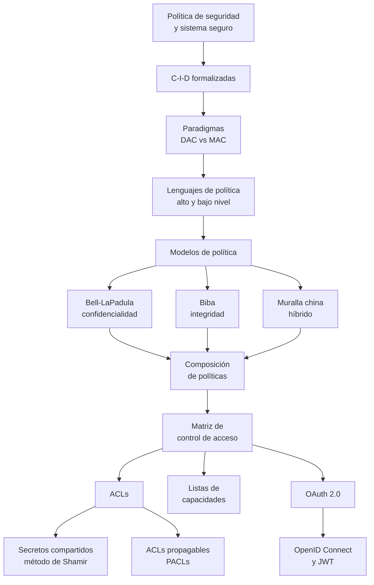

# Clase 06 — Políticas de seguridad y control de acceso

> **01/10/2026** — jueves, **teoría** · docente **Pablo Abad** *(inferencia nuestra)* · [Filminas — Políticas](../../raw/clases/Clase%2006%20-%20Politicas.pdf) (56 láminas) · [Filminas — Control de acceso](../../raw/clases/Clase%2008%20-%20Control%20de%20acceso.pdf) (43 láminas) · **sin transcripción: la clase todavía no se dictó**
> Guía del tramo: **Guía 6 — Modelos y control de acceso**, del lunes 05/10 (todavía sin nota en el vault)
> Lectura recomendada por los propios decks: Bishop, **cap. 4**, **5.1-5.4**, **6.1-6.2**, **7.1** y **8.1** (filmina 56 de Políticas) y **cap. 15** para OAuth (filmina 43 de Control de acceso) → [[bibliografia|Bibliografía]]
> Viene de: [[clase-05-protocolos-criptograficos|Clase 05 — Protocolos criptográficos]] · Sigue en: [[clase-07-autenticacion|Clase 07 — Autenticación]]

## Mapa de la clase

**Dos decks en una sola fecha, y un solo descenso.** El [[cronograma]] pone políticas y control de acceso el mismo jueves, pero la cátedra reparte ese contenido en dos PDFs con numeración histórica propia. Leídos uno detrás del otro forman un único recorrido de arriba hacia abajo: **definición primero, modelo segundo, mecanismo tercero**.

**El deck de Políticas va de la frontera a la prueba.** Traza primero la frontera, después formaliza las tres propiedades que esa frontera protege, después pregunta quién fija las reglas (DAC contra MAC) y cómo se escriben, y sólo entonces introduce los modelos. El orden importa porque cada modelo es una forma concreta de escribir esa partición, y el teorema básico de [[bell-lapadula|Bell-LaPadula]] es la demostración de que las reglas de transición la respetan. El deck cierra donde la teoría se rompe: componer dos políticas seguras no garantiza nada, y hallar la composición mínima consistente es **NP**.

**El deck de Control de acceso arranca desde el otro extremo.** Empieza por la matriz —el modelo que permite implementar cualquier política— y en la lámina siguiente le pone precio: 100.000 archivos por 500 usuarios dan 50.000.000 de celdas. Sus debilidades —desperdicio de espacio, altas y bajas, administración elemento a elemento— son la razón de ser de los dos tramos siguientes: las ACLs proyectan sus columnas, las capacidades sus filas.

## El recorrido, tramo por tramo

| # | Tramo | Qué se dio | Dónde está desarrollado |
|---|---|---|---|
| 1 | **Política de seguridad y sistema seguro** | *Filminas 2-3 de Políticas.* Una política **parte** los estados en autorizados y no autorizados; un sistema seguro **arranca** autorizado y **nunca** cruza esa frontera: una partición contra una garantía sobre las transiciones | [[politica-de-seguridad-y-sistema-seguro\|Política de seguridad y sistema seguro]] |
| 2 | **C-I-D formalizadas** | *Filminas 4-8.* Las tres con la misma forma —un conjunto $X$, una información $I$— y cuantificadores opuestos: **ningún** miembro obtiene información, **todo** miembro confía, **todo** miembro accede cuando lo requiere | [[confidencialidad-integridad-y-disponibilidad\|Confidencialidad, integridad y disponibilidad]] |
| 3 | **Paradigmas: DAC y MAC** | *Filmina 9.* Quién fija las reglas y quién puede alterarlas: en DAC, quien crea la información; en MAC, el sistema, y no se negocia | [[paradigmas-de-control-de-acceso\|Paradigmas de control de acceso]] |
| 4 | **Lenguajes de descripción de políticas** | *Filminas 10-13.* Alto nivel declarativo, con default **cerrado** o **abierto**; bajo nivel imperativo, con `xhost` y Tripwire. Y la advertencia que ordena la sección: no confundir política con mecanismo | [[lenguajes-de-descripcion-de-politicas\|Lenguajes de descripción de políticas]] |
| 5 | **Modelos de política** | *Filmina 14.* Un modelo describe una **familia** de políticas: da marco común y evita volver a probar desde cero que cada política nueva es consistente | [[modelos-de-politica\|Modelos de política]] |
| 6 | **Bell-LaPadula** | *Filminas 15-28.* Confidencialidad militar en dos reglas: se lee hacia abajo, se escribe hacia arriba. Con categorías el orden pasa a ser **parcial** ($\operatorname{dom}$). Teorema básico, problema de la comunicación y principio de tranquilidad | [[bell-lapadula\|Bell-LaPadula]] |
| 7 | **Modelos de integridad de Biba** | *Filminas 29-39.* Tres modelos —Low-Water-Mark, Ring Policy, Strict Integrity— sobre una base de niveles de integridad y caminos de transferencia. El tercero es el **dual exacto** de Bell-LaPadula | [[modelos-de-integridad-de-biba\|Modelos de integridad de Biba]] |
| 8 | **Muralla china** | *Filminas 40-47.* Modelo híbrido para el **conflicto de interés**: clases COI, company datasets, y un elemento **temporal** que Bell-LaPadula no tiene — lo ya leído restringe lo que se puede leer después | [[muralla-china\|Muralla china]] |
| 9 | **Composición de políticas** | *Filminas 48-55.* Conectar dos sistemas seguros no garantiza nada sobre el conjunto. Autonomía contra seguridad como principios guía, y el resultado que cierra el deck: la composición óptima es **NP** | [[composicion-de-politicas\|Composición de políticas]] |
| 10 | **Matriz de control de acceso** | *Filminas 2-3 de Control de acceso.* El modelo más expresivo y el más caro: permite implementar cualquier política, y el ejemplo del deck da 50 millones de celdas | [[matriz-de-control-de-acceso\|Matriz de control de acceso]] |
| 11 | **Listas de control de acceso** | *Filminas 4-13.* Las **columnas** de la matriz. Pertenencia, traspaso y delegación; grupos y sus conflictos (Grant-All, First-Rule); derechos por defecto (Override, Augment); revocación en cascada; Windows | [[listas-de-control-de-acceso\|Listas de control de acceso]] |
| 12 | **Listas de capacidades** | *Filminas 14-22.* Las **filas**. Una capacidad se posee en vez de consultarse: hacen falta tags, segmentos protegidos o criptografía para que no se falsifique. Amplificación, revocación por indirección, Tahoe | [[listas-de-capacidades\|Listas de capacidades]] |
| 13 | **Secretos compartidos y método de Shamir** | *Filminas 23-27.* Esquema $(t,n)$-*threshold* sobre un polinomio en $\mathbb{Z}_p$: las sombras son evaluaciones, la reconstrucción es interpolación de Lagrange y el secreto es $P(0)$ | [[secretos-compartidos-y-metodo-de-shamir\|Secretos compartidos y método de Shamir]] |
| 14 | **ACLs propagables** | *Filminas 28-30.* El control de acceso sigue a la **información**, no al objeto: cada lectura y cada escritura reduce el PACL a una intersección, nunca lo amplía — una política de Biba encubierta, dice la propia filmina | [[acls-propagables\|ACLs propagables]] |
| 15 | **OAuth 2.0** | *Filminas 31-40.* Delegar acceso sin entregar credenciales: cuatro roles, el baile del *Authorization Code*, clientes confidenciales y públicos, los cuatro *grant types* y los mensajes reales | [[oauth-2\|OAuth 2.0]] |
| 16 | **OpenID Connect y JWT** | *Filminas 41-42.* Lo que OAuth no resuelve —**quién** es el usuario— se agrega con un `id_token` firmado: los ocho claims y qué acota cada uno | [[openid-connect-y-jwt\|OpenID Connect y JWT]] |

## Las seis ideas que hay que llevarse

1. **Una política es una partición; un sistema seguro es una garantía sobre las transiciones.** Esa diferencia hace todo el trabajo después: cada modelo del deck es una forma concreta de escribir la partición y de probar que ninguna transición la cruza.
2. **Las tres propiedades comparten esqueleto pero no cuantificador.** Confidencialidad exige que **ninguno** de $X$ obtenga información, ni siquiera por vías indirectas; integridad y disponibilidad, que **todos** confíen y accedan. Tres ejes ortogonales, no una escala.
3. **Bell-LaPadula necesita las dos reglas, no una.** La condición simple sólo tapa la lectura directa hacia arriba; la [[bell-lapadula|condición de cierre]] tapa el camino indirecto — leer arriba y **escribir** abajo es un canal que elude por completo la restricción de lectura.
4. **Los tres modelos se distinguen por qué restringen.** Los niveles de seguridad limitan el **flujo**; los de integridad, la **modificación**; y la [[muralla-china|muralla china]] agrega algo que ninguno de los dos tiene: **memoria** de lo que el sujeto ya leyó.
5. **Matriz, ACLs y capacidades son la misma información proyectada de tres formas.** Equivalentes en teoría; lo que cambia es quién controla el dato — una ACL la guarda el sistema, una [[listas-de-capacidades|capacidad]] la posee el sujeto, y de ahí sale todo su aparato de protección.
6. **Componer dos políticas seguras no da una política segura.** Y no es sólo un problema conceptual: hallar el número mínimo de relaciones que hay que quitar para dejarla consistente es, en general, **NP**.

## Para el parcial

Entra en el **segundo parcial (19/11)**, que cubre el Bloque 2 — Clases 6 a 11.

- **Las tres condiciones formales de C-I-D**, con sus cuantificadores exactos: es fácil confundir cuál va con cuál.
- **Bell-LaPadula**: escribir de memoria la condición simple y la *-property, con $\le$ y con $\operatorname{dom}$; explicar **por qué** hace falta la condición de cierre, y qué es el principio de tranquilidad. La dominancia reaparece en la [[clase-09-flujo-de-informacion|Clase 09]].
- **Biba**: las tres reglas de cada modelo. Se confunden porque comparten casi toda la estructura; el eje que los separa es qué operación restringen.
- **Muralla china**: los tres casos de la condición simple, la propiedad de cierre, y por qué Bell-LaPadula no captura el elemento temporal.
- **Composición**: los dos principios guía —autonomía y seguridad— y el resultado NP, que se presta a pregunta por contraintuitivo.
- **Matriz, ACL y capacidades**: sus fórmulas, su equivalencia teórica, y las cuatro políticas de resolución de conflicto de las filminas 9-10.
- **Método de Shamir**: reconstruir un secreto con Lagrange en $\mathbb{Z}_p$ dados un umbral y sus sombras. El [[parciales-viejos#Los ejercicios de Shamir, de la Guía 6|Ejercicio 14 de la Guía 6]] prueba que la cátedra lo toma.
- **OAuth 2.0**: los cuatro *grant types* y el flujo del *Authorization Code* — qué viaja por el navegador (el código) y qué nunca lo hace (el `client secret`).
- **Autenticación contra control de acceso.** El [[video-12-proteccion-de-datos-personales|Video 12]] reporta una advertencia explícita de la cátedra sobre esa confusión: *quién es* es la [[clase-07-autenticacion|Clase 07]]; *qué puede hacer*, ésta.

## Estado de las fuentes

**Cobertura completa, sin voz.** Los dos decks —56 filminas de Políticas y 43 de Control de acceso— están cubiertos íntegros por los dieciséis conceptos de la tabla, sin huecos. Falta el resto: la clase no se dictó todavía (hoy es el **06/09/2026**; la fecha del cronograma es el **01/10/2026**), así que no hay transcripción y ningún video la cubre de punta a punta. Hay que volver acá después del 01/10.

**Qué es inferencia nuestra**, marcado como tal donde corresponde: la atribución del docente; la fusión de los dos decks en una sola clase, que es decisión del vault y no de la cátedra —ver [[cronograma#Doble numeración: los decks de la cátedra contra las clases del cronograma|Cronograma]]—; y la reconstrucción parcial del ejemplo de composición cuya imagen el PDF perdió.

> [!discrepancia]- Siete erratas de filmina, todas verificadas sobre la página renderizada
> Ninguna es artefacto de `pdftotext`. El análisis de cada una está en el concepto que la registra.
>
> | Deck y filmina | Qué dice | Qué vale | Dónde |
> |---|---|---|---|
> | Políticas 50 | La lámina *Ejemplo* muestra el recuadro *"This image cannot currently be displayed"* de PowerPoint | El deck perdió la figura de los dos sistemas que se componían | [[composicion-de-politicas\|Composición de políticas]] |
> | Políticas 54 | *"Gong & Quiam"* | Casi con certeza **Gong y Qian** *(inferencia nuestra)*; se preserva la grafía original | [[composicion-de-politicas\|Composición de políticas]] |
> | Control de acceso 5 | *"derecho de $i_r$"*, con el subíndice invertido | Va $r_i$, el conjunto de derechos de la entrada | [[listas-de-control-de-acceso\|Listas de control de acceso]] |
> | Control de acceso 24 | *"Un polinomio de grado $t$ puede ser especificado mediante su evaluación en $t$ puntos diferentes"* | $t$ puntos determinan un polinomio de grado $t-1$, que es la relación que usa la filmina 26 | [[secretos-compartidos-y-metodo-de-shamir\|Secretos compartidos y método de Shamir]] |
> | Control de acceso 25 | El producto de Lagrange excluye $b \ne s$, con una $s$ que la fórmula no define | Excluye por definición $b \ne a$ | [[secretos-compartidos-y-metodo-de-shamir\|Secretos compartidos y método de Shamir]] |
> | Control de acceso 26 | *"P(4) = 80 + 12 + 7 mod 11 = 2"* | $99 \equiv 0 \pmod{11}$: la sombra correcta es $(4,0)$, y con ella la filmina 27 sí cierra en el secreto | [[secretos-compartidos-y-metodo-de-shamir\|Secretos compartidos y método de Shamir]] |
> | Control de acceso 30 | *"según el modelo de Bilba"* | Es **Biba**; se preserva la grafía dentro de la cita | [[acls-propagables\|ACLs propagables]] |

> [!nota]- Cuatro cabos sueltos
> - **ORCON.** Se lo anuncia como tercer paradigma junto a DAC y MAC, pero verificado sobre la filmina 9 renderizada **no aparece**, ni ahí ni en el resto de los dos decks: es lectura externa. Queda registrado en [[paradigmas-de-control-de-acceso|Paradigmas de control de acceso]].
> - **El ejemplo de composición no se puede reconstruir.** De qué compartimentos partía cada uno de los dos sistemas de la filmina 50 vivía en la imagen rota; sólo sobrevive el análisis de la filmina 51.
> - **Docente sin confirmar.** El [[reglamento-y-evaluacion|reglamento]] lista a Pablo Abad como responsable y las teóricas dictadas hasta ahora fueron suyas; el [[video-07-principios-de-diseno-2024|Video 07]] respalda que control de acceso **lo va a dictar** él, no que ya lo haya dictado. La cita está en [[listas-de-control-de-acceso|Listas de control de acceso]].
> - **Sin video de punta a punta.** Lo único que hay es la dominancia de Bell-LaPadula aplicada al flujo en el [[video-11-flujo-de-informacion|Video 11]] y un ejemplo de política de AWS en el [[video-12-proteccion-de-datos-personales|Video 12]], cruzados desde su concepto.
