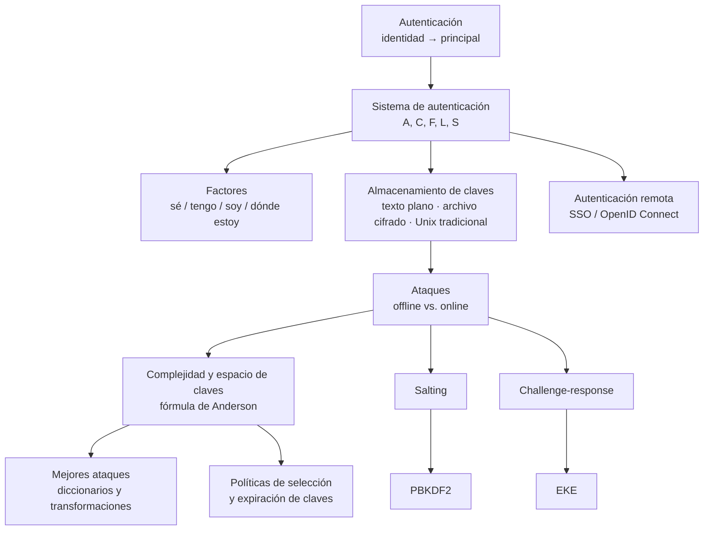

# Clase 07 — Autenticación

> **08/10/2026** — jueves, **teoría** · [Filminas](../../raw/clases/Clase%2007%20-%20Aplicaciones%20-%20Principios%20y%20autenticacion.pdf) (filminas **16 a 46** de 46; las 2-15 del mismo PDF son la clase hermana) · sin transcripción y sin video
> Práctica del lunes 19/10: **Guía 7 — Autenticación**, todavía sin nota propia
> Lectura recomendada al cerrar el deck (filmina 46): **Bishop, caps. 12-13** tal como los escribe la lámina — en la edición del vault son los **13-14** ([[bibliografia|Bibliografía]])
> Viene de: [[clase-06-politicas-de-seguridad-y-control-de-acceso|Clase 06 — Políticas de seguridad y control de acceso]]
> Sigue en: [[clase-08-principios-de-diseno-y-vulnerabilidades|Clase 08 — Principios de diseño y vulnerabilidades]]

> **Esta clase todavía no se dictó.** Hoy es 06/09/2026 y la fecha de arriba es la del [[cronograma]]. La nota está escrita **contra el PDF de filminas**, más bibliografía y lecturas propias: no hay transcripción, y por lo tanto ningún callout *De la transcripción* ni acá ni en sus diez conceptos. Hará falta revisarla después del 08/10.

## Mapa de la clase

**La clase entrega primero una letra y después no la abandona nunca.** Las tres filminas iniciales fijan un modelo de cinco componentes, $(A, C, F, L, S)$, y todo lo que viene después es ese modelo con los huecos rellenos: las claves en texto plano y el esquema Unix tradicional lo instancian, el ataque de la filmina 29 se escribe con esas mismas letras, la sal de la 40 resulta ser una forma de $C$ y no un componente nuevo, y el `SSO` del cierre es la decisión de mover $L$ fuera del sistema. Dar el vocabulario antes que cualquier mecanismo es lo que impide que cada mecanismo parezca después un truco suelto.

**El eje que parte la clase en dos está en las filminas 29 y 30: offline contra online.** Antes de ellas todo es descripción; después, todo es defensa, y cada defensa vale para exactamente uno de los dos lados. Limitar el uso de la función de autenticación no le hace nada a un atacante que ya se llevó el archivo de hashes; subir el costo por intento con [[salting|sal]] y [[pbkdf2|PBKDF2]] no le hace nada a uno que sólo prueba contra el login. Sin esa bisagra, la segunda mitad parece un listado inconexo de mitigaciones; con ella, es una tabla de dos columnas.

**Es también la clase donde entra el usuario humano.** El deck desarrolla casi enteramente el primer factor —algo que conozco— y puede hacerlo porque la persona que elige la clave ya forma parte del modelo: las políticas de selección y los diccionarios de la filmina 36 no tendrían sentido contra una clave aleatoria ideal. Es el método que la [[clase-01-introduccion-y-criptografia-clasica|Clase 01]] anunció como orden de la materia entera: primero los supuestos perfectos, después la clave real, y en la segunda mitad el humano que la elige y la escribe.

## El recorrido, tramo por tramo

| # | Tramo | Qué se dio | Dónde está desarrollado |
|---|---|---|---|
| 1 | **Autenticación y su modelo formal** *(16-18)* | Autenticar es asociar una **identidad** externa a un **principal** interno. Los tres pasos —obtener, analizar, decidir— y sus dos consecuencias obligadas: hay que **almacenar** y hay que **poder procesar**. De ahí sale $(A, C, F, L, S)$, el molde que el deck instancia dos veces | [[autenticacion\|Autenticación]] |
| 2 | **Factores de autenticación** *(19-23)* | Cuatro fuentes de las que puede salir $a$ —algo que conozco, que tengo, que soy, dónde estoy—, cada una con la debilidad estructural que la filmina le pone. El contexto es el único con **dos direcciones**, positiva y negativa | [[factores-de-autenticacion\|Factores de autenticación]] |
| 3 | **Almacenamiento de claves** *(24-28)* | Tipos de clave, y las dos formas de guardarlas con su costo: en claro —sin confidencialidad posible— o en archivo cifrado, que sólo sirve si hace falta **recuperar** la clave. El esquema Unix tradicional cierra el tramo instanciando el modelo entero | [[almacenamiento-de-claves\|Almacenamiento de claves]] |
| 4 | **Ataques al sistema** *(29-30)* | El atacante busca **cualquier** $a$ que produzca el $c$ asociado a una entidad, no la clave original. Y hay dos maneras de verificar un candidato: **offline**, sin límite de intentos una vez robado $c$, u **online**, limitable porque pasa por el sistema real | [[ataques-a-un-sistema-de-autenticacion\|Ataques a un sistema de autenticación]] |
| 5 | **Complejidad y espacio de claves** *(31-36)* | Las dos prevenciones generales; la **fórmula de Anderson** $P \ge TG/N$ con sus tres despejes numéricos; y por qué los diccionarios rebajan el $N$ **efectivo** sin tocar el nominal | [[complejidad-y-espacio-de-claves\|Complejidad y espacio de claves]] · [[ataque-de-diccionario-sobre-hashes\|Ataque de diccionario]] |
| 6 | **Políticas de selección y expiración** *(37-39)* | Quién elige la clave —aleatoria, pronunciable o el usuario— y qué paga cada opción; la **revisión proactiva**, que corre el motor del atacante al momento del alta; y los tres requisitos sin los cuales expirar claves es contraproducente | [[politicas-de-seleccion-y-expiracion-de-claves\|Políticas de selección y expiración de claves]] |
| 7 | **Salting** *(40)* | $f(a) = x \Vert f'(a,x)$: una perturbación **distinta por cuenta** que rompe la amortización de un ataque en lote sobre muchos hashes. Ya estaba construida, sin nombrarse, en las $xx$ del tramo 3 | [[salting\|Salting]] |
| 8 | **PBKDF2** *(41-42)* | Iterar $c$ veces una función pseudoaleatoria sobre la contraseña y la sal, encadenando salidas y sumándolas por `xor`. No cambia la seguridad de la primitiva: cambia el **costo por intento**, que es el $G$ de Anderson | [[pbkdf2\|PBKDF2]] |
| 9 | **Challenge-response y EKE** *(43-44)* | No enviar la clave nunca: $B$ manda un desafío fresco $r$ y $A$ responde $f(k,r)$. Eso deja una rendija —quien escuche una ronda verifica candidatas offline—, y **EKE** la cierra cifrando los tres mensajes | [[challenge-response-y-eke\|Challenge-response y EKE]] |
| 10 | **Autenticación remota y SSO** *(45-46)* | Delegar la autenticación implica **necesariamente** una relación de confianza. Productos comerciales con tecnología propia; OpenID 1 y 2 obsoletos, OpenID Connect vigente sobre OAuth2. La filmina 46 cierra el deck completo | [[autenticacion-remota-y-sso\|Autenticación remota y SSO]] |

## Las cinco ideas que hay que llevarse

1. **Todo esquema de autenticación es la misma letra rellenada.** $(A,C,F,L,S)$ no es un formalismo decorativo: el ataque de la filmina 29, la sal de la 40 y el `SSO` del cierre se escriben con esas cinco letras y nada más.
2. **Offline contra online organiza todas las defensas.** Cada mitigación protege exactamente uno de los dos lados y ninguna los dos: limitar intentos no salva un archivo de hashes ya robado, y una función lenta no impide que alguien pruebe `admin` contra el login.
3. **Espacio de claves nominal no es espacio de claves efectivo.** Los tres despejes de Anderson suponen búsqueda uniforme sobre $N$; los diccionarios y hasta las claves "pronunciables" recortan ese $N$ sin cambiar el alfabeto. Es la lección que la [[clase-01-introduccion-y-criptografia-clasica|Clase 01]] ya había dado con la sustitución monoalfabética y sus $27!$ claves.
4. **La sal y la iteración atacan factores distintos del mismo costo.** La sal rompe la amortización **entre víctimas** y no agrega un bit de dificultad contra una cuenta sola; PBKDF2 sube el costo **por evaluación** y le da igual que haya una cuenta o un millón.
5. **No enviar la clave no alcanza.** El challenge-response ya la mantiene fuera del canal y aun así deja verificar candidatas offline con una sola escucha. EKE no fortalece $f$: le saca al atacante el material contra el cual comparar. No transmitir el secreto y no dejar forma de verificarlo son dos problemas distintos.

## Para el parcial

Esta clase entra en el **segundo parcial (19/11)**. Qué pesa, y con qué evidencia:

- **Instanciar el modelo $(A,C,F,L,S)$ sobre un esquema dado**, la consigna que el deck ya resuelve dos veces —filminas 24 y 28—; [[autenticacion#Instanciando el modelo: un ejemplo fuera del deck|Autenticación]] trae un tercer caso para practicarla.
- **La fórmula de Anderson y sus tres despejes**, el contenido más mecánico del bloque: conviene saber que **el signo es $\ge$** y detectar el error de cuenta de la filmina 34 en vez de reproducirlo.
- **Saber qué defiende cada mitigación**, si el lado offline o el online: es la distinción que atraviesa los tramos 4 a 9.
- **PBKDF2**, que la filmina 27 señala como *"la forma correcta"* de guardar contraseñas, y que depende de un tema ya rendido de la Unidad 1: cómo se instancia una función pseudoaleatoria a partir de un [[hmac|MAC]].
- **Challenge-response y EKE**, base de todo protocolo de autenticación remota del curso — el caso ya visto es la [[clase-05-protocolos-criptograficos|Clase 05]], con Needham-Schroeder y TLS.
- **La lectura designada**: capítulo 13 de Bishop, *Authentication*, que el [[reglamento-y-evaluacion|reglamento]] declara cuerpo evaluable — se busca por título, no por número.

## Estado de las fuentes

**El PDF de filminas es la única fuente que dicta esta clase.** Cubre sus filminas 16 a 46 completas; las 2 a 15 del mismo archivo —los ocho principios de diseño— quedan enteramente para [[clase-08-principios-de-diseno-y-vulnerabilidades|Clase 08]], y la filmina 1 es una portada común a las dos: un mismo PDF que el [[cronograma]] reparte en dos fechas distintas.

**No hay transcripción, y ningún video de la cátedra dicta esta clase** — es uno de los [[videografia#Los cuatro huecos del Bloque 2|cuatro huecos del Bloque 2]] que la videografía documenta. Eso no equivale a que ninguno la roce: tres traen ejemplos incidentales dentro de otro tema, y los conceptos los rotulan siempre como cruce. El deck arrastra, además, tres erratas de contenido y un defecto de exportación que le comió quince símbolos matemáticos.

> [!discrepancia]- Tres erratas de las filminas, más una menor, verificadas sobre la página renderizada
> | Filmina | Qué dice | Qué corresponde |
> |---|---|---|
> | **34** | *"T ≤ 1.044.135s ~ 121 días"* | **10.441.353 s** — mal por un factor de 10, y la filmina se contradice sola: 1.044.135 s son unos 12 días, no 121. El valor en días es el confiable |
> | **42** | $K = T_1 \Vert T_2 \Vert T_i$ | $K = T_1 \Vert T_2 \Vert \cdots \Vert T_j$ — la $i$ no aparece en ningún otro lugar de la lámina |
> | **44** | el tercer mensaje escrito $\{\,f\{k, r)\,\}\,k_s$ | $\{f(k,r)\}\,k_s$ — el signo mal puesto está **dibujado**, no es un artefacto de extracción |
> | **44** *(menor)* | *"EKE – Encripted Key Exchange"* | *Encrypted*, con "y" |
>
> Cada una queda desarrollada en su concepto: [[complejidad-y-espacio-de-claves|Complejidad y espacio de claves]], [[pbkdf2|PBKDF2]] y [[challenge-response-y-eke|Challenge-response y EKE]].

> [!discrepancia]- Quince glifos que el PDF perdió al exportarse, y por qué igual se sabe cuáles eran
> En las filminas **29, 32, 33, 34 y 35** hay quince lugares donde, en vez de un símbolo matemático, se ve un recuadro con un signo de pregunta: tres, uno, tres, tres y cinco respectivamente. Así se leen en pantalla: *"Encontrar a [recuadro] A"*, *"Para algún f [recuadro] F"* e *"Intentar autenticar via l(a) [recuadro] L"* en la 29; *"Formula de Anderson: P [recuadro] TG / N"* en la 32; *"P [recuadro] TG / N => T [recuadro] PN / G"* y *"T [recuadro] 1.044.135s ~ 121 días"* en la 34. **No es artefacto nuestro ni del rasterizado:** `pdffonts` devuelve **quince subsets de `LastResort`** —la fuente que macOS sustituye cuando el glifo pedido no existe en ninguna otra—, uno por recuadro y con un solo glifo cada uno. El deck se exportó sin ellos, así que el recuadro aparece en cualquier visor, incluido el proyector del aula.
>
> **Pero se perdió el dibujo, no el código.** Cada subset conserva su `ToUnicode`, y son sólo tres puntos, los del área de uso privado de la fuente `Symbol`:
>
> | Punto de código | Carácter | Veces | Filminas |
> |---|---|---|---|
> | `U+F0CE` | `element`, o sea $\in$ | 3 | 29 |
> | `U+F0B3` | `greaterequal`, o sea $\ge$ | 8 | 32, 33, 34, 35 |
> | `U+F0A3` | `lessequal`, o sea $\le$ | 4 | 33, 34 |
>
> $3+8+4=15$, sin sobrantes ni faltantes: los conceptos escriben $\in$, $\ge$ y $\le$ según lo que el archivo codifica, **no por plausibilidad**. Dos comprobaciones lo respaldan — la filmina 35, donde de $L \approx 8{,}22$ el deck concluye 9, que sólo cierra con $\ge$; y la fuente designada, que escribe *"Then $P \ge TG/N$"* ([Bishop](../../raw/material_Catedra/bibliografia/Matt%20Bishop%20-%20Computer%20Security%20Art%20and%20Science.pdf#page=476), §13.4, p. 426). Queda en pie la advertencia visual: **la lámina no dibuja ninguno de estos quince signos**, así que ninguna cita que incluya uno debe presentarse como algo que se lee en la pantalla.

> [!nota]- Los tres videos que rozan la clase sin dictarla
> Son los `HSM` bancarios y la anécdota `admin`/`admin` del [[video-06-principios-de-diseno-2026|Video 06]], el token bancario y Worldcoin del [[video-07-principios-de-diseno-2024|Video 07]], y el PIN de Apple del [[video-12-proteccion-de-datos-personales|Video 12]] — todos dentro de otro tema, no de una clase de autenticación. Qué ejemplo aterriza en qué concepto está listado en [[videografia#La tensión de la Clase 07|Videografía § La tensión de la Clase 07]], que usa esta misma redacción para que las notas no se contradigan.

> [!nota]- Cabos sueltos, y dónde viven las inferencias propias
> - **La clase no se dictó.** Hay que volver sobre esta nota y sus diez conceptos después del 08/10, con la transcripción en la mano.
> - **La Guía 7 del 19/10 no tiene nota propia todavía**, y es la única guía del programa que se llama igual que su clase teórica.
> - **Las inferencias propias van rotuladas dentro de cada concepto, no acá:** el "hash" coloquial del esquema Unix ([[almacenamiento-de-claves|Almacenamiento de claves]]), la desigualdad de Anderson como piso y no como techo ([[complejidad-y-espacio-de-claves|Complejidad y espacio de claves]]), cuánto vale realmente una clave pronunciable ([[politicas-de-seleccion-y-expiracion-de-claves|Políticas de selección y expiración]]), los dos roles de la letra $j$ en PBKDF2 ([[pbkdf2|PBKDF2]]), de dónde sale la clave de sesión de EKE ([[challenge-response-y-eke|Challenge-response y EKE]]) y por qué OpenID Connect necesita OAuth2 debajo ([[autenticacion-remota-y-sso|Autenticación remota y SSO]]).
