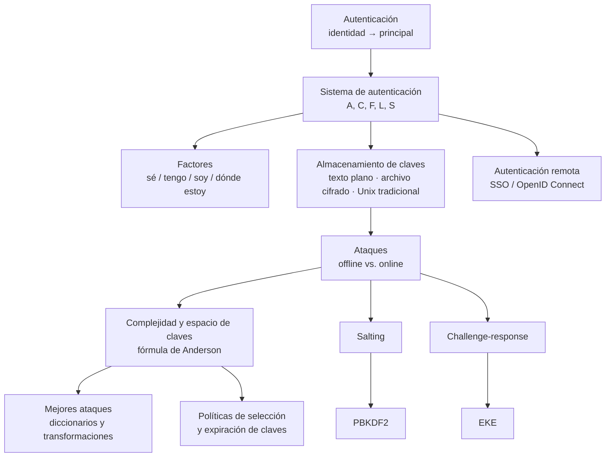

# Clase 07 — Autenticación

> **08/10/2026** — jueves, **teoría** · [Filminas](../../raw/clases/Clase%2007%20-%20Aplicaciones%20-%20Principios%20y%20autenticacion.pdf) (filminas 16 a 46 de 46; las 2-15 son la clase hermana)
> Viene de: [[clase-06-politicas-de-seguridad-y-control-de-acceso|Clase 06 — Políticas de seguridad y control de acceso]]
> Sigue en: [[clase-08-principios-de-diseno-y-vulnerabilidades|Clase 08 — Principios de diseño y vulnerabilidades]]
> Práctica relacionada, sin nota propia todavía: **Guía 7 — Autenticación**, lunes 19/10.

> **Esta clase todavía no se dictó.** Hoy es 04/09/2026 y la fecha de arriba es la del cronograma. La nota está escrita **contra el PDF de filminas**, más bibliografía y lecturas propias — no hay transcripción, y por lo tanto no hay ningún callout *De la transcripción*. Hará falta revisarla y completarla después del 08/10.

> **Un mismo PDF, dos clases.** El archivo `Clase 07 - Aplicaciones - Principios y autenticacion.pdf` trae **dos temas** que el cronograma reparte en fechas distintas: los ocho principios de diseño (filminas 2 a 15) van el **15/10**, en [[clase-08-principios-de-diseno-y-vulnerabilidades|Clase 08 — Principios de diseño y vulnerabilidades]]; la **autenticación** (filminas 16 a 46) va el **08/10**, que es esta nota. Acá se desarrolla **solamente el segundo bloque**. La filmina 1 (portada, con los dos títulos superpuestos) es común a las dos.

> **Ningún video dicta esta clase.** De los trece videos de la [[videografia|playlist de la cátedra]], ocho tocan el Bloque 2 y ninguno sigue el deck de autenticación ni lo nombra — es uno de los [[videografia#Los cuatro huecos del Bloque 2|cuatro huecos del Bloque 2]] que la propia videografía documenta, junto con control de acceso, políticas y modelos, y malware. *(Matiz nuestro: eso no equivale a que ningún video la roce. Tres videos traen ejemplos incidentales de autenticación mientras desarrollan otro tema — ver el detalle en [[#Estado de las fuentes|Estado de las fuentes]] más abajo.)* El PDF de filminas es, hasta que se dicte la clase, **la única fuente que la dicta**.

## Mapa de la clase



El deck sigue una progresión: primero define qué es autenticar y con qué formalismo (1-2), después de dónde puede salir la información que prueba una identidad (3), cómo se guarda esa información y qué pasa cuando alguien la ataca (4), cuánto cuesta atacarla en términos numéricos (5-6), y por último dos familias de mitigación — no dejar la clave estática y con poca entropía (7-8) y no transmitirla nunca (9) — que cierran con el caso de delegar la autenticación a un tercero (10).

---

## 1. Autenticación

*Filminas 16-18.*

**Autenticar es asociar una identidad a un principal.** La identidad pertenece al mundo exterior al sistema —una persona, un proceso, otro sistema—; el principal es la representación **interna** con la que el sistema opera una vez que la asociación quedó hecha. La filmina 16 lo dibuja como un embudo: una entidad externa entra por el lado del "Entorno", atraviesa un módulo de "Identidad" y un "autenticador", y sale del otro lado convertida en uno de los principales que el sistema ya conoce (`Usuario1`, `Usuario2`, `Sistema1`).

La filmina 17 da los tres pasos de toda confirmación de identidad y sus dos consecuencias obligadas:

$$\text{Obtener información} \;\to\; \text{Analizarla} \;\to\; \text{Determinar si corresponde a la entidad}$$

- Hay que **almacenar** información de cada entidad.
- Hay que contar con **mecanismos para procesarla**.

Esas dos consecuencias son la semilla de todo lo que sigue en la clase: el almacenamiento (sección 3) y el procesamiento —las funciones de complementación y autenticación— son justamente los componentes que la filmina 18 nombra con la letra siguiente.

### El sistema de autenticación, formalizado

La filmina 18 da un modelo con cinco componentes:

$$\begin{aligned}
A &= \{a\} &&\text{información de autenticación} \\
C &= \{c\} &&\text{información complementaria} \\
F &= \{\,F : A \to C\,\} &&\text{funciones de complementación} \\
L &= \{\,L : A \times C \to \{0,1\}\,\} &&\text{funciones de autenticación} \\
S &= \{s\} &&\text{funciones de selección}
\end{aligned}$$

- $A$ es lo que **provee la entidad externa**: la designación de quién dice ser, más el dato que aporta como prueba.
- $C$ es lo que **el sistema ya tiene guardado**: la especificación del principal más cualquier información complementaria.
- $F$ **deriva** $C$ a partir de $A$ — típicamente en el momento de dar de alta la entidad.
- $L$ es la que **decide**: dado un par $(a,c)$, dice si es una asociación válida.
- $S$ son las funciones que **crean y actualizan** $A$ y $C$ — alta, baja y cambio de clave.

Esta letra es el molde con el que la clase va a leer cada mecanismo concreto: contraseñas en texto plano (sección 3), el esquema Unix tradicional (también sección 3) y, más adelante, cualquier otro esquema de autenticación que aparezca en el curso se puede instanciar completando estas cinco letras.

→ Concepto: **[[autenticacion|Autenticación]]**

## 2. Factores de autenticación

*Filminas 19-23.*

La información de autenticación $a \in A$ tiene **distintos grados de confianza** según de dónde sale. La filmina 19 da las cuatro fuentes clásicas, y las filminas 20-23 desarrollan cada una con ejemplos y su debilidad estructural:

| Factor | Ejemplos de la filmina | Qué asume | Debilidad estructural |
|---|---|---|---|
| **Algo que conozco** | clave, frase (*passphrase*), pregunta secreta | secreto compartido | depende de la confidencialidad del secreto; hay que almacenarlo con seguridad |
| **Algo que tengo** | smart card / token USB, generador de claves (ej. RSA-ID), celular, tarjeta de coordenadas | posesión de un objeto | el objeto se puede copiar o clonar; la información en tránsito se puede suplantar |
| **Algo que soy** | huellas, retina, voz, cara | característica intrínseca, poco modificable | los métodos no son 100% eficaces; asume que el lector no puede ser manipulado |
| **Dónde estoy (contexto)** | red/país/geolocalización de origen, host, día y hora, *velocity* | el contexto de dónde y cuándo llega la solicitud | funciona como factor **positivo** o **negativo**, nunca solo — ver más abajo |

**El contexto es distinto a los otros tres**, y vale la pena notarlo porque es el único de los cuatro que la filmina explica con dos direcciones opuestas: un operador conectándose sólo desde la red privada del centro de cómputos es un factor **positivo** (refuerza la identidad reclamada); un usuario que aparece de golpe desde otro país es un factor **negativo** (baja la confianza, sin necesariamente romperla). Es la lógica detrás de cualquier sistema de *risk-based authentication* — la filmina no usa ese nombre, pero es exactamente lo que describe.

El resto de la clase —claves, almacenamiento, ataques— desarrolla casi enteramente el primer factor, **algo que conozco**, porque la filmina 20 ya adelanta por qué: es *"uno de los mecanismos más empleados"* y *"sirve de base a otros mecanismos"* — el *challenge-response* de la sección 9, por ejemplo, sigue basado en que las dos partes conocen la misma clave.

→ Concepto: **[[factores-de-autenticacion|Factores de autenticación]]**

## 3. Almacenamiento de claves

*Filminas 24-28.*

### Un sistema de autenticación con claves en texto plano

La filmina 24 instancia el modelo de la sección 1 en el caso más simple posible — clave guardada tal cual:

$$A = \{\,x \mid x \text{ es clave}\,\}, \quad C = A, \quad F = \{\mathrm{id}\}, \quad L = \{\text{igual}\}, \quad S = \{\texttt{adduser()}, \texttt{removeuser()}, \texttt{passwd()}\}$$

$C = A$ y $F = \{\mathrm{id}\}$ dicen exactamente lo mismo desde dos ángulos: no hay ninguna transformación entre lo que el usuario ingresa y lo que el sistema guarda. $L$ es la comparación directa. Es el caso degenerado que el resto de la sección va a ir complicando.

### Tipos de claves

La filmina 25 distingue tres familias, ya sin instanciar el modelo:

- **Secuencias de caracteres** — con restricciones (8 caracteres, 10 dígitos), generadas al azar, por el usuario o de forma asistida.
- **Secuencias de palabras** — *pass-phrases*.
- **Algorítmicas** — no son un secreto fijo: *pregunta-respuesta* (challenge-response, sección 9) y **claves de un solo uso** (OTP, *one time passwords*).

### Cómo se almacenan

Dos alternativas antes de llegar al ejemplo de Unix, y las dos con costos explícitos:

- **Texto en claro** (filmina 26) — en un archivo o una base de datos, potencialmente accedido por fuera del sistema. **No puede garantizarse confidencialidad.**
- **Archivo cifrado** (filmina 27) — requiere una clave para acceder a las contraseñas, y esa clave puede vivir en un archivo de configuración, en el propio ejecutable, pedirse en cada arranque, o guardarse en un dispositivo criptográfico especializado. La filmina es explícita sobre cuándo tiene sentido: **sólo si hace falta recuperar la clave original** — por ejemplo, para reenviarla a un tercer sistema. Para cualquier otro caso, la filmina misma remite hacia adelante: *"la forma correcta de (no) almacenar contraseñas: PBKDF2"* (sección 8).

### El ejemplo Unix tradicional

La filmina 28 formaliza el esquema clásico de `/etc/passwd`:

$$A = \{\text{secuencias de hasta 8 caracteres}\}, \qquad C = \{\,\underbrace{xx}_{2}\,\underbrace{H\!\cdots\!H}_{11}\,\}$$

- $xx$ identifica **cuál de 4096 funciones** se usó (2 caracteres).
- $H\cdots H$ es el resultado de esa función (11 caracteres).
- $F = \{\text{4096 versiones modificadas de DES}\}$.
- $L = \{\texttt{login}, \texttt{su}, \texttt{sudo}, \ldots\}$, $S = \{\texttt{passwd}, \texttt{adduser}, \ldots\}$.

> **Precisión nuestra.** La filmina llama a esto *"4096 funciones de hash"*, pero lo que describe —una **primitiva de cifrado en bloque** (DES) aplicada de forma iterada con la clave como entrada, en lugar de una [[funciones-de-hash-criptograficas|función de hash criptográfica]] propiamente dicha— es el `crypt(3)` clásico de Unix: DES modificado (con la tabla de expansión perturbada por las 2 letras de $xx$, que es la sal) corriendo 25 rondas sobre un bloque fijo de ceros, usando la clave del usuario como clave de cifrado. El nombre "hash" es el uso coloquial de la industria, no la definición técnica que el vault fija en `03.06`. Las $xx$ son la [[salting|sal]] del esquema: con 4096 valores posibles ($2^{12}$), impiden que dos usuarios con la misma clave compartan el mismo $C$, exactamente el objetivo de la sección 7.

Esta es la puerta de entrada a los ataques offline de la próxima sección: robar el archivo con los $C$ —`/etc/shadow`— y probar candidatos fuera de línea es [[ataque-de-diccionario-sobre-hashes|el ataque de diccionario]] aplicado a este esquema concreto.

→ Concepto: **[[almacenamiento-de-claves|Almacenamiento de claves]]**

## 4. Ataques a un sistema de autenticación

*Filminas 29-30.*

**El objetivo del sistema** es identificar correctamente entidades; **el objetivo del atacante** es ser identificado como una entidad que no es —impersonarla—. La filmina 29 escribe el mecanismo con las mismas letras de la sección 1: encontrar

$$a \in A \quad \text{tal que, para algún } f \in F,\quad f(a) = c \ \text{ y } \ c \text{ está asociado a una entidad}$$

y da **dos caminos de verificación**, que son los dos grandes modos de atacar:

- **Offline** — probar varios $a$, computar $f(a)$ y comparar contra $c$. Requiere haber conseguido $c$ (por ejemplo, el archivo con los hashes) pero después corre sin límite de intentos ni de tiempo real, sólo limitado por el poder de cómputo del atacante.
- **Online** — intentar autenticar directamente vía $l(a) \in L$, contra el sistema real. Cada intento pasa por el sistema, así que se lo puede limitar, auditar o bloquear.

La filmina 30 da el ejemplo canónico de cada uno:

- **Offline**: obtener `/etc/shadow` en Linux y correr `crack` o `john the ripper`; obtener el archivo `SAM` de Windows y correr `ophcrack`.
- **Online**: probar la función de `login` con una cuenta conocida — `root`, `administrator`, `guest`.

La distinción offline/online **es la que organiza toda la sección de prevención que sigue**: contra offline se sube el costo por adivinar (secciones 5, 7 y 8); contra online se limita el uso de la propia función de autenticación (ver la sección 5, filmina 31).

→ Concepto: **[[ataques-a-un-sistema-de-autenticacion|Ataques a un sistema de autenticación]]**

## 5. Complejidad y espacio de claves

*Filminas 31-36.*

### Prevenciones generales

La filmina 31 separa dos frentes de defensa, cada uno atacando un lado distinto del par $(a,c,f)$ de la sección 4:

- **Esconder información** para que $a$, $c$ y $f$ no queden conocidas simultáneamente. La filmina nota, de paso, que $f$ **suele conocerse igual** (Kerckhoffs sigue vigente), y que **es más fácil proteger $c$ que $a$** — $a$ vive en manos de la entidad externa, fuera del control del sistema.
- **Limitar el uso de la función de autenticación**: tiempos crecientes ante fallas, deshabilitar principales, *jailing*/honeypot, CAPTCHAs. Estas cuatro son exclusivamente defensas contra ataques **online** — un atacante offline, que ya tiene $c$, no pasa nunca por la función $L$ del sistema real.

### La fórmula de Anderson

La filmina 32 introduce la herramienta cuantitativa de la sección:

$$P \ge \frac{T \cdot G}{N}$$

donde $P$ es la probabilidad de adivinar una clave, $T$ el tiempo dedicado al ataque, $G$ la cantidad de pruebas realizables por segundo y $N$ el tamaño del espacio de claves.

**El signo es $\ge$, no $\le$, y conviene tenerlo claro antes del parcial.** La lámina no lo dibuja —muestra un recuadro, uno de los quince glifos que el deck perdió al exportarse (ver [[#Estado de las fuentes|Estado de las fuentes]])—, pero el archivo sí lo **codifica**, y lo que codifica es *greater-equal*. Coincide con el enunciado de la fuente: Bishop, §13.4 *Attacking Passwords*, la lectura designada de esta clase, escribe textualmente *"Then $P \ge TG/N$"* (p. 426).

Leído así, lo que la fórmula da es un **piso**, no un techo: con $T$ y $G$ dados, el atacante consigue **al menos** esa probabilidad, de modo que el número es la cota inferior del riesgo del defensor *(lectura nuestra: el deck no comenta el sentido de la desigualdad, sólo la usa)*. De ahí que el uso operativo sea siempre el despeje —fijado el $P$ que se tolera, sale el $T$ dentro del cual se alcanza (ejemplos 1 y 2), o la $N$, y con ella la longitud de clave, que hay que exigir (ejemplo 3)—, y que en los tres ejemplos el deck la trate como una **igualdad de estimación**: reemplaza los valores y saca un número exacto, no un rango *(lectura nuestra)*. Las tres filminas siguientes son esos tres usos.

### Ejemplo 1 — cuánto tarda un ataque (filmina 33)

Claves numéricas de 10 dígitos ($N = 10^{10}$), $G = 10^{4}$ pruebas por segundo, se busca $P > 0{,}5$:

$$T \le \frac{P \cdot N}{G} = \frac{0{,}5 \times 10^{10}}{10^{4}} = 5\times 10^{5}\text{ s} = 500\,000\text{ s}$$

$500\,000 / 86\,400 \approx 5{,}79$ días, que la filmina redondea a **"~6 días"**. La cuenta cierra tal como está escrita.

### Ejemplo 2 — el mismo despeje con otro espacio (filmina 34)

Claves de 8 letras, alfabeto de 26 caracteres ($N = 26^{8}$), mismo $G = 10^4$, mismo $P>0{,}5$:

$$N = 26^{8} = 208\,827\,064\,576, \qquad T \le \frac{0{,}5 \times 26^{8}}{10^{4}} = 10\,441\,353{,}2\text{ s} \;\approx\; 121\text{ días}$$

> **Errata de la filmina.** El renglón de la filmina dice *"T ≤ 1.044.135s ~ 121 días"*. El número de segundos está mal por un factor de 10: la cuenta correcta da **10.441.353 s**, no 1.044.135 s. Se verifica en las dos direcciones: $0{,}5 \times 26^8 / 10^4$ da 10 441 353,2, y además la propia conversión a días que la filmina escribe a continuación —**"~121 días"**— sólo es consistente con el valor correcto: $1\,044\,135\text{ s} / 86\,400 \approx 12$ días, no 121. La filmina se contradice a sí misma; el valor en días es el que hay que confiar, y el de segundos es el que tiene el error. (Advertencia sobre esa cita: el signo $\le$ **no está dibujado** en la lámina — ahí se ve un recuadro con un signo de pregunta, uno de los quince glifos ausentes del deck; lo escribimos porque el propio archivo lo **codifica** como *less-equal*, según se detalla en [[#Estado de las fuentes|Estado de las fuentes]]. Lo que constituye la errata es el número: **1.044.135s ~ 121 días**.)

### Ejemplo 3 — despejar la longitud mínima (filmina 35)

Alfabeto alfanumérico de 36 caracteres, $G = 10^5$ pruebas/segundo, un año de ataque ($T = 365\times24\times60\times60$ s), se pide $P<0{,}5$:

$$N \ge \frac{T\cdot G}{P} = \frac{31\,536\,000 \times 10^{5}}{0{,}5} = 6{,}3072\times 10^{12}$$

$$N = 36^{L} \ge 6{,}3\times 10^{12} \;\Longrightarrow\; L \ge \log_{36}\!\left(6{,}3\times 10^{12}\right) \approx 8{,}22 \;\Longrightarrow\; L \ge 9$$

Esta cuenta cierra exacta, sin errata: longitud mínima de **9 caracteres** alfanuméricos.

### Mejores ataques que la búsqueda aleatoria

La filmina 36 rebaja la $N$ efectiva sin cambiar el espacio nominal: diccionarios de palabras, diccionarios de claves ya filtradas en brechas anteriores, transformaciones simples (sufijos, prefijos, `l→1`, `o→0`, vocales por números, palabras espejadas, dos palabras combinadas) e información de contexto (nombre, usuario, DNI, fecha de nacimiento). Es exactamente el mecanismo que ya tiene nota propia en el vault: [[ataque-de-diccionario-sobre-hashes|Ataque de diccionario sobre hashes]] desarrolla por qué reducir el dominio de búsqueda ataca sin necesidad de romper ninguna propiedad criptográfica de la función — acá $N$ de la fórmula de Anderson es el tamaño de ese dominio reducido, no el del espacio nominal de claves.

→ Concepto: **[[complejidad-y-espacio-de-claves|Complejidad y espacio de claves]]**

## 6. Políticas de selección y expiración de claves

*Filminas 37-39.*

### Selección — tres alternativas, cada una con su costo

La filmina 37 pone tres opciones en tensión directa entre seguridad y usabilidad:

- **Selección aleatoria** — la condición ideal, cada clave equiprobable, pero difícil de memorizar (ejemplo de la filmina: `fL3K&8%j`).
- **Claves pronunciables** — palabras sin sentido armadas con fonemas (`helgoret`, `mipoterjo`, `jusacila`); fáciles de memorizar, pero el espacio de claves efectivo **se reduce mucho** frente al nominal — es la misma idea de la sección anterior, aplicada por diseño en vez de por ataque.
- **Que el usuario elija** — el problema es estructural: las claves elegidas por personas tienden a ser fáciles de adivinar, que es justo lo que explota el diccionario de la filmina 36.

### Revisión proactiva

La filmina 38 propone resolver la tensión anterior sin sacrificar ninguno de los dos lados: analizar la clave **al momento de crearla**, rechazando las "fáciles". Cuatro capacidades que debería tener ese análisis: aplicar reglas sobre palabras, buscar en diccionarios, buscar patrones, y usar información del usuario y del contexto — la misma lista de mejoras de la filmina 36, corrida hacia el momento del alta en vez del momento del ataque.

### Expiración

Forzar el cambio de clave después de un tiempo o evento limita el daño de una clave ya comprometida, pero la filmina 39 pone tres requisitos que si faltan vuelven la política contraproducente:

- **Evitar el reuso** — recordar y bloquear las $N$ últimas claves.
- **Evitar cambios demasiado frecuentes** — sin este límite, un usuario puede rotar rápido entre dos claves para esquivar el bloqueo de reuso.
- **Dar tiempo para pensar la nueva clave** — avisar con anticipación, no forzar el cambio en el momento mismo del login.

→ Concepto: **[[politicas-de-seleccion-y-expiracion-de-claves|Políticas de selección y expiración de claves]]**

## 7. Salting

*Filmina 40.*

**El escenario que motiva la sal** es paralelo, no secuencial: un atacante consigue $c_1, c_2, \ldots, c_n$ —muchos hashes a la vez, por ejemplo un `/etc/shadow` completo— y cada intento $a_i \to f(a_i)$ se puede comparar **contra todos los $c_j$ al mismo tiempo**. Sin sal, calcular $f$ una sola vez amortiza el ataque sobre $n$ cuentas.

**El método** rompe esa amortización introduciendo una perturbación distinta por cuenta:

$$f(a) = x \,\Vert\, f'(a, x)$$

Cada $c$ se calcula con una $x$ diferente, así que el atacante **no puede reutilizar** un mismo $f(a_i)$ para buscar en paralelo contra varias cuentas: tiene que recalcular la función una vez por cada valor de sal presente en el archivo. Es exactamente el mecanismo que la sección 3 ya mostró en acción: las $xx$ del esquema Unix tradicional (filmina 28) son esta $x$, con $4096 = 2^{12}$ valores posibles.

→ Concepto: **[[salting|Salting]]**

## 8. PBKDF2

*Filminas 41-42.*

**La idea** (filmina 41): sea $\mathit{pass}$ una contraseña y $S$ una sal. Se usa una función pseudoaleatoria —un criptosistema simétrico o un [[hmac|MAC]]— y se la aplica **iterativamente**, encadenando cada salida como entrada de la siguiente:

$$u_1 = \mathrm{PRF}(\mathit{pass}, S), \qquad u_2 = \mathrm{PRF}(\mathit{pass}, u_1), \qquad \ldots, \qquad u_j = \mathrm{PRF}(\mathit{pass}, u_{j-1})$$

$$\text{Resultado: } u_1 \oplus u_2 \oplus \cdots \oplus u_j$$

**El algoritmo completo** (filmina 42) generaliza a una clave derivada de la longitud que haga falta, concatenando varios bloques $T$:

$$K = \mathrm{PBKDF2}(\mathrm{prf}, \mathit{pass}, \mathit{salt}, c, \mathit{len}), \qquad K = T_1 \Vert T_2 \Vert \cdots \Vert T_j$$

$$T_j = u_1 \oplus u_2 \oplus \cdots \oplus u_j, \qquad U_1 = \mathrm{PRF}(\mathit{pass}, \mathit{salt}\,\Vert\, j), \qquad U_k = \mathrm{PRF}(\mathit{pass}, u_{k-1})$$

> **Errata de la filmina.** El segundo renglón de la filmina 42 escribe $K = T_1 \Vert T_2 \Vert T_i$, con una letra $i$ que no se usa en ningún otro lugar de la lámina: la línea inmediatamente siguiente ya define $T_j$, y la concatenación de la sal usa también $j$ (*"Salt || j"*). Corresponde $K = T_1 \Vert T_2 \Vert \cdots \Vert T_j$, manteniendo la misma letra que el resto de la fórmula.

**Por qué importa el iterar $c$ veces**: cada evaluación de $\mathrm{PRF}$ es una operación más que el atacante offline tiene que pagar por cada candidato de clave que prueba. Subir $c$ no cambia la seguridad de $\mathrm{PRF}$ en sí —sigue siendo la misma función—, sube el **costo por intento**, que es exactamente el $G$ (pruebas por segundo) de la fórmula de Anderson de la sección 5: un $c$ grande baja $G$ y, a $T$ y $N$ fijos, baja $P$.

La filmina cierra con un *tip* práctico de JCE en Java, que instancia la $\mathrm{PRF}$ con `HmacSHA1`:

```
PBEKeySpec spec = new PBEKeySpec(password, salt, iterations, bytes * 8);
SecretKeyFactory skf = SecretKeyFactory.getInstance("PBKDF2WithHmacSHA1");
byte[] key = skf.generateSecret(spec).getEncoded();
```

*(Único bloque de código de la nota fuera del diagrama; se preserva tal cual la filmina porque es un fragmento de API, no una fórmula.)*

→ Concepto: **[[pbkdf2|PBKDF2]]**

## 9. Challenge-response y EKE

*Filminas 43-44.*

### El problema y la solución de fondo

Autenticar a un usuario remoto pidiéndole que **envíe la clave** exige un canal seguro, y además, si alguien logra descubrir una comunicación vieja, la clave queda comprometida igual —sin importar qué tan buena sea—. La solución de la filmina 43 es no enviarla nunca:

$$A \xrightarrow{\ \{\text{pedido de autenticación}\}\ } B \qquad A \xleftarrow{\ \{r\}\ } B \qquad A \xrightarrow{\ f(k,r)\ } B$$

$B$ manda un **challenge** $r$ —un valor que no se puede predecir de antemano—, y $A$ responde con $f(k,r)$: una función de la clave compartida $k$ y de $r$. $B$, que también conoce $k$, puede recalcular $f(k,r)$ y comparar. La clave **nunca viaja**, y una respuesta capturada no sirve para el próximo intento porque el próximo $r$ va a ser distinto.

### EKE: cuando ni siquiera el resultado del challenge puede circular en claro

La filmina 44 agrega una capa: si un atacante puede ver $\{r\}$ y $f(k,r)$ en claro, puede intentar **verificar offline** una clave candidata $k'$ calculando $f(k', r)$ y comparando. El objetivo de *Encrypted Key Exchange* es impedir exactamente eso — que el atacante tenga manera de saber si una clave candidata es correcta:

$$A \xrightarrow{\ \{\text{pedido de autenticación}\}\,k_s\ } B \qquad A \xleftarrow{\ \{r\}\,k_s\ } B \qquad A \xrightarrow{\ \{f(k,r)\}\,k_s\ } B$$

Los tres mismos mensajes de challenge-response viajan ahora dentro de un **canal cifrado con una clave de sesión $k_s$**, independiente de $k$. Sin $k_s$, un atacante que sólo ve tráfico cifrado no tiene ningún par $(r, f(k,r))$ en claro contra el cual probar candidatos: el ataque offline de verificación queda cerrado, no porque $f$ se haya vuelto más fuerte, sino porque el atacante perdió el material sobre el que montar la comparación.

> **Errata de la filmina.** El tercer mensaje del diagrama de EKE (filmina 44) está escrito $\{\,f\{k, r)\,\}\,k_s$: abre con llave `{` después de la `f` y cierra con paréntesis `)`, una mezcla de símbolos que no cierra. Debería leerse $\{f(k,r)\}\,k_s$, igual que la notación de $f(k,r)$ de la filmina anterior. Verificado sobre la página renderizada a 300 dpi, no es un artefacto de extracción de texto: el signo mal puesto está dibujado en la imagen.

> **Errata de la filmina (menor).** El título de la filmina 44 escribe *"EKE – Encripted Key Exchange"*. El término en inglés es *Encrypted* (con "y"), no *Encripted*.

→ Concepto: **[[challenge-response-y-eke|Challenge-response y EKE]]**

## 10. Autenticación remota y SSO

*Filminas 45-46.*

**Delegar la autenticación en un sistema externo** —*Single Sign-On*— implica necesariamente una **relación de confianza**: el sistema que delega tiene que aceptar como válido lo que el sistema externo le confirme, sin volver a pedir la clave. La filmina 45 nombra tres productos comerciales —Active Directory Federation Services, CAS, Siteminder— de los que dice, literal, *"Cada uno utiliza una tecnologia diferente"* (la falta de tilde en "tecnologia" es de la lámina, no de la transcripción), lo que en la práctica los vuelve **no intercambiables entre sí** *(lectura nuestra: la filmina afirma que las tecnologías difieren, no que no puedan convivir)*; y dos tecnologías abiertas:

- **OpenID 1 y 2** — marcadas como **obsoletas** en la propia filmina.
- **OpenID Connect** — vigente, **construido sobre OAuth2**.

La filmina no desarrolla el protocolo de ninguna de las dos; la mención queda en el nivel de "qué tecnologías existen", coherente con que el resto de la clase tampoco entra en el detalle de protocolos de federación.

**Lectura recomendada** (filmina 46, cierre del deck completo): capítulos 12-13 de *Computer Security: Art and Science*, de Matt Bishop. *(Precisión nuestra: la [[bibliografia|bibliografía de la cátedra]] ubica, sobre la edición del PDF que está en `raw/`, "Authentication" en el capítulo **13** y "Design Principles" en el capítulo **14** — no en el 12, que ahí es "Cipher Techniques". Como esta filmina de cierre vale para el deck entero —principios de diseño y autenticación—, lo más probable es que "12-13" cite una edición de Bishop con numeración distinta a la del PDF del vault; no hay forma de confirmarlo sin esa otra edición a mano.)*

→ Concepto: **[[autenticacion-remota-y-sso|Autenticación remota y SSO]]**

---

## Para el parcial

Esta clase entra en el **segundo parcial (19/11)**. Evidencia concreta de qué pesa:

- La [[bibliografia|bibliografía de la cátedra]] señala el capítulo 13 de Bishop, *Authentication*, como lectura de esta clase — y el reglamento es explícito en que la bibliografía obligatoria **es** el cuerpo evaluable, no un opcional.
- La práctica del **19/10**, Guía 7, se llama directamente *"Autenticación"* — la única guía del programa con el mismo nombre que su clase teórica, lo que sugiere que el ejercicio práctico sigue de cerca el contenido de esta nota.
- El formalismo $(A, C, F, L, S)$ de la sección 1 es el tipo de definición que se presta a pedir "instanciar el modelo" sobre un esquema dado — ya aparece hecho dos veces en el propio deck (claves en texto plano, filmina 24; Unix tradicional, filmina 28), que es la forma más probable de pregunta.
- La **fórmula de Anderson** y sus tres despejes (sección 5) son el contenido más mecánico y más fácil de convertir en ejercicio numérico de todo el bloque — al punto de que el propio deck tiene un error de cuenta (filmina 34) que conviene poder detectar, no sólo reproducir.
- **PBKDF2** es la construcción que la propia filmina 27 señala como *"la forma correcta"* de guardar contraseñas, y depende de un concepto de la Unidad 1 que ya se rindió: cómo se instancia una función pseudoaleatoria a partir de un [[hmac|MAC]] o un criptosistema simétrico.
- **Challenge-response y EKE** son la base conceptual de cualquier protocolo de autenticación remota del curso — el caso ya visto es la [[clase-05-protocolos-criptograficos|Clase 05 — Protocolos criptográficos]], con [[clase-05-protocolos-criptograficos#8. Needham-Schroeder|Needham-Schroeder]] y TLS.

## Estado de las fuentes

**Cubre.** Las filminas 16 a 46 completas del PDF `Clase 07 - Aplicaciones - Principios y autenticacion.pdf`: autenticación, factores, sistema de autenticación formal, almacenamiento de claves (texto plano, archivo cifrado, Unix tradicional), ataques offline/online, fórmula de Anderson con sus tres ejemplos, mejores ataques, políticas de selección y expiración, *salting*, PBKDF2, *challenge-response*, EKE, y autenticación remota/SSO.

**No cubre.** Las filminas 2 a 15 del mismo PDF —los ocho principios de diseño— quedan enteramente para [[clase-08-principios-de-diseno-y-vulnerabilidades|Clase 08]], que las desarrolla.

**Fuente única para dictar la clase, con cruces incidentales.** Esta clase todavía no se dictó (hoy, 04/09/2026): no hay transcripción, y **ningún video de la cátedra dicta esta clase** — es uno de los cuatro huecos que la [[videografia#Los cuatro huecos del Bloque 2|videografía]] documenta explícitamente para el Bloque 2, junto con control de acceso, políticas y modelos, y malware: ningún video sigue el deck de autenticación ni lo nombra como tema propio. El PDF de filminas sigue siendo, en ese sentido, la única fuente hasta que se dicte la clase.

*(Matiz nuestro, para que no se lea como contradicción con las notas de concepto de esta misma clase.)* "Ningún video cubre la clase" y "las notas de concepto citan tres videos" son compatibles: ningún video **dicta** autenticación, pero tres la **rozan** con ejemplos concretos mientras desarrollan otro tema —principios de diseño o protección de datos personales—, y las notas correspondientes lo rotulan siempre como cruce, no como fuente de la filmina:

- **[[video-06-principios-de-diseno-2026|Video 06 — Principios de diseño (2026)]]**: los `HSM` bancarios, en [[almacenamiento-de-claves#Archivo cifrado|Almacenamiento de claves § Archivo cifrado]]; la anécdota `admin`/`admin`, en [[ataques-a-un-sistema-de-autenticacion#El ejemplo online, verificado con dos videos de la cátedra|Ataques a un sistema de autenticación § El ejemplo online, verificado con dos videos de la cátedra]].
- **[[video-07-principios-de-diseno-2024|Video 07 — Principios de diseño (2024)]]**: el token bancario, RENAPER y Worldcoin, en [[factores-de-autenticacion#Algo que tengo: la brecha entre el objeto y el canal|Factores de autenticación § Algo que tengo: la brecha entre el objeto y el canal]]; *routers* y usuarios de fábrica, en [[ataques-a-un-sistema-de-autenticacion#El ejemplo online, verificado con dos videos de la cátedra|Ataques a un sistema de autenticación § El ejemplo online, verificado con dos videos de la cátedra]].
- **[[video-12-proteccion-de-datos-personales|Video 12 — Protección de datos personales]]**: el PIN de Apple y la maratón de Boston, en [[ataques-a-un-sistema-de-autenticacion#Offline sin límite: el caso del PIN de Apple|Ataques a un sistema de autenticación § Offline sin límite: el caso del PIN de Apple]] y en [[complejidad-y-espacio-de-claves#Cuando el control de ejecución falla, el espacio de claves queda desnudo|Complejidad y espacio de claves § Cuando el control de ejecución falla, el espacio de claves queda desnudo]].

**Erratas encontradas y verificadas contra la página renderizada.** Tres: el valor en segundos de la filmina 34 (factor 10 de diferencia con la propia conversión a días de la misma filmina); la letra $i$ en lugar de $j$ en la fórmula de PBKDF2 de la filmina 42; y la mezcla de llave y paréntesis en el tercer mensaje de EKE de la filmina 44 (más una errata menor de ortografía inglesa en el título de esa misma filmina).

**Un defecto real del PDF de la cátedra, aunque no de su contenido: quince glifos que faltan.** En las filminas **29, 32, 33, 34 y 35** hay quince lugares donde, en vez de un símbolo matemático, se ve un recuadro con un signo de pregunta: tres en la 29 —*"Encontrar a [recuadro] A"*, *"Para algún f [recuadro] F"*, *"Intentar autenticar via l(a) [recuadro] L"*—, uno en la 32 —*"Formula de Anderson: P [recuadro] TG / N"*—, tres en la 33, tres en la 34 —*"P [recuadro] TG / N => T [recuadro] PN / G"* y *"T [recuadro] 1.044.135s ~ 121 días"*— y cinco en la 35. **No es un artefacto de nuestras herramientas ni del rasterizado.** `pdffonts` sobre el deck devuelve **quince subsets embebidos de `LastResort`**, que es la fuente de último recurso de macOS: la que el sistema sustituye cuando el glifo pedido **no existe** en ninguna fuente disponible. Quince subsets para quince recuadros, y la correspondencia es **exacta, no estimada**: cada uno de esos subsets embebe un solo glifo. Es decir, el PDF se exportó **sin** esos glifos, y el recuadro aparece en cualquier visor —incluido el proyector del aula—, no sólo en el nuestro.

**Pero lo que se perdió es el dibujo, no el código.** Cada uno de los quince subsets trae su propio `ToUnicode`, y ahí sigue declarado el punto de código original. Son sólo tres distintos, y los tres son los del área de uso privado con que se mapea la fuente `Symbol`:

| Punto de código | Carácter de `Symbol` | Veces | Filminas |
|---|---|---|---|
| `U+F0CE` | `element`, o sea $\in$ | 3 | 29 |
| `U+F0B3` | `greaterequal`, o sea $\ge$ | 8 | 32, 33, 34, 35 |
| `U+F0A3` | `lessequal`, o sea $\le$ | 4 | 33, 34 |

$3 + 8 + 4 = 15$: uno por subset, sin sobrantes ni faltantes. Por eso esta nota escribe $\in$ en la filmina 29 y, en la fórmula de Anderson y sus despejes, $\ge$ donde el deck codifica `greaterequal` y $\le$ donde codifica `lessequal`. **No es una reconstrucción por plausibilidad: es lo que el propio archivo dice.** Dos comprobaciones independientes la respaldan: la aritmética de la filmina 35 —de $L \sim 8{,}22$ el deck concluye una longitud mínima de 9, que sólo cierra si el signo es $\ge$— y el enunciado de la fuente, Bishop §13.4 *Attacking Passwords*, lectura designada de esta clase, que escribe *"Then $P \ge TG/N$"* (p. 426 de [Bishop](../../raw/material_Catedra/bibliografia/Matt%20Bishop%20-%20Computer%20Security%20Art%20and%20Science.pdf#page=476)).

Lo que sí sigue en pie es la advertencia visual: **la lámina no dibuja ninguno de estos quince signos**. Ninguna cita de esas cinco filminas que incluya uno de ellos debe presentarse como algo que se lee en la pantalla — se lee en el archivo.

**Inferencias propias, rotuladas en el cuerpo.** La distinción entre "hash" en sentido coloquial y [[funciones-de-hash-criptograficas|función de hash criptográfica]] en sentido técnico, aplicada al ejemplo Unix (sección 3); la lectura de por qué iterar la PRF de PBKDF2 sube el costo por intento en términos de la fórmula de Anderson (sección 8); la nota sobre la posible edición de Bishop detrás de "Capítulo 12-13" de la lectura recomendada (sección 10); y la lectura de que los tres productos de SSO de la filmina 45 no sean intercambiables entre sí (sección 10). **Los quince símbolos que faltan en el PDF ya no cuentan como inferencia:** se decodifican del propio archivo, según se explica arriba.

## Ver también

- [[clase-06-politicas-de-seguridad-y-control-de-acceso|Clase 06 — Políticas de seguridad y control de acceso]] — la clase anterior del Bloque 2
- [[clase-08-principios-de-diseno-y-vulnerabilidades|Clase 08 — Principios de diseño y vulnerabilidades]] — desarrolla la otra mitad de este mismo PDF (filminas 2-15)
- [[autenticacion|Autenticación]] · [[factores-de-autenticacion|Factores de autenticación]] · [[almacenamiento-de-claves|Almacenamiento de claves]] · [[ataques-a-un-sistema-de-autenticacion|Ataques a un sistema de autenticación]] · [[complejidad-y-espacio-de-claves|Complejidad y espacio de claves]] · [[politicas-de-seleccion-y-expiracion-de-claves|Políticas de selección y expiración de claves]] · [[salting|Salting]] · [[pbkdf2|PBKDF2]] · [[challenge-response-y-eke|Challenge-response y EKE]] · [[autenticacion-remota-y-sso|Autenticación remota y SSO]]
- [[ataque-de-diccionario-sobre-hashes|Ataque de diccionario sobre hashes]] — el mecanismo detrás de la sección 5 (mejores ataques) y de por qué hace falta salting
- [[hmac|HMAC]] — la instanciación real más común de la PRF que usa PBKDF2
- [[funciones-de-hash-criptograficas|Funciones de hash criptográficas]] — contraste con lo que el esquema Unix tradicional llama, de forma imprecisa, "función de hash"
- [[videografia#Los cuatro huecos del Bloque 2|Videografía]] — por qué esta clase no tiene video
- [[cronograma|Cronograma]] — fecha y ubicación de esta clase en el Bloque 2
- [[bibliografia|Bibliografía]] — Bishop, cap. 13 *Authentication*, lectura designada de esta clase
