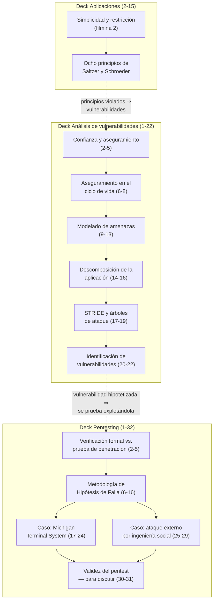

# Clase 08 — Principios de diseño y vulnerabilidades

> **15/10/2026** — jueves, **teoría** · [Filminas — Aplicaciones, sólo 2-15](../../raw/clases/Clase%2007%20-%20Aplicaciones%20-%20Principios%20y%20autenticacion.pdf) · [Filminas — Análisis de vulnerabilidades](../../raw/clases/Clase%2012%20-%20Analisis%20de%20vulnerabilidades.pdf) · [Filminas — Pentesting](../../raw/clases/Clase%2013%20-%20Pentesing.pdf)
> Viene de: [[clase-07-autenticacion|Clase 07 — Autenticación]]
> Sigue en: [[clase-09-flujo-de-informacion|Clase 09 — Flujo de información]]

> **Decisión de catalogación del vault.** El [[cronograma]] llama a la clase del 15/10 *"Principios de diseño y vulnerabilidades"*, y ese contenido no vive en un solo PDF: está repartido en **tres decks** de la cátedra.
>
> | Deck | Qué toma esta nota |
> |---|---|
> | `Clase 07 - Aplicaciones - Principios y autenticacion.pdf` | **Sólo las filminas 2 a 15** — los ocho principios de Saltzer y Schroeder. Las filminas 16-46 son autenticación y las desarrolla [[clase-07-autenticacion|Clase 07 — Autenticación]], que escribe otro agente en paralelo |
> | `Clase 12 - Analisis de vulnerabilidades.pdf` | Las **22 filminas completas** |
> | `Clase 13 - Pentesing.pdf` | Las **32 filminas completas** |
>
> Cada vez que esta nota cita una filmina dice **de qué deck** sale, porque los tres tienen su propia numeración desde la filmina 1.

> **Esta clase todavía no se dictó.** Hoy es **04/09/2026**; el 15/10 falta más de un mes. No hay transcripción de audio y no hay callouts *De la transcripción*: todo lo que sigue está escrito **contra las filminas** de los tres decks, más las notas de video de la cátedra que cubren el mismo contenido en cursadas anteriores. Cuando la clase se dicte va a hacer falta volver sobre esta nota para cotejarla con lo que efectivamente se dijo en voz.

## Mapa de la clase



El recorrido tiene una lógica de encadenamiento que ninguno de los tres decks hace explícita por sí solo, pero que queda clara al leerlos juntos *(lectura nuestra)*: los **principios** son el criterio con el que se debería haber diseñado el sistema; el **análisis de vulnerabilidades** es el proceso para encontrar dónde ese criterio se violó, aunque nadie haya construido nada todavía —sirve tanto en diseño como sobre un sistema ya construido—; y el **pentesting** es la comprobación empírica, contra el sistema real, de que una vulnerabilidad hipotetizada efectivamente se puede explotar. Los tres son estaciones de un mismo proceso de aseguramiento, no temas sueltos.

---

## 1. Los ocho principios de diseño de Saltzer y Schroeder

*Deck Aplicaciones, filminas 2-15.* → Concepto: **[[principios-de-diseno|Principios de diseño]]**

### Antes de los ocho: dos ideas madre (filmina 2)

La filmina de apertura define los principios como **bases que promueven un diseño con resultado un sistema robusto y seguro**: son *"principios guía de alto nivel"*, no recetas cerradas. Descansan sobre dos ideas:

- **Simplicidad** — menos cosas pueden salir mal, menos inconsistencias y zonas no definidas, más fácil de entender y verificar.
- **Restricción** — minimizar el acceso, minimizar la comunicación.

Cada uno de los ocho principios que siguen es, en última instancia, una forma concreta de aplicar una de estas dos ideas —o las dos a la vez—.

> **Hallazgo de cruce con los videos, y conviene tenerlo claro antes de seguir.** Hay **dos** grabaciones de esta clase en la [[videografia|videografía]] de la cátedra: [[video-06-principios-de-diseno-2026|video-06]] (Ramele, 1C-2026) y [[video-07-principios-de-diseno-2024|video-07]] (Ramele, 2024). Sus propias notas ya advertían que son **decks distintos, con ejemplos disjuntos**, y que cinco de los ocho nombres cambian entre uno y otro. Comparando el texto de las filminas 2 a 15 de nuestro deck contra las tablas de ambas notas de video, **el deck vigente para esta cursada (2026 2C) es textualmente el mismo que usó `video-07` en 2024** — mismos nombres en castellano (*Valores iniciales seguros*, *Economía de mecanismos*, *Diseño abierto*, *Separación de privilegios*, *Aceptación psicológica*), mismos ejemplos (`sshd` y el puerto 22, Oracle, el protocolo `finger`, los bancos y las dos firmas, los firewalls personales y `UAC`) y hasta la misma redacción literal de las viñetas. El deck de `video-06` (2026, primer cuatrimestre) es una versión **distinta**, con otros nombres (*Fallar de forma segura*, *Simplicidad*, *Sistema Abierto*, *Segregación de Tareas*, *Menor asombro*), otros ejemplos (el castillo medieval, los LLM, el Threat Modeling Manifesto) y sin bibliografía. *(Verificación nuestra, comparando el texto extraído del PDF contra las dos tablas de nombres que traen las notas de video.)*
>
> La consecuencia práctica: **la nomenclatura y los ejemplos que corresponde estudiar para esta cursada son los de `video-07` y los de esta nota**, porque son los que efectivamente están en el deck que se va a proyectar. `video-06` sigue siendo útil como **complemento**, sobre todo por dos piezas que no están en ningún lado más: la analogía del castillo como mnemotecnia de los ocho principios, y el bloque final sobre seguridad de los LLM. Se citan más abajo, marcadas como lo que son: material de un deck distinto.

### 1.1. Menor privilegio

*Filmina 3, más el ejemplo del web server en la filmina 4.*

> Un sujeto debe recibir **sólo los privilegios necesarios** para completar su tarea. Los privilegios se asignan **por función, no por identidad**. Si una tarea requiere derechos adicionales, se le asignan y se desechan luego de su uso. Muchas veces el sistema operativo o el sistema no posee el nivel de granularidad deseado.

El ejemplo de la propia filmina es el CEO de una compañía: no tiene por qué tener acceso a todos los archivos confidenciales sólo por ser CEO. La cátedra lo desarrolla con un segundo ejemplo, filmina 4, que es el más aprovechable de todo el bloque porque da una lista concreta de qué debería y qué no debería poder hacer un componente real:

| Un web server debería poder | Un web server NO debería poder |
|---|---|
| Leer las carpetas de archivos web | Leer otros archivos |
| Leer sus archivos de configuración | Escribir en otros lugares *(salvo lugares de upload o webdav)* |
| Escribir en sus carpetas de logs, **sólo en modo append** | Sobreescribir logs |

La filmina cierra con una pregunta retórica que es también el mejor resumen del principio: *"¿Alguien vio un web server configurado de esta manera?"* — la lámina sólo formula la pregunta y no la contesta. *(Lectura nuestra de la pregunta.)* Lo que la pregunta deja implícito es que en la práctica casi ningún sistema real cumple esto al pie de la letra, y que el costo de no cumplirlo es que un compromiso parcial (leer un archivo, escribir en un lugar que no debería) se convierte en compromiso total.

Según [[video-07-principios-de-diseno-2024#1. Menor privilegio|video-07]], el docente agrega en voz el límite práctico del principio: el sistema operativo **no siempre tiene la granularidad deseada**, y pedir una granularidad demasiado fina vuelve el esquema inadministrable — si hay que gestionar cada permiso archivo por archivo, el costo operativo termina siendo mayor que el riesgo que se evita. Trae además el caso histórico de **Apache**, que en una época reutilizaba las mismas *system calls* de logueo de Unix que procesos internos del sistema, lo que permitía acceder a información de otros procesos — el mismo caso vuelve en el principio 7, [[#1.7. Mecanismos exclusivos|Mecanismos exclusivos]].

### 1.2. Valores iniciales seguros

*Filmina 5, más el ejemplo de Oracle en la filmina 6.*

> El acceso a cualquier objeto debe ser **denegado por defecto**. Si una acción falla por seguridad, el sistema debe volver al estado de seguridad inicial.

El ejemplo de la filmina 5 es `sshd`: si intenta abrir el puerto 22 y falla, **no** debe abrir otro puerto ni elevar sus privilegios para reintentar — *"si lo hiciese, es probable que se pueda atacar el sistema"*, dice la propia lámina. El de la filmina 6 son las instalaciones antiguas de Oracle, que creaban usuarios administrativos iniciales con claves predefinidas —algunos poco evidentes— y dejaban en manos del administrador la tarea de cambiarlas; los instaladores actuales, en cambio, piden la clave inicial en el momento de instalar.

Es el mismo principio que cierra [[principio-de-kerckhoffs|Kerckhoffs]] desde otro ángulo: en los dos casos, la seguridad no puede depender de que alguien recuerde hacer algo después — tiene que estar resuelta por default.

### 1.3. Economía de mecanismos

*Filmina 7, más el ejemplo del protocolo `finger` en la filmina 8.*

> Los mecanismos de seguridad deben ser **simples**: menos cosas pueden salir mal, se simplifica la verificación (formal e informal), si algo sale mal es más fácil de corregir, y las relaciones de confianza —en entradas y salidas— son más visibles.

El ejemplo del protocolo `finger` (filmina 8) es el más rico técnicamente de todo el bloque de principios: un host podía pedir información de un usuario registrado en otro host, y muchas implementaciones **asumían que la respuesta del servidor estaba bien formada** — un supuesto escondido dentro de la complejidad propia del protocolo. Un servidor malicioso podía generar un mensaje de respuesta infinito, con tres desenlaces posibles: se llenan logs y disco (denegación de servicio), se cae el servicio (denegación de servicio), o directamente un **buffer overflow con ejecución remota de código**. Es el ejemplo canónico de por qué complejidad y confianza implícita son, en el fondo, el mismo problema: cuanta más superficie tiene un mecanismo, más lugares hay donde una asunción no verificada puede esconderse.

### 1.4. Mediación completa

*Filmina 9.*

> **Todos** los accesos a objetos deben ser verificados, incluso si el objeto es accedido varias veces. Puede ir en contra de la eficiencia —no permite usar cachés— y es complejo de implementar: ¿qué ocurre si mientras se está accediendo a un objeto le quitan el permiso a mitad de camino?

Es el principio más corto de exponer y, según [[video-06-principios-de-diseno-2026#4. Mediación completa|video-06]], el más fácil de recordar con una imagen: es literalmente **la puerta del castillo** — no tiene sentido construir todo el muro y dejar un costado sin control. Un matiz que trae [[video-07-principios-de-diseno-2024#4. Mediación completa|video-07]], a partir de una pregunta de alumno, conviene tenerlo anotado porque separa este principio del de economía de mecanismos con el que suele confundirse: **mediación completa no exige un único servidor, exige un único mecanismo**. Dos sectores de una organización con esquemas de administración de usuarios distintos, aunque compartan infraestructura, ya violan el principio.

### 1.5. Diseño abierto

*Filmina 10.*

> La seguridad **no debe depender del secreto del diseño o la implementación**. No significa que deba publicarse el código fuente. Un atacante puede conseguir el algoritmo desensamblando el ejecutable, sobornando o coercionando a un desarrollador, o buscando en desechos. Esto **no aplica a las claves**, sino a los algoritmos. La violación del principio se denomina **"seguridad por oscuridad"**.

Este es, textualmente, el **[[principio-de-kerckhoffs|principio de Kerckhoffs]]** ya desarrollado en el vault desde la Clase 1, extendido de los algoritmos criptográficos a los mecanismos de seguridad en general — es la misma idea, aplicada un nivel de abstracción más arriba. Lo que Kerckhoffs dice sobre un cifrado ("la seguridad debe recaer en la clave, no en ocultar el algoritmo"), este principio lo dice sobre cualquier control de seguridad ("la seguridad debe recaer en el diseño correcto, no en que el adversario no sepa cómo funciona el control").

`video-07` marca este punto explícitamente como pregunta de examen en cursadas anteriores, con la formulación *"lo único que tiene que estar oculto es la clave"*, y agrega el matiz de por qué el principio se volvió más difícil de sostener con las **apps móviles**: con aplicaciones web puras se podía asumir que el atacante no llegaba al código del servidor, pero el código de un cliente móvil corre en un dispositivo que el atacante controla físicamente, así que hay que asumir que va a poder decompilarlo y modificarlo — en Android es relativamente fácil por cómo opera la máquina virtual; en iOS, algo más difícil por la compilación nativa.

`video-06` agrega, desde su propio deck, dos matices que no están en el nuestro pero que vale la pena tener en cuenta *(lectura nuestra sobre material de un deck distinto)*: primero, que la ofuscación **no está prohibida**, sólo no puede ser el cimiento de la seguridad — es una capa más que compra tiempo, no una base; segundo, la idea de que **"los bits son eternos"**: todo secreto digitalizado puede terminar filtrado tarde o temprano, así que la política razonable no es evitar digitalizar, sino decidir con conciencia hasta qué grado de exposición se acepta.

### 1.6. Separación de privilegios

*Filmina 11, más el ejemplo bancario en la filmina 12.*

> Un sistema no debe otorgar permisos basado en **una sola condición**. Se refiere a la asignación de permisos, y busca evitar que un sujeto pueda obtener privilegios y usarlos sin control. De ahí se derivan la **separación de tareas** y la **defensa en profundidad**.

El ejemplo de la filmina 12 es doble: los bancos requieren **dos firmas** para aprobar transacciones electrónicas por encima de cierto monto, y algunos sistemas **no permiten que un administrador modifique los permisos de otro administrador** — el administrador es tope en cuanto a sus propios permisos, pero no puede tocar los de sus pares. `video-07` agrega el ejemplo más aplicable a desarrollo: quien administra el servidor de deploy o de staging no debería ser la misma persona que desarrolla, y quien desarrolla no debería administrar la base de datos de producción — con la salvedad, honesta, de que en una empresa chica esto casi nunca se cumple.

Vale la pena anotar la tensión que un alumno le señala al docente en `video-06`, porque es exactamente el tipo de pregunta que un parcial puede plantear: **este principio contradice el de economía de mecanismos** — dos aprobadores es objetivamente más complejo que uno—, y la respuesta que da la cátedra es aceptarlo de plano: **los ocho principios no son consistentes entre sí, se balancean caso por caso.** No hay una jerarquía que resuelva el conflicto de antemano.

### 1.7. Mecanismos exclusivos

*Filmina 13.*

> Los mecanismos de seguridad **no deben compartirse**: puede fluir información entre variables compartidas, y pueden generarse canales ocultos. El principio promueve **aislación** — máquinas virtuales, *sandboxing*.

Es el principio que más conecta con el bloque siguiente de esta misma clase: un mecanismo de seguridad reutilizado para otra cosa es exactamente el tipo de hallazgo que la [[#9. Metodología de Hipótesis de Falla|metodología de hipótesis de falla]] busca en el paso de recolección de información —el flag reusado para dos propósitos es uno de los "puntos calientes" que señala `video-09`—. `video-07` retoma acá el caso de Apache del principio 1 y suma el ejemplo del **sandbox de iOS**: el sistema operativo le presenta a cada proceso su propia versión del hardware y del entorno, y el área de archivos a la que accede es exclusiva de ese proceso — si se compromete, se compromete sólo eso, no el resto de las aplicaciones.

### 1.8. Aceptación psicológica

*Filmina 14, más el ejemplo de firewalls personales y Windows Vista `UAC` en la filmina 15.*

> Los mecanismos de seguridad **no deben dificultar el acceso al recurso**. Esto en general es muy difícil o imposible de lograr sin ocultar el mecanismo: hay que simplificar instalación y configuración, y evitar la necesidad de conocimientos técnicos.

El ejemplo de la filmina 15 es doble: los **firewalls personales**, que exigen que el usuario identifique redes como internas o externas y decida cuándo una aplicación puede actuar como servidor —decisiones que la mayoría de los usuarios no está en condiciones técnicas de tomar—, y **Windows Vista `UAC`**, donde cada operación privilegiada mostraba una ventana pidiendo autorización explícita. `video-07` agrega el contexto histórico que explica por qué Vista llegó a ese extremo: antes de Vista, Windows tenía un historial de seguridad muy débil por estrategia de negocio y *time to market* —los componentes `COM` y `ActiveX` se instalaban solos, con acceso total al sistema, por el sólo hecho de visitar una página web—, y Vista **sobrecorrigió** hasta un punto en que el sistema se volvió tedioso de usar. Es el caso de manual del principio: un mecanismo técnicamente correcto que fracasa por rechazo del usuario.

`video-06` aporta, sobre este mismo principio pero desde su propio deck, la observación más citable de todo el bloque *(material de un deck distinto, marcado como tal)*: **los empleados más eficientes suelen ser los peores usuarios de seguridad**, precisamente porque son los que mejor saben moverse por la burocracia interna y encontrarle la vuelta a cualquier restricción que les estorbe para resolverle el problema al cliente. La respuesta no es bajar la seguridad, sino capacitar y transmitir que sostenerla es parte del trabajo de todos.

---

## 2. Confianza y aseguramiento

*Deck Análisis de vulnerabilidades, filminas 2-5.* → Concepto: **[[confianza-y-aseguramiento|Confianza y aseguramiento]]**

La filmina 2 define los dos términos que van a sostener todo el resto del bloque:

| Término | Definición de la filmina |
|---|---|
| **Sistema confiable** | Cuenta con **suficiente evidencia creíble** para que se crea que va a cumplir un conjunto de requerimientos. **La confianza no es una escala discreta** — es gradual, no un sí o no |
| **Aseguramiento** | La **confianza obtenida a través de técnicas específicas**: es la justificación de por qué se confía |

La filmina remata con una advertencia explícita: **estos conceptos no aplican sólo a seguridad**. Según [[video-08-vulnerabilidades#Confianza y aseguramiento|video-08]], el docente desarrolla esta idea diciendo que la seguridad informática le copia mucho a la seguridad financiera: certificaciones, estandarización de procesos, auditorías de terceros, requisitos regulatorios para empresas que cotizan en bolsa.

La filmina 3 da **cuatro vías para establecer confianza**: procesos de aseguramiento, adhesión a estándares, documentación y **revisión por expertos**. Alrededor de esa lista la lámina dibuja, exactamente: una flecha rotulada *"Lleva a"* que sale de *Procesos de aseguramiento* y entra en una llave que agrupa *Documentación* y *Revisión por expertos*; una segunda llave que abarca los cuatro ítems, a la que llega una flecha rotulada *"Es más efectiva si existen"*; y dos cajas, *"Costosos"* y *"Complejos"*, a las que apuntan sendas flechas diagonales. Los orígenes de esa última flecha y de las dos diagonales **no están anclados a ningún ítem**: arrancan en espacio en blanco, a la derecha y por debajo del bloque de viñetas.

*(Lectura nuestra del diagrama.)* Puestos juntos, esos trazos se leen así: la revisión por expertos es **la más efectiva** cuando ya existen las otras tres vías, y a la vez la más costosa y la más compleja — no reemplaza a las demás, las corona. Es una lectura, no algo que el diagrama rotule: con los orígenes sin anclar, quién es el sujeto de *"Es más efectiva si existen"*, de *"Costosos"* y de *"Complejos"* queda a cargo de quien mira la lámina.

La filmina 4 encadena tres niveles, y es la que la cátedra más repite según el video:

$$\text{Política} \;\longrightarrow\; \text{Aseguramiento} \;\longrightarrow\; \text{Mecanismo}$$

| Nivel | Qué es |
|---|---|
| **Política** | Requerimientos que definen **explícitamente** las expectativas de seguridad |
| **Aseguramiento** | Justificación de que el mecanismo sigue la política, **a través de evidencia** |
| **Mecanismo** | Ejecutables diseñados e implementados para hacer cumplir las políticas |

> **Errata de la filmina:** el renglón de *Mecanismo* dice literalmente *"Ejecutables diseñados e implementados para cumplir hacer cumplir las políticas"* —duplicación defectuosa de "cumplir"—, confirmado renderizando la página 4 del deck a 150 dpi. Arriba va con la lectura corregida.

El punto que `video-08` marca como el más importante de este tramo: **decir que algo es seguro sin ofrecer evidencia es, en sí mismo, una señal de alarma.** El ejemplo que trae es el de un sistema de voto electrónico cuyo responsable afirmaba que era "totalmente seguro" sin mostrar un solo documento que lo sostuviera.

La filmina 5 clasifica la **evidencia** en tres niveles: **informal** (enunciados, analogías), **semiformal** (pseudocódigo, análisis caso por caso) y **formal** (métodos matemáticos, lenguajes formales de demostración de teoremas). Según el video, la cátedra aclara que probar formalmente una pieza de código sólo se justifica en criticidad extrema —el ejemplo que da es un riesgo de explosión nuclear—, porque el costo de la verificación formal crece mucho más rápido que el del resto del desarrollo. Es la misma idea que retoma, con más detalle, la sección de [[#8. Verificación formal contra prueba de penetración|verificación formal]] del deck de Pentesting.

---

## 3. Aseguramiento en el ciclo de vida

*Deck Análisis de vulnerabilidades, filminas 6-8.* → Concepto: **[[aseguramiento-en-el-ciclo-de-vida|Aseguramiento en el ciclo de vida]]**

La filmina 6 lista **nueve fuentes de problemas**, atribuidas por la propia lámina a *"Peter Newman"* —casi con certeza **Peter G. Neumann**, el editor del *RISKS Digest* *(identificación nuestra)*, aunque la filmina no da más datos que el apellido—:

1. Requerimientos incompletos, incorrectos o faltantes
2. Fallos en el diseño
3. Fallos en la implementación del hardware
4. Fallos en la implementación del software
5. Errores de uso por errores de operación
6. Uso indebido del sistema
7. Fallos de los equipos o del medio de comunicación
8. Casos de fuerza mayor, desastres
9. Errores al actualizar, mantener o decomisar

Según `video-08`, la cátedra las une con una idea simple: todas comparten la misma naturaleza —son *bugs*—, y un bug se convierte en **vulnerabilidad** en el momento en que se lo puede explotar contra un objetivo de seguridad. Es el primer eslabón de la cadena que retoma la sección siguiente.

La filmina 7 sostiene que el aseguramiento **abarca todas las etapas** del ciclo de vida, y se adapta a cualquier metodología de desarrollo:

| Etapa | Se traduce en |
|---|---|
| Requerimientos | Análisis de amenazas, formación de políticas |
| Diseño | Modelo de seguridad |
| Implementación | Consistencia y trazabilidad |
| Mantenimiento | Control y configuración |

La consecuencia que la cátedra machaca, según el video, es **no dejar la seguridad para el final del proyecto** — con Internet como ejemplo de una infraestructura entera de protocolos que originalmente no traían ninguna consideración de seguridad incorporada, y que hoy se parchea capa sobre capa.

La filmina 8 define **amenaza** y la distingue explícitamente de **vulnerabilidad**, que es la distinción que más vale la pena memorizar de todo este bloque porque se confunde constantemente:

> **Amenaza:** evento potencial que tiene como consecuencia un efecto no deseado en el sistema. **No son vulnerabilidades** — una vulnerabilidad **permite** que ocurra una amenaza.

Y clasifica las amenazas por **consecuencia**: pérdida de confidencialidad, pérdida de integridad, denegación de servicio. Según `video-08`, esta filmina se acompaña de una cadena que no está literalmente dibujada como tal en el PDF pero que el docente arma verbalmente a partir de sus cuatro cajas:

$$\text{Bug} \;\longrightarrow\; \text{Vulnerabilidad (debilidad)} \;\longrightarrow\; \text{Amenaza} \;\longrightarrow\; \text{Efecto no deseado}$$

---

## 4. Modelado de amenazas

*Deck Análisis de vulnerabilidades, filminas 9-13.* → Concepto: **[[modelado-de-amenazas|Modelado de amenazas]]**

El modelado de amenazas **documenta los aspectos de seguridad que interesan en el sistema**: las políticas del sistema deben eliminar todas las amenazas documentadas. La filmina 9 da tres **perspectivas** posibles para armarlo, que no son excluyentes:

- **Centrado en el atacante** — explota los objetivos de un atacante.
- **Centrado en el software** — explota tipos de ataques a componentes.
- **Centrado en productos** (*assets*) — explota ataques a productos o servicios.

La filmina 10 da entradas y salidas del proceso: **entradas** — conocimiento de la función primaria de la aplicación, casos de uso e historias, flujo de datos y modelos entidad-relación, diagramas de despliegue; **salidas** — lista de amenazas y lista de vulnerabilidades. Según `video-08`, el docente resalta que el conocimiento de la función primaria es la entrada **más importante** de las cinco: sin entender qué hace el sistema en su núcleo no hay forma de saber qué amenazas importan de verdad.

La filmina 11 es un diagrama, tomado de un artículo de Microsoft en `msdn.microsoft.com` y reproducido por la cátedra sin modificaciones, que organiza todo el proceso como un **ciclo de cinco pasos**:


| Paso | Nombre | Qué pide |
|---|---|---|
| 1 | **Identify Security Objectives** | Confidencialidad, integridad, disponibilidad; partir de los objetivos del sistema y considerar límites — la pregunta guía es **qué es lo que NO se quiere que pase** |
| 2 | **Application Overview** | Esquematizar el despliegue (topología, capas, componentes críticos, protocolos), identificar roles y sus casos de uso, identificar tecnologías, identificar mecanismos de seguridad ya presentes |
| 3 | **Decompose Application** | Identificar dónde cambia el nivel de confianza requerido, y el flujo de datos entre esas zonas — ver [[#5. Descomposición de la aplicación\|§5]] |
| 4 | **Identify Threats** | A partir de listas recurrentes o derivando amenazas mediante preguntas — ver [[#6. STRIDE y árboles de ataque\|§6]] |
| 5 | **Identify Vulnerabilities** | Revisar las zonas del paso 3 buscando lo que efectivamente permite que las amenazas del paso 4 ocurran — ver [[#7. Identificación de vulnerabilidades\|§7]] |

El paso 1 arranca el ciclo; los pasos 2 a 5 se retroalimentan entre sí como un proceso iterativo, no lineal — el propio diagrama lo dibuja como un círculo con flechas de ida y vuelta hacia el paso 1.

Las filminas 12 y 13 desarrollan los pasos 1 y 2 con más detalle. La filmina 12, **identificar objetivos de seguridad**: los objetivos apuntan a garantizar confidencialidad, integridad y disponibilidad; hay que partir de los objetivos del sistema y considerar límites explícitamente — de nuevo, **qué es lo que NO se quiere que pase**. La filmina 13, **conceptualizar la aplicación**: esquematizar el escenario de despliegue (determinar topología y capas, componentes críticos, servicios críticos e interfaces externas, protocolos), identificar roles y sus casos de uso claves, identificar tecnologías (sistema operativo, web server, servidor de base de datos, lenguaje de programación, *frameworks*), e identificar los mecanismos de seguridad ya existentes.

---

## 5. Descomposición de la aplicación

*Deck Análisis de vulnerabilidades, filminas 14-16.* → Concepto: **[[descomposicion-de-la-aplicacion|Descomposición de la aplicación]]**

La filmina 14 introduce el **Web App Security Frame**: diez áreas que sirven como lista de verificación al modelar una aplicación web — validación de entradas y datos, autenticación, autorización, administración de configuración, datos sensitivos, manejo de sesión, criptografía, manipulación de parámetros, manejo de excepciones, y auditoría y logs.

La filmina 15 pide identificar **zonas donde cambia el nivel de confianza requerido**:

- **Zonas externas** — acceso al sistema de archivos del servidor, acceso a la base de datos, acceso a web services.
- **Zonas privilegiadas** — partes accesibles sólo para un rol particular.

Los ejemplos de la propia filmina son elocuentes: la frontera entre internet e intranet, entre el web server y el db server, y —el que más rinde como ejemplo de examen— el **reporte de sueldos** como zona reservada a managers. `video-08` extiende la idea a contratos con otras empresas y listas de precios: cualquier información cuya divulgación interna descontrolada sea un problema es, por definición, una zona privilegiada.

La filmina 16 pide identificar el **flujo de datos** entre esas zonas, siguiendo la información desde su ingreso hasta su salida y marcando los puntos relevantes. La estrategia que recomienda es **refinar por niveles**: primero el flujo por capas (`browser` / `web` / `middle` / `db` / `filesystem`), luego entre páginas, luego entre componentes — ir de lo grueso a lo fino, no al revés.

---

## 6. STRIDE y árboles de ataque

*Deck Análisis de vulnerabilidades, filminas 17-19.* → Concepto: **[[stride-y-arboles-de-ataque|STRIDE y árboles de ataque]]**

La filmina 17 da **dos formas** de identificar amenazas: comenzar con una lista de amenazas recurrentes, o derivar amenazas mediante preguntas — y remite al propio Web App Security Frame de Microsoft (`ms978518.aspx`) como catálogo de amenazas, ataques y contramedidas recurrentes por cada aspecto de una aplicación web.

La filmina 18 es la clasificación **`STRIDE`**, con la instrucción de uso escrita en la propia lámina: *"preguntar, por cada trust boundary, cómo un atacante puede intentar cumplir cada una de estas amenazas"*. No es una lista para memorizar sin más: es un cuestionario que se aplica sistemáticamente en cada frontera de confianza identificada en el paso anterior.

| Letra | Amenaza | Glosa (según `video-08`) |
|---|---|---|
| **S** | Spoofing | Hacerse pasar por otro |
| **T** | Tampering | Alterar algo de una manera no prevista por el diseño — ejemplo del video: fraude bancario en cajeros automáticos |
| **R** | Repudiation | Negar haber hecho algo; se contrarresta **firmando** |
| **I** | Information disclosure | Divulgación de información que debería quedar confinada a una zona *(lectura nuestra: `video-08` no la glosa en audio, sólo lista el nombre en la filmina)* |
| **D** | Denial of Service | Amenaza a la **supervivencia** del sistema |
| **E** | Elevation of privilege | Conseguir más permisos de los autorizados |

La filmina 19 introduce los **árboles de ataque** como herramienta para explorar amenazas: identifican las acciones y condiciones necesarias para que una amenaza se cumpla. El ejemplo de la propia lámina:

```
Amenaza: un atacante obtiene credenciales de autenticación monitoreando la red
  1 — Las credenciales se envían en plano, Y
  2 — El atacante puede capturar los paquetes que se transmiten
      2.1 — El atacante reconoce las credenciales
```

La advertencia que cierra la filmina, con signo de exclamación en el original: **estos árboles pueden crecer considerablemente — concentrarse sólo en los aspectos esenciales que agreguen valor.** Es una advertencia de alcance más que una regla técnica: un árbol de ataque exhaustivo para un sistema real es, en la práctica, inabarcable.

---

## 7. Identificación de vulnerabilidades

*Deck Análisis de vulnerabilidades, filminas 20-22.* → Concepto: **[[identificacion-de-vulnerabilidades|Identificación de vulnerabilidades]]**

La filmina 20 cierra el proceso de la manera más económica posible: **revisar las zonas que se derivan del análisis anterior**, con el objetivo ahora puesto en encontrar las vulnerabilidades concretas que permiten que las amenazas identificadas en `STRIDE` efectivamente ocurran. Es el paso 5 del ciclo de Microsoft de la [[#4. Modelado de amenazas|§4]], y la filmina no le agrega mucho más que esa definición — el trabajo real de este paso es específico de cada sistema.

La filmina 21 trae el único ejemplo desarrollado de todo el deck, y lo hace con arquitectura y todo:

> Sistema que registra el historial médico de un paciente. Permite a médicos consultar el historial durante la consulta y agregar nuevas entradas; permite a un paciente acceder a su propio historial.


La arquitectura de referencia conecta un **browser** contra un **firewall**, que da a un **web server** con su propio **filesystem**, y éste contra una **base de datos**. La filmina cierra con la instrucción metodológica más importante del bloque de vulnerabilidades: **modelar amenazas al nivel de detalle que corresponda según la información disponible** — no tiene sentido, ni es posible, modelar con el mismo detalle un sistema del que sólo se tiene un diagrama de alto nivel que uno del que se dispone del código fuente completo.

La filmina 22, que cierra el deck, es **lectura recomendada**: el capítulo 18 y el capítulo 19 de *Computer Security: Art and Science* de Matt Bishop, y el artículo de *Threat Modeling* del Microsoft patterns & practices Developer Center. En el mapeo de capítulos de la [[bibliografia#2. Matt Bishop — Computer Security: Art and Science|bibliografía]] del vault, esos números corresponden a *Introduction to Assurance* (cap. 19) y *Building Systems with Assurance* (cap. 20) en la edición que está en `raw/` — la numeración de la filmina, igual que en los decks de principios de diseño, parece seguir otra edición del libro. *(Lectura nuestra, sin verificar contra el original de la filmina de esta edición del deck.)*

---

## 8. Verificación formal contra prueba de penetración

*Deck Pentesting, filminas 2-5.* → Concepto: **[[verificacion-formal-y-prueba-de-penetracion|Verificación formal y prueba de penetración]]**

Este bloque abre el deck de Pentesting con una distinción conceptual que vale la pena tener resuelta antes de entrar en la metodología, porque los dos procesos se parecen mucho en la superficie y difieren en algo fundamental.

La filmina 2, **verificación formal**: es la **verificación matemática de que un sistema cumple con ciertas restricciones**.

$$\text{Precondiciones y Entradas} \;\longrightarrow\; \mathrm{Op}_1 \ldots \mathrm{Op}_n \;\longrightarrow\; \text{Poscondiciones}$$

- **Precondiciones** — hipótesis sobre el estado del sistema.
- **Poscondiciones** — resultado de aplicar las operaciones del sistema a un input dado.
- **Requerimiento** — que las poscondiciones cumplan las restricciones.

La filmina 3, **prueba de penetración**, se escribe deliberadamente con la misma estructura para que el contraste salte a la vista:

- **Precondiciones** — hipótesis sobre el estado del sistema **y la existencia de una vulnerabilidad**.
- **Poscondiciones** — **sistema comprometido**.
- **Ejecución** — aplicar pruebas para intentar mover al sistema del estado inicial al estado comprometido.

La filmina 4, **similitudes y diferencias**, es la que hay que entender de memoria:

| | Verificación formal | Prueba de penetración |
|---|---|---|
| Prueba **existencia** de vulnerabilidades | Sí | Sí |
| Prueba **ausencia** de vulnerabilidades | Sí — pero para eso debe incluir **todos** los factores externos, cosa que en la práctica no ocurre: se prueba ausencia en un algoritmo, programa o ambiente acotado, ignorando instalación y uso | **No, nunca** |

Según [[video-09-pentesting-metodologia#3. Verificación formal versus prueba de penetración|video-09]], la razón por la que la verificación formal no reemplaza al pentest en la práctica es que verificar una pieza de código con pre y poscondiciones es **equivalente al problema `SAT`** —satisfacibilidad booleana—, que es `NP`-completo: escala mal frente al ritmo al que crece el software, y por eso se reserva a código de criticidad extrema, como el chip de control de un misil o de una central nuclear. El video trae también la anécdota, no presente en ninguna filmina, del misil cuyo código alocaba memoria sin liberarla nunca: lo que a primera vista parecía un bug trivial resultó ser una decisión de diseño deliberada, porque el tiempo hasta que la fuga se volviera un problema real era mucho mayor que el tiempo de vida promedio del misil. Es el mejor ejemplo del corpus de por qué las precondiciones de un sistema son parte del diseño y no un detalle accesorio.

La filmina 5, **objetivos**: probar la eficacia de los controles de seguridad de un sistema intentando violar la política de seguridad, requiriendo ejecutar técnicas similares a las de un atacante — de ahí el nombre **`ethical hacking`**. Es análogo a las pruebas manuales de un sistema y **no reemplaza un buen diseño e implementación**; y, a diferencia de la verificación formal, **prueba al sistema como un todo**, no sólo sus aspectos técnicos — lo que incluye a las personas y a los procesos, y es la razón última de por qué el [[#10.2. Caso: ataque externo por ingeniería social|caso de ingeniería social]] de más abajo pertenece a esta misma metodología.

---

## 9. Metodología de Hipótesis de Falla

*Deck Pentesting, filminas 6-16.* → Concepto: **[[metodologia-de-hipotesis-de-falla|Metodología de hipótesis de falla]]**

### 9.1. Metodología informal, y los cinco pasos

La filmina 6, **metodología (informal)**, da el trazo grueso antes de entrar en el detalle: determinar y cuantificar objetivos (por ejemplo, obtener información de clientes); encontrar cierta cantidad de vulnerabilidades, o buscarlas durante un período de tiempo acotado —el estudio siempre se conduce desde el punto de vista de un atacante—; y estudiar y categorizar los hallazgos, porque **el éxito de una prueba de penetración proviene del análisis de los hallazgos**, no de la cantidad de vulnerabilidades encontradas: permite detectar problemas recurrentes y enfocarse sistemáticamente en familias enteras de problemas.

La filmina 7 es, según `video-09`, la que más vale la pena memorizar de toda la clase — el docente la marca como *take home message* según la nota de ese video. Son cinco pasos:

| # | Paso | Qué produce |
|---|---|---|
| 1 | **Recolección de información** | Un modelo del sistema y sus partes, para conocerlo y entender su funcionamiento |
| 2 | **Hipótesis** | Asumir la existencia de vulnerabilidades concretas |
| 3 | **Prueba** | Probar las vulnerabilidades hipotetizadas |
| 4 | **Generalización** | Generalizar patrones y encontrar otras vulnerabilidades del mismo tipo |
| 5 | **Eliminación** *(opcional)* | Determinar los pasos necesarios para eliminarlas |

Vale la pena remarcar, siguiendo a `video-09`, qué significa una **hipótesis** en este esquema: no es una sospecha genérica ("este sistema puede tener problemas"), es una afirmación falsable sobre una vulnerabilidad puntual — el ejemplo que da el video es *"este sistema tiene un endpoint contra el RENAPER con usuario y contraseña hardcodeados en el código"*.

### 9.2. Paso 1 — Recolección de información

Filminas 8-9. Componer un modelo del sistema y sus partes: buscar discrepancias, revisar interfaces. Es necesario **conocer bien el sistema** —usando documentación de diseño y manuales, cuando estén disponibles, buscando especialmente secciones poco especificadas o ambiguas, y viendo el manejo de privilegios y los tipos de cuenta— y también **el ambiente**: nombres de usuarios y servidores, estructura de red.

La filmina 9, **punto de partida**, identifica la información inicial con la que cuenta el equipo y da tres **niveles incrementales** de atacante:

| Nivel | Atacante | Cuándo se ignora |
|---|---|---|
| 1 | Externo, **sin** conocimiento del sistema | Durante el diseño |
| 2 | Externo, **con** conocimiento del sistema | En sistemas con registro abierto |
| 3 | Con acceso al sistema | — |

Este esquema de niveles es, según señala `video-09`, análogo al [[modelos-de-ataque|modelo de adversario criptográfico]] del Bloque 1: en los dos casos, la fuerza de la prueba depende de cuánta información inicial se le concede al atacante, y probar contra un atacante de nivel bajo no dice nada sobre la seguridad frente a uno de nivel alto.

### 9.3. Paso 2 — Hipótesis

Filminas 10-11. **Buscar posibles vulnerabilidades** por tres vías:

- **Examinando políticas y procedimientos** — buscar inconsistencias, y buscar inconsistencias **entre** políticas y mecanismos; los procedimientos pueden no cumplirse en la práctica.
- **Examinando implementaciones** — usar modelos de vulnerabilidades, revisar vulnerabilidades comunes o conocidas, usar los manuales para exceder límites u omitir pasos de secuencias documentadas.
- **Examinando mecanismos** — pueden estar mal implementados, el ambiente donde corren puede introducir errores, o pueden directamente no ser seguros — y **comparando con otros sistemas**, bajo la premisa de que sistemas parecidos tienen problemas parecidos.

El resultado de este paso es una **lista de posibles vulnerabilidades**. `video-09` desarrolla el ejemplo del post-it con la contraseña pegado a la pantalla como caso clásico de la primera vía, con una lectura que vale la pena retener: el post-it existe porque la persona **tiene un objetivo diario** que cumplir, y si no recuerda la contraseña, no lo cumple — la política falla porque compite con la productividad, no por ignorancia del usuario.

### 9.4. Paso 3 — Prueba

Filminas 12-13. **Priorizar** la lista de posibles vulnerabilidades, por lo general según el nivel de acceso requerido, y **definir cómo probar** la existencia de cada una:

- La **mejor manera** es analizar documentación o comportamiento.
- **Intentar explotarla es el último recurso**, y el menos eficiente — con la **excepción del pivoting**, que se ve enseguida.
- El test se diseña para ser **lo menos intrusivo posible**: algunas vulnerabilidades pueden denegar el servicio si se las prueba mal.
- El proceso normal es resguardar los datos de todo el sistema, documentar los requerimientos para detectar la vulnerabilidad, e intentar detectarla.
- **La prueba DEBE SER REPETIBLE**, en mayúsculas en la propia filmina.

**Pivoting** (filmina 14): es probable que la existencia de una vulnerabilidad provea más información —por ejemplo, acceso al sistema operativo—, y con eso hay que volver a la fase de recolección. *Pivoting* es el uso de un punto de acceso ya comprometido para continuar el ataque: se compromete el firewall y desde ahí se sigue atacando la red interna.

### 9.5. Pasos 4 y 5 — Generalización y eliminación

Filminas 15-16. **Generalización**: a medida que las pruebas resultan exitosas emergen patrones, y a veces **dos vulnerabilidades combinadas constituyen un problema grave** — el ejemplo de la propia filmina es una cuenta invitado habilitada que permite conexión remota, sumada a un buffer overflow local que da derechos de administrador; ninguna de las dos por separado es tan grave como las dos juntas. La filmina lo marca como **la parte más importante de la prueba**.

**Eliminación** (opcional): por lo general sólo se incluyen recomendaciones, porque quien ejecuta la prueba no suele ser quien diseñó o desarrolló el sistema. Es importante que quede claro el contexto, los detalles y el mecanismo de explotación, para poder corregir el sistema, para poder impedirlo o monitorearlo mientras tanto, y para poder verificar si fue explotado en el pasado.

---

## 10. Casos de prueba de penetración

*Deck Pentesting, filminas 17-29.* → Concepto: **[[casos-de-prueba-de-penetracion|Casos de prueba de penetración]]**

Son los dos ejemplos completos del deck, y lo más concreto de toda la clase — la metodología de la [[#9. Metodología de Hipótesis de Falla|§9]] aplicada paso a paso, primero contra un sistema operativo y después contra una empresa entera.

### 10.1. Caso: Michigan Terminal System

*Filminas 17-24.*

Sistema operativo que corre en mainframes **IBM 360/370**. **Objetivo de la prueba**: obtener acceso a las estructuras de control del sistema. **Nivel inicial**: cuenta autorizada, nivel 3 —el más alto de los tres de la [[#9.2. Paso 1 — Recolección de información|§9.2]]—. La filmina 17 aclara en un recuadro que **esta prueba de penetración contaba con la aprobación de los administradores**: no es un ataque encubierto, es un pentest autorizado.

**Paso 1 — Recolección** (filminas 18-20). Al correr un programa, la memoria se divide en segmentos:

| Segmentos | Contenido | Qué puede hacer el proceso |
|---|---|---|
| 0 a 4 | Supervisor, programas de sistema y estado | **Nada** — protegidos por mecanismos de **hardware** |
| 5 | Área de trabajo del sistema, con la información de privilegio del proceso | **No puede alterarla**; en modo usuario ni siquiera se mapea a su espacio de direcciones |
| 6 en adelante | Información del proceso | Puede **modificarla libremente** |

El proceso corre en **modo usuario** y realiza *system calls*, que corren en **modo sistema**. El código de la *system call* revisa los parámetros — en particular, que los punteros pertenezcan a zonas accesibles por el proceso—. Los parámetros se construyen como una **lista de direcciones en el segmento del usuario**, y la lista se pasa como una dirección en un registro.

**Paso 2 — Hipótesis** (filmina 21). La pregunta que dispara todo el ataque: **¿qué ocurriría si la dirección de un parámetro apunta a la lista misma de parámetros?** Sin controles extra, algún *system call* podría escribir en la dirección del parámetro **después de haber pasado la validación** — y si se puede controlar qué valor se escribe ahí, sería posible leer o escribir cualquier zona del segmento 5.

**Paso 3 — Prueba** (filminas 22-23). Hace falta un *system call* que use esa convención de llamada, tenga al menos dos parámetros y altere uno de ellos con un valor controlable. El elegido es **`line input`**, que lee una línea de texto y retorna su **número de línea** y su **longitud**.

- **Setup**: hacer que la dirección donde se almacenará el *número de línea* sea la dirección de la *longitud de línea*.
- **Ejecución**: (1) el *system call* valida los parámetros — todos pertenecen al segmento del proceso, así que pasa la validación; (2) ejecuta *read input line*; (3) el número de línea se guarda según la lista de parámetros, **reescribiendo la dirección del otro parámetro**; (4) la longitud se guarda escribiendo el valor **en el segmento 5**.

**Paso 4 — Generalización** (filmina 24). No se puede escribir en los segmentos 0 a 4, protegidos por hardware. Pero en el segmento 5 vive el **nivel de privilegio** del proceso, que determina si puede hacer llamadas de **nivel supervisor** en lugar de *system calls* — y una función de nivel supervisor **apaga la protección por hardware**. **Conclusión**: la vulnerabilidad permite modificar cualquier dirección de cualquier segmento, es decir, controlar completamente la computadora. Escribir dos bytes en el lugar correcto termina en control total: ése es el punto del ejemplo, y la razón por la que la generalización es, según la filmina 15, la parte más importante de toda la prueba.

### 10.2. Caso: ataque externo por ingeniería social

*Filminas 25-29.*

**Objetivo**: determinar si las medidas de seguridad de una empresa eran efectivas para evitar que un atacante ingrese al sistema. **El test se enfoca en políticas y procedimientos, tanto técnicos como no técnicos** — no hay una sola línea de código en todo este caso, y es exactamente el contrapeso del anterior.

**Paso 1 — Recolección** (filminas 26-27). Búsqueda en internet de nombres de empleados y directores; teléfono de la sucursal local, y a través de ella, el **reporte anual** —público, porque la empresa cotizaba en bolsa—. Con eso se reconstruyen partes del organigrama, nombres de proyectos y quién trabaja en cada uno. El tester se hace pasar por un **nuevo empleado** y aprende que, para enviar cualquier documento, hacen falta un **número de empleado** y un **centro de costos**. Llama entonces a la secretaria del director sobre el que más información había recabado, **dos veces**: primero haciéndose pasar por un empleado, para conseguir el número de empleado del director; después haciéndose pasar por un auditor, para conseguir el centro de costos. Con esos dos datos, solicita que se envíe el listado completo de empleados a una consultora externa.

**Paso 2 — Hipótesis** (filmina 28). *Los empleados nuevos no conocen todos los procesos y controles: es posible que un nuevo empleado brinde información sensitiva.*

**Paso 3 — Prueba** (filmina 29). El tester llama a Recursos Humanos **impersonando a la secretaria de un director**: se queja de que no le informaron de los nuevos ingresos y los pide, y obtiene los nombres. Después llama a cada uno de esos nuevos empleados, **haciéndose pasar por un operador del centro de cómputos**, y les da un "entrenamiento de seguridad" por teléfono — durante el cual obtiene tipos de sistemas usados, número de usuarios, *logins* y contraseñas.

Según [[video-09-pentesting-metodologia#6. Ejemplo resuelto: ataque externo por ingeniería social|video-09]], este es el caso que la cátedra usa para asentar la idea de dónde ocurren los ataques reales hoy: *"difícilmente haya scams actuales que sean simplemente por romper un esquema criptográfico"* — la ingeniería social, no la ruptura de un algoritmo, es el vector más común en la práctica.

---

## 11. Validez de las pruebas de penetración — para discutir

*Deck Pentesting, filminas 30-32.* → Concepto: **[[validez-de-las-pruebas-de-penetracion|Validez de las pruebas de penetración]]**

El deck cierra con dos filminas de discusión abierta, escritas explícitamente como preguntas y no como doctrina cerrada — esta nota las plantea de la misma manera, sin adelantar una respuesta única, porque ésa es la forma en que la propia filmina las deja.

**Filmina 30 — ¿Cuán válidos son los tests de penetración?**

- No sustituyen una buena especificación, diseño, implementación y pruebas.
- Es una técnica importante para probar un sistema **luego de ser instalado** — idealmente no sería necesario, pero en la práctica sí lo es.
- Encuentra problemas introducidos por la **interacción del sistema con los usuarios y el ambiente**, que suelen quedar fuera del análisis y las pruebas normales.

**Filmina 31 — ¿Qué determina la calidad de una prueba de penetración?**

- La metodología de hipótesis de fallas **depende de la capacidad de los testers para formular hipótesis** — no hay garantía de cobertura si el tester no es bueno formulando hipótesis.
- **No provee una forma sistemática** de revisar un sistema.
- **Los resultados de un test sirven sólo marginalmente para otros** — cada test es un mundo aparte, aunque existan herramientas que automatizan algunos aspectos de una prueba, nunca todos.

`video-09` documenta una tensión que un alumno le señala al docente en su propia grabación y que vale la pena tener presente al discutir esta filmina: si el paso 4 de la metodología se llama **generalización**, ¿cómo puede ser que los resultados sirvan sólo marginalmente para *otros* tests? La resolución que da la cátedra en ese video es que **la generalización opera dentro del mismo sistema** —pivoteando desde una vulnerabilidad ya explotada hacia sus derivaciones, buscando dónde se replica el mismo problema— y no generaliza nada **hacia afuera**, hacia otros sistemas distintos. Es una aclaración útil para no leer "generalización" y "validez externa" como si fueran lo mismo.

La filmina 32, de cierre, remite a **Bishop, capítulo 23, secciones 1-2**, y al **`OSSTMM`** (*Open Source Security Testing Methodology Manual*, `isecom.org/osstmm`). En el mapeo de capítulos de la [[bibliografia#2. Matt Bishop — Computer Security: Art and Science|bibliografía]] del vault, *Vulnerability Analysis — penetration testing* corresponde al **capítulo 24** en la edición que está en `raw/`, no al 23 —el 23, en esa edición, es *Malware*—. Es el mismo desfasaje de numeración que ya señala [[video-09-pentesting-metodologia#7. Para discutir, y una tensión que un alumno marca bien|video-09]] sobre esta misma lectura recomendada, así que probablemente la filmina siga la numeración de una edición anterior del libro. *(Lectura nuestra: al buscar la lectura conviene ir por el título del capítulo, no por el número.)*

---

## Para el parcial

Esta clase entra en el **segundo parcial (19/11)**, dentro del Bloque 2 — Seguridad.

- **Los ocho principios de Saltzer y Schroeder**, con su nombre en castellano tal como los trae el deck vigente —*Menor privilegio, Valores iniciales seguros, Economía de mecanismos, Mediación completa, Diseño abierto, Separación de privilegios, Mecanismos exclusivos, Aceptación psicológica*— y al menos un ejemplo por cada uno. `video-06` sugiere que la forma más probable de pregunta no es "enumerar los ocho principios" sino **"dado este sistema, qué principios viola y cómo se arregla"** —la propia nota de video rotula esa previsión como lectura suya, no como algo dicho en clase—, que es la misma estructura del ejercicio *Caso Aplicación Web '90* que ese video deja planteado sin resolver.
- Que **el principio 5, diseño abierto, es el [[principio-de-kerckhoffs|principio de Kerckhoffs]]** aplicado a mecanismos de seguridad en general, no sólo a algoritmos criptográficos — y que confundir "diseño abierto" con "publicar el código fuente" es exactamente el error que la propia filmina anticipa y corrige.
- La distinción entre **amenaza** y **vulnerabilidad**: una vulnerabilidad **permite** que una amenaza ocurra; no son sinónimos, y la cadena bug → vulnerabilidad → amenaza → efecto no deseado es la forma de ordenarlos.
- El ciclo de **cinco pasos de Microsoft** para el modelado de amenazas, y qué produce cada paso — especialmente que **`STRIDE`** entra en el paso 4 (identificar amenazas), no antes.
- **`STRIDE`**, letra por letra, con al menos un ejemplo de cada amenaza, y la instrucción de uso correcta: se aplica **por cada frontera de confianza**, no una sola vez sobre el sistema entero.
- Los **cinco pasos de la Metodología de Hipótesis de Falla** —recolección, hipótesis, prueba, generalización, eliminación—, y qué produce cada uno. Es el contenido que la cátedra marca de forma más explícita como *"lo más importante"* en `video-09`.
- La distinción entre **verificación formal** y **prueba de penetración**: la primera puede probar ausencia de vulnerabilidades, pero sólo en un ambiente acotado que ignora instalación y uso; la segunda **nunca** prueba ausencia, sólo existencia — y por eso puede alcanzar a personas y procesos, cosa que la verificación formal no hace.
- Poder **contar** el ejemplo del Michigan Terminal System de punta a punta: qué segmento de memoria es el vulnerable, por qué el ataque necesita un *system call* con al menos dos parámetros, y por qué el segmento 5 es la llave hacia el control total del sistema.
- Que el caso de ingeniería social es la evidencia de que **el pentest no es sólo una cuestión técnica**: ahí es donde entra la parte de "prueba el sistema como un todo" de la [[#8. Verificación formal contra prueba de penetración|§8]].

---

## Estado de las fuentes

**Esta nota cubre las filminas 2 a 15 del deck de Aplicaciones, las 22 filminas del deck de Análisis de vulnerabilidades y las 32 filminas del deck de Pentesting**, cruzadas con cinco notas de video de la cátedra. No hay transcripción de esta clase porque **todavía no se dictó** — todo lo escrito arriba está apoyado en filminas y en grabaciones de cursadas anteriores sobre el mismo material o uno equivalente, no en la voz de esta cursada.

**Lo que aportan los videos, resumido:**

- [[video-06-principios-de-diseno-2026|video-06]] y [[video-07-principios-de-diseno-2024|video-07]] cubren los ocho principios de diseño, pero son **decks distintos**. El hallazgo de esta nota —verificado comparando el texto de las filminas propias contra las tablas de nombres de las dos notas de video— es que **el deck de esta cursada coincide textualmente con el de `video-07` (2024)**, no con el de `video-06` (2026). `video-06` sigue siendo útil por dos piezas que no están en ningún otro lado: la analogía del castillo y el bloque de seguridad de LLM.
- [[video-08-vulnerabilidades|video-08]] proyecta, según su propia nota, un deck llamado *"Clase 12 - Analisis de vulnerabilidades.pdf"* de una cursada anterior — **el mismo nombre de archivo** que el deck que usa esta nota, aunque esa nota de video cuenta 23 páginas en el visor y el deck actual tiene 22. La diferencia es mínima y no afecta el contenido citado; queda sin resolver si es una página de portada duplicada, un desfasaje de lectura del visor, o una edición distinta del mismo deck. *(Sin verificar; no cambia ninguna cita de esta nota, que fue contra el PDF propio.)*
- [[video-09-pentesting-metodologia|video-09]] da la metodología completa y los dos casos resueltos con un nivel de detalle que coincide, filmina por filmina, con el deck de Pentesting de esta clase — es la fuente más aprovechada de esta nota para todo el bloque de pentesting.
- [[video-10-pentesting-laboratorio|video-10]] es un laboratorio práctico de otro docente (Ing. Lautaro Pinilla) sin transcripción disponible: se mira por pantallas, no por audio. Complementa el bloque de pentesting con un caso hands-on real (`Vulnversity` de TryHackMe), pero no se pudo usar para citar nada dicho en voz, y no comparte deck con esta clase.

**Lo que no se pudo verificar.** El mapeo de capítulos de Bishop que citan las filminas de lectura recomendada (deck de Vulnerabilidades, filmina 22, y deck de Pentesting, filmina 32) no coincide con la numeración de la edición del libro que está en `raw/`: probablemente ambas filminas sigan la numeración de una edición anterior, pero eso no está confirmado contra ningún original. Se avisa cada vez que aparece.

**Una errata de filmina fue confirmada.** Se renderizaron a 150 dpi todas las páginas del deck de Aplicaciones (2 a 15) y todas las páginas de los otros dos decks, y se compararon contra el texto extraído por `pdftotext`. En la mayoría de los casos coincidieron; la excepción es la filmina 4 del deck de Análisis de vulnerabilidades, con la duplicación defectuosa "para cumplir hacer cumplir las políticas" señalada en la [[#2. Confianza y aseguramiento|§2]]. El resto de las páginas no mostró diferencias entre el texto extraído y la página renderizada.

## Ver también

- [[clase-07-autenticacion|Clase 07 — Autenticación]] — la clase anterior; las filminas 16-46 del mismo deck de Aplicaciones
- [[clase-09-flujo-de-informacion|Clase 09 — Flujo de información]] — la clase siguiente
- [[principio-de-kerckhoffs|Principio de Kerckhoffs]] — el principio de diseño abierto, ya desarrollado desde la Clase 1
- [[modelos-de-ataque|Modelos de ataque]] — el análogo criptográfico de los niveles incrementales de atacante de la Metodología de Hipótesis de Falla
- [[videografia|Videografía]] — el mapa completo de los videos de la cátedra, incluidos los cinco que cubren esta clase
- [[video-06-principios-de-diseno-2026|video-06 — Principios de diseño (2026)]] · [[video-07-principios-de-diseno-2024|video-07 — Principios de diseño (2024)]] · [[video-08-vulnerabilidades|video-08 — Vulnerabilidades]] · [[video-09-pentesting-metodologia|video-09 — Pentesting: metodología]] · [[video-10-pentesting-laboratorio|video-10 — Pentesting: laboratorio]]
- [[bibliografia#2. Matt Bishop — Computer Security: Art and Science|Bibliografía]] — Matt Bishop, capítulos 14 (*Design Principles*), 19-20 (*Assurance*), 22 (*Evaluating Systems*) y 24 (*Vulnerability Analysis*), todos mapeados a esta clase
- [[cronograma|Cronograma]] · [[programa-y-objetivos|Programa y objetivos]]
