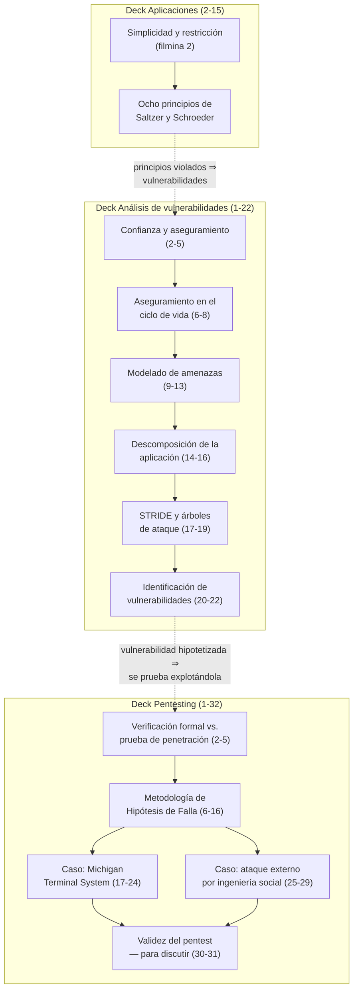

# Clase 08 — Principios de diseño y vulnerabilidades

> **15/10/2026** — jueves, **teoría** · [Filminas — Aplicaciones, sólo 2-15](../../raw/clases/Clase%2007%20-%20Aplicaciones%20-%20Principios%20y%20autenticacion.pdf) · [Filminas — Análisis de vulnerabilidades](../../raw/clases/Clase%2012%20-%20Analisis%20de%20vulnerabilidades.pdf) · [Filminas — Pentesting](../../raw/clases/Clase%2013%20-%20Pentesing.pdf)
> **Sin transcripción: la clase todavía no se dictó.** Hoy es 06/09/2026 y la fecha de arriba es la del [[cronograma|cronograma]]; todo lo que hay está escrito contra las filminas de **tres decks** y contra cinco notas de video de cursadas anteriores — el detalle, en [[#Estado de las fuentes|Estado de las fuentes]]
> Viene de: [[clase-07-autenticacion|Clase 07 — Autenticación]] · Sigue en: [[clase-09-flujo-de-informacion|Clase 09 — Flujo de información]]
> Guía asociada: **Guía 9 — Vulnerabilidades**, lunes 02/11 *(todavía no está en el vault, no se linkea)*
> Lectura recomendada por los propios decks: **Bishop, caps. 18-19** (Vulnerabilidades, filmina 22) y **cap. 23, secc. 1-2** más el **`OSSTMM`** (Pentesting, filmina 32) — los dos números vienen con desfasaje, ver la [[bibliografia|bibliografía]]
> Videos de la cátedra sobre este material: [[video-06-principios-de-diseno-2026|video-06]] · [[video-07-principios-de-diseno-2024|video-07]] · [[video-08-vulnerabilidades|video-08]] · [[video-09-pentesting-metodologia|video-09]] · [[video-10-pentesting-laboratorio|video-10]]

## Mapa de la clase

**El orden es un encadenamiento que ninguno de los tres decks hace explícito por separado, pero que salta al leerlos juntos** *(lectura nuestra)*: los **principios** son el criterio con el que se debería haber diseñado el sistema; el **análisis de vulnerabilidades** es el proceso para encontrar dónde ese criterio se violó —sirve tanto en diseño como sobre un sistema ya construido—; y el **pentesting** es la comprobación empírica, contra el sistema real, de que una vulnerabilidad hipotetizada efectivamente se puede explotar. Los tres son estaciones de un mismo proceso de aseguramiento, no temas sueltos.

Leído así, el recorrido va de **normativo a diagnóstico a empírico**: los principios se enuncian sin mirar ningún sistema, el modelado de amenazas necesita un diagrama de despliegue, el pentest necesita la máquina encendida. Y el precio de esa cercanía creciente está escrito en la filmina 4 del deck de Pentesting: la verificación formal **puede** probar ausencia de vulnerabilidades —en un ambiente acotado, ignorando instalación y uso—, mientras que el pentest **nunca** la prueba. Cada tramo compra realismo pagando con capacidad de demostración.

Por eso la clase cierra con **dos preguntas abiertas** sobre cuán válido es un pentest y qué determina su calidad, en vez de con una conclusión. No es un final flojo: un método que sólo prueba existencia no puede terminar en un certificado, y la cátedra prefiere dejar la discusión abierta antes que fingir un cierre limpio.

## El recorrido, tramo por tramo

| # | Tramo | Qué se dio | Dónde está desarrollado |
|---|---|---|---|
| 1 | **Los ocho principios** *(Aplicaciones, 2-15)* | Dos ideas madre —**simplicidad** y **restricción**— y los ocho principios que las aplican, con los ejemplos que el deck desarrolla —el CEO y el web server, `sshd`, Oracle, `finger`, las dos firmas del banco, los firewalls personales y `UAC`—, aunque **tres de los ocho van sin ningún ejemplo de filmina**. Son *"principios guía"*, no reglas: **dos de los ocho se contradicen entre sí** | [[principios-de-diseno\|Principios de diseño]] |
| 2 | **Confianza y aseguramiento** *(Vulnerabilidades, 2-5)* | Sistema confiable y aseguramiento; la confianza es **gradual, no discreta**. Cuatro vías para establecerla, la cadena Política → Aseguramiento → Mecanismo, y los tres niveles de evidencia | [[confianza-y-aseguramiento\|Confianza y aseguramiento]] |
| 3 | **Aseguramiento en el ciclo de vida** *(6-8)* | Las nueve fuentes de problemas, el aseguramiento repartido sobre las cuatro etapas del proyecto, y la distinción que más se confunde: **la vulnerabilidad no es la amenaza, es lo que permite que ocurra** | [[aseguramiento-en-el-ciclo-de-vida\|Aseguramiento en el ciclo de vida]] |
| 4 | **Modelado de amenazas** *(9-13)* | Tres perspectivas, entradas y salidas, y el **ciclo de cinco pasos de Microsoft** que organiza todo el bloque; los pasos 1 y 2, desarrollados | [[modelado-de-amenazas\|Modelado de amenazas]] |
| 5 | **Descomposición de la aplicación** *(14-16)* | Paso 3 del ciclo: el **Web App Security Frame** de diez áreas, las zonas externas y privilegiadas donde cambia el nivel de confianza, y el flujo de datos refinado por niveles | [[descomposicion-de-la-aplicacion\|Descomposición de la aplicación]] |
| 6 | **STRIDE y árboles de ataque** *(17-19)* | Paso 4: la clasificación letra por letra, con su instrucción de uso —**por cada frontera de confianza**— y los árboles de ataque, con la advertencia de la propia lámina de que pueden crecer considerablemente | [[stride-y-arboles-de-ataque\|STRIDE y árboles de ataque]] |
| 7 | **Identificación de vulnerabilidades** *(20-22)* | Paso 5, el que menos se resuelve en abstracto; el único ejemplo desarrollado del deck —el **historial médico**— y la instrucción de modelar al nivel de detalle que permita la información disponible | [[identificacion-de-vulnerabilidades\|Identificación de vulnerabilidades]] |
| 8 | **Verificación formal contra pentest** *(Pentesting, 2-5)* | Las dos definiciones escritas con la **misma estructura** de precondiciones y poscondiciones, para que el contraste salte: existencia contra ausencia. Y el objetivo del pentest — probar el sistema **como un todo**, personas incluidas | [[verificacion-formal-y-prueba-de-penetracion\|Verificación formal y prueba de penetración]] |
| 9 | **Metodología de Hipótesis de Falla** *(6-16)* | Los **cinco pasos** —recolección, hipótesis, prueba, generalización, eliminación— y qué produce cada uno; el *pivoting* como única excepción a "explotar es el último recurso" | [[metodologia-de-hipotesis-de-falla\|Metodología de hipótesis de falla]] |
| 10 | **Los dos casos resueltos** *(17-29)* | La metodología aplicada de punta a punta dos veces: **Michigan Terminal System**, donde escribir dos bytes en el segmento 5 termina en control total, y un **ataque por ingeniería social** que consigue contraseñas por teléfono sin tocar código | [[casos-de-prueba-de-penetracion\|Casos de prueba de penetración]] |
| 11 | **Validez del pentest** *(30-32)* | Dos filminas escritas como preguntas abiertas, no como doctrina, más la tensión sobre qué alcance tiene la palabra *generalización*: opera **dentro** de un sistema, no entre sistemas distintos | [[validez-de-las-pruebas-de-penetracion\|Validez de las pruebas de penetración]] |

## Las seis ideas que hay que llevarse

1. **Los ocho principios no son consistentes entre sí.** Separación de privilegios pide dos aprobadores; economía de mecanismos, el mecanismo más simple posible. La cátedra acepta la contradicción de plano: se balancean caso por caso, sin jerarquía que la resuelva de antemano.
2. **Diseño abierto es [[principio-de-kerckhoffs|Kerckhoffs]] un nivel más arriba.** Lo que Kerckhoffs dice de un cifrado, este principio lo dice de cualquier control de seguridad — y no significa publicar el código fuente, que es exactamente el error que la propia filmina anticipa y corrige.
3. **Una vulnerabilidad no es una amenaza.** La amenaza es el evento que no se quiere que pase; la vulnerabilidad, la grieta que lo hace posible. La cadena bug → vulnerabilidad → amenaza → efecto no deseado es un **embudo**: cada flecha es condición necesaria, no suficiente.
4. **`STRIDE` es un cuestionario, no una lista.** Se aplica en el paso 4 —nunca antes— y **una vez por cada frontera de confianza**. Aplicado una sola vez sobre el sistema entero produce amenazas genéricas que el paso 5 no sabe dónde buscar.
5. **Un pentest limpio no certifica nada.** Prueba que el equipo no encontró nada con el tiempo y las hipótesis que tenía — información mucho más débil que "no hay nada que encontrar". Por eso la metodología nunca declara un sistema "seguro": documenta qué se buscó.
6. **La generalización convierte un hallazgo en un problema.** En Michigan Terminal System el hallazgo aislado es "se puede escribir un valor inesperado en el segmento 5"; la generalización es lo que conecta esa escritura con que ahí vive el interruptor que apaga la protección por hardware.

## Para el parcial

Esta clase entra en el **segundo parcial (19/11)**, dentro del Bloque 2 — Seguridad.

- **Los ocho principios** con el nombre en castellano del deck vigente y al menos un ejemplo de cada uno. La forma más probable de pregunta no es enumerarlos sino **"dado este sistema, qué principios viola y cómo se arregla"** *(previsión de `video-06`, rotulada allí como lectura de esa nota, no como algo dicho en clase)*.
- Que el **quinto principio es Kerckhoffs**, y que confundir "diseño abierto" con "publicar el código" es el error que la filmina corrige explícitamente.
- La distinción **amenaza / vulnerabilidad**, con la cadena completa para ordenarlas.
- El **ciclo de cinco pasos de Microsoft** y qué produce cada uno — en particular, que `STRIDE` entra en el paso 4.
- **`STRIDE`** letra por letra, con un ejemplo por amenaza y su instrucción de uso correcta.
- Los **cinco pasos de la Metodología de Hipótesis de Falla** — lo que la cátedra marca de forma más explícita como *"lo más importante"* en `video-09`.
- **Verificación formal contra pentest**: la primera prueba ausencia sólo en un ambiente acotado que ignora instalación y uso; el segundo **nunca** la prueba, y por eso alcanza a personas y procesos.
- Poder **contar el caso de Michigan Terminal System** de punta a punta: qué segmento es el vulnerable, por qué el ataque necesita un *system call* de al menos dos parámetros, y por qué el segmento 5 es la llave del control total.
- Que el caso de **ingeniería social** es la evidencia de que el pentest no es sólo una cuestión técnica.

## Estado de las fuentes

**No hay transcripción y no puede haberla todavía**: la clase se dicta el 15/10 y esta nota se escribió el 04/09, revisada el 06/09. Todo lo que el vault tiene sobre este material sale de las filminas —las 2 a 15 del deck de Aplicaciones, las 22 del de Vulnerabilidades y las 32 del de Pentesting, todas renderizadas a 150 dpi y comparadas contra el texto extraído por `pdftotext`— más cinco notas de video de cursadas anteriores. Cuando la clase se dicte habrá que volver sobre las once notas de concepto para cotejarlas con lo que se diga en voz.

**El aporte de los videos es desparejo.** `video-09` es la fuente más aprovechada: da la metodología y los dos casos resueltos filmina por filmina. `video-08` cubre bien el bloque de vulnerabilidades pero **corta a los 37:55 en la filmina de `STRIDE`** y pasa a un Keynote distinto. `video-10` es un laboratorio de otro docente, sin transcripción: se mira por pantallas, no por audio, y no comparte deck con esta clase.

> [!nota]- Decisión de catalogación: el contenido vive en tres decks, no en uno
> El [[cronograma|cronograma]] llama a la clase del 15/10 *"Principios de diseño y vulnerabilidades"*, y ese contenido está repartido en tres archivos de la cátedra.
>
> | Deck | Qué toma esta clase |
> |---|---|
> | `Clase 07 - Aplicaciones - Principios y autenticacion.pdf` | **Sólo las filminas 2 a 15**. Las 16-46 son autenticación y las desarrolla [[clase-07-autenticacion\|Clase 07]] |
> | `Clase 12 - Analisis de vulnerabilidades.pdf` | Las **22 filminas completas** |
> | `Clase 13 - Pentesing.pdf` | Las **32 filminas completas** |
>
> Cada nota de concepto dice **de qué deck** sale la filmina que cita, porque los tres numeran desde la filmina 1.

> [!nota]- Los dos videos de principios son decks distintos, y sólo uno es el vigente
> [[video-06-principios-de-diseno-2026|video-06]] (2026 1C) y [[video-07-principios-de-diseno-2024|video-07]] (2024) cubren los ocho principios sobre **decks distintos, con ejemplos disjuntos**: cinco de los ocho nombres cambian entre uno y otro. Comparando el texto de nuestras filminas contra las tablas de ambas notas de video, **el deck vigente coincide palabra por palabra con el de `video-07`**, así que la nomenclatura que corresponde estudiar es esa; `video-06` queda como complemento. La comparación completa, con los nombres y ejemplos de cada versión, está en [[principios-de-diseno|Principios de diseño]].

> [!discrepancia]- Tres desajustes entre lo escrito y lo verificable
> | Dónde | Qué dice la fuente | Qué vale |
> |---|---|---|
> | Vulnerabilidades, filmina 4 | *"Ejecutables diseñados e implementados para cumplir hacer cumplir las políticas"* | **Errata confirmada** renderizando la página a 150 dpi: la duplicación está en el PDF, y es la **única** diferencia que apareció en toda la comparación página por página de los tres decks. [[confianza-y-aseguramiento\|Confianza y aseguramiento]] la cita corregida |
> | Vulnerabilidades, filmina 22 · Pentesting, filmina 32 | Bishop, **caps. 18-19** y **cap. 23** secc. 1-2 | La edición de `raw/` mapea esos temas a los **caps. 19-20** y **24**. El desfasaje de +1 es consistente en las dos, así que probablemente sigan otra edición — **no confirmado contra ningún original**. Conviene buscar por el título del capítulo, no por el número |
> | Vulnerabilidades, filmina 6 | Atribuye las nueve fuentes de problemas a *"Peter Newman"*, sin más datos | Casi con certeza **Peter G. Neumann**, editor del *RISKS Digest*. Es **identificación nuestra**: la filmina no lo confirma y `video-08` reporta el mismo apellido sin poder verificarlo tampoco |

> [!nota]- Dos cabos sueltos
> - **`video-08` cuenta 23 páginas en el visor del docente y el deck actual tiene 22.** El nombre de archivo es el mismo. La diferencia no afecta ninguna cita —todas se hicieron contra el PDF propio—, pero queda sin resolver si es una portada duplicada, un desfasaje de lectura del visor o una edición distinta del mismo deck.
> - **Las filminas 20 y 21 del deck de Vulnerabilidades no tienen fuente hablada.** Todo lo que [[identificacion-de-vulnerabilidades|Identificación de vulnerabilidades]] agrega por fuera del texto de la lámina está rotulado allí como desarrollo propio, no como lectura de un video.
