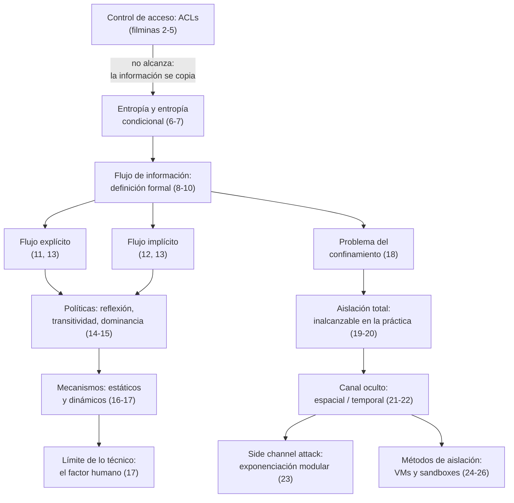

# Clase 09 — Flujo de información

> **22/10/2026** — jueves, **teoría** · [Filminas](../../raw/clases/Clase%2010%20-%20Aplicaciones%20-%20Flujo%20de%20informacion.pdf) (27 filminas)
> Viene de: [[clase-08-principios-de-diseno-y-vulnerabilidades|Clase 08 — Principios de diseño y vulnerabilidades]] · Sigue en: [[clase-10-seguridad-en-la-empresa|Clase 10 — Seguridad en la empresa]]
> Guía asociada: **Guía 8 — Flujos de información**, 26/10 *(todavía no está en el vault, no se linkea)*

> **Esta clase todavía no se dictó.** Hoy es 04/09/2026, y el 22/10 falta más de un mes y medio. Esta nota está escrita **solo contra las filminas** de `Clase 10 - Aplicaciones - Flujo de informacion.pdf`: no hay transcripción de esta clase, no puede haberla todavía, y por lo tanto **no hay ni un solo callout "De la transcripción"** en toda la nota. Todo lo que no sale literal de una filmina va rotulado como *(lectura nuestra)* o *(inferencia nuestra)*. Habrá que volver sobre esta nota después del 22/10 para cotejarla con lo que realmente se dicte.

> **Dos advertencias de numeración y de alcance, antes de leer.**
>
> **(1) El nombre.** El [[cronograma]] llama a esta clase *"Flujo de información y malware"*. El deck de 27 filminas **no trae una sola mención de malware** — ni virus, ni gusanos, ni troyanos, ni ransomware, ni ninguna taxonomía de código malicioso — y tampoco lo cubre ningún video de la cátedra (ver [[#Estado de las fuentes|Estado de las fuentes]]). Por eso el título de esta nota es sólo *Flujo de información*: la mitad de malware del rótulo del cronograma es, hasta hoy, un hueco del vault, no un error de esta nota ni un recorte arbitrario.
>
> **(2) El número del deck.** El PDF de filminas se llama `Clase 10 - Aplicaciones - Flujo de informacion.pdf`, con un **10** en el nombre de archivo, pero por tema y por fecha corresponde a la **Clase 9** de este cronograma (22/10 — la Clase 10 de este cronograma es *Seguridad en la empresa*, del 29/10). La cátedra numera sus propios materiales con una numeración histórica propia, heredada de cursadas anteriores, que no coincide con la numeración de esta cursada. Es el mismo fenómeno que ya declaran [[video-07-principios-de-diseno-2024|video-07]] (deck `Clase 07 -…`, mapea a la Clase 8 de este cronograma) y [[video-11-flujo-de-informacion|video-11]] (deck `Clase 09 -…`, que además **no es el mismo archivo** que el de esta nota, aunque cubre el mismo tema). *(Lectura nuestra: el ancla real de cada clase es el tema y la fecha del cronograma, nunca el nombre del archivo del deck.)*

## Mapa de la clase

La clase tiene una estructura de embudo que después se abre en dos ramas. Primero muestra que el control de acceso —lo que ya se vio en la clase de políticas— **no alcanza**, porque la información se copia y se actualiza. De ahí introduce una herramienta nueva, la entropía condicional, para poder decir *cuánta* información se filtra y no sólo *si* se filtra. Con esa herramienta define formalmente el flujo, lo clasifica en explícito e implícito, y plantea qué políticas y qué mecanismos podrían controlarlo. La segunda mitad cambia de pregunta: ya no es *cómo controlar el flujo dentro de un programa* sino *qué pasa cuando ni siquiera se puede aislar un proceso por completo* — el problema del confinamiento, que desemboca en canales ocultos, side channels y los dos métodos de aislación con los que se cierra la clase.

---

## 1. Control de acceso y por qué no alcanza

**Filminas 2 a 5.**

**Filminas 2 y 3 — Motivación.** El escenario es de cátedra: permitir que los docentes escriban los exámenes e impedir que los alumnos accedan a ellos. La filmina 2 fija las ACLs del directorio de exámenes:

$$\mathrm{ACL}(\texttt{/var/cys/examenes}) = \{(\texttt{pablo},r),\ (\texttt{ana},r)\}$$

y pregunta directamente: **¿sirve el control de acceso como mecanismo efectivo?** La filmina 3 agrega la ACL de un directorio temporal,

$$\mathrm{ACL}(\texttt{/tmp}) = \{(\texttt{pablo},rw),\ (\texttt{ana},rw),\ (\texttt{juan},rw)\}$$

y mete el golpe: **¿qué ocurre si un editor de textos guarda una copia en `/tmp` mientras se trabaja con el examen?** La ACL del archivo original no dice nada sobre esa copia — `juan`, que no tiene acceso al examen, sí tiene acceso de lectura y escritura a `/tmp`.

**Filmina 4 — Políticas y ACLs.** De ahí sale la tesis de la clase entera: **las políticas, por lo general, restringen el flujo de información y no el acceso a los objetos**. El ejemplo que la filmina usa para fijarlo es una comparación directa:

- Evitar que un empleado sepa el sueldo de otro
- versus evitar que un empleado acceda a la base de datos de sueldos

Es la misma base de sueldos que aparece en [[maleabilidad#El escenario: la base de sueldos|Maleabilidad]], mirada desde el otro lado: allá el problema era modificar el criptograma del sueldo sin conocer la clave; acá el problema es que la información del sueldo se escurra por un camino —una copia, un reporte derivado, un comentario— que ninguna ACL contempló. Cierre de la filmina: los ACLs **sirven**, pero por lo general son **mecanismos abiertos** y deben ser complementados.

**Filmina 5 — Control de acceso vs. flujo.** La filmina resume por qué el control de acceso, tomado solo, es una visión incompleta:

| Control de acceso | Pero |
|---|---|
| Limita el acceso a operaciones sobre objetos | La información no es estática |
| Los objetos contienen información → limita el acceso a información | Es actualizada, y puede copiarse |

El argumento es corto y contundente: controlar el acceso a un objeto controla el acceso **a ese objeto**, no a la información que ese objeto contiene una vez que se copia, se deriva o se transforma. Esa distinción —objeto contra información— es la que motiva toda la maquinaria de las secciones siguientes.

→ Concepto: **[[control-de-acceso-y-flujo-de-informacion|Control de acceso y flujo de información]]**

---

## 2. Entropía y entropía condicional

**Filminas 6 y 7.**

La clase necesita medir **cuánta** información se filtra, no sólo si se filtra, y para eso introduce entropía de Shannon. Ya hay una nota completa sobre el tema, [[teoria-de-la-informacion|Teoría de la información]], y el [[secreto-perfecto|secreto perfecto]] de la Clase 1 ya se apoya en esta misma familia de ideas escrito como $I(M;C) = 0$ — acá se linkea esa nota en vez de repetirla, y se explica qué aporta la entropía en este contexto puntual que no aportaba allá.

**Filmina 6 — Entropía.** Definida sobre una variable aleatoria discreta $X$ que toma valores $x_1,\dots,x_n$:

$$H(X) = -\sum_{i=1}^{n} p(x_i)\log p(x_i)$$

Mide la incertidumbre a la hora de determinar el valor de una variable. Los dos extremos que trae la filmina:

- **Máximo**, con $p(x_i) = 1/n$ para todo $i$ — distribución uniforme.
- **Mínimo**, con $p(x_i) = 1$ y $p(x_j) = 0$ para $j \ne i$ — evento único.

**Filmina 7 — Entropía condicional.** Se obtiene reemplazando probabilidades por probabilidades condicionadas. Con $X$ tomando valores $x_1,\dots,x_n$ e $Y$ tomando valores $y_1,\dots,y_m$:

$$H(X \mid Y=y) = -\sum_{i=1}^{n} p(x_i \mid y)\log p(x_i \mid y)$$

$$H(X \mid Y) = \sum_{j=1}^{m} p(y_j)\,H(X \mid Y=y_j)$$

**Qué aporta acá que no aportaba en el secreto perfecto.** El secreto perfecto de la Clase 1 es una afirmación de **todo o nada**: $I(M;C)=0$ dice que el criptograma no correlaciona nada con el mensaje, y $I(M;C)>0$ dice que correlaciona algo — pero no cuánto. La entropía condicional, en cambio, da un **número**: $H(x_s \mid y_t)$ es la incertidumbre exacta que queda sobre $x$ después de observar $y$, y se puede comparar contra la incertidumbre que había antes. Esa es la diferencia operativa que esta clase necesita, porque el objeto que analiza no es un experimento de indistinguibilidad entre dos mensajes, sino un **programa entero**, con estados que cambian a medida que se ejecutan comandos — y ahí hace falta poder decir "se filtró un bit y medio", no sólo "se filtró algo o no se filtró nada". *(Lectura nuestra: la filmina no hace esta comparación explícita con la Clase 1; la conexión es nuestra, apoyada en que $H(x)-H(x\mid y) = I(x;y)$, así que "la condicional bajó" y "la mutua es positiva" son la misma afirmación.)*

→ Concepto: **[[entropia-y-entropia-condicional|Entropía y entropía condicional]]**

---

## 3. Flujo de información: la definición

**Filminas 8 a 10.**

**Filmina 8 — Definición formal.** Sea $s$ el estado de un sistema y $t$ el estado del sistema luego de ejecutar los comandos $c_1,\dots,c_n$. Sean $x_s, y_s$ los valores de los objetos $x$ e $y$ en el estado $s$, y sea $y_t$ el valor de $y$ en el estado $t$. **Hay flujo de información de $x$ a $y$** si:

$$H(x_s \mid y_t) < H(x_s \mid y_s) \qquad \text{si } y \text{ existe en el estado } s$$

$$H(x_s \mid y_t) < H(x_s) \qquad \text{si } y \text{ no existe en el estado } s$$

Dicho en términos simples: si después de ejecutar el programa y conocer $y$ queda **menos** incertidumbre sobre $x$ que la que había antes, es porque algo de $x$ se traspasó a $y$. El criterio es de **reducción**, no de valor absoluto — importa cuánto bajó $H$, no cuánto vale.

**Filmina 9 — Seguimiento de flujo de información.** Existen técnicas formales de análisis de flujo en programas. La filmina hace una distinción importante: **en general existe flujo de información en un programa, y es necesario para que funcione** — un programa que no muevo información de sus entradas a sus salidas no hace nada útil. Lo que a veces interesa es verificar **casos puntuales**, y el ejemplo que trae la propia filmina es exactamente el que le importa a esta materia: **que una función de cifrado no revele información de la clave**. Es la misma preocupación que sostiene toda la Unidad 1 —desde el [[secreto-perfecto|secreto perfecto]] hasta la [[seguridad-computacional|seguridad computacional]]—. *(Lectura nuestra: la filmina deja esa preocupación en prosa, sin fórmula; la reformulación en el vocabulario de esta clase —verificar que $H(\text{clave} \mid \text{criptograma})$ no baje respecto de $H(\text{clave})$— es una traducción propia, no algo que la filmina 9 escriba.)*

**Filmina 10 — El primer ejemplo, resuelto.** Considerar el comando $y := x + z$, donde $0 \le x \le 7$ con igual probabilidad y $Z = \{p(z{=}1)=0{,}5,\ p(z{=}2)=0{,}25,\ p(z{=}3)=0{,}25\}$.

Entropía natural de $x$, con ocho valores equiprobables:

$$H(x) = -\sum_{i=0}^{7} \tfrac{1}{8}\log_2\tfrac{1}{8} = 3 \text{ bits}$$

Conociendo $y$ después del comando, $x$ sólo puede valer $y-1$, $y-2$ o $y-3$, heredando las probabilidades de $z$:

$$H(x \mid y) = -\tfrac{1}{2}\log_2\tfrac{1}{2} - 2\cdot\tfrac{1}{4}\log_2\tfrac{1}{4} = 1{,}5 \text{ bits}$$

Como $1{,}5 < 3$, **hay traspaso de información de $x$ a $y$** — la propia filmina lo remata con un globo de texto. De los 3 bits de incertidumbre original quedaron 1,5: se filtró un bit y medio, ni todo ni nada.

→ Concepto: **[[flujo-de-informacion|Flujo de información]]**

---

## 4. Flujo explícito e implícito

**Filminas 11 a 13.**

Los dos ejemplos que siguen muestran que la información puede fluir **sin que haya una asignación que la traspase directamente**.

**Filmina 11 — Flujo indirecto por rama.** Considerar `if x = 0 then y = 1 else y = 0`, con $x \in \{0,1\}$ y $p(x{=}0)=0{,}5$. La propia filmina señala lo interesante: **$x$ e $y$ no aparecen nunca en la misma asignación**.

$$H(x) = -2\cdot\tfrac{1}{2}\log_2\tfrac{1}{2} = 1 \text{ bit} \qquad H(x \mid y) = 0$$

$H(x\mid y)=0$ porque conocer $y$ determina $x$ exactamente: $y=1 \Rightarrow x=0$ y $y=0 \Rightarrow x=1$. Como $0 < 1$, hay flujo. *(Lectura nuestra: $x$ e $y$ nunca comparten una instrucción, pero el `if` funciona igual que una asignación — sólo que repartida en dos ramas en lugar de escrita como una sola fórmula; qué rama se ejecuta ya fija el valor de $y$ tan directamente como lo haría un $y := f(x)$ explícito.)*

**Filmina 12 — Flujo indirecto por comportamiento.** Considerar `while x = 0 loop {}`, con $x \in \{0,1\}$ y $p(x{=}0)=0{,}5$. Acá **no existe ninguna asignación en absoluto**. Se define $y=0$ si el programa termina.

$$H(x) = 1 \qquad H(x \mid y) = 0$$

Saber si el programa terminó o quedó colgado en el bucle infinito determina el valor de $x$ por completo. Hay traspaso de información **sin una sola línea que escriba nada**. *(Lectura nuestra: acá no queda ni una asignación ni una salida explícita a la vista — lo único que hay para observar es el propio comportamiento del programa, terminar o no terminar, y esa sola observación ya reconstruye $x$ entero. Es el caso que deja más claro que un análisis de flujo que sólo revise instrucciones de asignación no alcanza.)*

**Por qué cada uno filtra, en una frase** *(lectura nuestra: la filmina no propone esta clasificación por tipo de canal —dato, control, comportamiento—; es una síntesis propia a partir de los tres ejemplos anteriores)*:

- **`y := x + z`** filtra porque $y$ es **función directa** de $x$: observar la salida de una operación aritmética sobre $x$ deja ver, con la incertidumbre residual que aporte $z$, el valor de $x$. Es flujo por **dato**.
- **El `if`** filtra porque, aunque $x$ nunca se copia a ningún lado, **la rama que se ejecuta depende de $x$**, y el valor final de $y$ delata qué rama se tomó. Es flujo por **control**.
- **El `while`** filtra porque ni siquiera hay una salida explícita: lo que se observa es si el programa **terminó o no**, y esa sola observación —un bit binario, terminó/no terminó— ya alcanza para reconstruir $x$. Es flujo por **comportamiento**, y es el caso límite: no hay dato ni rama visible, sólo la propia ejecución del programa como canal.

**Filmina 13 — La generalización.** Los tres ejemplos anteriores se ordenan en dos categorías:

| Tipo | Qué es | Cuál de los ejemplos |
|---|---|---|
| **Explícito** | Existe una asignación o escritura de información del tipo $y := f(x)$ | El primero, $y := x+z$ |
| **Implícito** | Hay verificación de flujo **sin** asignaciones explícitas | El `if` y el `while` |

El problema que la filmina deja planteado es **encontrar y controlar los flujos implícitos**, que son mucho más sutiles y mucho más difíciles de capturar que los explícitos — un analizador que sólo mira asignaciones se pierde tanto el `if` como el `while`.

→ Concepto: **[[flujo-explicito-e-implicito|Flujo explícito e implícito]]**

---

## 5. Políticas de control de flujo

**Filminas 14 y 15.**

**Filmina 14 — Requerimientos.** Toda política de control de flujo de información debe cumplir con dos principios:

- **Reflexión** — si $a$ y $b$ están en la **misma clase** y $a$ puede leer o escribir $o_1$, entonces $b$ también puede.
- **Transitividad** — si $a$ y $b$ están en **clases distintas**, $a$ puede escribir $o_1$ y leer $o_2$, y $b$ puede leer $o_1$, entonces $b$ **eventualmente** puede leer $o_2$.

La transitividad es la que importa de verdad: es la formalización de que la información se escurre por caminos indirectos, exactamente el caso `/tmp` con el que arrancó la clase — el hecho de que $b$ pueda leer $o_1$, que a su vez porta lo que $a$ escribió a partir de $o_2$, hace que $o_2$ le llegue a $b$ aunque nunca lo haya leído directamente.

**Filmina 15 — Flujo de información y Bell-LaPadula.** Acá aparece la **relación de dominancia** de Bell-LaPadula, aplicada al problema del flujo — no el modelo completo. Los tres casos que desarrolla la filmina:

| Caso | Configuración | Qué se concluye |
|---|---|---|
| 1 | $a,b,o \in C_1$ (misma clase) | Dominancia mutua: $a \operatorname{dom} o$ y $o \operatorname{dom} a$, igual con $b$. Tanto $a$ como $b$ pueden **leer y escribir** $o$ |
| 2 | $a \in C_1$, $b \in C_2$ con $C_2 \operatorname{dom} C_1$, $o \in C_1$ | Como $b \operatorname{dom} a$ y $a \operatorname{dom} o$, entonces **$b \operatorname{dom} o$** por transitividad, y $b$ puede leer $o$ |
| 3 | Igual que el 2, más una restricción discrecional en curso $(b,-,C_1)$ | $a$ puede leer $o$ y escribir $o'$ en $C_2$, que $b$ **sí** puede leer: la restricción discrecional se elude por el camino indirecto |

El caso 3 se reporta tal como está en la filmina: la notación $(b,-,C_1)$ para la restricción discrecional **no la explica la filmina**, y no hay forma de reconstruir su sintaxis exacta sin más contexto — la moraleja sí queda clara igual: una prohibición discrecional puntual no sobrevive a la transitividad del flujo.

**Alcance de esta sección, para no leer de más.** Esto es **sólo** la relación de dominancia trasladada al flujo: no aparecen la *simple security property* ni la *star-property* de Bell-LaPadula, y tampoco Biba, Clark-Wilson ni Chinese Wall — esos modelos, si se dan, salen de la clase de políticas y control de acceso, que en el vault todavía no tiene fuente propia (ver [[#Estado de las fuentes|Estado de las fuentes]]).

→ Concepto: **[[politicas-de-control-de-flujo|Políticas de control de flujo]]**

---

## 6. Mecanismos de control de flujo

**Filminas 16 y 17.**

**Filmina 16 — Mecanismos.** Cómo se implementa en la práctica lo que la sección anterior exige como política:

| | Cómo funciona |
|---|---|
| **Estáticos** | Se analiza el flujo **comando por comando**, con conceptos de teoría de compiladores; sólo se permiten comandos "certificados" |
| **Dinámicos** | Se asignan **etiquetas** a la información contenida. Al leer, el usuario adquiere las etiquetas del dato; al escribir, el dato lleva todas las etiquetas del usuario; y cada zona tiene un conjunto de etiquetas **requeridas** y **prohibidas** |

Los mecanismos estáticos atacan el problema en tiempo de compilación —certificando de antemano que ningún camino del programa viola la política—, y los dinámicos lo atacan en tiempo de ejecución, propagando marcas junto con los datos a medida que se mueven.

**Filmina 17 — Dónde lo técnico se termina.** El ejemplo es de esferas gubernamentales: un oficial que adquiere derechos de acceso a información confidencial **deja de poder emitir comunicados oficiales públicos** — es control de flujo por etiquetas aplicado a una persona en vez de a un dato. Pero la filmina hace tres preguntas que se contestan solas:

- ¿Cómo impedir que hable informalmente?
- ¿Cómo impedir que imprima documentación clasificada?
- ¿Cómo impedir que fotografíe una pantalla?

Ninguna tiene respuesta técnica. Es el límite explícito que la propia filmina traza: **sólo se puede controlar lo que admite un mecanismo técnico; todo lo demás excede a la técnica**. *(Lectura nuestra: es el mismo límite que atraviesa la [[video-09-pentesting-metodologia|metodología de pentesting]], donde la ingeniería social es, en la práctica, la vía de ataque más productiva precisamente porque rodea cualquier control técnico; la filmina 17 no menciona el pentesting, la conexión es nuestra.)*

→ Concepto: **[[mecanismos-de-control-de-flujo|Mecanismos de control de flujo]]**

---

## 7. El problema del confinamiento

**Filminas 18 a 20.**

**Filmina 18 — El problema de confinamiento.** Un sistema ideal tiene que hacer dos cosas:

1. Permitir que una entidad acceda **sólo** a los recursos para los que está autorizada. Es la parte "fácil" del problema: ya existen mecanismos seguros para eso.
2. **No revelar información de ningún tipo** a quien no está autorizado. Es la parte "difícil".

De ahí sale la definición formal del **problema de confinamiento**: prevenir que un servidor revele información que el usuario del servicio considere confidencial.

**Filmina 19 — Aislación total.** Sería la solución perfecta a la parte difícil. Sus requisitos: el proceso no puede comunicarse con otros procesos, y el proceso no puede ser observado. Su consecuencia, si se cumpliera: el proceso no revela información. El problema es que **en la práctica es inalcanzable**, porque todo proceso usa recursos medibles: memoria, ciclos de CPU, espacio en disco, ancho de banda.

**Filmina 20 — Por qué falla en la práctica.** Los procesos $a$ y $b$ no pueden comunicarse, pero comparten el sistema de archivos; si no lo comparten, comparten el procesador; y además comparten memoria. Todos estos recursos son **observables**, y observarlos permite crear un canal oculto de información — la conclusión de esta filmina es el gozne de la clase: la aislación perfecta falla siempre por el mismo motivo, dos procesos que no deberían comunicarse igual comparten sustrato físico.

→ Concepto: **[[problema-del-confinamiento|Problema del confinamiento]]**

---

## 8. Canales ocultos y side channels

**Filminas 21 a 23.**

**Filmina 21 — Canal oculto.** Definición: **un canal de comunicación que no fue diseñado para ello**. Clasificación:

- **Canal oculto espacial** — utiliza atributos de recursos compartidos.
- **Canal oculto temporal** — utiliza información temporal o de orden en el acceso a recursos compartidos.

Y dos atributos con los que se lo caracteriza:

- **Ruido** — capacidad de interferencia no premeditada de terceras partes.
- **Ancho de banda** — tasa de transmisión del canal.

**Filmina 22 — Un canal oculto temporal completo.** Dos procesos no pueden comunicarse, pero corren en el mismo servidor y comparten la CPU:

- Para enviar un **bit 0**, el proceso $a$ devuelve el control al sistema operativo **inmediatamente**.
- Para enviar un **bit 1**, el proceso $a$ hace uso **intensivo** de su *slot* temporal.
- El proceso $b$ accede al reloj de tiempo real y mide cuánto tarda en volver a tener control de la CPU: si tardó más, infiere que el otro proceso estaba en uso intensivo, y de ahí decodifica el bit.

Es exactamente el ejemplo del enunciado del problema de confinamiento hecho carne: dos procesos aislados en el papel, que igual construyen un canal de comunicación completo —con su propia codificación— sobre un recurso compartido que nadie diseñó para eso.

**Filmina 23 — Side channel attacks.** Un side channel attack **hace uso de un canal oculto para ganar información**. El caso de la filmina es el algoritmo de exponenciación modular para calcular $a^b \bmod n$:

$$\begin{aligned}
&x := 1;\quad a_{\mathrm{tmp}} := a \\
&\textbf{for } i := 0 \textbf{ to } k-1 \textbf{ do} \\
&\quad \textbf{if } b_i = 1 \textbf{ then } x := (x \cdot a_{\mathrm{tmp}}) \bmod n \\
&\quad a_{\mathrm{tmp}} := (a_{\mathrm{tmp}} \cdot a_{\mathrm{tmp}}) \bmod n \\
&\textbf{end} \\
&\mathrm{result} := x
\end{aligned}$$

donde $b_i$ es el $i$-ésimo bit de la representación binaria de $b$. **El ataque, en una línea:** la multiplicación extra ($x := (x \cdot a_{\mathrm{tmp}}) \bmod n$) sólo se ejecuta cuando el bit vale $1$, así que **el tiempo de ejecución depende de los bits de $b$**. Aplicando métodos estadísticos sobre el canal de tiempo se puede reconstruir parte de $b$ — y $b$ es, típicamente, el exponente secreto de un esquema como RSA o Diffie-Hellman. Es el único punto de todo el deck donde la clase de seguridad toca criptografía concreta: el algoritmo de la filmina es el mismo de exponenciación rápida que aparece en cualquier implementación de esos esquemas, y la notación modular con paréntesis es la misma de [[aritmetica-modular-y-divisibilidad|Aritmética modular y divisibilidad]].

→ Concepto: **[[canales-ocultos-y-side-channels|Canales ocultos y side channels]]**

---

## 9. Métodos de aislación

**Filminas 24 a 27.**

**Filmina 24 — Dos caminos para el confinamiento.** La diferencia clave es si hay que tocar el sistema o no:

- **Presentar un ambiente** que se comporte como una computadora que sólo corre los procesos aislados. Es el concepto de **máquina virtual**. No requiere modificar los sistemas.
- **Correr los procesos en un ambiente** que analiza las acciones y detecta fugas de información. Es el concepto de **sandbox**. Requiere modificar los sistemas.

**Filmina 25 — Máquinas virtuales.** Son programas que simulan el hardware de una máquina —real o abstracta—, y permiten correr sistemas operativos **sin modificación**. El núcleo de la máquina virtual se convierte en el agente que provee seguridad: **los sujetos pasan a ser las máquinas virtuales**, y **los objetos son los recursos**. Ejemplos de la filmina: `KVM`, `VMware`, `qemu`, `CCS64`, `Mame`, la *Java virtual machine*.

> **Errata de la filmina.** Bajo "El núcleo de la maquina virtual se convierte en el agente que provee seguridad" la filmina escribe *"Los objetos son son los recursos"*, con la palabra *son* duplicada. Es un error tipográfico trivial, verificado sobre la página renderizada — no un artefacto de extracción de texto —, y no afecta el contenido: la lectura correcta es *"los objetos son los recursos"*.

**Filmina 26 — Sandboxes.** Forman un ambiente donde las acciones están limitadas de acuerdo a cierta política. Dos formas de trabajo:

- **Se modifica el ambiente** — los programas no deben modificarse; el kernel o el sistema operativo se modifica para imponer las restricciones.
- **Se modifica el programa** — se agregan llamadas a puntos de control.

Ejemplos de la filmina: `chroot`, el *ebuild sandbox* de Gentoo, y la *Java virtual machine* otra vez, pero ahora vía `SecurityManager` — la filmina marca esta segunda aparición con un signo de exclamación entre paréntesis, señalando que la misma JVM aparece como ejemplo de las dos categorías: máquina virtual (filmina 25) y sandbox (filmina 26), según qué mecanismo de la JVM se esté mirando.

**Filmina 27 — Lectura recomendada.** Capítulo **16-1** y capítulo **17** de *Computer Security: Art and Science*, de Matt Bishop → [[bibliografia#2. Matt Bishop — Computer Security: Art and Science|Bibliografía]]. *(Precisión nuestra.)* La tabla de bibliografía del vault, armada capítulo por capítulo contra el propio PDF de Bishop, mapea el **capítulo 17** ("Information Flow") y el **capítulo 18** ("Confinement Problem") a esta misma Clase 9 y a la Guía 8 — que encaja mejor con el contenido de esta filmina que el capítulo 16 ("Access Control Mechanisms"), pensado para la clase de control de acceso. Es posible que "Capítulo 16-1" en la filmina se refiera a una sección puntual (§16.1) y no al capítulo entero, pero eso no se puede confirmar sin ver el libro citado con precisión de sección; se deja constancia de la lectura tal como aparece en la filmina y de la referencia cruzada de la bibliografía del vault, sin resolver la ambigüedad.

→ Concepto: **[[metodos-de-aislacion|Métodos de aislación]]**

---

## Para el parcial

Esta clase entra en el **segundo parcial** (19/11), como parte del Bloque 2.

- Saber escribir de memoria la **definición formal de flujo de información** (filmina 8) con las dos desigualdades —según si $y$ existe o no en el estado $s$— y aplicarla a un ejemplo concreto calculando $H(x)$ y $H(x\mid y)$, como los tres de las filminas 10 a 12.
- Distinguir **flujo explícito de flujo implícito**, y en particular saber justificar por qué un `if` y un `while` sin ninguna asignación explícita igual filtran información — es el punto que un ejercicio tipo Guía 8 va a explotar, porque es el que menos se detecta con un análisis ingenuo del código.
- Tener claro que acá **Bell-LaPadula aparece recortado a la relación de dominancia**: si una pregunta de parcial pide la *simple security property* o la *star-property*, esa no es materia de esta clase — sería materia de la clase de políticas, que hasta hoy no tiene fuente en el vault.
- Saber la **clasificación de canales ocultos** —espacial/temporal, con los atributos de ruido y ancho de banda— y poder identificar, dado un escenario, cuál de los dos tipos aplica.
- Poder explicar el **side channel de tiempo** sobre la exponenciación modular: por qué el tiempo de ejecución depende de los bits del exponente, y por qué eso es explotable con métodos estadísticos.
- Distinguir **máquina virtual de sandbox** por el criterio operativo de la filmina 24: ¿modifica el sistema o no? Y saber ubicar los ejemplos de cada una.
- Saber que el **problema de confinamiento** tiene una parte fácil (controlar el acceso) y una difícil (no revelar nada), y que la aislación total —la solución teórica a la parte difícil— es inalcanzable en la práctica porque todo proceso usa recursos medibles.

## Estado de las fuentes

**Qué cubre esta nota.** Las 27 filminas completas de `Clase 10 - Aplicaciones - Flujo de informacion.pdf`, verificadas contra la página renderizada en los puntos donde el texto extraído con `pdftotext` parecía traer poco o alguna fórmula parecía rota (filminas 1, 2 a 8, 15, 21 a 27). No se encontró ninguna errata de contenido — sólo la duplicación tipográfica trivial de la filmina 25 señalada más arriba.

**Qué falta, declarado sin rodeos.** El cronograma llama a esta clase *"Flujo de información y malware"*, y **el malware no está en ninguna fuente del vault**: no está en el deck de esta nota (cero menciones, verificado filmina por filmina), y tampoco lo cubre ningún video de la cátedra — la búsqueda sobre las ocho transcripciones del Bloque 2 encuentra una sola mención de ransomware, como anécdota, en [[video-12-proteccion-de-datos-personales|video-12]]. Cuando la cátedra dicte esta mitad de la clase, o publique material propio, tendrá que salir de ahí; mientras tanto, la referencia disponible es el capítulo 23 de Bishop ("Malware"), que la [[bibliografia|bibliografía]] del vault ya mapea a esta Clase 9.

**Cruce con el video de la cátedra.** [[video-11-flujo-de-informacion|video-11-flujo-de-informacion.md]] cubre el mismo tema, filmina por filmina, sobre un deck propio (`Clase 09 - Aplicaciones - Flujo de información.pdf`, según lo que registra esa nota) que **no es el mismo archivo** que el de esta nota pero coincide en las 27 filminas y en el orden. Es la grabación de una clase real dictada por Ramele el 10/05/2024, con alumnos, preguntas y ejemplos hablados que ninguna filmina trae —el caso del ventilador del servidor para explicar la entropía condicional, la digresión termodinámica, la aclaración de que la entropía sólo mide bits de codificación bajo distribución uniforme—. Esta nota **no inventa citas** de esa clase grabada porque no es la clase de esta cursada: se la usa sólo para confirmar que el contenido de las filminas es el que efectivamente se dicta, y se remite a ella para quien quiera el desarrollo oral completo. Dos huecos que el video mismo declara y que esta nota hereda: el modelo Bell-LaPadula completo (más allá de la dominancia) y el control de acceso con ACLs y listas de capacidades no están grabados en ningún video de la cátedra, y la notación $(b,-,C_1)$ de la restricción discrecional (filmina 15) no la explica ni la filmina ni el video.

**Lo que es inferencia nuestra**, marcado en su lugar con *(lectura nuestra)* o *(inferencia nuestra)* en el propio párrafo donde se afirma, no sólo acá: la comparación entre entropía condicional y $I(M;C)=0$ de la Clase 1 (sección 2), la reformulación de la preocupación de la filmina 9 en términos de $H(\text{clave}\mid\text{criptograma})$ (sección 3), la lectura de por qué el `if` y el `while` filtran sin asignación explícita y la clasificación por tipo de canal —dato, control, comportamiento— que se arma con los tres ejemplos (sección 4), la conexión con la ingeniería social de la metodología de pentesting (sección 6), y el cruce entre la filmina 27 y la tabla de bibliografía del vault (sección 9).

**Guía asociada.** Esta clase es la base declarada de la **Guía 8 — Flujos de información** (26/10). Esa guía todavía no está en `wiki/guias/`, así que no se linkea con corchetes en esta nota para no dejar un enlace roto permanente; se la nombra en texto plano donde corresponde.

## Ver también

- [[clase-08-principios-de-diseno-y-vulnerabilidades|Clase 08 — Principios de diseño y vulnerabilidades]] — la clase anterior del cronograma
- [[clase-10-seguridad-en-la-empresa|Clase 10 — Seguridad en la empresa]] — la clase siguiente
- [[video-11-flujo-de-informacion|Video 11 — Flujo de información]] — la clase grabada que cubre este mismo deck, con ejemplos hablados y advertencias de alcance
- [[video-09-pentesting-metodologia|Video 09 — Pentesting: metodología]] — la ingeniería social como el "todo lo que excede a lo técnico" de la filmina 17
- [[teoria-de-la-informacion|Teoría de la información]] — entropía, entropía condicional, información mutua y el puente con el secreto perfecto, desarrollados en detalle
- [[secreto-perfecto|Secreto perfecto]] — el caso límite $I(M;C)=0$, del que la entropía condicional de esta clase es la versión graduada
- [[maleabilidad#El escenario: la base de sueldos|Maleabilidad]] — la misma base de sueldos, atacada por el otro lado
- [[aritmetica-modular-y-divisibilidad|Aritmética modular y divisibilidad]] — la notación de módulo que usa el side channel de la filmina 23
- [[bibliografia#2. Matt Bishop — Computer Security: Art and Science|Bibliografía]] — Bishop, capítulos 16 a 18, y el capítulo 23 para el malware que falta
- [[videografia|Videografía]] — dónde encaja el video 11 entre los trece de la cátedra
- [[cronograma|Cronograma]] — Clase 9 (22/10) y Guía 8 (26/10)
- Los nueve conceptos de esta clase: [[control-de-acceso-y-flujo-de-informacion|Control de acceso y flujo de información]] · [[entropia-y-entropia-condicional|Entropía y entropía condicional]] · [[flujo-de-informacion|Flujo de información]] · [[flujo-explicito-e-implicito|Flujo explícito e implícito]] · [[politicas-de-control-de-flujo|Políticas de control de flujo]] · [[mecanismos-de-control-de-flujo|Mecanismos de control de flujo]] · [[problema-del-confinamiento|Problema del confinamiento]] · [[canales-ocultos-y-side-channels|Canales ocultos y side channels]] · [[metodos-de-aislacion|Métodos de aislación]]
