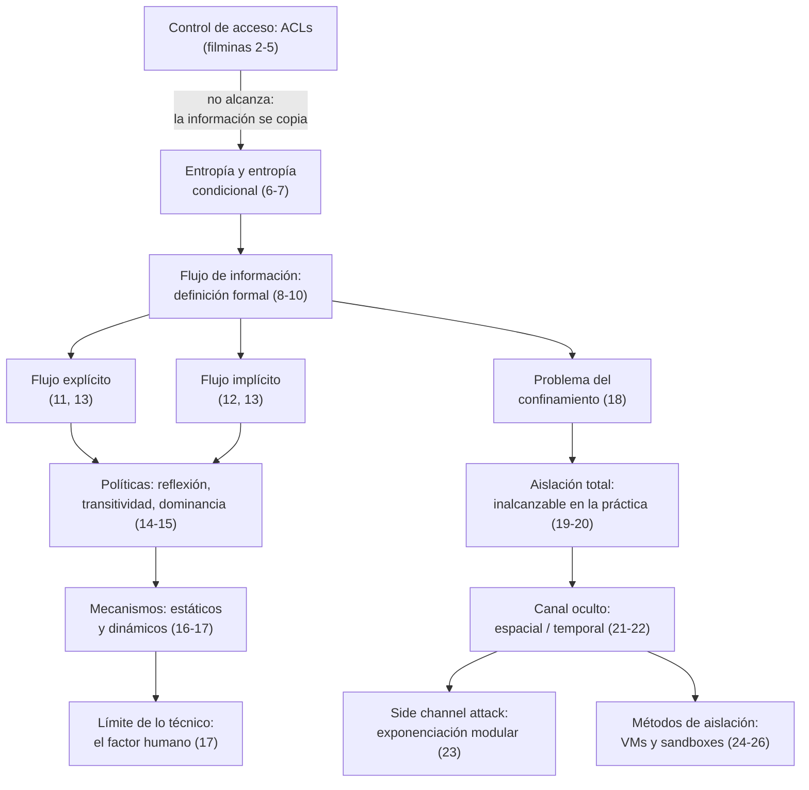

# Clase 09 — Flujo de información

> **22/10/2026** — jueves, **teoría** · [Filminas](../../raw/clases/Clase%2010%20-%20Aplicaciones%20-%20Flujo%20de%20informacion.pdf) (27 filminas) · **sin transcripción**: la clase todavía no se dictó
> Guía del tramo: **Guía 8 — Flujos de información**, práctica del 26/10 *(según el [[cronograma]]; todavía no está en el vault, no se linkea)*
> Grabación de otra cursada sobre el mismo temario, deck propio: [[video-11-flujo-de-informacion|Video 11 — Flujo de información]]
> Lectura recomendada al cerrar (filmina 27): **Bishop, «capítulo 16-1» y capítulo 17** — en la edición del vault son los [[metodos-de-aislacion#La lectura recomendada con la que cierra el deck|capítulos 17 y 18]], *Information Flow* y *Confinement Problem*
> Viene de: [[clase-08-principios-de-diseno-y-vulnerabilidades|Clase 08 — Principios de diseño y vulnerabilidades]] · Sigue en: [[clase-10-seguridad-en-la-empresa|Clase 10 — Seguridad en la empresa]]

## Mapa de la clase

**La clase abre rompiendo lo que ya se había dado.** Las primeras cuatro filminas repiten el control de acceso de la [[clase-06-politicas-de-seguridad-y-control-de-acceso|Clase 06]] y lo desarman con un caso mínimo —una copia de trabajo que el editor de textos deja en `/tmp`— para dejar sentado que una ACL protege **un objeto**, no la información que ese objeto contiene. Recién con esa carencia a la vista aparece la herramienta nueva, la entropía condicional, y con ella la definición formal de flujo. Es la misma decisión pedagógica de la [[clase-01-introduccion-y-criptografia-clasica|Clase 01]]: primero el fracaso del criterio viejo, después la maquinaria que lo reemplaza.

Del centro hacia adelante la clase toma forma de embudo que se abre en dos ramas. La primera baja de la definición a la práctica —flujo explícito e implícito, qué política habría que exigir, qué mecanismo la implementaría— y desemboca en el punto donde lo técnico deja de alcanzar: ninguna etiqueta impide que una persona fotografíe una pantalla. La segunda cambia de pregunta. Ya no es *cómo controlar el flujo dentro de un programa* sino *qué pasa cuando ni siquiera se puede aislar un proceso del resto del sistema*, y de ahí salen el confinamiento, los canales ocultos, el ataque de tiempo y los dos métodos de aislación con los que cierra el deck.

Dentro de la primera rama hay un orden fino que conviene no perder: los tres ejemplos de flujo están puestos en **visibilidad decreciente**. Primero una asignación que se ve a simple vista, después un `if` donde las variables nunca comparten una línea, y por último un `while` donde no hay ninguna asignación que revisar — lo único observable es si el programa termina. El punto de esa escalera es que un analizador que sólo mira asignaciones se pierde los dos últimos, y ese es exactamente el problema que las filminas siguientes tratan de resolver.

## El recorrido, tramo por tramo

| # | Tramo | Qué se dio | Dónde está desarrollado |
|---|---|---|---|
| 1 | **Control de acceso y por qué no alcanza** *(2-5)* | El caso de cátedra de los exámenes y la copia en `/tmp`, y la tesis que sostiene todo el deck: **las políticas restringen el flujo de la información, no el acceso a los objetos**. Las ACLs sirven, pero son mecanismos abiertos y hay que complementarlas | [[control-de-acceso-y-flujo-de-informacion\|Control de acceso y flujo de información]] |
| 2 | **Entropía y entropía condicional** *(6-7)* | La herramienta que permite pasar de «¿hay filtración?» a «¿cuánta?»: $H(X)$ con sus dos extremos, y $H(X\mid Y)$ como la incertidumbre que queda una vez conocida otra variable | [[entropia-y-entropia-condicional\|Entropía y entropía condicional]] · [[teoria-de-la-informacion\|Teoría de la información]] |
| 3 | **Flujo de información: la definición** *(8-10)* | Hay flujo de $x$ a $y$ si conocer $y$ deja **menos** incertidumbre sobre $x$ que antes, con las dos ramas según si $y$ existía en el estado inicial. El ejemplo resuelto $y := x+z$: de 3 bits quedan 1,5 | [[flujo-de-informacion\|Flujo de información]] |
| 4 | **Flujo explícito e implícito** *(11-13)* | El `if` sin variables compartidas y el `while` sin ninguna asignación filtran igual. La generalización en dos categorías, y el problema abierto: encontrar y controlar los implícitos | [[flujo-explicito-e-implicito\|Flujo explícito e implícito]] |
| 5 | **Políticas de control de flujo** *(14-15)* | Los dos requisitos de toda política —reflexión y transitividad— y la relación de dominancia de Bell-LaPadula aplicada al flujo en tres casos, el último con una restricción discrecional que se elude por el camino indirecto | [[politicas-de-control-de-flujo\|Políticas de control de flujo]] · [[bell-lapadula\|Bell-LaPadula]] |
| 6 | **Mecanismos de control de flujo** *(16-17)* | Estáticos, que certifican comando por comando en compilación, y dinámicos, que propagan etiquetas en ejecución. Y el límite explícito: sólo se controla lo que admite un mecanismo técnico | [[mecanismos-de-control-de-flujo\|Mecanismos de control de flujo]] |
| 7 | **El problema del confinamiento** *(18-20)* | Prevenir que un servidor revele información confidencial: la parte fácil ya está resuelta, la difícil no. La aislación total sería la respuesta, pero es inalcanzable — todo proceso usa recursos medibles | [[problema-del-confinamiento\|Problema del confinamiento]] |
| 8 | **Canales ocultos y side channels** *(21-23)* | Canal de comunicación que no fue diseñado para eso: espacial o temporal, con ruido y ancho de banda. El canal de CPU completo, y el ataque de tiempo sobre la exponenciación modular que filtra el exponente secreto | [[canales-ocultos-y-side-channels\|Canales ocultos y side channels]] |
| 9 | **Métodos de aislación** *(24-27)* | Máquina virtual contra sandbox, separadas por un solo criterio: ¿hay que modificar el sistema o no? Con sus ejemplos, la JVM apareciendo en las dos categorías, y la lectura recomendada de cierre | [[metodos-de-aislacion\|Métodos de aislación]] · [[bibliografia\|Bibliografía]] |

## Las seis ideas que hay que llevarse

1. **Controlar el objeto no controla la información.** Toda la maquinaria de ACLs y listas de capacidades opera sobre objetos; el fenómeno que hay que controlar vive un nivel más abajo, en la información que esos objetos transportan y que se copia, se deriva y se transforma.
2. **Medir es lo que cambia el juego.** El [[secreto-perfecto|secreto perfecto]] responde sí o no; la entropía condicional devuelve un número. Poder decir «se filtró un bit y medio» es lo que permite analizar un programa entero en vez de un experimento entre dos mensajes.
3. **El criterio de flujo es una reducción, no un valor.** Importa cuánto **bajó** $H$, no cuánto vale: la entropía mide lo que falta por saber, y que falte menos después de correr el programa es exactamente lo que significa que información se traspasó.
4. **Los flujos que importan son los que no se ven.** El `if` y el `while` filtran sin ninguna asignación explícita, y son el motivo por el que certificar un programa es mucho más caro que revisar sus asignaciones.
5. **Lo técnico tiene un borde, y la filmina lo dice.** Un mecanismo perfecto de etiquetas no impide que alguien hable, imprima o fotografíe: sólo se puede controlar aquello para lo cual existe un mecanismo técnico.
6. **La aislación perfecta no existe porque el sustrato se comparte.** Dos procesos con prohibición de comunicarse igual comparten CPU, memoria o disco, y cualquier recurso medible y compartido ya es un canal — máquinas virtuales y sandboxes reducen la superficie, no cierran el problema.

## Para el parcial

Esta clase entra en el **segundo parcial** (19/11), como parte del Bloque 2.

- Escribir de memoria la **definición formal de flujo** (filmina 8), con sus dos desigualdades según si $y$ existe o no en el estado $s$, y aplicarla a un ejemplo calculando $H(x)$ y $H(x\mid y)$ como los tres de las filminas 10 a 12.
- Distinguir **flujo explícito de implícito**, y justificar por qué un `if` y un `while` sin asignaciones igual filtran. Es lo que un ejercicio tipo Guía 8 va a explotar, porque es lo que menos detecta un análisis ingenuo del código.
- Tener claro que acá **Bell-LaPadula aparece recortado a la relación de dominancia**: la *simple security property* y la *-property* completas son materia de la [[clase-06-politicas-de-seguridad-y-control-de-acceso|Clase 06]], no de ésta.
- Saber la **clasificación de canales ocultos** —espacial y temporal, con ruido y ancho de banda como atributos— y poder decidir, dado un escenario, cuál de los dos tipos aplica.
- Explicar el **side channel de tiempo** sobre la exponenciación modular: por qué el tiempo depende de los bits del exponente, y por qué eso es explotable con métodos estadísticos.
- Separar **máquina virtual de sandbox** por el criterio de la filmina 24 —¿modifica el sistema o no?— y ubicar los ejemplos de cada una.
- Saber que el **confinamiento** tiene una parte fácil y una difícil, y que la aislación total, su solución teórica, es inalcanzable porque todo proceso usa recursos medibles.

## Estado de las fuentes

**Esta clase todavía no se dictó**, así que la nota y sus nueve conceptos están escritos **sólo contra las filminas**: las 27 páginas de `Clase 10 - Aplicaciones - Flujo de informacion.pdf`, verificadas contra la página renderizada allí donde el texto extraído parecía venir incompleto o alguna fórmula parecía rota —las filminas 1, 2 a 8, 15 y 21 a 27—. No hay ni una cita de transcripción en toda la clase porque no puede haberla todavía, y todo lo que no sale literal de una filmina va rotulado *(lectura nuestra)* o *(inferencia nuestra)* en el propio párrafo donde se afirma, dentro de cada concepto. Habrá que volver sobre todo esto después del 22/10.

**El cruce disponible es el video de la cátedra.** [[video-11-flujo-de-informacion|Video 11]] cubre el mismo temario filmina por filmina sobre un deck propio, que **no es el mismo archivo** pero coincide en las 27 láminas y en el orden; es una clase real dictada por Ramele el 10/05/2024, con alumnos y ejemplos hablados que ninguna filmina trae. No es la clase de esta cursada, así que se la usa para confirmar que el contenido del deck es el que efectivamente se dicta y para remitir a ella quien quiera el desarrollo oral — nunca como transcripción propia. Lo que dice y ninguna filmina trae está citado, plegado, en dos lugares: [[mecanismos-de-control-de-flujo#El límite de lo técnico|Mecanismos de control de flujo]] y [[canales-ocultos-y-side-channels#La conexión con la entropía condicional|Canales ocultos y side channels]].

> [!discrepancia]- El nombre de la clase y el número del deck no coinciden con el cronograma
> **El nombre.** El [[cronograma|cronograma]] llama a esta clase *"Flujo de información y malware"*. El deck de 27 filminas **no trae una sola mención de malware** —ni virus, ni gusanos, ni troyanos, ni ransomware, ni ninguna taxonomía de código malicioso—, y tampoco lo cubre ningún video de la cátedra: la búsqueda sobre las ocho transcripciones del Bloque 2 encuentra una única mención de ransomware, como anécdota, en [[video-12-proteccion-de-datos-personales|video-12]]. Por eso el título de esta nota es sólo *Flujo de información*. Esa mitad del rótulo es, hasta hoy, **un hueco del vault**, no un recorte de esta nota; mientras tanto la referencia disponible es el capítulo 23 de Bishop (*Malware*), que la [[bibliografia|bibliografía]] ya mapea a esta clase.
>
> **El número del deck.** El PDF se llama `Clase 10 - Aplicaciones - Flujo de informacion.pdf`, con un **10**, pero por tema y por fecha corresponde a la **Clase 9** de este cronograma: la Clase 10 del 29/10 es *Seguridad en la empresa*. La cátedra numera sus materiales con una numeración histórica propia, heredada de cursadas anteriores. Es el mismo fenómeno que ya declaran [[video-07-principios-de-diseno-2024|video-07]] (deck `Clase 07 -…`, que mapea a la Clase 8) y [[video-11-flujo-de-informacion|video-11]] (deck `Clase 09 -…`, que además no es el mismo archivo que éste). *(Lectura nuestra: el ancla de cada clase es el tema y la fecha del cronograma, nunca el nombre del archivo del deck.)*

> [!nota]- Cuatro cabos sueltos que ninguna fuente cierra
> - **La notación $(b,-,C_1)$** de la restricción discrecional (filmina 15) no la explica ni la filmina ni el video. La lectura más razonable que se puede armar con la notación de ACLs de la Clase 6 está en [[politicas-de-control-de-flujo#Estos tres casos, contra la maquinaria completa de la Clase 6|Políticas de control de flujo]], marcada como inferencia.
> - **La lectura recomendada dice «capítulo 16-1»** y no se puede confirmar si nombra la sección §16.1 o el capítulo entero. El corrimiento de numeración de Bishop que la explica está documentado en la [[bibliografia#El desfasaje de numeración de Bishop: qué edición, si es sistemático, y la lectura correcta|bibliografía]].
> - **La única errata de contenido del deck** es tipográfica y trivial: la filmina 25 escribe *"Los objetos son son los recursos"*, con la palabra duplicada, verificado sobre la página renderizada. Queda anotada en [[metodos-de-aislacion#Máquinas virtuales|Métodos de aislación]].
> - **La Guía 8 — Flujos de información** (26/10) es la práctica declarada de esta clase, pero todavía no está en `wiki/guias/`, así que se la nombra en texto plano y no se la enlaza para no dejar un enlace roto permanente.
