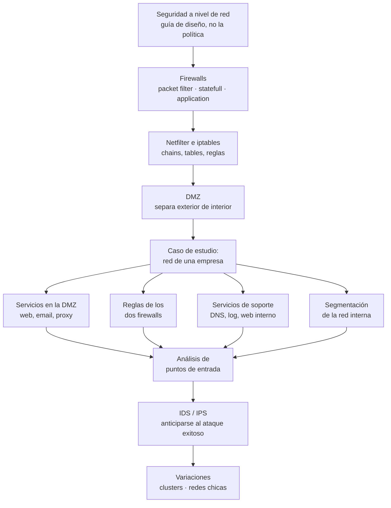

# Clase 10 — Seguridad en la empresa

> **29/10/2026** — jueves, **teoría** · [Filminas](../../raw/clases/Clase%2011%20-%20Seguridad%20en%20Redes.pdf) (36 láminas) · **sin transcripción ni video**: la clase todavía no se dictó, y el deck se llama `Clase 11 - Seguridad en Redes.pdf` (ver [[#Estado de las fuentes|Estado de las fuentes]])
> Viene de: [[clase-09-flujo-de-informacion|Clase 09 — Flujo de información]] · Cruza con: [[clase-06-politicas-de-seguridad-y-control-de-acceso|Clase 06 — Políticas de seguridad y control de acceso]] y [[clase-08-principios-de-diseno-y-vulnerabilidades|Clase 08 — Principios de diseño y vulnerabilidades]]
> Guía del tramo: **Guía 10 — Seguridad en la empresa**, práctica del 09/11 *(según el [[cronograma]]; todavía no está en el vault)*
> Lectura recomendada al cerrar (filmina 36): **Bishop, cap. 26** — *Network Security*, que en la edición del vault es el **cap. 28** ([[bibliografia|Bibliografía]])
> Sigue en: **Clase 11 — Protección de datos** (05/11), sin nota propia porque no hay deck de filminas: su única fuente es [[video-12-proteccion-de-datos-personales|video-12]]

## Mapa de la clase

**El deck está partido en dos mitades desiguales, y esa partición es la decisión pedagógica.** Las primeras quince láminas son **vocabulario y herramientas** —qué es un firewall, de qué tres tipos, cómo se configura con `iptables`, qué es una DMZ—; las veintiuna que siguen son **un solo caso de estudio corrido**, la red de una empresa con DMZ, dos firewalls y media docena de servidores. La clase no da definiciones sueltas y después un ejemplo aparte para ilustrarlas: da el caso, y las filminas 16 a 35 son ese caso desplegándose servicio por servicio.

Que las herramientas vayan primero no es orden alfabético. La filmina de apertura declara dos cosas que gobiernan todo lo demás: que esta unidad es **aplicación** de principios ya vistos y no principios nuevos, y que **se parte de una política de seguridad a implementar**. El firewall no decide qué está permitido; ejecuta una decisión tomada antes, en la [[clase-06-politicas-de-seguridad-y-control-de-acceso|Clase 06]]. Por eso hace falta saber primero qué puede hacer cada tipo de firewall, para recién después poder leer las reglas del caso como lo que son: una política concreta escrita con esas capacidades. Y dentro del caso, el patrón se repite tres veces —implementación, y después una filmina aparte de **consecuencias** con el principio de diseño anotado al margen—: los mecanismos son el medio, las consecuencias son el punto.

El último tercio invierte el movimiento. Después de trece filminas construyendo un diseño que minimiza probabilidad e impacto, la clase declara que **es posible que algún ataque sea exitoso** y dedica cuatro láminas a qué hacer entonces; y cierra admitiendo dos veces que un principio de diseño cede ante una restricción práctica —el DNS interno y la unificación de servidores en redes chicas—. Es coherente con la primera filmina, que llamaba a los principios *guías*: un deck que terminara con la arquitectura perfecta se contradiría a sí mismo.

## El recorrido, tramo por tramo

| # | Tramo | Qué se dio | Dónde está desarrollado |
|---|---|---|---|
| 1 | **Seguridad a nivel de red** (2-4) | Tres condiciones antes de cualquier diagrama: es aplicación de principios ya vistos, se parte de una política ya definida, y los principios son guías. Y el límite explícito: el diseño de red es **una capa**, no la solución completa. Cierra con el diagrama de Bishop que estructura las 32 filminas restantes | [[seguridad-a-nivel-de-red\|Seguridad a nivel de red]] |
| 2 | **Firewalls: los tres tipos** (5-9) | Host que controla el acceso a una red, en tres variantes de menor a mayor inspección: packet filter, statefull packet filter y application firewall o proxy. **A mayor inspección, mayor costo y mayor especificidad** | [[firewalls\|Firewalls]] |
| 3 | **Netfilter e iptables** (10-13) | El firewall por defecto de Linux: tablas, chains, policy por defecto, y seis comandos de ejemplo explicados bandera por bandera | [[netfilter-e-iptables\|Netfilter e iptables]] |
| 4 | **Zona desmilitarizada** (14-15) | Subred que separa la red interna de la externa, también llamada red perimetral. Sus dos razones de ser: aislar los servicios expuestos y diferenciar servicios internos de externos | [[zona-desmilitarizada\|Zona desmilitarizada]] |
| 5 | **Servicios en la DMZ** (16-21) | Arranca el caso de estudio. Web como *Bastion Host* con la carga de órdenes desacoplada, email con dos servidores y reescritura de headers, y el proxy web saliente. Con filmina de consecuencias para los dos primeros | [[diseno-de-servicios-en-la-dmz\|Diseño de servicios en la DMZ]] |
| 6 | **Reglas de los dos firewalls** (22-24) | La política concreta de cada uno, y su asimetría: en el sentido DMZ→interna el firewall interno sólo deja pasar SMTP. Más NAT y rechazo por defecto en ambos | [[reglas-de-los-firewalls-externo-e-interno\|Reglas de los firewalls externo e interno]] |
| 7 | **Servicios de soporte** (25-27) | DNS de la DMZ y DNS interno, log server de sólo agregado con medio de sólo escritura, y web server interno de *staging*. Acá la clase **admite por primera vez violar un principio** y da la mitigación | [[servicios-de-soporte-dns-log-y-proxy\|Servicios de soporte: DNS, log y proxy]] |
| 8 | **Segmentación de la red interna** (28) | «Adentro» no es un bloque homogéneo: subredes por grupo, cada una arbitrada por un firewall. El ejemplo de la cátedra niega el tráfico de desarrollo hacia la red corporativa | [[segmentacion-de-la-red-interna\|Segmentación de la red interna]] |
| 9 | **Análisis de puntos de entrada** (29-31) | Las tres superficies externas y qué cubre cada una; la premisa de que algún ataque puede ser exitoso; y el trato **asimétrico** del mismo evento según la capa donde ocurre | [[analisis-de-puntos-de-entrada\|Análisis de puntos de entrada]] |
| 10 | **IDS e IPS** (32-33) | El `IDS` analiza eventos y **complementa** el control manual; el `IPS` agrega la respuesta automática, casi siempre bloquear el origen en el firewall | [[deteccion-y-prevencion-de-intrusiones\|Detección y prevención de intrusiones]] |
| 11 | **Variaciones** (34-35) | Clusters de firewalls, donde sólo el packet filter escala sin sincronizar nodos; y redes chicas, con unificación de servidores —paliada con virtualización— o tercerización de la DMZ | [[variaciones-de-la-arquitectura\|Variaciones de la arquitectura]] |

## Las cinco ideas que hay que llevarse

1. **El firewall implementa una política, no la define.** Es la primera frase de la clase y la costura exacta con la [[clase-06-politicas-de-seguridad-y-control-de-acceso|Clase 06]]: qué está permitido se decide en otro lugar del programa; acá se decide **cómo se lo fuerza**.
2. **A mayor capacidad de inspección, mayor costo y mayor especificidad.** Un packet filter es barato y genérico pero ciego al contenido; un application firewall ve el contenido pero entiende **un** protocolo. Por eso el caso de estudio usa los tres a la vez, en distintos puntos de la misma red.
3. **La pregunta no es qué mecanismo hay, sino qué pasa si cae.** Las filminas de consecuencias contestan siempre lo mismo —*si el servidor X es comprometido, la red interna no se ve afectada*— y cada vez con una razón de diseño distinta: no accede a recursos internos, su dirección visible es la del firewall externo, la administración remota sólo entra desde adentro.
4. **La misma capa dice cuánto vale una señal.** Un ataque en el perímetro es rutina y se registra para estadística; el mismo ataque adentro de la DMZ es alarma, porque ahí **no debiera haber ataques** y su sola presencia implica haber pasado el firewall externo.
5. **El diseño ideal cede dos veces, y las dos con mitigación.** El DNS interno viola mecanismos exclusivos y se compensa fijando las direcciones de los firewalls en cada servidor; la unificación de servidores de una red chica viola lo mismo y se compensa con virtualización. Ninguna de las dos se presenta como error: se presentan como compromisos.

## Para el parcial

Esta clase entra en el **segundo parcial** (19/11), dentro del Bloque 2 — Seguridad.

- **Los tres tipos de firewall y su orden de capacidad**, con la [[firewalls#La progresión, y por qué el caso de estudio usa los tres|progresión completa]]: es la base de cualquier pregunta que pida justificar por qué un firewall dado no alcanza para una tarea dada.
- **Las banderas de `iptables`** de las filminas 12-13, transcriptas y explicadas una por una en [[netfilter-e-iptables#Los seis comandos de las filminas 12 y 13|Netfilter e iptables]]: `-A` contra `-P`, `-i`/`-o`, `-s`/`-d`, `-p`, `--dport`/`--sport`, `-m state`, `-m multiport`, `-m limit`, y la chain `FORWARD` para tráfico ruteado.
- **Qué firewall permite qué**, con la [[reglas-de-los-firewalls-externo-e-interno#La asimetría entre los dos firewalls|asimetría entre los dos]] como el punto que más se presta a error.
- **Consecuencias, no sólo mecanismos.** Las filminas 17, 20 y 24 son candidatas directas a la pregunta *«si el servidor X es comprometido, ¿qué información queda expuesta?»*.
- **Por qué la DMZ trata los ataques distinto que el perímetro**, con las [[analisis-de-puntos-de-entrada#Tratamiento asimétrico según dónde ocurre el ataque|tres causas posibles]] de un ataque exitoso ahí adentro.
- **`IDS` complementa, `IPS` actúa** — [[deteccion-y-prevencion-de-intrusiones#La distinción exacta, y por qué importa el orden|la distinción exacta]], que aparece en casi cualquier examen de seguridad de redes.
- **Las dos excepciones admitidas** al diseño ideal: el [[servicios-de-soporte-dns-log-y-proxy#DNS Server interno|DNS interno]] y la [[variaciones-de-la-arquitectura#Unificación de servidores|unificación de servidores]]. Son el mejor material para una pregunta de «justifique un trade-off»: la respuesta no es «está mal», es «viola X, se mitiga con Y, porque Z no es viable acá».

## Estado de las fuentes

**Fuente única: las 36 filminas de `Clase 11 - Seguridad en Redes.pdf`.** La clase todavía no se dictó —la fecha del cronograma es el 29/10/2026, aún por delante—, así que no hay transcripción ni apuntes de alumno, y **ningún video de la cátedra la cubre**: se verificó contra [[videografia|Videografía]], y la propia nota de [[video-12-proteccion-de-datos-personales|video-12]] lo aclara en su tercera corrección al catálogo, después de que una versión anterior lo mapeara por error también a esta clase. Todo lo que no sale literal de una filmina va rotulado *(lectura nuestra)* o *(inferencia nuestra)* en el propio párrafo donde se afirma, dentro de cada uno de los once conceptos.

**Que este deck sea el material de la Clase 10 es inferencia nuestra.** El cronograma llama a la clase del 29/10 «Seguridad en la empresa» y le asigna la Guía 10 del 09/11; el archivo, en cambio, se llama `Clase 11`. La cátedra numera sus decks con una numeración histórica propia que no coincide con la de esta cursada —el mismo desfase que ya aparece en `raw/practicas/` y que declara el [[cronograma#Doble numeración: los decks de la cátedra contra las clases del cronograma|cronograma]]—, y el contenido del deck encaja con el título del cronograma; ninguna fuente lo declara explícitamente. Las 36 filminas están cubiertas, repartidas en los once conceptos de la tabla de arriba.

> [!discrepancia]- Seis erratas de tipeo y una posible inconsistencia de contenido, todas verificadas contra la página renderizada
> | Filmina | Qué dice | Qué corresponde |
> |---|---|---|
> | 16 | *"mueve a zona no accesible **pro** el web server"* | *por* — falta la `r` |
> | 17 | *"no accede a **recursso** de la red interna"* | *recursos* — falta la `o` |
> | 26 | *"se guardan en el **filessytem**"* | *filesystem* — letras trastocadas |
> | 31 | *"Tanto exitoso como no **existosos**"* | *exitosos*, y sin la falta de concordancia en número |
> | 33 | *"un **niel** más adelante"* | *nivel* — falta la `v` |
> | 33 | *"llevar a cabo **aciones**"* | *acciones* |
> | 23 | *"SMTP saliente… redireccionado a **web server** en DMZ"* | el resto del caso esperaría *mail server*: la filmina 22 redirige el SMTP entrante al mail server, y en ninguna otra parte del deck el servidor web recibe SMTP. **No es un typo sino una posible inconsistencia de contenido**, y sin la clase en vivo no hay cómo confirmarlo, así que se deja tal como está escrita — ver [[reglas-de-los-firewalls-externo-e-interno\|Reglas de los firewalls externo e interno]] |
>
> Ninguna de las seis erratas cambia el significado de su lámina. Todas se verificaron contra la página renderizada a 150 o 300 dpi, no contra el texto extraído.

> [!nota]- Cuatro cabos sueltos
> - **La Guía 10 no está en el vault.** El cronograma la ubica en la práctica del 09/11 con el mismo título que la clase; cuando se ingiera habrá que ver si confirma o corrige el mapeo deck↔clase.
> - **El rótulo «SecComm»** de la filmina 3 no se define ni se vuelve a usar en todo el deck. La lectura como *Secure Communications* es inferencia nuestra, desarrollada en [[seguridad-a-nivel-de-red#El límite explícito del diseño de red (filmina 3)|Seguridad a nivel de red]].
> - **El desfasaje de la lectura recomendada es de +2, no de +1.** La filmina 36 pide «el capítulo 26», y la filmina 4 ya había citado ese número con el título puesto —*"Cap 26 – Network Security"*—; en la edición del vault ese capítulo es el 28. Es la única lectura de la materia donde el corrimiento queda confirmado por texto explícito y no por tema ([[bibliografia|Bibliografía]]).
> - **Pendiente para cuando se dicte.** Contrastar esta lectura con la transcripción real y agregar los ejemplos que el docente dé en vivo, empezando por los dos lugares donde el deck se queda en el nivel de arquitectura: qué producto o firma concreta hay detrás de un `IDS`, y cómo se implementa el medio de sólo escritura del log server.
