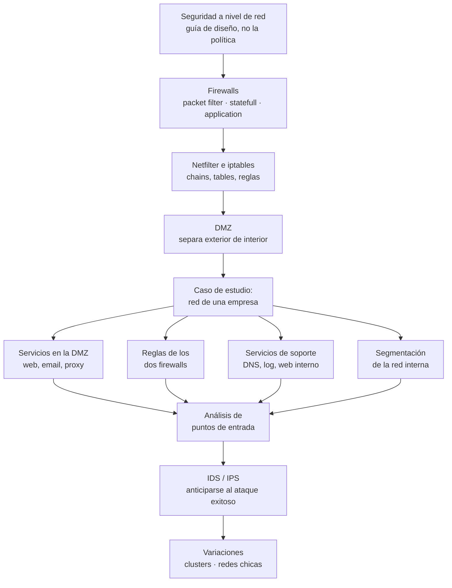
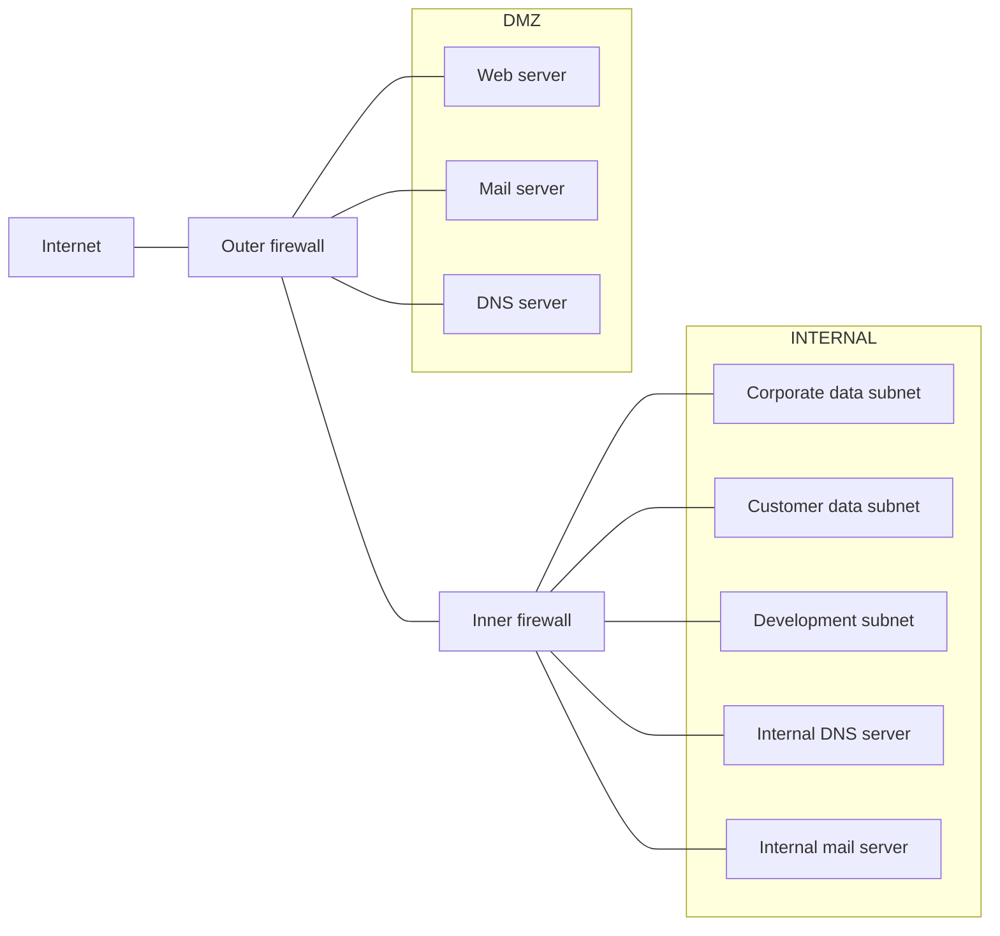

# Clase 10 — Seguridad en la empresa

> **29/10/2026** — jueves, **teoría** · [Filminas](../../raw/clases/Clase%2011%20-%20Seguridad%20en%20Redes.pdf) (36 láminas) · Viene de: [[clase-09-flujo-de-informacion|Clase 09 — Flujo de información]]
> Guía: **Guía 10 — Seguridad en la empresa**, práctica del 09/11 *(según el [[cronograma]]; todavía no ingerida)*
> Cruza con: [[clase-06-politicas-de-seguridad-y-control-de-acceso|Clase 06 — Políticas de seguridad y control de acceso]] *(nombre de archivo inferido del cronograma; la escribe otro agente en paralelo)* — los firewalls de esta clase **implementan** una política, no la definen.

> **Aviso de fuente e inferencia — leer antes de lo demás.** El cronograma llama a esta clase del 29/10 "Seguridad en la empresa" y le asigna la **Guía 10 — Seguridad en la empresa** del 09/11. El PDF que se usa como fuente se llama, en cambio, `Clase 11 - Seguridad en Redes.pdf`: la cátedra numera los archivos de sus decks con una numeración histórica propia, que no coincide con el número de clase del cronograma de esta cursada — el mismo desfase que ya aparece con `Clase 1.pdf`/`Clase 3.pdf`/`Clase 4.pdf` de `raw/practicas/`. **Que este deck sea el material de la Clase 10 es inferencia nuestra**, apoyada en que su contenido —diseño seguro de la red de una empresa, con un caso de estudio corporativo de punta a punta— encaja con el título del cronograma y con el temario de la Guía 10; ninguna fuente lo declara explícitamente.
>
> **La clase todavía no se dictó.** Hoy es 04/09/2026 y el 29/10 es una fecha futura. Esta nota está escrita **solo contra las filminas**, sin transcripción ni grabación (ver [[#Estado de las fuentes|Estado de las fuentes]]), y habrá que revisarla cuando la clase ocurra.

## Mapa de la clase



Las 36 filminas tienen una estructura muy marcada en dos mitades. Las primeras 15 (2-15) son **vocabulario y herramientas**: qué es un firewall, de qué tres tipos, cómo se configura con `iptables` y qué es una DMZ. Las 21 que siguen (16-36) son **un solo caso de estudio corrido**, la red de una empresa con DMZ, dos firewalls y media docena de servidores, que la cátedra desarrolla servicio por servicio y decisión por decisión. La clase no da definiciones sueltas y después un ejemplo aparte: da el caso, y las filminas 16 a 35 son ese caso desplegándose.

---

## 1. Seguridad a nivel de red (filminas 2-4)

*(Filminas 2-4 del deck.)* Concepto: **[[seguridad-a-nivel-de-red|Seguridad a nivel de red]]**.

La filmina de apertura (2) fija tres ideas que gobiernan toda la clase:

- Esta unidad es **aplicación** de principios de diseño ya vistos, no principios nuevos — la clase de [[video-06-principios-de-diseno-2026|Principios de diseño]] es el fundamento y ésta es su instancia en la arquitectura de red.
- **Se parte de una política de seguridad a implementar.** El firewall no decide qué está permitido: ejecuta una decisión tomada antes, en otro lugar del programa. Es la costura exacta con [[clase-06-politicas-de-seguridad-y-control-de-acceso|Clase 06 — Políticas de seguridad y control de acceso]] *(nombre de archivo inferido)*: esa clase desarrolla cómo se escribe y se modela una política; ésta desarrolla cómo una arquitectura de red la hace cumplir.
- Los principios de diseño son **guías**, no una receta única — de ahí que la filmina 34-35 cierre con variaciones legítimas del mismo esquema.

La filmina 3, *"Aplicaciones seguras... SecComm"*, es la advertencia que evita leer el resto de la clase como si la red lo resolviera todo:

- La estructura de red debe implementar mecanismos de control que **fuercen** la política definida.
- Es probable que **no** se pueda contemplar toda la política mediante el diseño de red — falta seguridad en sistemas y en aplicaciones, y faltan procedimientos manuales.

Dicho de otro modo: el diseño de red de esta clase es **una capa**, no la solución completa. La cátedra lo deja explícito antes de mostrar ni un solo diagrama, y es la razón por la que el caso de estudio, más adelante, insiste tanto en la **defensa en profundidad** — varias capas que fallan de a una, no una sola que si cae expone todo.

La filmina 4 presenta el diagrama que estructura las 32 filminas restantes: la red de una empresa con `Internet` a la izquierda, un `Outer firewall`, una `DMZ` con `Web server`, `Mail server` y `DNS server`, un `Inner firewall`, y la red `INTERNAL` con `Corporate data subnet`, `Customer data subnet`, `Development subnet`, `Internal DNS server` e `Internal mail server`. La filmina cita la fuente al pie: *"Figura tomada de Computer Security Art & Science – Matt Bishop. Cap 26 – Network Security – pp 780"* — es el mismo capítulo que la filmina de cierre (36) vuelve a recomendar, así que el caso de estudio entero está tomado de Bishop, no es invención de la cátedra.



Ese diagrama es la referencia constante del resto de la nota: cada servicio y cada regla de firewall que sigue se ubica en alguno de estos nodos.

## 2. Firewalls: los tres tipos (filminas 5-9)

*(Filminas 5-9.)* Concepto: **[[firewalls|Firewalls]]**.

Definición de la filmina 5: **son hosts que controlan el acceso a una red**, ubicados en los dos puntos de mediación del diagrama —`Outer firewall` entre Internet y la DMZ, `Inner firewall` entre la DMZ y la red interna—. La cátedra distingue tres tipos, de menor a mayor capacidad de inspección:

1. **Packet filters** (filmina 6). Controlan el acceso según el **sentido** del tráfico (entrante/saliente) y características del paquete: host y puerto origen/destino, flags (`Syn`, `Rst`), protocolo de transporte (`TCP`, `IP`, `ICMP`). Reglas del tipo `src:*:* dst:www.ss.com:80 allow`. Es la forma **más simple y transparente** de control, **no mira el contenido**, y su ejemplo canónico son los routers.
2. **Statefull packet filters** (filmina 7). Igual que los anteriores, pero **recuerdan conexiones pasadas**: agregan a la regla la capacidad de determinar si la conexión es nueva, existente o inválida, y pueden manipular paquetes — por ejemplo, aplicar `NAT`. Es la propiedad que después usan las reglas de `iptables` con `-m state --state NEW,ESTABLISHED`.
3. **Application firewalls** (filminas 8-9), también llamados proxy, proxy firewall o `WAF` (*Web Application Firewall*). Es un **agente intermediario**: cada parte dialoga con el proxy pensando que es la otra parte, y el proxy decide si el mensaje pasa, se descarta o se modifica. Puede además registrar eventos o disparar alarmas. Es **específico de un protocolo de aplicación** —web proxy, ftp proxy, email proxy—, aunque muchos manejan varios protocolos a la vez.

La filmina 9 da el ejemplo que ancla el tipo 3, y es literalmente el flujo que el caso de estudio implementa después en el `Mail server` de la DMZ: los emails llegan al firewall, que ensambla los paquetes y reconstruye el email; si hay adjuntos los escanea y descarta el email o el adjunto si detecta un problema; revisa el origen contra una lista de spam y lo descarta si aparece ahí; y recién entonces envía el email al servidor destino.

La progresión importa para el parcial: **a mayor capacidad de inspección, mayor costo y mayor especificidad**. Un packet filter es barato y genérico pero ciego al contenido; un application firewall ve el contenido pero sólo entiende un protocolo. El caso de estudio de las filminas 16-27 combina los tres niveles a propósito: `iptables` como packet/statefull filter en los dos firewalls perimetrales, y proxies de aplicación (email, web) como una capa más adentro.

## 3. Netfilter e iptables (filminas 10-13)

*(Filminas 10-13.)* Concepto: **[[netfilter-e-iptables|Netfilter e iptables]]**.

`Netfilter`/`iptables` es **el firewall por defecto en Linux** (filmina 10). Define **tablas** (*tables*) con **reglas** (*policies*) para distintos tipos de operaciones, llamadas **chains**. Las chains más comunes, en la tabla `FILTER`:

- `INPUT` — paquetes entrantes.
- `OUTPUT` — paquetes salientes.
- `FORWARD` — paquetes que se rutean entre redes (el host actúa de router).

Cada chain tiene una acción por defecto: `ACCEPT` o `DROP`.

La filmina 11 completa el panorama con las **otras tablas**, cada una definida por un módulo distinto:

| Tabla | Para qué sirve |
|---|---|
| `Filter` | Grupo por defecto; el original de Netfilter, para reglas de firewall |
| `Nat` | Traducción de direcciones de red |
| `Raw` | Reglas que acceden en crudo a los paquetes |
| `Security` | Reglas de acceso discrecional aplicadas cuando hay una capa de acceso mandatorio (por ejemplo, SELinux) |
| `Mangle` | Modificar headers por temas de QoS, TTL, o marcarlos para darles contexto |

### Los comandos de las filminas 12 y 13, transcriptos literalmente

Verificados contra la página renderizada. Cada bloque es exactamente el texto de la filmina, con sus flags explicados debajo.

**Bloquear tráfico desde una IP** (filmina 12):

```
iptables -A INPUT -s "201.232.1.24" -j DROP
```

`-A INPUT` agrega (*append*) la regla al final de la chain `INPUT`. `-s` fija la dirección **origen** (*source*) a matchear. `-j DROP` es el *target*: si la regla matchea, **descarta** el paquete sin avisar al emisor.

**Denegar tráfico entrante por defecto** (filmina 12):

```
iptables -P INPUT DROP
```

`-P` fija la **policy** (acción por defecto) de la chain, no agrega una regla: es lo que corre cuando **ninguna** regla explícita matcheó. Cambia la chain entera a *denegar por defecto*, que es el patrón de diseño que exige `Mediación completa` — todo lo no permitido explícitamente queda afuera.

**Permitir conexiones SSH desde una IP** (filmina 12), dos reglas que van juntas:

```
iptables -A INPUT -i eth0 -p tcp -s 192.168.200.0/24 --dport 22
          -m state --state NEW,ESTABLISHED -j ACCEPT

iptables -A OUTPUT -o eth0 -p tcp --sport 22
          -m state --state ESTABLISHED -j ACCEPT
```

`-i eth0` / `-o eth0` fijan la interfaz de **entrada** (*in*) o **salida** (*out*) por la que debe llegar/salir el paquete. `-p tcp` fija el protocolo de transporte. `-s 192.168.200.0/24` restringe el origen a esa subred. `--dport 22` / `--sport 22` fijan el puerto **destino** o **origen** — 22 es el puerto de SSH. `-m state --state NEW,ESTABLISHED` invoca el módulo *statefull*: acepta paquetes que **inician** una conexión nueva o que pertenecen a una **ya establecida**. La regla de `OUTPUT` sólo acepta `ESTABLISHED` —no `NEW`— porque la conexión la abre siempre el cliente hacia adentro; el servidor nunca inicia una sesión SSH saliente por ese puerto, sólo responde dentro de una ya abierta. `-j ACCEPT` deja pasar el paquete.

**Permitir conexiones http/s** (filmina 13), mismo patrón que SSH pero con dos puertos a la vez:

```
iptables -A INPUT -i eth0 -p tcp -m multiport --dports 80,443
          -m state --state NEW,ESTABLISHED -j ACCEPT
iptables -A OUTPUT -o eth0 -p tcp -m multiport --sports 80,443
          -m state --state ESTABLISHED -j ACCEPT
```

`-m multiport --dports 80,443` invoca el módulo `multiport` para matchear **una lista** de puertos destino (HTTP y HTTPS) en una sola regla, en vez de escribir una regla por puerto.

**Prevenir DoS** (filmina 13):

```
iptables -A INPUT -p tcp --dport 80
          -m limit --limit 25/minute --limit-burst 100 -j ACCEPT
```

`-m limit` invoca el módulo de *rate limiting*. `--limit 25/minute` fija el régimen sostenido: como máximo 25 paquetes por minuto matchean y se aceptan por esta regla. `--limit-burst 100` es el balde inicial: permite una ráfaga de hasta 100 antes de que el límite sostenido empiece a aplicar. Ojo con el efecto de esta regla tal como está escrita: **no** hay una regla de `DROP` después para el tráfico que excede el límite, así que lo único que hace esta línea sola es dejar de **acordarse ACCEPT explícito** para el exceso — el resultado depende de la política por defecto de la chain. Es una precisión nuestra, no algo que la filmina explicite.

**Permitir conexiones desde la red interna a la externa** (filmina 13), la única que opera sobre `FORWARD`:

```
# eth0 – red interna, eth1 - internet
iptables -A FORWARD -i eth0 -o eth1 -j ACCEPT
```

Esta regla es la única de las seis que toca la chain `FORWARD`: el host actúa de **router** entre dos interfaces, no de origen o destino final del tráfico, que es exactamente el rol de un firewall perimetral con dos patas de red.

## 4. Zona desmilitarizada (filminas 14-15)

*(Filminas 14-15.)* Concepto: **[[zona-desmilitarizada|Zona desmilitarizada]]**.

**DMZ** (*Demilitarized Zone*): subred que separa la red interna de la externa, también conocida como **red perimetral** (filmina 14). En el diagrama de la filmina 4, es donde viven `Web server`, `Mail server` y `DNS server` — todo lo que Internet necesita alcanzar directamente.

La filmina 15 da las dos razones de ser de la DMZ:

- **Permite aislar los servicios accesibles desde el exterior de la red interna.** Si un atacante ingresa a la DMZ, la red interna sigue protegida — es el mismo principio de `Mecanismos exclusivos` y `Separación de privilegios` que reaparece etiquetado explícitamente en las consecuencias del caso de estudio.
- **Permite diferenciar claramente los servicios internos y externos.**

La filmina ilustra la idea con una foto de la frontera entre las dos Coreas en Panmunjom *(identificación nuestra de la imagen)*: la DMZ militar real, de la que el término toma el nombre, es literalmente una franja de terreno entre dos zonas que **no pertenece del todo a ninguna**, vigilada desde ambos lados. Es una analogía visual, no un contenido técnico adicional.

## 5. Caso de estudio: diseño de servicios en la DMZ (filminas 16-21)

*(Filminas 16-21.)* Concepto: **[[diseno-de-servicios-en-la-dmz|Diseño de servicios en la DMZ]]**.

A partir de acá la clase deja de dar definiciones y desarrolla **un solo caso de estudio**: cómo se implementa, servicio por servicio, la red de la filmina 4. El patrón se repite tres veces —implementación, y después una filmina aparte de **consecuencias**— y las consecuencias son la parte que hay que estudiar con más cuidado: cada una nombra el principio de diseño que la sostiene, con etiquetas azules al margen (`Mediación Completa`, `Separación de Privilegios`, `Mecanismos Exclusivos`, `Menor privilegio`, `Aceptación Psicológica`) que retoman el vocabulario de [[video-06-principios-de-diseno-2026|Principios de diseño]].

### Servicio web (filminas 16-17)

Brindado por un **servidor web**, ubicado en la DMZ, de modo que los requerimientos externos **no llegan a la red interna**. Es un **servidor endurecido** (*Bastion Host*):

- Sólo brinda los servicios necesarios (web, SSH).
- La conexión remota (SSH) está permitida **sólo desde el firewall interno**, y con certificados.
- La **carga de nuevas órdenes está desacoplada**: la aplicación web procesa la orden y la graba; otro proceso la encripta y la mueve a una zona no accesible por el web server; un proceso en la red interna recupera los archivos.

> **Errata de la filmina.** En la filmina 16, el tercer punto de la carga desacoplada dice *"mueve a zona no accesible pro el web server"*: falta la **r** de *"por"*. Verificado contra la página renderizada — no es un artefacto de extracción, la palabra mal escrita está en la lámina.

Ese desacople de la carga es la pieza más sutil del diseño: si el web server sólo **escribe** en una zona que después otro proceso lee y mueve, comprometer el web server no le da al atacante acceso de lectura a lo que ya se subió — es la misma lógica de `Log Server` de la filmina 26, aplicada a órdenes en vez de a logs.

**Consecuencias** (filmina 17): todos los requerimientos externos pasan por el firewall externo y llegan al servidor web; el servidor web **no accede a recursos de la red interna**; si el servidor web es comprometido, la red interna no se ve afectada; afuera de la red, la dirección del servidor web **es la del firewall externo** —el atacante nunca ve la IP real del servidor—; el servidor sólo acepta conexiones administrativas remotas desde la red interna; y comprometer el servidor **no revela información de clientes**, porque esa información nunca estuvo ahí.

> **Errata de la filmina.** En la filmina 17, el segundo punto dice *"El servidor web no accede a recursso de la red interna"*: falta la **o** de *"recursos"*. Verificado contra la página renderizada.

### Servicio email (filminas 18-20)

Brindado por un **servidor de email**, con **un servidor en la DMZ y otro en la red interna** — a diferencia del web, que tiene una sola instancia expuesta más una copia interna (ver más abajo). En la DMZ, administración remota vía SSH.

Camino entrante (filmina 18): recibe email desde Internet y lo reenvía a la red interna, revisando encabezados, contenido y adjuntos; filtra spam y virus conocidos; elimina emails mal formados (posibles ataques); reescribe direcciones para que apunten al email interno (ejemplo de la filmina: `xx@drib.org` → `xx@smtpe1.drig.org`); reenvía los emails "sanos" al servidor interno. La filmina deja anotado que **el filtro de spam, virus y emails mal formados puede ocurrir en el firewall externo** — es una alternativa de dónde ubicar ese control, no una obligación.

Camino saliente (filmina 19): recibe email de la red interna y lo envía a Internet, con los mismos chequeos de encabezado/contenido/adjuntos y spam/virus, más dos controles que el camino entrante no tiene: **filtra contenidos confidenciales** (marcas de agua, palabras clave) y **revisa todo el header y reemplaza hosts, IPs y usuarios internos** por la dirección/nombre del firewall externo — la misma lógica de ocultamiento que ya se vio para el web server, aplicada esta vez encabezado por encabezado.

**Consecuencias** (filmina 20): todos los emails pasan por el servidor de email en la DMZ; el servidor no accede a recursos internos; si se compromete, la red interna no se ve afectada; afuera de la red la dirección del servidor es la del firewall externo; el servidor sólo acepta administración remota desde la red interna; y **afuera de la red no se conocen servidores ni direcciones internas** — la generalización del punto anterior de reescritura de headers.

### Servicio web proxy (filmina 21)

Brindado por un servidor **web proxy** en la DMZ. Recibe requerimientos web dirigidos a terceros —es el proxy saliente que usa la red interna para navegar—, verifica que el origen sea la dirección del firewall interno, filtra requerimientos mal formados (posibles ataques lanzados desde la propia red interna, o uso indebido del protocolo, como un servidor SSH externo escuchando en el puerto 80), prohíbe el acceso a páginas no permitidas y, opcionalmente, cachea los recursos más solicitados.

Este servicio no tiene una filmina de consecuencias propia: sus consecuencias quedan absorbidas en las del [[#6. Caso de estudio: reglas de los firewalls externo e interno (filminas 22-24)|firewall interno]], que es quien fuerza que **todo** el tráfico http/s saliente pase por este proxy.

## 6. Caso de estudio: reglas de los firewalls externo e interno (filminas 22-24)

*(Filminas 22-24.)* Concepto: **[[reglas-de-los-firewalls-externo-e-interno|Reglas de los firewalls externo e interno]]**.

Ésta es la sección que traduce el capítulo 3 —[[#3. Netfilter e iptables (filminas 10-13)|Netfilter e iptables]]— y el capítulo 5 —los tres servicios recién descriptos— en **política concreta de cada firewall**. Es también el punto exacto de contacto con [[clase-06-politicas-de-seguridad-y-control-de-acceso|Clase 06]] *(nombre inferido)*: las reglas de abajo son la **implementación** de una política; qué modelo la sostiene (discrecional, obligatorio, basado en roles) es tema de esa otra clase, no de ésta.

**Firewall externo** (filmina 22):

- Permite tráfico **entrante** SMTP, HTTP y HTTPS: redirecciona SMTP al mail server, HTTP/S al web server.
- Permite tráfico **saliente** HTTP/S y SMTP: SMTP sólo desde el mail server de la DMZ, HTTP/S sólo desde el web proxy server de la DMZ.
- Realiza NAT para ocultar direcciones internas.
- Rechaza cualquier otro tipo de tráfico.

**Firewall interno** (filmina 23):

- Permite tráfico de la red interna a la DMZ: SMTP saliente sólo desde el servidor SMTP interno, redireccionado a **web server** en DMZ; HTTP/S saliente redireccionado (transparentemente) al proxy web; SSH sólo desde el host administrativo hacia servidores de la DMZ.
- Permite tráfico de la DMZ a la red interna: **sólo** tráfico SMTP proveniente del email server.
- Realiza NAT para ocultar direcciones internas.
- Rechaza cualquier otro tipo de tráfico.

*(Lectura nuestra.)* La filmina 23 dice literalmente *"redireccionado a web server en DMZ"* para este tráfico SMTP saliente, verificado contra la página renderizada a 300 dpi. Llama la atención frente al resto del caso de estudio: la filmina 22 (firewall externo) sí redirige el SMTP entrante al **mail server**, y en ningún otro lugar de la clase el servidor web recibe tráfico SMTP. Es posible que la propia filmina tenga un error de contenido —debería decir "mail server"—, pero no hay forma de confirmarlo sin la transcripción de la clase, así que se deja tal como está escrita en vez de corregirla en silencio.

Dos observaciones que conviene tener explícitas para el parcial, sobre la asimetría entre ambos firewalls:

- **El firewall interno es más restrictivo que el externo en la dirección DMZ→interna.** El externo deja pasar SMTP y HTTP/S en ambos sentidos (con las restricciones de origen ya vistas); el interno, en el sentido DMZ→interna, sólo deja pasar SMTP. La DMZ nunca inicia una conexión web hacia la red interna, porque no hay ninguna razón operativa para que lo haga.
- **El proxy web recibe tráfico redireccionado, no solicitado directamente por el usuario.** La filmina dice *"redirecciona (transparentemente)"* — el usuario de la red interna no configura el proxy a mano, el propio firewall interno intercepta el tráfico HTTP/S saliente y lo fuerza a pasar por el proxy. Es una instancia concreta de `Mediación Completa`.

**Consecuencias** (filmina 24): toda comunicación con Internet pasa por los firewalls externo **e** interno; la mediación de tráfico web es transparente para el usuario; sólo se permiten conexiones salientes desde servidores conocidos; y la arquitectura permite separar los servicios en diferentes servidores. Las etiquetas de margen en esta filmina son `Mediación Completa`, `Aceptación Psicológica`, `Menor privilegio` y `Mecanismos Exclusivos` — la aceptación psicológica es la que vale la pena resaltar: que el proxy sea transparente significa que el usuario **no necesita saber** que está siendo mediado para seguir usando la red con normalidad, que es justamente lo que ese principio pide.

## 7. Caso de estudio: servicios de soporte — DNS, log y servidor web interno (filminas 25-27)

*(Filminas 25-27.)* Concepto: **[[servicios-de-soporte-dns-log-y-proxy|Servicios de soporte: DNS, log y proxy]]**.

**DNS Server en DMZ** (filmina 25): brinda a los servidores de la DMZ los nombres de los otros servidores, permite reconfigurar la DMZ fácilmente y **sólo incluye información de la DMZ** — no resuelve nada de la red interna.

**DNS Server interno** (filmina 25): resuelve direcciones internas y puede permitir búsquedas de DNS externos, pasando por los firewalls. La propia filmina marca la tensión: *"esto viola el principio de mecanismos exclusivos (todos los servidores usarían este servicio). Como medida extra se suelen configurar las direcciones de los firewalls en cada servidor"*. Es el primer lugar del caso de estudio donde la cátedra **admite** una violación de un principio de diseño en lugar de presentar una arquitectura perfecta, y da la mitigación que la compensa.

**Log Server en DMZ** (filmina 26): recibe logs de todos los servidores de la DMZ; cada servidor **sólo puede agregar** información al log —nunca leerlo ni modificarlo—, y cada uno usa un canal propio. Los logs se guardan en el filesystem **y** en un medio de sólo escritura. Ante un incidente: si un servidor fue comprometido, el log existe en el log server; si el log server fue comprometido, se puede recuperar el log accediendo **físicamente** al medio de sólo escritura. Es la misma lógica de "escribir sin poder leer" que ya apareció en la carga de órdenes del web server (filmina 16), aplicada acá al registro de eventos: ningún servidor comprometido puede borrar su propio rastro.

> **Errata de la filmina.** En la filmina 26, el cuarto punto dice *"Los logs se guardan en el filessytem"*: la palabra correcta es *"filesystem"*, con las letras trastocadas. Verificado contra la página renderizada.

**Web server interno** (filmina 27): mantiene una copia del web server de la DMZ; permite modificar y probar aplicaciones y modificaciones, con algún control de acceso implementado en el servidor; y permite implementar el mecanismo para actualizar la página web del servidor en la DMZ, vía acceso SSH desde una terminal administrativa. Es el servidor "de staging" que cierra el círculo con la actualización de contenido mencionada en el servicio web (filmina 16): nadie edita directamente el servidor expuesto, se edita esta copia interna y de ahí se empuja el cambio.

## 8. Caso de estudio: segmentación de la red interna (filmina 28)

*(Filmina 28.)* Concepto: **[[segmentacion-de-la-red-interna|Segmentación de la red interna]]**.

La red interna se divide en subredes según cada grupo —en el diagrama de la filmina 4: `Corporate data subnet`, `Customer data subnet`, `Development subnet`—, y cada subred está arbitrada por un firewall, probablemente un packet filter firewall, que impide el acceso entre subredes de acuerdo a las políticas. El ejemplo de la propia filmina: **no se permite tráfico desde la red de desarrollo hacia la red corporativa**.

La razón de fondo, que la filmina no dice pero que se sigue directo del resto del caso: la DMZ separa lo externo de lo interno, pero **"interno" no es un bloque homogéneo**. Datos de clientes, datos corporativos y un entorno de desarrollo tienen perfiles de riesgo distintos entre sí — el entorno de desarrollo, en particular, suele tener código y configuraciones menos endurecidas que producción, así que aislarlo de la subred corporativa es la misma defensa en profundidad que ya separaba la DMZ del resto, un nivel más adentro.

## 9. Caso de estudio: análisis de puntos de entrada (filminas 29-31)

*(Filminas 29-31.)* Concepto: **[[analisis-de-puntos-de-entrada|Análisis de puntos de entrada]]**.

La filmina 29 identifica los **puntos externos de entrada** de toda la arquitectura, y para cada uno nombra qué lo cubre:

- Puertos del web server: **el proxy** revisa requerimientos inválidos o sospechosos y los rechaza.
- Puerto del servidor de email: **el proxy** revisa emails buscando mensajes inválidos y los rechaza.
- Problemas de software o hardware **en el firewall mismo**: la mitigación no es un control puntual sino dos principios de diseño combinados — el firewall está diseñado para ser lo más simple posible (menos superficie, menos bugs) y hay **defensa en profundidad** (DMZ más firewall interno), así que un firewall comprometido no es el fin de la seguridad de la red.

Las filminas 30-31, tituladas *"Anticipándose"*, parten de una premisa que reencuadra todo lo anterior: **es posible que algún ataque sea exitoso**. El diseño de las secciones 5 a 8 minimiza la probabilidad y el impacto, pero no la lleva a cero, y esta sección es la respuesta a qué hacer cuando falla. Los recaudos generales (filmina 30): log detallado de eventos, para ayudar el análisis; análisis automático de eventos (`IDS`); ejecución de tareas en base a eventos (`IPS`); inspección manual de eventos.

Distinto tratamiento **según dónde** ocurra el ataque (filminas 30-31):

- **En el firewall externo:** registrar los ataques **no exitosos** e ignorarlos — más que nada para fines estadísticos. Es una decisión de costo: el firewall externo recibe tráfico hostil todo el tiempo, y perseguir cada intento fallido no es productivo.
- **En la DMZ:** interés **particular** en los ataques, tanto exitosos como no exitosos, porque se supone que **no debiera haber ataques en la DMZ** — son la primera indicación de un posible compromiso de la seguridad. Y un ataque en la DMZ implica haber pasado el firewall externo, lo que reduce las causas posibles a tres: un administrador que no es confiable, el firewall externo comprometido, o un fallo de software en la propia DMZ.

> **Errata de la filmina.** En la filmina 31, el primer punto dice *"Tanto exitoso como no existosos"*: además de la falta de concordancia en número (*"exitoso"* en singular), la segunda palabra debería ser *"exitosos"* y no *"existosos"*, con las letras trastocadas. Verificado contra la página renderizada a 150 dpi.

La asimetría es el punto que vale la pena retener: **el mismo evento —un ataque detectado— se trata distinto según la capa**, porque la capa dice qué tan improbable debería ser ese evento. Fuera es esperable y barato de ignorar; adentro de la DMZ es una señal de alarma cara de ignorar.

## 10. Detección y prevención de intrusiones (filminas 32-33)

*(Filminas 32-33.)* Concepto: **[[deteccion-y-prevencion-de-intrusiones|Detección y prevención de intrusiones]]**.

**IDS — Intruder Detection System** (filmina 32): software que analiza eventos y busca patrones que indiquen un posible ataque. Idealmente combina eventos de red (tráfico, conexiones) con eventos de hosts (procesos ejecutados, uso de memoria, sesiones abiertas). Requiere cierta afinación, pero permite encontrar patrones conocidos de ataques, y **complementa al control manual** — no lo reemplaza: debiera realizarse una contrastación manual periódica de que esté funcionando, por ejemplo seleccionando un segmento y comparando eventos contra alertas.

**IPS — Intruder Prevention System** (filmina 33): lleva la detección un nivel más adelante, permitiendo llevar a cabo acciones **al momento** de detectar ataques. Por lo general la acción se limita a bloquear en el firewall las comunicaciones que incluyan al origen del ataque.

> **Errata de la filmina.** El primer punto de la filmina 33 dice *"Lleva la detección de intrusiones un niel más adelante"*: falta la **v** de "nivel"; y el segundo punto escribe *"aciones"* por "acciones". Verificado contra la página renderizada — no es un artefacto de extracción, las palabras mal escritas están en la lámina.

La distinción `IDS`/`IPS` es de manual y aparece en casi cualquier curso de seguridad, pero conviene notar cómo esta clase la ancla: el `IDS` es el que hace posible **saber** qué pasó en la sección anterior —es la herramienta detrás de "registrar ataques" y "tener interés particular en los ataques"—, y el `IPS` es lo que convertiría esa detección en una respuesta automática en lugar de un log para revisar después. La cátedra no da ejemplos concretos de producto ni de firma de ataque; queda en el nivel de arquitectura.

## 11. Variaciones de la arquitectura (filminas 34-35)

*(Filminas 34-35.)* Concepto: **[[variaciones-de-la-arquitectura|Variaciones de la arquitectura]]**.

Después de 30 filminas de un único diseño, la clase cierra reconociendo que **no es la única arquitectura válida** — coherente con la filmina 2, que llamaba a los principios "guías", no receta.

**Clusters de firewalls para redes con ancho de banda muy alto** (filmina 34): fácil de implementar con packet filters; los statefull filters y los application proxies requieren sincronización entre nodos del cluster (*sticky session*), porque el estado de una conexión tiene que seguir siendo visible aunque el paquete siguiente lo atienda otro nodo del cluster. Otra variante es la separación por función en servidores diferentes: un servidor sólo de packet filter, otro sólo de web proxy, otro sólo de SMTP proxy, etcétera — en vez de un firewall monolítico que hace todo.

**Pequeñas redes** (filmina 35): los costos de implementar una solución como la propuesta —dos firewalls, media docena de servidores dedicados— son **prohibitivos** para una empresa chica, así que hace falta un **compromiso entre costo y seguridad**. Dos caminos que la filmina nombra:

- **Unificación de servidores**: juntar varios servicios en una sola máquina. Esto **viola el principio de mecanismos exclusivos** y crea un *single point of failure* — la misma tensión que ya había aparecido con el DNS interno en la filmina 25, ahora generalizada a toda la arquitectura. El paliativo que ofrece la filmina es la **virtualización**: separar lógicamente lo que no se puede separar físicamente.
- **Tercerización de la DMZ**: los servicios externos residen en un datacenter alquilado, en vez de en hardware propio.

La filmina de cierre (36) recomienda el capítulo 26 de *Computer Security Art and Science* de Matt Bishop — el mismo capítulo del que sale el diagrama de la filmina 4 —, así que todo el caso de estudio de esta clase tiene ahí su desarrollo completo, con más variantes y casos de borde de los que el deck alcanza a cubrir.

---

## Para el parcial

Esta clase entra en el **segundo parcial** (19/11), dentro del Bloque 2 — Seguridad. Sin transcripción y sin video que la cubra (ver abajo), lo que sigue es lectura directa de las filminas, ordenada por lo que más probablemente se pregunta:

- **Los tres tipos de firewall y su orden de capacidad**: packet filter (sentido + características del paquete, sin estado, no mira contenido) → statefull (agrega memoria de conexión, puede hacer NAT) → application/proxy (entiende el protocolo, media activamente, es específico de una aplicación). Es la base de cualquier pregunta que pida justificar por qué un firewall dado no alcanza para una tarea dada.
- **Las banderas de `iptables`** de las filminas 12-13, con sus flags: `-A`/`-P` (agregar regla vs. fijar policy por defecto), `-i`/`-o` (interfaz), `-s`/`-d` (origen/destino), `-p` (protocolo), `--dport`/`--sport`, `-m state --state NEW,ESTABLISHED`, `-m multiport --dports`, `-m limit --limit --limit-burst`, y la chain `FORWARD` para tráfico ruteado entre interfaces. Transcriptas literalmente en la [[#3. Netfilter e iptables (filminas 10-13)|sección 3]].
- **Qué firewall permite qué**, exactamente como las filminas 22-23 lo escriben: el externo media Internet↔DMZ, el interno media DMZ↔red interna, y el interno es marcadamente más restrictivo en el sentido DMZ→interna (sólo SMTP) que el externo en ninguno de sus dos sentidos.
- **Consecuencias, no sólo mecanismos.** Cada filmina de "consecuencias" (17, 20, 24) es candidata directa a pregunta de parcial: *"si el servidor X es comprometido, ¿qué información queda expuesta?"* — y la respuesta correcta en los tres casos es "ninguna de la red interna", con una razón de diseño específica detrás (no accede a recursos internos, su dirección visible es la del firewall, admin sólo desde adentro).
- **Por qué la DMZ trata los ataques distinto que el perímetro**: no exitosos e ignorados afuera, cualquier ataque investigado adentro de la DMZ, porque adentro de la DMZ "no debiera haber ataques" y su sola presencia ya implica haber pasado el firewall externo.
- **`IDS` complementa, `IPS` actúa.** Distinción de una línea que aparece en cualquier examen de seguridad de redes.
- **Las dos excepciones admitidas** al diseño ideal: DNS interno resolviendo hacia afuera (viola mecanismos exclusivos, se mitiga fijando las direcciones de los firewalls en cada servidor) y la unificación de servidores en redes chicas (mismo problema, se mitiga con virtualización). Son los dos lugares donde la cátedra reconoce que el principio de diseño cede ante una restricción práctica — buen material para una pregunta de "justifique un trade-off".

## Estado de las fuentes

- **Fuente única: las 36 filminas de `Clase 11 - Seguridad en Redes.pdf`.** No hay transcripción de esta clase —no se dictó todavía— ni apuntes de alumno en `raw/`.
- **Ningún video de la cátedra cubre esta clase.** Se verificó contra [[videografia|Videografía]]: la propia nota de [[video-12-proteccion-de-datos-personales|video-12]] lo aclara explícitamente en su tercera corrección al catálogo — *"Este video no es la Clase 10 (...) La Clase 10 sigue sin video"*—, después de que una versión anterior de la Videografía lo mapeara (por error) también hacia esta clase. Ninguno de los otros doce videos de la playlist toca seguridad de redes, firewalls o DMZ ni de refilón.
- **La asignación del deck a esta clase es inferencia nuestra**, declarada arriba de todo en el aviso de apertura: el nombre del archivo (`Clase 11`) no coincide con el número de clase del cronograma (`Clase 10`), y ninguna fuente de la cátedra declara el vínculo de forma explícita.
- **Todas las 36 filminas están cubiertas** por esta nota, repartidas en las 11 secciones numeradas y en los 11 conceptos que de ahí se desprenden.
- **Seis erratas de tipeo**, todas verificadas contra la página renderizada (150 o 300 dpi según el caso, no contra el texto extraído): *"pro"* por *"por"* (filmina 16), *"recursso"* por *"recursos"* (filmina 17), *"filessytem"* por *"filesystem"* (filmina 26), *"niel"* por *"nivel"* y *"aciones"* por *"acciones"* (ambas en la filmina 33) y *"existosos"* por *"exitosos"* (filmina 31). Ninguna cambia el significado de la lámina. Aparte, la filmina 23 dice *"web server"* donde el resto del caso de estudio esperaría *"mail server"* (sección 6) — no es un typo sino una posible inconsistencia de contenido, señalada como lectura nuestra en el cuerpo de la nota, no como errata.
- **Pendiente para cuando se dicte la clase**: contrastar esta lectura con la transcripción real, agregar los ejemplos y anécdotas que el docente dé en vivo, y revisar si la Guía 10 del 09/11 confirma o corrige el mapeo deck↔clase que acá es inferencia.

## Ver también

- [[clase-09-flujo-de-informacion|Clase 09 — Flujo de información]] — la clase anterior del cronograma
- [[clase-06-politicas-de-seguridad-y-control-de-acceso|Clase 06 — Políticas de seguridad y control de acceso]] *(nombre inferido)* — dónde se define la política que los firewalls de esta clase implementan
- [[seguridad-a-nivel-de-red|Seguridad a nivel de red]]
- [[firewalls|Firewalls]]
- [[netfilter-e-iptables|Netfilter e iptables]]
- [[zona-desmilitarizada|Zona desmilitarizada]]
- [[diseno-de-servicios-en-la-dmz|Diseño de servicios en la DMZ]]
- [[reglas-de-los-firewalls-externo-e-interno|Reglas de los firewalls externo e interno]]
- [[servicios-de-soporte-dns-log-y-proxy|Servicios de soporte: DNS, log y proxy]]
- [[segmentacion-de-la-red-interna|Segmentación de la red interna]]
- [[analisis-de-puntos-de-entrada|Análisis de puntos de entrada]]
- [[deteccion-y-prevencion-de-intrusiones|Detección y prevención de intrusiones]]
- [[variaciones-de-la-arquitectura|Variaciones de la arquitectura]]
- [[videografia|Videografía]] — por qué ningún video cubre esta clase
- Matt Bishop, *Computer Security: Art and Science*, cap. 26 *Network Security*, pp. 780 — la fuente de todo el caso de estudio, citada por la propia filmina 4 y recomendada de nuevo en la filmina 36 ([[bibliografia|bibliografía]])
