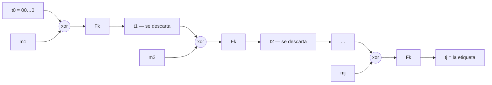

# CBC-MAC

**Cómo se construye un MAC a partir de una [[primitiva-de-cifrado-en-bloque|primitiva de cifrado en bloque]], y por qué la construcción obvia sólo funciona si todos los mensajes miden lo mismo.** Es la nota donde se ve, con una cuenta de tres líneas, que un esquema puede ser demostrablemente seguro bajo una hipótesis y romperse **con probabilidad 1** apenas se la afloja.

Cubre las filminas **18 a 21** del PDF de teoría de la Clase 03, más las **cinco filminas del `Anexo Clase 4.pdf`** y la **filmina 5 del deck de la Práctica 04** — material de la clase práctica del **31/08**, que trae los mismos ataques resueltos y dibujados. *(Algunas listas de referencia citan las cuatro filminas de teoría corridas en dos —"22" y "23" para las extensiones y el sufijo—; en el PDF son la 20 y la 21.)* Es el último bloque que alcanzó a darse el **27/08**, y el docente lo desarrolló casi entero en pizarra: la transcripción cubre los cues pt1 600-789. La sesión del **03/09** lo retoma dos veces: para generalizar el ataque a todo modelo iterativo (cues pt2 320-351) y para comparar su costo con el de `HMAC` (cues pt2 626-638).

> **Cómo se citan los cues acá.** La Clase 03 se dictó en **dos sesiones** —27/08 y 03/09— y cada transcripción numera sus cues desde 1, así que un número suelto no identifica nada. Por eso todo cue lleva **prefijo de parte**: `(cues pt1 N-M)` para el 27/08 y `(cues pt2 N-M)` para el 03/09.

> **Por qué hace falta encadenar.** Esta nota arranca con la construcción ya armada, y se saltea la pregunta que la antecede: *¿por qué no alcanza con etiquetar cada bloque por separado?* La responde la [[practica-04-macs-hash-y-cifrado-autenticado|Práctica 04]] con **tres intentos fallidos** —el XOR de los bloques, un MAC por bloque, un MAC por bloque con número de secuencia— y una construcción correcta pero inutilizable por cara. Tiene nota propia → [[construccion-de-macs-a-partir-de-una-prf|Construcción de MACs a partir de una PRF]]. Leerla antes que ésta convierte a `CBC-MAC` de *"la construcción que la clase da"* en *"la única candidata que sobrevive"*.

---

## Aviso de notación: teoría, el Anexo y esta nota

Los ataques de esta nota están en **dos decks distintos de la cátedra**, y cada uno usa símbolos distintos para las mismas cosas. Sin esta tabla parece que las fuentes se contradicen.

| Concepto | Teoría, filminas 18-21 | `Anexo Clase 4.pdf` | Esta nota |
|---|---|---|---|
| Etiqueta que devuelve el oráculo | $t_i$ | $T_i$ **mayúscula** | $t_i$ |
| Estado intermedio de la cadena | $t_i$, los mismos símbolos | $t_i$ **minúscula** | $\mathrm{st}(\cdot)$, y los auxiliares $v_i$, $w_i$, $p$, $q$ |
| Clave derivada de la longitud | $k'$ | $k_\ell$ | $k'_\ell$ |
| Opción 3: salida de la cadena / etiqueta final | $t'$ / $t$ | $t$ / $\hat{t}$ | $t'$ / $t$, como teoría |

La distinción del Anexo entre $T_i$ y $t_i$ es **mejor que la de teoría**, porque separa tipográficamente justo lo que el ataque explota: las etiquetas son públicas, los estados intermedios se descartan. Esta nota conserva la notación de teoría —que es la que el vault viene usando desde el 27/08— y avisa cada vez que cita al Anexo. Ojo con un detalle del Anexo que la lámina no señala: sus $t_i$ minúsculos **se reusan con valores distintos en cada cadena dibujada**; sólo los $T_i$ son globales.

**Y hay un choque más grave, de subíndices.** En el ataque de longitud variable, teoría llama $t_1$ a la etiqueta del mensaje de **dos** bloques y $t_2$ a la del de **uno**; el Anexo los llama al revés. Esta nota sigue a teoría, cuya cuenta cierra. El Anexo invierte el etiquetado pero copia la fórmula sin ajustar los subíndices, y por eso su filmina 3 **no cierra**: el desarrollo está en [[#La filmina 3 del Anexo no cierra|La filmina 3 del Anexo no cierra]].

## La construcción

Sea $F$ una función pseudoaleatoria y $n$ el tamaño de bloque. `CBC-MAC` **para mensajes de tamaño fijo**:

$$\mathsf{Gen}: \quad k \leftarrow \{0,1\}^{n}$$

$$\mathsf{Mac}_k(m): \quad m = m_1 \Vert m_2 \Vert m_3 \cdots \Vert m_j, \qquad t_0 = 00\cdots0 = 0^{n}$$

$$t_i = F_k(t_{i-1} \oplus m_i) \quad (i = 1,\dots,j), \qquad \mathsf{Mac}_k(m) = t_j$$

$$\mathsf{Vrfy}_k(m,t) = 1 \iff t = \mathsf{Mac}_k(m)$$

El mensaje se parte en bloques del tamaño de $F$. El estado arranca en cero, cada bloque se mezcla con el estado anterior antes de entrar a $F$, y **de toda la cadena sale un solo valor: el último estado**.

**La verificación es por recómputo**, y no por otra cosa. `Vrfy` no invierte nada ni desarma la etiqueta: vuelve a correr la cadena entera sobre el $m$ recibido y compara el resultado con el $t$ recibido. Katz & Lindell le da nombre —**verificación canónica**— y la reserva para los MACs determinísticos, que son todos los que se usan de verdad. Tener el nombre importa porque de ahí sale un resultado que la filmina no menciona: **un MAC seguro con verificación canónica es automáticamente *fuertemente* seguro** (Proposición 4.4), o sea que el adversario tampoco puede producir una etiqueta *distinta* para un mensaje ya autenticado. Es lo que hace que `CBC-MAC` sirva después como pieza del [[cifrado-autenticado|cifrado autenticado]].

> **El padding que el docente agrega, y por qué el libro no lo tiene** *(precisión nuestra).* Al abrir la construcción en pizarra el docente dice *"lo dividimos en bloques del tamaño de la función $F$ y le aplicamos [[primitiva-de-cifrado-en-bloque#Extensión: padding|padding]] al último bloque"* (cues pt1 610-611). **La Construcción 4.11 no paddea**: está definida sólo para mensajes de exactamente $\ell(n)\cdot n$ bits, y `Vrfy` rechaza todo lo demás. Las dos cosas no pueden convivir. Si $\lvert m\rvert$ no es múltiplo de $n$ y el relleno es de ceros, $m$ y $m\Vert 0$ terminan en el **mismo** mensaje paddeado y por lo tanto en la misma etiqueta: falsificar se reduce a agregar un cero. Y con padding la condición de longitud no filtraría nada, porque cualquier mensaje sería legal. El relleno recién tiene sentido con las codificaciones de la filmina 20, donde la longitud entra por la clave o por el prefijo y desambigua el mensaje original.

> **Lo que le falta a `Vrfy` en la filmina** *(precisión nuestra).* La Construcción 4.11 de Katz & Lindell antepone una línea que la filmina omite: **si $m$ no mide exactamente $\ell(n)\cdot n$ bits, devolver 0**. Esa línea que falta es *exactamente* la que el ataque de la filmina siguiente explota — el mensaje falsificado tiene tres bloques y las consultas tenían dos y uno, y un verificador que no mira la longitud lo acepta igual. La filmina anuncia **"CBC-MAC (tamaño fijo de mensajes)"** en la línea que encabeza la construcción —el título de la lámina es *"Cómo construir un MAC"*— pero **no lo implementa** en `Vrfy`, y después le dedica una filmina entera a atacar esa omisión. Es la conexión que vuelve inteligible el par de filminas.
>
> **Media corrección, desde el 31/08:** eso vale para la filmina 18 de **teoría**. La filmina 3 de la [[practica-04-macs-hash-y-cifrado-autenticado|Práctica 04]], que construye el MAC trivial de longitud fija $t \leftarrow F_k(m)$, **sí escribe el chequeo**: *"si $\lvert m\rvert \ne \lvert k\rvert \Rightarrow 0$; si no, si $F_k(m) == t \Rightarrow 1$"*. O sea que la línea que falta no falta en el material de la cátedra: falta en esa lámina.

> [!quote]- De la transcripción — por qué se llama CBC-MAC y de dónde sale (cues pt1 601-608)
> **601.** *"Uno podría tratar de empezar a construir desde cero, pero ya vieron que en criptografía nos gusta reciclar las cosas: cuando algo deja de funcionar no lo tiramos, lo modificamos un poco."*
>
> **602-605.** *"Hay dos grandes formas de construir MACs. Vamos a ver la primera ahora y la segunda la vamos a ver más adelante porque depende de algo que no vimos todavía. Existe una construcción que se llama CBC-MAC, que nos permite, a partir de una función pseudoaleatoria —y las funciones pseudoaleatorias, acuérdense, son el corazón de las funciones de cifrado de bloque— construir un MAC."*
>
> **606-608.** *"Y no es casualidad que se llame CBC-MAC: CBC, si se acuerdan, es uno de los modos de encadenamiento que habían visto. Y tiene que ver porque conceptualmente la construcción es parecida a cifrar en modo CBC."*

La "segunda forma", que en ese momento la clase todavía no había visto, es [[hmac|HMAC]]: la que se construye sobre [[funciones-de-hash-criptograficas|funciones de hash]] en lugar de sobre una primitiva de bloque. **Se dictó la sesión siguiente, el 03/09**, sobre la filmina 33, y el docente retoma ahí el anuncio: *"cuando vimos MACs yo les había dicho que había 2 formas de construirlos a partir de otras cosas. Habíamos visto una, el [CBC-MAC], que nos permitía construirlo a partir de una función pseudoaleatoria. **La segunda forma de construir un MAC es a partir de una función de hash criptográfica**"* (cues pt2 583-585). Cuánto cuesta cada una está [[#Qué cuesta, comparado con HMAC|más abajo]].

## En qué se parece al modo CBC, y en qué no

**Ésta es la comparación que más se presta a confusión, y la que conviene tener afilada** *(lectura nuestra).* La recurrencia es literalmente la misma que la del [[modos-de-encadenamiento#Los cinco modos|modo CBC de cifrado]] —el estado anterior se xorea con el bloque nuevo y el resultado entra a la primitiva—, y ahí termina el parecido. Las tres diferencias que siguen **no son detalles de implementación: cada una es una condición de seguridad**, y aflojar cualquiera rompe el esquema.

| | Modo CBC de cifrado | CBC-MAC |
|---|---|---|
| **Recurrencia** | $c_i = F_k(c_{i-1}\oplus m_i)$ | $t_i = F_k(t_{i-1}\oplus m_i)$ — **la misma** |
| **Valor inicial** | IV **aleatorio** e impredecible, obligatorio | $t_0 = 0^{n}$ **fijo**, y tiene que ser fijo |
| **Qué se emite** | **todos** los bloques (más el IV): son el criptograma | **sólo el último**, $t_j$ |
| **Qué le pide a la primitiva** | una **permutación** invertible: hay que descifrar | basta una **función pseudoaleatoria**: nunca se invierte |
| **Qué persigue** | confidencialidad — ser CPA-Secure | integridad — ser infalsificable |
| **Si se rompe la regla** | IV fijo o predecible ⇒ deja de ser CPA-Secure | IV aleatorio ⇒ deja de ser infalsificable |

### El IV: no es que no haga falta, es que no tiene que estar

La respuesta corta, la del docente, es que **nunca se descifra**, así que el azar no compra nada y sólo agregaría complejidad.

> [!quote]- De la transcripción — la construcción paso a paso y el rol de t0 (cues pt1 610-632)
> **610-613.** *"Si tenemos un mensaje $m$, lo primero que hacemos es dividirlo en bloques del tamaño de la función $F$ y le aplicamos padding al último bloque. Empezamos en un estado $t_0$ que se inicializa todo en ceros por convención."*
>
> **615-619.** *"Este estado haría las veces, si quieren, del IV del modo CBC. Vamos a tomar el estado, vamos a mezclarlo con el bloque que corresponda —el estado $t_0$ con el primer bloque del mensaje—, lo pasamos por la función pseudoaleatoria con la clave (o sea, entre comillas ciframos el bloque) y al resultado de esto lo llamamos el próximo estado, el $t_1$."*
>
> **629-630.** *"Conceptualmente esto sería como el cifrado modo CBC bloque a bloque, salvo que tiramos todos los bloques y nos quedamos con el último. Por eso el nombre de CBC-MAC."*
>
> **631-632.** *"Como nunca vamos a descifrar esto, no es necesario que el vector de inicialización sea aleatorio; y si no es necesario, para no agregar complejidad adicional, se lo hardcodea en 0."*

Pero hay una respuesta más fuerte, y es la que conviene tener para el parcial: **un IV aleatorio no sería neutro, sería un agujero.** Katz & Lindell lo afirma en la pág. 124 y lo deja como Ejercicio 4.14; el desarrollo es nuestro y sale en dos líneas.

Si `Mac` sorteara $IV \leftarrow \{0,1\}^{n}$ y arrancara la cadena ahí, la etiqueta tendría que **incluir el IV** —si no, el verificador no puede recomputar—. O sea que el adversario lo ve. Entonces, para cualquier $\Delta \ne 0^{n}$:

$$\text{consulta } m = m_1\Vert m_2\cdots\Vert m_j \;\longrightarrow\; \bigl(IV,\ t\bigr)$$
$$\text{emitir } m' = (m_1\oplus\Delta)\Vert m_2 \cdots \Vert m_j \ \text{ con la etiqueta } \bigl(IV\oplus\Delta,\ t\bigr)$$

El primer estado de $m'$ es $F_k\bigl((IV\oplus\Delta)\oplus(m_1\oplus\Delta)\bigr) = F_k(IV\oplus m_1)$: **el mismo que el de $m$**. Los $\Delta$ se cancelan, el resto de la cadena es idéntica, y $t$ sigue siendo válida. Una consulta, probabilidad de éxito 1. **El IV público es un bloque más que el adversario controla, y controlar un bloque de entrada del encadenamiento es controlar el estado.**

### Publicar los estados intermedios también rompe

La segunda diferencia es la misma historia vista del otro lado. En modo de cifrado los $c_i$ intermedios **son** el criptograma y viajan todos; en `CBC-MAC` se descartan. Y no es economía: si se publicaran, el esquema deja de ser seguro. La demostración de eso es, literalmente, [[#El ataque de longitud variable, paso a paso|el ataque de la sección siguiente]] — donde lo único que hace el adversario es **comprar un estado intermedio con una consulta extra**.

> **Cuidado con el vocabulario cuando llegue Merkle-Damgård** *(precisión nuestra).* Al describir la [[construccion-de-merkle-damgard|construcción de Merkle-Damgård]] el 03/09, el docente dice que su estado inicial *"suele ser un vector aleatorio, un vector de inicialización"* (cues pt2 356-357). Es **la misma palabra** que se usa acá y la regla es la contraria: en `CBC-MAC` el estado inicial $t_0 = 0^n$ **tiene que ser fijo**, y sortearlo rompe el esquema con probabilidad 1. No son la misma construcción y no hay contradicción entre las fuentes, pero el vocabulario compartido invita a confundirlas. *(Y la filmina 11 de la Práctica 04 escribe, para Merkle-Damgård, $z_0 = 0^{l}$ — o sea que ni siquiera adentro del material de la cátedra el "vector de inicialización" es aleatorio.)*

> **La trampa de implementación más común del tema** *(K&L, pág. 124).* Muchas bibliotecas exponen "una función CBC" y **no distinguen** si se la va a usar para cifrar o para autenticar. Usar la de cifrado como MAC —con su IV aleatorio y sus bloques intermedios a la vista— reúne las dos roturas de arriba a la vez.

### PRF contra permutación

`CBC-MAC` **nunca invierte $F$**. Le alcanza con que sea una [[primitiva-de-cifrado-en-bloque#Son funciones pseudoaleatorias|función pseudoaleatoria]]; el modo de cifrado, en cambio, necesita `Dec` y por lo tanto que $F_k$ sea biyectiva —una permutación, `PRP`—. En la práctica los dos se instancian con [[aes|AES]], que es una permutación, así que la distinción no cambia nada operativo; **cambia la hipótesis del teorema**, que es lo que se demuestra. *(La precisión `PRP`/`PRF` y por qué la clase puede tratarlas como equivalentes está en [[primitiva-de-cifrado-en-bloque#Son funciones pseudoaleatorias|Primitiva de cifrado en bloque]].)*

## Por qué sólo es seguro a longitud fija

La filmina lo dice con la mayúscula puesta:

> *"La Construcción anterior es infalsificable **SOLO** si se permiten mensajes de una misma longitud."*

La contracara formal es el **Teorema 4.12** de Katz & Lindell: si $F$ es pseudoaleatoria, la Construcción 4.11 es un MAC seguro para mensajes de longitud $\ell(n)\cdot n$ — fija, elegida de antemano y verificada por `Vrfy`. Fuera de esa hipótesis no hay teorema, y no hay teorema porque **hay un ataque**.

> [!quote]- De la transcripción — el planteo del problema (cues pt1 633-637)
> *"Esta construcción, así como está, no funciona —o por lo menos se puede demostrar que esa construcción es infalsificable sólo si se permiten mensajes de una misma longitud. Si definimos esta función para mensajes de, por ejemplo, 256 bytes, funciona perfecto. Si la queremos pensar como un MAC para mensajes de tamaño arbitrario, esta función tiene un problema."*

## El ataque de longitud variable, paso a paso

**El esquema atacado.** `CBC-MAC` tal cual la filmina 18, pero aceptando mensajes de cualquier cantidad de bloques. El adversario juega [[seguridad-de-un-mac|Mac-Forge]]: puede consultar el oráculo $\mathsf{Mac}_k(\cdot)$ las veces que quiera y tiene que emitir un par $(M,t)$ válido con $M$ **fuera** del conjunto $Q$ de sus consultas.

**Las dos consultas.** El adversario elige dos bloques cualesquiera $A$ y $B$ y pide:

$$Q = \{\, m_1 = A\Vert B, \quad m_2 = A \,\}, \qquad t_1 = \mathsf{Mac}_k(m_1), \quad t_2 = \mathsf{Mac}_k(m_2)$$

Desarrolladas, esas dos etiquetas valen:

$$t_2 = F_k(0^{n}\oplus A) = F_k(A)$$
$$t_1 = F_k\bigl(F_k(A)\oplus B\bigr) = F_k(t_2 \oplus B)$$

**Y ahí está todo.** El estado intermedio de la primera consulta —el $F_k(A)$ que la cadena de $m_1$ calcula y después tira— es **literalmente $t_2$, la etiqueta completa de la segunda consulta**. Pidiendo el MAC de un mensaje de un bloque, el adversario **compró el estado interno** que la evaluación del mensaje de dos bloques descarta. Eso es lo que la longitud variable habilita y la longitud fija prohíbe.

**La falsificación.** Emitir el mensaje de **tres** bloques

$$M = A \,\Vert\, B \,\Vert\, (A \oplus t_1) \qquad \text{con la etiqueta } t_2$$

**Verificación, bloque por bloque.** Llamando $v_1, v_2, v_3$ a los estados de la cadena de $M$:

$$v_1 = F_k(0^{n}\oplus A) = F_k(A) = t_2$$
$$v_2 = F_k(v_1 \oplus B) = F_k(t_2 \oplus B) = t_1$$
$$v_3 = F_k\bigl(v_2 \oplus (A\oplus t_1)\bigr) = F_k\bigl(t_1 \oplus A \oplus t_1\bigr) = F_k(A) = t_2$$

$\mathsf{Mac}_k(M) = v_3 = t_2$: la etiqueta emitida es válida. Y $M \notin Q$, porque $M$ tiene tres bloques y las consultas tenían dos y uno — **son prefijos de $M$, pero no son $M$**. Por lo tanto

$$\Pr[\mathsf{Mac\text{-}Forge} = 1] = 1$$

—escribo el experimento sin subíndices porque acá $A$ ya nombra un bloque— que no es "una ventaja no despreciable": es certeza. El esquema no está debilitado, está [[estado-de-un-criptosistema|quebrado]].

**La mecánica en una frase.** El tercer bloque, $A\oplus t_1$, está calculado para que al xorearse con el estado $t_1$ con el que se entra a la última iteración **quede $A$ pelado** en la entrada de $F_k$. El $\oplus$ del encadenamiento sirve para mezclar, y sirve exactamente igual de bien para **borrar**.

> [!quote]- De la transcripción — la idea del ataque, dicha en pizarra (cues pt1 705-733)
> **705-710.** *"En realidad éste es el problema que vamos a tener que arreglar del CBC-MAC. Por haber podido hacer evaluaciones en distinta longitud, ¿a qué accedimos? A lo que se descarta: que son los estados intermedios. La evaluación de esto normalmente tenía este estado intermedio $x_1$, el $x_2$, pero después los tiramos a la basura y nos quedamos sólo con el $x_3$."*
>
> **713-726.** *"Yo sé que lo que se va a cifrar en el tercer bloque va a ser el resultado de $x_2$ xor el [bloque que pongamos]. Fíjense que esto es lo mismo que $x_2$ vale $t_1$. Entonces, ¿qué estoy haciendo? **Estoy construyendo un mensaje que primero va a ser un xor con $t_1$ —o sea, eso [da] 0: dejé un tablero limpio para poner el valor que quiera.** ¿Y qué valor le pongo? Le pongo $A$, porque esto termina siendo $F(A)$. Y $F(A)$ es un valor que ya tengo y calculé."*
>
> **732-733.** *"Evaluando el mensaje sólo de $A$ [y] el de $A\Vert B$, lo que hice fue recuperar esos estados internos que se pierden. Entonces, **si yo entro al último bloque sabiendo el valor exacto del estado en el que entro, yo puedo armar un mensaje que lo anule y le ponga el valor que quiera.**"*

**"Dejé un tablero limpio para poner el valor que quiera"** (cue pt1 721) es, palabra por palabra, la misma figura con la que el docente había explicado el ataque a la planilla de sueldos de [[maleabilidad]] —*"me armo una suerte de tabla vacía"* (cue pt1 133)—. Es la misma técnica en los dos ataques: **primero anular con un xor conocido, después escribir.**

> **Cómo leer la filmina sin perderse** *(precisión nuestra, dos ambigüedades de notación).* La filmina escribe *"t1=f(m1)"* usando $f$ minúscula para el **oráculo** $\mathsf{Mac}_k(\cdot)$, mientras que la filmina anterior usa $F_k$ mayúscula para la **función pseudoaleatoria interna**. Son cosas distintas: $f(m_1) = t_1$ es la etiqueta de un mensaje de dos bloques, $F_k(A)$ es una sola aplicación de la primitiva; lo único que las separa en el PDF es la caja de la letra. Y en la línea *"Emitir (A||B||(A xor t1), t2)"* la coma que separa mensaje de etiqueta queda al mismo nivel visual que las barras de concatenación: es $\bigl(A\Vert B\Vert(A\oplus t_1),\; t_2\bigr)$, no $(A\Vert B\Vert A)\oplus t_1$.

### La versión de una sola consulta

**Esta variante sí es material de cátedra, y hasta el 04/09 el vault creía que no.** Es la filmina 2 del [`Anexo Clase 4.pdf`](../../raw/practicas/Anexo%20Clase%204.pdf), y no como apéndice marginal: el Anexo la presenta **primero**, como su ejemplo principal, y recién en la lámina siguiente pasa a la de dos consultas —la de teoría— bajo el título *"Otra forma de hacerlo"*. La nota había llegado a la misma construcción por su cuenta, derivándola del Ejercicio 4.13(a) de K&L; queda registrado porque la coincidencia vale como verificación cruzada, pero **la atribución correcta es la cátedra**.

El ataque sale más corto que el de la filmina 19: pedir $t_1 = \mathsf{Mac}_k(A)$ para un $A$ de **un** bloque, y emitir el mensaje de **dos**

$$m_2 = A \,\Vert\, (t_1 \oplus A) \qquad \text{con la etiqueta } t_2 = t_1$$

$$v_1 = F_k(0^{n}\oplus A) = F_k(A) = t_1$$
$$v_2 = F_k\bigl(v_1 \oplus (t_1\oplus A)\bigr) = F_k\bigl(t_1 \oplus t_1 \oplus A\bigr) = F_k(A) = t_1$$

El $t_1$ que aporta el encadenamiento se **anula** contra el $t_1$ que el adversario escribió dentro del bloque, y en la entrada de $F_k$ queda $A$ pelado: la cadena vuelve a producir el mismo valor. Y $m_2 \notin Q$, porque $Q$ tiene un solo mensaje de un bloque. Una consulta, probabilidad de éxito 1.

**Por qué la cátedra igual da la de dos consultas.** La de una consulta es más barata pero **esconde** el mecanismo: el estado intermedio robado es la propia etiqueta que se reemite. La de tres bloques lo **exhibe** — se ve que el estado interno de una cadena larga coincide con la etiqueta completa de una cadena corta. Como demostración de que el esquema está roto alcanza cualquiera; como explicación, la de teoría enseña más.

> **El enunciado del Ejercicio 4.13(a) de K&L**, por si se busca la fuente del libro, es el mismo ataque corrido una escala: el emisor sólo autentica mensajes de $2n$ bits y se pide falsificar sobre uno de $4n$. Sale igual — consultar $t = \mathsf{Mac}_k(m_1\Vert m_2)$ y emitir $\bigl(m_1\Vert m_2\Vert(m_1\oplus t)\Vert m_2,\ t\bigr)$, porque el tercer bloque deja $m_1$ pelado en la entrada de $F_k$ y a partir de ahí la cadena repite la original.

### La filmina 3 del Anexo no cierra

**Es la única errata de contenido que la wiki le encontró al material de la Práctica 04, y sólo se ve haciendo el álgebra.** Verificada sobre la página **renderizada** a 220 dpi, no sobre el texto extraído: no es un artefacto de `pdftotext`. El inventario de los artefactos que sí lo son está en la [[practica-04-macs-hash-y-cifrado-autenticado|Práctica 04]].

La filmina 3 del Anexo es el mismo ataque de dos consultas de la filmina 19 de teoría, pero **plantea las consultas en el orden inverso**:

| | Teoría, filmina 19 | Anexo, filmina 3 |
|---|---|---|
| Primera consulta | $m_1 = A\Vert B$ | $m_1 = A$ |
| Segunda consulta | $m_2 = A$ | $m_2 = A\Vert B$ |
| Entonces $t_1$ es… | la etiqueta del mensaje de **dos** bloques | la del de **uno**: $t_1 = F_k(A)$ |
| Y $t_2$ es… | la del de **uno** | la del de **dos**: $t_2 = F_k(t_1\oplus B)$ |
| Falsificación escrita | $\bigl(A\Vert B\Vert(A\oplus t_1),\ t_2\bigr)$ | $\bigl(A\Vert B\Vert(A\oplus t_1),\ t_2\bigr)$ — **la misma línea** |

Con el etiquetado de teoría la cuenta cierra, y es la que esta nota desarrolla más arriba. Con el del Anexo **no**, porque $t_1$ ya no es el estado con el que se entra al tercer bloque —ése pasó a ser $t_2$—:

$$s_1 = F_k(A) = t_1, \qquad s_2 = F_k(s_1\oplus B) = t_2, \qquad s_3 = F_k\bigl(t_2 \oplus A \oplus t_1\bigr)$$

Para que $s_3$ valiera $t_2 = F_k(t_1\oplus B)$ haría falta $t_2 \oplus A \oplus t_1 = t_1 \oplus B$, o sea $t_2 = A\oplus B$: una coincidencia de probabilidad $2^{-n}$ sobre la que el adversario no tiene ningún control. **La falsificación tal como está escrita falla.**

**La corrección**, que es traducir fielmente el ataque de teoría al etiquetado del Anexo, cambia los dos subíndices:

$$m_3 = A \,\Vert\, B \,\Vert\, (A \oplus t_2), \qquad t_3 = t_1$$
$$s_3 = F_k\bigl(t_2 \oplus (A\oplus t_2)\bigr) = F_k(A) = t_1 \quad\checkmark$$

Hay dos arreglos alternativos igual de válidos: dejar el tercer bloque en $B \oplus t_1 \oplus t_2$ y conservar $t_3 = t_2$ —correcto, pero ya no deja $A$ pelado—, o reordenar a la forma canónica $m_3 = A \Vert (A\oplus t_1) \Vert B$ con $t_3 = t_2$, que es la que mejor engancha con la filmina anterior del propio Anexo: el segundo bloque hace exactamente el truco de una consulta y recién después se pega el $B$.

> **Errata de la filmina:** en la filmina 3 del `Anexo Clase 4.pdf`, el tercer bloque del mensaje falsificado dice $A \oplus t_1$ y la etiqueta emitida dice $t_2$. Bajo el etiquetado de esa misma lámina —$t_1$ es la etiqueta de $A$ y $t_2$ la de $A\Vert B$— corresponde $A \oplus t_2$ y $t_1$. El error está en el texto **y** en el diagrama, cuya tercera caja se lee *"A xor t₁"*. La filmina 19 de teoría, con su propio etiquetado, está **bien**.

## Las tres extensiones seguras

La filmina 20 lista tres arreglos para llegar a mensajes de longitud arbitraria. Las tres apuntan al **mismo** agujero —impedir que el adversario reconstruya estados intermedios reutilizables entre mensajes de distinta longitud— y se diferencian en **dónde meten la longitud**.

### Opción 1 — derivar la clave de la longitud

$$k' := F_k(\lvert m\rvert), \qquad t_i := F_{k'}(t_{i-1}\oplus m_i), \qquad \mathsf{Mac}_k(m) := t_j$$

**Qué arregla.** Mensajes de longitudes distintas se procesan con **claves distintas e independientes**. Escribiendo $k'_\ell := F_k(\ell)$ para la clave que se usa con los mensajes de $\ell$ bloques: el ataque de arriba necesita que el $F_k(A)$ calculado dentro de un mensaje de dos bloques valga lo mismo que el calculado dentro de uno de un solo bloque, pero ahora el primero es $F_{k'_2}(A)$ y el segundo $F_{k'_1}(A)$, con $k'_1 \ne k'_2$ e independientes entre sí. **El estado robado no sirve para nada.**

En el PDF, el subíndice $k'$ de $F_{k'}$ está **resaltado en rojo**: es la única diferencia con la construcción básica, y la filmina la marca visualmente. *(El resaltado se pierde al extraer el texto.)*

*Por qué es seguro (lectura nuestra, siguiendo el esquema de K&L):* para cada longitud fija $\ell$, el conjunto de mensajes de esa longitud cae en el caso del Teorema 4.12 con una clave $k'_\ell$ que el adversario no controla. Una falsificación tiene **alguna** longitud $\ell^{*}$ y, restringida a ella, es una falsificación contra un `CBC-MAC` de longitud fija. Es el **Ejercicio 4.18** de K&L: el libro no la desarrolla en el cuerpo, la deja planteada.

### Opción 2 — la longitud como prefijo

$$m' := \lvert m\rvert \,\Vert\, m, \qquad \mathsf{Mac}_k(m) := \mathsf{CBC\text{-}MAC}_k(m')$$

**Qué arregla.** Dos mensajes de longitud distinta difieren **en el primer bloque**, así que sus cadenas divergen desde la primerísima aplicación de $F_k$ y no comparten ningún estado. En el ataque de arriba, $m_2 = A$ pasa a ser $\langle 1\rangle\Vert A$ y $m_1 = A\Vert B$ pasa a ser $\langle 2\rangle\Vert A\Vert B$: ahora $t_2 = F_k\bigl(F_k(\langle1\rangle)\oplus A\bigr)$ mientras que el estado intermedio de $m_1$ es $F_k\bigl(F_k(\langle2\rangle)\oplus A\bigr)$. **Distintos, y el adversario no puede hacer nada al respecto.**

Es la opción con la mejor demostración: la codificación $\lvert m\rvert \Vert m$ es *prefix-free* y por el Teorema 4.13 de K&L eso alcanza (ver [[#El criterio que unifica los cuatro casos|más abajo]]).

### Opción 3 — dos claves, cifrar la etiqueta final

$$t' := \mathsf{CBC\text{-}MAC}_{k_1}(m), \qquad t := F_{k_2}(t')$$

**Qué arregla.** El estado intermedio ya no se puede empalmar con nada porque **el valor que el adversario ve ($t$) no es el que la cadena usa ($t'$)**: entre uno y otro hay una aplicación de $F$ con una clave independiente que el adversario no puede ni invertir ni recomputar. En el ataque de arriba, la consulta de un bloque ya no devuelve $F_{k_1}(A)$ sino $F_{k_2}\bigl(F_{k_1}(A)\bigr)$, que como bloque de encadenamiento es inservible.

Esta variante se conoce en la literatura como **EMAC** (*encrypted MAC*); **el nombre no está en la filmina** *(precisión nuestra)*.

### Cuál se usa, y por qué la tercera casi no

| Opción | Dónde entra la longitud | Claves | ¿Necesita saber $\lvert m\rvert$ al empezar? |
|---|---|---|---|
| 1. Clave derivada, $k' = F_k(\lvert m\rvert)$ | en la **clave** | 1 (deriva 1) | Sí |
| 2. Prefijo, $\lvert m\rvert \Vert m$ | en el **primer bloque** | 1 | Sí |
| 3. Dos claves, $t = F_{k_2}(\mathsf{CBC\text{-}MAC}_{k_1}(m))$ | en ningún lado | **2 independientes** | **No** |

La columna que decide en la práctica es la última. La Opción 3 es la única que **no necesita conocer la longitud de antemano**, así que es la única que se puede etiquetar en *streaming* — y aun así es la que menos se usa, porque **paga esa comodidad con el doble de material de clave**.

> [!quote]- De la transcripción — el racional de cada una y cuál se usa (cues pt1 761-766)
> **761-762.** *"Las 3 formas hacen lo mismo: evitan que el atacante pueda reconstruir los estados intermedios para después agregar un sufijo que haga converger la etiqueta al valor que quiera."*
>
> **763.** *"Ninguna de las 3 opciones está impuesta universalmente, entonces van a encontrar algunas librerías que implementan una, algunas que implementan otra. La tercera es la que menos se usa."*
>
> **764-766.** *"Más que nada porque requiere el doble de tamaño de claves para conseguir la misma seguridad. Fíjense que todas estas usan una clave; ésta requiere de 2 claves, y tienen que ser 2 claves independientes. Así que por más que desde afuera tal vez se miren como una clave, es una clave el doble de grande."*

*(K&L, pág. 125, agrega que las dos claves se pueden derivar de una sola como $k_1 := F_k(1)$ y $k_2 := F_k(2)$, pero que inicializar la clave de un cifrador de bloque es caro, así que el ahorro es menor de lo que parece. La objeción del docente y la del libro apuntan al mismo costo.)*

## Por qué la longitud como sufijo no sirve

La Opción 2 mete la longitud **adelante**. La simetría invita a pensar que ponerla **atrás** es lo mismo. No lo es, y la filmina 21 lo demuestra con un ataque explícito:

$$m' := m \,\Vert\, \lvert m\rvert, \qquad \mathsf{Mac}_k(m) := \mathsf{CBC\text{-}MAC}_k(m') \qquad \text{(inseguro)}$$

> [!quote]- De la transcripción — la sutileza, y por qué el sufijo no sirve (cues pt1 767-773)
> **767-770.** *"Sutileza. La forma del medio: fíjense que agrega la longitud [del mensaje] como prefijo, no como sufijo. ¿Por qué? Porque esto lo que garantiza es que si yo tengo 2 mensajes de distinta longitud, cambia el primer bloque ya."*
>
> **771-773.** *"Si yo pusiese la [longitud] como sufijo, hay ataques para eso. Acá hay un desarrollo; es un ataque un poco más complicado. Se los dejo de tarea para que lo miren."*
>
> *(En el cue pt1 768 el ASR transcribe "la longitud de la clave"; por el contexto de la filmina 20 es **la longitud del mensaje**. Corrección nuestra.)*

> **La cátedra tenía la resolución hecha, y la repartió por el otro lado.** El ataque que Abad dejó de tarea el 27/08 está **resuelto y dibujado paso a paso** en la filmina 5 del [`Anexo Clase 4.pdf`](../../raw/practicas/Anexo%20Clase%204.pdf), que acompañó a la [[practica-04-macs-hash-y-cifrado-autenticado|Práctica 04]] del **31/08** — cuatro días después de que la tarea se encargara, y por la vía de los lunes en vez de la de los jueves. El Anexo está fechado **7 de abril de 2025**, o sea que es material del cuatrimestre anterior reusado; no hay en ninguna fuente una declaración de que se haya repartido con ese propósito, así que la conexión es *(lectura nuestra)*.
>
> Lo que sigue en esta sección se escribió **antes** de tener el Anexo a la vista, y se contrastó después: la resolución del vault y la de la cátedra **coinciden bloque por bloque** —los tres mensajes consultados, el $X = t_1\oplus t_2\oplus C$, el mensaje forjado y la identidad $T_1 = t_4$ que sostiene todo—. Queda como validación cruzada, no como duplicado. Lo que el vault agrega y el Anexo no tiene: la verificación de que el mensaje forjado está **fuera de $Q$**, las cinco aclaraciones de lectura, la variante con un solo $C$ y el encuadre en el criterio *prefix-free*. Lo que el Anexo agrega y el vault no tenía: los **diagramas**, y el rótulo $T_1 = t_4$ escrito adentro de la cadena.

**El docente no dejó el ataque en blanco: lo bosquejó en voz antes de dejarlo de tarea.** En los cues pt1 774-784 recorre el esqueleto entero —un primer mensaje de tres bloques más su codificación de longitud, un segundo de la misma longitud, y un tercero que arranca con *el primer mensaje ya rellenado con su bloque de longitud* y sigue con un sufijo agregado— y cierra con la idea de la falsificación: partir del segundo mensaje y **compensar el bloque del medio con los estados intermedios** para que la etiqueta caiga sobre la del tercero. Lo que queda de tarea es el álgebra, no la idea.

> [!quote]- De la transcripción — el bosquejo del ataque, en pocas palabras (cues pt1 774-785)
> **774-775.** *"Si se los tengo que contar en pocas palabras: podemos hacer la misma idea **abusándonos de la cantidad de bloques**. Fíjense, puedo crear un mensaje que tenga 3 bloques en este caso. Entonces se va a calcular el MAC de este mensaje: una suerte de $A$, y la codificación de la longitud, 3."*
>
> **776.** *"Un segundo mensaje de la misma longitud podría usar[se]."*
>
> **777-779.** *"Un tercer mensaje —y acá viene el truco, si quieren— que tenga como prefijo **no el primer mensaje: el primer mensaje transformado**. O sea, un tercer mensaje que tenga como prefijo, fíjense, el $A\,A$ con el 3, y después tenga alguna estructura que va a ser un mensaje más largo: va a tener sufijo agregado."*
>
> **780-782.** *"A partir de esto se puede construir un mensaje que parta del mensaje 2 y haga esta misma idea que hicimos con el mensaje 3."*
>
> **783-784.** *"O sea, usamos el mensaje de[l] prefijo más el número, y **podemos compensar la primera letra del medio utilizando los valores intermedios que tenemos**, para generar una etiqueta que sea válida, que match[ee] la etiqueta del mensaje 3. Es más sofisticado; el ataque es más difícil de pensarlo."*
>
> **785.** *"Se los dejo de tarea, pero si lo desarrollan como desarrollamos el anterior van a ver que da."*
>
> *(Correcciones nuestras del ASR: en el cue pt1 778 "el A A con el 3" son los tres bloques $A$ de la filmina más $\langle 3\rangle$; en el 784 "que manchega la etiqueta" es **que matchee la etiqueta**.)*

**Lo que sigue es ese bosquejo desarrollado y verificado acá, bloque por bloque.** El esqueleto —qué mensajes consultar y dónde está el truco— es de la cátedra; el álgebra que muestra *por qué* cierra es nuestra.

### Notación

Escribimos $\mathrm{st}(x_1,\dots,x_r)$ para el **estado** de la cadena `CBC` después de procesar esos $r$ bloques arrancando de $0^{n}$, y $\langle \ell\rangle$ para el bloque que codifica la longitud $\ell$ **medida en bloques**. La notación compacta de la filmina se lee así: `AAA` es $A\Vert A\Vert A$ —**el mismo bloque $A$ tres veces**, no tres bloques distintos— y `AAA3` es $A\Vert A\Vert A\Vert\langle3\rangle$.

Dos hechos que se usan todo el tiempo:

- $\mathrm{st}$ es **incremental**: $\mathrm{st}(x_1,\dots,x_r,\,y) = F_k\bigl(\mathrm{st}(x_1,\dots,x_r)\oplus y\bigr)$.
- $\mathsf{Mac}_k(m) = \mathrm{st}\bigl(m \Vert \lvert m\rvert\bigr)$, o sea el estado tras procesar el mensaje **y** su bloque de longitud.

### Las tres consultas

$$m_1 = AAA \;\longrightarrow\; m_1' = A\,A\,A\,\langle3\rangle, \qquad t_1 = \mathrm{st}(A,A,A,\langle3\rangle)$$
$$m_2 = BBB \;\longrightarrow\; m_2' = B\,B\,B\,\langle3\rangle, \qquad t_2 = \mathrm{st}(B,B,B,\langle3\rangle)$$
$$m_3 = AAA3CC \;\longrightarrow\; m_3' = A\,A\,A\,\langle3\rangle\,C\,C\,\langle6\rangle, \qquad t_3 = \mathrm{st}(A,A,A,\langle3\rangle,C,C,\langle6\rangle)$$

**El truco central está en $m_3$ y hay que verlo antes de seguir.** $m_3$ es un mensaje de **seis** bloques cuyos primeros cuatro son $A,A,A,\langle3\rangle$: es decir, **$m_3$ empieza con el mensaje $m_1$ ya rellenado con su propio bloque de longitud**. El esquema no tiene forma de impedirlo — $\langle3\rangle$ es un bloque como cualquier otro y nada prohíbe que un mensaje legítimo lo lleve en el medio. Por eso el sufijo de longitud no separa nada: **el mensaje-con-padding de uno es prefijo legal de otro.**

Consecuencia inmediata: en la evaluación de $m_3$, el estado después de los primeros cuatro bloques es **exactamente $t_1$**. Desarrollando los tres bloques que faltan, y bautizando los estados:

$$p := F_k(t_1 \oplus C) \tag{1}$$
$$q := F_k(p \oplus C) \tag{2}$$
$$t_3 = F_k\bigl(q \oplus \langle6\rangle\bigr) \tag{3}$$

### La falsificación

$$X := t_1 \oplus t_2 \oplus C, \qquad \text{emitir } \bigl(M,\ t_3\bigr) \ \text{ con } \ M = BBB3XC = B\,B\,B\,\langle3\rangle\,X\,C$$

$M$ tiene **seis** bloques, así que su mensaje con padding es $M' = B\,B\,B\,\langle3\rangle\,X\,C\,\langle6\rangle$ — **el mismo bloque de longitud $\langle6\rangle$ que $m_3$**. Eso es lo que hace que el ataque cierre.

### Verificación paso a paso

Los bloques 1 a 4 de $M'$ son $B,B,B,\langle3\rangle$, que es exactamente $m_2'$:

$$\mathrm{st}(B,B,B,\langle3\rangle) = t_2 \tag{4}$$

Bloque 5, que es $X$:

$$w_5 = F_k\bigl(t_2 \oplus X\bigr) = F_k\bigl(t_2 \oplus t_1 \oplus t_2 \oplus C\bigr) = F_k\bigl(t_1 \oplus C\bigr) \overset{(1)}{=} p$$

**Ahí está todo el ataque.** El bloque $X$ está construido para que $t_2 \oplus X = t_1 \oplus C$: **cancela** el estado que la cadena de $M$ trae ($t_2$) e **instala** el estado que la cadena de $m_3$ traía en ese punto ($t_1$), más el bloque $C$. A partir del quinto bloque **las dos cadenas son la misma**.

Bloque 6, que es $C$ en los dos mensajes:

$$w_6 = F_k(p \oplus C) \overset{(2)}{=} q$$

Y el bloque de longitud, $\langle6\rangle$, también el mismo en los dos:

$$\mathsf{Mac}_k(M) = F_k\bigl(q \oplus \langle6\rangle\bigr) \overset{(3)}{=} t_3$$

La verificación pasa. Y $M = BBB3XC \notin Q = \{AAA, BBB, AAA3CC\}$: tiene seis bloques contra tres, tres y seis, y contra el único de seis difiere ya en el primero ($B$ contra $A$). **Probabilidad de éxito 1**, salvo el evento despreciable de que los bloques $A$, $B$, $C$ elegidos al azar produzcan una coincidencia degenerada.

### Las cinco cosas que la filmina no dice

El ataque de la filmina **es correcto tal cual está escrito** —no hay errata— pero es indescifrable sin estas cinco aclaraciones *(lectura nuestra, salvo la 3: ésa la dice el docente en el cue pt1 778, aunque no esté en la lámina)*:

1. `AAA` es el **mismo** bloque $A$ tres veces, no tres bloques distintos $A_1A_2A_3$.
2. El `3` y el `6` son **bloques de longitud medida en bloques**, no en bytes ni en bits.
3. Elegir $m_3$ con el prefijo `AAA3` es **deliberado**: es lo que hace aparecer a $t_1$ como estado intermedio de $m_3$.
4. $M$ y $m_3$ tienen que tener **la misma cantidad de bloques**, para compartir el $\langle6\rangle$ final.
5. $C$ aparece **dos** veces en $m_3$ porque hacen falta dos roles distintos: un bloque para instalar el estado —la posición que $X$ ocupa en $M$— y **otro** idéntico en los dos mensajes, para que las cadenas ya convergidas lleguen juntas al bloque de longitud. Con un solo $C$ el ataque también sale (con $M = BBB3X$ de cinco bloques y $\langle5\rangle$ en los dos); la filmina usa dos probablemente para dejar ver que **el sufijo compartido puede ser arbitrariamente largo**.

La fuente del ejercicio es el **Ejercicio 4.15** de K&L, que pide exactamente esto: *mostrar que agregar la longitud al final del mensaje no da un MAC seguro para longitud arbitraria.* El libro lo pide; la filmina da la solución.

**El diagrama de la cátedra.** La filmina 5 del Anexo dibuja las tres cadenas consultadas y marca, adentro de la tercera, el rótulo $T_1 = t_4$ — la identidad de la que cuelga todo el ataque, y que en la filmina 21 de teoría hay que deducir leyendo con cuidado por qué $m_3$ se eligió con el prefijo `AAA3`. Lo que el Anexo **no** dibuja es la cuarta cadena, la del mensaje falsificado: esa verificación queda del lado del lector, y es la que está escrita más arriba.

> **Traducción de notación para leer el diagrama.** El Anexo reserva las **mayúsculas** $T_1, T_2, T_3, T_4$ para las etiquetas que devuelve el oráculo y las **minúsculas** $t_1 \ldots t_6$ para los estados intermedios que la cadena calcula y descarta; esta nota llama $t_i$ a las etiquetas y usa $\mathrm{st}(\cdot)$, $p$, $q$, $w_i$ para los estados. O sea: $T_i^{\text{Anexo}} = t_i^{\text{acá}}$. Y ojo con una trampa del dibujo: los $t_i$ minúsculos del Anexo **se reusan con valores distintos en cada una de las tres cadenas**; sólo los $T_i$ son globales.

## El criterio que unifica los cuatro casos

Las cuatro filminas parecen cuatro casos sueltos —seguro acá, roto allá, arreglado de tres maneras, roto de nuevo— y no lo son. **Hay un solo criterio**, y es el **Teorema 4.13** de Katz & Lindell, del que el Teorema 4.12 sale como corolario:

> Si $F$ es pseudoaleatoria, entonces la cadena `CBC` es una **función pseudoaleatoria** mientras se la consulte sobre un conjunto de entradas *prefix-free*.

Un conjunto es **prefix-free** si no contiene la cadena vacía y **ningún elemento es prefijo de otro**. Con eso, todo el bloque se ordena en una tabla:

| Sobre qué mensajes se lo usa | ¿Prefix-free? | ¿Seguro? |
|---|---|---|
| Longitud fija, $\{0,1\}^{\ell\cdot n}$ (filmina 18) | **Sí** — una cadena no puede ser prefijo propio de otra del mismo largo | Sí, Teo. 4.12 |
| Longitud libre, sin codificar nada (filmina 19) | **No** — $A$ es prefijo de $A\Vert B$ | No: el ataque de longitud variable |
| Prefijo, $\lvert m\rvert \Vert m$ (filmina 20, opción 2) | **Sí** | Sí |
| Sufijo, $m \Vert \lvert m\rvert$ (filmina 21) | **No** — $AAA3$ es prefijo de $AAA3CC6$ | No: el ataque del sufijo |

Y los dos ataques dejan de ser trucos para volverse **la exhibición de que la hipótesis prefix-free no es un tecnicismo**: en los dos casos, lo que el adversario explota es literalmente que un mensaje consultado es prefijo del que va a falsificar. *"Son prefijos, pero no son ese mensaje"*, dice el docente en los cues pt1 727-729, y ahí está nombrado el criterio sin nombrarlo.

> **Las opciones 1 y 3 no entran por la misma puerta** *(precisión nuestra).* La Opción 1 sí reduce al criterio —cada longitud queda aislada en su propia clave, y dentro de cada clase el conjunto es prefix-free—. La **Opción 3 no**: ahí la codificación no cambia y el conjunto de entradas de la cadena sigue sin ser prefix-free; lo que la salva es otra cosa, **ocultar la salida de la cadena** detrás de una segunda clave. Son dos mecanismos distintos que resuelven el mismo problema, y conviene no mezclarlos.

*(K&L agrega, en el Ejercicio 4.17, que ni siquiera "poner la longitud adelante" alcanza si se la codifica mal: prepender el número de bloques **después** de paddear tampoco es prefix-free.)*

## Extension attacks, la familia entera

El docente cierra el bloque poniéndole nombre y generalizando, y esto no está en ninguna filmina:

> [!quote]- De la transcripción — el nombre de la familia y la regla de diseño (cues pt1 786-789)
> *"Y ésta es la demostración de por qué como sufijo no sirve. **Esta familia de ataque se llama extension attacks en general.** Casi todas las construcciones criptográficas que son así, [iterativas], de ir procesando por bloque, tienen este tipo de problemas: **necesitan no revelar estados intermedios**, y la modificación se hace al final. Entonces casi todas van a ver que **ponen la modificación o en la clave o al principio del mensaje**."*

**Ésa es la regla que vale más que las tres opciones sueltas**: en una construcción iterativa, *lo que distingue un mensaje de otro tiene que entrar antes de que empiece la iteración, no después.* La Opción 1 la mete en la clave, la Opción 2 en el primer bloque; el sufijo la mete al final y por eso falla.

Y el nombre importa porque el mismo fenómeno reaparece en la clase del 03/09, del otro lado del curso: la [[construccion-de-merkle-damgard|construcción de Merkle-Damgård]] es igual de iterativa y sufre el **length-extension attack** por exactamente la misma razón — un digest publicado *es* un estado intermedio. Es también la razón por la que [[hmac|HMAC]] no puede ser el ingenuo $H(k\Vert m)$.

## Qué cuesta, comparado con HMAC

Las dos construcciones de MAC que da el curso son igual de seguras y **no cuestan lo mismo**. El docente lo cierra el 03/09, después de dar [[hmac|HMAC]], con un número que ninguna filmina trae:

| | `CBC-MAC` | `HMAC` |
|---|---|---|
| Se apoya en | una [[primitiva-de-cifrado-en-bloque\|primitiva de bloque]] — una permutación pseudoaleatoria | una [[funciones-de-hash-criptograficas\|función de hash]] — su función de compresión |
| Costo por bloque de mensaje | una evaluación de $F_k$ | una evaluación de $h^{s}$ |
| Costo relativo | **1 a 3 órdenes de magnitud más caro** | el barato |
| Seguridad | equivalente | equivalente |
| Qué se usa en la práctica | menos | **más**, y por esto |

La razón es que las permutaciones pseudoaleatorias de un cifrado de bloque son **pesadas en cantidad de operaciones** —aun aceleradas por hardware— frente a las funciones de compresión de un hash. Sobre volúmenes grandes la diferencia deja de ser académica.

> [!quote]- De la transcripción — por qué las bibliotecas prefieren HMAC (cues pt2 624-638)
> **624-631.** *"En la práctica, la mayor cantidad de implementaciones que va a haber (…) son de este tipo. No porque sean más seguras, sino por un tema práctico: las funciones $F$, las permutaciones [pseudoaleatorias] que forman parte de los criptosistemas de bloque, son funciones que suelen ser pesadas en términos de cantidad de operaciones —si bien se pueden acelerar por hardware— versus las funciones de compresión de las funciones de [hash]. Entonces típicamente calcular la etiqueta de un mensaje es **1 a 3 órdenes de magnitud más rápido** que cifrar ese mensaje, que sería lo que se necesita para hacer el [CBC-MAC]."*
>
> **632-638.** *"Entonces un [HMAC] es típicamente mucho más rápido para calcular la etiqueta de un mensaje que un [CBC-MAC]. Y ese motivo, especialmente cuando lo pensamos para aplicaciones masivas (…) estamos hablando de etiquetar teras, petabytes de información: hace una diferencia grande. (…) Pero son tan seguras como los [CBC-MAC]. Es un tema más que nada ingenieril la razón por la cual se utilizan más."*

**La lectura que importa para un parcial:** la elección entre las dos es de **rendimiento**, no de seguridad. Contestar *"HMAC es más seguro"* es incorrecto; contestar *"HMAC es más barato sobre volúmenes grandes, con la misma garantía"* es lo que dijo la cátedra.

Hay una excepción práctica que la clase no menciona y conviene tener presente *(lectura nuestra)*: cuando el sistema **ya** está cifrando con `AES` acelerado por hardware —instrucciones `AES-NI`— y no tiene una implementación de hash igualmente acelerada, la ventaja se achica. Es exactamente el escenario que hizo competitivos a los modos de la familia [[ccm-y-gcm|CCM y GCM]], que reusan la primitiva de bloque para las dos cosas.

## Dónde aparece CBC-MAC en el resto del curso

- **[[ccm-y-gcm|CCM]]** es `CBC-MAC` + `CTR`: la etiqueta del modo de [[cifrado-autenticado|cifrado autenticado]] que la filmina 38 esquematiza sale de esta construcción. Y el CCM real **usa la Opción 2**: su cadena arranca con un bloque $B_0$ que lleva el nonce y la longitud **como prefijo**, que es justamente lo que lo vuelve seguro a longitud variable. La fórmula simplificada de la filmina, leída al pie de la letra, usaría el `CBC-MAC` **básico** sobre mensajes de longitud arbitraria — o sea, exactamente lo que esta nota acaba de romper. *(Precisión nuestra.)*
- **[[hmac|HMAC]]** es la otra gran familia de MACs, la que se construye sobre hash en vez de sobre una primitiva de bloque. El docente la anuncia acá y la deja para el 03/09.

## Lo que la clase no dice sobre los MACs iterativos

Tres huecos que conviene tener presentes, ninguno de los cuales está en las filminas *(salen de K&L cap. 4)*:

- **Ningún MAC protege contra *replay*.** La definición no tiene estado, así que un par $(m,t)$ válido lo es **para siempre**: reenviar diez veces la misma transferencia bancaria autenticada pasa las diez verificaciones. Las defensas son externas al MAC — números de secuencia o *timestamps*.
- **La etiqueta tiene que ser superlogarítmica en $n$.** Si midiera $O(\log n)$ bits, adivinarla al azar acertaría con probabilidad no despreciable y ningún MAC con etiquetas tan cortas puede ser seguro.
- **`Vrfy` tiene que comparar en tiempo constante.** Comparar la etiqueta byte a byte y cortar en la primera diferencia filtra **cuántos bytes coinciden**, y eso permite reconstruirla byte por byte con unas 256 consultas por byte. Le pasó a la **Xbox 360**, donde la diferencia de tiempo era de 2,2 ms. Es el mejor recordatorio del curso de que la seguridad demostrada no cubre los canales laterales: el teorema puede estar bien y la implementación filtrar igual.

## Ver también

- [[seguridad-de-un-mac|Seguridad de un MAC]] — la prueba `Mac-Forge` contra la que se mide todo lo de esta nota, y el umbral $\Pr \le \mathsf{negl}(n)$ que los dos ataques violan de la peor manera posible
- [[message-authentication-code|Message Authentication Code]] — la terna $(\mathsf{Gen}, \mathsf{Mac}, \mathsf{Vrfy})$ y para qué sirve
- [[hmac|HMAC]] — la otra forma de construir un MAC, sobre funciones de hash
- [[ccm-y-gcm|CCM y GCM]] — dónde se usa `CBC-MAC` en la práctica
- [[construccion-de-merkle-damgard|Construcción de Merkle-Damgård]] — la misma familia de ataques, del lado de los hash
- [[primitiva-de-cifrado-en-bloque|Primitiva de cifrado en bloque]] — qué es una función pseudoaleatoria y por qué acá alcanza con una PRF
- [[modos-de-encadenamiento|Modos de encadenamiento]] — el modo `CBC` de cifrado, con el que hay que no confundir esto
- [[cifrado-probabilistico-nonce-e-iv#Nonce e IV no son exactamente lo mismo|Cifrado probabilístico, nonce e IV]] — por qué el IV aleatorio es obligatorio en un lado y prohibido en el otro
- [[aes|AES]] — la primitiva con la que se instancia $F_k$ en la práctica
- [[clase-03-macs-y-cifrado-autenticado|Clase 03 — MACs y cifrado autenticado]]
- Katz & Lindell cap. 4 *Message Authentication Codes* — §4.4 es todo este bloque: Construcción 4.11, Teoremas 4.12 y 4.13, y los Ejercicios 4.13, 4.14, 4.15 y 4.18 ([[bibliografia|bibliografía]])
