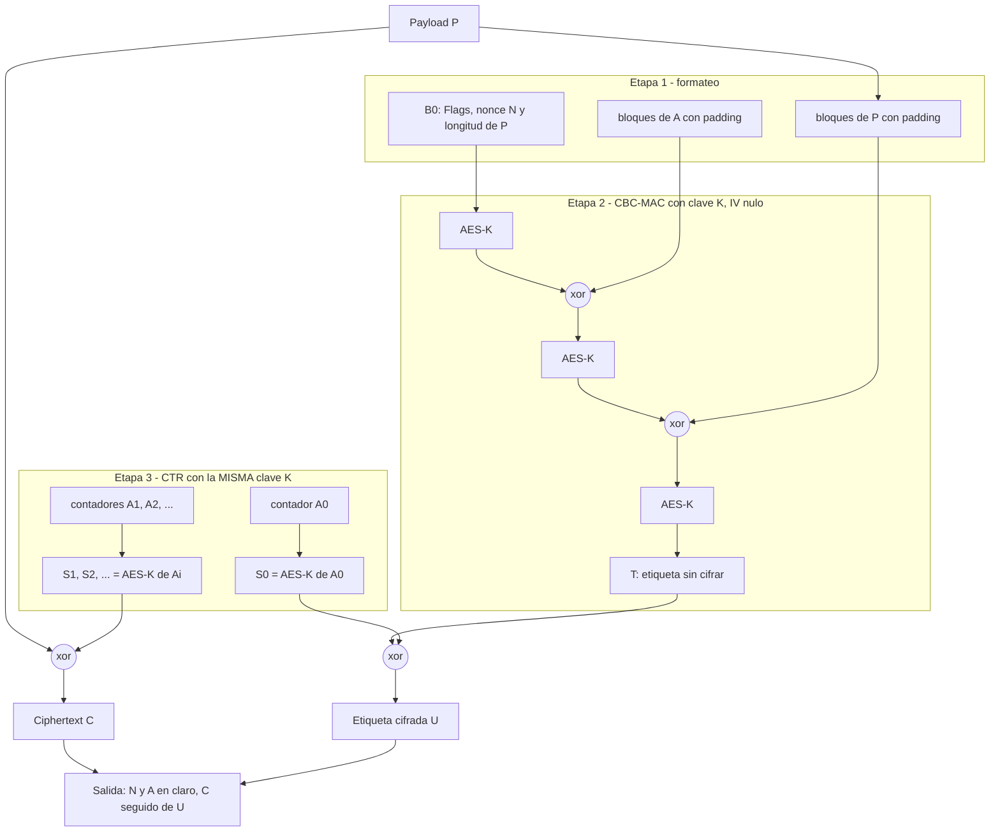

# CCM y GCM

**Los dos modos de encadenamiento que dan [[cifrado-autenticado|cifrado autenticado]] de verdad**, en lugar de componer a mano un criptosistema y un MAC. Uno usa cada una de las dos combinaciones válidas del slide 36, y eso explica casi todas las diferencias entre ellos.

> **Fuentes.** Las filminas de esta nota (slides 38 y 39) son de la **segunda sesión de la Clase 3, del 03/09**, que **sí tiene transcripción**: `CCM` en los cues pt2 763-815 y `GCM` en los 816-881, más el inventario de modos en los 883-890. Los cues llevan prefijo de parte —`pt1` para el 27/08, `pt2` para el 03/09— porque la Clase 03 tiene dos grabaciones, cada una numerada desde 1. Ojo con el ASR, que escribe *"Gsm"*, *"Gsn"* y *"G S. M."* donde dice `GCM`, *"Csm"* donde dice `CCM`, y *"Cbs Mac"* o *"Cnse Mac"* donde dice `CBC-MAC`.
>
> **Esta es la única nota del bloque que no gana nada del material de práctica.** La [[practica-04-macs-hash-y-cifrado-autenticado|Práctica 04]] del 31/08 tiene 18 filminas y termina en la construcción genérica de cifrado autenticado (filmina 17) y el ejercicio de claves iguales (filmina 18): **no trae `CCM` ni `GCM`**. Y el Anexo de esa práctica es todo `CBC-MAC`. Así que las fuentes escritas siguen siendo exactamente las mismas que antes, más los cues nuevos.
>
> **Aviso de fuentes.** El slide 38 remite a *"material adicional en Campus"* que **sigue sin estar en `raw/`**. No es que no exista: el docente lo anuncia dos veces en voz —al hablar de la demostración de `CCM` (cues pt2 806-808) y al cerrar la clase (cues pt2 908-909)—. Hay que bajarlo. Y Katz & Lindell **no trata ninguno de los dos**: el capítulo 4 llega hasta la construcción genérica y no baja a modos concretos, cosa que el propio docente confirma. Así que todo lo que esta nota dice **más allá de las dos filminas y de la transcripción** sale de las especificaciones (NIST SP 800-38C y RFC 3610 para `CCM`, NIST SP 800-38D para `GCM`) o de los artículos donde se demuestra la seguridad de cada modo, y va rotulado como conocimiento externo a la bibliografía del vault. Las referencias son al documento entero: la nota **no** cita secciones ni números de cláusula de los estándares.

---

## Qué son, y qué los diferencia de la construcción genérica

Los dos son **[[modos-de-encadenamiento|modos de encadenamiento]]** de una primitiva de bloque —en la práctica, [[aes|AES]]— igual que `CBC` o `CTR`, con la diferencia de que producen **criptograma y etiqueta a la vez**. La filmina lo dice del `GCM`: *"forma de encadenar un criptosistema de bloque; provee cifrado autenticado"*.

El docente los presenta por lo que resuelven respecto de la [[cifrado-autenticado|construcción genérica]]: son modos *"un poco más sofisticados que los que vimos"* que ganan control de integridad **sin duplicar ni extender el tamaño de la clave**, que es *"lo que más se ve como factor negativo desde fuera"* (cues pt2 764-768). Ése es el eje: la construcción genérica pide dos claves, y estos dos modos se arreglan con una.

Los dos son además **AEAD** (*Authenticated Encryption with Associated Data*): además del texto plano, que se cifra **y** se autentica, admiten **datos asociados** $A$ que se autentican **pero no se cifran**. Es lo que hace falta para un paquete de red, donde la cabecera tiene que viajar legible para que los routers la lean, pero no puede ser modificable. La cátedra lo dice sólo de `GCM` y sin nombrarlo AEAD: *"permitiría \[...\] tener data que no está cifrada, pero también está autenticada"* (cue pt2 864).

| | Construcción genérica (slide 37) | CCM | GCM |
|---|---|---|---|
| Composición | `Encrypt-then-MAC` | `authenticate-then-encrypt` | `encrypt-then-MAC` |
| Fila del slide 36 | *"siempre es seguro"* | *"puede ser seguro, requiere prueba"* | *"siempre es seguro"*, pero con una sola clave el veredicto genérico no aplica |
| Claves | dos, independientes | **una sola** | **una sola**, de la que se deriva además la constante $H$ |
| De dónde sale la seguridad | teorema genérico (K&L Teo. 4.19) | prueba específica del modo | prueba específica del modo |
| Datos asociados | no los contempla | sí | sí |
| Estado según la cátedra (03/09) | el marco conceptual | **cayendo en desuso** | **el más usado hoy** |

## CCM

### Qué significa y cómo se arma

**`CCM` = Counter with CBC-MAC.** El nombre es la receta: [[cbc-mac|CBC-MAC]] para la etiqueta, [[modos-de-encadenamiento#Counter (CTR)|modo counter]] para el cifrado.

La filmina lo rotula *"authenticate-then-encrypt"* y lo escribe así:

$$e_k\bigl(\mathrm{CBC\text{-}MAC}_k(M) \,\Vert\, m\bigr)$$

Es decir: calcular la etiqueta CBC-MAC del mensaje, **concatenarla adelante** y cifrar el conjunto en modo counter. Es la fila del medio del slide 36 — la que *"puede ser seguro, requiere prueba de seguridad"* — instanciada. En voz, el docente la lee igual: *"calcular el \[CBC-MAC\] del mensaje y usarlo como prefijo para cifrar el \[CBC-MAC\] del mensaje y el mensaje"* (cue pt2 792), y verifica al descifrar recalculando la etiqueta sobre el mensaje recuperado y comparándola.

> **Precisión de notación.** La fórmula escribe $M$ adentro del CBC-MAC y $m$ afuera; son el **mismo mensaje**. Y $e_k$ es el cifrado en modo counter, no la primitiva $E_k$ sola.

**Antes de esto, la clase repasa el modo counter**, con respuesta de un alumno, y deja dicho el porqué del nombre: como lo único que se necesita es que los bloques que entran a la primitiva sean **distintos**, se les pone un contador —1, 2, 3, 4— y así *"nunca se van a repetir"*; el resultado de cifrarlos es el keystream que después se xorea con el mensaje (cues pt2 777-786). Ese repaso importa acá porque el nonce y el contador son justamente lo que la condición de seguridad de `CCM` restringe. El detalle está en [[modos-de-encadenamiento#Counter (CTR)|Modos de encadenamiento]].

### CCM está en retirada

Un veredicto de estado que hay que registrar, porque cambia cómo se lee todo lo demás: **para la cátedra, `CCM` es hoy el menos relevante de los dos.** Lo fue hasta hace unos cinco años; se lo va a seguir encontrando en sistemas desplegados, pero está cayendo en desuso.

> [!quote]- De la transcripción — el estado de CCM (cues pt2 771-772)
> de los 2, este es el menos relevante, si quieren. Hoy día lo fue hace hasta hace 5 años, pero pero ahora está[,] se lo van a encontrar, probablemente, pero está cayendo en desuso. Se llama C. C. M.

Eso no lo vuelve inseguro ni lo saca del programa: `CCM` sigue siendo la pieza de `WPA2` y de Bluetooth LE, y el ejercicio del slide 38 sigue siendo evaluable. Lo que dice el veredicto es **dónde ponerlo en la mesa de decisiones** de un proyecto nuevo — ver [[eleccion-de-primitivas|Elección de primitivas en un proyecto]] y [[estado-de-un-criptosistema|Estado de un criptosistema]].

### La misma clave, que normalmente estaría prohibido

Ésta es la parte que hay que retener del slide 38, porque contradice de frente una regla que la clase acaba de enunciar:

> *"Existe una prueba de seguridad específica: si el IV y el nonce no coinciden ni se reutilizan, la construcción es CCA-Secure usando **LA MISMA CLAVE**."*

[[privacidad-e-integridad#Dos claves independientes|Privacidad e integridad]] dice que las dos primitivas van con **claves independientes**, y da el ejemplo de qué pasa si no: con `CBC` e `CBC-MAC` bajo la misma clave y el mismo IV nulo, la etiqueta resulta ser literalmente el último bloque del criptograma. `CCM` usa una sola clave a propósito, y el docente se detiene ahí a propósito también: *"el detalle no menor \[...\] fíjense que esta clave acá y esta clave acá son la misma"* (cues pt2 798-799). **Por qué se salva**, en tres piezas:

1. **Hay una prueba específica** (Jonsson, 2002), que es exactamente lo que el slide 36 anticipa cuando anota que *authenticate-then-encrypt* *"puede ser seguro, requiere prueba de seguridad"*. La filmina cierra ese círculo sin señalarlo; el docente sí lo señala. *(La existencia de la prueba está en el slide y en la clase; la referencia es externa al vault.)*
2. **El formateo separa lo que puede separar** — que es menos de lo que suele decirse. El primer bloque del CBC-MAC, $B_0$, y todos los bloques de contador $A_j$ arrancan con un byte de `Flags`, y esos dos formatos son **disjuntos**: el `Flags` de $B_0$ codifica la longitud de la etiqueta en unos bits que en los bloques de contador están siempre en cero. De ahí sale, y sólo de ahí, que $B_0 \ne A_j$ **para todo $j$** — en particular, que el bloque que enmascara la etiqueta nunca sea el mismo que el primer bloque del MAC. *(Conocimiento externo: NIST SP 800-38C.)*

   **Pero eso no separa los dominios enteros**, y conviene no exagerarlo *(precisión nuestra)*. Desde $i \ge 1$ la cadena evalúa $E_K(B_i \oplus Y_{i-1})$, y ese argumento no lleva ningún `Flags`: es un valor sin estructura, que en principio puede caer sobre cualquier bloque de contador. Lo que hace la prueba específica es **acotar** la probabilidad de que eso pase —una cota de tipo cumpleaños en la cantidad total de bloques procesados bajo la clave—, no anularla. O sea: la garantía viene de la demostración; el `Flags` sólo cierra el caso que se podía cerrar por construcción.
3. **La condición del nonce no es un detalle.** El nonce entra en **los dos** caminos, así que repetirlo rompe las dos cosas al mismo tiempo: repite el keystream del contador —que es exactamente el ataque de la primera parte de la clase— y vuelve repetible la cadena del CBC-MAC. De ahí el *"si el IV y el nonce no coinciden ni se reutilizan"*.

> [!quote]- De la transcripción — la misma clave, la condición del nonce, y la demostración que no está en Katz (cues pt2 798-808)
> el detalle no menor que no sé si tendría que resaltarlo más[:] acá fíjense que esta clave, acá[,] y esta clave acá son la misma. porque hay una prueba de seguridad específica para esta construcción que dice que si el I[V] que aparecería en el C. B. C. [MAC] y el nonce que se utiliza en el counter no coinciden, o sea, no son el mismo número ni se reutilizan[,] la construcción es C[CA]-secure usando la misma clave.
>
> esta demostración no está en el libro de [Katz]. Se la vamos a subir para los que quieran como material adicional en campus[,] porque es interesante[;] no complicada, no es tan trivial, pero […] si a alguien le interesa para profundizar. Está buen[o] lo que hacen para demostrar.

**Cabo suelto declarado por la cátedra:** la demostración de `CCM` **no está en Katz & Lindell** y fue prometida como material adicional del campus. Mientras no aparezca en `raw/`, esta nota la cita por su existencia y por su referencia externa (Jonsson, 2002), no por su contenido.

> **La lectura de fondo** *(nuestra)*: la regla de las dos claves no es un axioma, es la forma **barata y genérica** de garantizar que dos usos de la misma primitiva no interfieran. Si la no interferencia se puede acotar de otra manera —acá, con una demostración que mide cuánto se pueden llegar a tocar las dos cadenas—, la regla se puede levantar **para ese diseño y sólo para ese diseño**. La diferencia entre `CCM` y un error de diseño es **la demostración**, no la audacia. Y por eso mismo el privilegio no se hereda: `GCM` también usa una sola clave y también necesita [[#GCM tampoco entra por el teorema genérico|prueba propia]].
>
> Esto también resuelve el choque aparente con la [[practica-04-macs-hash-y-cifrado-autenticado|Práctica 04]], cuyo ejercicio de la filmina 18 enseña que **reusar la clave rompe `Encrypt-then-MAC`**. No hay contradicción: reutilizar clave es inseguro **en general**, y admisible sólo donde hay una prueba específica que lo habilite.

### El costo de CCM: la mitad de velocidad

El compromiso de `CCM` se puede dejar hecho cuenta, y conviene, porque es el argumento que después decide entre los dos modos. **`CCM` procesa el mensaje dos veces**: una pasada para calcular el CBC-MAC y otra para cifrar. Como cada pasada es una evaluación de AES por bloque, el modo cuesta $\approx 2$ operaciones de la primitiva por bloque de payload, contra $\approx 1$ de un modo de cifrado normal.

De ahí sale la frase del docente: **`CCM` va típicamente a la mitad de velocidad que los modos normales**, y esa mitad es lo que se paga por tener control de integridad sin duplicar el tamaño de la clave.

> [!quote]- De la transcripción — el compromiso de CCM (cues pt2 809-815)
> fíjense esto: logra de alguna manera darnos un criptosistema autenticado sin duplicar el tamaño de la clave. Así que esto, durante mucho tiempo fue un tra[de]off[.] Bueno, porque […] hay un compromiso, o sea, si no duplicamos el tamaño de la clave[,] pero hay que procesar de alguna manera y que cifrar el mensaje 2 veces: una para calcular [el] [MAC] y después otra para cifrar el mensaje en sí mismo. Si[,] entonces el modo C. C. M. típicamente es la mitad[,] va a la mitad de velocidad que el[,] que los modos normales[,] no sé que un counter, por ejemplo. […] a cambio de es[a] mitad de velocidad nos garantiza control de integridad también. Entonces fue muy bueno.

### El ejercicio del slide 38: esquematizar un cifrado con AES-CCM

**Respuesta al nivel de la filmina.** Con $k$ una clave AES y $N$ un nonce:

$$\begin{aligned}
\mathsf{Gen}:\quad & k \leftarrow \{0,1\}^{128} \\[3pt]
\mathsf{Enc}_k(N, m):\quad & t := \mathrm{CBC\text{-}MAC}_k(m); \quad c := \mathrm{CTR}^{N}_k\bigl(t \,\Vert\, m\bigr); \quad \text{salida } \langle N, c\rangle \\[3pt]
\mathsf{Dec}_k(\langle N, c\rangle):\quad & t \,\Vert\, m := \mathrm{CTR}^{N}_k(c); \quad \text{si } t = \mathrm{CBC\text{-}MAC}_k(m) \to m, \ \text{si no} \to \perp
\end{aligned}$$

Eso responde el ejercicio con lo que la filmina da, y coincide con la resolución hablada del docente. **Pero es una simplificación**, y conviene decirlo: el `CCM` real difiere en cuatro puntos que no son cosméticos. Lo que sigue es la especificación de verdad *(fuente: NIST SP 800-38C y RFC 3610, externa a la bibliografía del vault)*.

**Parámetros.**

| Símbolo | Qué es | Valores |
|---|---|---|
| $K$ | clave AES | 128, 192 o 256 bits |
| $N$ | nonce | $15 - q$ bytes |
| $q$ | bytes del campo de longitud | $2 \le q \le 8$ |
| $t$ | longitud de la etiqueta | 4, 6, 8, 10, 12, 14 o 16 bytes |
| $A$ | datos asociados: autenticados, **no** cifrados | opcional |
| $P$ | payload: autenticado **y** cifrado | |

**Etapa 1, formateo** — lo que la fórmula de la filmina omite entero. Se arma la secuencia de bloques que va a entrar al CBC-MAC, empezando por

$$B_0 = \underbrace{\texttt{Flags}}_{1\ \text{byte}} \;\Vert\; \underbrace{N}_{15-q\ \text{bytes}} \;\Vert\; \underbrace{Q}_{q\ \text{bytes}}, \qquad Q = \lvert P\rvert \text{ en bytes}$$

y siguiendo con los bloques que codifican $\lvert A \rvert$, después $A$, después $P$, todo rellenado con ceros hasta múltiplo de bloque.

**Etapa 2, CBC-MAC con IV nulo** sobre esa secuencia:

$$Y_0 := E_K(B_0), \qquad Y_i := E_K(B_i \oplus Y_{i-1}), \qquad T := \mathsf{MSB}_t(Y_{\text{último}})$$

**Etapa 3, CTR** con bloques de contador construidos a partir del nonce:

$$A_i := \texttt{Flags}' \,\Vert\, N \,\Vert\, i, \qquad S_i := E_K(A_i), \qquad i = 0, 1, 2, \dots$$

$$C := P \oplus \mathsf{MSB}_{\lvert P\rvert}\bigl(S_1 \Vert S_2 \Vert \cdots\bigr), \qquad U := T \oplus \mathsf{MSB}_t(S_0)$$

**Salida:** $\langle N,\; A,\; C \,\Vert\, U\rangle$ — nonce y datos asociados en claro, payload cifrado, etiqueta cifrada al final.

**Descifrado y verificación**, en este orden:

1. Recalcular $S_0$ a partir de $N$ y recuperar $T := U \oplus \mathsf{MSB}_t(S_0)$.
2. Descifrar $C$ con $S_1, S_2, \dots$ y obtener $P$.
3. Rehacer el formateo con $(N, A, P)$ y recomputar el CBC-MAC, obteniendo $T'$.
4. Comparar $T$ con $T'$ **en tiempo constante**. Si no coinciden, **descartar $P$ y devolver $\perp$**: nunca entregar el texto plano.

### Los cuatro puntos donde el CCM real se separa de la fórmula de la filmina

| # | La filmina | El estándar | Por qué importa |
|---|---|---|---|
| 1 | la etiqueta se concatena **al principio** del plano y se cifra junto con él | la etiqueta se cifra **aparte**, con $S_0$, y va **al final** | permite descifrar en streaming sin esperar la etiqueta, y desacopla el largo de la etiqueta del largo del payload |
| 2 | el CBC-MAC cubre el mensaje | el CBC-MAC cubre $B_0$, que trae **nonce y longitud**, después $A$, después $P$ | el nonce y la longitud entran **como prefijo**, que es la extensión segura del slide 20: **por eso el CBC-MAC de CCM sí sirve para longitud variable** |
| 3 | no aparecen los datos asociados | $A$ se autentica sin cifrarse | es lo que hace de `CCM` un AEAD y no sólo un cifrado autenticado |
| 4 | no dice por qué la misma clave es legítima | el `Flags` de $B_0$ lo hace distinto de todo contador $A_j$, y una **prueba específica** acota la probabilidad de que el resto de la cadena colisione con ellos | es la respuesta técnica a la advertencia de `LA MISMA CLAVE` |

> **El punto 2 es el que más pesa para el parcial.** Leída al pie de la letra, la fórmula del slide 38 usaría el **CBC-MAC básico** sobre mensajes de longitud arbitraria — que es exactamente lo que el [[cbc-mac|ataque de longitud variable]] de la filmina 19 rompe. El `CCM` real no cae ahí porque mete la longitud como prefijo.

## GCM

### Qué es

**`GCM` = Galois/Counter Mode.** Cifrado en [[modos-de-encadenamiento#Counter (CTR)|modo counter]] más una etiqueta calculada por **GHASH**, una función que trabaja sobre el [[cuerpos-finitos-y-campos-de-galois|cuerpo finito]] $\mathrm{GF}(2^{128})$. Los datos de la derecha del slide 39:

$$H = E_k(\underbrace{00\cdots00}_{128\ \text{bits}}), \qquad \mathsf{Mult}_H(x) = \mathsf{Mult}(x, H), \qquad \mathsf{Mult}(x,y) = x \cdot y \bmod \bigl(x^{128}+x^{7}+x^{2}+x+1\bigr)$$

Tres lecturas de esas tres líneas:

- **$H$ no es una segunda clave**: se **deriva** de la única clave $k$, cifrando el bloque nulo, así que quien tiene $k$ tiene $H$. Ojo con la conclusión fácil: que $H$ salga de $k$ **no** es lo que autoriza a usar una sola clave — es exactamente lo contrario de la independencia que pide la construcción genérica. Lo que autoriza a `GCM` es lo mismo que autoriza a `CCM`: una prueba propia. Ver [[#GCM tampoco entra por el teorema genérico|GCM tampoco entra por el teorema genérico]].
- **El polinomio $x^{128}+x^{7}+x^{2}+x+1$ es el módulo que define el cuerpo.** Es la misma construcción que usa [[aes|AES]] para $\mathrm{GF}(2^{8})$, con 128 en lugar de 8: los elementos son polinomios con coeficientes en $\{0,1\}$ de grado menor que 128, se suman con xor y se multiplican módulo un polinomio irreducible. En clase esto se explica bit a bit: cada bit del bloque es el coeficiente de un grado sucesivo, de modo que un bloque de 128 bits da un polinomio con términos de $x^{0}$ a $x^{127}$, y el polinomio reductor *"es siempre el mismo"* y *"termina definiendo qué significa multiplicar estos 2 polinomios"* (cues pt2 829-835, 867-871). Ver [[cuerpos-finitos-y-campos-de-galois|Cuerpos finitos y campos de Galois]].
- **$128$ bits es exactamente un bloque de AES.** Un elemento de $\mathrm{GF}(2^{128})$ *es* un bloque, y por eso todo el diagrama encaja sin conversiones: los criptogramas, la máscara y la etiqueta viven todos en el mismo cuerpo.

### La anécdota de la patente, y su corrección

El docente introduce `GCM` con una historia: es *"una versión superadora"* de `CCM` que **se inventó antes**, pero cuyos autores la patentaron y exigieron regalías, con lo cual nadie la implementó por unos **ocho años**, hasta que la liberaron y recién ahí empezó a usarse.

> [!quote]- De la transcripción — la anécdota de la patente (cues pt2 816-821)
> pero hay una versión superadora de esto. Otro modo de encadenamiento que de hecho se inventó antes que C[CM][,] pasa que los autores del modo no tuvieron mejor idea que patentarlo y querer exigirle a todos los que lo implementen[,] y paguen regalías. con lo cual consiguieron que nadie lo implemente por unos 8 años[,] hasta que tiraron la toalla y lo liberaron al público. Este[.] Y recién ahí empezó a usarse el modo superador del C[CM]. Se llama [GCM].

> **La historia es real, pero es la de otro modo** *(precisión nuestra; conocimiento externo a la bibliografía del vault)*. Hay dos cosas que corregir, y conviene tener las fechas a mano porque son lo que decide la discusión.
>
> **La cronología está invertida.** `CCM` es **anterior** a `GCM`: se especifica en la RFC 3610 en **2003** —Whiting, Housley y Ferguson— y el NIST lo estandariza en SP 800-38C en **2004**. `GCM` es de McGrew y Viega, **2004**, y el NIST lo estandariza en SP 800-38D en **2007**. O sea que `GCM` no se inventó antes que `CCM`: se inventó después.
>
> **La patente no es de `GCM`.** `GCM` se diseñó **explícitamente libre de patentes**, y ésa es una de las razones por las que se pudo estandarizar y desplegar rápido. El modo AEAD que sí estuvo cubierto por patentes, retenido casi una década y liberado después, es **`OCB`**, de Phillip Rogaway (2001): las regalías frenaron su adopción, el grupo de trabajo de IEEE 802.11i lo descartó por ese motivo, y recién en 2013 Rogaway concedió licencias libres, con `OCB3` publicado como RFC 7253 en 2014.
>
> **Y las dos correcciones se enganchan.** Lo que existe por culpa de esa patente es precisamente **`CCM`**: nació como la alternativa *sin patentes* a `OCB` para 802.11i. Es decir que la anécdota es cierta, es relevante, y explica de verdad por qué la cátedra está mirando `CCM` — sólo que el modo patentado del que habla no es `GCM`.

### El diagrama, flecha por flecha

El dibujo muestra el caso de **dos bloques de texto plano y un bloque de datos asociados**; el patrón se repite igual para $n$ bloques. Está en inglés, y hay que leerlo en dos mitades — que es exactamente como lo lee el docente en clase: *"si yo cortase acá por la mitad el esquema y me quedo con la parte de arriba, es una forma un poco distinta \[de mostrar\] un cifrado en modo counter"* (cues pt2 851-854).

**La mitad de arriba: el cifrado, que es CTR puro.**

1. Fila superior: `Counter 0` → `incr` → `Counter 1` → `incr` → `Counter 2`. Cada contador sale del anterior incrementando.
2. Debajo de cada contador, una caja $E_K$ — la primitiva de bloque, en `AES-GCM` es AES.
3. `Counter 1` y `Counter 2` son los que cifran: $E_K(\texttt{Counter } i) \oplus \texttt{Plaintext } i = \texttt{Ciphertext } i$.
4. **`Counter 0` no cifra ningún dato.** Su salida baja por el margen izquierdo, cruza todo el diagrama y va al **xor final**, el que produce el `Auth Tag`.

> **Ése es el detalle del diagrama que más se pasa por alto:** los contadores del cifrado **arrancan en 1, no en 0**, porque el 0 está reservado para enmascarar la etiqueta. En la especificación ese bloque se llama $J_0$ y se deriva del nonce.

**La mitad de abajo: la autenticación, que es GHASH.**

1. `Auth Data 1` —los datos asociados, que se autentican pero **no** se cifran— entra a una caja $\mathsf{mult}_H$.
2. El resultado se xorea con `Ciphertext 1` y entra a otra $\mathsf{mult}_H$.
3. Ese resultado se xorea con `Ciphertext 2` y entra a una tercera $\mathsf{mult}_H$.
4. Se xorea con el bloque `len(A) || len(C)` —las longitudes de los datos asociados y del criptograma, concatenadas en un solo bloque— y pasa por una cuarta $\mathsf{mult}_H$.
5. Y finalmente se xorea con la salida de $E_K(\texttt{Counter } 0)$ para dar el `Auth Tag`.

### GHASH es un polinomio evaluado por Horner

El patrón *"xorear el bloque siguiente, multiplicar por $H$, repetir"* es la **regla de Horner**. Desarrollando la cadena del diagrama, con $L = \mathsf{len}(A)\,\Vert\,\mathsf{len}(C)$:

$$\begin{aligned}
X_1 &= A \cdot H \\
X_2 &= (X_1 \oplus C_1)\cdot H = A\,H^{2} \oplus C_1 H \\
X_3 &= (X_2 \oplus C_2)\cdot H = A\,H^{3} \oplus C_1 H^{2} \oplus C_2 H \\
X_4 &= (X_3 \oplus L)\cdot H = A\,H^{4} \oplus C_1 H^{3} \oplus C_2 H^{2} \oplus L\,H
\end{aligned}$$

$$\mathsf{Tag} = X_4 \oplus E_K(\texttt{Counter } 0)$$

O sea: **la etiqueta es un polinomio en $H$ cuyos coeficientes son los bloques del mensaje**, enmascarado al final. Las cuatro cajas $\mathsf{mult}_H$ del dibujo son los cuatro pasos de Horner, una por cada bloque que entra.

### La descripción oral de GHASH se aparta de la filmina

La explicación hablada de `GHASH` **no coincide con lo que escribe el propio slide 39** ni con el estándar, y hay que dejarlo registrado porque un alumno que estudie sólo de la transcripción memoriza la versión incorrecta. Las dos versiones, lado a lado:

| Lo que se dijo en clase | Lo que dice la filmina 39 y el estándar |
|---|---|
| el estado siguiente sale de *"multiplicar \[...\] la representación en polinomio del bloque y del estado anterior"* (cues pt2 838-842), o sea $X_i = X_{i-1}\cdot C_i$ | $X_i = (X_{i-1} \oplus C_i)\cdot H$: el estado se **xorea** con el bloque, y se multiplica siempre por la **constante** $H$. Es literalmente lo que dice $\mathsf{Mult}_H(x) = \mathsf{Mult}(x, H)$ |
| *"tomamos un buffer inicial \[...\] lo ciframos una vez. Y este es como el valor inicial"* (cues pt2 859-861) | $E_k(0\ldots0)$ es la **subclave de hash $H$**, el multiplicador, y el slide lo escribe así. El estado de GHASH arranca en $0^{128}$, y la máscara de la etiqueta es otro bloque más: $E_K(\texttt{Counter } 0)$ |
| al final *"se agrega la longitud del mensaje cifrado"* (cue pt2 864) | el bloque final es $\mathsf{len}(A)\,\Vert\,\mathsf{len}(C)$: **las dos** longitudes, la de los datos asociados y la del criptograma. El docente había dicho *"las longitudes"* en plural dos cues antes (862-863), así que es un desliz, no una idea equivocada |

Las dos primeras sí son sustantivas: **la primera confunde la operación** (multiplicar por el bloque en vez de xorear con el bloque y multiplicar por la constante) y **la segunda confunde tres objetos distintos** —la subclave $H$, el estado inicial y la máscara de la etiqueta—, que en `GCM` son tres cosas separadas. La versión correcta es la que desarrolla la sección de Horner de arriba, y **está en la propia filmina**: no hay que ir a buscarla afuera. *(Precisión nuestra; el contraste es contra el slide 39 y contra NIST SP 800-38D.)*

Un matiz más, del mismo párrafo hablado: el docente ubica a `GHASH` *"entre las funciones de hash más experimentales"* y la describe como *"una función de \[hash\] iterativa parecida a todas las que vimos"* (cues pt2 825-828). Es una analogía útil para el mecanismo —procesa bloque a bloque, encadenando estado—, pero conviene no llevarla lejos: `GHASH` **no** es una función de hash criptográfica del tipo de [[funciones-de-hash-criptograficas|las que la clase venía viendo]]. No es sin clave, no se le pide [[resistencias-de-una-funcion-de-hash|resistencia a colisiones]] para quien no conoce $H$, y de hecho es **lineal**. Es un hash **universal con clave**, y eso es otra familia. *(Precisión nuestra.)*

### Precisión: GHASH sola no es un MAC

La anotación de la filmina dice *"Auth tag (MAC) GHASH"*. **GHASH por sí sola no es un MAC**: es una función de hash universal —un polinomio evaluado en $H$— y es **lineal** sobre $\mathrm{GF}(2^{128})$. Lo que la convierte en un autenticador es el **enmascarado final** con $E_K(\texttt{Counter } 0)$, que en el diagrama es el último xor. Sin esa capa, GHASH se rompe con una consulta. *(Precisión nuestra; no verificable contra Katz & Lindell, que no trata `GCM`.)*

### La reserva de la cátedra sobre GHASH

Contrapeso importante para todo lo que sigue, y que esta nota no tenía: **el docente no da a `GHASH` por completamente asentada.** La etiqueta *"todavía no está tan demostrada que sea robusta ante todo tipo de ataques, especialmente algebraicos"*; su construcción es *"puramente matemática"* y *"no tiene tantos años de estudio como las anteriores"*, con lo cual queda *"en un segundo nivel versus las más estudiadas*".

> [!quote]- De la transcripción — la reserva sobre la madurez de GHASH (cues pt2 844-846)
> Tiene sus temas[.] Tiene sus temas, si quieren. En particular[,] es una etiqueta que todavía no está tan demostrada que sea robusta ante todo[,] el tipo de ataques[,] especialmente algebraicos. La construcción de esa etiqueta es puramente matemática. Este[,] y todavía no tiene tantos años de estudio como las anteriores. Entonces es como que ha[y] cierta[,] si quieren[,] está en un segundo nivel versus las más estudiadas.

Esa reserva conversa directamente con dos cosas que esta nota ya decía: que `GHASH` sola es lineal y depende del enmascarado para autenticar, y que el [[#El peligro de reusar el nonce|reuso de nonce]] despeja $H$ y destruye la integridad de la clave entera. Y matiza —sin anular— el veredicto de *"AES-GCM es el default de hoy"*: es el default por **rendimiento y despliegue**, no porque su autenticador tenga el mismo kilometraje de análisis que `HMAC` sobre `SHA-2`.

### Lo que el diagrama dice y la filmina no

1. **`GCM` tiene la forma de `encrypt-then-MAC`.** GHASH se calcula sobre `Ciphertext 1` y `Ciphertext 2`, **no** sobre el texto plano. Es la fila de abajo del slide 36. La **lámina** no hace la conexión, pero **la clase sí, dos veces**: *"la idea de \[GCM\] sigue esta idea de calcular la etiqueta de los textos cifrados"* (cue pt2 857) y *"sigue el modo que ya sabemos que es seguro por default, de autenticar el mensaje cifrado"* (cue pt2 878). Lo que **no** se puede hacer gratis es transportar el *"siempre es seguro"* de esa fila: ver [[#GCM tampoco entra por el teorema genérico|GCM tampoco entra por el teorema genérico]].
2. **Es AEAD.** `Auth Data 1` entra a la cadena de autenticación y **nunca** a la de cifrado. La cátedra lo dice sin nombrarlo: *"permitiría \[...\] tener data que no está cifrada, pero también está autenticada"* (cue pt2 864). Es la propiedad que convierte a `GCM` en un AEAD y no sólo en un modo autenticado, y es lo que hace que sirva para cabeceras de red.
3. **El bloque de longitudes no es cosmético.** Sin él, mover bytes entre $A$ y $C$ manteniendo la concatenación daría la misma etiqueta; con él, cada reparto produce un $L$ distinto.
4. **El cifrado es paralelizable y la autenticación es secuencial.** Se lee directo del dibujo: las cajas $E_K$ de arriba no dependen unas de otras, las $\mathsf{mult}_H$ de abajo encadenan.

### Una sola pasada, y streaming

Éste es el contraste con `CCM` que decide entre los dos, y conviene dejarlo hecho cuenta igual que el de allá:

- **`CCM`**: cada bloque del mensaje se procesa **dos veces**, una para el CBC-MAC y otra para cifrar. $\approx 2$ evaluaciones de AES por bloque.
- **`GCM`**: cada bloque se procesa **una sola vez**. Se cifra, el resultado se guarda para la salida **y además** se lo multiplica — y esa multiplicación en $\mathrm{GF}(2^{128})$ es mucho más barata que una evaluación de AES, así que *"el costo lo domina totalmente el cifrado de cada bloque"*. El `GHASH` corre **en paralelo** al cifrado en modo counter, no después de él. $\approx 1$ evaluación de AES por bloque, más una multiplicación.

Y de ahí sale la segunda ventaja, que es de arquitectura y no de velocidad bruta: **`GCM` se puede usar en streaming.** Se va emitiendo el texto cifrado bloque por bloque mientras el estado de `GHASH` se acumula internamente, y **recién al llegar al último bloque se emite la etiqueta**. `CCM` no puede: el bloque $B_0$ necesita la longitud del payload de antemano, así que hay que conocer el mensaje entero antes de empezar.

> [!quote]- De la transcripción — una sola pasada, el costo dominado por el cifrado y el streaming (cues pt2 872-879)
> [E]sta operación en particular no son operaciones caras, pero lo más importante es[,] fíjense que cada bloque del mensaje se procesa una sola vez[:] se cifra[,] [el] resultado[,] cifrado[,] se lo guarda para la salida y, además, se lo multiplica. Y si quieren, hay un cálculo adicional al final, para agregar la longitud de bloque[.] de vuelta, estas operaciones son mucho más livianas. El costo lo domina totalmente el cifrado de cada bloque.
>
> pero fíjense que si yo lo pienso más en modo streaming, [voy] procesando cada bloque, puedo ir emitiendo el texto cifrado 1, el 2[,] el 3[,] [hasta que] llego al último. Esto es estado interno, que se va acumulando. Y cuando llego al último calculo esto y emito esto. entonces tiene la ventaja de poder ir procesando un mensaje mientras […] se va generando […] me genera una etiqueta, sigue el modo que ya sabemos que es seguro por default[,] de autenticar el mensaje cifrado[,] y el mensaje plano se va autenticando […] a medida que se procesa el mensaje, no tengo que procesarlo 2 veces.

### GCM tampoco entra por el teorema genérico

El slide 36 pone *"siempre es seguro"* en la fila de `encrypt-then-MAC`, y `GCM` tiene esa forma. La tentación es concluir que `GCM` hereda la garantía y que, a diferencia de `CCM`, no necesita prueba propia. **Es falso**, y contradice la regla que esta misma nota acaba de usar para explicar `CCM`.

**Y hay que decir que acá el vault discute con la cátedra, no sólo con la lámina.** El docente hace la conexión explícita y la usa como argumento de seguridad: `GCM` *"sigue el modo que ya sabemos que es seguro por default"* (cue pt2 878). Lo que sigue es un **desacuerdo argumentado** con esa frase — no con el veredicto final, que es el mismo (`GCM` es seguro), sino con **de dónde sale la garantía**. Hay dos razones, y cada una alcanza sola *(la confrontación con el teorema es lectura nuestra; los enunciados de Katz & Lindell salen del capítulo 4, y lo que se afirma de `GCM` es conocimiento externo al vault)*:

1. **Una sola clave.** El teorema de la construcción genérica —Teorema 4.19 de Katz & Lindell, sobre la Construcción 4.18— exige de forma explícita que $k_1$ y $k_2$ se sorteen **uniformes e independientes**; es la hipótesis que el libro señala con el contraejemplo de la p. 139 y que la [[practica-04-macs-hash-y-cifrado-autenticado|Práctica 04]] convierte en ejercicio en su filmina 18. `GCM` usa **la misma $K$** para tres cosas: el keystream del contador, la derivación $H = E_K(0^{128})$ y la máscara $E_K(J_0)$ de la etiqueta. La hipótesis del teorema no se cumple.
2. **GHASH más máscara no es un MAC del tipo que el teorema pide.** El Teorema 4.19 exige un MAC **fuertemente seguro** en el sentido de la Definición 4.3: una función de la clave y del dato a autenticar que aguanta consultas adaptativas **sin ninguna condición de uso adicional**. Lo que `GCM` usa es un autenticador de **Carter-Wegman** —hash universal más máscara de un solo uso— y esa máscara depende del **nonce**: sólo es infalsificable **mientras el nonce no se repita**, porque con dos etiquetas bajo el mismo nonce se despeja $H$ y se falsifica a voluntad. Un autenticador que se cae bajo esa condición no cumple la Definición 4.3, así que el teorema no lo admite como componente. Es exactamente lo que hace tan grave el [[#El peligro de reusar el nonce|reuso de nonce]].

**Entonces `GCM` tiene prueba dedicada**, igual que `CCM`: McGrew y Viega la publicaron con el modo en 2004, y en 2012 Iwata, Ohashi y Minematsu mostraron que las cotas originales estaban mal para nonces de longitud distinta de 96 bits y dieron la demostración corregida. *(Conocimiento externo a la bibliografía del vault: Katz & Lindell no trata `GCM`.)*

**La lectura correcta, entonces, es que los dos modos están en la misma situación**, no en situaciones opuestas: ninguno de los dos se apoya en el teorema genérico, los dos se apoyan en una prueba específica. Lo que los diferencia es **el orden** —`CCM` es *authenticate-then-encrypt*, el orden que ni siquiera de forma genérica sirve; `GCM` es *encrypt-then-MAC*, el orden que sí sirve genéricamente— y las consecuencias prácticas de esa elección, no la necesidad de demostrar.

### El peligro de reusar el nonce

Con `CCM` la filmina ya advierte que el nonce no se puede repetir. **En `GCM` la consecuencia es peor**, y el slide no lo dice.

Repetir el nonce hace dos cosas a la vez:

1. **Repite el keystream del contador**, con lo cual dos criptogramas xoreados entre sí dan el xor de los textos planos. Es exactamente el ataque de la primera parte de la clase.
2. **Repite la máscara $E_K(\texttt{Counter } 0)$.** Y como GHASH es lineal en $H$, dos mensajes autenticados con la misma máscara permiten **cancelarla** restando las dos etiquetas y quedarse con una ecuación polinómica cuya única incógnita es $H$. Se despeja $H$, y con $H$ en la mano **se falsifica cualquier etiqueta**, para cualquier mensaje, para siempre bajo esa clave.

La diferencia de gravedad importa: en `CCM` un nonce repetido cuesta confidencialidad de esos mensajes; en `GCM` cuesta **la integridad de todo lo que se autentique con esa clave**. Es el llamado *forbidden attack*. *(Conocimiento externo a la bibliografía del vault.)*

## CCM contra GCM

| | CCM | GCM |
|---|---|---|
| Composición | `authenticate-then-encrypt` | `encrypt-then-MAC` |
| Fila del slide 36 | *"puede ser seguro, requiere prueba"* | *"siempre es seguro"* — pero el veredicto genérico **no lo cubre** |
| Prueba de seguridad | específica del modo (Jonsson, 2002); **no está en Katz** y la cátedra prometió subirla al campus | específica del modo también (McGrew-Viega 2004, corregida por Iwata-Ohashi-Minematsu 2012): con una sola clave y un MAC de Carter-Wegman, **no** entra por el teorema genérico |
| Pasadas sobre los datos | **dos** (una de MAC, una de cifrado) | **una** |
| Operaciones de la primitiva | $\approx 2$ por bloque de payload | $\approx 1$ por bloque, más una multiplicación |
| Velocidad, según la cátedra | **la mitad** que un modo normal | *"prácticamente la misma performance"* que cifrar sin autenticar |
| Primitiva extra que hace falta | ninguna: sólo $E_K$ | multiplicación en $\mathrm{GF}(2^{128})$ |
| Necesita el AES inverso | no, ni siquiera para descifrar | no |
| Paralelizable | el CTR sí, el CBC-MAC no | el cifrado sí, GHASH es secuencial |
| Online | no: el bloque $B_0$ necesita la longitud del payload de antemano | sí: streaming, la etiqueta se emite al final |
| Nonce repetido | pierde la confidencialidad de esos mensajes | pierde además $H$, y con eso **toda** la integridad de la clave |
| Madurez del autenticador | `CBC-MAC` sobre AES, muy estudiado | `GHASH`, que para la cátedra está *"en un segundo nivel"* |
| Estado según la cátedra | **cayendo en desuso** | **el más usado hoy** |
| Dónde se usa | `WPA2` (`CCMP`, IEEE 802.11i), `IPsec`, Bluetooth LE, perfiles de `TLS` para dispositivos chicos | `TLS 1.2` y `TLS 1.3`, `SSH`, `IPsec`, `QUIC` |

### Por qué AES-GCM es hoy el default

La cátedra lo afirma sin rodeos —*"`GCM` es hoy día el tipo de criptosistema de bloque autenticado que más se utiliza"*, y no sería raro encontrarlo en cualquier proyecto moderno como `AES` modo `GCM` (cues pt2 880-881)—, pero no compara los dos modos. Las razones que siguen son *(lectura nuestra; conocimiento externo a la bibliografía del vault)*, salvo la primera, que sale directo de la transcripción.

- **Una sola pasada y cifrado paralelizable.** `CCM` procesa cada bloque dos veces; `GCM` una. En un enlace saturado eso es la mitad del trabajo, y es lo que permite al docente decir que `GCM` da *"prácticamente la misma performance con integridad adicionada"* (cue pt2 897) — el argumento con el que después justifica usar cifrado autenticado siempre.
- **Está en el silicio.** Los procesadores traen desde hace más de una década instrucciones para AES (`AES-NI`) **y** para la multiplicación sin acarreo (`PCLMULQDQ`), que es la operación de $\mathrm{GF}(2^{128})$ que GHASH necesita. Con las dos, `AES-GCM` corre a velocidad de memoria. Sin la segunda, GHASH en software es lento y la ventaja se da vuelta.
- **`TLS 1.3` eliminó todo lo que no sea cifrado autenticado**, y su suite obligatoria es `AES-128-GCM`. La alternativa que estandarizó para plataformas sin aceleración de AES es `ChaCha20-Poly1305`, no `CCM`.
- **`CCM` sobrevive donde no hay ese hardware**: `WPA2` y Bluetooth LE lo eligieron porque un dispositivo que ya tiene AES no necesita **nada más** para implementarlo, mientras que `GCM` le pediría además un multiplicador de cuerpo finito.
- **El precio de `GCM` es la fragilidad del nonce.** Es más rápido, pero falla peor. Un diseño que no puede garantizar nonces únicos —por ejemplo, dispositivos que se reinician y pierden el contador— está mejor con `CCM`, o con un modo resistente a repetición de nonce que la materia no cubre.
- **Y el contrapeso de la propia cátedra**: `GHASH` tiene menos años de análisis que los autenticadores clásicos, y su seguridad frente a ataques algebraicos no está tan asentada. Es un argumento para no tratar a `GCM` como una caja negra infalible, no para no usarlo.

## El lugar de estos dos en el inventario de modos

La clase cierra el tema poniendo los modos autenticados en perspectiva contra los de la Clase 02: **con los de allá más estos dos se cubre el 99 por ciento de las aplicaciones que necesitan criptografía.** Existen muchos más modos de encadenamiento, pero son de usos muy específicos, y frente a uno de ésos lo que corresponde es ir a leer qué lo diferencia de los estándares.

> [!quote]- De la transcripción — el inventario completo de modos de encadenamiento (cues pt2 883-890)
> de bloques[,] nosotros vimos 5 mecanismos[,] si quieren, ignorando el […] E C B, que es no encadenar. Acá vemos 2 más. Hay muchos más mecanismos de encadenamiento en general. 99 por 100 de las aplicaciones requieren estos. El resto ya son de usos súper específicos[,] donde si alguna vez les aparece, tendrán que leer qué diferencia a esos […] modos de encadenamiento de los estándares. Y ojalá apliquen en el lugar donde estén. Si no, con esto cubren el 99 por 100 de las aplicaciones que requieran criptografía.

> **Discrepancia menor de conteo, que conviene registrar.** El docente dice *"5 mecanismos, ignorando el ECB"*, lo que daría **seis** modos en total. En el material de la Clase 02 los modos son **cinco contando `ECB`**: `ECB`, `CBC`, `CFB`, `OFB` y `CTR` — así los enumera la nota [[modos-de-encadenamiento#Los cinco modos|Modos de encadenamiento]], cuyo propio título es *"Los cinco modos"*. Lo más probable es que el docente esté contando de memoria y que el "ignorando el ECB" sea una aclaración sobre su estatus (`ECB` no encadena y no es CPA-Secure) más que una resta al total. Con el conteo del vault, el inventario cerrado queda en **cinco modos de la Clase 02 más estos dos**, siete en total, de los cuales `ECB` no se usa nunca.

## Ver también

- [[cifrado-autenticado|Cifrado autenticado]] — la construcción genérica de la que estos dos modos son las instanciaciones prácticas
- [[privacidad-e-integridad|Privacidad e integridad]] — las tres combinaciones, la regla de las dos claves independientes, y por qué **los dos** modos necesitan prueba propia para saltearla
- [[cbc-mac|CBC-MAC]] — la pieza de autenticación de `CCM`, con el ataque de longitud variable que explica el bloque $B_0$
- [[message-authentication-code|Message Authentication Code]] — qué es una etiqueta y qué garantiza
- [[funciones-de-hash-criptograficas|Funciones de hash criptográficas]] — la familia con la que `GHASH` se compara en clase, y de la que en rigor no forma parte
- [[maleabilidad|Maleabilidad]] y [[ataque-de-texto-cifrado-escogido|Ataque de texto cifrado escogido]] — el problema que estos modos resuelven
- [[modos-de-encadenamiento|Modos de encadenamiento]] — `CTR`, sobre el que se montan los dos, y los cinco modos del inventario de la Clase 02
- [[aes|AES]] — la primitiva que los dos encadenan
- [[cuerpos-finitos-y-campos-de-galois|Cuerpos finitos y campos de Galois]] — qué es $\mathrm{GF}(2^{128})$, el cuerpo donde vive GHASH
- [[estado-de-un-criptosistema|Estado de un criptosistema]] y [[eleccion-de-primitivas|Elección de primitivas en un proyecto]] — dónde entran `AES-GCM` y `AES-CCM` en la lista de recomendados, y qué significa "cayendo en desuso"
- [[clase-03-macs-y-cifrado-autenticado|Clase 03 — MACs y cifrado autenticado]] — la sesión del 03/09, cues pt2 763-890
- Katz & Lindell cap. 4 *Message Authentication Codes* ([[bibliografia|bibliografía]]) — el marco genérico; el libro **no** trata `CCM` ni `GCM`, y el docente lo dice en clase
