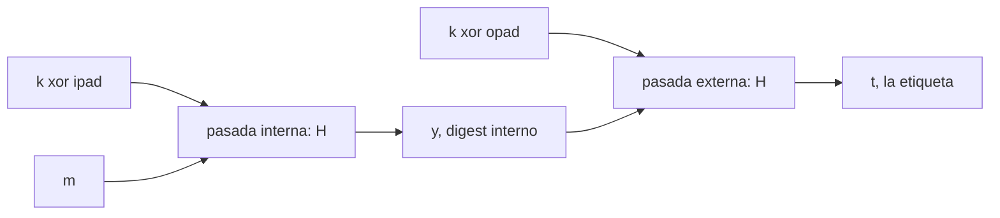

# HMAC

**El MAC que se usa de verdad.** Es la respuesta a *"tengo una función de hash, ¿cómo la convierto en un autenticador?"*, y la respuesta no es la obvia: la construcción tiene **dos pasadas de hash** y dos constantes que parecen sacadas de la galera. Esta nota explica de dónde salen las dos, por qué una sola pasada no funciona, **cuánto cuesta en realidad** la segunda, y por qué —siendo tan segura como [[cbc-mac|CBC-MAC]] y no más— es la que domina las librerías.

> **Fuentes de esta nota.** La filmina de teoría es el slide 33, de la **segunda sesión de la Clase 3, del 03/09**, que **sí tiene transcripción**: [`Clase 03pt2 - Transcripcion.VTT`](../../raw/clases/Clase%2003pt2%20-%20Transcripcion.VTT), 910 cues, bloque `HMAC` en los cues pt2 583-638. Los cues de esa grabación se citan como `(cues pt2 N-M)`, porque la Clase 3 tiene dos grabaciones y las dos numeran desde 1.
>
> La [[practica-04-macs-hash-y-cifrado-autenticado|Práctica 04]] del **31/08** —tres días antes que la teoría— cubre lo mismo en sus filminas 12 y 13, y agrega **`NMAC`**, que no aparece en ninguna de las 41 filminas de teoría. De ahí sale la sección nueva de esta nota. Y **repite la misma errata de `opad`/`ipad` intercambiados**: la errata está en dos decks de autoras distintas, con lo cual no es el desliz de una lámina.

---

## La construcción

Del slide 33, *"Funciones de Hash y MACs"*: **es posible construir un MAC a partir de una función de hash.** Dada $H$ una [[funciones-de-hash-criptograficas|función de hash]] libre de colisiones:

$$\mathsf{HMAC}_{k}(x) = \begin{cases} \textsf{Gen}: & k \leftarrow \mathcal{K},\quad s \leftarrow S \\[4pt] \textsf{Mac}: & t = H^{s}\bigl((k \oplus \mathsf{opad}) \,\Vert\, H^{s}((k \oplus \mathsf{ipad}) \,\Vert\, m)\bigr) \end{cases}$$

y la filmina cierra: **es infalsificable** (`Mac-Forge`) → [[seguridad-de-un-mac|Seguridad de un MAC]].

**No es una construcción de pizarrón: es un estándar publicado.** El docente la presenta explícitamente como una **RFC del IETF**, y ése es el dato que resuelve la duda de dónde verificar los valores de las constantes cuando la filmina y el libro no alcanzan (es la RFC 2104, y después FIPS 198-1).

> [!quote]- De la transcripción — la segunda forma de construir un MAC, y que está en una RFC (cues pt2 583-589)
> *"Cuando vimos [MAC]s, yo les había dicho que había 2 formas de construir los [MAC]s a partir de otras cosas. Habíamos visto una: el [CBC-MAC], que nos permitía construirlo a partir de una **función pseudoaleatoria**. **La segunda forma de construir un [MAC] es a partir de una función de hash criptográfica.** Hay una forma de construcción que está estandarizada: **es una RFC pública, de las que maneja el Internet Engineering Task Force**. (…) Y es bastante simple. O sea: es dada una función de hash que sea **libre de colisiones**, se puede construir un [MAC] de la siguiente manera."*

Tres cosas para leer bien la fórmula antes de seguir:

- **$\Vert$ es concatenación**, no valor absoluto ni condicional → [[notacion-y-terminologia|Notación y terminología]].
- **El selector $s$ va como superíndice**, $H^{s}$ y no $H_{s}$. Es la convención de Katz & Lindell, y la práctica la respeta; **el deck de teoría escribe $H_{s}$ con subíndice**. Es discrepancia notacional entre decks, no errata. El superíndice marca que **$s$ es público**, a diferencia de la clave $k$, que es lo único secreto acá → [[funciones-de-hash-criptograficas|Funciones de hash criptográficas]].
- **La misma $k$ entra dos veces**, xoreada contra dos constantes distintas. Ese es el corazón de la construcción y la sección [[#Qué son en realidad opad e ipad|Qué son en realidad opad e ipad]] explica por qué.

**Cada pasada recibe la clave enmascarada con una constante distinta.** La interna se come el mensaje entero; la externa recibe un único valor de longitud fija, el digest interno.

> [!quote]- De la transcripción — la fórmula leída en voz, con las posiciones correctas (cues pt2 604-607)
> *"Esto es el resultado de calcular el valor de hash de un prefijo que es la clave del [MAC] **[XOR-eada]** contra una constante, y después el mensaje. Esto da un valor, una etiqueta; y a ese valor, **volver a aplicarle la función de hash agregándole como prefijo la clave [XOR] otra constante**."*
>
> La lectura oral coincide con la fórmula del slide y con el RFC: `ipad` en la pasada de adentro, `opad` en la de afuera. Es la asignación de **posiciones**; los **valores** son otra cosa, y ahí es donde las dos láminas de la cátedra se equivocan.

## NMAC: la construcción de la que HMAC es la instanciación

**Este es el aporte principal de la [[practica-04-macs-hash-y-cifrado-autenticado|Práctica 04]] a esta nota, y no aparece en ninguna filmina de teoría.** Katz & Lindell §5.3.2 presenta las dos construcciones en este orden —primero `NMAC`, después `HMAC`— y con razón: `NMAC` es la idea, `HMAC` es la idea hecha implementable.

**La definición, tal como la escribe la filmina 12:**

$$\begin{aligned} \mathsf{Gen}:\;& \text{emite } (s, k_{1}, k_{2}),\quad \lvert k_{1}\rvert = \lvert k_{2}\rvert = n \\[4pt] \mathsf{Mac}:\;& \text{emite } \langle m, t\rangle,\quad t := h^{s}_{k_{1}}\bigl(H^{s}_{k_{2}}(m)\bigr) \end{aligned}$$

con $m = m_{1}m_{2}\ldots m_{B}$, $\lvert m\rvert = L$ y $\lvert m_{B}\rvert = n$.

**Cómo se lee.** Hay **dos claves independientes** y dos objetos distintos:

- $H^{s}_{k_{2}}$ es la **función de hash entera con clave**: un [[construccion-de-merkle-damgard|Merkle-Damgård]] donde $k_{2}$ ocupa el lugar del estado inicial. Procesa el mensaje completo, bloque por bloque, y agrega al final el bloque de longitud $L$. Su salida es un valor $z$ de tamaño fijo.
- $h^{s}_{k_{1}}$ es **una sola aplicación de la función de compresión** con la otra clave, sobre ese $z$. Devuelve la etiqueta.

De ahí el nombre: un hash con clave **anidado** dentro de otro.

> **Errata de la filmina:** en el diagrama de `NMAC` de la filmina 12, la **tercera caja de entrada** está rotulada $z_{1} \Vert m_{B}$ y debería decir $z_{B-1} \Vert m_{B}$. Los demás eslabones están bien ($k_{2}\Vert m_{1} \to z_{1}$, $z_{1}\Vert m_{2} \to z_{2}$, $z_{B}\Vert L \to z$, $k_{1}\Vert z \to t$), así que se lee como un arrastre del rótulo del segundo eslabón. **Verificado sobre el render a 250 dpi**, no sobre la extracción de texto: no es artefacto. El efecto es que la cadena parece saltear de $z_{1}$ directo al último bloque, que es justamente lo que la elipsis del dibujo indica que no pasa.

### Por qué se usa HMAC y no NMAC

Es la pregunta que la filmina no contesta y que vuelve inteligible toda la sección de las constantes.

**`NMAC` necesita dos cosas que una implementación de hash no ofrece.** Primero, **dos claves independientes**, que hay que generar y distribuir. Segundo, y más grave: hay que poder **reemplazar el estado inicial** de la cadena de Merkle-Damgård por $k_{2}$ — es decir, hay que meter mano en la primitiva. Ninguna biblioteca expone eso: `SHA-256` arranca en su $IV$ constante y no hay parámetro para cambiarlo.

**`HMAC` compra las dos cosas de golpe:**

1. **Deriva las dos claves de una sola** — $k \oplus \mathsf{ipad}$ y $k \oplus \mathsf{opad}$ —, con lo cual `Gen` vuelve a emitir una clave y nada más.
2. **No toca el $IV$: antepone la clave enmascarada como primer bloque del mensaje.** Como $k \oplus \mathsf{ipad}$ ocupa exactamente un bloque, el primer paso de la cadena consume sólo la clave y produce un estado que es, para todo efecto, un $IV$ elegido por la clave. **El resultado es idéntico al de reemplazar el $IV$, pero se consigue con la función de hash tal como viene.**

Eso es lo que lo vuelve implementable con `SHA-256` de la biblioteca estándar, sin recompilar nada. Y es la razón práctica —no criptográfica— de que el estándar sea `HMAC` y no `NMAC`.

La filmina 13 dibuja exactamente eso: dos cadenas, la de arriba arrancando en $IV \Vert (k \oplus \mathsf{ipad})$ y comiéndose el mensaje hasta el bloque de longitud, la de abajo arrancando en $IV \Vert (k \oplus \mathsf{opad})$ y procesando **un solo bloque de datos**, el $z$ interno. Es la vista "bajo el capó" que la sección [[#Qué son en realidad opad e ipad|Qué son en realidad opad e ipad]] reconstruye a partir de K&L: **los dos $z_{0}$ del dibujo son el $k_{\text{in}}$ y el $k_{\text{out}}$ del libro.**

> **Imprecisión menor de la filmina 13** *(no errata):* el rótulo $z_{0}$ se reutiliza para los estados iniciales de las **dos** cadenas, que no son el mismo valor —difieren porque la clave está enmascarada distinto—. Y el *"$n$ veces byte"* de las definiciones mezcla unidades con $\lvert k\rvert = n$, que está en bits.

> **Decisión editorial, dicha para que se pueda revisar:** `NMAC` entra como **sección de esta nota** y no como concepto propio. El criterio del vault pide que una idea con nota propia se referencie desde varios lados, y `NMAC` hoy se referencia desde uno solo: `HMAC`. Si la unidad de protocolos vuelve sobre él, se promueve.

## Errata central: opad e ipad tienen los valores intercambiados

> **Errata de la filmina:** el slide 33 de teoría escribe
>
> $\mathsf{opad} = \texttt{0x36}\ldots\texttt{36}$  ·  $\mathsf{ipad} = \texttt{0x5c5c}\ldots\texttt{5c}$
>
> y es **al revés**. El estándar —RFC 2104 §2, y después FIPS 198-1— define:
>
> - **`ipad` = el byte `0x36` repetido** (*inner pad*, el que va en el hash de **adentro**),
> - **`opad` = el byte `0x5C` repetido** (*outer pad*, el que va en el hash de **afuera**).
>
> **Lo que sí está bien es la fórmula.** Las posiciones del slide son las correctas: `opad` afuera, `ipad` adentro, exactamente como la Construcción 5.7 de Katz & Lindell. **El error está sólo en la asignación de los valores numéricos**, no en la estructura. Quien memorice la fórmula del slide y los valores del RFC tiene todo bien.
>
> Ojo con la fuente: **K&L no sirve para verificar esto**, porque el libro sólo dice *"sean `opad` e `ipad` constantes fijas de longitud $n'$"* y nunca da los valores. Hay que citar el RFC.

> **Y no es el desliz de una lámina: está en dos decks.** *(Verificación nuestra sobre los renders de las dos filminas, no sobre `pdftotext`.)* La **filmina 13 de la [[practica-04-macs-hash-y-cifrado-autenticado|Práctica 04]]** —otro deck, otra autora, otra fecha— escribe *"opad = n veces byte `0x36`"* y *"Ipad = n veces byte `0x5C`"*: **el mismo intercambio**. Y en las dos láminas la **fórmula de abajo es correcta**, con `ipad` adentro y `opad` afuera, de modo que las dos se contradicen consigo mismas de la misma manera.
>
> Eso cambia cómo hay que tratarlo: no es una errata de tipeo que se corrige y se olvida, es un **error de origen que se propagó de un material al otro**. Al estudiar conviene asumir que va a reaparecer, y que **la fórmula es la fuente confiable dentro de cada lámina**, no la lista de definiciones.

**Regla mnemotécnica** *(nuestra)*: **i** de `ipad` = **i**nner = **3**6; **o** de `opad` = **o**uter = **5**C. Y como el 3 viene antes que el 5, el orden numérico coincide con el orden de aplicación. El docente usa en voz los nombres completos —*"inner pad"*, *"outer pad"*, *"outer hash"* (cues pt2 593, 600, 615)—, que es exactamente lo que hace la regla memorizable.

**Detalles que ni la filmina ni el enunciado dan** *(del RFC 2104, rotulado)*:

- Las constantes se repiten hasta el **tamaño de bloque de la función de compresión**, no hasta el tamaño del digest ni hasta $\lvert k\rvert$: 64 bytes para `MD5`, `SHA-1` y `SHA-256`; 128 bytes para `SHA-512`. **Las dos láminas de la cátedra simplifican esto**, y la de la práctica lo escribe como *"$n$ veces byte"* con la misma $n$ que la longitud de la clave.
- La clave $k$ se **rellena con ceros** hasta ese mismo tamaño antes del xor. Si $k$ es más larga que el bloque, primero se la hashea.

## Por qué dos pasadas de hash y no una

Es **la** pregunta del slide 33, y ni la filmina ni la clase la contestan. La respuesta corta: **la construcción obvia es insegura**.

El candidato natural para un MAC hecho con hash es

$$\mathsf{Mac}_{k}(m) = H(k \,\Vert\, m)$$

—concatenar la clave adelante y hashear todo—. **Es completamente inseguro si $H$ es `MD5`, `SHA-1` o `SHA-2`** (K&L, Ejercicio 5.10). El ataque se llama **extensión de longitud** (*length extension*):

1. El adversario ve un par legítimo $(m, t)$ con $t = H(k \,\Vert\, m)$.
2. En esas funciones, **el digest ES el estado interno de la cadena** después de procesar el último bloque: la salida se publica tal cual, sin ninguna transformación que la desacople del estado.
3. Entonces el adversario **arranca la cadena desde $t$** —que conoce— y sigue hasheando bloques nuevos $m'$ a su gusto.
4. Obtiene una etiqueta válida para $k \,\Vert\, m \,\Vert\, \mathsf{pad} \,\Vert\, m'$, o sea **para el mensaje $m \,\Vert\, \mathsf{pad} \,\Vert\, m'$, sin conocer $k$**.

Eso es ganar el juego `Mac-Forge`: mensaje nuevo, etiqueta válida, cero consultas extra. Y el mensaje falsificado no es basura: el atacante controla enteramente el sufijo $m'$.

> **Precisión importante, porque acá el modelo de la cátedra y las funciones reales no coinciden.** El paso 2 vale para `MD5`, `SHA-1` y `SHA-2`, **no para el modelo general de Merkle-Damgård tal como lo presenta la cátedra**. El docente sostiene que la construcción de la filmina 29 incorpora una **transformación final** que impide que salgan los estados intermedios, y que por eso ahí no habría problema (cues pt2 327, 362-364). Las dos cosas se concilian de una sola manera, y es la que adopta el vault: **esa transformación final $g$ es una contramedida del modelo, y las tres funciones desplegadas la instancian como la identidad.** Por eso el length extension es real en la práctica, por eso `HMAC` es anidado en vez de $H(k\Vert m)$, y por eso este párrafo no contradice a [[construccion-de-merkle-damgard|Construcción de Merkle-Damgård]] sino que se apoya en él. La discrepancia con lo dicho en clase está registrada allá, que es donde corresponde discutirla.

> **Es el mismo ataque que el slide 21, en otro envase.** *(Lectura nuestra; el paralelismo es lo mejor que se saca de cruzar las dos sesiones de la clase.)* El ataque al sufijo de longitud contra [[cbc-mac|CBC-MAC]] explota que la etiqueta es el **estado encadenado** y que el adversario puede seguir encadenando desde ahí. Length extension contra $H(k\Vert m)$ explota exactamente lo mismo, con la función de compresión en el lugar de $F_k$. **Toda construcción iterativa que publique su estado final como salida es atacable por extensión**, y las dos sesiones de la Clase 3 son dos casos de esa frase.

**Qué arregla la segunda pasada.** El hash externo $H^{s}((k\oplus\mathsf{opad}) \Vert y)$ toma como entrada un $y$ de **longitud fija** (el digest interno) y devuelve un valor del que ya no se puede continuar la cadena interna: para extender haría falta el estado de la cadena **externa**, que también termina en el digest, pero cuya entrada empieza con $k \oplus \mathsf{opad}$ —secreto—. Dicho corto: **la pasada externa sella la cadena interna detrás de una segunda clave.**

## Qué son en realidad opad e ipad

No son relleno decorativo: son **el mecanismo que deriva dos claves independientes a partir de una sola $k$** — o sea, son lo que convierte `NMAC` en `HMAC`. Katz & Lindell §5.3.2 lo hace explícito mirando la construcción "bajo el capó", con $h^{s}$ la función de compresión y $IV$ el valor inicial de la cadena:

$$k_{\text{in}} := h^{s}\bigl(IV \,\Vert\, (k \oplus \mathsf{ipad})\bigr), \qquad k_{\text{out}} := h^{s}\bigl(IV \,\Vert\, (k \oplus \mathsf{opad})\bigr)$$

Como $k\oplus\mathsf{ipad}$ ocupa exactamente un bloque, **el primer paso de cada cadena consume sólo la clave enmascarada**: $k_{\text{in}}$ y $k_{\text{out}}$ son los estados iniciales de las dos cadenas — **los dos $z_{0}$ del diagrama de la filmina 13**. Esquemáticamente, `HMAC` es entonces

$$\mathsf{HMAC}_{k}(m) = h^{s}\bigl(k_{\text{out}} \,\Vert\, H_{\,k_{\text{in}}}(m)\bigr)$$

donde $H_{k_{\text{in}}}$ es la cadena interna arrancada desde $k_{\text{in}}$ en lugar del $IV$. Puesto al lado de la fórmula de `NMAC`, la correspondencia es exacta: $k_{\text{in}}$ hace de $k_{2}$ y $k_{\text{out}}$ hace de $k_{1}$.

### Qué pide de verdad la prueba: sólo que sean distintas

Acá había que corregir algo que esta nota afirmaba de más.

**La prueba de seguridad de `HMAC` exige una sola cosa de `ipad` y `opad`: que sean distintas entre sí.** No que difieran en la mitad de los bits, no que estén "lo más separadas posible", no ninguna propiedad algebraica. El docente lo dice sin ambigüedad, y es la única condición que enuncia.

Si fueran iguales, $k_{\text{in}} = k_{\text{out}}$ y las dos pasadas usarían la misma clave, con lo que la externa dejaría de ser una barrera independiente. **Ésa es toda la exigencia.**

> **Entonces, ¿por qué precisamente `0x36` y `0x5C`?** Por un motivo que **no es criptográfico sino sociológico**, y que tiene nombre propio en el campo: *nothing up my sleeve*. Cuando en una primitiva hay que fijar constantes arbitrarias, la sospecha por defecto de la comunidad es que esconden una puerta trasera — que quien las eligió sabe algo que los demás no. La defensa es elegir valores cuya procedencia sea **evidentemente inocente**: cero, un patrón regular, los dígitos de $\pi$, algo que nadie pueda acusar de haber sido buscado. `0x36` y `0x5C` son **un byte repetido en todo el bloque**: no hay dónde esconder nada.

> [!quote]- De la transcripción — nothing-up-my-sleeve, y qué pide realmente la prueba (cues pt2 594-602)
> *"[Un valor] donde todos los bits tienen el mismo valor, porque esto en criptografía ocurre en general —por lo sensible que es el tema— siempre está la preocupación de que haya **backdoors**: algún secreto que, si alguien lo conoce, puede vulnerar la seguridad. Entonces, cuando se introducen valores constantes, típicamente o es una constante 0, o es un vector aleatorio, o es **una constante que sea lo suficientemente regular como para que nadie crea que hay trampa**. O sea: si éste fuese un valor arbitrario, **media Internet estaría diciendo: seguro que hay algún truco**."*
>
> *"Entonces, la prueba de seguridad del [HMAC], lo que requiere es que **las 2 constantes, el inner pad y el outer pad, sean distintas. Es lo único que requiere.** Entonces simplemente se definieron 2 constantes que se repiten en todos los bytes, como para decir: **acá no hay gato encerrado**."*

> **Es exactamente el argumento de las cajas $S$ de `DES`, con el signo cambiado.** *(Lectura nuestra.)* Allá las constantes eran **secretas** y la sospecha de puerta trasera duró quince años, hasta que se descubrió que estaban bien elegidas → [[des-y-3des#Evolución: cómo se erosionó|DES y 3-DES]]. Acá el diseño toma la lección: las constantes son públicas *y* además tan regulares que su elección no admite discusión. El costo de la sospecha se paga en adopción, no en seguridad — y `HMAC` lo evitó por diseño.

> **Sobre el cálculo que esta nota traía antes** *(precisión nuestra).* $\texttt{0x36} \oplus \texttt{0x5C} = \texttt{0x6A} = 01101010_2$, o sea que difieren en 4 de los 8 bits. **El dato es correcto; la interpretación que le dábamos, no.** Presentábamos esa separación como un criterio de diseño, y no lo es: la prueba no lo pide. Queda como observación, no como razón.

## Cuánto cuesta en realidad

Es la objeción que aparece siempre al ver la fórmula: *"hay que hashear el mensaje dos veces, esto tiene que costar el doble"*. **Es falso, y por un motivo que se ve de una vez que se entiende dónde entra el mensaje.**

$$t = \underbrace{H^{s}\bigl((k \oplus \mathsf{opad}) \,\Vert\, \underbrace{H^{s}((k \oplus \mathsf{ipad}) \,\Vert\, m)}_{\text{acá entra } m,\ \text{una sola vez}}\bigr)}_{\text{procesa } \sim 2 \text{ bloques, siempre}}$$

- **El hash interno procesa el mensaje entero**, una sola vez, más un bloque extra por la clave enmascarada.
- **El hash externo no ve el mensaje.** Ve $(k\oplus\mathsf{opad})$ —un bloque— concatenado con el digest interno —de tamaño fijo, 256 bits para `SHA-256`—. Eso son **dos bloques, independientemente de si $m$ pesa 10 bytes o 10 gigabytes**.

**La cuenta.** Si el mensaje ocupa $B$ bloques, `HMAC` cuesta del orden de $B + 3$ aplicaciones de la función de compresión, contra $B$ del hash pelado. Para $B = 1$ eso es cuatro veces; para $B = 1000$ es un 0,3 % de sobrecosto. **El "doble" no aparece nunca**: la segunda pasada es un costo *aditivo constante*, no multiplicativo.

> [!quote]- De la transcripción — la confusión típica y por qué no es cara (cues pt2 608-617)
> *"Cuando uno mira así, una confusión típica que aparece es: *uy, hay que procesar el mensaje 2 veces, esto es carísimo*. Pero fíjense que en realidad —hay que aplicar 2 veces la función de [hash], eso sí— **el mensaje, que es lo que puede variar en longitud, se procesa una sola vez**. Porque lo primero que se calcula es este término (…) la clave tiene una longitud dada por la definición del [MAC], pero pongamos el caso estándar, 128 bits: es un bloque chiquitito (…) concatenado el mensaje. **El resultado de esta función es una etiqueta, es un bloque de tamaño constante.** Entonces el segundo hash, lo que se llama el **outer hash**, se aplica sobre un mensaje que tiene **2 bloques, típicamente no más, independientemente de la longitud del mensaje**. Así que esta operación, si bien a primera vista asusta un poco, **prácticamente tiene la misma velocidad que calcularle el hash al mensaje**."*

## HMAC contra CBC-MAC: por qué domina en las librerías

**La respuesta no es "porque es más seguro".** Es el punto que el docente subraya, y conviene tenerlo claro porque la intuición empuja para el otro lado: si una construcción domina el mercado, uno asume que es la mejor. Acá no.

**Las dos son seguras**, cada una con su teorema: [[cbc-mac|CBC-MAC]] a partir de una función pseudoaleatoria, `HMAC` a partir de una función de hash libre de colisiones. **La diferencia es de costo por byte.**

- Una **permutación pseudoaleatoria** de un cifrado de bloque (`AES`, `DES`) es cara en cantidad de operaciones: rondas, sustituciones, permutaciones, mezclas de columnas → [[primitiva-de-cifrado-en-bloque|Primitiva de cifrado en bloque]].
- Una **función de compresión** de hash es notablemente más liviana.
- Resultado: hashear un mensaje sale entre **uno y tres órdenes de magnitud** más barato que cifrarlo, y `CBC-MAC` necesita cifrarlo entero.

**Dónde eso decide algo.** En una etiqueta suelta, un factor de mil sobre microsegundos no cambia nada. En aplicaciones masivas —etiquetar teras o petabytes de información, que es el escenario que el docente anticipa para la clase de protocolos— es la diferencia entre viable y no viable.

> [!quote]- De la transcripción — el factor de velocidad, y que la elección es ingenieril (cues pt2 625-638)
> *"En la práctica, la mayor cantidad de implementaciones que van a haber (…) son de este tipo. **No porque sean más seguras**, sino por un tema práctico: las permutaciones pseudoaleatorias que forman parte de los criptosistemas de bloque son funciones que suelen ser **pesadas en términos de cantidad de operaciones** —si bien se pueden acelerar por hardware y demás—, son pesadas versus las funciones de compresión de las funciones de [hash]. Entonces, típicamente, calcular la etiqueta de un mensaje es **1 a 3 órdenes de magnitud más rápido que cifrar ese mensaje**, que sería lo que se necesita para hacer el [CBC-MAC]."*
>
> *"Y por ese motivo, especialmente cuando lo pensamos para aplicaciones masivas —como vamos a ver en la clase de protocolos— (…) estamos hablando de etiquetar **teras, petabytes de información**: hace una diferencia grande. Entonces, en la práctica, en implementaciones, incluso en librerías, hay como cierta preponderancia hacia los [HMAC]; **pero son tan seguras como los [CBC-MAC]: es un tema más que nada ingenieril**, la razón por la cual se utilizan más."*

> **Por qué el matiz importa para el parcial** *(lectura nuestra).* Ante la pregunta *"¿por qué se usa `HMAC` y no `CBC-MAC`?"*, la respuesta *"porque es más seguro"* está **mal**, y la respuesta *"porque es más rápido"* está bien pero incompleta. La completa: **son igual de seguras, y la elección es de rendimiento** — con el agregado de que `HMAC` reutiliza una primitiva que el sistema ya tiene por otros motivos, mientras que `CBC-MAC` obliga a tener un cifrado de bloque disponible. Es exactamente el tipo de decisión que [[eleccion-de-primitivas|Elección de primitivas]] llama de ingeniería y no de criptografía.

## HMAC es el paradigma hash-and-MAC

**Construcción 5.5 de K&L.** Con $\Pi$ un MAC seguro para mensajes de **longitud fija** $\ell$ y $\Pi_H$ una familia de hash resistente a colisiones con salida de $\ell$ bits:

$$\mathsf{Mac}'_{\langle k, s\rangle}(m) := \mathsf{Mac}_{k}\bigl(H^{s}(m)\bigr)$$

**Teorema 5.6.** Si $\Pi$ es un MAC seguro para longitud $\ell$ y $\Pi_H$ es resistente a colisiones, entonces $\mathsf{Mac}'$ es un MAC seguro **para longitud arbitraria**.

**El docente remite explícitamente a esa demostración**, y la enuncia con la hipótesis correcta: hash libre de colisiones implica MAC infalsificable.

> [!quote]- De la transcripción — el teorema, y dónde está la demostración (cues pt2 618-621)
> *"Se puede demostrar —**está en el libro; para el que quiera profundizarlo, en el libro de [Katz] está la demostración**— se puede demostrar que **si la función de hash $H$ es libre de colisiones, este [MAC] es infalsificable**: o sea, no hay adversario que gane la prueba del [`Mac-Forge`]."*

**La demostración parte en dos casos, y vale como plantilla para el parcial.** Sea $m^{*}$ el mensaje que el adversario falsifica y $Q$ el conjunto de mensajes que consultó:

$$\begin{aligned} \textbf{Caso 1.}\;& \text{Hay algún } m \in Q \text{ con } H^{s}(m^{*}) = H^{s}(m). \\ & \text{Como } m^{*} \neq m,\ \text{el par } (m^{*}, m) \text{ es una } \textbf{colisión} \;\Rightarrow\; \text{contradice } \Pi_H. \\[6pt] \textbf{Caso 2.}\;& \text{No hay ninguno.} \\ & \text{Entonces } H^{s}(m^{*}) \text{ es un mensaje } \textbf{nuevo} \text{ para el MAC de longitud fija,} \\ & \text{y } A \text{ lo falsificó} \;\Rightarrow\; \text{contradice } \Pi. \end{aligned}$$

Los dos casos son exhaustivos, así que un falsificador de $\mathsf{Mac}'$ rompe una de las dos piezas. **Ésa es la justificación de la línea "dado $H$ libre de colisiones" del slide 33**: la resistencia a colisiones no está de adorno, es exactamente lo que descarta el Caso 1.

**Y `HMAC` encaja ahí**: la capa interna $y = H^{s}((k\oplus\mathsf{ipad})\Vert m)$ es la parte de **hash**, y la capa externa es el **MAC de longitud fija** aplicado a $y$.

> **Nota de vocabulario.** *"Libre de colisiones"* es el término que usa la cátedra de manera consistente —la filmina 28 y los cues pt2 293, 589 y 620—, no una imprecisión ocasional. La discusión terminológica (por qué en rigor se dice *resistente a colisiones*) está en [[resistencias-de-una-funcion-de-hash|Resistencias de una función de hash]].

## Por qué es infalsificable, con la hipótesis fina

La filmina afirma *"es infalsificable (`Mac-Forge`)"* y ahí termina. El teorema específico de `HMAC` es más cuidadoso:

> **Teorema 5.8 (K&L).** Si $G^{s}(k) = h^{s}(IV\Vert(k\oplus\mathsf{opad})) \,\Vert\, h^{s}(IV\Vert(k\oplus\mathsf{ipad}))$ es un [[generador-pseudoaleatorio|generador pseudoaleatorio]] para todo $s$, **el MAC $\widetilde{\mathsf{Mac}}_{k}(y) := h^{s}(k \,\Vert\, \hat{y})$ es un MAC seguro de longitud fija para mensajes de $n$ bits**, y $(\mathsf{Gen}_H, H)$ es **débilmente** resistente a colisiones, entonces `HMAC` es un MAC seguro (para mensajes de longitud arbitraria).

**Son tres hipótesis, no dos.** La del medio es la que hace el trabajo de MAC en la pasada externa: $\hat{y}$ es el digest interno ya paddeado, y $\widetilde{\mathsf{Mac}}$ es una sola evaluación de la función de compresión con $k_{\text{out}}$ en el lugar de la clave —es decir, exactamente la capa externa que la sección anterior identificó como el MAC de longitud fija del paradigma hash-and-MAC, y exactamente el $h^{s}_{k_{1}}$ de `NMAC`—. K&L aclara que es una hipótesis razonable *por cómo se diseñan en la práctica las funciones de compresión* (§6.3.1).

Y dos cosas cambian respecto de la afirmación de la filmina:

- La hipótesis sobre las constantes se vuelve concreta: lo que se pide es que **derivar $k_{\text{in}}$ y $k_{\text{out}}$ desde $k$ sea pseudoaleatorio**, que es precisamente el trabajo de `ipad` y `opad` — y encaja con lo dicho en clase, porque **constantes iguales harían de $G^{s}$ un generador que repite su salida**, o sea trivialmente distinguible.
- La resistencia a colisiones que hace falta es **débil**, no la total. Y eso no es un tecnicismo.

> **La anécdota que muestra por qué la granularidad de las hipótesis tiene consecuencias.** Cuando `MD5` cayó en 2004, los ataques **no violaban la resistencia débil a colisiones**, así que **`HMAC-MD5` no quedó roto junto con `MD5`**. K&L lo dice tal cual: eso *"les dio a los desarrolladores tiempo para reemplazar `MD5` en las implementaciones de `HMAC` sin miedo inmediato a un ataque"*. Es el mejor ejemplo del curso de que enunciar la hipótesis más débil que alcanza no es prolijidad académica: **es la diferencia entre un parche urgente y una migración ordenada.** (El libro aclara igual que hoy no debe usarse.)
>
> Dicho con el vocabulario de [[estado-de-un-criptosistema#Los tres estados|Estado de un criptosistema]]: en 2004 `MD5` quedó **quebrada** como función de hash y `HMAC-MD5` quedó apenas **debilitado**, porque los dos dependen de propiedades distintas de la misma función. Es el caso más limpio de *"seguro y quebrado al mismo tiempo, según contra qué prueba"* → [[primitivas-de-hash-estandar|Primitivas de hash estándar]]

## HMAC en la práctica

Esta sección estaba escrita como lectura propia. **Con la sesión del 03/09 tiene respaldo de cátedra** —el docente afirma la preponderancia en librerías y da su motivo (cues pt2 625-638)—, así que lo que sigue queda como el detalle de dónde aparece.

`HMAC` **es el MAC que se usa en casi todos lados donde hace falta autenticar sin cifrar**.

| Dónde | Cómo aparece |
|---|---|
| `TLS` | integridad de registros en las suites previas a los modos autenticados, y la derivación de claves de sesión |
| `JWT` | los tokens firmados con `HS256` son literalmente `HMAC-SHA256` sobre el header y el payload |
| APIs y webhooks | firmar el cuerpo de un request con una clave compartida es el patrón por defecto; el receptor recalcula y compara |
| Derivación de claves | `PBKDF2` y `HKDF` están construidos **sobre** `HMAC`, no sobre el hash pelado |

La costumbre de nombrarlo `HMAC-SHA256` en vez de `HMAC` a secas es la misma disciplina que `AES-CBC` en vez de `AES` → [[eleccion-de-primitivas|Elección de primitivas]]: la construcción y la primitiva son dos decisiones distintas y las dos hay que declararlas. Con qué instanciarlo hoy: [[primitivas-de-hash-estandar#Qué usar, en la práctica|Primitivas de hash estándar]].

> **Dos advertencias operativas que van con esto** *(nuestras, salen de K&L cap. 4).*
> - **`HMAC` no protege contra replay.** Un par $(m,t)$ válido lo es para siempre, porque la definición de MAC no tiene estado. Hacen falta números de secuencia o timestamps — y eso **sí es material de cátedra**, en la filmina 2 de la [[practica-04-macs-hash-y-cifrado-autenticado|Práctica 04]] → [[ataques-de-repeticion-y-frescura|Ataques de repetición y frescura]].
> - **Comparar la etiqueta con `strcmp` filtra el resultado por temporización.** Comparar byte a byte y cortar al primer error revela **cuántos bytes coinciden**, y eso permite reconstruir la etiqueta byte por byte. Pasó de verdad en la Xbox 360. La comparación tiene que ser **de tiempo constante**, siempre sobre todos los bytes.
