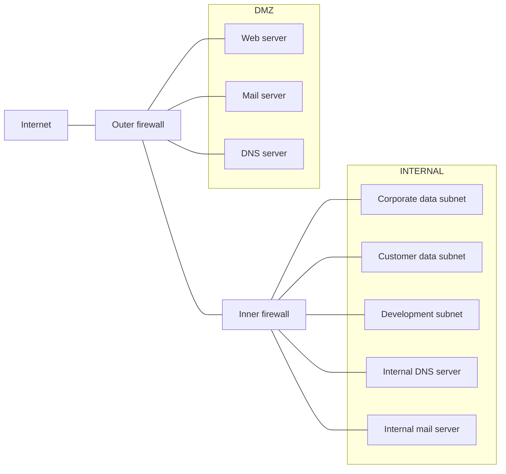

# Seguridad a nivel de red

**Por qué el diseño de la red de una empresa no es "la" solución de seguridad sino una capa que ejecuta una decisión tomada antes, y cuál es el diagrama de referencia que estructura las 32 filminas siguientes de la clase.** Es la nota que fija el encuadre: sin él, el resto de la clase —firewalls, `iptables`, DMZ, el caso de estudio completo— se lee como una colección de mecanismos sueltos en lugar de la ejecución ordenada de una política.

*(Filminas 2 a 4 del deck de Seguridad en Redes.)* La clase correspondiente, **Clase 10 — Seguridad en la empresa**, todavía no se dictó —hoy es 04/09/2026, la fecha en el cronograma es el 29/10/2026—, así que esta nota está escrita contra el PDF de filminas y lecturas propias, rotuladas como tales. No hay transcripción ni video que la respalde: ver [[clase-10-seguridad-en-la-empresa#Estado de las fuentes|Estado de las fuentes de la clase]].

---

## El encuadre: tres ideas antes de cualquier diagrama (filmina 2)

La filmina de apertura, titulada simplemente *"Introducción"*, no define ningún mecanismo — fija tres condiciones que gobiernan todo lo que sigue:

1. **Es aplicación, no invención.** *"Aplicación de principios básicos en diseño y construcción de redes."* Los principios en cuestión son los ocho de Saltzer y Schroeder que desarrolla [[principios-de-diseno|Principios de diseño]] — menor privilegio, mediación completa, separación de privilegios, mecanismos exclusivos, aceptación psicológica, entre otros—. Esta clase no agrega principios nuevos: muestra cómo esos ocho, pensados en abstracto, se traducen en decisiones concretas de topología de red.
2. **Se parte de una política ya definida.** *"Se parte de una política de seguridad a implementar."* El orden importa: primero existe la política —qué está permitido y qué no, para quién—, y **después** se diseña la red que la hace cumplir. La red no decide la política, la ejecuta. Es la costura exacta con la [[clase-06-politicas-de-seguridad-y-control-de-acceso|Clase 06]], que define una [[politica-de-seguridad-y-sistema-seguro|política de seguridad]] como la partición de los estados de un sistema en autorizados y no autorizados. *(Síntesis nuestra, no una equivalencia que dé ninguna filmina del deck.)* Un firewall es, en esos términos, un mecanismo de transición que intenta garantizar que ninguna transición cruce esa partición hacia el lado no autorizado.
3. **Los principios son guías, no una receta única.** *"Los principios de diseño son guías para la definición de la arquitectura de redes."* Esta advertencia es la que habilita, treinta filminas después, que la clase cierre reconociendo [[variaciones-de-la-arquitectura|variaciones legítimas]] del mismo esquema — clusters, redes chicas con servidores unificados. Si los principios fueran una receta fija, esas variaciones serían errores; al ser guías, son adaptaciones válidas a otro contexto de costo y riesgo.

## El límite explícito del diseño de red (filmina 3)

La segunda filmina, titulada *"Aplicaciones seguras... SecComm"*, funciona como advertencia antes de mostrar un solo diagrama: evita que el resto de la clase se lea como si la arquitectura de red alcanzara para resolver la seguridad de la empresa entera.

Dos puntos, verificados contra la página renderizada:

- **La estructura de la red debe implementar mecanismos de control que fuercen la política definida.** Repite el punto 2 de la filmina anterior, ahora en términos de obligación: no basta con que la red *pueda* cumplir la política, tiene que forzarla.
- **Es probable que no se pueda contemplar TODA la política mediante el diseño de red** (mayúsculas de la filmina). Dos huecos nombrados explícitamente: **falta seguridad en sistemas y en aplicaciones** —un firewall bien configurado no repara una aplicación web vulnerable que corre detrás de él— y **faltan procedimientos manuales** —políticas de contraseñas, capacitación, respuesta a incidentes, todo lo que ninguna regla de `iptables` puede forzar.

> **Sobre el título "SecComm"** *(inferencia nuestra).* Ninguna filmina define ni vuelve a usar la sigla. Por posición y contenido —la lámina que fija el límite del diseño de red frente a la seguridad de sistemas y aplicaciones— es consistente con *Secure Communications*, un rótulo de sección heredado de una versión anterior o más larga del deck que no llegó a explicarse en el material que sí tiene la cátedra. No hay forma de confirmarlo sin la clase en vivo, así que se deja como curiosidad de fuente, no como una pieza de contenido.

Esta filmina es la razón de fondo por la que el caso de estudio de las filminas 16-35 insiste tanto en la **defensa en profundidad**: si el diseño de red fuera "la" solución, una sola capa alcanzaría. Como no lo es, cada servicio del caso de estudio se piensa asumiendo que **alguna** capa va a fallar — el servidor web puede comprometerse, el firewall externo puede tener un bug de software (ver [[analisis-de-puntos-de-entrada|Análisis de puntos de entrada]]) — y el diseño entero está armado para que esa falla puntual no se propague al resto.

## El diagrama de referencia (filmina 4)

La filmina 4, *"Caso ejemplo: Solución a nivel red"*, presenta el diagrama que estructura las 32 filminas restantes de la clase: `Internet` a la izquierda, un `Outer firewall`, una `DMZ` con `Web server`, `Mail server` y `DNS server`, un `Inner firewall`, y la red `INTERNAL` con `Corporate data subnet`, `Customer data subnet`, `Development subnet`, `Internal DNS server` e `Internal mail server`.

La filmina cita la fuente al pie: *"Figura tomada de Computer Security Art & Science – Matt Bishop. Cap 26 – Network Security – pp 780"*. Es el mismo capítulo que la filmina de cierre del deck (36) vuelve a recomendar — el caso de estudio completo de la clase, filminas 16 a 35, está tomado de Bishop, no es invención de la cátedra.

Dos rasgos del diagrama que vale la pena notar antes de entrar al resto de la clase:

- **Dos firewalls, no uno.** Hay mediación en dos puntos —Internet↔DMZ e DMZ↔interna—, no un único perímetro. Eso es lo que permite escribir políticas distintas y asimétricas para cada uno (ver [[reglas-de-los-firewalls-externo-e-interno|Reglas de los firewalls externo e interno]]).
- **La DMZ concentra todo lo que Internet necesita alcanzar directamente** —web, mail, DNS—, y la red interna no aparece del lado de afuera en ningún momento. Esa separación es, en sí misma, la aplicación concreta de [[principios-de-diseno#7. Mecanismos exclusivos|mecanismos exclusivos]] y de [[principios-de-diseno#6. Separación de privilegios|separación de privilegios]]: un servicio comprometido en la DMZ no hereda automáticamente acceso a la red interna, y viceversa.
