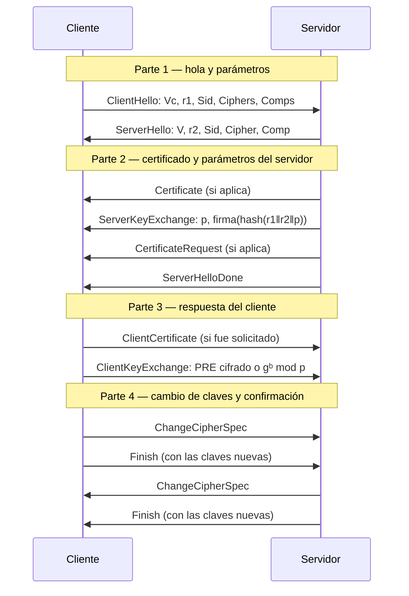

# TLS handshake

**Los diez mensajes, en cuatro partes, que negocian los parámetros de una conexión TLS, autentican al menos al servidor y terminan derivando una clave de sesión simétrica de 48 bytes que ninguna de las dos partes tenía al empezar.** Es la nota más larga del bloque TLS porque es donde confluye todo lo anterior: usa los certificados X.509 de las secciones 4-6 de la clase, negocia una suite de las de [[suites-criptograficas-de-tls|Suites criptográficas de TLS]], y termina llenando exactamente los campos que [[sesion-y-conexion-tls|Sesión y conexión TLS]] describe.

Sale de las **filminas 38 a 43** del PDF de teoría de la Clase 05. La clase todavía no se dictó — hoy es 04/09/2026, la Clase 05 es el 17/09 según el [[cronograma]] — así que esta nota está escrita contra el PDF de filminas, Katz & Lindell y lecturas propias rotuladas. No hay transcripción ni callouts *De la transcripción*. Las filminas 38, 39, 40, 41, 42 y 43 fueron verificadas contra la página renderizada a 150 dpi.

## Panorama en cuatro partes

El objetivo de las cuatro partes, en una frase cada una: **acordar** qué se va a usar (Parte 1), **autenticar al servidor** y darle los parámetros que le faltan al cliente (Parte 2), **darle al servidor lo que le falta a él** —y, opcionalmente, autenticar también al cliente— (Parte 3), y **confirmar, ya bajo las claves nuevas, que ambos calcularon lo mismo** (Parte 4).

## Parte 1 (filmina 38): hola y parámetros

$$\mathrm{ClientHello}: \quad C \to S:\ \{V_c \,\Vert\, r_1 \,\Vert\, S_{id} \,\Vert\, \mathrm{Ciphers} \,\Vert\, \mathrm{Comps}\}$$
$$\mathrm{ServerHello}: \quad C \leftarrow S:\ \{V \,\Vert\, r_2 \,\Vert\, S_{id} \,\Vert\, \mathrm{Cipher} \,\Vert\, \mathrm{Comp}\}$$

con $V_c$ la versión de TLS del cliente, $V = \min(\text{versión cliente}, \text{versión servidor})$ la versión efectivamente acordada, $r_1, r_2$ los nonces de cada lado (un timestamp más 28 bytes aleatorios — la misma pareja de nonces que reaparece guardada en la [[sesion-y-conexion-tls#Conexión: los parámetros de uso, frescos por instancia|conexión]]), $S_{id}$ el identificador de sesión (0 para iniciar una nueva), y `Ciphers`/`Comps` frente a `Cipher`/`Comp` la lista completa que el cliente ofrece frente a la opción que el servidor elige de esa lista — el mecanismo de negociación de [[suites-criptograficas-de-tls|suite criptográfica]].

**Ningún mensaje de esta parte está cifrado ni autenticado todavía**: es, literalmente, la primera vez que las dos partes se hablan, así que no hay con qué protegerlo. Toda la seguridad del handshake se construye a partir de las partes siguientes.

## Parte 2 (filminas 39-40): certificado y parámetros del servidor

$$\mathrm{Certificate}\ (\text{si el servidor es autenticado}): \quad C \leftarrow S:\ \{\text{Certificado}\}$$
$$\mathrm{ServerKeyExchange}: \quad C \leftarrow S:\ \{\,p \,\Vert\, \{\mathrm{hash}(r_1\,\Vert\,r_2\,\Vert\,p)\}_{K_s}\,\}$$
$$\mathrm{CertificateRequest}\ (\text{si el cliente es autenticado}): \quad C \leftarrow S:\ \{\mathrm{ctype} \,\Vert\, \mathrm{CAs}\}$$
$$\mathrm{ServerHelloDone}: \quad C \leftarrow S:\ \{\,\}$$

con $p$ los parámetros criptográficos del intercambio de clave elegido — $(e, n)$ para `RSA`, $(p, g, g^{a})$ para Diffie-Hellman, $r$ para *fortezza* —, $K_s$ la clave **privada** del servidor —la que corresponde a la pública del certificado, así que $\{\cdot\}_{K_s}$ acá es una **firma**, no un cifrado de confidencialidad—, `ctype` el tipo de certificados de cliente que el servidor acepta algorítmicamente, y `CAs` la lista de autoridades certificantes que el servidor reconoce para ese certificado de cliente.

**Por qué el `ServerKeyExchange` firma justamente $\mathrm{hash}(r_1\Vert r_2\Vert p)$** *(lectura nuestra, no está en la filmina)*: incluir los nonces $r_1$ y $r_2$ adentro de lo firmado ata esta firma a **esta ejecución concreta** del handshake — un atacante no puede grabar un `ServerKeyExchange` legítimo de una conexión anterior y reproducirlo en una nueva, porque los nonces de la nueva conexión son distintos y la firma no va a coincidir con ellos. Es la misma lógica de frescura que ya apareció en [[denning-sacco-y-frescura|Denning-Sacco]], instanciada acá con nonces en lugar de timestamps.

**El `ServerKeyExchange` es opcional**, y no aparece en toda suite: cuando el intercambio de clave es `RSA` puro, el servidor no tiene ningún parámetro adicional que mandar —el cliente va a cifrar directamente con la clave pública del certificado, en la Parte 3—; el `ServerKeyExchange` hace falta específicamente cuando hay parámetros de Diffie-Hellman (u otro esquema con parámetros propios) que el servidor tiene que comunicarle al cliente y **firmar** para que el cliente confíe en que salieron del servidor real y no de un atacante.

## Parte 3 (filmina 41): respuesta del cliente

$$\mathrm{ClientCertificate}\ (\text{solo si fue solicitado}): \quad C \to S:\ \{\text{Certificado}\}$$
$$\mathrm{ClientKeyExchange}\ (\text{versión } \texttt{RSA}): \quad C \to S:\ \{V \,\Vert\, \mathrm{PRE}_{\mathrm{rand}}\}_{K_s}$$
$$\mathrm{ClientKeyExchange}\ (\text{versión } \texttt{DH}): \quad C \to S:\ \{g^{b} \bmod p\}_{K_s}, \qquad \mathrm{PRE} = g^{ab} \bmod p$$

con $V$ la versión que el cliente había informado originalmente en el `ClientHello` y $g, p$ los parámetros de Diffie-Hellman que informó el servidor en la Parte 2.

**La misma letra, $K_s$, dos claves distintas — la trampa de notación central de esta nota.** En la Parte 2, $\{\cdot\}_{K_s}$ era una **firma** con la clave **privada** del servidor. Acá, en la Parte 3, $\{\cdot\}_{K_s}$ es un **cifrado** con la clave **pública** del servidor —la que el cliente ya obtuvo del certificado de la Parte 2—: no puede ser la privada, porque entonces el servidor no tendría con qué descifrar lo que el cliente le manda, y cualquiera con el certificado (que es público) podría "descifrar" del mismo modo. Es el mismo símbolo reusado para las dos mitades de un mismo par de claves asimétrico, y hay que leer cada aparición según qué operación hace falta en ese punto del protocolo: **firmar hacia el cliente usa la privada, cifrar hacia el servidor usa la pública.**

$$\underbrace{\{\mathrm{hash}(r_1\Vert r_2\Vert p)\}_{K_s}}_{\text{Parte 2 — firma, con la privada}} \qquad\qquad \underbrace{\{V \Vert \mathrm{PRE}_{\mathrm{rand}}\}_{K_s}}_{\text{Parte 3 — cifrado, con la pública}}$$

### Por qué V viaja de nuevo, adentro del ClientKeyExchange: el ataque de downgrade

**Esto es lo que la filmina anota en una sola línea al pie —"previene downgrade attacks"— y conviene desarrollar entero, porque es el ejemplo de ataque activo más concreto de todo el handshake** *(desarrollo nuestro, la idea general está en la filmina)*.

**El escenario sin esta protección.** Supongamos que el cliente soporta hasta `TLS 1.2` y el servidor también, pero un atacante activo, interpuesto en la red, **intercepta y reescribe** el `ClientHello` y el `ServerHello` para que ambos anuncien solamente `SSL 3.0` —una versión más vieja, con algoritmos más débiles—. Cliente y servidor, sin ninguna otra información, terminan de buena fe negociando `SSL 3.0` como si fuera la mejor versión que ambos soportan, cuando en realidad los dos soportaban algo mejor. El atacante logró forzar el uso de la criptografía más débil disponible, sin romper ninguna primitiva — solo interfiriendo la negociación.

**Por qué repetir $V$ adentro del `ClientKeyExchange` lo evita.** El valor $V$ que el cliente manda acá es la versión que **el cliente mismo informó originalmente**, en su propio `ClientHello` de la Parte 1 — no la versión que terminó negociada. Este mensaje, a diferencia del `ClientHello`, viaja **cifrado** con la clave pública del servidor: un atacante en el medio no puede leerlo ni modificarlo sin romper el cifrado. Cuando el servidor descifra $\{V \Vert \mathrm{PRE}_{\mathrm{rand}}\}_{K_s}$ con su clave privada, compara el $V$ que recibe acá —el que el cliente dice haber pedido originalmente— contra la versión $V$ que **efectivamente** quedó negociada en el `ServerHello`. Si un atacante interceptó y bajó la versión negociada, esas dos versiones **no van a coincidir**, y el servidor puede abortar la conexión en ese momento — el ataque deja evidencia, porque el único canal por el que viajó la versión "real" del cliente estaba protegido y el atacante no pudo tocarlo sin que la comparación fallara.

$$V_{\text{negociado en ServerHello}} \overset{?}{=} V_{\text{informado, cifrado, en ClientKeyExchange}}$$

## Parte 4 (filminas 42-43): Change Cipher Spec y Finish, en las dos direcciones

$$\mathrm{ChangeCipherSpec}: \quad C \to S:\ \{\,\} \qquad \text{(a partir de aquí el cliente usa los parámetros negociados)}$$
$$\mathrm{Finish}: \quad C \to S:\ \bigl\{\,h(\mathrm{master}\,\Vert\,\mathrm{opad}\,\Vert\,h(\mathrm{msgs}\,\Vert\,\mathrm{master}\,\Vert\,\mathrm{ipad}))\,\bigr\}$$

y de manera simétrica, con el servidor como emisor:

$$\mathrm{ChangeCipherSpec}: \quad C \leftarrow S:\ \{\,\} \qquad \text{(a partir de aquí el servidor usa los parámetros negociados)}$$
$$\mathrm{Finish}: \quad C \leftarrow S:\ \bigl\{\,h(\mathrm{master}\,\Vert\,\mathrm{opad}\,\Vert\,h(\mathrm{msgs}\,\Vert\,\mathrm{master}\,\Vert\,\mathrm{ipad}))\,\bigr\}$$

donde `msgs` es la concatenación de **todos** los mensajes del handshake intercambiados hasta ese punto —lo que ata el `Finish` a esta ejecución exacta y detecta cualquier manipulación previa, incluida cualquier reescritura de `Ciphers`/`Cipher` en la Parte 1—, `opad` e `ipad` son los mismos rellenos binarios de 20 bytes que aparecen en la construcción de un `MAC` anidado, y `master` es el *Master Secret* de la sesión —el mismo campo de 48 bytes que guarda la [[sesion-y-conexion-tls#Sesión: lo que se negocia una vez y se puede reusar|sesión TLS]]—, derivado del *pre-master secret* que las dos partes acaban de acordar en la Parte 3:

$$\mathrm{master} = \mathrm{MD5}\Bigl(\mathrm{pre}\,\Vert\,\mathrm{SHA}\bigl(\texttt{'A'}\,\Vert\,\mathrm{pre}\,\Vert\,r_1\,\Vert\,r_2\bigr)\Bigr) \,\Vert\, \mathrm{MD5}\Bigl(\mathrm{pre}\,\Vert\,\mathrm{SHA}\bigl(\texttt{'BB'}\,\Vert\,\mathrm{pre}\,\Vert\,r_1\,\Vert\,r_2\bigr)\Bigr) \,\Vert\, \mathrm{MD5}\Bigl(\mathrm{pre}\,\Vert\,\mathrm{SHA}\bigl(\texttt{'CCC'}\,\Vert\,\mathrm{pre}\,\Vert\,r_1\,\Vert\,r_2\bigr)\Bigr)$$

> **Precisión de lectura, no un error de contenido.** En las tres líneas de la filmina, el paréntesis de apertura de `MD5(` se cierra una sola vez al final de cada línea —`MD5(pre || SHA('A' || pre || r1 || r2) ||`—, aunque hay dos aperturas (`MD5(` y `SHA(`) y una sola queda visualmente cerrada. Confirmado contra la página renderizada a 150 dpi: es así en las tres líneas de la filmina 42, de forma consistente, y se resuelve sin ambigüedad porque solo hay una lectura donde la anidación cierra: `SHA(...)` cierra antes de que termine cada término, y `MD5(...)` cierra al final de ese mismo término. Arriba se transcribe con la anidación completa, agregando el paréntesis de cierre que la lámina no imprime.

> **Esta fórmula del *Master Secret* es la de `SSL 3.0`, no la de `TLS 1.0` en adelante** *(precisión nuestra, no está en la filmina)*: la combinación de tres bloques `MD5(pre || SHA(...))` encadenados con las etiquetas `'A'`, `'BB'`, `'CCC'` es el algoritmo específico de `SSL 3.0`. Desde `TLS 1.0`, la RFC reemplaza este esquema ad-hoc por una función `PRF` basada en `HMAC`, justamente para no depender de `MD5`. La filmina no distingue las dos versiones — conviene tenerlo presente si el parcial pregunta puntualmente por `TLS 1.2`.

> **Errata de la filmina.** En las filminas 42 y 43, la fórmula del mensaje `Finish` cierra con **dos** llaves seguidas — `...h(msgs || master | ipad)) } }` — cuando el anidado de paréntesis de la fórmula solo pide una. Confirmado contra la página renderizada a 150 dpi en las dos filminas: no es un artefacto de `pdftotext`, la llave duplicada está impresa tal cual. De paso, la barra entre `master` e `ipad` está escrita simple (`master | ipad`) mientras el resto de la fórmula usa `||` para concatenar — arriba se transcribe unificado con $\Vert$ en los dos casos, siguiendo la notación del resto de la clase.

**Por qué el `Finish` va cifrado con las claves nuevas y no con las viejas** *(lectura nuestra)*: el `ChangeCipherSpec` que antecede a cada `Finish` es exactamente la señal de "a partir de acá uso los parámetros negociados" — así que el `Finish` es, en cada dirección, el **primer** mensaje cifrado con la [[sesion-y-conexion-tls|conexión]] recién establecida. Que ambos lados puedan calcular y verificar correctamente el `Finish` del otro es la prueba de que los dos derivaron exactamente el mismo Master Secret a partir del mismo *pre-master secret* — si un atacante hubiese logrado interponerse en el intercambio de clave de la Parte 3 (por ejemplo, sustituyendo su propia clave pública sin que el cliente lo note), los `Master Secret` de cada lado no coincidirían, y el `Finish` fallaría a verificar.
