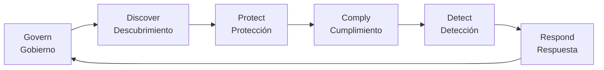

# Video 12 — Protección de datos personales

> **1h 19min 46s** · subido el **07/11/2025** · **oculto** (accesible sólo por el link de la [[videografia|playlist]]) · docente **Ramele** · título literal en YouTube: *"Criptografía y Seguridad Informática - Protección Corpo de Datos Personales"* · mapea a **Clase 11 — Protección de datos** (05/11) del [[cronograma#Segunda mitad — Seguridad (hasta el 2do parcial)|cronograma]] · [Ver en YouTube](https://www.youtube.com/watch?v=Pds9m2ubU7c)
> **Es una clase en vivo, pero la que menos marcas deja de las once.** No hay una sola pregunta de alumno audible en 1h20 —pide varias veces que lo paren y nadie lo para—, así que la evidencia es indirecta: a 1:07:34 dice *"asumo que sí, yo voy a continuar; que[da] grabada, ustedes la ven"*, a 40:24 *"estuvimos charlando también con los chicos"*, a 02:45 *"ya se los conté la otra vez"*, y a 42:10 remite a *"la otra clase de pen testing"*, que es el [[video-09-pentesting-metodologia|Video 09]].

**Para qué sirve mirarlo:** es **la única fuente que el vault tiene sobre protección de datos y compliance**, no hay filminas de esta clase en ningún lado, y el video muestra el deck entero de la portada al *"Fin!!"*. Lo que se lleva es **vocabulario con intuición**: el ciclo Govern-Discover-Protect-Comply-Detect-Respond, las siglas de las normas, los tres estados del dato, KEK-DEK, HSM y FIPS, los cuatro modelos de claves en la nube, TME y DLP. **Para qué no sirve:** para criptografía. **No hay una sola fórmula, ni un ejercicio, ni una demostración en toda la hora y veinte.** La criptografía aparece siempre como caja negra que se compra o se contrata, nunca como algo que se analiza.

---

> **Tres correcciones al catálogo del vault.**
>
> **1. Lo de "Corporativa" no se puede confirmar.** La [[videografia#Los 13, con sus datos duros|Videografía]] supone que *"Protección Corpo de Datos Personales"* es *"Corporativa"* cortado. Se buscó y **la palabra no aparece en el video para nombrar la clase**: la portada del deck dice sólo *"Protección de datos"*, el cierre a 1:19:32 la describe como *"un overview general de la parte de protección de datos personales desde el punto de vista de la organización"*, y la **única** aparición de la palabra en toda la transcripción es a 1:17:19, *"desde el punto de vista corporativo manejada"*, hablando de cómo comunicar una crisis. O sea: **como descripción del contenido "corporativa" es fiel —todo el enfoque es empresa, CSO, governance y compliance—, pero como reconstrucción del título es una conjetura, no una lectura.** El título literal se cita como está.
>
> **2. La fecha de subida es el 07/11/2025 a las 00:57, no el 06/11.** La versión anterior de la Videografía la daba como jueves 06/11 y la usaba, junto con la de *Pentesting*, como evidencia dura del mapeo: *"cada uno en el día de semana que le toca"*. Con la hora exacta la coincidencia se afloja —fue **viernes**, aunque por 57 minutos— y la [[videografia#La fecha de subida no dice cuándo se dictó|Videografía ya no se apoya en ese argumento]].
>
> **Ojo con cómo se lee esa fecha, porque hay una trampa.** El campo `upload_date` de `yt-dlp` viene en **UTC**, y estos videos se suben de noche: seis de los trece caen en el día siguiente al convertirlos. Un chequeo hecho sobre el campo crudo concluye que *"tres subidas caen en fin de semana"*, y **es falso** — en hora argentina no lo son. Las fechas de la Videografía estaban bien; lo que no vale es la inferencia.
>
> **Lo que sí liquida el argumento** es otro dato: el [[video-10-pentesting-laboratorio|video-10]] se subió el 02/07/2024, y los archivos que el docente sube en vivo durante esa clase se ven en pantalla fechados **2021-06-17**. Tres años entre el dictado y la subida. **La fecha de subida marca cuándo se publicó el lote, no cuándo se dictó la clase.** El mapeo de este video a la Clase 11 se sostiene igual, pero por tema, no por calendario.
>
> **3. Este video no es la Clase 10.** La Videografía lo mapea a la vez a *Clase 11 — Protección de datos* (05/11) y a *Clase 10 — Seguridad en la empresa* (29/10). Verificado: **es la clase de protección de datos, entera y sola.** Lo que hay hacia la Clase 10 son referencias hacia atrás —a 38:52 *"acá volvemos a lo que vieron conmigo… yo lo di en el marco de pen testing"*, a 02:45 *"ya se los conté la otra vez"*—, no contenido de seguridad en la empresa. La Clase 10 sigue sin video.

---

## 1. Recorrido

| Tramo | Tema | Vale mirarlo |
|---|---|---|
| 00:00-00:54 | Apertura: lo va a mirar desde la perspectiva del CSO y de la venta de seguridad | Salteable |
| 00:54-03:50 | **El problema**: la política de sueldos y el derrame del dato. Analogía del puente | **Sí, es la filmina madre** |
| 03:50-04:13 | El cartel rojo: los controles de acceso no alcanzan | Sí, corto |
| 04:13-05:56 | **Ciclo de la protección de la información**, las seis etapas | **Sí, es el índice de todo lo demás** |
| 05:56-07:40 | Data Governance y estándares internos | Sí |
| 07:40-08:12 | Data life cycle, la rueda de PwC | Sí, corto |
| 08:12-12:41 | **Ley argentina 25.326**, artículos 1 y 9, y habeas data | **Sí, es lo único de derecho local en todo el corpus** |
| 12:41-16:10 | GDPR, cookies, alcance extraterritorial y derecho al olvido | Sí |
| 16:10-20:24 | **PCI-DSS y la historia del pago electrónico**: 3-D Secure, banda, EMV, contactless, QR | **Sí, es el tramo aplicado del video** |
| 20:24-24:45 | HIPAA, PHI contra PII, anonimización, tokenización de PCI, residencia de datos | Sí |
| 24:45-26:48 | FDA Cybersecurity, FFIEC y Cyber Essentials: la autocertificación | Sí |
| 26:48-28:57 | SOX, Enron y la transparencia como principio rector | Sí |
| 28:57-29:43 | Data Roles: trustee, steward, custodian, user | Sí, corto |
| 29:43-33:51 | Clasificación de los datos y el ciclo plan-do-check-act. Seguridad unbounded | Sí |
| 33:51-35:42 | El mismo dato en tres estados: at-rest, in-motion, in-use | Sí, clave |
| 35:42-38:00 | Data Inventory, sus desafíos y data labeling | Sí |
| 38:00-38:30 | Ejemplo: AWS Tag Policy | Sí, corto |
| 38:30-43:47 | Enforcement compiler-time — **y cinco minutos de digresión sobre vibe coding** | Mitad y mitad |
| 43:47-45:57 | Enforcement execution-time y el ataque por acceso físico a memoria | Sí |
| 45:57-49:40 | Cifrado at-rest: file system cifrado y **esquema KEK-DEK** | **Sí, clave** |
| 49:40-56:29 | HSM, norma FIPS 1-4 y **la anécdota de Apple contra el Estado** | Sí — **7 minutos sobre una filmina fija** |
| 56:29-1:00:10 | Cifrado at-rest en la nube: SMK, CMK, BYOK, HYOK | **Sí, clave** |
| 1:00:10-1:00:56 | Cifrado in-transit: TLS, IPSEC, SSH | Salteable si viste el Bloque 1 |
| 1:00:56-1:03:51 | Cifrado en memoria: TME y TME-MK de Intel | Sí |
| 1:03:51-1:07:30 | SoC, IoT y seguridad embebida | Sí |
| 1:07:30-1:11:19 | Comply: auditoría, evidencia y plazos de retención | Sí |
| 1:11:19-1:14:44 | Detect: DLP, y **la anécdota del ransomware en una pyme** | Sí |
| 1:14:44-1:19:46 | Response: las primeras 24 horas y el más allá. Cierre | Sí |

---

## 2. El problema que abre la clase

La primera filmina después de la portada se llama *"El problema…"* y es la que estructura todo. Arriba, una política de empresa perfectamente razonable:

> **Un empleado no puede acceder a ver los sueldos de otros empleados.**

Abajo, el recorrido real del dato: sale de la base de **RR.HH.**, que tiene su **backup**; pasa por la **app de RR.HH.**; se copia a un **Drive**, donde queda como **XLS** con su propio **backup**; se abre en **Excel**; se manda por **Email**; y termina en una **nube**. El control de acceso cubre el primer nodo de siete. De ahí el cartel rojo que aparece sobre la misma filmina a 03:50:

> **Los controles de acceso en un sistema son parte de la solución pero no son suficientes.**

Esa filmina se reutiliza más adelante, a 34:44, superponiéndole las tres bandas *Data at-rest*, *Data in-motion* y *Data in-use*: es la misma imagen leída dos veces, primero como problema y después como taxonomía.

**El marco moral que le pone es la confianza delegada:** los datos personales no son propiedad de la empresa, el usuario se los presta para un uso particular, y la empresa asume el compliance de esa confianza. Es la idea que después justifica toda la regulación y que vuelve en los [[#6.1. Data Roles|Data Roles]].

Y la analogía con la que arranca —que aclara que ya contó otra vez— es la del puente: cualquiera tira un árbol de una orilla a la otra y cruza; hacer un puente con especificación, cálculo y márgenes de seguridad es ingeniería civil. La diferencia entre las dos cosas es exactamente la diferencia entre que algo funcione y que algo sea confiable.

---

## 3. El ciclo de la protección de la información

Es la filmina índice del video y, según él mismo, lo único que hay que llevarse sí o sí.

Las secciones [[#4. Governance: estándares internos y ciclo de vida del dato|4]] a [[#10. Response: las primeras 24 horas y el resto|10]] de esta nota son, una por una, las seis etapas: el video no se desvía del esquema en ningún momento y hasta usa una placa separadora con una caja fuerte abierta para anunciar cada una.

> [!quote]- Del video — qué pide que se lleven de la clase (05:48)
> "lo más importante que está bueno que ustedes se lleven son nombres, nombres de todas estas cosas y que las tengan en realidad, tratar de generarles un poco de intuición"

**Ésa es la única pauta de estudio que da sobre el grueso del video, y conviene tomarla al pie de la letra:** lo que se evalúa acá es nomenclatura con intuición asociada, no derivaciones. La segunda y última marca de examen está a 1:07:34 y se comenta en [[#8. Comply: auditoría y retención|§8]].

---

## 4. Governance: estándares internos y ciclo de vida del dato

**Data Governance** son todas las tareas para asegurar que los datos estén **seguros, privados, íntegros y disponibles** y que puedan usarse, durante todo el ciclo de vida — y son también las que **definen los roles** dentro de la organización para el uso de la información. Personas, procesos y tecnología, las tres cosas.

En la práctica se materializa en **estándares internos y políticas de datos** sobre cinco verbos (07:02):

| Recopilación | Almacenamiento | Procesamiento | Retención | Eliminación |
|---|---|---|---|---|

Se detiene en el último y pregunta al curso si todos saben qué significa que un dato **se borre de verdad**. La pregunta queda abierta acá y se cobra recién en [[#7.3. Cifrado at-rest: file system cifrado y KEK-DEK|§7.3]], donde aparecen *data remanence* y *secure deletion*.

El **data life cycle** (07:40, rueda tomada de `pwc.com`) tiene cinco etapas: *create and collect*, *store and transmit*, *use and distribute*, *retain*, *dispose and destroy*. La pregunta que hay que hacerse en cada una es la misma: **qué de esto es sensible y qué se va a hacer con ello.**

---

## 5. Las regulaciones, una por una

Media hora del video —de 08:12 a 28:57— es un recorrido por normativa. Es la parte más memorística y la que más se parece a una pregunta de parcial de nombrar y distinguir. La tabla resume; abajo va lo que cada una aporta.

| Norma | Qué regula | Origen | Lo que hay que retener |
|---|---|---|---|
| **Ley 25.326** | datos personales en Argentina | fines del siglo XX | el artículo 9 obliga a **demostrar explícitamente** las medidas, sin atarse a un algoritmo |
| **GDPR** | datos personales en la UE, aplicada en 2018 | Unión Europea | cookies, **alcance extraterritorial**, derecho al olvido, el dueño del dato manda sobre cualquier contrato |
| **PCI-DSS** | datos de tarjetas de crédito | industria de medios de pago | **acotar el scope a lo sensible** para acotar el costo; tokenización |
| **HIPAA** | datos de salud, 1996 | EE.UU. | PHI contra PII, anonimización, **residencia de datos en EE.UU.** |
| **FDA Cybersecurity** | dispositivos y sector médico | EE.UU. | track de ciberseguridad útil incluso fuera de lo médico |
| **FFIEC Assessment Tool** | sector financiero | EE.UU. | **autocertificación** con valor de declaración jurada |
| **Cyber Essentials** | general | Reino Unido | ídem, muy usado en Inglaterra |
| **SOX** | balances de empresas que cotizan, 2002 | EE.UU., post-Enron | **transparencia**; terminó siendo marco de facto para protección de datos |

### 5.1. Argentina: ley 25.326, artículo 9 y habeas data

La filmina *"Regulaciones Externas"* proyecta el texto de la ley, con las fuentes `oas.org/juridico/pdfs/arg_ley25326.pdf` y `learn.microsoft.com/es-es/compliance/regulatory/offering-pdpa-argentina` al pie.

**Artículo 1, objeto:** protección integral de los datos personales asentados en archivos, registros y bancos de datos, públicos o privados destinados a dar informes, para garantizar el derecho al honor y a la intimidad y el acceso a la información que sobre las personas se registre — en línea con el artículo 43, párrafo tercero, de la Constitución Nacional.

**Artículo 9, seguridad de los datos:** el responsable o usuario del archivo debe adoptar **las medidas técnicas y organizativas necesarias** para garantizar seguridad y confidencialidad, de modo de evitar adulteración, pérdida, consulta o tratamiento no autorizado, **y que permitan detectar desviaciones**, intencionales o no, ya sea que el riesgo provenga de la acción humana o del medio técnico utilizado. El inciso siguiente prohíbe registrar datos personales en archivos que no reúnan condiciones técnicas de integridad y seguridad.

Lo que elogia de la redacción es que **no ata la ley a ningún algoritmo concreto de la época** —que habría quedado obsoleto en cinco años—, sino a la obligación de demostrar qué se hace.

> [!quote]- Del video — el estándar que impone el artículo 9 (12:09)
> "Explícita más que implícita, no. Explícita. Yo estoy haciendo esto, son las cosas que estoy haciendo para proteger esta información que es sensible."

De la ley destaca además dos cosas de distinto valor. El **registro de bases de datos ante el gobierno** quedó desactualizado y es en la práctica impracticable, pero sigue vigente; reaparece más adelante como antecedente del [[#6.4. Data Inventory y sus desafíos|Data Inventory]]. Y el **habeas data**: la potestad del titular de exigirle a una empresa que dé de baja los datos que tiene sobre él. Lo explica por analogía con el *habeas corpus* —el derecho a acceder a ver a una persona detenida— y lo marca como antecedente innovador de lo que después hizo GDPR.

> **A 09:18 duda del número y llega a decir "23.326" antes de corregirse.** La filmina que está proyectando dice **25.326**, que es el número correcto. Vale la filmina, no el audio.

### 5.2. GDPR y derecho al olvido

*General Data Protection Regulation*, **aplicada en la Unión Europea en 2018** según la filmina. Tres rasgos:

- **Es la razón de las ventanitas de cookies.** El consentimiento explícito para el tratamiento sale de acá.
- **Alcance extraterritorial.** La UE se lo exige a **toda empresa que tenga actividad con la Unión aunque esté afuera**, y por efecto de mundo chico eso termina siendo casi todas: cumplir GDPR se volvió el default global.
- **La potestad final sobre el dato la tiene su dueño, por encima de cualquier cláusula contractual firmada.** Ninguna letra chica compra el derecho de propiedad sobre un dato personal.

El **derecho al olvido** es el derecho a demandar que información propia que es pública en internet desaparezca. El fundamento jurídico que da es el que conviene recordar porque no es técnico: si alguien cumplió su condena, **el tema se termina ahí y tiene que existir la posibilidad de empezar de vuelta**, en lugar de quedar estigmatizado de por vida por un resultado de búsqueda.

> **Errata del docente, no de la filmina:** a 12:49 dice que GDPR *"salió en el medio de la pandemia"*. La filmina que está proyectando en ese mismo momento dice **"Aplicada en la Unión Europea en el 2018"**, o sea antes. Vale la filmina.

### 5.3. PCI-DSS: 3-D Secure, EMV, contactless y tokenización

*Payment Card Industry Data Security Standard*, obligatorio para cualquier empresa que quiera operar con tarjetas. **Éste es el tramo aplicado del video y el que más se aleja de todo lo demás que hay en el vault**, porque es historia de ingeniería contada por alguien que la implementó: cuenta que trabajó en Visa haciendo **3-D Secure**, y que el problema original era la desconfianza de la gente a meter el número de tarjeta en internet.

La secuencia tecnológica que recorre, de peor a mejor y después de vuelta para atrás:

| Tecnología | Qué la caracteriza |
|---|---|
| **Banda magnética** | copiable sin más; lo único que tiene es un código verificador |
| **Chip EMV** | una especie de HSM chiquito adentro de la tarjeta, con una clave que **no se puede extraer** |
| **Contactless** | protocolo de por medio, sobre la misma idea del chip |
| **QR** | **un retroceso en seguridad** que ganó igual, por practicidad y costo |

El aporte metodológico de PCI, que es lo transferible: **identificar qué es sensible** —número de tarjeta, código de verificación, datos de la banda—, **acotar el scope de la protección a eso** y por lo tanto **acotar el costo de cumplir la norma**, incluso dejando procesos enteros deliberadamente afuera. Es el mismo argumento de scope que vuelve en [[#6.2. Clasificación de los datos|§6.2]].

La **tokenización** (22:55) es la vuelta de tuerca que PCI incorporó después: en vez de blindar la tarjeta en todos lados, se maneja un **token**, y **sólo el enlace token-tarjeta se guarda en el lugar más seguro**. El resto de los sistemas circula datos anonimizados, con lo cual quedan fuera del scope y la implementación se abarata.

> ***(Lectura nuestra.)*** Este bloque de 16:14 a 20:24, más el token de sesión estático que aparece en el [[video-09-pentesting-metodologia|Video 09]], son **prácticamente lo único que hay en video sobre autenticación** en todo el Bloque 2 — y no son la clase de autenticación, que es la **Clase 7** del cronograma y **no tiene grabación**. Si el parcial pregunta autenticación, esto no alcanza. La advertencia relevante viene de otro video del canal: *"ojo en el parcial con autenticación versus control de acceso"*.

### 5.4. HIPAA, PHI y PII

*Health Insurance Portability and Accountability Act of 1996*. Protege datos de salud, que llama **doblemente personales**.

La distinción que importa:

- **PHI** — *personal health information*: la información médica en sí.
- **PII** — información personalmente identificable. En la filmina figura como **PPI**.

**Por qué la distinción cambia el diseño:** un registro de electroencefalografía o un registro cardíaco puede ser altísimamente sensible y sin embargo estar **anonimizado**, de modo que alguien que acceda no puede saber de quién es. Una **historia clínica**, en cambio, tiene las dos cosas juntas, y por eso es el peor caso. La anonimización es lo que permite separar el valor de investigación del riesgo de identificación.

Cierra con la **residencia de datos**: los registros médicos de EE.UU. **no pueden salir físicamente de EE.UU.**, lo que choca de frente con el modelo cloud y reaparece en [[#7.5. Cifrado at-rest en la nube|§7.5]].

> **Hueco declarado.** A 22:04 menciona una norma específica de historias clínicas globales, dice algo como *"patient history regulation"* y **admite en cámara que no se acuerda el nombre**. No aparece en ninguna filmina y acá no se completa de memoria.

### 5.5. FDA, FFIEC y Cyber Essentials: la autocertificación

De la **FDA** —el organismo estadounidense que regula todo lo médico— dice que tiene un track enorme de ciberseguridad, producto de la digitalización del sector, con regulaciones que considera buenas **incluso fuera de lo médico** y que alcanzan también a los dispositivos.

Lo interesante del tramo es el mecanismo que comparten **FFIEC Assessment Tool** (financiero, EE.UU.) y **Cyber Essentials** (Reino Unido): la **autocertificación**. Son planillas donde la propia empresa hace un paso a paso y queda como **curadora de su propio proceso**. Tienen valor de **declaración jurada**: mentir en la declaración ya implica culpabilidad, y eso es lo que las hace exigibles sin auditor de por medio.

**La razón de existir de todo el esquema es económica: las auditorías de seguridad son carísimas.** Vuelve sobre esto en [[#8. Comply: auditoría y retención|§8]].

### 5.6. SOX y la transparencia como principio

*Sarbanes-Oxley Act*, ley federal de EE.UU. de **2002**, nombrada por los dos senadores que la propusieron. Surge del **escándalo de Enron**, que fraguó sus balances mientras cotizaba en bolsa. El razonamiento: las empresas públicas atraen inversión de terceros, así que están obligadas a tener las cuentas claras y a ser lo más transparentes posible.

Terminó **tomándose como marco de facto para cuidado y protección de datos**, más allá de lo contable, y de ahí que aparezca en una clase de esta materia.

> [!quote]- Del video — la transparencia como principio de seguridad (27:44)
> "la transparencia es un gran principio de seguridad y es un principio rector muy fuerte"

**Ése es el hilo que ata el video de punta a punta:** la transparencia justifica SOX acá, justifica el [[video-07-principios-de-diseno-2024#5. Diseño abierto|diseño abierto]] del que ya se habló en Principios de Diseño, y justifica la moraleja del cierre en [[#10. Response: las primeras 24 horas y el resto|§10]]: ante una pérdida de datos, lo peor que se puede hacer es ocultarla.

> **Ojo con el orden de las filminas acá.** La placa *"Regulaciones Internacionales"* con SOX, FFIEC y FDA **aparece en pantalla a 18:47**, pero es sólo el docente scrolleando el deck para ubicarse: la **discusión** de esos tres temas ocurre entre 24:45 y 28:57. Lo mismo pasa entre 29:43 y 30:07. Si se busca por frame, no coincide con el audio.

---

## 6. Discovery: roles, clasificación, estados e inventario

### 6.1. Data Roles

Pirámide de cuatro niveles (28:57), de arriba hacia abajo:

| Rol | Qué es |
|---|---|
| **Data Trustee** | posición de **nivel gabinete**, con responsabilidad global sobre los datos de su unidad |
| **Data Steward** | aprueba el acceso a los datos **sensibles o restringidos** de su dominio |
| **Data Custodian** | **autorizado por un steward** para dar acceso a elementos dentro de ese dominio |
| **Data User** | individuo autorizado a acceder a los datos |

Lo que subraya al presentarla es la cesión de confianza otra vez: **el usuario presta sus datos y sigue siendo el dueño**, y toda la cadena de roles existe para administrar algo prestado. No es una jerarquía de propiedad sino de responsabilidad delegada.

### 6.2. Clasificación de los datos

Filmina de 30:07, con las cuatro etapas a la izquierda y la rueda **PLAN - DO - CHECK - ACT** a la derecha:

| Etapa | Qué incluye |
|---|---|
| **Planificar** | identificar los activos, identificar los roles sobre esos datos, definir perfiles de acceso |
| **Ejecutar** | educar a los involucrados, desplegar la tecnología |
| **Monitorear** | revisar log y alertas |
| **Reaccionar** | reclasificar, y bloquear o permitir — y volver a planificar |

El argumento de fondo es económico y es el mismo que el de PCI: hay que **acotar el scope**, porque la seguridad no tiene techo.

> [!quote]- Del video — por qué hay que poner un límite (30:43)
> "de vuelta seguridad es unbounded. Ustedes pueden hacer todo lo paranoico que quieran y eso chupa dólar básicamente."

Es exactamente la idea de **seguridad unbounded** que ya está desarrollada en [[video-07-principios-de-diseno-2024#Tres hilos transversales|Principios de diseño (2024)]] y que se conecta con [[seguridad-computacional|seguridad computacional]]: el nivel de seguridad es una decisión de diseño, no un absoluto. Acá el aporte nuevo es que **la clasificación de datos es el instrumento concreto con el que se pone ese límite**.

El ejemplo histórico que da (33:00 aprox.) es bueno porque muestra el criterio cambiando con la tecnología: cuando `SSL` era caro —al punto de que se vendían **aceleradores por hardware**— tenía sentido servir las imágenes públicas sin cifrar y **cifrar sólo lo transaccional**. Hoy el procesamiento sobra y va todo cifrado. El criterio no cambió; cambió el precio del cómputo.

### 6.3. El mismo dato en tres estados

Vuelve al diagrama de RR.HH. de [[#2. El problema que abre la clase|§2]] y le superpone tres bandas:

| Estado | Dónde vive | Qué lo caracteriza |
|---|---|---|
| **Data at-rest** | servidor, disco, cluster | el dato quieto, sin usarse |
| **Data in-motion** | la red | transmitiéndose, **incluida la cuestión física del medio** |
| **Data in-use** | el procesador | en uso, cerca de cachés y memoria |

**La consigna es identificar por qué estados pasa cada dato y qué garantía de seguridad se provee en cada uno.** Es el índice de toda la sección [[#7. Protect, que es la parte técnica|7]]: at-rest en [[#7.3. Cifrado at-rest: file system cifrado y KEK-DEK|§7.3]] y [[#7.5. Cifrado at-rest en la nube|§7.5]], in-motion en [[#7.6. Cifrado in-transit|§7.6]], in-use en [[#7.7. Cifrado en memoria: TME y TME-MK|§7.7]].

### 6.4. Data Inventory y sus desafíos

El **Data Inventory** identifica y registra todos los datos críticos: **ubicación, uso, clasificación y responsables**. Sirve como guía de referencia para tomar decisiones, diseñar seguridad y aplicar políticas. Lo vincula explícitamente con el **registro de bases de datos** de la ley 25.326: la ley argentina pedía en los noventa lo que hoy se hace por otras razones.

La filmina de desafíos (36:27) es la parte útil, porque es la lista de por qué esto sale mal en la práctica:

- **Costo de mantenerlo actualizado**, y en particular **los flujos de los datos** — la filmina lo pone en negrita. Registrar dónde está un dato es fácil; registrar por dónde se mueve, no.
- **Costo de inventariar** y de descubrir tipos de datos nuevos.
- **Falta de educación** en su uso: se arma y después nadie lo consulta.
- **El propio inventario es dato sensible** y debe protegerse bajo las mismas reglas. Un mapa de dónde está todo lo valioso es exactamente lo que quiere un atacante.
- **Se desactualiza rápido** en empresas de dinámica ágil.

### 6.5. Data labeling y el ejemplo de AWS Tag Policy

La alternativa más ágil: **inventariar los datos dentro de los datos mismos**, con metadata. La clasificación **viaja pegada al dato** en vez de vivir en un registro central, lo que descentraliza el inventario y simplifica las reglas de protección y monitoreo. **La contra es que no está estandarizado**: cada sistema tiene que traducir las etiquetas del otro.

El ejemplo moderno (38:00) es un JSON de policy de AWS —versión `2012-10-17`— anotado en rojo con tres marcas que traducen la policy a la terna clásica de control de acceso:

| Marca en la filmina | Campo del JSON | Qué contiene |
|---|---|---|
| **SUJETO** | `Principal` | el `arn` de un role |
| **OBJETOS** | `Resource` | el `arn` del bucket |
| **ETIQUETA** | `Condition` | `StringEquals` sobre `s3:ExistingObjectTag/environment` igual a `production` |

La idea que muestra: **la autorización no se escribe contra el recurso puntual sino contra la etiqueta**, así que la política sobrevive a que aparezcan objetos nuevos.

---

## 7. Protect, que es la parte técnica

### 7.1. Enforcement en compiler-time

Asegurar que el código cumple ciertas políticas de seguridad **antes de ser ejecutado**. Se hace en la fase de compilación: el compilador **analiza el fuente para detectar posibles violaciones** a las políticas — análisis estático de código. Lo que permite garantizar es que **datos clasificados como confidenciales no sean filtrados a variables o zonas de memoria de menor seguridad**. El ejemplo de la filmina, escrito en monoespaciada, es **`SecureString` de Java**.

El argumento con el que lo justifica: **software seguro es software de buena calidad**, y **no se puede proteger el dato sin proteger las herramientas que lo manipulan**.

De ahí se va a una **digresión de unos cinco minutos sobre vibe coding y asistentes de código** (38:52-43:47), que no tiene filmina propia —la de compiler-time queda fija toda la digresión— y que **no tiene contenido de examen**. La tesis, por si sirve: los asistentes son un **exponenciador**, y como todo exponenciador, **si lo que se hace es mayor a uno crece exponencialmente, y si es menor a uno tiende a cero**. Cierra pidiendo DevOps con tests de regresión e integración continua, que es lo mismo que ya está desarrollado en el [[video-09-pentesting-metodologia#2.3. La cadena de detección de bugs|Video 09]].

> [!quote]- Del video — la digresión sobre asistentes de código (41:23)
> "en un punto es dar metralladoras a un montón de monos, a los monkey developers, que todos somos monkey developers en algún momento"

### 7.2. Enforcement en execution-time

Técnicas para **monitorear y controlar cómo se transmite la información entre componentes** en tiempo de ejecución. Se implementa a nivel aplicativo o de infraestructura —y ahí es donde entra **DLP**, que se retoma en [[#9. Detect: DLP y el ransomware de la pyme|§9]]—. Requiere entender el movimiento de datos entre procesos, entre niveles de seguridad y entre estados del sistema.

Nombra **las claves como el dato de máxima sensibilidad** y las estructuras de lenguaje que las cuidan en ejecución, y de ahí baja a arquitectura: cómo el proceso accede a **caché L1 y L2**, cómo copia a la **RAM**, cómo le pide servicios al **HSM**.

**El riesgo concreto que plantea es el que hace bisagra con todo lo que sigue:** frenar el proceso, hacer **tampering físico** y leer la memoria en claro, salteando de un saque todas las capas de protección de arriba. Señala también las implicancias geopolíticas de que alguien pueda sacarle la información a un celular — que es literalmente la anécdota de [[#7.4. HSM y la norma FIPS|§7.4]].

> [!quote]- Del video — por qué el acceso físico invalida las capas de arriba (45:21)
> "¿De qué me sirve tener algo recontraprotegido si de repente yo simplemente puedo ejecutarlo y accedo al dato que está en la memoria?"

### 7.3. Cifrado at-rest: file system cifrado y KEK-DEK

**El file system cifrado, tal como lo describe:** en el boot se pide un password, **de la autenticación se deriva una clave simétrica**, y con ella se descifra el disco **por bloques encadenados**, tipo [[modos-de-encadenamiento#Los cinco modos|CBC]].

**El problema del reposo**, planteado como pregunta: ¿por qué no alcanza con eso? Porque el atacante **se lleva el disco físico**, se lo pone en su laboratorio y **le tira todo el hardware que tenga encima**. Deja de ser un problema de protección y pasa a ser un problema de tiempo y de [[seguridad-computacional|seguridad computacional]]: un [[ataque-de-fuerza-bruta|ataque de fuerza bruta]] sin restricción de intentos ni de tiempo, contra **una única clave que abre todo**.

**De ahí sale el esquema KEK-DEK**, que es el ejemplo desarrollado de este tramo:

| Sigla | Nombre | Rol |
|---|---|---|
| **KEK** | *Key Encryption Key* | clave que **cifra otras claves**; en el diagrama se activa desde un pendrive |
| **DEK** | *Data Encryption Key* | clave que **cifra y descifra los datos** del disco |

La cadena que muestra la filmina son **dos bloques E/D encadenados**: el pendrive activa la KEK, la KEK descifra la clave siguiente, y así hasta llegar a la DEK, que es la única que toca los datos. **Qué se gana con la indirección:**

1. **Se puede rotar.** Cambiar la DEK sin recifrar todo, o cambiar la KEK sin tocar la DEK. De ahí que la filmina traiga **Key Lifecycle** como ítem propio.
2. **Se acota el impacto del robo de una clave**, porque ninguna clave sola alcanza.
3. **Se separa el factor de autenticación del dato**: sin el pendrive, el disco robado no arranca la cadena.

La misma filmina lista implementaciones —**EncFS Loop-AES**, **EFS** de Windows, **FileVault** de Mac OS X— y deja dos ítems marcados con **(X)**, que son la respuesta diferida a la pregunta de [[#4. Governance: estándares internos y ciclo de vida del dato|§4]]:

- **Data remanence** — el dato deja rastro físico después de borrado.
- **Secure deletion** — borrar de verdad es un procedimiento, no un `rm`.

Los dos aparecen nombrados y **no se desarrollan** en el video.

> **Hueco.** A 46:52 nombra el file system cifrado de Linux como *"el fs"* y el audio no da para más. Por la filmina siguiente **probablemente sea EncFS**, pero podría ser eCryptfs. No se afirma. ***(Lectura nuestra, y con poca confianza.)***

### 7.4. HSM y la norma FIPS

**HSM** — *Hardware Security Module*. La idea, tal como la plantea: **la clave simétrica es lo más sensible que existe**, porque da acceso a todo el resto. Así que se la mete en un hardware que **implementa adentro todos los algoritmos**, simétricos y asimétricos, y **nunca la expone**: uno no obtiene la clave, uno **le pide al módulo el servicio de cifrado**. Tienen distintos niveles de antitampering. En la filmina aparece junto a un **Keystore**, un **Security Appliance**, un token RSA y una base de datos.

**La norma FIPS**, que define **NIST** —el organismo de estándares del sector público estadounidense, que se transformó en el organismo por default a nivel global—, clasifica estos dispositivos en **niveles 1 a 4**. El nivel 4 lo explica con la imagen que se acuerda todo el mundo: **si explota una bomba atómica al lado del HSM hay dos resultados posibles, o el módulo se desintegra totalmente y no existe más, o si existe la clave sigue sin poder ser accedida.** Es el nivel de usos militares.

#### La anécdota de Apple contra el Estado (50:57)

Es el ejemplo del tramo y el que mejor ilustra por qué el acceso físico rompe todas las capas de arriba.

1. Tras el atentado de la **maratón de Boston** queda un **iPhone bloqueado**, y el **Departamento de Estado le pide a Apple** que le dé acceso salteando el código de verificación del PIN.
2. **Apple contesta que no tiene forma.**
3. El argumento por el que eso es creíble, que es la parte que importa: **un backdoor propio es un exploit en potencia**. Si existe una puerta que la empresa puede abrir, esa puerta es una vulnerabilidad, y tarde o temprano la abre otro.
4. **Cómo terminó:** el Estado contrató a una empresa privada que hizo **tampering del hardware** y **puenteó el contador de intentos del PIN**. Sin límite de intentos, probar **todas las combinaciones de cuatro dígitos** es trivial. Entraron.
5. Después Apple corrigió el esquema.

> [!quote]- Del video — por qué no puede existir un backdoor sólo para el fabricante (52:52)
> "Si yo puedo entrar como empresa, puede entrar cualquiera en definitiva."

**Lo que hay que sacar del caso:** el PIN de cuatro dígitos no es seguro por su espacio de claves —diez mil combinaciones no son nada—, sino **por el contador de intentos**, que es un control de ejecución. Quitá el control y el espacio de claves queda desnudo. Es el [[ataque-de-fuerza-bruta#Principio de espacio de claves suficiente|principio de espacio de claves suficiente]] mostrado por el lado en que falla.

> **Este tramo está reconstruido sólo desde el audio.** Entre 49:40 y 56:29 **no hay un solo cambio de frame**: la filmina del HSM queda fija durante toda la anécdota. Y el propio docente duda del modelo de teléfono (*"no me acuerdo si era el iPhone 10 o algo así"*), así que no se afirma cuál era.

### 7.5. Cifrado at-rest en la nube

El planteo: **la nube es infraestructura de terceros**, así que el trust que el usuario depositó en la empresa **se está derivando** a alguien que el usuario no eligió. Toda la filmina es un abanico de cuánto de ese trust se delega.

El árbol se abre primero en dos: **Cloud Workload con encripción nativa de la nube** contra **Cloud Workload con encripción propia**. Debajo, cuatro modelos, con dos flechas en sentido opuesto — **eficiencia operativa** hacia un lado, **seguridad respecto del proveedor** hacia el otro. Fuente al pie: `datacenterknowledge.com`.

| Modelo | Quién administra la clave | Qué gana | Qué pierde |
|---|---|---|---|
| **Service Managed Keys** (SMK) | el proveedor, entero | **máxima eficiencia operativa**: no se gestiona nada | el proveedor **decide la rotación**, no se accede a las claves privadas ni se pueden usar para cifrar más de lo que él decida |
| **Customer Managed Keys** (CMK) | el cliente, sobre infraestructura del proveedor | control de la política | la clave sigue viviendo del lado del proveedor |
| **Bring Your Own Keys** (BYOK) | el cliente **administra y rota** sus propias claves | control real del ciclo de vida | costo operativo propio |
| **Hold Your Own Keys** (HYOK) | el cliente, sin soltarlas nunca | **máxima seguridad frente al proveedor** | máximo costo y mínima integración |

Los casos que recorre en voz: el **proceso propio que cifra y descifra** usando el servidor de la nube como mero repositorio; **BYOK** con el cliente rotando sus claves; y un **caso mixto** que es el más interesante — **la nube le presta un HSM al cliente**, el cliente usa la clave **sin poder verla**, y el proveedor tampoco puede.

Cierra el tramo con las dos cosas que la nube complica y que ya venían de antes: **dónde están físicamente los datos** —la residencia de HIPAA de [[#5.4. HIPAA, PHI y PII|§5.4]]— y **backup y disponibilidad**.

### 7.6. Cifrado in-transit

El tramo más corto del video, y con razón: es lo que ya está desarrollado en el Bloque 1. Datos moviéndose entre ubicaciones, y **dos caminos**:

1. **Cifrar antes de mover.** Se cifra un archivo con `GPG` y se manda por mail. El transporte puede ser cualquiera.
2. **Usar protocolos de transporte que soportan encripción.** `SMTP` sobre `TLS` es el ejemplo de la filmina; menciona además `IPSEC` y `SSH`.

Él mismo observa que **buena parte de la materia giró alrededor de esto**, y no agrega nada nuevo. Salteable si vienes del Bloque 1.

### 7.7. Cifrado en memoria: TME y TME-MK

Éste sí es contenido que no está en ninguna otra parte del vault.

El planteo: **los datos en memoria pueden verse como at-rest** —quietos, esperando que la CPU los use— **o como in-transit**, viajando entre el bus de IO y la CPU. Y con **múltiples VMs sobre la misma memoria física** aparece el riesgo de que una lea lo de otra.

**TME — Total Memory Encryption** (1:02:20). Mecanismo de Intel implementado en hardware: **una sola clave de encripción compartida por todos los procesos**, y **la desencriptación ocurre dentro de la CPU, antes del cache**. La consecuencia es la que hay que retener: **todo lo que está en la DRAM está cifrado, siempre**. Un atacante con acceso físico que se cuelgue del bus de memoria no lee ni modifica nada en claro — que es exactamente el ataque de [[#7.2. Enforcement en execution-time|§7.2]]. El diagrama de Intel muestra Core, Cache, **AES XTS**, DRAM Controller y NVRAM Controller.

**TME-MK — Total Memory Encryption Multi-Key** (1:03:31). Variante con **múltiples claves** y **control de acceso soportado por los registros de VT-x**. En el diagrama, cada **VM** tiene su conjunto de **KeyIDs**, y **el KeyID viaja embebido en la entrada de la tabla de páginas** de la dirección física — o sea que **cada página de memoria física se cifra con la clave que le corresponde**, y el aislamiento entre VMs deja de depender sólo del hipervisor.

***(Lectura nuestra.)*** El `AES XTS` del diagrama es el modo de cifrado de disco y memoria, y no es ninguno de los cinco [[modos-de-encadenamiento|modos de encadenamiento]] que se ven en la materia. El video no lo explica ni lo nombra en voz: aparece sólo como una caja del diagrama de Intel.

### 7.8. SoC, IoT y embebidos

**El peor escenario de todos**, y el argumento de por qué es una buena síntesis de toda la clase. La filmina lista los problemas:

| Problema | Por qué |
|---|---|
| **Tampering** | los aparatos están **físicamente accesibles**: el atacante los tiene en la mano |
| **Arquitecturas abiertas** | protocolos y buses públicos, pensados para integrar, no para resistir |
| **Debug complejo** | el trade-off entre **poder diagnosticar** y **exponer un vector**: `JTAG` es a la vez la funcionalidad y el agujero |
| **Wireless** | el medio de transmisión es el aire |
| **Diversidad y escala** | millones de dispositivos heterogéneos, imposibles de parchear a la vez |
| **Riesgo físico** | lo que falla no es un registro, es un semáforo |

El ejemplo que usa para el debug es justamente el **semáforo**: el fabricante necesita una interfaz para diagnosticarlo en la calle, y esa misma interfaz es por donde entra el que lo quiere romper.

Debajo, las tres capas del modelo IoT: **Perception Layer**, **Application Layer** y **Network Layer**. Y como ejemplo de HSM para embebidos muestra el chip **ATECC608A** de Microchip — la contraparte miniatura del rack de [[#7.4. HSM y la norma FIPS|§7.4]], y la misma idea que el chip EMV de la tarjeta en [[#5.3. PCI-DSS: 3-D Secure, EMV, contactless y tokenización|§5.3]].

> **Tramo reconstruido desde el audio.** Entre 1:04:00 y 1:07:30 la filmina de SoC queda fija.

---

## 8. Comply: auditoría y retención

La placa separadora es **una viñeta de Daniel Paz** —un abuelo y un chico— con el texto *"No basta con ser bueno… también hay que parecerlo"* y el pie *"Mi abuelo era un genio"*. Es la definición de compliance en una línea: **no alcanza con estar protegido, hay que poder demostrarlo.**

> [!quote]- Del video — la viñeta de la placa de Cumplimiento (1:07:57)
> "No basta con ser bueno... también hay que parecerlo."

Justo antes de esa placa está **la única marca explícita de examen del video**:

> [!quote]- Del video — la marca de examen (1:07:34)
> "Bien, estamos hasta acá. Asumo que sí. Yo voy a continuar; que[da] grabada, ustedes la ven tanto para el segundo parcial como para el final."

**Qué significa exactamente, sin inflarlo:** se estaba acabando el tiempo de clase presencial y avisa que sigue grabando el último tercio —Comply, Detect y Response— para que se vea después, **y que ese material entra en el segundo parcial y en el final**. **No dice que esa parte se tome y el resto no**, ni dice qué tipo de pregunta va a haber. Es un aviso de continuidad, no un recorte de programa.

El contenido de la etapa: **las regulaciones imponen auditoría y certificación**, y por lo tanto **todos los procesos, la tecnología y las personas tienen que dejar registro y evidencia** de que están funcionando correctamente. Menciona **waivers** —excepciones formales— y vuelve sobre la autocertificación inglesa de [[#5.5. FDA, FFIEC y Cyber Essentials: la autocertificación|§5.5]] como la salida barata frente a auditorías carísimas.

La filmina de **retención** (1:09:51) son tres recortes de pantalla superpuestos con los plazos reales:

| Norma | Plazo | Desde cuándo |
|---|---|---|
| **HIPAA** | **6 años** | desde la fecha en que el contenido —logs, notas o registros relacionados con una política o procedimiento— se usó por última vez o dejó de estar vigente |
| **SOX** (modificada en 2003) | **7 años** | después de concluida la auditoría o revisión de los estados financieros |
| **PCI DSS**, requerimiento 3.1 | sin plazo fijo | exige **tener y seguir procedimientos** de retención y destrucción, para que lo que ya no se necesita se borre pronta y adecuadamente |

**Retención es guardar información que ya no es necesaria para operar**, por motivos regulatorios, legales o de análisis forense. Es la contracara de la eliminación de [[#4. Governance: estándares internos y ciclo de vida del dato|§4]]: un dato no se borra cuando deja de servir, se borra cuando vence su plazo.

> [!quote]- Del video — dónde se pone la seguridad en un proyecto (1:09:20)
> "muchas veces en muchos aspectos la seguridad termina siendo un add que se agrega al final, lo cual es lo peor que se puede hacer"

---

## 9. Detect: DLP y el ransomware de la pyme

**DLP — Data Loss Prevention.** Herramientas que ayudan en la **clasificación**, el **inventariado** y la **detección** de información **en todos sus estados**. La definición que hay que retener es la clasificatoria:

> **DLP no es un control preventivo ni correctivo: es un control detectivo.** Se activa **cuando ya falló la aplicación de una política**.

La segunda filmina cuenta la historia del mercado, y es más interesante de lo que parece: **fueron muy difíciles de implementar** porque, a diferencia de otras soluciones de seguridad, **requieren un esfuerzo de toda la compañía** — hay que clasificar todo, etiquetar todo y educar a todos. Resultado: **todas las empresas que nacieron haciendo DLP terminaron compradas**, y hoy las funcionalidades vienen **incorporadas en los productos de uso diario**. La rueda de la filmina muestra una *DLP policy* en el centro —monitoring, prevention, discovery and protection— rodeada de los canales por donde se fuga el dato: email, webmail, instant message, FTP, cloud, storage, databases, SharePoint. Es, otra vez, el diagrama de derrame de [[#2. El problema que abre la clase|§2]].

### El ransomware, que es más importante de lo que parece

De 1:12:09 a 1:14:44 cuenta el caso de **una pyme argentina a la que ayudó con un ransomware**, y explica **por qué pagar no garantiza nada**: el software del atacante **no está probado para toda plataforma**, y en algún escenario **destruye los datos** en vez de devolverlos. No hay QA del otro lado. Pagar compra una promesa hecha por un binario que nadie testeó contra tu configuración.

Cierra con sus **hipótesis de falla** sobre por dónde entran estas cosas, que es la misma lista de puntos calientes del [[video-09-pentesting-metodologia#4.2. Paso 1 — Recolección de información (43:25)|Video 09]]: **las interfaces**, **los procesos con mucha rotación de gente** y **el trabajo con consultoras externas**.

> **Registrar esto importa más allá de la anécdota.** Se contaron las menciones de malware, virus, gusano, troyano y ransomware en los ocho videos del Bloque 2: **hay un solo hit en todo el corpus, y es éste**. La **Clase 9** del cronograma se llama *"Flujo de información y malware"*; el video que cubre esa clase cubre el flujo de información y **no dice una palabra de malware**. O sea que estos dos minutos y medio de anécdota son, literalmente, **todo lo que hay en video sobre malware en la materia** — y son una anécdota, no una taxonomía. Si el parcial pregunta tipos de malware, esto no alcanza y hay que ir al Bishop.

---

## 10. Response: las primeras 24 horas y el resto

La checklist de las **primeras 24 horas** (1:15:46) es una tira de iconos con una banda roja que dice *WHAT TO DO IN THE FIRST 24 HOURS*, tomada de `comodosslstore.com`. Las diez acciones:

1. **Registrar fecha y hora** del incidente.
2. **Alertar a todos.**
3. **Asegurar las instalaciones** (*secure the premises*).
4. **Frenar la exfiltración** de datos.
5. **Documentar todo.**
6. **Entrevistar a todos los involucrados.**
7. **Revisar los protocolos de comunicación.**
8. **Evaluar prioridades y riesgos.**
9. **Traer un equipo forense.**
10. **Notificar a las autoridades.**

La rueda de **más allá de las 24 horas** (1:18:49) tiene cinco: **trabajar con forensics**, **identificar las obligaciones legales**, **reportar a la alta gerencia**, **identificar posibles batallas** y **corregir el issue** — y de ahí vuelta al ciclo de [[#3. El ciclo de la protección de la información|§3]].

**La moraleja del video entero está acá**, y es la misma transparencia de [[#5.6. SOX y la transparencia como principio|§5.6]]:

> [!quote]- Del video — qué hacer ante una pérdida de datos (1:17:06)
> "siempre es mejor cuando hay un problema de seguridad, una pérdida de datos, de todo lo que pueden hacer, lo peor que pueden hacer es intentar ocultarlo"

Lo único que se demora es **lo justo para armar la comunicación**, no el hecho de comunicar. Menciona además **bajar el defcon** —reducir el nivel de exposición mientras dura el incidente— y da como ejemplo cotidiano de control automático el **bloqueo de la cuenta tras tres intentos de password**, que es el mismo contador del caso Apple de [[#7.4. HSM y la norma FIPS|§7.4]] visto desde el lado del defensor.

Termina con la placa **"Fin!!"** sobre la caja fuerte y un buena suerte.

---

## 11. Qué no se pudo ver, y qué no da este video

**Cómo está compuesto el video.** Deck de Google Slides más la cámara del docente en un recuadro arriba a la derecha. **No hay pizarrón, no hay demo en vivo y no hay ningún alumno audible** en toda la clase, aunque pide varias veces que lo interrumpan. Nada de lo de acá viene de una discusión: es todo filmina más monólogo.

**Límites de lectura de las filminas.** El barrido de frames salió a 512 px de ancho, que alcanza para los títulos y el cuerpo de las filminas de texto pero **no para la letra chica dentro de las imágenes embebidas**. Se re-extrajeron diez frames a 1280 px para las filminas críticas —ley 25.326, regulaciones internacionales, data roles, estados del dato, KEK-DEK, nube, TME-MK, SoC, retención y *beyond 24 hours*—, y ésas sí se leyeron completas. **Quedan sin leer en detalle los rótulos internos de:** la rueda del data life cycle de PwC (07:40), la rueda de Data Inventory de Soteria (35:42), los dos gráficos de Gartner de DLP (1:12:09) —entre ellos *"Five Steps to a Successful DLP Implementation Framework"*—, la rueda de canales de *DLP hoy en día* (1:12:59) y el diagrama de TME simple de Intel (1:02:20). De ésos se describió lo que se ve, no lo que dice la letra chica.

**Tres tramos están reconstruidos sólo desde el audio**, porque la filmina no cambia: **38:47-43:47** (compiler-time y la digresión sobre vibe coding), **49:40-56:29** (HSM, FIPS y la anécdota de Apple) y **1:04:00-1:07:30** (SoC). Son casi veinte minutos de los ochenta.

**Una inconsistencia de timestamp, anotada.** El callout rojo sobre *Service Managed Keys* quedó registrado a **1:00:59**, pero a esa altura ya están en pantalla las filminas de in-transit y de memoria. **El contenido del callout es confiable —está en [[#7.5. Cifrado at-rest en la nube|§7.5]]—, el momento exacto no.** Probablemente corresponda al tramo de la nube, antes de 1:00:10.

**Huecos declarados, que no se completaron de memoria:**

- A **05:33** dice una sigla que el ASR transcribe como *"el nata whpol"*, junto con *"como si fuese un lavarropa, un trompo, un vórtice"*. No se pudo reconstruir a qué se refiere; el frame de ese momento es la filmina del ciclo, que no aporta.
- A **22:04**, la norma de historias clínicas cuyo nombre él mismo no recuerda. Ver [[#5.4. HIPAA, PHI y PII|§5.4]].
- A **46:52**, *"el fs"* de Linux. Ver [[#7.3. Cifrado at-rest: file system cifrado y KEK-DEK|§7.3]].
- A **54:27**, el modelo de iPhone del caso Boston, que él mismo duda.
- A **1:17:40** busca una expresión —dice *"atajar las fallas"*, *"análisis de baja"*— y no la encuentra. No queda claro qué término técnico quería.

**Dos errores del propio docente, corregidos contra la filmina que estaba proyectando:** el año de GDPR (ver [[#5.2. GDPR y derecho al olvido|§5.2]]) y el número de la ley (ver [[#5.1. Argentina: ley 25.326, artículo 9 y habeas data|§5.1]]).

**Errores del ASR corregidos por contexto, para que nadie los busque tal cual:** *"avias data"* y *"avias corpus"* = habeas data y habeas corpus · *"IPA"* = HIPAA · *"FFC"* y *"FFIS"* = FFIEC · *"TR Secure"* = 3-D Secure · *"MB"* = EMV · *"concl"* = contactless · *"HCM"* = HSM (aparece decenas de veces) · *"flips"* = FIPS · *"East"* y *"Nist"* = NIST · *"ades"* y *"ASES"* = AES · *"calet"* y *"calo"* = caché · *"BTX"* = VT-x · *"Ranson War"* y *"Ranson Muar"* = ransomware · *"Small War"* = small world · *"service mash key"* = Service Managed Keys · *"Warlock"* = workload · *"penrive"* = pendrive · *"Fileevolt Max Ox"* = FileVault Mac OS X · *"SL"* y *"SCL"* = SSL · *"inscripción"* = encripción, sistemáticamente · *"Jason"* = JSON · *"BM"* = VM · *"waver"* = waiver · *"ISU"* = issue · *"datalics"* = data leaks · *"Soxan Oxley"* = Sarbanes-Oxley.

### Las fuentes impresas al pie de las filminas

Varias filminas traen la URL de donde salió el gráfico. Sirven si se quiere el original en alta resolución de lo que acá quedó ilegible:

| Filmina | Fuente |
|---|---|
| Texto de la ley 25.326 | `oas.org/juridico/pdfs/arg_ley25326.pdf` · `learn.microsoft.com/es-es/compliance/regulatory/offering-pdpa-argentina` |
| Data life cycle | `pwc.com` |
| Data Inventory | `blog.soteria.io` |
| DLP | `gartner.com` |
| Cifrado at-rest en la nube | `datacenterknowledge.com` |
| TME-MK | `intel.com` |
| Checklist de las primeras 24 horas | `comodosslstore.com` |

### Lo que este video no da

- **No da criptografía.** Cero fórmulas, cero ejercicios, cero demostraciones. `AES`, `TLS` y los HSM aparecen como cajas negras que se compran o se contratan. Si se busca la primitiva, va a [[aes|conceptos]]; acá está sólo el uso organizacional.
- **No cubre control de acceso.** Lo dice al revés: la clase **arranca** demostrando que el control de acceso no alcanza. El tema tiene clase propia —**Clase 6**— y **no tiene grabación** en el canal.
- **No cubre autenticación.** Ver la advertencia de [[#5.3. PCI-DSS: 3-D Secure, EMV, contactless y tokenización|§5.3]].
- **No cubre malware.** Ver la advertencia de [[#9. Detect: DLP y el ransomware de la pyme|§9]].
- **No hay filminas de cátedra detrás de esto.** El deck es un Google Slides propio del docente y no existe como PDF en el vault. **Esta nota es la única forma en que el vault retiene ese deck**, que es la razón por la que está desarrollada filmina por filmina y no resumida.

---

## 12. Ver también

- [[videografia#Los 13, con sus datos duros|Videografía]] — el catálogo de los 13 videos. **Necesita las tres correcciones del encabezado de esta nota**: el título *"Corpo"*, la fecha de subida (07/11, no 06/11) y el mapeo doble a las Clases 10 y 11.
- [[cronograma#Segunda mitad — Seguridad (hasta el 2do parcial)|Cronograma]] — **Clase 11 — Protección de datos**, 05/11, y **Guía 10 — Seguridad en la empresa**, 09/11. Es la fila que este video cubre, y la única del Bloque 2 que queda cubierta entera por un solo video.
- [[programa-y-objetivos#Bloque 2 — Seguridad (Clases 6-11 · Guías 5-10 · 2do parcial)|Programa y objetivos]] — el programa agrupa *"Seguridad en la empresa · protección de datos"* en Clases 10-11 / Guía 10. De ese par, **este video cubre la mitad de protección de datos y ninguna de seguridad en la empresa**.
- [[video-09-pentesting-metodologia|Video 09 — Pentesting: metodología]] — el video al que remite explícitamente a 42:10 y a 38:52. Las hipótesis de falla de [[#9. Detect: DLP y el ransomware de la pyme|§9]] y la cadena de detección de bugs de [[#7.1. Enforcement en compiler-time|§7.1]] están desarrolladas allá.
- [[video-07-principios-de-diseno-2024#Tres hilos transversales|Video 07 — Principios de diseño (2024)]] — la **seguridad unbounded** con la que argumenta en [[#6.2. Clasificación de los datos|§6.2]] sale de ahí; acá se aplica al presupuesto de compliance.
- [[video-06-principios-de-diseno-2026#La digresión de los HSMs|Video 06 — Principios de diseño (2026)]] — la otra vez que aparecen los HSM en el corpus, mucho más corta. La versión desarrollada es [[#7.4. HSM y la norma FIPS|§7.4]] de esta nota.
- [[seguridad-computacional|Seguridad computacional]] y [[ataque-de-fuerza-bruta|Ataque de fuerza bruta]] — el fondo teórico del disco robado de [[#7.3. Cifrado at-rest: file system cifrado y KEK-DEK|§7.3]] y del contador de intentos del caso Apple: **sin límite de intentos, todo se reduce al espacio de claves y al tiempo disponible**.
- [[modos-de-encadenamiento#Los cinco modos|Modos de encadenamiento]] — el cifrado del file system que describe a 46:00 es cifrado por bloques encadenados.
- [[eleccion-de-primitivas|Elección de primitivas en un proyecto]] — *no inventes criptografía* y *no delegues el cien por ciento de la confianza en un producto* son el mismo criterio que ordena los cuatro modelos de claves en la nube de [[#7.5. Cifrado at-rest en la nube|§7.5]].
- [[ataque-de-diccionario-sobre-hashes|Ataque de diccionario sobre hashes]] — el PIN de cuatro dígitos del caso Apple es un dominio de baja entropía; lo único que lo protegía era un control externo, no la criptografía.
- [[tp-implementacion|TP de Implementación]] — el esquema **KEK-DEK** de [[#7.3. Cifrado at-rest: file system cifrado y KEK-DEK|§7.3]] y la separación entre clave de datos y clave de acceso son directamente aplicables a cómo se guarda una clave en una entrega.
